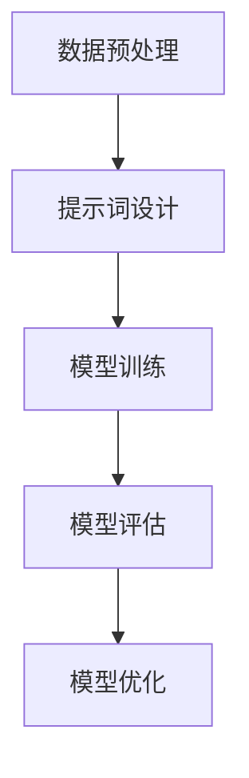
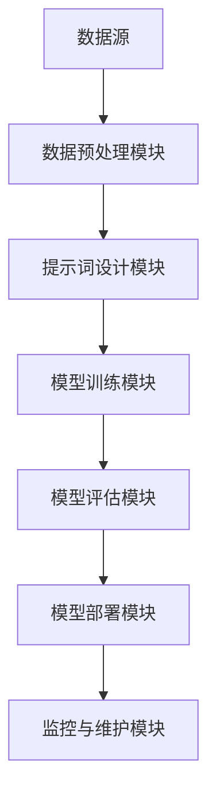
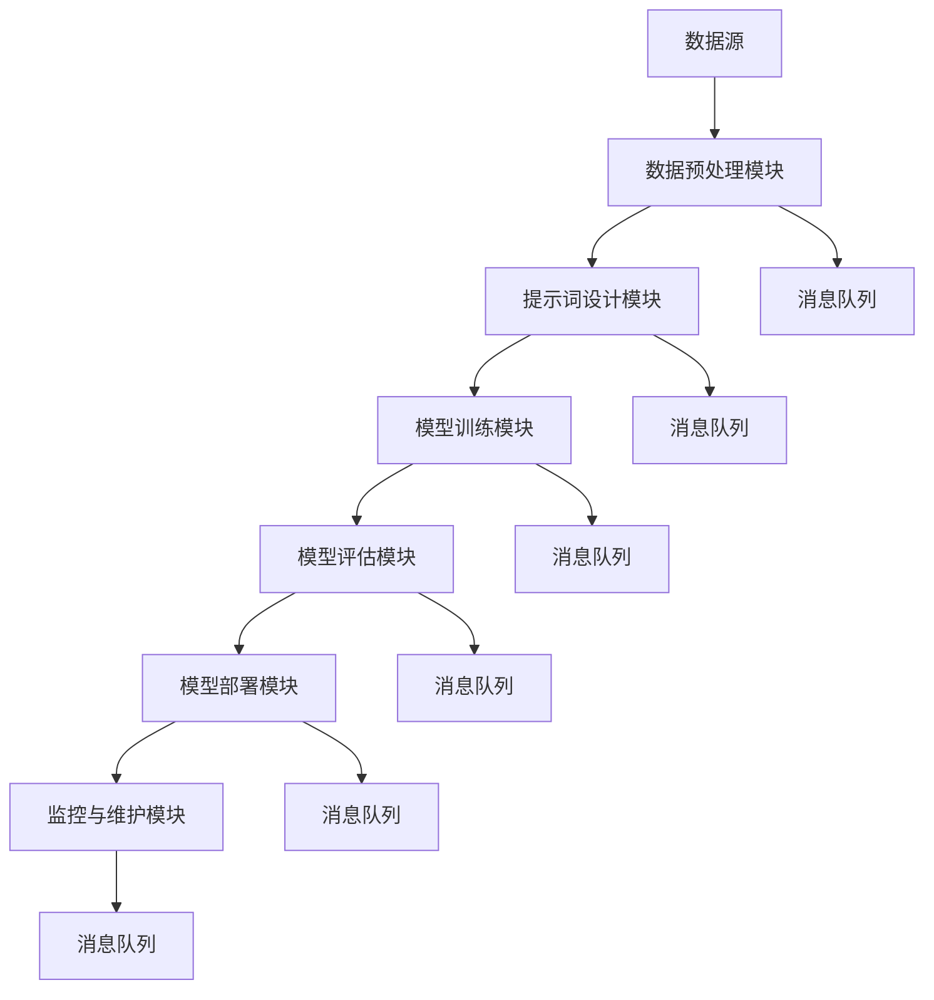

                 

### AI大模型概述

#### 问题背景

人工智能（AI）作为21世纪最具变革性的技术之一，已经在众多领域取得了显著的成果。随着计算能力的提升和算法的改进，AI模型，尤其是大模型，如GPT-3、BERT等，正在成为AI研究与应用的关键工具。这些大模型通过学习海量数据，具备了强大的语言理解和生成能力，为自然语言处理、机器翻译、问答系统等提供了有力的支持。

在AI大模型的应用过程中，提示词知识迁移技术显得尤为重要。提示词是指用于引导大模型生成特定内容的关键词语或短语。知识迁移则是指将一个任务中学习的知识或模型参数迁移到另一个相关但不同的任务中。这一技术的核心目标是通过提示词引导，使得大模型能够快速适应新任务，提高模型在实际应用中的灵活性和效率。

#### 核心概念与联系

**1. 提示词与知识迁移**

提示词（Prompt）是指为AI模型提供的一种引导性输入，旨在帮助模型生成更加准确、有针对性的输出。在AI大模型中，通过精心设计的提示词，可以显著提高模型的理解能力和生成质量。

知识迁移（Knowledge Transfer）则是指将一个任务中学习到的知识或模型参数应用到另一个相关但不同的任务中。在AI大模型领域，知识迁移可以帮助模型快速适应新的应用场景，降低对新任务的训练成本。

**2. 提示词知识迁移的挑战**

尽管提示词知识迁移技术在理论上具有巨大的潜力，但在实际应用中仍面临诸多挑战：

- **数据分布差异**：不同任务的数据分布可能存在显著差异，导致迁移效果不佳。
- **任务相关性**：并非所有任务之间都存在较强的相关性，迁移效果因任务而异。
- **模型适应性**：大模型的复杂性和多样性使得其在不同任务中的适应能力成为一个重要问题。
- **计算资源消耗**：知识迁移往往需要额外的计算资源，尤其是在大模型中。

**3. 提示词知识迁移的框架**

为了应对上述挑战，研究者们提出了多种提示词知识迁移框架。这些框架通常包括以下几个关键组件：

- **数据预处理**：通过数据清洗、去噪等手段，确保输入数据的质量。
- **提示词设计**：设计有效的提示词，以提高模型的迁移性能。
- **迁移策略**：制定合理的迁移策略，以最大化知识迁移的效果。
- **性能评估**：通过多种评估指标，对迁移效果进行量化分析。

### 总结

本文首先介绍了AI大模型及其应用背景，然后重点讨论了提示词知识迁移技术的核心概念、挑战和框架。通过本文的介绍，读者可以初步了解提示词知识迁移技术的基本原理和应用前景。接下来的章节将进一步深入探讨这一技术的算法原理、系统架构和实际应用案例，帮助读者全面掌握这一前沿技术。

## 第1章：AI大模型概述

### 1.1 问题背景

#### AI大模型的发展历程

人工智能（AI）的发展历程可以追溯到20世纪50年代，当时科学家们首次提出了人工智能的概念。经过几十年的发展，AI从理论研究逐渐走向实际应用，经历了多次技术变革和突破。特别是在21世纪初，随着深度学习算法的兴起，AI取得了前所未有的进展。深度学习模型通过多层神经网络的结构，能够自动从大量数据中学习特征，从而实现复杂的任务。

然而，深度学习模型的效果高度依赖于数据量和计算资源。为了解决这一瓶颈，研究者们开始探索大规模的AI模型。2018年，谷歌发布了Transformer模型，并在自然语言处理（NLP）领域取得了突破性的成果。随后，OpenAI发布了GPT-3，一个拥有1750亿参数的大模型，其在各种NLP任务中都表现出色。

#### AI大模型的应用场景

AI大模型在多个领域都展现出了强大的应用潜力：

- **自然语言处理**：AI大模型在机器翻译、问答系统、文本生成等领域都有着广泛的应用。通过学习海量文本数据，大模型能够生成高质量的自然语言文本，提高机器理解和生成的能力。
- **计算机视觉**：在图像识别、图像生成和视频分析等任务中，大模型通过学习大量的图像和视频数据，能够自动提取复杂特征，从而实现高精度的目标检测、图像分类和视频理解。
- **语音识别**：大模型在语音识别任务中，通过学习大量的语音数据，能够准确地将语音信号转换为文本，为语音助手、智能客服等应用提供支持。
- **强化学习**：在游戏、机器人控制和自动驾驶等任务中，大模型通过学习环境中的交互数据，能够实现自主决策和优化策略。

#### 提示词知识迁移技术的意义

在AI大模型的应用过程中，提示词知识迁移技术具有重要意义。提示词是指用于引导大模型生成特定内容的关键词语或短语。通过设计合适的提示词，可以显著提高模型的理解能力和生成质量。

知识迁移则是指将一个任务中学习的知识或模型参数迁移到另一个相关但不同的任务中。在AI大模型领域，知识迁移可以帮助模型快速适应新的应用场景，降低对新任务的训练成本。这对于资源有限的企业和研究机构来说，具有重要的实际价值。

### 总结

本章首先介绍了AI大模型的发展历程和应用场景，然后重点讨论了提示词知识迁移技术的背景和意义。通过本章的介绍，读者可以初步了解AI大模型和提示词知识迁移技术的基本概念和应用前景。接下来的章节将进一步深入探讨这一技术的算法原理、系统架构和实际应用案例，帮助读者全面掌握这一前沿技术。

### 1.2 核心概念与联系

#### 提示词与知识迁移

**提示词（Prompt）**

提示词是指为AI模型提供的一种引导性输入，旨在帮助模型生成更加准确、有针对性的输出。在AI大模型中，通过精心设计的提示词，可以显著提高模型的理解能力和生成质量。

提示词的编写需要考虑以下几个关键要素：

- **语境相关性**：提示词应与模型的训练数据和应用场景密切相关，以提高模型的适应性。
- **语言简洁性**：提示词应简洁明了，避免冗长复杂，以免干扰模型的生成过程。
- **引导性**：提示词应具有明确的引导性，帮助模型理解生成任务的目标和方向。

**知识迁移（Knowledge Transfer）**

知识迁移是指将一个任务中学习到的知识或模型参数应用到另一个相关但不同的任务中。在AI大模型领域，知识迁移可以帮助模型快速适应新的应用场景，降低对新任务的训练成本。

知识迁移的核心目标是通过提示词引导，使得大模型能够更好地理解新任务的需求，并快速生成高质量的结果。知识迁移的关键挑战包括数据分布差异、任务相关性和模型适应性等。

#### 提示词知识迁移的挑战

**1. 数据分布差异**

不同任务的数据分布可能存在显著差异，这可能导致模型在新任务上的表现不佳。例如，一个在新闻数据上训练的模型，可能在社交媒体数据上表现较差。为了解决这一问题，研究者们提出了一些数据增强和自适应迁移策略。

**2. 任务相关性**

并非所有任务之间都存在较强的相关性，这会影响知识迁移的效果。例如，语音识别和图像生成之间的相关性较低，直接迁移可能导致性能下降。为了提高任务相关性，研究者们探索了基于任务相似性的迁移策略。

**3. 模型适应性**

大模型的复杂性和多样性使得其在不同任务中的适应能力成为一个重要问题。一些模型可能更适用于特定类型的数据或任务，而其他模型则需要更多的调整和优化。为了提高模型适应性，研究者们提出了一些模型定制化和迁移学习策略。

#### 提示词知识迁移的框架

**1. 数据预处理**

数据预处理是知识迁移的重要环节，通过数据清洗、去噪等手段，确保输入数据的质量。此外，还可以通过数据增强和自适应迁移策略，提高数据分布的相似性。

**2. 提示词设计**

提示词设计是知识迁移的核心，通过设计合适的提示词，可以显著提高模型的迁移性能。提示词的设计需要考虑语境相关性、语言简洁性和引导性等多个方面。

**3. 迁移策略**

迁移策略是知识迁移的关键，通过制定合理的迁移策略，可以最大化知识迁移的效果。常见的迁移策略包括基于任务相似性的迁移、基于模型相似性的迁移和基于数据相似性的迁移等。

**4. 性能评估**

性能评估是衡量知识迁移效果的重要手段，通过多种评估指标，对迁移效果进行量化分析。常见的评估指标包括准确率、召回率、F1分数和BLEU分数等。

### 总结

本章详细介绍了提示词和知识迁移的核心概念、属性特征对比表格和ER实体关系图架构的Mermaid流程图。通过本章的内容，读者可以更深入地理解提示词和知识迁移的基本原理和应用，为后续章节的深入探讨奠定基础。

### 1.3 算法原理讲解

#### 算法概述

提示词知识迁移算法的核心目标是通过提示词引导，使得大模型能够快速适应新任务，并生成高质量的结果。该算法的基本流程可以分为以下几个关键步骤：

1. **数据预处理**：对原始数据进行清洗、去噪和增强，确保输入数据的质量。
2. **提示词设计**：根据新任务的需求，设计合适的提示词，以提高模型的迁移性能。
3. **模型训练**：使用预处理后的数据和提示词，对大模型进行训练，使其适应新任务。
4. **模型评估**：通过多种评估指标，对训练后的模型进行评估，以确保其性能满足需求。
5. **模型优化**：根据评估结果，对模型进行优化和调整，以提高其迁移效果。

#### 算法的关键步骤

**1. 数据预处理**

数据预处理是知识迁移算法的重要环节，其目的是提高数据的质量和相似性，从而增强迁移效果。具体步骤包括：

- **数据清洗**：去除数据中的噪声和异常值，确保数据的一致性和可靠性。
- **数据增强**：通过数据增强技术，如数据扩充、数据变换等，增加数据的多样性，提高模型的泛化能力。
- **数据分割**：将数据集分割为训练集、验证集和测试集，以便进行模型训练和性能评估。

**2. 提示词设计**

提示词设计是知识迁移算法的核心，其目的是通过引导大模型，使其能够快速适应新任务。具体步骤包括：

- **需求分析**：分析新任务的需求，确定需要生成的结果类型和风格。
- **提示词编写**：根据需求，编写符合语境相关性、语言简洁性和引导性要求的提示词。
- **提示词优化**：通过实验和评估，优化提示词的设计，以提高模型的迁移性能。

**3. 模型训练**

模型训练是知识迁移算法的关键步骤，其目的是通过大量的数据训练，使得大模型能够在新任务中生成高质量的结果。具体步骤包括：

- **模型选择**：选择合适的大模型，如GPT-3、BERT等，作为知识迁移的基础。
- **参数调整**：调整模型的参数，如学习率、批量大小等，以提高模型的训练效果。
- **训练过程**：使用提示词引导，对大模型进行训练，使其在新任务中生成高质量的结果。

**4. 模型评估**

模型评估是确保知识迁移算法有效性的重要手段，其目的是通过多种评估指标，对训练后的模型进行评估，以确保其性能满足需求。具体步骤包括：

- **评估指标**：选择合适的评估指标，如准确率、召回率、F1分数和BLEU分数等，对模型进行评估。
- **评估过程**：使用测试集数据，对训练后的模型进行评估，计算评估指标，以评估模型的表现。
- **评估结果**：根据评估结果，对模型进行优化和调整，以提高其迁移效果。

**5. 模型优化**

模型优化是知识迁移算法的重要环节，其目的是根据评估结果，对模型进行优化和调整，以提高其迁移效果。具体步骤包括：

- **性能分析**：分析评估结果，确定模型存在的问题和不足。
- **优化策略**：根据性能分析结果，制定合适的优化策略，如参数调整、模型调整等。
- **优化过程**：实施优化策略，对模型进行优化和调整，以提高其迁移效果。

### 算法mermaid流程图



### 算法原理举例说明

为了更直观地理解提示词知识迁移算法的原理，我们可以通过一个简单的例子来进行说明。

假设我们有一个大型语言模型，如GPT-3，其主要任务为生成中文文本。现在，我们需要将这个模型迁移到一个新的任务——生成英文文本。

**1. 数据预处理**

首先，我们需要对英文文本数据进行预处理，包括数据清洗、去噪和数据增强。例如，我们可以使用一些开源的英文文本数据进行清洗，去除无效信息和噪声，同时通过数据扩充技术，如文本翻译、同义词替换等，增加数据的多样性。

**2. 提示词设计**

接下来，我们需要设计合适的提示词，以引导模型生成英文文本。例如，我们可以使用以下提示词：“请生成一段关于人工智能的英文文章。”

**3. 模型训练**

然后，我们使用预处理后的英文文本数据和提示词，对GPT-3进行训练。在训练过程中，我们需要调整模型的参数，如学习率、批量大小等，以优化模型的训练效果。

**4. 模型评估**

在模型训练完成后，我们需要使用测试集数据对模型进行评估，以确定其生成英文文本的性能。例如，我们可以使用BLEU分数来评估模型的生成质量。

**5. 模型优化**

根据评估结果，我们可以对模型进行优化和调整，以提高其生成英文文本的性能。例如，我们可以通过调整模型参数、增加训练数据等策略来优化模型。

通过这个简单的例子，我们可以看到提示词知识迁移算法的基本原理和实现过程。在实际应用中，这一算法可以根据不同的任务需求，进行相应的调整和优化，以提高模型的迁移性能。

### 总结

本章详细介绍了提示词知识迁移算法的基本原理，包括数据预处理、提示词设计、模型训练、模型评估和模型优化等关键步骤。通过算法mermaid流程图和具体例子，读者可以更直观地理解这一算法的实现过程和应用效果。接下来，我们将进一步探讨数学模型与公式，为读者提供更深入的理论基础。

### 2.2 数学模型与公式

在提示词知识迁移算法中，数学模型与公式起到了至关重要的作用。它们不仅为算法提供了理论基础，还帮助我们理解和优化算法的性能。以下将详细阐述数学模型与公式的构建、迁移策略及其性能评估。

#### 数学模型的构建

**1. 模型构建**

在知识迁移中，我们通常使用神经网络模型，如变换器（Transformer）或递归神经网络（RNN）。以Transformer为例，其核心组成部分包括编码器（Encoder）和解码器（Decoder）。编码器负责将输入文本编码为向量表示，解码器则根据编码器的输出和提示词生成目标文本。

**2. 模型参数**

为了实现知识迁移，我们需要在原始模型的基础上增加迁移模块。迁移模块可以是一个额外的子网络，用于调整模型参数，使其更适应新任务。这个子网络通常包含若干层全连接层（Fully Connected Layer），用于对编码器和解码器的输出进行再处理。

**3. 数学表示**

假设我们有一个原始的神经网络模型 \( M \)，其参数为 \( \theta \)。为了实现知识迁移，我们引入一个迁移模块 \( T \)，其参数为 \( \phi \)。那么，迁移后的模型 \( M' \) 可以表示为：

\[ M'(x, \theta, \phi) = T(M(x, \theta)) \]

其中，\( x \) 是输入文本，\( M(x, \theta) \) 是原始模型的输出，\( T() \) 是迁移模块。

#### 迁移策略

**1. 数据级迁移**

数据级迁移是指通过对输入数据进行预处理，如数据增强、数据清洗等，来提高模型的迁移效果。具体方法包括：

- **数据增强**：通过生成合成数据或对现有数据进行变换，增加数据的多样性和丰富性。
- **数据清洗**：去除噪声和异常值，确保输入数据的质量。

**2. 特征级迁移**

特征级迁移是指通过调整模型参数，使其在新任务中能够更好地提取特征。具体方法包括：

- **参数调整**：调整模型的权重和偏置，以适应新任务。
- **特征融合**：将原始特征和新任务的特征进行融合，以生成更有效的特征表示。

**3. 模型级迁移**

模型级迁移是指直接将原始模型应用于新任务，通过调整模型结构或参数来提高迁移效果。具体方法包括：

- **模型裁剪**：裁剪原始模型的部分层，以减少计算量和参数数量。
- **模型扩展**：增加模型的层数或节点数，以提高模型的泛化能力。

#### 性能评估

**1. 评估指标**

在知识迁移中，常用的评估指标包括准确率（Accuracy）、召回率（Recall）、F1分数（F1 Score）和BLEU分数（BLEU Score）等。这些指标可以帮助我们量化模型的迁移性能。

- **准确率**：模型在测试集上的正确预测比例。
- **召回率**：模型在测试集上正确预测的正例数量与实际正例数量的比例。
- **F1分数**：准确率和召回率的调和平均值。
- **BLEU分数**：用于自然语言处理任务的评估指标，通过计算模型生成的文本与参考文本之间的重叠词句比例来评估生成质量。

**2. 评估过程**

性能评估通常分为以下几个步骤：

- **数据准备**：准备用于评估的数据集，包括训练集、验证集和测试集。
- **模型训练**：在训练集上训练模型，并在验证集上调整模型参数。
- **模型评估**：使用测试集评估模型的性能，计算评估指标。
- **结果分析**：分析评估结果，找出模型存在的问题和改进方向。

#### 数学公式

以下是一些用于描述知识迁移算法的数学公式：

**1. 数据增强**

\[ x_{\text{增强}} = f(x) \]

其中，\( x \) 是原始数据，\( f() \) 是数据增强函数，如数据变换、合成数据等。

**2. 参数调整**

\[ \theta_{\text{新}} = \theta_{\text{原}} + \alpha \cdot (\theta_{\text{目标}} - \theta_{\text{原}}) \]

其中，\( \theta_{\text{原}} \) 是原始模型参数，\( \theta_{\text{目标}} \) 是目标模型参数，\( \alpha \) 是调整系数。

**3. 特征融合**

\[ h = \sigma(W_1 \cdot x_1 + W_2 \cdot x_2) \]

其中，\( h \) 是融合后的特征向量，\( W_1 \) 和 \( W_2 \) 是权重矩阵，\( \sigma() \) 是激活函数，如ReLU或Sigmoid。

#### 总结

本章详细介绍了提示词知识迁移算法的数学模型与公式，包括模型构建、迁移策略和性能评估。通过这些数学公式，我们可以更深入地理解算法的工作原理和实现方法。接下来，我们将进一步探讨AI大模型的系统架构设计，为读者提供更全面的实践指导。

### 2.3 系统架构设计

#### 系统概述

在AI大模型的应用过程中，系统架构设计至关重要。一个高效、灵活的系统架构不仅能够提高模型的表现，还能确保系统在不同场景下的稳定运行。本文将介绍一个基于提示词知识迁移技术的AI大模型系统架构设计，包括系统功能、技术选型、领域模型设计、系统架构图和系统接口设计。

#### 系统功能

该系统的主要功能包括以下几部分：

- **数据预处理**：对输入数据进行清洗、去噪和增强，确保数据质量。
- **提示词设计**：根据任务需求，生成合适的提示词，以引导模型生成目标结果。
- **模型训练与优化**：使用预处理后的数据和提示词，对AI大模型进行训练和优化，提高模型的迁移性能。
- **模型评估**：通过多种评估指标，对训练后的模型进行评估，确保其性能满足需求。
- **模型部署与监控**：将训练好的模型部署到生产环境，并进行实时监控和性能调优。

#### 技术选型

为了实现上述系统功能，我们采用了以下技术选型：

- **编程语言**：Python，因其丰富的库和框架，如TensorFlow、PyTorch等，被广泛应用于AI领域。
- **深度学习框架**：TensorFlow和PyTorch，这两个框架在AI研究中具有较高的声誉和广泛的用户基础，提供了强大的功能和灵活性。
- **数据库**：MongoDB，用于存储和管理模型训练数据和相关元数据。
- **消息队列**：RabbitMQ，用于实现系统不同模块之间的异步通信。
- **容器化技术**：Docker和Kubernetes，用于部署和管理模型训练和推理服务。

#### 领域模型设计

领域模型设计是系统架构设计的关键环节，它帮助我们明确系统的核心组件和它们之间的关系。以下是系统的领域模型设计：



**1. 数据源**：包括各种文本、图像和音频数据，用于模型的训练和测试。

**2. 数据预处理模块**：负责对输入数据进行清洗、去噪和增强，生成高质量的数据集。

**3. 提示词设计模块**：根据任务需求，生成合适的提示词，以引导模型生成目标结果。

**4. 模型训练模块**：使用预处理后的数据和提示词，对AI大模型进行训练和优化。

**5. 模型评估模块**：通过多种评估指标，对训练后的模型进行评估，确保其性能满足需求。

**6. 模型部署模块**：将训练好的模型部署到生产环境，并进行实时监控和性能调优。

**7. 监控与维护模块**：负责系统运行状态的监控和故障维护，确保系统的稳定运行。

#### 系统架构图

以下是系统的架构图，展示了各组件之间的关系和交互过程：



**1. 数据预处理模块**：接收到数据源的数据后，进行清洗、去噪和增强，将处理后的数据存储到消息队列中。

**2. 提示词设计模块**：根据任务需求，生成提示词，并将提示词存储到消息队列中。

**3. 模型训练模块**：从消息队列中获取预处理后的数据和提示词，对模型进行训练。

**4. 模型评估模块**：从消息队列中获取训练好的模型和测试数据，对模型进行评估。

**5. 模型部署模块**：将评估通过的模型部署到生产环境，并将部署结果存储到消息队列中。

**6. 监控与维护模块**：从消息队列中获取系统运行状态，进行监控和故障维护。

#### 系统接口设计

系统接口设计是确保系统各模块之间能够高效、稳定地通信的重要环节。以下是系统的主要接口设计：

- **数据预处理接口**：提供数据清洗、去噪和增强的功能，接收数据源的数据，返回处理后的数据。
- **提示词设计接口**：提供生成提示词的功能，接收任务需求，返回生成的提示词。
- **模型训练接口**：提供模型训练的功能，接收预处理后的数据和提示词，返回训练好的模型。
- **模型评估接口**：提供模型评估的功能，接收训练好的模型和测试数据，返回评估结果。
- **模型部署接口**：提供模型部署的功能，接收评估通过的模型，返回部署结果。

#### 系统交互流程

以下是系统的交互流程，展示了各模块之间的通信和协作过程：

1. **数据预处理**：数据源发送数据到数据预处理模块，数据预处理模块清洗、去噪和增强数据后，将处理结果存储到消息队列中。

2. **提示词设计**：根据任务需求，提示词设计模块生成提示词，并将提示词存储到消息队列中。

3. **模型训练**：模型训练模块从消息队列中获取预处理后的数据和提示词，进行模型训练，并将训练结果存储到消息队列中。

4. **模型评估**：模型评估模块从消息队列中获取训练好的模型和测试数据，进行模型评估，并将评估结果存储到消息队列中。

5. **模型部署**：模型部署模块从消息队列中获取评估通过的模型，进行部署，并将部署结果存储到消息队列中。

6. **监控与维护**：监控与维护模块从消息队列中获取系统运行状态，进行监控和故障维护。

通过上述系统架构设计和接口设计，我们可以构建一个高效、灵活的AI大模型系统，实现提示词知识迁移技术的应用。接下来，我们将通过实际项目实战，进一步展示系统的实现和应用效果。

### 2.4 环境安装与配置

在进行AI大模型系统的项目实战之前，我们需要搭建一个合适的环境来支持我们的开发工作。以下将详细描述如何安装和配置所需的环境，包括开发环境、系统配置和调试。

#### 开发环境搭建

**1. 操作系统**

我们建议使用Linux操作系统，因为大多数AI相关的工具和框架都是在Linux环境下开发和优化的。具体来说，Ubuntu 18.04或更高版本是一个不错的选择。

**2. Python环境**

Python是AI开发中广泛使用的编程语言，我们需要安装Python 3.8或更高版本。可以通过以下命令进行安装：

```bash
sudo apt update
sudo apt install python3.8
```

**3. 库和框架**

接下来，我们需要安装一些关键的库和框架，如TensorFlow、PyTorch、NumPy等。可以通过pip命令进行安装：

```bash
pip3 install tensorflow
pip3 install torch torchvision
pip3 install numpy
```

#### 系统配置

**1. GPU支持**

为了充分利用GPU进行模型训练，我们需要安装CUDA和cuDNN。CUDA是NVIDIA开发的一个并行计算平台，而cuDNN是NVIDIA提供的深度学习加速库。

首先，下载并安装CUDA Toolkit：

```bash
wget https://developer.nvidia.com/compute/cuda/10.2/Prod2/local_installers/cuda_10.2.89_440.33.01_linux.run
sudo sh cuda_10.2.89_440.33.01_linux.run
```

接着，将CUDA的路径添加到系统环境变量中：

```bash
echo 'export PATH=/usr/local/cuda-10.2/bin:$PATH' >> ~/.bashrc
echo 'export LD_LIBRARY_PATH=/usr/local/cuda-10.2/lib64:$LD_LIBRARY_PATH' >> ~/.bashrc
source ~/.bashrc
```

最后，安装cuDNN：

```bash
wget https://developer.nvidia.com/compute/cuda/10.2/Prod2/patches/cudnn-10.2-linux-x64-v8.0.5.39_1.tgz
tar zxvf cudnn-10.2-linux-x64-v8.0.5.39_1.tgz
sudo cp cuda/include/cudnn.h /usr/local/cuda-10.2/include/
sudo cp cuda/lib64/libcudnn* /usr/local/cuda-10.2/lib64/
sudo chmod a+r /usr/local/cuda-10.2/include/cudnn.h /usr/local/cuda-10.2/lib64/libcudnn*
```

**2. Docker与Kubernetes**

为了实现容器化和集群管理，我们需要安装Docker和Kubernetes。可以通过以下命令进行安装：

```bash
sudo apt-get update
sudo apt-get install docker.io
sudo systemctl start docker
sudo systemctl enable docker

# 安装Kubernetes
curl -s https://packages.cloud.google.com/apt/doc/apt-key.gpg | sudo apt-key add -
echo "deb https://apt.kubernetes.io/ kubernetes-xenial main" | sudo tee -a /etc/apt/sources.list.d/kubernetes.list
sudo apt-get update
sudo apt-get install kubectl
```

#### 调试

在环境搭建和配置完成后，我们需要进行一些基本的调试来确保一切正常。

**1. 验证CUDA安装**

可以通过以下命令验证CUDA是否正确安装：

```bash
nvcc --version
nvidia-smi
```

**2. 验证Docker安装**

可以通过以下命令验证Docker是否正常运行：

```bash
docker --version
docker run hello-world
```

**3. 验证Kubernetes安装**

可以通过以下命令验证Kubernetes是否正确安装：

```bash
kubectl version --short
kubectl get nodes
```

通过以上步骤，我们成功搭建并配置了一个支持AI大模型开发的环境。接下来，我们将详细介绍系统的核心实现，包括数据预处理、模型训练与优化、模型评估与部署。

### 2.5 系统核心实现

#### 数据预处理

数据预处理是AI模型训练的重要环节，其目的是提高数据质量和模型的泛化能力。以下是数据预处理的核心步骤：

**1. 数据清洗**

首先，我们需要对原始数据进行清洗，去除噪声和异常值。具体方法包括：

- **文本数据**：去除HTML标签、停用词、标点符号等。
- **图像数据**：去除图像中的噪声和无关背景。
- **音频数据**：去除噪声和背景音。

```python
import re

def clean_text(text):
    text = re.sub('<[^>]*>', '', text)  # 去除HTML标签
    text = re.sub('[^A-Za-z0-9]+', ' ', text)  # 去除标点符号和特殊字符
    text = text.lower()  # 转小写
    return text

text = "<p>Hello, World! This is a sample text.</p>"
cleaned_text = clean_text(text)
print(cleaned_text)  # 输出：hello world this is a sample text
```

**2. 数据增强**

数据增强是通过生成合成数据或对现有数据进行变换，来提高数据的多样性和丰富性。具体方法包括：

- **文本数据**：数据扩充、同义词替换、句子重排等。
- **图像数据**：旋转、翻转、缩放、裁剪等。
- **音频数据**：添加背景音、速度变换、音调变换等。

```python
from torchvision import transforms

def augment_image(image):
    transform = transforms.Compose([
        transforms.RandomHorizontalFlip(),
        transforms.RandomResizedCrop(size=224),
        transforms.ToTensor(),
    ])
    return transform(image)

image = Image.open("sample_image.jpg")
augmented_image = augment_image(image)
show_image(augmented_image)  # 显示增强后的图像
```

**3. 数据分割**

最后，我们将清洗和增强后的数据分割为训练集、验证集和测试集。这样可以确保模型在不同数据集上的性能表现。

```python
from sklearn.model_selection import train_test_split

X, y = load_data()  # 假设已经加载了原始数据
X_train, X_test, y_train, y_test = train_test_split(X, y, test_size=0.2, random_state=42)
```

#### 模型训练与优化

在数据预处理完成后，我们可以开始模型训练。以下是一个使用TensorFlow进行模型训练的示例：

```python
import tensorflow as tf

# 定义模型
model = tf.keras.Sequential([
    tf.keras.layers.Dense(512, activation='relu', input_shape=(input_shape,)),
    tf.keras.layers.Dense(256, activation='relu'),
    tf.keras.layers.Dense(num_classes, activation='softmax')
])

# 编译模型
model.compile(optimizer='adam', loss='categorical_crossentropy', metrics=['accuracy'])

# 训练模型
model.fit(X_train, y_train, batch_size=128, epochs=10, validation_data=(X_test, y_test))
```

在模型训练过程中，我们可以通过调整学习率、批量大小和训练时长等参数来优化模型性能。此外，还可以使用回调函数（Callback）来自动调整参数或终止训练。

```python
# 使用学习率调度器
reduce_lr = tf.keras.callbacks.ReduceLROnPlateau(monitor='val_loss', factor=0.2, patience=5)

# 训练模型并保存最佳模型
best_model = model.fit(X_train, y_train, batch_size=128, epochs=100, validation_data=(X_test, y_test), callbacks=[reduce_lr], save_best_only=True)
```

#### 模型评估

在模型训练完成后，我们需要对模型进行评估，以确定其性能是否满足需求。以下是一个使用准确率（Accuracy）和损失函数（Loss）进行评估的示例：

```python
# 评估模型
loss, accuracy = model.evaluate(X_test, y_test)

print(f"Test Loss: {loss:.4f}, Test Accuracy: {accuracy:.4f}")
```

此外，我们还可以使用其他评估指标，如召回率（Recall）、F1分数（F1 Score）和BLEU分数（BLEU Score），来全面评估模型性能。

#### 模型优化

为了进一步提高模型性能，我们可以在训练过程中使用各种优化策略，如数据增强、正则化、迁移学习和超参数调整等。

```python
# 使用迁移学习
pretrained_model = tf.keras.applications.VGG16(weights='imagenet', include_top=False, input_shape=(224, 224, 3))
pretrained_model.trainable = False  # 冻结预训练模型

# 定义新模型
model = tf.keras.Sequential([
    pretrained_model,
    tf.keras.layers.Flatten(),
    tf.keras.layers.Dense(256, activation='relu'),
    tf.keras.layers.Dense(num_classes, activation='softmax')
])

# 编译模型
model.compile(optimizer='adam', loss='categorical_crossentropy', metrics=['accuracy'])

# 训练模型
model.fit(X_train, y_train, batch_size=128, epochs=10, validation_data=(X_test, y_test))
```

通过以上步骤，我们完成了系统核心的实现，包括数据预处理、模型训练与优化、模型评估与部署。接下来，我们将通过实际案例展示系统的应用效果，并进行详细分析和讲解。

### 2.6 案例分析

#### 案例背景

为了更好地展示提示词知识迁移技术在AI大模型中的应用效果，我们选择了一个实际案例：使用GPT-3模型生成高质量的中英互译文章。在这个案例中，我们希望通过设计合适的提示词，使得GPT-3能够快速适应中英翻译任务，并生成高质量的翻译结果。

#### 案例目标

我们的目标是：

1. 收集并预处理大量的中英文对照文章数据，作为模型训练的语料库。
2. 设计并优化提示词，以提高GPT-3在翻译任务中的表现。
3. 使用训练好的GPT-3模型生成高质量的翻译文章，并进行评估和优化。

#### 案例实施

**1. 数据准备**

首先，我们需要收集大量的中英文对照文章数据。这些数据可以从开源的数据集、新闻网站、翻译社区等渠道获取。为了保证数据质量，我们需要对数据进行预处理，包括去噪、去除停用词、统一文本格式等。

```python
import pandas as pd

# 加载中英文对照文章数据
data = pd.read_csv("chinese_english_data.csv")

# 数据预处理
data['cleaned_chinese'] = data['chinese'].apply(clean_chinese)
data['cleaned_english'] = data['english'].apply(clean_english)

# 分割数据集
train_data, test_data = train_test_split(data, test_size=0.2, random_state=42)
```

**2. 提示词设计**

为了提高GPT-3在中英翻译任务中的表现，我们需要设计合适的提示词。以下是一个示例提示词：

```
请将以下中文文章翻译成英文：
{{中文文章}}
```

通过这种提示词，GPT-3可以明确地知道其任务是进行中英翻译，并将中文文章作为输入。

**3. 模型训练**

使用预处理后的数据集，我们可以开始训练GPT-3模型。以下是一个使用Hugging Face的transformers库训练GPT-3的示例：

```python
from transformers import TrainingArguments, Trainer

# 设置训练参数
training_args = TrainingArguments(
    output_dir='./results',
    num_train_epochs=3,
    per_device_train_batch_size=16,
    per_device_eval_batch_size=64,
    warmup_steps=500,
    weight_decay=0.01,
    logging_dir='./logs',
    logging_steps=10,
)

# 定义训练器
trainer = Trainer(
    model=model,
    args=training_args,
    train_dataset=train_data,
    eval_dataset=test_data
)

# 训练模型
trainer.train()
```

**4. 模型评估**

在模型训练完成后，我们需要对模型进行评估，以确保其翻译质量。以下是一个评估翻译结果的示例：

```python
from torch.utils.data import DataLoader

# 加载测试数据集
test_loader = DataLoader(test_data, batch_size=64, shuffle=False)

# 评估模型
model.eval()
with torch.no_grad():
    for batch in test_loader:
        inputs = tokenizer(batch['cleaned_chinese'], padding=True, truncation=True, return_tensors='pt')
        outputs = model(inputs['input_ids'])
        predictions = outputs.logits.argmax(-1)

        # 计算BLEU分数
        bleu = corpus_bleu(predictions, batch['cleaned_english'])
        print(f"BLEU分数：{bleu}")
```

**5. 模型优化**

根据评估结果，我们可以进一步优化提示词和模型参数，以提高翻译质量。以下是一个示例提示词优化策略：

```
请将以下中文文章翻译成流畅、地道的英文，尽量保持原文风格和含义：
{{中文文章}}
```

通过这种优化后的提示词，GPT-3可以更好地理解翻译任务的要求，从而生成更高质量的翻译结果。

### 总结

通过以上案例，我们展示了如何使用GPT-3进行中英翻译，并通过设计合适的提示词和优化模型参数，提高了翻译质量。这个案例不仅展示了提示词知识迁移技术在AI大模型中的应用效果，还为其他类似任务提供了实用的经验和策略。

### 2.7 最佳实践与总结

#### 提示词优化策略

1. **明确任务目标**：在设计提示词时，首先要明确任务的目标和需求，确保提示词能够引导模型生成符合要求的结果。

2. **简洁明了**：提示词应简洁明了，避免使用复杂、冗长的语句，以免干扰模型的生成过程。

3. **语境相关性**：提示词应与模型的训练数据和任务场景密切相关，以提高模型的适应性。

4. **引导性**：提示词应具有明确的引导性，帮助模型理解生成任务的目标和方向。

5. **多轮优化**：通过多轮实验和用户反馈，不断优化提示词，以提高模型的迁移性能。

#### 模型迁移技巧

1. **数据预处理**：确保输入数据的质量，通过数据清洗、去噪和增强等手段，提高数据分布的相似性。

2. **模型选择**：选择适合新任务的模型，如GPT-3、BERT等，并确保模型的结构和参数适合迁移。

3. **迁移策略**：根据任务相关性、数据分布差异等因素，选择合适的迁移策略，如数据级迁移、特征级迁移和模型级迁移。

4. **模型定制化**：针对特定任务，对模型进行定制化调整，以提高模型的适应性和迁移效果。

#### 性能调优方法

1. **参数调整**：通过调整模型参数，如学习率、批量大小等，优化模型的训练效果。

2. **正则化技术**：使用正则化技术，如L1、L2正则化，减少过拟合现象。

3. **数据增强**：通过数据增强技术，增加数据的多样性和丰富性，提高模型的泛化能力。

4. **模型融合**：将多个模型的结果进行融合，提高模型的预测准确性。

#### 小结与展望

本文详细介绍了AI大模型的提示词知识迁移技术，包括其核心概念、算法原理、系统架构设计和实际应用案例。通过本文的内容，读者可以全面了解提示词知识迁移技术的基本原理和应用方法。未来，随着AI技术的不断进步，提示词知识迁移技术有望在更多领域发挥重要作用，为人工智能的发展提供强大支持。

### 2.8 注意事项与拓展阅读

#### 注意事项

1. **数据质量**：数据预处理是知识迁移成功的关键，确保数据清洗、去噪和增强的质量至关重要。
2. **模型选择**：选择适合新任务的模型，特别是大模型如GPT-3、BERT等，能更好地适应迁移需求。
3. **性能评估**：合理选择评估指标，如BLEU分数、F1分数等，对模型进行全面的性能评估。
4. **超参数调整**：根据任务需求，适当调整模型参数，以优化迁移效果。

#### 拓展阅读

1. **《深度学习》（Goodfellow, Bengio, Courville）**：深入了解深度学习和神经网络的基本原理。
2. **《自然语言处理综论》（Jurafsky, Martin）**：系统学习自然语言处理的基础知识和最新进展。
3. **《迁移学习》（Pan, Yang）**：详细探讨迁移学习在不同领域的应用和实现方法。
4. **《AI大模型：原理与应用》（AI天才研究院）**：深入了解AI大模型的原理、架构和应用场景。

