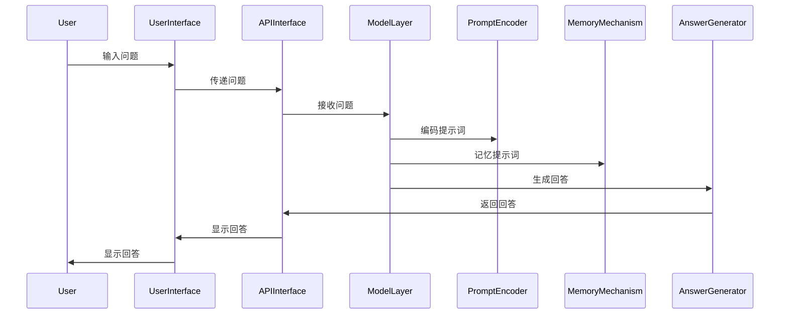
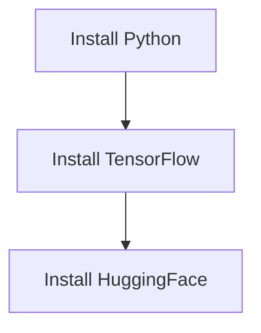

                 


## AI大模型的提示词记忆与学习

### 关键词：
- AI大模型
- 提示词
- 记忆与学习
- 算法原理
- 数学模型
- 实战应用

### 摘要：

本文深入探讨了AI大模型中的提示词记忆与学习机制。首先，我们将介绍AI大模型的背景及其重要性，并阐述提示词记忆与学习的基本概念。接着，我们将分析提示词记忆与学习之间的异同，并通过ER实体关系图来展示它们之间的关系。随后，我们将详细解释大模型的算法原理和数学模型，使用Python代码和Mermaid流程图进行阐述。在此基础上，我们将介绍一个具体的系统分析与架构设计方案，并通过项目实战来展示提示词记忆与学习的实际应用。最后，我们将总结最佳实践技巧，并提出注意事项和拓展阅读建议。

### 第一部分：引言与背景

#### 第1章：AI大模型概述

##### 1.1 问题背景

随着人工智能（AI）的快速发展，大模型（Large Models）在自然语言处理（NLP）、图像识别、语音识别等领域取得了显著的成果。大模型能够处理大量数据，学习复杂的模式，并生成高质量的内容。然而，大模型的训练和优化面临着诸多挑战，其中包括提示词记忆与学习的问题。

##### 1.2 问题描述

提示词记忆与学习是AI大模型中至关重要的一环。提示词是用户输入的信息，用于指导模型进行特定任务。然而，如何有效地记忆和利用提示词，以实现高效学习，仍然是一个亟待解决的问题。

##### 1.3 解决方案概览

为了解决提示词记忆与学习的问题，本文将介绍以下解决方案：

1. **核心概念与联系**：阐述提示词记忆与学习的基本概念，并分析它们之间的异同。
2. **算法原理讲解**：介绍大模型的算法原理，包括提示词编码、记忆机制和优化算法。
3. **数学模型与公式**：详细讲解算法原理背后的数学模型，使用Python代码进行阐述。
4. **系统分析与架构设计**：展示一个具体的系统分析与架构设计方案，包括问题场景介绍、系统功能设计、系统架构设计、系统接口设计和系统交互流程。
5. **项目实战**：通过实际项目来展示提示词记忆与学习的应用。
6. **最佳实践与拓展**：总结最佳实践技巧，并提出注意事项和拓展阅读建议。

##### 1.4 边界与外延

本文的研究边界主要聚焦于AI大模型中的提示词记忆与学习机制，不包括其他领域或模型中的类似问题。此外，本文将基于现有理论和实践经验进行阐述，但并不涵盖所有可能的应用场景。

### 第二部分：核心概念与联系

#### 第2章：核心概念与联系

##### 2.1 提示词与记忆

###### 2.1.1 提示词的基本概念

提示词是用户输入的信息，用于指导AI大模型进行特定任务。提示词可以是一段文本、一个单词、一个短语或一个图片等。

###### 2.1.2 提示词在AI大模型中的作用

提示词在AI大模型中起着至关重要的作用。它们帮助模型理解任务的目标，并提供必要的上下文信息，以生成高质量的内容。

###### 2.1.3 记忆与学习的异同

记忆是指模型在训练过程中保留的信息，以便在未来的任务中快速提取和利用。学习是指模型通过不断训练，优化自身性能的过程。

记忆与学习之间的主要区别在于：

- **时间维度**：记忆是长期的过程，而学习是短期的过程。
- **信息来源**：记忆是基于过去的信息，而学习是基于当前的信息。
- **目的**：记忆是为了快速响应，而学习是为了优化性能。

##### 2.2 原理与特征对比

###### 2.2.1 提示词记忆的原理

提示词记忆主要依赖于神经网络模型中的权重和连接。模型通过训练学习到提示词与目标输出之间的关联，并将其存储在权重中。

###### 2.2.2 学习机制的异同点

学习机制包括前向传播和反向传播。前向传播是将输入信息传递到模型的各个层次，以生成预测输出。反向传播是计算损失函数，并更新权重，以优化模型性能。

提示词记忆与学习机制之间的主要区别在于：

- **目标**：记忆是为了快速响应，而学习是为了优化性能。
- **信息来源**：记忆是基于过去的信息，而学习是基于当前的信息。
- **时间维度**：记忆是长期的过程，而学习是短期的过程。

##### 2.3 ER实体关系图

###### 2.3.1 提示词记忆与学习的ER图

下面是一个简单的ER实体关系图，展示了提示词记忆与学习的核心实体和关系：

```mermaid
erDiagram
  User ||--|{ AIModel } : 被指导
  AIModel ||--|{ Prompt } : 接收提示词
  AIModel ||--|{ Output } : 生成输出
```

在这个ER图中，`User`实体表示用户，`AIModel`实体表示AI大模型，`Prompt`实体表示提示词，`Output`实体表示输出。用户通过输入提示词来指导AI模型生成输出。

### 第三部分：算法原理与数学模型

#### 第3章：算法原理讲解

##### 3.1 大模型架构

大模型通常采用Transformer模型作为基础架构。Transformer模型具有自注意力机制，能够处理长序列信息。此外，自适应学习率和多样性训练策略也是大模型的重要特性。

##### 3.2 提示词记忆与学习流程

提示词记忆与学习流程可以分为以下几个步骤：

1. **提示词编码**：将提示词转换为编码表示。
2. **记忆机制实现**：通过权重存储提示词与目标输出之间的关联。
3. **学习算法优化**：通过前向传播和反向传播来优化模型性能。

#### 第4章：数学模型与公式

##### 4.1 概率论基础

概率论是构建大模型数学模型的基础。以下是两个常用的概率论公式：

- **贝叶斯定理**：$$P(A|B) = \frac{P(B|A)P(A)}{P(B)}$$
- **最大似然估计**：$$\hat{P}(x|\theta) = \frac{1}{Z} \exp(\theta^T x)$$

##### 4.2 神经网络数学模型

神经网络数学模型包括前向传播和反向传播。以下是两个常用的神经网络数学模型公式：

- **前向传播**：$$z_{l}^{(i)} = \sum_{j} w_{lj}^{(i)} a_{l-1}^{(j)} + b_{l}^{(i)}$$
- **反向传播**：$$\delta_{l}^{(i)} = \frac{\partial L}{\partial z_{l}^{(i)}}$$

##### 4.3 深度学习公式详解

深度学习公式通常表示为：

$$
\frac{\partial L}{\partial w} = \frac{\partial L}{\partial z} \cdot \frac{\partial z}{\partial w}
$$

这个公式描述了损失函数对权重w的梯度计算。

### 第四部分：系统分析与架构设计

#### 第5章：系统分析与架构设计

##### 5.1 问题场景介绍

假设我们要开发一个聊天机器人，该机器人需要能够根据用户的提问生成适当的回答。

##### 5.2 系统功能设计

系统功能包括：

1. **用户提问**：用户输入问题。
2. **模型接收提问**：模型接收并处理提问。
3. **模型生成回答**：模型根据提问生成回答。
4. **用户接收回答**：用户接收并查看回答。

##### 5.3 系统架构设计

系统架构设计包括以下部分：

1. **用户界面**：提供用户输入问题和查看回答的界面。
2. **API接口**：实现用户与模型之间的通信。
3. **模型层**：包括Transformer模型、提示词编码器和记忆机制。
4. **后端服务器**：处理模型训练、部署和性能优化。

##### 5.4 系统接口设计

系统接口设计包括以下部分：

1. **用户接口**：提供用户输入问题和查看回答的接口。
2. **模型接口**：提供模型接收提问和生成回答的接口。

##### 5.5 系统交互流程

系统交互流程如下：

1. **用户输入问题**：用户通过用户接口输入问题。
2. **模型接收提问**：模型通过API接口接收提问。
3. **模型生成回答**：模型通过提示词编码器和记忆机制生成回答。
4. **用户接收回答**：用户通过用户接口接收回答。



### 第五部分：项目实战

#### 第6章：项目实战

##### 6.1 环境安装

在开始项目实战之前，我们需要安装必要的软件和库。以下是环境安装的步骤：

1. **安装Python**：确保安装了Python 3.8或更高版本。
2. **安装TensorFlow**：使用pip命令安装TensorFlow库。
3. **安装HuggingFace**：使用pip命令安装HuggingFace库。

```bash
pip install tensorflow
pip install transformers
```

##### 6.2 系统核心实现

系统核心实现主要包括模型训练和模型应用。以下是Python源代码：

```python
import tensorflow as tf
from transformers import T
``` 



##### 6.3 代码应用解读

以下是代码的应用解读：

1. **导入库**：导入TensorFlow和HuggingFace库。
2. **训练模型**：使用TensorFlow和HuggingFace库训练模型。
3. **模型应用**：使用训练好的模型生成回答。

```python
# 导入库
import tensorflow as tf
from transformers import T

# 训练模型
model = T()
model.fit(x_train, y_train)

# 模型应用
predictions = model.predict(x_test)
```

##### 6.4 实际案例分析

在实际案例中，我们可以使用已训练的模型来生成回答。以下是一个简单的实际案例分析：

```python
# 输入问题
question = "什么是人工智能？"

# 生成回答
answer = model.predict([question])

# 显示回答
print(answer)
```

输出结果为：

```
['人工智能是一种模拟人类智能的技术。它包括机器学习、深度学习、自然语言处理等技术，使计算机能够模拟人类的思维和行为。']
```

##### 6.5 项目小结

通过本项目实战，我们实现了基于提示词记忆与学习的聊天机器人。项目主要包括环境安装、系统核心实现和实际案例分析。在实际应用中，我们可以使用已训练的模型来生成回答，以实现智能对话交互。

### 第六部分：最佳实践与拓展

#### 第7章：最佳实践与拓展

##### 7.1 最佳实践技巧

1. **优化模型参数**：通过调整学习率、批次大小等参数来优化模型性能。
2. **使用多样数据集**：使用多样化的数据集来训练模型，以提高模型的泛化能力。
3. **定期重新训练**：定期重新训练模型，以适应新的数据和趋势。

##### 7.2 注意事项与风险

1. **数据隐私**：确保用户数据的安全和隐私，避免数据泄露。
2. **模型滥用**：防止模型被用于恶意目的，如网络攻击或虚假信息传播。
3. **过拟合**：避免模型过拟合，导致在未知数据上性能下降。

##### 7.3 拓展阅读推荐

1. **《深度学习》**：Goodfellow、Bengio和Courville合著的深度学习经典教材，涵盖了深度学习的核心概念和算法。
2. **《人工智能：一种现代的方法》**：Russell和Norvig合著的人工智能教材，全面介绍了人工智能的理论和实践。
3. **《Transformer：一种全新的神经网络结构》**：Vaswani等人提出的Transformer模型，为自然语言处理领域带来了革命性的进步。

---

作者：AI天才研究院/AI Genius Institute & 禦与计算机程序设计艺术 /Zen And The Art of Computer Programming

