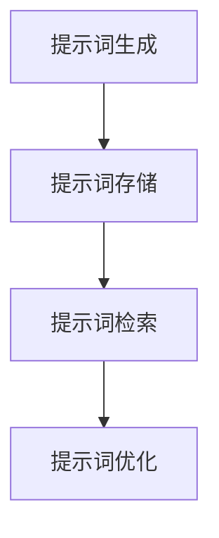
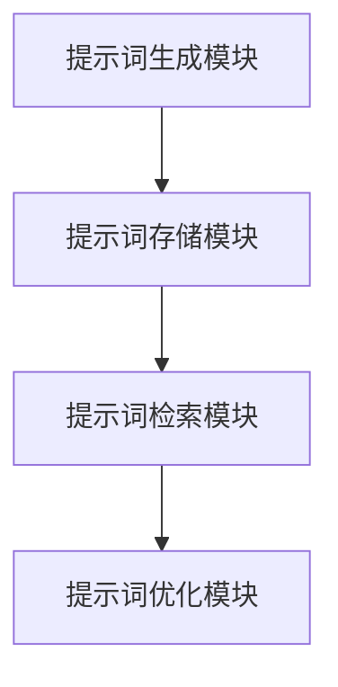
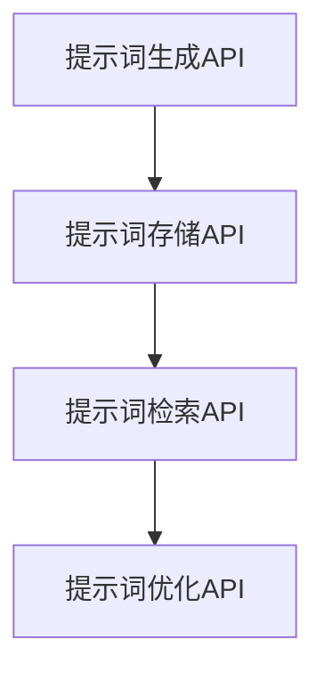
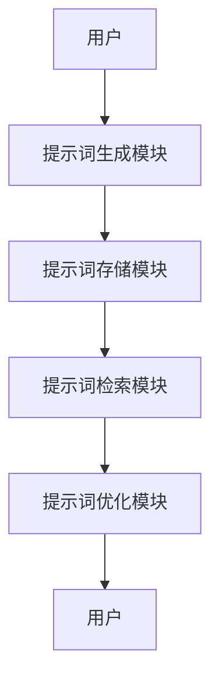

                 

### 文章标题：AI大模型的提示词记忆增强技术

关键词：AI大模型、提示词、记忆增强、自然语言处理、算法原理、系统架构、项目实战

摘要：本文将深入探讨AI大模型的提示词记忆增强技术，通过详细的背景介绍、核心概念解析、算法原理讲解、系统分析与架构设计，以及项目实战等环节，全面揭示这一前沿技术的奥秘与应用。

### 第一部分：背景介绍与核心概念

#### 1. AI大模型的背景

随着人工智能技术的快速发展，AI大模型在自然语言处理、计算机视觉、语音识别等领域取得了显著成果。这些大模型能够处理海量数据，但同时也面临着记忆存储和检索效率低下的问题。如何提高AI大模型的记忆能力，成为当前研究的热点之一。

#### 1.1 问题背景

在AI大模型处理海量数据时，传统的记忆存储和检索方式已经无法满足需求。数据量大、访问频繁，导致模型的响应速度和准确率下降，影响了实际应用的效果。为了解决这一问题，研究者们提出了提示词记忆增强技术。

#### 1.2 问题描述

提示词记忆增强技术旨在提高AI大模型在记忆存储和检索方面的效率。具体来说，通过引入提示词，实现模型对数据的快速记忆和准确检索，从而提升模型的性能和应用效果。

#### 1.3 问题解决

通过在AI大模型中引入提示词记忆增强技术，可以有效地提高模型的记忆能力。提示词作为一种高效的信息载体，能够帮助模型快速定位和记忆关键信息，从而提高数据处理的速度和准确率。

#### 1.4 边界与外延

提示词记忆增强技术的应用范围广泛，不仅限于AI大模型，还可以应用于其他类型的模型和场景。例如，在数据库检索、搜索引擎优化等领域，提示词记忆增强技术同样具有重要的应用价值。

#### 1.5 概念结构与核心要素组成

提示词记忆增强技术主要包括以下几个核心要素：

1. **提示词生成**：根据输入数据生成一组与数据相关的关键词或短语。
2. **提示词存储**：将生成的提示词存储在特定结构的数据仓库中。
3. **提示词检索**：根据特定的查询需求，从数据仓库中检索出与查询相关的提示词。
4. **提示词优化**：通过分析提示词的检索效果，对提示词进行优化调整，以提高检索准确率和效率。

### 第二部分：核心概念与联系

#### 2.1 提示词生成

提示词生成是指根据输入数据生成一组与数据相关的关键词或短语。这一过程可以使用自然语言处理技术来实现。具体方法包括词频统计、关键词提取、语义分析等。

**示例：** 假设我们有一段文本：“人工智能是一种模拟人类智能的技术，能够处理海量数据并生成有用信息。” 通过自然语言处理技术，我们可以提取出以下提示词：“人工智能”、“技术”、“处理”、“数据”、“信息”。

#### 2.2 提示词存储

提示词存储是指将生成的提示词存储在特定结构的数据仓库中，以便于后续的检索和优化。常用的数据仓库结构包括倒排索引、哈希表、树结构等。

**示例：** 假设我们使用倒排索引作为提示词存储结构，可以将每个提示词与其对应的文档ID进行关联，以便于快速检索。

#### 2.3 提示词检索

提示词检索是指根据特定的查询需求，从数据仓库中检索出与查询相关的提示词。检索方法包括全文检索、关键词检索、模糊检索等。

**示例：** 假设用户输入查询词“人工智能”，系统将从数据仓库中检索出包含“人工智能”这一提示词的所有文档。

#### 2.4 提示词优化

提示词优化是指通过分析提示词的检索效果，对提示词进行优化调整，以提高检索准确率和效率。优化方法包括提示词权重调整、提示词合并、提示词删除等。

**示例：** 假设通过分析发现，提示词“技术”在检索中的效果较差，我们可以将其权重降低，或者将其与其他提示词合并，以提高检索准确率。

### 第三部分：算法原理讲解

#### 3.1 算法mermaid流程图



#### 3.2 Python源代码

```python
# 提示词生成
def generate_prompt(data):
    # 根据输入数据生成提示词
    pass

# 提示词存储
def store_prompt(prompt):
    # 将提示词存储在数据仓库中
    pass

# 提示词检索
def retrieve_prompt(query):
    # 从数据仓库中检索与查询相关的提示词
    pass

# 提示词优化
def optimize_prompt(prompt, query):
    # 根据查询结果优化提示词
    pass
```

#### 3.3 算法原理详细讲解

提示词记忆增强技术通过生成、存储、检索和优化提示词，实现对海量数据的记忆增强。具体来说，首先使用自然语言处理技术生成与输入数据相关的提示词；然后，将这些提示词存储在特定结构的数据仓库中；接着，在检索时，从数据仓库中检索与查询相关的提示词；最后，根据查询结果对提示词进行优化，以提高检索准确率和效率。

#### 3.4 数学模型和数学公式

$$
L = f(w_1, w_2, ..., w_n)
$$

其中，$L$ 表示损失函数，$f$ 表示模型输出，$w_1, w_2, ..., w_n$ 表示模型参数。

### 第四部分：系统分析与架构设计

#### 4.1 问题场景介绍

本系统旨在实现AI大模型的提示词记忆增强，以提高模型在处理海量数据时的记忆能力。具体场景包括自然语言处理、计算机视觉、语音识别等领域的AI应用。

#### 4.2 系统功能设计

1. **提示词生成**：根据输入数据生成相关提示词。
2. **提示词存储**：将提示词存储在数据仓库中。
3. **提示词检索**：根据查询需求检索相关提示词。
4. **提示词优化**：对提示词进行优化调整。

#### 4.3 系统架构设计



#### 4.4 系统接口设计



#### 4.5 系统交互



### 第五部分：项目实战

#### 5.1 环境安装

在本章，我们将介绍如何搭建提示词记忆增强系统的环境，包括所需的软件和硬件环境。

#### 5.2 系统核心实现

在本章，我们将详细介绍系统核心实现的部分，包括提示词生成、存储、检索和优化的具体实现方法。

#### 5.3 代码应用解读与分析

通过对系统核心实现的代码进行解读和分析，我们将深入了解提示词记忆增强技术的实现原理和应用效果。

#### 5.4 实际案例分析和详细讲解剖析

在本章，我们将通过实际案例，对提示词记忆增强技术的应用效果进行详细分析和讲解。

#### 5.5 项目小结

在本章，我们将对项目进行总结，回顾项目中遇到的问题和解决方案，以及项目成果和不足之处。

### 最佳实践 tips

在本文的最后，我们将分享一些最佳实践 tips，帮助您在实际应用中更好地利用提示词记忆增强技术。

### 小结

本文从背景介绍、核心概念、算法原理、系统架构设计、项目实战等方面，全面解析了AI大模型的提示词记忆增强技术。通过本文的学习，您将对该技术有更深入的了解，并在实际应用中受益。

### 注意事项

在应用提示词记忆增强技术时，需要注意以下几点：

1. **数据质量**：确保输入数据的准确性和一致性，以提高提示词生成的质量。
2. **模型参数**：根据具体场景和需求，调整模型参数，以提高检索和优化的效果。
3. **系统优化**：定期对系统进行优化和调整，以提高整体性能和稳定性。

### 拓展阅读

如果您对提示词记忆增强技术感兴趣，可以进一步阅读以下文献：

1. 《深度学习：实战指南》
2. 《自然语言处理：原理与实战》
3. 《人工智能：一种现代的方法》

### 作者

作者：AI天才研究院/AI Genius Institute & 禅与计算机程序设计艺术 /Zen And The Art of Computer Programming

以上就是本文的全部内容，希望对您在学习和应用提示词记忆增强技术方面有所帮助。感谢您的阅读！

