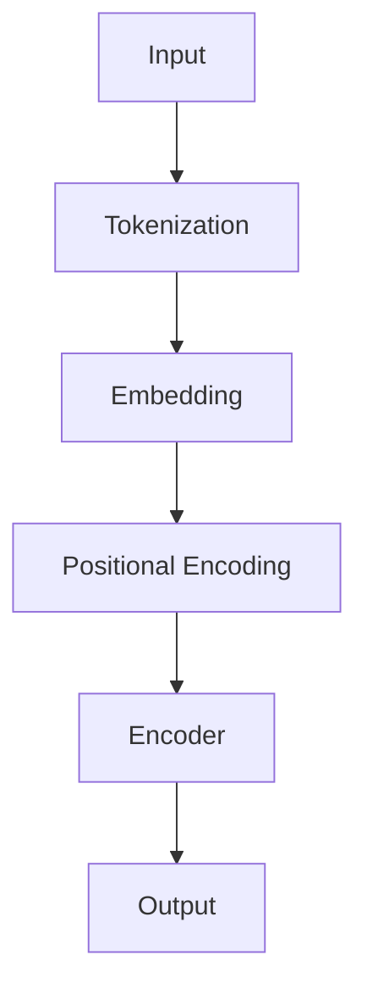
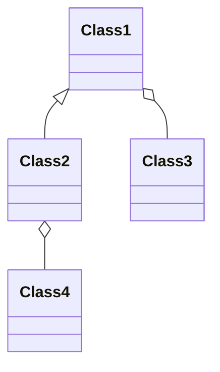
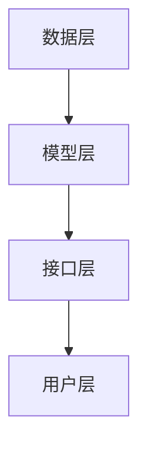
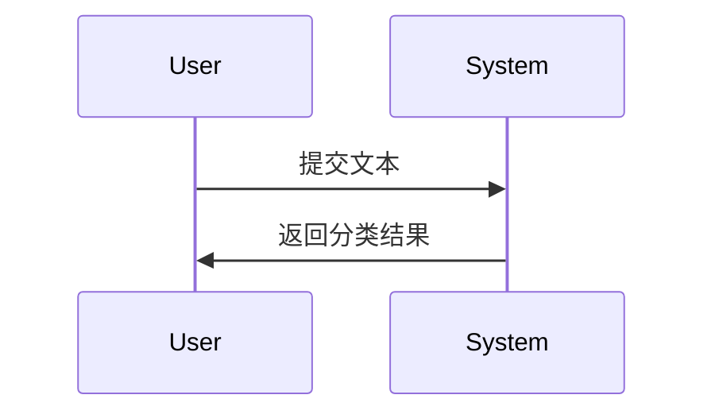

                 


### AI大模型的提示词调优技术

#### 关键词：
AI 大模型、提示词调优、预训练、微调、神经架构搜索

#### 摘要：
本文深入探讨了人工智能大模型的提示词调优技术。首先介绍了AI大模型的基本概念及其在各个领域的应用。然后，我们详细分析了提示词调优的核心概念和重要性。接着，文章探讨了AI大模型的理论基础，包括神经网络和深度学习的基本原理。随后，我们介绍了预训练和微调的详细技术，包括优化方法和性能评估。最后，文章通过实际应用案例展示了提示词调优技术在实际项目中的应用，并提供了一些最佳实践和注意事项。

---

### Part 1: 引言

#### 1.1 AI大模型概述
AI大模型是指参数量超过数十亿、甚至千亿级别的深度学习模型。这些模型通常通过大量数据预训练，具备强大的特征提取和表示能力。随着计算能力的提升和算法的进步，AI大模型在自然语言处理、计算机视觉、语音识别等领域取得了显著的突破。

**核心概念**：
- **参数量**：指模型中参数的数量，是衡量模型规模的重要指标。
- **预训练**：在特定任务之外使用大量未标注数据对模型进行训练，以提高其泛化能力。
- **应用领域**：自然语言处理、计算机视觉、语音识别等。

#### 1.2 提示词调优概念
提示词调优是一种通过优化输入提示来提升模型特定任务性能的技术。通过调整提示词的长度、内容、格式等，可以使模型更好地适应特定任务，从而提高性能。

**核心概念**：
- **提示词**：输入到模型中的关键信息，用于引导模型生成预期的输出。
- **调优**：调整模型的输入以优化其性能的过程。

#### 1.3 提示词调优技术方法
常见的提示词调优技术包括：
- **基于规则的方法**：通过设计特定的规则来生成提示词，如使用关键字、短语等。
- **基于机器学习的方法**：使用已有的标注数据训练模型，生成提示词。

#### 1.4 大模型调优挑战与机会
大模型调优面临以下挑战：
- **计算资源需求**：大模型训练和微调需要大量的计算资源。
- **数据需求**：需要大量的高质量标注数据进行微调。

然而，大模型调优也带来了以下机会：
- **提升模型性能**：通过优化提示词，可以显著提升模型在特定任务上的性能。
- **拓宽应用场景**：大模型调优技术可以使得AI大模型更好地适应各种不同的应用场景。

---

### Part 2: AI大模型理论基础

#### 2.1 AI大模型基本原理
AI大模型的核心是深度神经网络，特别是Transformer架构。Transformer通过自注意力机制（Self-Attention）和多头注意力（Multi-Head Attention）实现了对输入数据的全局上下文理解和表示学习。

**核心概念**：
- **自注意力**：模型内部的每个位置都能够获取到其他所有位置的信息。
- **多头注意力**：将自注意力机制扩展到多个头，以获得不同的表示。

#### 2.2 神经网络与深度学习
神经网络是模拟人脑信息处理机制的计算机模型。深度学习是神经网络的一种，通过多层次的非线性变换，实现从简单特征到复杂特征的自动提取。

**核心概念**：
- **神经网络**：由神经元（节点）组成的网络，通过权重和偏置进行信息传递。
- **深度学习**：多层神经网络，通过反向传播算法进行参数优化。

#### 2.3 大模型架构
大模型的架构设计决定了其性能和效率。常见的架构包括：

- **Transformer**：基于自注意力机制的模型，广泛应用于NLP任务。
- **BERT**：双向编码表示器，通过预训练和微调在多个NLP任务上取得显著效果。

**Mermaid图示例**：

上述Mermaid图展示了从输入到输出的基本流程。

---

### Part 3: 提示词调优技术

#### 3.1 预训练技术
预训练是AI大模型训练的第一步，主要目标是让模型学会对输入数据进行编码和解码。

**核心概念**：
- **预训练任务**：如BERT中的Masked Language Model（MLM）和Next Sentence Prediction（NSP）。
- **预训练数据集**：如Wikipedia、维基百科、Common Crawl等。

**算法原理**：
预训练过程主要包括以下步骤：

1. **数据预处理**：将文本转换为token序列。
2. **模型初始化**：随机初始化模型参数。
3. **前向传播与反向传播**：通过梯度下降优化模型参数。

**Python代码示例**：
```python
import tensorflow as tf

# 初始化模型
model = tf.keras.Sequential([
    tf.keras.layers.Embedding(input_dim=10000, output_dim=16),
    tf.keras.layers.GlobalAveragePooling1D(),
    tf.keras.layers.Dense(units=1, activation='sigmoid')
])

# 编写损失函数和优化器
model.compile(optimizer='adam',
              loss='binary_crossentropy',
              metrics=['accuracy'])

# 训练模型
model.fit(x_train, y_train, epochs=10)
```

---

### Part 4: 提示词调优应用案例

#### 4.1 项目背景
本项目旨在使用预训练的BERT模型进行文本分类，通过提示词调优来提升模型在特定领域的表现。

#### 4.2 系统设计
系统功能设计包括数据预处理、模型训练、模型评估等模块。系统架构设计包括数据层、模型层、接口层等。

**Mermaid类图示例**：


**Mermaid架构图示例**：


**Mermaid序列图示例**：


#### 4.3 实际案例
在本项目中，我们使用了预训练的BERT模型，并通过微调提示词来提升模型在医疗文本分类任务上的表现。以下是一个简单的Python代码示例，用于实现文本分类任务：

```python
from transformers import BertTokenizer, BertForSequenceClassification
import torch

# 加载预训练模型
tokenizer = BertTokenizer.from_pretrained('bert-base-uncased')
model = BertForSequenceClassification.from_pretrained('bert-base-uncased')

# 预处理文本
inputs = tokenizer("Hello, my dog is cute", return_tensors="pt")

# 进行预测
outputs = model(**inputs)

# 获取预测结果
logits = outputs.logits
predictions = torch.softmax(logits, dim=-1).detach().numpy()

# 输出分类结果
print(predictions)
```

---

### Part 5: 最佳实践与总结

#### 5.1 最佳实践
- **选择合适的预训练模型**：根据任务需求选择合适的预训练模型。
- **数据预处理**：确保数据质量和一致性。
- **提示词设计**：通过实验优化提示词长度和内容。

#### 5.2 小结
AI大模型的提示词调优技术是提升模型性能的有效手段。通过合理设计和调整提示词，可以显著提高模型在特定任务上的表现。

#### 5.3 注意事项
- **计算资源**：提示词调优需要大量计算资源，确保足够的硬件支持。
- **数据质量**：高质量的数据是提示词调优成功的关键。

#### 5.4 拓展阅读
- [1] "BERT: Pre-training of Deep Bidirectional Transformers for Language Understanding" - Devlin et al., 2019
- [2] "GPT-3: Language Models are few-shot learners" - Brown et al., 2020

---

### 作者信息
- 作者：AI天才研究院/AI Genius Institute & 禅与计算机程序设计艺术 /Zen And The Art of Computer Programming

