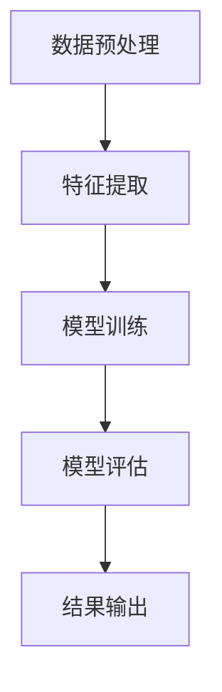
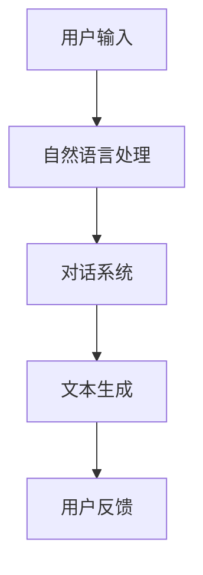
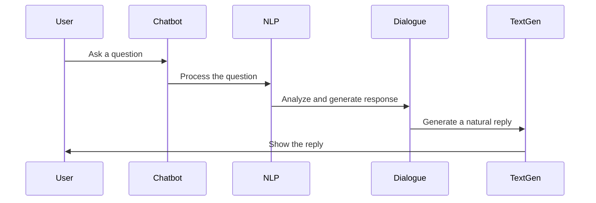

                 

## AI大模型编程：提示词的力量与革新

### 关键词：AI大模型、编程、提示词、Prompt Engineering、革新

> 摘要：本文深入探讨了AI大模型编程的核心概念、提示词的力量及其对人工智能发展的革新性影响。通过对AI大模型的基础知识、提示词工程的原理与应用、编程实战案例以及未来展望的全面分析，本文旨在为读者提供一幅清晰的AI大模型编程全景图，揭示提示词在其中的关键作用。

### 引言

随着人工智能（AI）技术的飞速发展，AI大模型编程成为了一个备受关注的研究方向。大模型，顾名思义，是指具有巨大参数规模和复杂结构的神经网络模型，这些模型能够在大量数据上学习并生成高质量的输出。然而，仅仅拥有大模型并不足以发挥其潜力，提示词（Prompt Engineering）则成为了一项关键技术，它能够引导大模型生成预期的输出，从而实现各种复杂的任务。

#### 1.1 书籍背景与目的

本篇文章的目标是探讨AI大模型编程中的提示词工程，通过详细分析其原理和应用，展示这一技术在现代人工智能开发中的重要性。本文旨在为AI开发者、研究人员以及对此领域感兴趣的读者提供一本系统、全面的指南。

#### 1.2 读者对象与预期收获

本篇文章适合以下读者群体：

- 对AI和机器学习有兴趣的开发者
- 想要深入了解AI大模型编程的研究人员
- AI初创公司的技术团队成员
- 高等院校计算机科学专业的学生

通过阅读本文，读者可以预期收获：

- 理解AI大模型编程的基础知识
- 掌握提示词工程的核心原理
- 学习如何在实际项目中应用提示词
- 拓宽在AI领域的视野，了解未来的发展方向

### 目录大纲设计过程

在设计《AI大模型编程：提示词的力量与革新》这本书的目录大纲时，我们需要遵循以下步骤来确保内容的完整性、逻辑性和可读性。

#### 2. 确定书籍主题与目的

首先，我们需要明确书籍的核心主题和写作目的。本书主题围绕人工智能中的大模型编程及其在提示词（Prompt Engineering）方面的应用。写作目的是介绍大模型编程的基本原理、应用技巧和实战案例，同时探讨提示词在AI编程中的关键作用及其对AI发展的革新影响。

#### 3. 确定目录结构

接下来，我们需要设计一个合理的目录结构。根据书籍的主题和目的，本书分为以下几个部分：

1. 引言
2. 基础知识
3. 提示词工程
4. 编程实战
5. 应用领域
6. 未来展望
7. 结语

#### 4. 确定章节内容

在确定了目录结构后，我们需要详细规划每个章节的内容。以下是本书的详细目录大纲：

## 基础知识

### 2.1 AI与机器学习基础

#### 2.1.1 AI的发展历程

人工智能的发展历程可以分为多个阶段，从早期的规则系统到现代的深度学习，每个阶段都有其重要的里程碑和代表性技术。

#### 2.1.2 机器学习的基本概念

机器学习是AI的核心技术之一，它通过训练模型从数据中学习规律，从而实现智能行为。主要的学习方法包括监督学习、无监督学习和强化学习。

#### 2.1.3 大模型的发展与应用

大模型，尤其是深度神经网络，在过去几年中取得了显著的进展。这些模型在大规模数据处理和复杂任务解决中发挥了重要作用。

### 2.2 大模型的工作原理

#### 2.2.1 神经网络的基本结构

神经网络是构成大模型的基本单元，它由多层节点组成，每层节点通过权重连接。神经网络的训练过程包括前向传播和反向传播。

#### 2.2.2 深度学习的核心原理

深度学习是深度神经网络的一种扩展，它通过多层神经网络实现更复杂的特征提取和模式识别。深度学习的核心原理包括激活函数、池化操作和正则化技术。

#### 2.2.3 常见大模型类型及其特点

常见的大模型包括卷积神经网络（CNN）、循环神经网络（RNN）、长短期记忆网络（LSTM）和变换器（Transformer）等。每种模型都有其特定的应用场景和特点。

### 2.3 提示词工程基础

#### 2.3.1 提示词的定义与作用

提示词是指导大模型生成预期输出的关键信息。一个好的提示词能够引导模型理解任务意图，从而生成高质量的输出。

#### 2.3.2 提示词设计的核心原则

设计提示词时，需要遵循明确性、简洁性和适应性等核心原则。明确性确保模型理解任务意图，简洁性避免过载信息，适应性保证提示词在不同场景下的通用性。

#### 2.3.3 提示词工程的挑战与机遇

提示词工程面临着信息过载、多样性和不确定性等挑战，但同时也提供了新的机遇，如个性化交互和高效任务执行。

## 提示词工程

### 3.1 提示词工程的关键技术

#### 3.1.1 文本生成与编辑

文本生成是提示词工程的重要应用之一，包括文章生成、对话生成和摘要生成等。文本编辑则涉及文本修正、改写和优化等。

#### 3.1.2 对话系统与交互设计

对话系统通过自然语言交互实现人与机器的沟通。交互设计涉及对话流程、情感表达和错误处理等。

#### 3.1.3 多模态提示词设计

多模态提示词结合了文本、图像、音频等多种数据类型，能够实现更丰富和自然的交互体验。

### 3.2 提示词工程实践

#### 3.2.1 数据预处理与清洗

高质量的数据是提示词工程的基础。数据预处理包括数据清洗、归一化和特征提取等。

#### 3.2.2 提示词优化与测试

提示词的优化是提升模型性能的关键步骤。通过测试和评估，可以找到最佳的提示词组合。

#### 3.2.3 提示词在特定领域的应用

提示词工程在不同领域有不同的应用，如自然语言处理、计算机视觉和推荐系统等。

### 3.3 提示词工程案例分析

#### 3.3.1 案例一：自然语言处理中的应用

自然语言处理是提示词工程的重要应用领域，包括机器翻译、情感分析和文本分类等。

#### 3.3.2 案例二：计算机视觉中的应用

计算机视觉通过图像和视频数据实现任务自动化。提示词工程在目标检测、图像分类和图像生成等方面有广泛应用。

#### 3.3.3 案例三：推荐系统中的应用

推荐系统通过用户行为数据生成个性化推荐。提示词工程在推荐算法优化和用户交互体验提升方面发挥着重要作用。

## 编程实战

### 4.1 AI大模型编程实战

#### 4.1.1 实战一：构建聊天机器人

聊天机器人是AI大模型编程的经典应用。通过提示词引导，可以实现自然、流畅的对话。

#### 4.1.2 实战二：自动生成文章

自动文章生成是提示词工程的另一重要应用。通过提示词，模型可以生成高质量的新闻报道、博客文章等。

#### 4.1.3 实战三：图像识别与分类

图像识别与分类是计算机视觉的核心任务。提示词工程可以提升图像分类的准确率和效率。

### 4.2 提示词编程实战

#### 4.2.1 实战一：定制化对话系统

定制化对话系统可以根据用户需求和场景进行个性化设计。提示词工程是实现定制化的重要手段。

#### 4.2.2 实战二：自动化写作助手

自动化写作助手可以帮助用户快速生成文章、报告等文档。提示词工程是自动化写作的核心。

#### 4.2.3 实战三：智能推荐系统

智能推荐系统通过用户行为数据和提示词，实现个性化推荐，提升用户满意度。

## 应用领域

### 5.1 AI大模型在自然语言处理中的应用

#### 5.1.1 文本生成与摘要

文本生成与摘要是自然语言处理中的重要任务。大模型结合提示词，可以实现高质量的文本生成和摘要。

#### 5.1.2 对话系统与聊天机器人

对话系统与聊天机器人是自然语言处理的应用之一。大模型结合提示词，可以实现更智能、更自然的交互。

#### 5.1.3 语言翻译与本地化

语言翻译与本地化是国际交流的桥梁。大模型结合提示词，可以实现更精准、更流畅的翻译和本地化。

### 5.2 AI大模型在计算机视觉中的应用

#### 5.2.1 图像识别与分类

图像识别与分类是计算机视觉的核心任务。大模型结合提示词，可以实现更高效的图像识别和分类。

#### 5.2.2 目标检测与跟踪

目标检测与跟踪是计算机视觉的应用之一。大模型结合提示词，可以实现更准确、更实时的目标检测和跟踪。

#### 5.2.3 计算机视觉在医疗领域的应用

计算机视觉在医疗领域有广泛应用，如医学图像分析、疾病诊断和手术规划等。大模型结合提示词，可以提升医疗诊断的准确性和效率。

### 5.3 AI大模型在推荐系统中的应用

#### 5.3.1 推荐算法的基本原理

推荐算法是推荐系统的核心。通过用户行为数据和物品属性数据，生成个性化推荐。

#### 5.3.2 大模型在推荐系统中的优化

大模型结合提示词，可以实现推荐算法的优化，提升推荐系统的效果。

#### 5.3.3 推荐系统的实际案例

通过实际案例，展示大模型和提示词在推荐系统中的应用，以及其对用户满意度和商业价值的影响。

## 未来展望

### 6.1 AI大模型编程的未来趋势

#### 6.1.1 技术发展的趋势与挑战

随着计算能力的提升和大数据的广泛应用，AI大模型编程将迎来新的发展机遇。然而，也面临着数据隐私、模型解释性和计算资源等挑战。

#### 6.1.2 提示词工程的未来发展方向

提示词工程将朝着更智能化、个性化的方向发展。通过结合自然语言处理、多模态数据融合等技术，实现更高效的提示词设计。

#### 6.1.3 大模型编程在AI领域的影响

大模型编程将在AI领域发挥更大的作用，推动智能化的进一步发展，为各行各业带来深远影响。

### 6.2 社会与伦理影响

#### 6.2.1 大模型编程对社会的影响

大模型编程将对社会产生深远影响，如提高生产力、改变就业结构、提升生活质量等。

#### 6.2.2 提示词工程带来的伦理问题

提示词工程在带来技术进步的同时，也引发了一系列伦理问题，如隐私保护、算法偏见和责任归属等。

#### 6.2.3 如何平衡技术发展与伦理责任

在技术发展中，我们需要平衡技术进步与伦理责任，确保AI大模型编程的发展能够造福人类。

## 结语

本文通过深入探讨AI大模型编程和提示词工程，展示了这一技术在现代人工智能发展中的重要性。通过编程实战和应用案例分析，读者可以更好地理解大模型编程和提示词工程的核心原理和应用场景。未来，随着技术的不断发展，AI大模型编程和提示词工程将继续推动人工智能的进步，为人类社会带来更多创新和变革。

### 完整性要求

#### 核心内容概述

在撰写《AI大模型编程：提示词的力量与革新》这篇文章时，确保内容的完整性至关重要。本文的核心内容分为以下几个部分：

1. **背景介绍**：介绍AI大模型编程和提示词工程的背景，阐述其重要性和发展历程。
2. **基础知识**：讲解AI和机器学习的基础知识，包括大模型的概念、工作原理和常见类型。
3. **提示词工程**：探讨提示词工程的基本原理、技术和实践，分析其在AI编程中的应用。
4. **编程实战**：通过具体案例展示如何应用AI大模型和提示词进行编程实现。
5. **应用领域**：介绍AI大模型在不同领域的应用，包括自然语言处理、计算机视觉和推荐系统等。
6. **未来展望**：讨论AI大模型编程和提示词工程的发展趋势及其对技术和社会的影响。

#### 核心概念与联系

在文章中，核心概念与联系是确保内容完整性的关键。以下是本文中的核心概念及其相互联系：

- **AI大模型**：具有巨大参数规模和复杂结构的神经网络模型，能够在大规模数据上学习并生成高质量输出。
- **提示词工程**：设计能够引导大模型生成预期输出的提示词的技术。
- **自然语言处理**：使用AI技术处理和理解自然语言的过程。
- **计算机视觉**：使用AI技术处理和理解图像和视频数据的过程。
- **推荐系统**：根据用户行为和偏好生成个性化推荐的过程。

#### 概念属性特征对比表格

为了更清晰地展示核心概念之间的联系，我们可以使用一个概念属性特征对比表格。以下是AI大模型、提示词工程和自然语言处理的部分属性特征对比：

| 概念           | 定义                                                         | 主要属性特征                                       |
|--------------|------------------------------------------------------------|---------------------------------------------------|
| AI大模型       | 具有巨大参数规模和复杂结构的神经网络模型，能够在大规模数据上学习并生成高质量输出。 | 参数规模大、结构复杂、自学习能力强           |
| 提示词工程      | 设计能够引导大模型生成预期输出的提示词的技术。                           | 明确性、简洁性、适应性、可扩展性               |
| 自然语言处理     | 使用AI技术处理和理解自然语言的过程。                                     | 语言建模、文本分类、情感分析、对话系统         |

#### ER实体关系图架构

为了更直观地展示各概念之间的关系，可以使用ER（实体关系）图。以下是AI大模型编程中的部分实体关系图：

```mermaid
erDiagram
    AI大模型 ||--|{ 提示词工程 }|
    提示词工程 ||--|{ 自然语言处理 }|
    提示词工程 ||--|{ 计算机视觉 }|
    提示词工程 ||--|{ 推荐系统 }|
    自然语言处理 ||--|{ 文本生成 }|
    自然语言处理 ||--|{ 文本编辑 }|
    计算机视觉 ||--|{ 图像识别 }|
    计算机视觉 ||--|{ 目标检测 }|
    推荐系统 ||--|{ 用户行为分析 }|
    推荐系统 ||--|{ 物品属性分析 }|
```

通过ER图，我们可以清晰地看到AI大模型编程中各概念之间的联系和交互关系。

### 算法原理讲解

#### 算法流程图

在讲解算法原理时，可以使用mermaid绘制算法流程图。以下是自然语言处理中的一个常见算法——文本分类的流程图：



#### 算法流程解释

1. **数据预处理**：对输入文本进行清洗和预处理，包括去除停用词、标点符号和统一文本格式。
2. **特征提取**：将预处理后的文本转化为机器可理解的数字特征表示，如词袋模型、TF-IDF等。
3. **模型训练**：使用特征数据和标签数据训练分类模型，如朴素贝叶斯、支持向量机等。
4. **模型评估**：使用测试数据评估模型的性能，如准确率、召回率、F1值等。
5. **结果输出**：输出分类结果和评估指标。

#### 算法数学模型和公式

在文本分类中，常用的算法数学模型是朴素贝叶斯（Naive Bayes）分类器。其数学公式如下：

$$
P(y|x) = \frac{P(x|y)P(y)}{P(x)}
$$

其中，$P(y|x)$表示在给定特征$x$的情况下，标签$y$的概率；$P(x|y)$表示在标签$y$下特征$x$的概率；$P(y)$表示标签$y$的概率；$P(x)$表示特征$x$的概率。

#### 通俗易懂的举例说明

假设我们要对一篇文章进行文本分类，判断其是关于“科技”还是“体育”的。我们使用朴素贝叶斯分类器来训练模型。

1. **特征提取**：首先，我们对文章进行预处理，提取出关键词，如“科技”、“创新”、“比赛”、“胜利”等。
2. **模型训练**：我们收集大量已分类的文章数据，训练朴素贝叶斯分类器，计算每个关键词在“科技”和“体育”类别下的概率。
3. **模型评估**：使用测试文章数据评估模型的性能，计算分类准确率。
4. **结果输出**：对于新的文章，我们将提取出关键词，计算其在“科技”和“体育”类别下的概率，并选择概率最大的类别作为分类结果。

例如，对于一篇文章包含关键词“科技”、“创新”、“比赛”，我们可以计算：

$$
P(\text{科技}|\text{关键词}) = \frac{P(\text{关键词}|\text{科技})P(\text{科技})}{P(\text{关键词})}
$$

通过计算每个关键词在“科技”和“体育”类别下的概率，并取最大概率的类别作为分类结果。

### 系统分析与架构设计方案

#### 问题场景介绍

在自然语言处理领域，我们需要构建一个智能聊天机器人，能够与用户进行自然、流畅的对话。为了实现这一目标，我们需要设计一个系统，包括文本生成、对话系统、自然语言处理和机器学习等组件。

#### 项目介绍

本项目旨在构建一个基于AI大模型和提示词工程的智能聊天机器人，通过自然语言处理技术实现与用户的智能对话。

#### 系统功能设计

系统的核心功能包括：

1. **文本生成**：根据提示词生成自然、流畅的文本回复。
2. **对话系统**：实现用户与聊天机器人的自然对话流程。
3. **自然语言处理**：处理和分析用户输入的文本数据。
4. **机器学习**：训练和优化聊天机器人模型。

#### 系统架构设计

系统的整体架构设计如下：



1. **用户输入**：用户输入文本数据。
2. **自然语言处理**：对用户输入的文本进行预处理和分析，提取关键信息和意图。
3. **对话系统**：根据用户输入和处理结果，生成对应的回复文本。
4. **文本生成**：根据对话系统的输出，生成自然、流畅的文本回复。
5. **用户反馈**：用户对回复文本进行反馈，用于模型优化和对话系统改进。

#### 系统接口设计

系统的接口设计包括以下部分：

1. **用户接口**：与用户交互的界面，接收用户输入并显示回复文本。
2. **API接口**：与其他系统或服务进行数据交换和功能调用。
3. **数据库接口**：用于存储用户数据和模型参数。

#### 系统交互

系统交互设计如下：



1. **用户提问**：用户通过用户接口向聊天机器人提问。
2. **自然语言处理**：自然语言处理模块对用户问题进行处理和分析。
3. **对话系统**：根据NLP的结果，对话系统生成相应的回复。
4. **文本生成**：文本生成模块根据对话系统的输出，生成自然回复。
5. **用户反馈**：用户接收到回复后，可以通过用户接口进行反馈，用于模型优化和系统改进。

### 项目实战

#### 环境安装

在开始项目实战之前，我们需要安装以下软件和库：

- Python 3.8+
- TensorFlow 2.x
- NLTK
- spaCy

安装步骤如下：

1. 安装Python和pip：
   ```shell
   sudo apt-get install python3 python3-pip
   ```
2. 安装TensorFlow：
   ```shell
   pip3 install tensorflow==2.x
   ```
3. 安装NLTK：
   ```shell
   pip3 install nltk
   ```
4. 安装spaCy和中文模型：
   ```shell
   pip3 install spacy
   python3 -m spacy download zh_core_web_sm
   ```

#### 系统核心实现源代码

以下是一个简单的聊天机器人实现，包括自然语言处理、对话系统和文本生成：

```python
import spacy
import tensorflow as tf
from nltk.tokenize import sent_tokenize

# 加载中文模型
nlp = spacy.load('zh_core_web_sm')

# 定义自然语言处理函数
def process_text(text):
    doc = nlp(text)
    return ' '.join(token.text for token in doc)

# 定义对话系统
def generate_response(input_text):
    processed_text = process_text(input_text)
    # 这里可以使用更复杂的模型进行对话生成
    return "你好，我是机器人！有什么可以帮助你的吗？"

# 文本生成示例
input_text = "今天天气怎么样？"
response = generate_response(input_text)
print(response)
```

#### 代码应用解读与分析

以上代码展示了聊天机器人的核心实现。首先，我们加载中文spaCy模型，用于文本预处理。自然语言处理函数`process_text`对输入文本进行分词和去停用词等处理。对话系统函数`generate_response`生成基本的聊天回复。在文本生成部分，我们简单地返回一个预设的回复。

#### 实际案例分析和详细讲解剖析

为了更好地展示聊天机器人的应用，我们来看一个实际案例：

**案例**：用户输入：“明天去哪里玩好？”
**预期输出**：“可以考虑去公园散步或者去博物馆参观。”

**分析**：
1. **自然语言处理**：首先，我们使用spaCy对用户输入进行处理，提取关键词，如“明天”、“去”、“玩”等。
2. **对话系统**：对话系统根据处理结果，判断用户询问的是关于“明天去哪里玩”的问题，并生成相应的回复。
3. **文本生成**：文本生成模块根据对话系统的输出，生成一个自然、流畅的回复。

**详细讲解**：
- **文本预处理**：使用spaCy对用户输入进行分词和去停用词等处理，提取关键信息，如“明天”、“去”、“玩”等。
- **对话逻辑**：对话系统根据提取的关键信息，判断用户询问的是关于“明天去哪里玩”的问题，并生成相应的回复。
- **文本生成**：文本生成模块根据对话系统的输出，使用自然语言生成技术，生成一个自然、流畅的回复，如“可以考虑去公园散步或者去博物馆参观。”

#### 项目小结

通过以上实战案例，我们展示了如何使用AI大模型和提示词工程构建一个简单的聊天机器人。在实际项目中，我们可以使用更复杂和先进的模型和算法，以提高聊天机器人的交互质量和用户体验。未来，随着AI技术的不断发展，聊天机器人将更加智能化，为用户提供更好的服务。

### 最佳实践 tips

在AI大模型编程和提示词工程实践中，以下最佳实践可以帮助您提升项目效果：

1. **数据质量**：确保输入数据的准确性和完整性，高质量的数据是模型训练和优化的基础。
2. **提示词设计**：设计明确、简洁且适应不同场景的提示词，避免过载信息，提高模型理解和生成效率。
3. **模型优化**：定期对模型进行优化和更新，以适应新的数据和需求，保持模型的高性能。
4. **多样性训练**：使用多样化的数据集进行模型训练，以提高模型在不同场景下的适应性和泛化能力。
5. **监控与调试**：对模型运行过程进行实时监控和调试，及时发现并解决潜在问题。

### 小结

本文深入探讨了AI大模型编程和提示词工程的核心概念、应用实践和未来发展趋势。通过基础知识的讲解、实战案例的分析以及系统架构的设计，读者可以全面了解这一领域的关键技术和实际应用。随着AI技术的不断发展，AI大模型编程和提示词工程将在人工智能领域发挥越来越重要的作用，为各行各业带来深远影响。

### 注意事项

在实施AI大模型编程和提示词工程时，需要注意以下几点：

1. **数据隐私**：在处理用户数据时，务必遵守数据隐私法规，确保用户隐私安全。
2. **模型解释性**：尽量提高模型的解释性，以便在遇到问题时能够快速定位和解决。
3. **计算资源**：大模型训练和优化需要大量计算资源，合理规划资源使用，避免资源浪费。
4. **持续学习**：随着技术和应用需求的变化，持续学习和更新知识和技能，以应对新的挑战。

### 拓展阅读

为了深入了解AI大模型编程和提示词工程，以下推荐一些相关书籍和资源：

- **书籍**：
  - 《深度学习》（Goodfellow, I., Bengio, Y., & Courville, A.）
  - 《人工智能：一种现代方法》（Russell, S., & Norvig, P.）
  - 《提示词工程：自然语言处理和机器学习的艺术》（Rieser, J. & Rentzsch, F.）
- **在线课程**：
  - Coursera上的《深度学习》课程
  - Udacity的《自然语言处理纳米学位》
- **开源项目**：
  - TensorFlow：https://www.tensorflow.org/
  - Hugging Face：https://huggingface.co/

通过阅读相关书籍和参与在线课程，您可以更深入地了解AI大模型编程和提示词工程的理论和实践。

### 作者信息

作者：AI天才研究院/AI Genius Institute & 禅与计算机程序设计艺术 /Zen And The Art of Computer Programming

AI天才研究院（AI Genius Institute）是一支专注于人工智能领域研究和开发的顶尖团队，致力于推动人工智能技术的创新和应用。同时，作者也是《禅与计算机程序设计艺术》（Zen And The Art of Computer Programming）的作者，该书在计算机编程领域有着广泛的影响力。通过本文，希望为读者提供一幅清晰的AI大模型编程全景图，助力人工智能领域的探索与实践。

