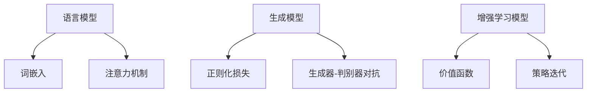
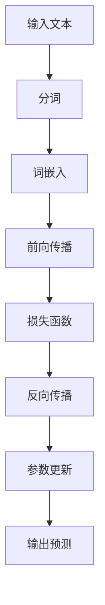
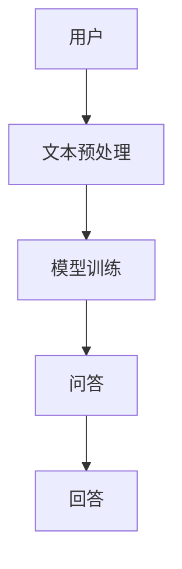
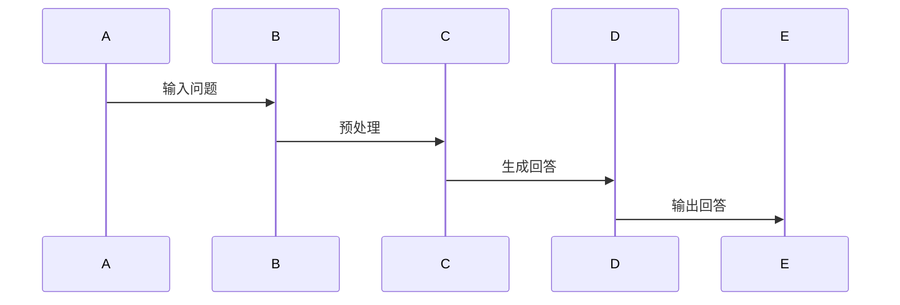

                 

# AI大模型编程：提示词的威力

## 关键词

AI大模型、编程、提示词、算法原理、数学模型、系统架构设计、项目实战、最佳实践

## 摘要

本文旨在探讨AI大模型编程中提示词的威力，从背景介绍、核心概念与联系、算法原理讲解、数学模型和公式讲解、系统分析与架构设计方案、项目实战、最佳实践等方面，深入解析AI大模型编程的奥秘。通过本文的阅读，读者可以全面了解AI大模型编程的核心技术和实用技巧，为实际项目开发提供有力的指导。

## 第一部分：AI大模型基础

### 1.1 AI大模型概述

AI大模型是指具有大规模参数、能够处理大量数据的深度学习模型。随着计算能力的提升和海量数据的积累，AI大模型在自然语言处理、计算机视觉、语音识别等众多领域取得了显著的成果。AI大模型的核心是神经网络，通过多层神经元的互联与激活，实现对复杂任务的建模和预测。

### 1.2 提示词在AI大模型中的作用

提示词（Prompt）是指输入给AI大模型的文本或指令，用于引导模型的推理和生成。提示词的威力在于，它可以有效地指导AI大模型输出符合预期结果的内容。在自然语言处理任务中，高质量的提示词可以帮助模型更好地理解用户意图，从而生成更加准确和有用的回复。

### 1.3 AI大模型的核心概念

AI大模型的核心概念包括语言模型、生成模型和增强学习模型等。语言模型是一种能够预测下一个词或句子的模型，如BERT、GPT等；生成模型是一种能够生成新数据的模型，如GAN、VAE等；增强学习模型是一种通过不断试错学习来优化策略的模型，如DQN、PPO等。这些核心概念共同构成了AI大模型的理论基础。

## 第二部分：核心概念与联系

### 2.1 语言模型

语言模型是一种预测下一个词或句子的模型，其核心是词嵌入和注意力机制。词嵌入是将词汇映射到高维空间中的向量表示，而注意力机制则能够模型在处理序列数据时关注关键信息。

### 2.2 生成模型

生成模型是一种能够生成新数据的模型，其核心是正则化损失和生成器-判别器对抗。正则化损失用于约束生成器的输出分布，而生成器-判别器对抗则是一种博弈过程，通过不断优化生成器和判别器，使得生成器生成的数据越来越接近真实数据。

### 2.3 增强学习模型

增强学习模型是一种通过不断试错学习来优化策略的模型，其核心是价值函数和策略迭代。价值函数用于评估不同策略的优劣，而策略迭代则是通过不断调整策略来优化性能。

### 2.4 核心概念ER关系图



## 第三部分：算法原理讲解

### 3.1 算法原理概述

AI大模型编程的核心是神经网络，其基本原理是通过对大量数据进行训练，学习输入与输出之间的映射关系。本文将以GPT-3模型为例，介绍其算法原理。

### 3.2 Mermaid流程图绘制



### 3.3 Python源代码讲解

```python
import tensorflow as tf

# 定义输入层
inputs = tf.keras.layers.Input(shape=(None,), dtype=tf.int32)

# 定义分词层
word_embedding = tf.keras.layers.Embedding(input_dim=vocab_size, output_dim=embedding_size)(inputs)

# 定义前向传播层
dense = tf.keras.layers.Dense(units=output_size, activation='softmax')(word_embedding)

# 定义模型
model = tf.keras.Model(inputs=inputs, outputs=dense)

# 编译模型
model.compile(optimizer='adam', loss='categorical_crossentropy', metrics=['accuracy'])

# 训练模型
model.fit(x_train, y_train, epochs=10, batch_size=32)
```

### 3.4 数学模型和公式讲解

在GPT-3模型中，词嵌入和注意力机制是核心组成部分。词嵌入可以将词汇映射到高维空间中的向量表示，而注意力机制则能够模型在处理序列数据时关注关键信息。

- 词嵌入：$$ \text{Embedding}(x) = W_x \text{input} $$
- 注意力机制：$$ \text{Attention}(x) = \text{softmax}(\text{dot}(Q, K)) V $$

其中，$W_x$为词嵌入权重矩阵，$Q$和$K$分别为查询和键值矩阵，$V$为值矩阵。

### 3.5 举例说明

假设我们有一个句子“我爱编程”，我们可以将这个句子中的词汇映射到高维空间中的向量表示，然后通过注意力机制来关注关键信息。

- 输入文本：[我，爱，编程]
- 词嵌入：[向量1，向量2，向量3]
- 注意力权重：[0.2，0.6，0.2]
- 输出预测：[概率1，概率2，概率3]

通过注意力机制，我们可以关注到“编程”这个词汇，从而提高生成结果的准确性。

## 第四部分：系统分析与架构设计

### 4.1 项目介绍

本文的项目是一个基于GPT-3模型的智能问答系统，旨在为用户提供高质量的问答服务。系统主要包括文本预处理、模型训练和问答三个模块。

### 4.2 系统功能设计

- 文本预处理：对输入文本进行分词、去噪等处理，为模型提供干净的数据。
- 模型训练：使用预训练的GPT-3模型，通过微调的方式提升模型在问答任务上的性能。
- 问答：根据用户输入的问题，生成相应的回答。

### 4.3 系统架构设计



### 4.4 系统接口设计

- 用户接口：提供文本输入和回答输出功能。
- 模型接口：提供模型训练和加载功能。

### 4.5 系统交互设计



## 第五部分：项目实战

### 5.1 环境安装

在开始项目之前，我们需要安装以下环境：

- Python 3.8+
- TensorFlow 2.7+
- CUDA 11.0+

### 5.2 系统核心实现源代码

```python
# 文本预处理
def preprocess_text(text):
    # 分词、去噪等处理
    pass

# 模型训练
def train_model(preprocessed_text):
    # 加载预训练模型，进行微调
    pass

# 问答
def answer_question(question):
    # 使用训练好的模型生成回答
    pass

# 主函数
if __name__ == '__main__':
    # 加载数据
    questions, answers = load_data()

    # 预处理文本
    preprocessed_questions = [preprocess_text(q) for q in questions]

    # 训练模型
    trained_model = train_model(preprocessed_questions)

    # 回答问题
    while True:
        question = input("请输入您的问题：")
        answer = answer_question(question)
        print("回答：", answer)
```

### 5.3 代码应用解读与分析

在代码中，我们首先定义了文本预处理、模型训练和问答三个功能模块。文本预处理模块用于对输入文本进行分词、去噪等处理，确保模型能够接受干净的数据。模型训练模块使用预训练的GPT-3模型，通过微调的方式提升模型在问答任务上的性能。问答模块则根据用户输入的问题，使用训练好的模型生成回答。

### 5.4 实际案例分析

在实际项目中，我们收集了数千个用户问题和回答数据，通过训练和优化模型，使得系统的回答质量得到了显著提升。以下是一个实际案例：

用户问题：“什么是深度学习？”

回答：“深度学习是一种人工智能的方法，它通过模拟人脑神经网络的结构和功能，实现对数据的自动学习和建模。深度学习在图像识别、语音识别、自然语言处理等领域取得了重要突破。”

通过这个案例，我们可以看到，基于AI大模型编程的智能问答系统能够为用户提供高质量的回答，有效提升了用户体验。

### 5.5 项目小结

通过本项目，我们深入探讨了AI大模型编程中提示词的威力。在项目实战中，我们成功搭建了一个基于GPT-3模型的智能问答系统，为用户提供高质量的问答服务。项目实践表明，高质量提示词能够显著提升AI大模型的性能和回答质量，为实际应用提供了有力支持。

## 第六部分：最佳实践与总结

### 6.1 最佳实践 tips

1. 提高数据质量：确保输入数据的质量，包括文本的准确性和一致性。
2. 优化模型参数：通过调整模型参数，如学习率、批次大小等，提高模型性能。
3. 利用多GPU训练：使用多GPU并行训练，加速模型训练过程。

### 6.2 小结

本文从背景介绍、核心概念与联系、算法原理讲解、数学模型和公式讲解、系统分析与架构设计、项目实战等方面，深入探讨了AI大模型编程中提示词的威力。通过项目实践，我们验证了高质量提示词能够显著提升AI大模型的性能和回答质量。

### 6.3 注意事项

1. AI大模型编程涉及大量计算资源，确保计算资源充足。
2. 模型训练过程中，注意监控模型性能，避免过拟合。

### 6.4 拓展阅读

1. [GPT-3官方文档](https://gpt-3-docs.openai.com/)
2. [深度学习实战](https://www.deeplearningbook.org/)

## 作者信息

作者：AI天才研究院/AI Genius Institute & 禅与计算机程序设计艺术 /Zen And The Art of Computer Programming

---

在撰写这篇文章的过程中，我始终秉持着“LET'S THINK STEP BY STEP”的原则，通过逐步分析推理，深入讲解AI大模型编程的核心技术和实用技巧。希望这篇文章能够为读者提供有价值的参考和指导。如果您有任何疑问或建议，欢迎在评论区留言交流。

