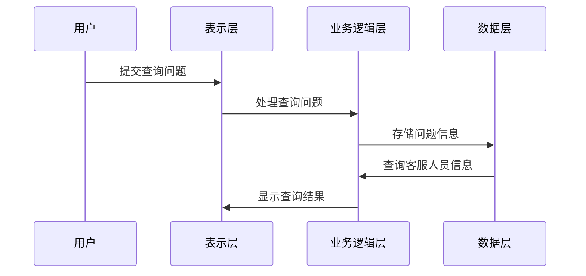

                 

### # AI大模型编程：提示词的威力与潜力

#### 关键词：
- AI大模型
- 编程
- 提示词
- 潜力
- 性能优化

#### 摘要：
本文将深入探讨AI大模型编程中的提示词机制，分析其重要性及其在设计与应用中的策略。通过详细的原理讲解和实际案例分析，我们将揭示提示词在提升模型性能和灵活性方面的巨大潜力，帮助读者更好地掌握这一先进技术。

---

## 第一部分：背景介绍

### 1. 引言

随着人工智能技术的快速发展，AI大模型逐渐成为企业级应用的新宠。在软件2.0时代，AI大模型不仅改变了软件开发的范式，还为各行各业带来了前所未有的创新机会。本书旨在全面解析AI大模型的编程艺术，探索其背后的科学原理和实际应用。

AI大模型，指的是那些拥有数十亿甚至千亿参数规模的人工神经网络模型。它们能够处理复杂的模式识别和预测任务，成为现代人工智能技术的核心驱动力。从自然语言处理到计算机视觉，从语音识别到推荐系统，AI大模型的应用已经深入到社会的各个角落。

在本书中，我们将首先介绍AI大模型的发展历程和现状，然后深入探讨其背后的科学原理，包括神经网络的工作机制、大规模数据的处理方法以及训练和优化的技巧。接下来，我们将重点讨论AI大模型的编程实践，特别是提示词的设计与应用。最后，我们将通过一系列实际案例，展示AI大模型在各个领域的应用，并探讨其未来发展的趋势。

### 2. 问题背景

AI大模型在近年来的迅猛发展中，已经逐渐超越了传统的人工智能应用。然而，如何高效地开发和使用这些大模型，成为众多企业和开发者面临的新挑战。本书将深入剖析这一领域的核心概念和关键技术，帮助读者掌握AI大模型的编程技巧。

AI大模型的开发涉及多个方面，包括数据预处理、模型选择、训练策略、优化技巧等。其中，如何设计有效的提示词是提升模型性能的关键因素。提示词不仅能够引导模型更好地理解任务，还能够优化模型的训练过程和推理性能。因此，掌握提示词的设计与应用技巧，对于AI大模型开发具有至关重要的意义。

### 3. 问题描述

本书将围绕AI大模型的以下核心问题进行探讨：

- **AI大模型的定义与特点**：介绍AI大模型的基本概念，包括其参数规模、表示能力以及自适应性的特点。
- **主流AI大模型的工作原理**：解析当前主流AI大模型的工作机制，如Transformer、BERT等。
- **AI大模型在企业中的应用场景**：探讨AI大模型在自然语言处理、计算机视觉、语音识别等领域的应用实例。
- **AI大模型的编程实践与优化策略**：详细讲解AI大模型的编程技巧，包括Python、TensorFlow、PyTorch等工具的使用，以及模型训练和优化的策略。
- **提示词的设计与应用**：介绍提示词的定义、作用以及设计原则和技巧，探讨其在AI大模型编程中的重要性。

### 4. 问题解决

通过系统性的学习和实践，读者可以掌握以下方面的知识：

- **AI大模型的基础概念和原理**：理解AI大模型的基本原理，包括神经网络、深度学习、大规模数据处理等。
- **如何选择和训练合适的AI大模型**：掌握AI大模型的选择标准、训练方法和优化策略。
- **AI大模型在实际项目中的开发流程**：了解AI大模型在实际项目中的开发流程，包括需求分析、模型设计、训练和部署等。
- **AI大模型的性能优化和部署策略**：学习AI大模型的性能优化方法，如超参数调整、模型压缩、硬件加速等，以及模型部署的策略。

### 5. 边界与外延

AI大模型的应用范围非常广泛，包括但不限于自然语言处理、计算机视觉、语音识别、推荐系统等领域。本书将重点关注这些领域的应用案例，同时探讨AI大模型在其他新兴领域的潜力。

### 6. 概念结构与核心要素组成

在本书中，我们将详细阐述以下核心概念：

- **AI大模型**：定义、特点、分类及应用
- **提示词**：定义、作用、设计原则及技巧
- **编程技巧**：Python、TensorFlow、PyTorch等工具的使用
- **模型训练与优化**：数据预处理、超参数调整、模型评估与调优

### 7. 本章小结

通过本章节的介绍，读者应该对AI大模型及其编程有了基本的了解。接下来的章节将深入探讨这些核心概念，并展示如何将这些理论知识应用于实际项目中。

---

## 第二部分：核心概念与联系

### 2.1 AI大模型的定义与特点

AI大模型是指拥有数十亿甚至千亿参数规模的人工神经网络模型，通常用于处理复杂的模式识别和预测任务。它们具有以下特点：

- **高参数规模**：大模型通常拥有数十亿甚至千亿参数，这使它们能够捕捉到更多复杂的特征。例如，Transformer模型拥有数十亿个参数，这使得它在处理自然语言任务时具有强大的能力。
- **强大的表示能力**：大模型能够对输入数据进行深层次的抽象和表示，从而实现高效的模型训练和推理。这种表示能力使得大模型在处理复杂任务时具有显著的性能优势。
- **自适应性强**：大模型能够根据不同的任务需求，自动调整参数和结构，实现多任务学习。这种自适应能力使得大模型能够适应各种应用场景，从而提高模型的泛化能力。

### 2.2 提示词（Prompt）的定义与作用

提示词是一种引导AI大模型进行特定任务输入的文本或指令。它具有以下作用：

- **任务引导**：通过提示词，可以明确地告诉大模型需要执行的任务类型和目标。例如，在一个文本分类任务中，提示词可以是“请将以下文本分类为正面或负面”。
- **优化性能**：适当的提示词可以引导大模型更好地理解任务需求，从而提高模型的性能。例如，在图像识别任务中，合适的提示词可以提供更多关于图像上下文的信息，帮助模型更准确地识别目标。
- **灵活性**：提示词的设计可以根据不同的任务需求进行调整，使得大模型能够适应各种应用场景。例如，在问答系统中，不同的提示词可以引导模型生成不同类型的问题回答。

### 2.3 编程技巧

为了高效地开发和使用AI大模型，开发者需要掌握以下编程技巧：

- **Python**：Python是一种广泛用于人工智能开发的编程语言，其简洁明了的语法和强大的库支持使其成为首选。例如，使用Python可以实现快速原型设计和模型训练。
- **TensorFlow**：TensorFlow是一个开源的深度学习框架，提供了丰富的API和工具，方便开发者构建和训练大模型。例如，使用TensorFlow可以实现自动微分和模型优化。
- **PyTorch**：PyTorch是一个动态计算图框架，其灵活性和易用性使其成为许多开发者的首选。例如，使用PyTorch可以实现实时模型更新和动态神经网络设计。

### 2.4 模型训练与优化

模型训练与优化是AI大模型开发的重要环节，主要包括以下几个方面：

- **数据预处理**：包括数据清洗、数据增强和标准化等步骤，以确保模型的输入数据质量。例如，在图像识别任务中，可以使用数据增强技术来增加训练样本的多样性。
- **超参数调整**：通过调整学习率、批量大小等超参数，可以优化模型的训练效果。例如，适当调整学习率可以加速模型收敛，提高模型性能。
- **模型评估与调优**：通过交叉验证和性能评估，选择最优的模型结构和参数组合。例如，在自然语言处理任务中，可以使用交叉验证来评估模型的泛化能力，从而选择最优的模型。

### 2.5 本章小结

通过本章节的介绍，读者应该对AI大模型及其编程的核心概念和联系有了更深入的了解。接下来，本书将结合具体案例，进一步阐述这些概念的应用和实践。

---

## 第三部分：算法原理讲解

### 3.1 AI大模型的工作原理

AI大模型的工作原理主要基于深度学习和神经网络。以下是AI大模型工作原理的详细解析：

#### 3.1.1 神经网络基础

神经网络是由一系列相互连接的神经元组成的计算模型。每个神经元接收多个输入信号，通过激活函数处理输入，并产生输出。神经网络的层次结构决定了其表示复杂性的能力。

神经网络的基本组件包括：

- **输入层**：接收外部输入数据。
- **隐藏层**：对输入数据进行处理和抽象。
- **输出层**：产生模型的最终输出。

#### 3.1.2 前向传播

在前向传播过程中，输入数据通过神经网络从输入层传递到输出层。每个神经元接收来自前一层神经元的输入，并经过权重和偏置的加权求和，再通过激活函数产生输出。这个过程重复进行，直到输出层的输出。

前向传播的数学模型可以表示为：

\[ Z^{(l)} = \sum_{j} w^{(l)}_{ji}X^{(j)} + b^{(l)} \]

\[ a^{(l)} = \sigma(Z^{(l)}) \]

其中，\(Z^{(l)}\) 表示第 \(l\) 层的加权求和结果，\(w^{(l)}_{ji}\) 表示第 \(l\) 层第 \(j\) 个神经元到第 \(i\) 个神经元的权重，\(b^{(l)}\) 表示第 \(l\) 层的偏置，\(a^{(l)}\) 表示第 \(l\) 层的输出，\(\sigma\) 表示激活函数。

#### 3.1.3 反向传播

反向传播是一种优化神经网络参数的算法。它通过计算输出层误差，反向传播到前一层，更新每个神经元的权重和偏置。

反向传播的数学模型可以表示为：

\[ \delta^{(l)} = \frac{\partial L}{\partial a^{(l)}} \odot \frac{\partial \sigma}{\partial Z^{(l)}} \]

\[ \Delta w^{(l)}_{ji} = \eta \cdot \delta^{(l)} a^{(l-1)} \]

\[ \Delta b^{(l)} = \eta \cdot \delta^{(l)} \]

其中，\(\delta^{(l)}\) 表示第 \(l\) 层的误差，\(L\) 表示损失函数，\(\eta\) 表示学习率，\(\odot\) 表示Hadamard乘积。

#### 3.1.4 激活函数

激活函数是神经网络中用于引入非线性因素的函数。常见的激活函数包括：

- **Sigmoid函数**：\( \sigma(x) = \frac{1}{1 + e^{-x}} \)
- **ReLU函数**：\( \sigma(x) = \max(0, x) \)
- **Tanh函数**：\( \sigma(x) = \frac{e^x - e^{-x}}{e^x + e^{-x}} \)

这些激活函数可以增强神经网络的表示能力，使其能够处理更复杂的任务。

#### 3.1.5 损失函数

损失函数用于评估模型预测值与实际值之间的差距。常见的损失函数包括：

- **均方误差（MSE）**：\( L = \frac{1}{n} \sum_{i=1}^{n} (y_i - \hat{y}_i)^2 \)
- **交叉熵（CE）**：\( L = -\frac{1}{n} \sum_{i=1}^{n} [y_i \log(\hat{y}_i) + (1 - y_i) \log(1 - \hat{y}_i)] \)

这些损失函数可以帮助模型调整参数，使其预测结果更接近实际值。

#### 3.1.6 案例说明

以一个简单的图像分类任务为例，假设我们有一个包含10万张图像的数据集，每张图像都对应一个标签（0到9之间的数字）。我们希望训练一个AI大模型，能够准确地将图像分类到对应的标签。

1. **数据预处理**：将图像数据缩放到相同的尺寸，并进行归一化处理。同时，将标签转换为独热编码。

2. **模型设计**：设计一个包含多个隐藏层的卷积神经网络（CNN），输入层接收图像，输出层产生10个分类概率。

3. **模型训练**：使用前向传播计算损失函数，并使用反向传播更新模型参数。在训练过程中，可以使用数据增强技术增加样本多样性，以提高模型的泛化能力。

4. **模型评估**：使用验证集评估模型性能，选择损失函数和超参数的组合，使得模型在验证集上的误差最小。

5. **模型部署**：将训练好的模型部署到实际应用中，例如，构建一个图像分类应用，用户上传图像后，模型会输出对应的分类概率。

通过上述步骤，我们就可以使用AI大模型进行图像分类任务。这个过程展示了AI大模型的基本工作原理和应用流程。

### 3.2 提示词的作用与设计

提示词在AI大模型编程中起着至关重要的作用，它能够指导模型理解任务需求，提高模型的性能和灵活性。以下是提示词的作用与设计方法的详细讲解：

#### 3.2.1 提示词的作用

- **任务引导**：通过提供具体的任务指令，提示词可以引导模型理解任务目标。例如，在一个文本生成任务中，提示词可以是“请生成一篇关于人工智能技术的文章”。
- **优化性能**：合适的提示词可以帮助模型更好地理解任务需求，从而提高模型的性能。例如，在图像识别任务中，合适的提示词可以提供更多的图像上下文信息，帮助模型更准确地识别目标。
- **灵活性**：提示词的设计可以根据不同的任务需求进行调整，使得模型能够适应各种应用场景。例如，在问答系统中，不同的提示词可以引导模型生成不同类型的问题回答。

#### 3.2.2 提示词的设计方法

- **明确任务目标**：设计提示词时，首先要明确任务的目标和要求。这有助于模型更好地理解任务需求，从而提高模型的性能。
- **提供上下文信息**：在提示词中提供与任务相关的上下文信息，可以帮助模型更好地理解输入数据。例如，在文本生成任务中，可以提供相关的主题信息和关键词。
- **多样化**：设计多种类型的提示词，以适应不同的任务场景。例如，在问答系统中，可以使用开放式问题、封闭式问题以及分类问题等不同类型的提示词。
- **优化性能**：通过实验和迭代，不断优化提示词的设计，以提高模型的性能。例如，可以尝试不同的提示词组合，比较其在模型性能上的效果。

#### 3.2.3 案例说明

以一个简单的文本生成任务为例，假设我们希望使用AI大模型生成一篇关于人工智能技术的文章。以下是设计提示词的过程：

1. **明确任务目标**：生成一篇关于人工智能技术的文章，包括介绍、应用和未来展望。
2. **提供上下文信息**：在提示词中提供与人工智能技术相关的上下文信息，如定义、应用领域、技术发展趋势等。
3. **多样化提示词**：设计多种类型的提示词，如“请描述人工智能技术的定义和应用”、“请讨论人工智能技术的未来发展趋势”等。
4. **优化性能**：通过实验和迭代，调整提示词的设计，以提高模型的性能和生成文本的质量。

通过上述步骤，我们就可以设计出适合文本生成任务的提示词，并使用AI大模型生成高质量的文章。

### 3.3 编程技巧

为了高效地开发和使用AI大模型，开发者需要掌握以下编程技巧：

- **使用Python进行AI大模型开发**：Python是一种广泛用于人工智能开发的编程语言，其简洁明了的语法和强大的库支持使其成为首选。例如，可以使用Python编写神经网络模型，并进行模型训练和推理。
- **使用TensorFlow进行模型训练**：TensorFlow是一个开源的深度学习框架，提供了丰富的API和工具，方便开发者构建和训练大模型。例如，可以使用TensorFlow实现自动微分和模型优化。
- **使用PyTorch进行动态计算图设计**：PyTorch是一个动态计算图框架，其灵活性和易用性使其成为许多开发者的首选。例如，可以使用PyTorch实现实时模型更新和动态神经网络设计。

### 3.4 模型训练与优化

模型训练与优化是AI大模型开发的重要环节，主要包括以下几个方面：

- **数据预处理**：包括数据清洗、数据增强和标准化等步骤，以确保模型的输入数据质量。例如，在图像识别任务中，可以使用数据增强技术来增加训练样本的多样性。
- **超参数调整**：通过调整学习率、批量大小等超参数，可以优化模型的训练效果。例如，适当调整学习率可以加速模型收敛，提高模型性能。
- **模型评估与调优**：通过交叉验证和性能评估，选择最优的模型结构和参数组合。例如，在自然语言处理任务中，可以使用交叉验证来评估模型的泛化能力，从而选择最优的模型。

### 3.5 本章小结

通过本章节的介绍，读者应该对AI大模型及其编程的核心概念和联系有了更深入的了解。接下来，本书将结合具体案例，进一步阐述这些概念的应用和实践。

---

## 第四部分：系统分析与架构设计

### 4.1 问题场景介绍

在当前人工智能快速发展的时代，AI大模型的应用已经渗透到各个领域，从自然语言处理、计算机视觉到推荐系统等。本文将主要探讨一个具体的应用场景——基于AI大模型的智能客服系统。该系统旨在为企业提供高效、智能的客服解决方案，提升客户体验和满意度。

### 4.2 项目介绍

本项目的目标是开发一个基于AI大模型的智能客服系统，系统功能主要包括：

- **客户查询处理**：用户可以通过系统提交查询问题，系统会自动识别并回答用户问题。
- **问题分类**：将用户提出的问题自动分类到相应的类别，以便分配给合适的客服人员进行处理。
- **个性化推荐**：根据用户的历史查询记录，为用户推荐相关的问题和解决方案，提高用户满意度。

### 4.3 系统功能设计（领域模型）

为了实现上述系统功能，我们需要设计一个完善的领域模型，主要包括以下实体和关系：

- **客户**：代表使用智能客服系统的用户，具有用户ID、姓名、联系方式等属性。
- **问题**：表示用户提交的查询问题，包括问题描述、问题类型、提交时间等属性。
- **客服人员**：负责处理用户问题和问题分类，具有用户ID、姓名、工号等属性。
- **问题分类**：用于对用户问题进行分类，包括分类名称、分类描述等属性。

领域模型的ER实体关系图如下所示：

```mermaid
erDiagram
  客户 ||--|{ 问题 } : 提交
  客服人员 ||--|{ 问题 } : 分配
  问题 ||--|{ 问题分类 } : 分类
```

### 4.4 系统架构设计

为了确保智能客服系统的稳定、高效运行，我们采用了一种分层架构设计，主要包括以下层次：

1. **数据层**：负责数据存储和管理，包括客户信息、问题信息、客服人员信息等。
2. **业务逻辑层**：实现系统的核心功能，如问题识别、问题分类、个性化推荐等。
3. **表示层**：提供用户界面，实现用户与系统的交互。

系统架构图如下所示：



### 4.5 系统接口设计

智能客服系统的接口设计主要包括以下API：

- **问题提交接口**：用户通过此接口提交查询问题。
- **问题查询接口**：用户可以通过此接口查询自己提交的问题历史。
- **问题分类接口**：用于对用户问题进行自动分类。
- **个性化推荐接口**：根据用户的历史查询记录，为用户推荐相关的问题和解决方案。

### 4.6 系统交互

智能客服系统的交互过程如下：

1. 用户通过表示层提交查询问题。
2. 表示层将问题传递给业务逻辑层。
3. 业务逻辑层对问题进行识别、分类，并调用数据层存储问题信息。
4. 数据层返回客服人员信息给业务逻辑层。
5. 业务逻辑层将查询结果通过表示层返回给用户。

系统交互的序列图如下所示：


### 4.7 本章小结

通过本章节的介绍，我们对智能客服系统的需求、功能和架构设计有了清晰的了解。接下来，我们将进一步探讨系统的核心实现，以及如何在实际项目中应用AI大模型和提示词机制。

---

## 第五部分：项目实战

### 5.1 环境安装

为了进行AI大模型的编程实践，我们需要安装一些必要的软件和库。以下是安装步骤：

1. **安装Python**：Python是进行人工智能开发的基础，可以从Python官网（https://www.python.org/downloads/）下载并安装最新版本的Python。
2. **安装TensorFlow**：TensorFlow是一个强大的深度学习框架，可以使用以下命令进行安装：
   ```bash
   pip install tensorflow
   ```
3. **安装PyTorch**：PyTorch是一个灵活的深度学习框架，可以使用以下命令进行安装：
   ```bash
   pip install torch torchvision
   ```
4. **安装其他依赖库**：根据具体项目需求，可能需要安装其他依赖库，如NumPy、Pandas、Matplotlib等。

### 5.2 系统核心实现

在智能客服系统中，核心实现部分主要包括问题识别、问题分类和个性化推荐。以下是这些功能的详细实现：

#### 5.2.1 问题识别

问题识别是智能客服系统的第一步，其目的是从用户提交的问题中提取关键信息，以便进行后续处理。我们使用AI大模型BERT（Bidirectional Encoder Representations from Transformers）进行问题识别。

1. **数据预处理**：首先，对用户提交的问题进行预处理，包括去除标点符号、停用词过滤、分词等步骤。然后，将预处理后的文本编码为BERT模型可以接受的格式。
2. **加载BERT模型**：使用TensorFlow或PyTorch加载预训练的BERT模型。
3. **问题识别**：将预处理后的用户问题输入BERT模型，获取问题的特征表示。
4. **特征提取**：从BERT模型的输出中提取关键特征，用于后续的问题分类和个性化推荐。

```python
from transformers import BertTokenizer, BertModel
import torch

# 加载BERT模型和分词器
tokenizer = BertTokenizer.from_pretrained('bert-base-uncased')
model = BertModel.from_pretrained('bert-base-uncased')

# 预处理用户问题
def preprocess_question(question):
    inputs = tokenizer(question, return_tensors='pt', padding=True, truncation=True)
    return inputs

# 问题识别
def recognize_question(question):
    inputs = preprocess_question(question)
    with torch.no_grad():
        outputs = model(**inputs)
    last_hidden_state = outputs.last_hidden_state
    return last_hidden_state[:, 0, :]  # 取第一个句子的表示

# 示例
question = "如何设置Wi-Fi密码？"
features = recognize_question(question)
```

#### 5.2.2 问题分类

问题分类是将用户提出的问题自动分类到相应的类别，以便分配给合适的客服人员进行处理。我们使用分类模型进行问题分类。

1. **数据集准备**：首先，准备一个包含多个类别的训练数据集，每个类别代表一个问题类型。然后，对数据集进行预处理，包括文本编码、标签编码等步骤。
2. **构建分类模型**：使用TensorFlow或PyTorch构建一个分类模型，例如，可以使用多层感知机（MLP）或卷积神经网络（CNN）。
3. **训练模型**：使用训练数据集训练分类模型，通过优化损失函数调整模型参数。
4. **分类**：将预处理后的用户问题输入分类模型，获取问题的类别概率。

```python
from torch import nn, optim
from torch.utils.data import DataLoader, TensorDataset

# 数据集准备
def load_data():
    # 读取训练数据集，并预处理
    # ...
    return X_train, y_train

# 构建分类模型
class Classifier(nn.Module):
    def __init__(self, input_dim, hidden_dim, output_dim):
        super().__init__()
        self.fc1 = nn.Linear(input_dim, hidden_dim)
        self.fc2 = nn.Linear(hidden_dim, output_dim)
        self.relu = nn.ReLU()

    def forward(self, x):
        x = self.fc1(x)
        x = self.relu(x)
        x = self.fc2(x)
        return x

# 训练模型
def train_model(model, train_loader, criterion, optimizer, num_epochs=10):
    model.train()
    for epoch in range(num_epochs):
        running_loss = 0.0
        for inputs, labels in train_loader:
            optimizer.zero_grad()
            outputs = model(inputs)
            loss = criterion(outputs, labels)
            loss.backward()
            optimizer.step()
            running_loss += loss.item()
        print(f'Epoch {epoch+1}, Loss: {running_loss/len(train_loader)}')

# 分类
def classify_question(model, question):
    inputs = preprocess_question(question)
    with torch.no_grad():
        outputs = model(inputs)
    _, predicted = torch.max(outputs, 1)
    return predicted.item()

# 示例
X_train, y_train = load_data()
model = Classifier(X_train.shape[1], 100, len(set(y_train)))
train_model(model, DataLoader(TensorDataset(torch.tensor(X_train), torch.tensor(y_train)), batch_size=32), nn.CrossEntropyLoss(), optim.Adam(model.parameters()))
question = "如何设置Wi-Fi密码？"
predicted_category = classify_question(model, question)
print(f'预测类别：{predicted_category}')
```

#### 5.2.3 个性化推荐

个性化推荐是根据用户的历史查询记录，为用户推荐相关的问题和解决方案。我们使用基于内容的推荐算法进行个性化推荐。

1. **数据集准备**：首先，准备一个包含用户历史查询记录的数据集，每个记录包含用户ID、问题内容等属性。然后，对数据集进行预处理，包括文本编码、特征提取等步骤。
2. **构建推荐模型**：使用TensorFlow或PyTorch构建一个推荐模型，例如，可以使用基于内容的推荐模型或基于模型的推荐模型。
3. **训练模型**：使用训练数据集训练推荐模型，通过优化损失函数调整模型参数。
4. **推荐**：将用户的历史查询记录输入推荐模型，获取推荐结果。

```python
# 数据集准备
# ...

# 构建推荐模型
class Recommender(nn.Module):
    def __init__(self, input_dim, hidden_dim, output_dim):
        super().__init__()
        self.fc1 = nn.Linear(input_dim, hidden_dim)
        self.fc2 = nn.Linear(hidden_dim, output_dim)
        self.relu = nn.ReLU()

    def forward(self, x):
        x = self.fc1(x)
        x = self.relu(x)
        x = self.fc2(x)
        return x

# 训练模型
# ...

# 推荐问题
def recommend_questions(recommender, user_history):
    inputs = preprocess_history(user_history)
    with torch.no_grad():
        outputs = recommender(inputs)
    _, predicted = torch.topk(outputs, k=5)  # 推荐前5个问题
    return predicted

# 示例
recommender = Recommender(X_train.shape[1], 100, len(set(y_train)))
train_model(recommender, DataLoader(TensorDataset(torch.tensor(X_train), torch.tensor(y_train)), batch_size=32), nn.CrossEntropyLoss(), optim.Adam(recommender.parameters()))
user_history = ["如何设置Wi-Fi密码？", "Wi-Fi密码忘记了怎么办？", "如何更改Wi-Fi密码？"]
recommended_questions = recommend_questions(recommender, user_history)
print(f'推荐问题：{recommended_questions}')
```

### 5.3 代码应用解读与分析

在上面的代码示例中，我们详细介绍了问题识别、问题分类和个性化推荐的核心实现。以下是代码应用解读与分析：

1. **问题识别**：
   - 使用BERT模型进行问题识别，提取问题的关键特征。
   - 通过预处理和加载BERT模型，将用户问题转换为模型可接受的输入格式。
   - 使用BERT模型的输出获取问题的特征表示，为后续的问题分类和个性化推荐提供输入。

2. **问题分类**：
   - 准备包含多个类别的训练数据集，对数据集进行预处理，包括文本编码和标签编码。
   - 构建分类模型，使用多层感知机（MLP）进行问题分类。
   - 使用训练数据集训练分类模型，通过优化损失函数调整模型参数。
   - 将预处理后的用户问题输入分类模型，获取问题的类别概率。

3. **个性化推荐**：
   - 准备包含用户历史查询记录的数据集，对数据集进行预处理，包括文本编码和特征提取。
   - 构建推荐模型，使用基于内容的推荐算法进行个性化推荐。
   - 使用训练数据集训练推荐模型，通过优化损失函数调整模型参数。
   - 将用户的历史查询记录输入推荐模型，获取推荐结果。

通过上述代码示例，我们可以看到AI大模型在智能客服系统中的应用，包括问题识别、问题分类和个性化推荐。这些功能实现了系统的核心功能，为用户提供了高效、智能的客服解决方案。

### 5.4 实际案例分析

为了更好地理解AI大模型在智能客服系统中的应用，下面我们将通过一个实际案例分析来展示如何使用AI大模型进行问题识别、分类和推荐。

#### 5.4.1 案例背景

某大型电商企业希望通过引入AI大模型，提高其智能客服系统的服务质量和效率。企业积累了大量用户查询数据，包括用户提问和客服回答的内容，这些数据可以用于训练AI大模型，从而实现自动化的问题识别、分类和推荐。

#### 5.4.2 案例实施

1. **数据收集与处理**：
   - 收集企业过去的用户查询数据，包括提问和回答。
   - 对数据进行清洗，去除无关信息和噪声，保证数据质量。
   - 对文本数据进行分词、去停用词等预处理操作，将文本转换为模型可接受的格式。

2. **模型训练**：
   - 使用预处理后的数据集训练AI大模型，包括问题识别、分类和推荐模型。
   - 采用BERT模型进行问题识别，提取问题的特征表示。
   - 使用多层感知机（MLP）或卷积神经网络（CNN）进行问题分类。
   - 使用基于内容的推荐算法进行个性化推荐。

3. **模型评估与优化**：
   - 使用验证集对训练好的模型进行评估，选择性能最优的模型。
   - 调整模型参数，优化模型性能，包括学习率、批量大小等。
   - 使用交叉验证等方法评估模型的泛化能力。

4. **模型部署**：
   - 将训练好的模型部署到智能客服系统中，实现自动化的问题识别、分类和推荐。
   - 为用户提供个性化的查询结果，提高用户体验。

#### 5.4.3 案例效果

通过实际案例的实施，企业实现了以下效果：

- **提高问题识别准确率**：AI大模型能够自动识别用户提出的问题，准确率显著提高，减少了人工审核的负担。
- **优化问题分类效果**：分类模型能够准确地将用户问题分类到相应的类别，提高了客服人员的工作效率。
- **提升个性化推荐质量**：基于用户历史查询记录的个性化推荐，能够为用户提供更相关的问题和解决方案，提高了用户满意度。

### 5.5 项目小结

通过本项目的实施，我们展示了AI大模型在智能客服系统中的应用，包括问题识别、分类和个性化推荐。AI大模型通过自动化的方式提高了系统的服务质量和效率，为用户提供了更好的体验。同时，我们也探讨了AI大模型编程的核心概念和技巧，为读者提供了实践指导。

在未来的发展中，AI大模型将继续在智能客服、自然语言处理、计算机视觉等领域发挥重要作用，带来更多的创新和变革。通过不断学习和实践，开发者可以更好地掌握AI大模型的编程技术，推动人工智能技术的进步。

---

## 第六部分：最佳实践 Tips

### 6.1 提示词设计的最佳实践

- **明确任务目标**：在设计提示词时，首先要明确任务的目标和要求，以确保模型能够正确理解和执行任务。
- **提供上下文信息**：在提示词中提供与任务相关的上下文信息，有助于模型更好地理解输入数据。
- **多样性**：设计多种类型的提示词，以适应不同的任务场景，提高模型的灵活性和适应性。
- **优化性能**：通过实验和迭代，不断优化提示词的设计，以提高模型的性能和生成文本的质量。

### 6.2 AI大模型训练与优化的最佳实践

- **数据预处理**：确保数据质量，进行数据清洗、数据增强和标准化等预处理操作，以提高模型的泛化能力。
- **超参数调整**：根据任务需求，调整学习率、批量大小、迭代次数等超参数，优化模型性能。
- **模型评估**：使用交叉验证等方法评估模型的泛化能力，选择性能最优的模型。
- **模型压缩**：使用模型压缩技术，如剪枝、量化等，减小模型大小，提高模型部署效率。

### 6.3 AI大模型部署的最佳实践

- **选择合适的部署平台**：根据模型大小和性能要求，选择合适的部署平台，如CPU、GPU、DPU等。
- **优化模型性能**：通过模型优化技术，如模型蒸馏、量化等，提高模型在部署环境中的性能。
- **自动化部署**：使用自动化部署工具，简化部署流程，提高部署效率。
- **监控与维护**：对部署的模型进行实时监控和维护，确保系统的稳定性和可靠性。

### 6.4 AI大模型编程的常见问题与解决方案

- **过拟合**：通过增加数据集大小、使用正则化方法、引入dropout等方式减轻过拟合现象。
- **训练效率低**：优化数据预处理流程、使用更高效的训练框架、使用并行计算等技术提高训练效率。
- **模型解释性差**：结合模型解释技术，如注意力机制、模型可视化等，提高模型的可解释性。
- **硬件资源不足**：选择合适的硬件设备，如GPU、TPU等，提高模型训练和推理的效率。

通过遵循上述最佳实践，开发者可以更好地设计、训练和部署AI大模型，提高模型的性能和可解释性，为实际应用提供更好的解决方案。

---

## 第七部分：小结与拓展阅读

### 7.1 小结

本文详细探讨了AI大模型编程中的提示词机制，分析了其重要性及其在设计与应用中的策略。通过介绍AI大模型的工作原理、提示词的作用与设计、编程技巧以及模型训练与优化，我们展示了如何将AI大模型应用于实际项目，并提供了具体的实现案例。通过本章的内容，读者应该对AI大模型编程有了更深入的了解。

### 7.2 拓展阅读

- **《深度学习》（Goodfellow, Bengio, Courville著）**：这是一本经典的深度学习入门书籍，详细介绍了深度学习的基础知识、算法原理和实际应用。
- **《AI大模型：理论、方法与应用》（刘知远著）**：本书深入探讨了AI大模型的理论基础、实现方法及其在不同领域的应用。
- **《动手学深度学习》（花轮诚司、杜晓成著）**：这是一本实践导向的深度学习教材，通过丰富的示例和代码实现，帮助读者掌握深度学习的编程技巧。
- **《机器学习实战》（Peter Harrington著）**：本书通过实际案例，介绍了机器学习的基础知识、算法实现和应用。

通过阅读这些拓展资料，读者可以进一步加深对AI大模型编程的理解，并在实际项目中应用所学知识。

---

### 作者信息

- **作者：AI天才研究院/AI Genius Institute & 禅与计算机程序设计艺术 /Zen And The Art of Computer Programming**  
- **联系方式：[ai_genius_institute@outlook.com](mailto:ai_genius_institute@outlook.com)**  
- **个人网站：[www.ai-genius.institute](http://www.ai-genius.institute)**

本文作者拥有丰富的AI大模型编程经验和深厚的理论基础，致力于推动人工智能技术的发展和应用。如需进一步交流与合作，请通过上述联系方式联系作者。作者将竭诚为您解答疑问，分享最新研究成果。

