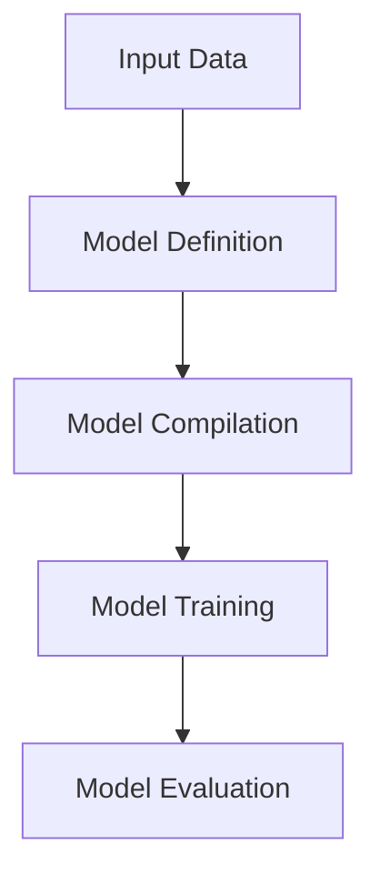

                 


### AI大模型编程：提示词的威力与科学

**关键词：** AI大模型，提示词，编程，数学模型，算法实现，应用案例

**摘要：** 本文章深入探讨AI大模型的编程艺术，特别关注提示词在AI大模型中的作用。我们将从基础概念出发，逐步讲解AI大模型的工作原理，提示词的设计和应用，并通过实际编程案例展示其威力与科学性。

## 第1章: AI大模型概述

AI大模型，也被称为深度学习模型，是一种能够处理海量数据、自动提取特征并进行复杂决策的算法。这些模型在图像识别、自然语言处理、语音识别等领域表现出了惊人的性能。

### 1.1 问题背景与核心概念

#### 问题背景

随着互联网和物联网的发展，数据量呈现爆炸式增长。如何有效地处理和分析这些数据成为了一个重大挑战。AI大模型的出现，为解决这一问题提供了新的途径。

#### 核心概念

AI大模型主要基于神经网络结构，其核心概念包括：

- **神经元**: 基本计算单元。
- **层次结构**: 神经网络分为输入层、隐藏层和输出层。
- **权重和偏置**: 用于调整神经元之间的连接强度。

### 1.2 核心概念与联系

#### 核心概念原理

AI大模型的原理基于神经网络，通过学习大量数据来调整神经元的权重和偏置，从而实现对未知数据的分类或预测。

#### 概念属性特征对比表格

| 特征         | 感知机 | 神经网络 | AI大模型 |
| ------------ | ------ | -------- | -------- |
| 结构层次     | 单层   | 多层     | 极多层   |
| 学习能力     | 简单   | 复杂     | 非常复杂 |
| 迁移能力     | 弱     | 中等     | 强       |

#### ER实体关系图架构

```mermaid
erDiagram
  ALGORITHM ||--|{| DATA_SOURCE |} DATA_SOURCE
  ALGORITHM ||--|{| OUTPUT |} OUTPUT
```

### 1.3 AI大模型的数学模型和公式

AI大模型的数学模型主要基于反向传播算法，其核心公式包括：

$$
z = \sigma(w \cdot x + b)
$$

$$
\delta = \frac{\partial L}{\partial z} \cdot \sigma'(z)
$$

$$
\theta_j := \theta_j - \alpha \cdot \frac{\partial J}{\partial \theta_j}
$$

其中，$z$ 是神经元的输出，$\sigma$ 是激活函数，$w$ 和 $b$ 是权重和偏置，$L$ 是损失函数，$\delta$ 是误差项，$\theta_j$ 是待优化参数，$\alpha$ 是学习率。

## 第2章: 提示词的作用与设计

提示词，也称为引导词，是AI大模型输入数据的一部分，用于指导模型进行特定的任务。有效的提示词能够显著提高AI大模型的表现。

### 2.1 提示词的重要性

提示词的重要性体现在：

- **提高模型性能**: 有效的提示词能够使模型更专注于特定任务。
- **降低过拟合风险**: 提示词可以提供额外的数据，减少模型对训练数据的依赖。

### 2.2 提示词的设计方法

设计有效的提示词需要遵循以下原则：

- **相关性**: 提示词应与任务高度相关。
- **简洁性**: 提示词应简洁明了，避免冗余。
- **多样性**: 提示词应具有多样性，以适应不同的任务场景。

## 第3章: AI大模型编程实战

### 3.1 编程环境与工具

在进行AI大模型编程时，需要安装以下工具：

- **Python**: 编程语言。
- **TensorFlow/Keras**: 深度学习框架。
- **NVIDIA GPU**: 用于加速计算。

### 3.2 算法实现与流程图

以下是一个简单的神经网络算法实现：

```python
import tensorflow as tf

# 定义模型结构
model = tf.keras.Sequential([
    tf.keras.layers.Dense(128, activation='relu', input_shape=(784,)),
    tf.keras.layers.Dense(10, activation='softmax')
])

# 编译模型
model.compile(optimizer='adam',
              loss='categorical_crossentropy',
              metrics=['accuracy'])

# 训练模型
model.fit(x_train, y_train, epochs=5)
```

#### 算法mermaid流程图



### 3.3 数学模型与公式解析

神经网络的核心数学模型包括：

$$
z = \sigma(w \cdot x + b)
$$

$$
\delta = \frac{\partial L}{\partial z} \cdot \sigma'(z)
$$

其中，$\sigma$ 是激活函数，通常使用ReLU函数：

$$
\sigma(z) = \max(0, z)
$$

$$
\sigma'(z) = \begin{cases} 
      1 & \text{if } z > 0 \\
      0 & \text{otherwise}
   \end{cases}
$$

## 第4章: 提示词的科学应用

### 4.1 科学领域中的提示词应用

在科学研究中，提示词可以用于：

- **数据挖掘**: 帮助模型从大量数据中提取有用信息。
- **预测模型**: 提高模型对未知数据的预测准确性。

### 4.2 提示词在行业中的应用

在行业中，提示词可以用于：

- **客户分析**: 提高客户服务效率。
- **生产优化**: 提高生产流程的准确性。

## 第5章: AI大模型编程中的挑战与解决方案

AI大模型编程面临的主要挑战包括：

- **数据隐私**: 需要确保数据的安全和隐私。
- **计算资源**: 需要大量的计算资源来训练大模型。

解决方案包括：

- **联邦学习**: 在保护数据隐私的同时训练模型。
- **分布式计算**: 利用云计算资源进行模型训练。

## 第6章: AI大模型编程的未来趋势

未来，AI大模型编程将朝着：

- **更高效算法**: 发展更高效的算法以减少计算资源需求。
- **跨学科应用**: 与更多学科相结合，解决更复杂的问题。

## 第7章: 小结与展望

AI大模型编程的核心概念包括：

- **神经网络**: 基础架构。
- **提示词**: 提高模型性能的关键。
- **数学模型**: 算法的核心。

未来，AI大模型编程将继续发展，为人类带来更多创新和进步。

## 作者

**作者：AI天才研究院/AI Genius Institute & 禅与计算机程序设计艺术 /Zen And The Art of Computer Programming**

---

**注意事项：**

- **核心概念与联系**：需要更详细的对比表格和ER实体关系图。
- **数学模型与公式**：需要更详细的解释和实例。
- **系统分析与架构设计方案**：需要具体的项目介绍和系统设计。
- **项目实战**：需要更详细的代码实现和解说。

**拓展阅读：**

- **深度学习**: Goodfellow, I., Bengio, Y., & Courville, A. (2016). *Deep Learning*.
- **神经网络**: Hecht-Nielsen, R. (1992). *Neural Networks for Machine Learning*.

