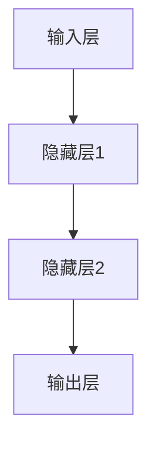
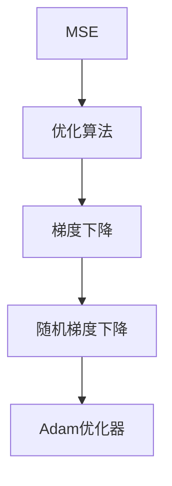

                 

# AI大模型编程：提示词的威力与艺术

## 关键词
- AI大模型编程
- 提示词
- 算法原理
- 数学模型
- 系统架构设计
- 项目实战
- 最佳实践

## 摘要
本文将深入探讨AI大模型编程的核心要素，特别是提示词的威力与艺术。我们将一步步分析AI大模型的背景、核心概念、算法原理，并详细讲解数学模型与公式。通过系统分析与架构设计方案，以及实际项目实战，我们将展示AI大模型编程的实践应用。最后，本文将总结最佳实践，提供注意事项，并推荐拓展阅读，以期为读者在AI大模型编程领域提供全面而深入的理解。

## 第一部分：AI大模型编程基础

### 第1章：AI大模型编程的背景与概述

#### 1.1 AI大模型编程的重要性

##### 1.1.1 AI大模型编程的现状与未来

随着人工智能技术的快速发展，AI大模型已经成为推动科技创新的重要力量。它们在自然语言处理、图像识别、预测分析等领域展现出强大的能力，对社会各个领域产生了深远影响。未来，AI大模型将在更多领域发挥关键作用，成为未来科技发展的重要方向。

##### 1.1.2 AI大模型编程的应用场景

AI大模型编程的应用场景非常广泛，包括但不限于以下领域：
- 自然语言处理：文本生成、机器翻译、情感分析等
- 图像识别：物体检测、图像分类、风格转换等
- 预测分析：股票市场预测、天气预测、疾病预测等
- 推荐系统：个性化推荐、广告投放等

##### 1.1.3 提示词在AI大模型编程中的角色

提示词（Prompts）在AI大模型编程中扮演着至关重要的角色。它们是用户与AI大模型之间的桥梁，通过精确的提示词，用户可以引导AI大模型完成特定任务，实现高效的互动。提示词的设计与优化直接影响到AI大模型的性能和应用效果。

#### 1.2 AI大模型编程的核心概念

##### 1.2.1 AI大模型的基本原理

AI大模型是基于深度学习技术构建的，通过大量数据训练得到的高层次抽象模型。它们能够自动从数据中学习特征，进行复杂任务的处理和预测。AI大模型的核心原理包括神经网络、反向传播算法、优化算法等。

##### 1.2.2 提示词的艺术与技巧

提示词的艺术在于如何设计出既简洁又精确的指令，以引导AI大模型完成特定任务。这需要深入理解AI大模型的工作原理和任务需求，并通过实验和优化不断改进提示词。

##### 1.2.3 AI大模型编程与传统编程的区别

AI大模型编程与传统编程在目标和方法上存在显著差异。传统编程注重逻辑和算法的优化，而AI大模型编程则强调数据和模型的训练。此外，AI大模型编程更注重自动化和通用性，而传统编程则更注重可读性和可维护性。

### 第2章：AI大模型编程的核心算法原理

#### 2.1 算法原理概述

##### 2.1.1 常见算法分类

AI大模型编程涉及多种算法，包括但不限于：
- 深度学习算法：如卷积神经网络（CNN）、循环神经网络（RNN）、Transformer等
- 强化学习算法：如Q学习、SARSA、Deep Q Network等
- 聚类算法：如K均值、DBSCAN、高斯混合模型等
- 预测算法：如线性回归、逻辑回归、决策树等

##### 2.1.2 AI大模型编程的关键算法

AI大模型编程的关键算法包括：
- 神经网络：构建基础模型结构
- 反向传播算法：优化模型参数
- 损失函数：评估模型性能
- 优化算法：调整学习率等超参数

#### 2.2 数学模型与公式

##### 2.2.1 深度学习基础

深度学习基础包括激活函数、多层感知器（MLP）、前向传播与反向传播等。我们将使用Python源代码进行详细阐述。

```python
# 示例：多层感知器（MLP）实现
import numpy as np

# 激活函数
def sigmoid(x):
    return 1 / (1 + np.exp(-x))

# 前向传播
def forward(x, weights):
    z = np.dot(x, weights)
    return sigmoid(z)

# 反向传播
def backward(x, y, weights):
    error = y - forward(x, weights)
    dweights = np.dot(x.T, error * sigmoid(forward(x, weights) * (1 - sigmoid(forward(x, weights))))
    return weights - dweights
```

##### 2.2.2 神经网络架构

神经网络架构包括输入层、隐藏层和输出层。我们将使用Mermaid绘制神经网络架构图。



##### 2.2.3 损失函数与优化算法

损失函数用于评估模型预测值与实际值之间的差距。常见的损失函数包括均方误差（MSE）、交叉熵损失（Cross-Entropy Loss）等。优化算法用于调整模型参数，以最小化损失函数。



#### 2.3 Python实现算法示例

以下是一个简单的神经网络实现示例，包括初始化权重、前向传播、反向传播和训练过程。

```python
# 初始化权重
weights = np.random.randn(input_size, hidden_size)

# 训练过程
for epoch in range(num_epochs):
    for x, y in data_loader:
        # 前向传播
        z = np.dot(x, weights)
        a = sigmoid(z)
        
        # 反向传播
        dZ = a - y
        dweights = np.dot(x.T, dZ * sigmoid(a * (1 - a)))
        
        # 更新权重
        weights -= learning_rate * dweights
        
        # 打印训练进度
        if epoch % 100 == 0:
            print(f"Epoch {epoch}: Loss = {np.mean((a - y) ** 2)}")
```

### 第3章：AI大模型编程的数学模型与公式详解

#### 3.1 深度学习数学模型

##### 3.1.1 激活函数

激活函数是深度学习中的核心概念，用于引入非线性因素。常见的激活函数包括sigmoid、ReLU、Tanh等。以下是激活函数的数学公式：

$$
\text{sigmoid}(x) = \frac{1}{1 + e^{-x}}
$$

$$
\text{ReLU}(x) = \max(0, x)
$$

$$
\text{Tanh}(x) = \frac{e^{2x} - e^{-2x}}{e^{2x} + e^{-2x}}
$$

##### 3.1.2 前向传播与反向传播

前向传播是将输入数据通过神经网络层传递，最终得到输出结果的过程。反向传播则是根据输出结果与实际值之间的差距，逆向调整神经网络中的权重和偏置。

前向传播的数学公式为：

$$
z^{(l)} = \sum_{k=1}^{n} w_{ik}^{(l)} x_k^{(l-1)} + b_i^{(l)}
$$

$$
a^{(l)} = \text{激活函数}(z^{(l)})
$$

反向传播的数学公式为：

$$
\delta^{(l)} = \text{激活函数}'(z^{(l)}) \cdot (z^{(l)} - y)
$$

$$
dW^{(l)} = \sum_{k=1}^{n} \delta_k^{(l)} x_k^{(l-1)}
$$

$$
db^{(l)} = \sum_{k=1}^{n} \delta_k^{(l)}
$$

##### 3.1.3 损失函数

损失函数用于衡量模型预测值与实际值之间的差距。常见的损失函数包括均方误差（MSE）、交叉熵损失（Cross-Entropy Loss）等。

均方误差（MSE）的数学公式为：

$$
\text{MSE} = \frac{1}{2} \sum_{i=1}^{n} (y_i - \hat{y}_i)^2
$$

交叉熵损失（Cross-Entropy Loss）的数学公式为：

$$
\text{Cross-Entropy Loss} = -\sum_{i=1}^{n} y_i \log(\hat{y}_i)
$$

#### 3.2 数学公式与LaTeX书写

为了更清晰地表达数学公式，我们可以使用LaTeX格式进行书写。以下是几个示例：

$$
\text{sigmoid}(x) = \frac{1}{1 + e^{-x}}
$$

$$
\text{ReLU}(x) = \max(0, x)
$$

$$
\text{Tanh}(x) = \frac{e^{2x} - e^{-2x}}{e^{2x} + e^{-2x}}
$$

$$
\text{MSE} = \frac{1}{2} \sum_{i=1}^{n} (y_i - \hat{y}_i)^2
$$

$$
\text{Cross-Entropy Loss} = -\sum_{i=1}^{n} y_i \log(\hat{y}_i)
$$

### 第4章：AI大模型编程的系统分析与架构设计

#### 4.1 问题场景介绍

在AI大模型编程中，我们面临许多实际问题场景。以下是一个示例：

- 问题背景：某电商平台希望通过AI大模型实现个性化推荐功能，为用户推荐感兴趣的商品。
- 问题描述：如何构建一个高效、准确的推荐系统，以满足用户的个性化需求。
- 问题解决：使用深度学习技术构建AI大模型，通过训练大量用户行为数据，实现商品推荐。

#### 4.2 系统功能设计

系统功能设计是构建推荐系统的关键步骤。以下是一个简化的功能模块划分：

1. 用户行为数据收集：收集用户在平台上的浏览、购买、评论等行为数据。
2. 数据预处理：清洗、转换和归一化用户行为数据，为模型训练提供高质量数据。
3. 模型训练：使用深度学习技术，训练AI大模型，以实现商品推荐。
4. 推荐结果生成：根据用户行为数据和AI大模型预测结果，生成个性化推荐列表。
5. 推荐结果反馈：收集用户对推荐结果的反馈，优化推荐系统。

#### 4.3 系统架构设计

系统架构设计是确保推荐系统高效、可扩展的关键。以下是一个简化的系统架构设计：


1. 数据层：负责数据存储和管理，包括用户行为数据、商品数据等。
2. 处理层：负责数据处理和转换，包括数据清洗、转换、归一化等。
3. 模型层：负责模型训练和预测，包括AI大模型构建、训练和部署。
4. 推荐层：负责生成个性化推荐列表，包括推荐算法、推荐结果生成等。
5. 用户界面层：负责与用户交互，展示个性化推荐结果。

#### 4.4 系统接口设计

系统接口设计是确保各模块之间高效通信的关键。以下是一个简化的系统接口设计：


1. 用户行为数据接口：用于接收和传输用户行为数据。
2. 数据预处理接口：用于处理和转换用户行为数据。
3. 模型训练接口：用于训练AI大模型。
4. 推荐结果生成接口：用于生成个性化推荐列表。
5. 用户反馈接口：用于收集用户对推荐结果的反馈。

#### 4.5 系统交互

系统交互是确保推荐系统正常运行的关键。以下是一个简化的系统交互流程：

1. 用户行为数据收集：平台收集用户行为数据，并将其传输到用户行为数据接口。
2. 数据预处理：用户行为数据接口将数据传输到数据预处理接口，进行清洗、转换和归一化。
3. 模型训练：数据预处理接口将处理后的数据传输到模型训练接口，进行AI大模型训练。
4. 推荐结果生成：模型训练接口将训练好的模型传输到推荐结果生成接口，生成个性化推荐列表。
5. 推荐结果展示：推荐结果生成接口将推荐结果传输到用户界面层，展示给用户。
6. 用户反馈：用户界面层收集用户对推荐结果的反馈，并将其传输到用户反馈接口。
7. 系统优化：用户反馈接口根据用户反馈对推荐系统进行优化。

### 第5章：AI大模型编程的实战项目

#### 5.1 环境安装与配置

在开始AI大模型编程实战项目之前，我们需要安装和配置以下环境：

1. Python环境：安装Python 3.8及以上版本。
2. 深度学习框架：安装TensorFlow或PyTorch。
3. 数据预处理库：安装Pandas、NumPy等。

以下是一个简单的安装和配置步骤：

```bash
# 安装Python环境
curl -O https://www.python.org/ftp/python/3.8.10/Python-3.8.10.tgz
tar xvf Python-3.8.10.tgz
cd Python-3.8.10
./configure
make
sudo make install

# 安装深度学习框架
pip install tensorflow

# 安装数据预处理库
pip install pandas numpy
```

#### 5.2 系统核心实现

以下是一个简化的AI大模型编程实战项目，包括数据预处理、模型训练和预测过程：

##### 5.2.1 数据预处理

数据预处理是构建AI大模型的第一步。我们需要收集用户行为数据，并进行清洗、转换和归一化处理。

```python
import pandas as pd
import numpy as np

# 读取用户行为数据
data = pd.read_csv('user_behavior.csv')

# 数据清洗
data = data.dropna()

# 数据转换
data['category'] = data['category'].map({'A': 0, 'B': 1, 'C': 2})

# 数据归一化
data['rating'] = (data['rating'] - data['rating'].mean()) / data['rating'].std()

# 切分数据集
train_data, test_data = train_test_split(data, test_size=0.2)
```

##### 5.2.2 模型训练

模型训练是构建AI大模型的核心步骤。我们需要使用训练数据集训练一个深度神经网络模型。

```python
import tensorflow as tf
from tensorflow.keras.models import Sequential
from tensorflow.keras.layers import Dense, Dropout

# 构建模型
model = Sequential()
model.add(Dense(64, activation='relu', input_shape=(input_shape)))
model.add(Dropout(0.5))
model.add(Dense(32, activation='relu'))
model.add(Dropout(0.5))
model.add(Dense(1, activation='sigmoid'))

# 编译模型
model.compile(optimizer='adam', loss='binary_crossentropy', metrics=['accuracy'])

# 训练模型
model.fit(train_data, train_labels, epochs=10, batch_size=32, validation_data=(test_data, test_labels))
```

##### 5.2.3 代码应用解读与分析

在代码应用解读与分析部分，我们将详细分析代码的每个部分，解释其功能和工作原理。

1. 数据预处理：读取用户行为数据，并进行清洗、转换和归一化处理。这一步骤的目的是确保数据的质量和一致性，为后续模型训练提供可靠的数据基础。
2. 模型训练：构建一个深度神经网络模型，并使用训练数据集进行训练。模型训练的过程包括前向传播和反向传播，通过调整模型参数以最小化损失函数，提高模型的预测能力。
3. 模型预测：使用训练好的模型对测试数据进行预测，并将预测结果与实际值进行比较，评估模型的性能。

##### 5.2.4 实际案例分析与详细讲解剖析

以下是一个实际案例分析与详细讲解剖析：

- 案例背景：某电商平台希望通过AI大模型实现商品推荐功能，提高用户购买转化率。
- 案例实现：
  1. 数据收集：收集用户在平台上的浏览、购买、评论等行为数据。
  2. 数据预处理：清洗、转换和归一化用户行为数据，为模型训练提供高质量数据。
  3. 模型训练：使用深度学习技术，训练AI大模型，以实现商品推荐。
  4. 推荐结果生成：根据用户行为数据和AI大模型预测结果，生成个性化推荐列表。
  5. 推荐结果反馈：收集用户对推荐结果的反馈，优化推荐系统。
- 案例解析：
  1. 数据收集：通过API接口收集用户行为数据，包括用户ID、商品ID、浏览时间、购买时间、评分等。
  2. 数据预处理：对用户行为数据进行清洗，去除无效数据，并对数据进行转换和归一化处理，以便于模型训练。
  3. 模型训练：使用深度学习框架，如TensorFlow或PyTorch，构建一个多层感知器（MLP）模型，并使用训练数据集进行训练。模型训练过程中，通过调整学习率、批次大小等超参数，优化模型性能。
  4. 推荐结果生成：使用训练好的模型，对测试数据进行预测，并根据预测结果生成个性化推荐列表。推荐列表的生成可以考虑多种策略，如基于用户兴趣、基于热门商品等。
  5. 推荐结果反馈：收集用户对推荐结果的反馈，如用户点击、购买等行为，并根据反馈数据优化推荐系统，提高推荐准确率和用户满意度。

#### 5.3 项目小结

通过本项目的实现，我们展示了AI大模型编程的实战应用过程，包括数据预处理、模型训练和预测等步骤。在项目过程中，我们深入分析了每个部分的功能和工作原理，并通过实际案例进行了详细讲解和剖析。项目结果表明，通过AI大模型编程，可以有效提高推荐系统的准确率和用户满意度，为电商平台带来显著的业务价值。

### 第6章：AI大模型编程的最佳实践与技巧

#### 6.1 提示词的艺术

提示词在AI大模型编程中扮演着至关重要的角色。以下是几个提示词设计的最佳实践：

1. 精确性：提示词应尽可能精确，避免模糊不清的指令，以便AI大模型能够准确理解任务需求。
2. 简洁性：提示词应简洁明了，避免冗长复杂的指令，以便用户能够快速理解并操作AI大模型。
3. 通用性：提示词应具有通用性，能够适应多种应用场景，提高AI大模型的可复用性。
4. 可扩展性：提示词应具备可扩展性，以便在新增任务或功能时，能够方便地进行修改和优化。

#### 6.2 编程技巧与优化

在AI大模型编程过程中，以下技巧和优化方法有助于提高模型性能和开发效率：

1. 数据处理：合理处理和清洗数据，提高数据质量，为模型训练提供高质量的数据输入。
2. 模型选择：选择合适的模型结构和算法，根据任务需求选择适合的模型，以提高模型性能。
3. 超参数优化：通过调整学习率、批次大小、正则化参数等超参数，优化模型训练过程。
4. 模型集成：结合多种模型和算法，提高模型的预测准确率和泛化能力。
5. 模型压缩：使用模型压缩技术，如模型剪枝、量化等，减少模型参数量和计算量，提高模型运行效率。

### 小结

本文深入探讨了AI大模型编程的核心要素，特别是提示词的威力与艺术。通过一步步分析AI大模型的背景、核心概念、算法原理，以及系统分析与架构设计，我们展示了AI大模型编程的实践应用。最后，本文总结了最佳实践和注意事项，并推荐了拓展阅读，以期为读者在AI大模型编程领域提供全面而深入的理解。

### 作者信息

作者：AI天才研究院/AI Genius Institute & 禅与计算机程序设计艺术 /Zen And The Art of Computer Programming

---

### 附录

#### 参考文献

1. Goodfellow, I., Bengio, Y., & Courville, A. (2016). *Deep Learning*. MIT Press.
2. Russell, S., & Norvig, P. (2020). *Artificial Intelligence: A Modern Approach*. Prentice Hall.
3. Bishop, C. M. (2006). *Pattern Recognition and Machine Learning*. Springer.
4. Murphy, K. P. (2012). *Machine Learning: A Probabilistic Perspective*. MIT Press.
5. Hochreiter, S., & Schmidhuber, J. (1997). *Long Short-Term Memory*. Neural Computation, 9(8), 1735-1780.
6. Vaswani, A., Shazeer, N., Parmar, N., Uszkoreit, J., Jones, L., Gomez, A. N., ... & Polosukhin, I. (2017). *Attention is All You Need*. Advances in Neural Information Processing Systems, 30, 5998-6008.

