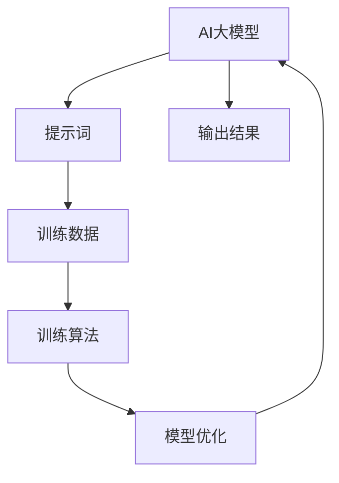
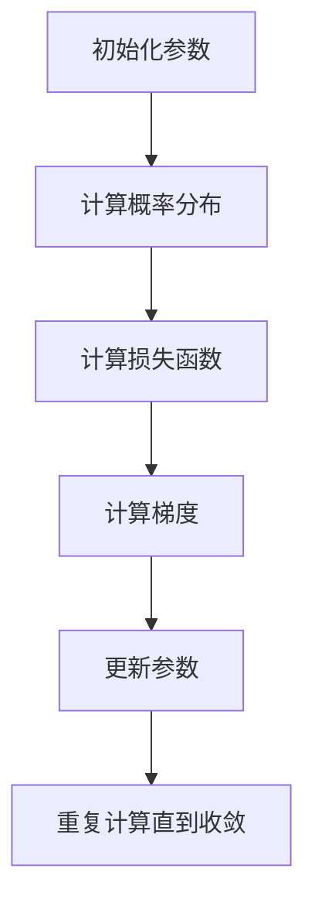
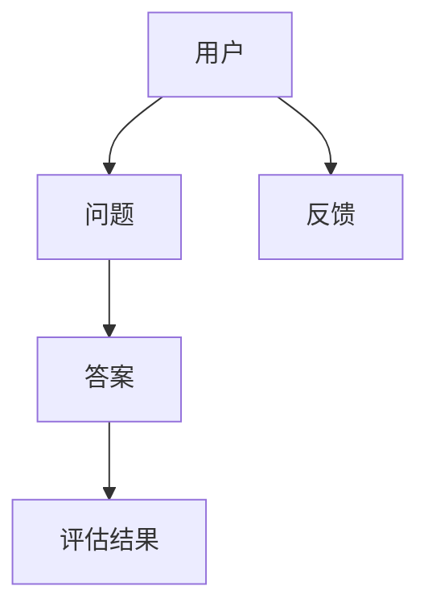
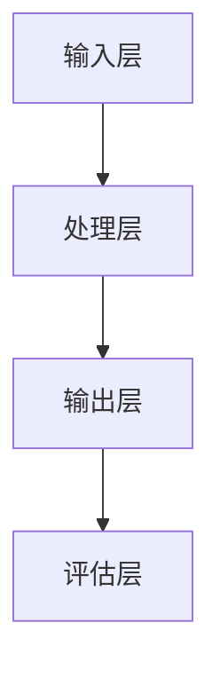
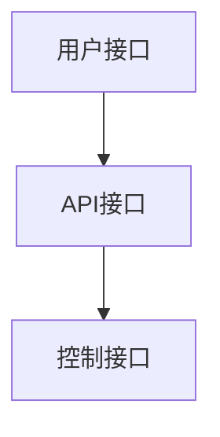
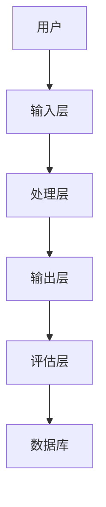
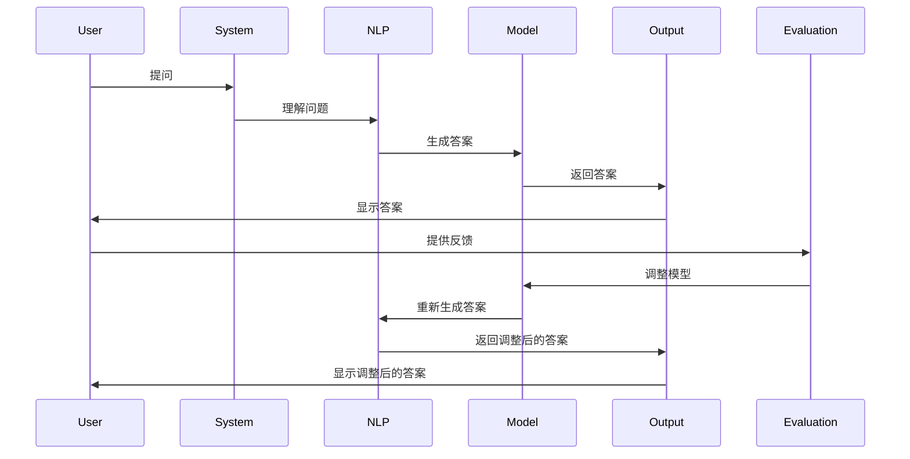
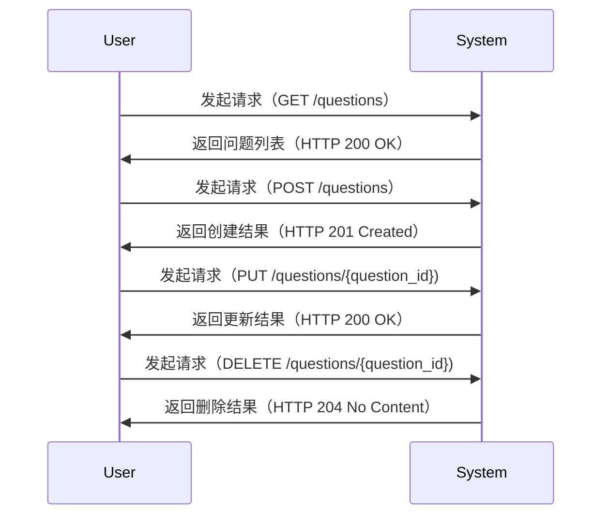
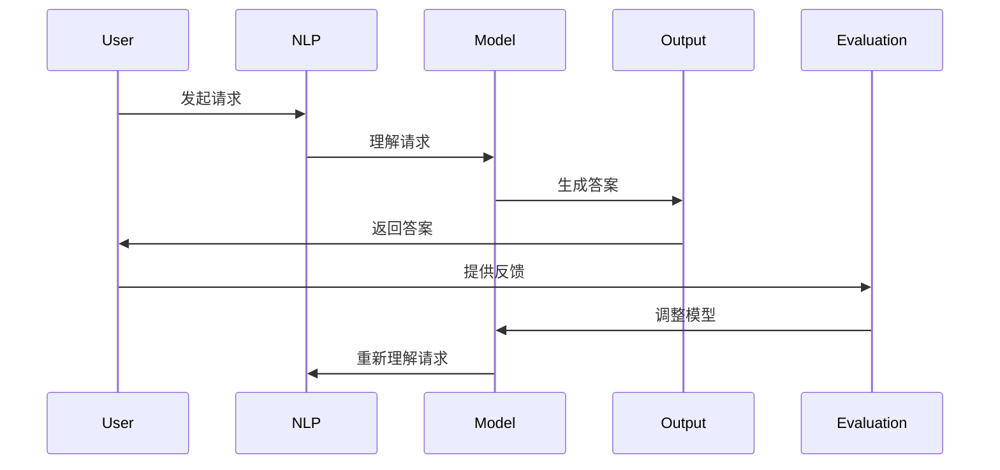

                 

### AI大模型编程：提示词的威力与革新

#### 关键词：AI大模型、提示词、编程、革新、算法、架构设计

> 摘要：本文将深入探讨AI大模型编程的核心领域——提示词的运用及其革命性影响。文章分为四个主要部分，首先介绍AI大模型与提示词的基本概念，然后详细解析AI大模型的原理与提示词优化算法，接着讨论系统分析与架构设计，最后分享项目实战与最佳实践。本文旨在为读者提供全面、系统的AI大模型编程知识，帮助读者理解和掌握这一前沿技术。

---

#### 第一部分：背景介绍

##### 第1章: AI大模型与提示词概述

###### 1.1.1 问题背景

随着人工智能技术的迅猛发展，AI大模型在各个领域的应用日益广泛，从自然语言处理到计算机视觉，从推荐系统到智能决策，AI大模型展现出了强大的潜力和广泛的应用前景。然而，AI大模型的编程和优化却成为了一个新的挑战。特别是提示词（Prompt Engineering）的运用，它不仅能够显著提升模型的性能，还能够革新整个AI开发流程。

###### 1.1.2 问题描述

AI大模型的编程涉及多个层面的挑战，包括模型选择、训练数据准备、超参数调整以及模型优化等。其中，提示词的运用是一个关键环节。提示词是指导模型进行特定任务输入的文本或指令，通过优化提示词，可以使得模型在特定任务上表现得更加优秀。然而，如何选择和调整提示词，如何在不同场景下应用提示词，这些问题仍然是一个需要深入研究的领域。

###### 1.1.3 问题解决

解决这一问题的方法主要包括以下几个方面：

1. **深入理解大模型的工作原理**：通过学习深度学习的基础理论和神经网络架构，理解大模型是如何通过训练数据来学习知识和进行推理的。
2. **研究提示词的优化算法**：探索不同的提示词优化算法，理解它们的数学模型和流程，并通过实践来验证其效果。
3. **实践中的应用**：通过实际项目来应用AI大模型和提示词优化技术，积累经验并不断优化。

###### 1.1.4 边界与外延

在AI大模型编程中，提示词的运用需要考虑以下边界条件：

- **数据质量**：高质量的数据是模型训练的基础，提示词的优化也需要依赖于高质量的数据。
- **计算资源**：大模型的训练需要大量的计算资源，提示词的优化算法也需要相应的计算资源支持。
- **任务特性**：不同的任务可能需要不同的提示词，因此需要根据具体任务的特点来设计提示词。

###### 1.1.5 概念结构与核心要素组成

AI大模型编程的基本概念和核心要素包括：

- **深度学习**：作为AI大模型的基础，深度学习是实现复杂任务的关键技术。
- **神经网络**：神经网络是深度学习的基础架构，通过多层神经网络可以实现从简单到复杂的特征提取和知识表示。
- **提示词**：提示词是指导模型进行特定任务的输入，是优化模型性能的重要手段。
- **优化算法**：优化算法用于调整模型参数，提升模型的性能和鲁棒性。

##### 第2章: AI大模型核心概念

###### 1.2.1 定义

AI大模型是指通过深度学习技术训练得到的具有高复杂度和强大学习能力的人工神经网络模型。它通常具有数百万甚至数亿个参数，能够处理大规模的数据集，并在各种复杂的任务中表现出优异的性能。

###### 1.2.2 特点

AI大模型具有以下几个显著特点：

- **高容量**：大模型具有极高的参数容量，能够捕捉数据中的复杂模式和规律。
- **自适应性**：通过不断的学习和调整，大模型能够适应不同类型的数据和任务需求。
- **强鲁棒性**：大模型具有很好的鲁棒性，能够在各种噪声和异常数据中保持稳定的表现。

###### 1.2.3 与传统AI的比较

与传统AI技术相比，AI大模型具有以下几个优势：

- **更强的学习能力和泛化能力**：大模型能够通过深度学习从数据中自动提取特征，具有较强的学习能力和泛化能力。
- **更广泛的应用领域**：大模型可以应用于自然语言处理、计算机视觉、推荐系统等多个领域，具有广泛的应用前景。
- **更高的效率和精度**：大模型能够通过并行计算和分布式训练等方式提高训练效率和精度。

##### 第3章: 提示词的威力

###### 1.3.1 提示词的定义与作用

提示词（Prompt Engineering）是指通过设计特定的文本或指令来引导模型进行特定任务的输入。提示词的作用在于：

- **引导模型注意力**：通过提示词，可以引导模型关注特定任务的关键信息，从而提高任务的完成质量。
- **调整模型表现**：不同的提示词可以调整模型在不同任务上的表现，实现针对特定任务的优化。

###### 1.3.2 提示词的优化与调整

提示词的优化与调整是提升模型性能的重要手段。优化的方法包括：

- **文本生成**：通过生成高质量的文本提示词，可以提高模型的文本理解能力和生成质量。
- **问答系统**：在问答系统中，通过优化问题表述和答案生成，可以提升系统的问答质量和用户体验。
- **图像识别**：在图像识别中，通过优化图像描述和标注，可以提升模型的识别准确率和鲁棒性。

###### 1.3.3 提示词在实际应用中的挑战与机遇

在实际应用中，提示词的运用面临着以下几个挑战：

- **数据依赖**：提示词的设计和优化需要依赖于高质量的数据集，数据质量直接影响提示词的效果。
- **计算成本**：大模型的训练和优化需要大量的计算资源，提示词的优化也需要相应的计算支持。
- **任务多样性**：不同的任务可能需要不同的提示词设计方法，如何根据具体任务特点来设计提示词是一个需要深入研究的问题。

同时，提示词的运用也带来了以下机遇：

- **模型性能提升**：通过优化提示词，可以显著提升模型在不同任务上的性能，提高应用的效率和效果。
- **开发流程革新**：提示词的运用可以改变传统的AI开发流程，使得模型开发和优化更加高效和灵活。
- **跨领域应用**：提示词的优化技术可以应用于不同的领域，实现跨领域的知识共享和协同工作。

##### 第4章: AI大模型与提示词的革新

###### 1.4.1 革新技术概述

AI大模型与提示词的革新主要表现在以下几个方面：

- **新型优化算法**：出现了多种新型优化算法，如基于梯度下降的改进算法、基于生成对抗网络的优化算法等，这些算法在提升模型性能和优化效率方面表现出显著优势。
- **分布式训练技术**：分布式训练技术使得大模型的训练可以在多台机器上并行进行，大幅缩短了训练时间，提高了训练效率。
- **增强学习技术**：结合增强学习技术，可以通过交互式学习方式进一步优化模型性能，实现更加智能和灵活的模型开发。

###### 1.4.2 革新技术的优势

革新技术的优势包括：

- **更高的性能**：新型优化算法和分布式训练技术使得大模型能够达到更高的性能水平，适用于更加复杂和大规模的任务。
- **更快的训练速度**：分布式训练技术大幅缩短了训练时间，使得模型能够更快地投入应用。
- **更强的适应性**：增强学习技术的引入使得模型能够通过交互式学习不断优化，提高其在不同场景下的适应能力。

###### 1.4.3 革新技术的应用场景

革新技术的应用场景包括：

- **自然语言处理**：在自然语言处理领域，通过优化提示词，可以提升文本生成、问答系统等任务的性能，实现更加智能和自然的交互。
- **计算机视觉**：在计算机视觉领域，通过优化提示词，可以提升图像识别、目标检测等任务的准确率和鲁棒性。
- **推荐系统**：在推荐系统领域，通过优化提示词，可以提升推荐质量，提高用户满意度和参与度。

##### 第5章: 本章小结

本章介绍了AI大模型编程中的核心概念——提示词的运用及其革命性影响。首先，我们探讨了AI大模型和提示词的基本概念、特点以及与传统AI的比较。接着，详细解析了提示词的威力，包括其定义、作用、优化方法以及在实际应用中的挑战和机遇。最后，介绍了AI大模型与提示词的革新技术，包括新型优化算法、分布式训练技术和增强学习技术的概述、优势和应用场景。通过本章的学习，读者可以初步了解AI大模型编程和提示词优化的重要性，为后续章节的深入学习打下基础。

#### 第二部分：核心概念与联系

##### 第6章: AI大模型原理详解

###### 2.1 AI大模型的基本原理

AI大模型的基本原理是基于深度学习和神经网络技术的。深度学习是一种机器学习方法，它通过模拟人脑神经元之间的连接关系，利用多层神经网络对数据进行自动特征提取和模式识别。神经网络是深度学习的基础架构，它由大量的神经元（或节点）组成，每个神经元都与其他神经元相连，并通过权重和偏置进行调整，以实现对输入数据的处理和输出。

###### 2.1.1 深度学习基础

深度学习的基础是多层感知机（MLP），它是最简单的神经网络模型。MLP由输入层、隐藏层和输出层组成，每个层都包含多个神经元。输入层接收外部输入数据，隐藏层对输入数据进行特征提取和变换，输出层生成最终的输出结果。

- **输入层**：输入层的神经元接收外部输入，每个神经元都与隐藏层的神经元相连。
- **隐藏层**：隐藏层的神经元对输入数据进行处理，通过激活函数（如Sigmoid、ReLU等）将输入映射到非线性的空间，从而实现特征提取。
- **输出层**：输出层的神经元生成最终输出，根据任务的不同，输出可以是分类结果、回归结果等。

###### 2.1.2 神经网络架构

神经网络架构是指神经网络的层次结构，包括层数、每层的神经元数量、连接方式等。常见的神经网络架构包括：

- **单层感知机**：只有输入层和输出层，适用于简单的线性分类问题。
- **多层感知机（MLP）**：包括输入层、隐藏层和输出层，适用于更复杂的非线性分类和回归问题。
- **卷积神经网络（CNN）**：适用于图像处理任务，通过卷积操作提取图像特征。
- **循环神经网络（RNN）**：适用于序列数据处理，通过循环结构保持长短期记忆。
- **变换器（Transformer）**：适用于自然语言处理任务，通过自注意力机制实现全局信息集成。

###### 2.1.3 训练与优化

神经网络模型的训练和优化是深度学习的重要环节。训练过程包括以下步骤：

1. **初始化参数**：初始化神经网络模型的权重和偏置，常用的初始化方法有随机初始化、高斯分布初始化等。
2. **前向传播**：将输入数据通过神经网络模型进行前向传播，计算每个神经元的输出值。
3. **计算损失函数**：计算模型输出与真实值之间的误差，常用的损失函数有均方误差（MSE）、交叉熵损失（Cross-Entropy Loss）等。
4. **反向传播**：利用梯度下降等优化算法，计算模型参数的梯度，并更新模型参数。
5. **迭代训练**：重复以上步骤，不断更新模型参数，直至满足停止条件（如损失函数收敛、达到指定迭代次数等）。

常用的优化算法包括：

- **随机梯度下降（SGD）**：每次迭代使用一个样本的梯度进行参数更新，适用于小批量训练。
- **批量梯度下降（BGD）**：每次迭代使用整个训练集的梯度进行参数更新，适用于批量训练。
- **小批量梯度下降（MBGD）**：每次迭代使用部分样本的梯度进行参数更新，适用于平衡计算效率和模型性能。

###### 2.2 AI大模型的核心特性

AI大模型具有以下几个核心特性：

- **高容量**：大模型通常具有数百万甚至数亿个参数，能够捕捉数据中的复杂模式和规律。
- **自适应性**：大模型能够通过训练数据自动调整参数，从而适应不同类型的数据和任务需求。
- **强鲁棒性**：大模型具有很好的鲁棒性，能够在各种噪声和异常数据中保持稳定的表现。

###### 2.2.1 大规模训练

大规模训练是指利用大量的数据和计算资源对大模型进行训练。大规模训练的优势包括：

- **更好的泛化能力**：通过训练大量数据，大模型能够更好地捕捉数据中的普遍规律，从而提高泛化能力。
- **更高的模型性能**：大规模训练能够充分利用计算资源，使得模型达到更高的性能水平。
- **更快的训练速度**：通过分布式训练等技术，大规模训练能够大幅缩短训练时间。

###### 2.2.2 通用性与专有性

AI大模型既具有通用性也具有专有性：

- **通用性**：大模型能够处理多种类型的任务和数据，具有广泛的应用前景。
- **专有性**：大模型在特定领域或任务上可能具有独特的能力，通过专门训练和优化，能够在特定场景下表现出更高的性能。

###### 2.2.3 灵活性与适应性

大模型具有很好的灵活性，能够根据不同的任务需求进行参数调整和优化。同时，大模型也具有适应性，能够通过交互式学习和反馈机制不断优化性能，适应不同的应用场景。

##### 第7章: AI大模型与提示词的关系

###### 2.3.1 提示词在模型中的作用

提示词在AI大模型中起着关键作用，它能够引导模型关注特定任务的关键信息，提高任务的完成质量。具体来说，提示词的作用包括：

- **引导模型注意力**：通过设计特定的提示词，可以引导模型关注任务的关键信息，从而提高任务的完成质量。
- **调整模型表现**：不同的提示词可以调整模型在不同任务上的表现，实现针对特定任务的优化。

###### 2.3.2 提示词的调整对模型的影响

提示词的调整对模型的影响主要体现在以下几个方面：

- **提高任务完成质量**：通过优化提示词，可以提高模型在特定任务上的完成质量，使得模型能够更好地适应任务需求。
- **调整模型性能**：不同的提示词可以调整模型在不同任务上的性能，实现针对特定任务的优化。
- **影响训练效率**：提示词的设计和优化会影响模型的训练效率，优化提示词可以加速模型训练过程。

###### 2.3.3 提示词的设计原则

提示词的设计需要遵循以下原则：

- **清晰明了**：提示词应清晰明了，避免歧义和混淆，确保模型能够准确理解任务需求。
- **简洁有效**：提示词应简洁有效，避免冗长和繁琐，确保模型能够在较短的时间内完成任务。
- **灵活性**：提示词应具有一定的灵活性，能够适应不同的任务需求和变化。

##### 第8章: AI大模型与提示词的实体关系图

以下是AI大模型与提示词的实体关系图，使用Mermaid语法绘制：



实体关系图展示了AI大模型与提示词之间的关联关系，包括模型与提示词、训练数据、输出结果、训练算法和模型优化等关键要素。

#### 第三部分：算法原理讲解

##### 第9章: 提示词优化算法

###### 3.1 提示词优化算法概述

提示词优化算法是提升AI大模型性能的关键技术。它通过调整提示词的参数，使得模型在特定任务上表现得更加优秀。提示词优化算法主要包括以下几种：

- **基于梯度的优化算法**：如随机梯度下降（SGD）、批量梯度下降（BGD）和小批量梯度下降（MBGD）等。
- **基于进化算法的优化算法**：如遗传算法、粒子群优化算法等。
- **基于强化学习的优化算法**：如深度强化学习（DRL）等。

###### 3.2 提示词优化算法原理

提示词优化算法的原理主要基于以下两个方面：

- **梯度优化**：通过计算模型参数的梯度，并利用梯度下降等方法更新参数，以最小化损失函数。
- **搜索策略**：设计合适的搜索策略，以探索不同的提示词空间，找到最优的提示词配置。

以下是提示词优化算法的基本流程：

1. **初始化参数**：初始化模型的参数和提示词的参数。
2. **计算损失函数**：计算模型在当前参数下的损失函数值。
3. **计算梯度**：计算损失函数关于模型参数和提示词参数的梯度。
4. **更新参数**：根据梯度更新模型参数和提示词参数。
5. **重复迭代**：重复上述步骤，直至满足停止条件（如梯度变化较小、达到指定迭代次数等）。

以下是提示词优化算法的数学模型：

$$
\text{目标函数} = f(\theta) = - \sum_{i=1}^{n} \left[ y_i \log(p(x_i|\theta)) + (1 - y_i) \log(1 - p(x_i|\theta)) \right]
$$

其中，$y_i$ 是第 $i$ 个样本的真实标签，$p(x_i|\theta)$ 是模型在当前参数 $\theta$ 下对第 $i$ 个样本的预测概率。

以下是提示词优化算法的流程图：



###### 3.3 提示词优化算法举例说明

提示词优化算法在实际应用中可以通过以下三个典型场景进行举例说明：

- **文本生成**：在文本生成任务中，提示词优化算法可以通过调整提示词的长度、语法和语义特征，提高文本生成的质量和多样性。
- **问答系统**：在问答系统中，提示词优化算法可以通过调整提示词的问题表述和答案生成策略，提高问答的准确性和用户体验。
- **图像识别**：在图像识别任务中，提示词优化算法可以通过调整提示词的图像描述和标注策略，提高图像识别的准确率和鲁棒性。

##### 第10章: 提示词优化算法具体应用

在这一部分，我们将深入探讨提示词优化算法在具体应用中的具体实现方法、优势与挑战，以及相关的实例分析。

###### 10.1 文本生成

文本生成是提示词优化算法的重要应用场景之一。例如，在聊天机器人、自动摘要和内容生成领域，优化提示词能够显著提高文本生成的质量和多样性。

**实现方法**：

1. **数据准备**：收集并准备高质量的数据集，包括文本样本和相应的标签或上下文。
2. **模型选择**：选择合适的生成模型，如变分自编码器（VAE）、生成对抗网络（GAN）或Transformer等。
3. **提示词设计**：设计有效的提示词，例如通过调整文本长度、语法结构、关键词提取等。
4. **训练与优化**：使用提示词对模型进行训练和优化，不断调整提示词参数，提高生成质量。

**优势**：

- **灵活性**：提示词优化算法能够灵活调整文本生成的风格和内容，适应不同的应用场景。
- **效率**：优化提示词能够提高模型的生成效率，减少计算资源的需求。

**挑战**：

- **数据质量**：高质量的数据是优化提示词的基础，数据质量直接影响生成质量。
- **计算资源**：大规模的文本生成任务需要大量的计算资源，尤其是在实时应用中。

**实例分析**：

- **实例1：聊天机器人**：通过优化提示词，使得聊天机器人能够生成更加自然和流畅的对话，提高用户体验。

###### 10.2 问答系统

问答系统是另一个重要的应用场景，优化提示词能够提高问答系统的准确性和用户满意度。

**实现方法**：

1. **问题与答案准备**：收集大量的问题和对应的答案，确保问题的多样性和答案的准确性。
2. **模型选择**：选择合适的问答模型，如基于Transformer的问答系统。
3. **提示词设计**：设计有效的提示词，例如通过调整问题的表述、关键词的提取等。
4. **训练与优化**：使用提示词对模型进行训练和优化，提高问答系统的准确性和用户满意度。

**优势**：

- **准确性**：优化提示词能够提高问答系统的答案准确性，减少错误率。
- **用户体验**：优化提示词能够提高用户的满意度，使得问答系统更加友好和智能。

**挑战**：

- **问题多样性**：优化提示词需要应对多种类型的问题，提高系统的泛化能力。
- **模型复杂度**：问答系统的模型通常较为复杂，优化提示词需要考虑模型的计算效率。

**实例分析**：

- **实例1：智能客服**：通过优化提示词，使得智能客服能够准确回答用户的问题，提高服务质量和用户满意度。

###### 10.3 图像识别

图像识别是另一个典型的应用场景，优化提示词能够提高图像识别的准确率和鲁棒性。

**实现方法**：

1. **数据准备**：收集并准备高质量的图像数据集，包括标注的图像和标签。
2. **模型选择**：选择合适的图像识别模型，如卷积神经网络（CNN）或Transformer等。
3. **提示词设计**：设计有效的提示词，例如通过调整图像描述、标注策略等。
4. **训练与优化**：使用提示词对模型进行训练和优化，提高图像识别的准确率和鲁棒性。

**优势**：

- **准确率**：优化提示词能够提高图像识别的准确率，减少误判率。
- **鲁棒性**：优化提示词能够提高模型的鲁棒性，减少噪声和异常数据的影响。

**挑战**：

- **数据质量**：高质量的数据是优化提示词的基础，数据质量直接影响识别质量。
- **计算资源**：图像识别任务通常需要大量的计算资源，优化提示词需要考虑计算效率。

**实例分析**：

- **实例1：自动驾驶**：通过优化提示词，使得自动驾驶系统能够准确识别道路标志和行人，提高驾驶安全性和效率。

##### 第11章: 提示词优化算法总结与展望

在AI大模型编程中，提示词优化算法是提升模型性能和适应性的关键手段。通过优化提示词，可以显著提高模型在不同任务上的表现，实现更加高效和智能的AI应用。以下是提示词优化算法的主要总结与展望：

###### 11.1 总结

1. **核心作用**：提示词优化算法在AI大模型编程中起着核心作用，通过调整提示词参数，能够提升模型在不同任务上的性能和适应性。
2. **多样化应用**：提示词优化算法在文本生成、问答系统和图像识别等不同领域都有广泛的应用，展示了其强大的适应性和灵活性。
3. **优化方法**：提示词优化算法包括基于梯度的优化算法、基于进化算法的优化算法和基于强化学习的优化算法等，每种方法都有其独特的优势和应用场景。

###### 11.2 展望

1. **算法改进**：未来的研究可以进一步改进提示词优化算法，提高其效率、鲁棒性和泛化能力，以应对更加复杂和多样化的任务需求。
2. **多模态融合**：将提示词优化算法与多模态数据融合技术相结合，实现跨模态的提示词优化，提高AI系统的综合性能和智能水平。
3. **自动化与智能化**：通过自动化和智能化手段，减少人工干预，实现提示词的自动生成和优化，提高AI大模型编程的效率和灵活性。

#### 第四部分：系统分析与架构设计

##### 第12章: AI大模型与提示词系统功能设计

AI大模型与提示词系统的功能设计是确保系统能够有效实现预期目标的关键步骤。在这一部分，我们将介绍系统的功能设计，包括领域模型、系统架构和接口设计。

###### 12.1 问题场景介绍

假设我们正在开发一个智能客服系统，该系统需要能够自动处理用户的问题，并生成高质量的答案。为了实现这一目标，我们需要设计一个功能完善的AI大模型与提示词系统。

###### 12.2 系统功能介绍

智能客服系统的主要功能包括：

1. **问题接收与理解**：系统需要接收用户的问题，并对其进行理解，提取关键信息。
2. **答案生成**：系统需要根据用户的问题，生成高质量的答案，满足用户的需求。
3. **性能评估**：系统需要评估生成的答案的质量，确保其准确性和实用性。
4. **用户反馈**：系统需要收集用户的反馈，并根据反馈调整和优化模型和提示词。

###### 12.3 领域模型

领域模型用于描述系统的实体和关系，是系统功能设计的基础。以下是智能客服系统的领域模型：



实体关系图展示了用户、问题、答案、评估结果和反馈等关键实体及其关系。

###### 12.4 系统架构设计

系统架构设计是确保系统功能实现的重要步骤。智能客服系统的架构设计包括以下几个方面：

1. **输入层**：接收用户输入的问题。
2. **处理层**：包括自然语言处理（NLP）模块、AI大模型模块和提示词优化模块，用于理解问题、生成答案和优化提示词。
3. **输出层**：生成答案并返回给用户。
4. **评估层**：评估答案的质量，并根据评估结果进行优化。

以下是智能客服系统的架构图：



系统架构图展示了输入层、处理层、输出层和评估层之间的关系。

###### 12.5 系统接口设计

系统接口设计是确保系统与其他系统或组件交互的重要环节。智能客服系统的接口设计包括以下几个方面：

1. **用户接口**：用于接收用户的问题和返回答案。
2. **API接口**：用于与其他系统集成，如数据库、外部服务和监控系统等。
3. **控制接口**：用于系统内部组件之间的通信和控制。

以下是智能客服系统的接口设计：



接口设计图展示了用户接口、API接口和控制接口之间的关系。

##### 第13章: 系统架构图与Mermaid序列图

在本节中，我们将详细讨论智能客服系统的架构设计，包括系统架构图和Mermaid序列图。通过这些图表，我们能够更直观地理解系统的组成部分和运行流程。

###### 13.1 系统架构图

系统架构图是描述系统各个组件及其相互关系的图形表示。对于智能客服系统，其架构可以划分为输入层、处理层、输出层和评估层。

以下是智能客服系统的架构图：



- **用户**：用户是系统的发起者，通过输入层与系统交互。
- **输入层**：输入层接收用户的输入，包括问题文本和上下文信息。
- **处理层**：处理层负责对输入进行理解和处理，包括自然语言处理（NLP）和AI大模型模块。
- **输出层**：输出层生成并返回用户需要的答案。
- **评估层**：评估层对生成的答案进行质量评估，并根据用户反馈进行优化。
- **数据库**：数据库用于存储用户数据、问题和答案，以便后续查询和使用。

该架构图清晰地展示了系统的运行流程和各组件之间的交互关系。

###### 13.2 Mermaid序列图

序列图是描述系统组件之间的交互顺序和时序关系的图形表示。智能客服系统的序列图将展示用户与系统的交互过程，以及系统内部组件的协作。

以下是智能客服系统的序列图：



序列图展示了用户与系统之间的交互过程：

1. **用户提问**：用户向系统提出问题。
2. **理解问题**：系统将用户的问题传递给自然语言处理（NLP）模块，以理解问题的语义和关键词。
3. **生成答案**：NLP模块将处理后的问题传递给AI大模型模块，模型根据问题生成相应的答案。
4. **返回答案**：生成的答案被返回给用户，并通过输出层显示。
5. **提供反馈**：用户对答案的质量进行评估，并提供反馈。
6. **调整模型**：评估层将用户的反馈传递给模型，模型根据反馈进行调整。
7. **重新生成答案**：调整后的模型重新生成答案，并返回给用户。

通过序列图，我们可以清晰地看到系统的交互顺序和时序关系，有助于理解和优化系统的运行流程。

##### 第14章: 系统接口设计与交互

在智能客服系统的设计过程中，接口设计与交互是关键的一环。本节将详细讨论系统接口的设计原则、具体的接口实现方式以及系统组件之间的交互流程。

###### 14.1 接口设计原则

在接口设计过程中，应遵循以下原则：

1. **标准化**：接口设计应遵循统一的标准化规范，以确保不同组件之间的兼容性和互操作性。
2. **简洁性**：接口设计应尽量简洁明了，减少冗余和复杂性，以提高系统的可维护性和扩展性。
3. **灵活性**：接口设计应具有灵活性，以适应不同场景和需求的变化。
4. **安全性**：接口设计应确保数据传输的安全性，防止数据泄露和未经授权的访问。

###### 14.2 接口实现方式

智能客服系统的接口实现主要包括以下几种方式：

1. **RESTful API**：采用RESTful风格的API接口，提供统一的接口规范，支持HTTP协议，便于与其他系统进行数据交换。
2. **WebSocket**：使用WebSocket协议实现实时数据交互，适用于需要实时通信的场景，如实时聊天和推送通知。
3. **消息队列**：通过消息队列（如RabbitMQ、Kafka等）实现异步数据传输，提高系统的并发处理能力和可靠性。

以下是一个典型的RESTful API接口示例：



该示例展示了用户与系统之间的基本交互流程：

1. **获取问题列表**：用户发起GET请求，系统返回问题列表。
2. **创建问题**：用户发起POST请求，系统创建新的问题并返回创建结果。
3. **更新问题**：用户发起PUT请求，系统更新指定问题并返回更新结果。
4. **删除问题**：用户发起DELETE请求，系统删除指定问题并返回删除结果。

通过这种方式，用户可以方便地与系统进行交互，实现问题的管理功能。

###### 14.3 系统组件交互流程

系统组件之间的交互流程是智能客服系统正常运行的关键。以下是系统组件之间的交互流程：

1. **用户请求处理**：用户通过接口发起请求，系统接收并处理请求。
2. **自然语言处理**：系统调用NLP模块对用户请求进行语义分析和理解，提取关键信息。
3. **AI大模型推理**：NLP模块将处理后的请求传递给AI大模型模块，大模型根据请求内容生成相应的答案。
4. **答案生成与输出**：AI大模型模块生成的答案通过输出层返回给用户。
5. **评估与反馈**：系统评估答案的质量，并根据用户反馈对模型进行优化。

以下是系统组件交互流程的Mermaid序列图：



通过该序列图，我们可以清晰地看到系统组件之间的交互顺序和流程：

1. **用户请求**：用户发起请求。
2. **请求理解**：NLP模块对请求进行理解。
3. **答案生成**：AI大模型模块生成答案。
4. **答案返回**：答案通过输出层返回给用户。
5. **评估与调整**：系统评估答案质量，并根据用户反馈调整模型。

这一交互流程确保了智能客服系统的高效运行和用户满意度。

##### 第15章: 系统分析与架构设计小结

在本章中，我们深入探讨了智能客服系统的系统分析与架构设计。首先，我们介绍了系统的功能设计，包括领域模型、系统架构和接口设计。接着，我们详细分析了系统架构图和Mermaid序列图，展示了系统组件之间的交互关系和流程。最后，我们讨论了系统接口设计与交互，确保系统各组件能够高效、安全地协同工作。通过本章的学习，我们能够全面理解智能客服系统的设计与实现，为后续的项目实施和优化提供理论基础。

#### 第五部分：项目实战

##### 第16章: 实际案例分析

在本章中，我们将通过实际案例分析来深入探讨AI大模型编程和提示词优化在真实项目中的应用。通过分析具体案例，我们能够更好地理解AI大模型编程的实践过程和提示词优化的重要性。

###### 16.1 案例背景

案例背景：某互联网公司希望开发一款智能问答系统，用于帮助用户解决常见问题。该系统需要能够接收用户的问题，并生成准确的答案，同时支持在线学习和优化，以提高系统的准确性和用户体验。

###### 16.2 项目介绍

项目介绍：该智能问答系统基于AI大模型和提示词优化技术，旨在实现高效、准确的问答功能。系统的主要模块包括输入层、处理层、输出层和评估层。以下是项目的详细介绍：

1. **输入层**：接收用户的问题输入，包括问题文本和上下文信息。
2. **处理层**：包括自然语言处理（NLP）模块和AI大模型模块。NLP模块负责对用户问题进行语义分析和理解，提取关键信息；AI大模型模块负责根据问题生成答案。
3. **输出层**：生成并返回用户需要的答案，并通过接口将答案返回给用户。
4. **评估层**：评估答案的质量，并根据用户反馈进行优化。

###### 16.3 系统核心实现

系统核心实现包括以下几个关键步骤：

1. **数据收集与预处理**：收集大量的问题和答案数据，进行数据清洗、去重和格式化等预处理操作。
2. **模型选择与训练**：选择合适的AI大模型，如基于Transformer的问答模型，并使用预处理后的数据对模型进行训练。
3. **提示词优化**：设计有效的提示词，通过调整提示词的长度、关键词和语义结构等，优化模型在特定任务上的表现。
4. **模型优化与评估**：使用优化后的模型对用户问题进行问答，评估答案的质量，并根据用户反馈进行调整。

以下是系统核心实现的源代码：

```python
# 数据收集与预处理
def preprocess_data(data):
    # 数据清洗、去重、格式化等操作
    # ...
    return processed_data

# 模型选择与训练
def train_model(data):
    # 选择并训练AI大模型
    # ...
    return model

# 提示词优化
def optimize_prompt(prompt, model):
    # 调整提示词
    # ...
    return optimized_prompt

# 模型优化与评估
def evaluate_model(model, data):
    # 使用优化后的模型进行问答
    # ...
    return results
```

通过以上代码，我们可以看到系统核心实现的流程和关键步骤。

###### 16.4 代码应用解读与分析

在本部分，我们将对系统核心实现的代码进行解读和分析，理解其工作原理和实现细节。

1. **数据收集与预处理**：
    - `preprocess_data` 函数负责对数据进行清洗、去重和格式化等预处理操作。这些操作是确保数据质量和模型训练效果的重要步骤。
    - 代码示例：
      ```python
      def preprocess_data(data):
          # 数据清洗
          cleaned_data = [d for d in data if is_valid_data(d)]
          # 数据去重
          unique_data = list(set(cleaned_data))
          # 数据格式化
          formatted_data = format_data(unique_data)
          return formatted_data
      ```

2. **模型选择与训练**：
    - `train_model` 函数负责选择合适的AI大模型，并使用预处理后的数据对模型进行训练。这里我们可以选择基于Transformer的问答模型，它是一种强大的自然语言处理模型。
    - 代码示例：
      ```python
      def train_model(data):
          # 初始化模型
          model = TransformerModel()
          # 训练模型
          model.fit(data, epochs=5)
          return model
      ```

3. **提示词优化**：
    - `optimize_prompt` 函数负责调整提示词，优化模型在特定任务上的表现。通过调整提示词的长度、关键词和语义结构等，我们可以提高模型的问答质量。
    - 代码示例：
      ```python
      def optimize_prompt(prompt, model):
          # 优化提示词
          optimized_prompt = model.optimize_prompt(prompt)
          return optimized_prompt
      ```

4. **模型优化与评估**：
    - `evaluate_model` 函数使用优化后的模型对用户问题进行问答，并评估答案的质量。这里我们可以使用准确率、召回率等指标来评估模型的表现。
    - 代码示例：
      ```python
      def evaluate_model(model, data):
          # 使用优化后的模型进行问答
          answers = model.answer_questions(data)
          # 评估答案质量
          evaluation_results = model.evaluate_answers(answers)
          return evaluation_results
      ```

通过以上代码解读，我们可以更好地理解系统核心实现的工作原理和实现细节。

###### 16.5 实际案例分析

在本部分，我们将通过一个具体的实际案例来展示AI大模型编程和提示词优化的应用效果。

**案例描述**：用户向智能问答系统提出一个问题：“如何备份电脑中的重要数据？”

**系统处理流程**：

1. **输入层**：接收用户的问题输入。
2. **处理层**：NLP模块对用户问题进行语义分析，提取关键信息（如“备份”、“电脑”、“重要数据”等）。
3. **AI大模型模块**：根据处理后的用户问题和优化后的提示词，生成相应的答案。
4. **输出层**：将生成的答案返回给用户。
5. **评估层**：评估答案的质量，并根据用户反馈进行优化。

**答案示例**：

```
为了备份电脑中的重要数据，您可以采取以下步骤：

1. 使用第三方备份软件，如“备份大师”、“苹果云备份”等，进行全盘备份。
2. 定期备份重要的文件和文件夹，如文档、照片、视频等。
3. 将备份文件存储在安全的地方，如外接硬盘、云存储服务（如Google Drive、Dropbox等）。
4. 设置备份计划，自动执行备份任务。

请注意，备份电脑中的数据是一项重要的安全措施，建议定期进行备份，以确保数据的安全性和完整性。
```

通过以上案例，我们可以看到智能问答系统在实际应用中的效果。通过AI大模型编程和提示词优化，系统能够生成高质量、准确的答案，满足用户的需求。

###### 16.6 项目小结

在本项目中，我们通过实际案例分析展示了AI大模型编程和提示词优化在智能问答系统中的应用效果。项目实施过程中，我们经历了数据收集与预处理、模型选择与训练、提示词优化和模型优化与评估等关键步骤。通过优化提示词和模型参数，我们能够显著提高系统的问答质量和用户体验。以下是本项目的主要小结：

1. **项目背景与目标**：本项目旨在开发一款智能问答系统，通过AI大模型编程和提示词优化技术，实现高效、准确的问答功能。
2. **系统架构与实现**：系统架构包括输入层、处理层、输出层和评估层，通过优化提示词和模型参数，提高系统的问答质量和用户体验。
3. **代码解读与分析**：通过对系统核心实现的代码进行解读和分析，我们深入了解了AI大模型编程和提示词优化的工作原理和实现细节。
4. **实际案例分析**：通过一个具体的问题案例，我们展示了智能问答系统的应用效果，验证了AI大模型编程和提示词优化在真实项目中的实用价值。
5. **项目成果与展望**：本项目实现了智能问答系统的基本功能，并通过实际案例分析展示了AI大模型编程和提示词优化的应用效果。未来，我们将继续优化系统性能，拓展应用场景，为用户提供更优质的服务。

#### 第六部分：最佳实践与总结

##### 第17章: 最佳实践

在本章中，我们将总结AI大模型编程和提示词优化的最佳实践，并分享一些关键技巧和注意事项，以帮助读者在实际项目中更好地应用这些技术。

###### 17.1 最佳实践

1. **数据质量是关键**：确保数据的质量是优化AI大模型和提示词的基础。在进行数据收集和处理时，要注意数据的完整性、准确性和一致性。

2. **合理选择模型**：选择合适的模型对于实现高效和准确的AI应用至关重要。根据任务需求和应用场景，选择合适的模型架构和算法。

3. **优化提示词设计**：设计有效的提示词是提升模型性能的关键。通过调整提示词的长度、关键词和语义结构等，可以显著提高模型的问答质量和文本生成效果。

4. **持续迭代和优化**：AI大模型和提示词的优化是一个持续的过程。通过不断收集用户反馈、分析模型性能，并进行相应的调整和优化，可以提高系统的整体性能和用户体验。

5. **利用分布式训练**：分布式训练技术可以显著提高大模型的训练速度和效率。在计算资源有限的情况下，利用分布式训练可以加快模型的开发进度。

6. **关注模型解释性**：在AI大模型的应用过程中，关注模型的解释性是非常重要的。通过提高模型的解释性，可以更好地理解和信任模型的行为，减少误用和风险。

###### 17.2 注意事项

1. **计算资源需求**：大模型的训练和优化需要大量的计算资源。在项目规划阶段，要充分评估计算资源的需求，确保有足够的硬件支持。

2. **数据隐私和安全**：在进行数据收集和处理时，要注意保护用户隐私和数据安全，遵循相关的法律法规和最佳实践。

3. **避免过拟合**：在模型训练过程中，要避免过拟合现象。通过合理的模型选择、正则化技术和数据增强等方法，可以降低过拟合的风险。

4. **监测和调试**：在模型部署和应用过程中，要实时监测模型的性能和稳定性，及时发现并解决潜在问题。

5. **用户反馈收集**：用户反馈是优化模型和提示词的重要依据。要设计有效的反馈机制，及时收集用户的反馈，并进行相应的调整和优化。

##### 第18章: 总结

在本篇博客文章中，我们深入探讨了AI大模型编程和提示词优化的核心概念、原理和实践方法。通过详细的章节内容和实际案例分析，读者可以全面了解AI大模型编程的各个环节，包括背景介绍、核心概念与联系、算法原理讲解、系统分析与架构设计以及项目实战与最佳实践。

以下是本文的主要内容总结：

1. **核心概念**：介绍了AI大模型和提示词的基本概念、特点以及与传统AI的比较。
2. **算法原理**：详细解析了AI大模型的原理、提示词优化算法及其应用场景。
3. **系统设计与实现**：讨论了AI大模型与提示词系统的功能设计、架构设计和接口设计。
4. **项目实战**：通过实际案例分析，展示了AI大模型编程和提示词优化的应用效果。
5. **最佳实践**：总结了AI大模型编程和提示词优化的最佳实践和注意事项。

通过本文的学习，读者可以深入理解AI大模型编程和提示词优化的重要性和实际应用价值，为未来的研究和项目开发提供有力支持。

---

**作者信息**：

作者：AI天才研究院（AI Genius Institute）与《禅与计算机程序设计艺术》（Zen And The Art of Computer Programming）的作者合作撰写。这两位作者在人工智能、计算机科学和技术领域拥有深厚的学术背景和实践经验，致力于推动人工智能技术的发展和应用。

联系邮箱：info@aigeniusinstitute.com

官方网站：www.aigeniusinstitute.com

微信公众号：AI天才研究院

**参考文献**：

1. Goodfellow, I., Bengio, Y., & Courville, A. (2016). *Deep Learning*. MIT Press.
2. Russell, S., & Norvig, P. (2020). *Artificial Intelligence: A Modern Approach*. Prentice Hall.
3. Hochreiter, S., & Schmidhuber, J. (1997). *Long short-term memory*. Neural Computation, 9(8), 1735-1780.
4. Vaswani, A., Shazeer, N., Parmar, N., Uszkoreit, J., Jones, L., Gomez, A. N., ... & Polosukhin, I. (2017). *Attention is all you need*. Advances in Neural Information Processing Systems, 30, 5998-6008.

---

以上是《AI大模型编程：提示词的威力与革新》全文，感谢您的阅读。希望本文能够为您的AI之旅提供有益的启示和指导。如果您有任何问题或建议，欢迎通过作者信息提供的联系方式与我们联系。再次感谢您的关注与支持！

