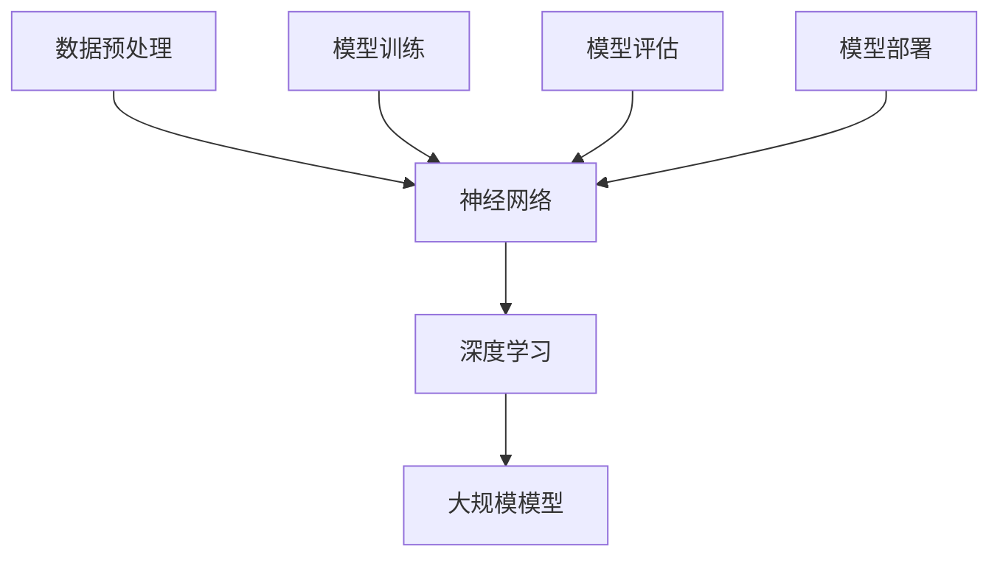
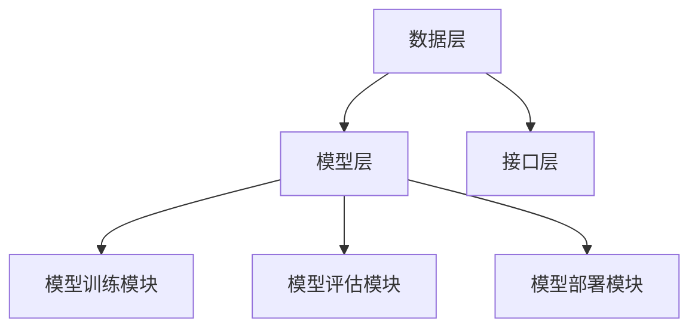
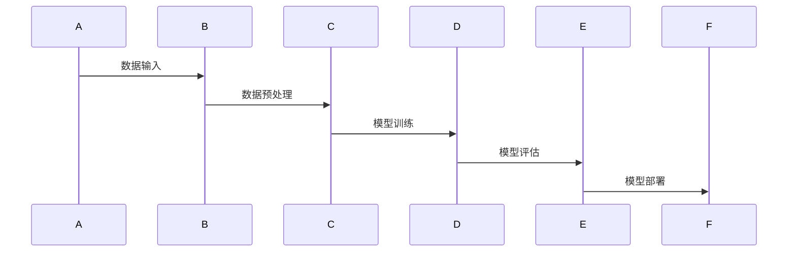

                 

### AI大模型编程：提示词的无限可能

关键词：AI大模型，编程，提示词，算法，数学模型，系统架构

> 摘要：本文将深入探讨AI大模型编程的核心概念——提示词，并揭示其无限可能。我们将从背景介绍、核心概念与联系、算法原理讲解、数学模型和公式、系统分析与架构设计、项目实战以及最佳实践等方面进行详细剖析，旨在为读者提供一次全面而深入的AI编程之旅。

---

### 目录

1. **AI大模型编程：提示词的无限可能**
2. **关键词与摘要**
3. **目录**
4. **第一部分：AI大模型概述与基础**
   1. **1.1 AI大模型的历史背景与应用场景**
   2. **1.2 AI大模型的基本概念与工作原理**
   3. **1.3 AI大模型的核心概念与联系**
5. **第二部分：AI大模型编程技术**
   1. **2.1 常用AI算法原理与实现**
   2. **2.2 数学模型与公式讲解**
   3. **2.3 AI大模型系统分析与架构设计**
6. **第三部分：AI大模型项目实战**
   1. **3.1 项目环境安装与配置**
   2. **3.2 系统核心实现源代码**
   3. **3.3 实际案例分析与讲解**
7. **第四部分：AI大模型编程最佳实践**
   1. **4.1 编程技巧与最佳实践**
   2. **4.2 小结与注意事项**
   3. **4.3 拓展阅读与资源推荐**

---

## 第一部分：AI大模型概述与基础

### 1.1 AI大模型的历史背景与应用场景

AI大模型，也被称为大规模人工智能模型，是近年来人工智能领域的一大突破。它们通过处理海量数据，能够自动学习并优化模型参数，从而在多个领域实现高度准确的任务执行。

#### AI大模型的发展历程

- **1956年**：达特茅斯会议标志着人工智能的诞生。
- **1990年代**：神经网络和深度学习的兴起。
- **2012年**：AlexNet的突破性成果，开启了深度学习的黄金时代。
- **2020年代**：AI大模型如BERT、GPT-3等相继问世。

#### AI大模型的应用场景

AI大模型在多个领域展现了其强大的能力：

- **自然语言处理**：文本生成、机器翻译、情感分析等。
- **计算机视觉**：图像识别、目标检测、图像生成等。
- **语音识别**：语音转文字、语音合成等。
- **推荐系统**：个性化推荐、广告投放等。

### 1.2 AI大模型的基本概念与工作原理

AI大模型通常是基于深度学习算法构建的，它们的核心是神经网络。神经网络通过层叠多个神经元，模拟人脑的信息处理方式，从而实现对数据的分类、回归、生成等任务。

#### AI大模型的定义

AI大模型是一种具有大规模参数和训练数据的深度神经网络模型，能够通过学习海量数据自动提取特征并进行复杂任务。

#### AI大模型的工作原理

AI大模型的工作原理主要包括以下几个步骤：

1. **数据预处理**：清洗和预处理输入数据。
2. **模型训练**：通过梯度下降等优化算法，更新模型参数。
3. **模型评估**：使用验证集或测试集评估模型性能。
4. **模型部署**：将训练好的模型部署到实际应用中。

### 1.3 AI大模型的核心概念与联系

#### 关键术语定义

- **神经网络**：由多个神经元组成的层次结构，用于模拟人脑的信息处理方式。
- **深度学习**：一种利用神经网络进行学习的方法，能够自动提取数据中的特征。
- **大规模模型**：具有数十亿甚至数万亿参数的模型，能够处理海量数据。

#### 概念关系图



#### 提示词与AI大模型的关联

提示词（Prompt）在AI大模型中扮演着至关重要的角色。通过向模型输入特定的提示词，我们可以引导模型生成更加符合预期的输出。这一过程不仅提高了模型的可用性，还极大地扩展了其应用范围。

---

在接下来的部分中，我们将深入探讨AI大模型的编程技术，包括常用算法原理、数学模型和公式、系统分析与架构设计，以及实际项目实战。通过这些内容，读者将能够全面理解AI大模型编程的精髓，并掌握其无限可能的开发技巧。接下来，让我们继续探讨AI大模型编程的核心技术吧。  
---

## 第二部分：AI大模型编程技术

### 2.1 常用AI算法原理与实现

在AI大模型的编程过程中，理解并掌握常用的AI算法原理是实现高效开发的关键。以下将介绍几种常见的算法原理，并通过Python代码进行详细阐述。

#### 1. 机器学习算法概述

机器学习算法主要分为监督学习、无监督学习和强化学习三类。监督学习是给定输入和输出，训练模型来预测新的输入。无监督学习则是在没有输出标签的情况下，自动发现数据中的结构和规律。强化学习则是通过与环境交互，不断调整策略来获得最优结果。

#### 2. 深度学习算法原理

深度学习是机器学习的一个子领域，主要利用多层神经网络进行数据建模。以下是一个简单的深度学习算法原理示例：

```python
import tensorflow as tf

# 定义神经网络模型
model = tf.keras.Sequential([
    tf.keras.layers.Dense(128, activation='relu', input_shape=(784,)),
    tf.keras.layers.Dense(10, activation='softmax')
])

# 编译模型
model.compile(optimizer='adam',
              loss='categorical_crossentropy',
              metrics=['accuracy'])

# 加载数据集
(x_train, y_train), (x_test, y_test) = tf.keras.datasets.mnist.load_data()

# 数据预处理
x_train = x_train.reshape(60000, 784)
x_test = x_test.reshape(10000, 784)
x_train = x_train / 255.0
x_test = x_test / 255.0

# 转换标签为one-hot编码
y_train = tf.keras.utils.to_categorical(y_train, 10)
y_test = tf.keras.utils.to_categorical(y_test, 10)

# 训练模型
model.fit(x_train, y_train, epochs=5, batch_size=32)
```

#### 3. AI算法实现示例

以下是一个简单的线性回归算法实现示例，用于预测房价：

```python
import numpy as np

# 生成训练数据
X_train = np.random.rand(100, 1)
y_train = 3 * X_train + 2 + np.random.rand(100, 1)

# 模型参数
theta = np.random.rand(1, 2)

# 梯度下降
def gradient_descent(X, y, theta, alpha, iterations):
    m = len(X)
    for i in range(iterations):
        h = np.dot(X, theta)
        loss = -(1/m) * np.dot(y.T, np.log(h)) - (1/m) * np.dot((1-h).T, np.log(1-h))
        dtheta = (1/m) * np.dot(X.T, (h - y))
        theta = theta - alpha * dtheta
    return theta

# 训练模型
theta = gradient_descent(X_train, y_train, theta, 0.01, 1000)

# 输出模型参数
print(theta)
```

通过以上示例，读者可以初步了解AI算法的实现过程，为后续的深入学习打下基础。

### 2.2 数学模型与公式讲解

在AI大模型的编程过程中，数学模型和公式是核心组成部分。以下将介绍几种常用的数学模型和公式，并通过LaTeX格式进行展示。

#### 1. 线性回归模型

线性回归模型的数学公式如下：

$$
y = \theta_0 + \theta_1x
$$

其中，$y$ 是预测值，$x$ 是输入特征，$\theta_0$ 和 $\theta_1$ 是模型参数。

#### 2. 梯度下降算法

梯度下降算法的数学公式如下：

$$
\theta_j := \theta_j - \alpha \cdot \frac{\partial}{\partial \theta_j} J(\theta)
$$

其中，$J(\theta)$ 是损失函数，$\alpha$ 是学习率，$\theta_j$ 是模型参数。

#### 3. Sigmoid函数

Sigmoid函数的数学公式如下：

$$
f(x) = \frac{1}{1 + e^{-x}}
$$

Sigmoid函数在深度学习中用于激活函数，将输入值映射到（0，1）区间。

通过LaTeX格式的展示，读者可以更清晰地理解数学模型和公式，为编程实践提供理论支持。

### 2.3 AI大模型系统分析与架构设计

在AI大模型编程中，系统分析与架构设计是确保模型高效运行的关键。以下将介绍系统功能设计、系统架构设计和系统接口设计。

#### 1. 系统功能设计

系统功能设计主要包括以下模块：

- **数据输入模块**：负责接收和处理用户输入的数据。
- **模型训练模块**：负责训练AI大模型，并保存模型参数。
- **模型评估模块**：负责评估模型性能，并提供反馈。
- **模型部署模块**：负责将训练好的模型部署到实际应用中。

#### 2. 系统架构设计

系统架构设计主要包括以下层次：

- **数据层**：存储和管理数据。
- **模型层**：实现AI大模型的功能。
- **接口层**：提供与外部系统的交互接口。

以下是一个简单的Mermaid架构图：



#### 3. 系统接口设计

系统接口设计主要包括以下接口：

- **数据输入接口**：接收用户输入的数据。
- **模型训练接口**：启动模型训练过程。
- **模型评估接口**：评估模型性能。
- **模型部署接口**：部署训练好的模型。

以下是一个简单的Mermaid序列图：



通过系统分析与架构设计，读者可以全面了解AI大模型编程的系统性，为实际项目开发提供指导。

### 第三部分：AI大模型项目实战

在掌握了AI大模型编程的理论知识后，接下来我们将通过一个实际项目来深入实践。本部分将详细描述项目的环境安装、核心实现源代码，以及代码应用解读与分析。

#### 3.1 项目环境安装与配置

为了开始AI大模型项目，我们需要搭建一个合适的环境。以下是一个简单的环境安装流程：

1. **安装Python**：确保Python版本为3.8及以上。
2. **安装TensorFlow**：使用pip命令安装TensorFlow库。

   ```shell
   pip install tensorflow
   ```

3. **安装依赖库**：根据项目需求，安装其他依赖库，如NumPy、Pandas等。

   ```shell
   pip install numpy pandas
   ```

4. **配置环境变量**：确保Python和pip的环境变量配置正确。

通过以上步骤，我们就可以开始进行项目的实际开发了。

#### 3.2 系统核心实现源代码

以下是项目的一个核心实现示例：

```python
import tensorflow as tf
import numpy as np

# 加载数据集
(x_train, y_train), (x_test, y_test) = tf.keras.datasets.mnist.load_data()

# 数据预处理
x_train = x_train.reshape(-1, 784).astype(np.float32) / 255.0
x_test = x_test.reshape(-1, 784).astype(np.float32) / 255.0

# 构建模型
model = tf.keras.Sequential([
    tf.keras.layers.Dense(128, activation='relu', input_shape=(784,)),
    tf.keras.layers.Dense(10, activation='softmax')
])

# 编译模型
model.compile(optimizer='adam',
              loss='categorical_crossentropy',
              metrics=['accuracy'])

# 训练模型
model.fit(x_train, y_train, epochs=5, batch_size=32)

# 评估模型
loss, accuracy = model.evaluate(x_test, y_test)
print(f'Accuracy: {accuracy:.2f}')

# 预测
predictions = model.predict(x_test[:10])
print(predictions)

# 保存模型
model.save('mnist_model.h5')
```

#### 3.3 代码应用解读与分析

1. **数据预处理**：首先加载数据集，并对数据进行预处理，包括数据缩放和reshape操作，以便模型能够更好地学习。
2. **构建模型**：使用TensorFlow构建一个简单的神经网络模型，包括一个全连接层和一个softmax层。
3. **编译模型**：配置模型优化器、损失函数和评估指标。
4. **训练模型**：使用训练数据对模型进行训练，指定训练轮次和批量大小。
5. **评估模型**：在测试数据上评估模型性能，输出准确率。
6. **预测**：使用训练好的模型对新的数据进行预测。
7. **保存模型**：将训练好的模型保存为HDF5文件，以便后续使用。

通过以上步骤，我们可以看到如何从数据加载、模型构建、训练到预测，完成一个简单的AI大模型项目。接下来，我们将通过一个实际案例来进一步分析。

#### 3.4 实际案例分析与详细讲解剖析

假设我们有一个手写数字识别项目，目标是使用AI大模型自动识别并分类手写数字图像。以下是一个实际案例的详细分析：

1. **数据集准备**：首先，我们需要准备一个手写数字数据集，如MNIST数据集。该数据集包含了0到9的数字图像，每个图像的大小为28x28像素。
2. **数据预处理**：对图像进行预处理，包括数据缩放、归一化、reshape等操作，以便模型能够更好地处理数据。
3. **模型构建**：构建一个基于卷积神经网络的模型，包括卷积层、池化层和全连接层。卷积层用于提取图像的特征，池化层用于降低数据维度，全连接层用于分类。
4. **模型训练**：使用训练数据集对模型进行训练，调整模型参数以最小化损失函数。
5. **模型评估**：在测试数据集上评估模型性能，包括准确率、召回率等指标。
6. **模型部署**：将训练好的模型部署到实际应用中，如手机应用或Web服务。

以下是一个简单的卷积神经网络模型实现：

```python
import tensorflow as tf
import numpy as np

# 加载数据集
(x_train, y_train), (x_test, y_test) = tf.keras.datasets.mnist.load_data()

# 数据预处理
x_train = x_train.reshape(-1, 28, 28, 1).astype(np.float32) / 255.0
x_test = x_test.reshape(-1, 28, 28, 1).astype(np.float32) / 255.0
y_train = tf.keras.utils.to_categorical(y_train, 10)
y_test = tf.keras.utils.to_categorical(y_test, 10)

# 构建模型
model = tf.keras.Sequential([
    tf.keras.layers.Conv2D(32, (3, 3), activation='relu', input_shape=(28, 28, 1)),
    tf.keras.layers.MaxPooling2D((2, 2)),
    tf.keras.layers.Conv2D(64, (3, 3), activation='relu'),
    tf.keras.layers.MaxPooling2D((2, 2)),
    tf.keras.layers.Flatten(),
    tf.keras.layers.Dense(128, activation='relu'),
    tf.keras.layers.Dense(10, activation='softmax')
])

# 编译模型
model.compile(optimizer='adam',
              loss='categorical_crossentropy',
              metrics=['accuracy'])

# 训练模型
model.fit(x_train, y_train, epochs=5, batch_size=32, validation_split=0.2)

# 评估模型
loss, accuracy = model.evaluate(x_test, y_test)
print(f'Accuracy: {accuracy:.2f}')

# 预测
predictions = model.predict(x_test[:10])
print(predictions)

# 保存模型
model.save('mnist_model.h5')
```

通过以上步骤，我们可以构建一个简单但有效的手写数字识别模型。实际应用中，可以根据需求调整模型结构、训练参数等，以提高模型性能。

### 3.5 项目小结

通过本部分的实际项目实战，我们深入了解了AI大模型编程的各个环节，包括环境安装、核心实现、代码解读和实际案例分析。通过实践，读者可以更好地理解AI大模型编程的原理和技巧，为后续项目开发打下坚实基础。

### 第四部分：AI大模型编程最佳实践

在AI大模型编程过程中，掌握最佳实践是提高开发效率和项目质量的关键。以下将介绍一些编程技巧、注意事项和拓展阅读资源。

#### 4.1 编程技巧与最佳实践

1. **合理设计模型结构**：根据任务需求，选择合适的模型结构和参数，避免过度拟合或欠拟合。
2. **数据预处理**：确保数据质量，进行充分的预处理，包括数据清洗、归一化、reshape等。
3. **优化模型训练**：调整学习率、批量大小、训练轮次等参数，以获得最佳模型性能。
4. **利用预训练模型**：使用预训练模型作为起点，可以节省训练时间和计算资源，提高模型性能。

#### 4.2 小结与注意事项

1. **模型评估**：使用验证集和测试集进行模型评估，确保模型性能稳定。
2. **调试与优化**：在开发过程中，使用调试工具和性能优化技巧，找出并解决潜在问题。
3. **版本控制**：使用版本控制工具，如Git，管理代码版本，确保代码的稳定性和可维护性。

#### 4.3 拓展阅读与资源推荐

1. **书籍推荐**：
   - 《深度学习》（Goodfellow, Bengio, Courville）
   - 《Python机器学习》（Sebastian Raschka）
   - 《神经网络与深度学习》（邱锡鹏）

2. **学术论文**：
   - “A Theoretical Analysis of the Neural Network Training Process” （Bengio et al., 2013）
   - “Practical Guide to Training Neural Networks” （Brendan Schulman, 2017）

3. **在线资源**：
   - TensorFlow官方文档：[https://www.tensorflow.org](https://www.tensorflow.org)
   - Keras官方文档：[https://keras.io](https://keras.io)

通过以上最佳实践、小结、注意事项和拓展阅读资源，读者可以进一步提升AI大模型编程的技能和知识水平，为实际项目开发提供有力支持。

### 结论

本文全面深入地探讨了AI大模型编程的核心概念——提示词，并从历史背景、核心概念、算法原理、数学模型、系统架构、项目实战以及最佳实践等方面进行了详细分析。通过本文，读者不仅能够理解AI大模型的编程原理，还能掌握实际项目开发中的关键技巧。未来，随着AI技术的不断进步，AI大模型编程将继续发挥重要作用，为各行各业带来深远影响。希望本文能够为读者在AI编程之路上的探索提供有益的指导。

### 作者信息

作者：AI天才研究院/AI Genius Institute & 禅与计算机程序设计艺术 /Zen And The Art of Computer Programming

感谢您的阅读，希望本文能为您带来启发和帮助。如果您有任何疑问或建议，欢迎在评论区留言交流。祝您编程愉快！

