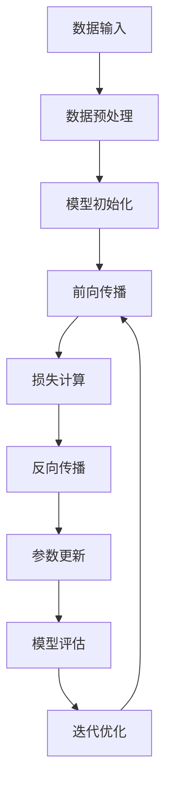
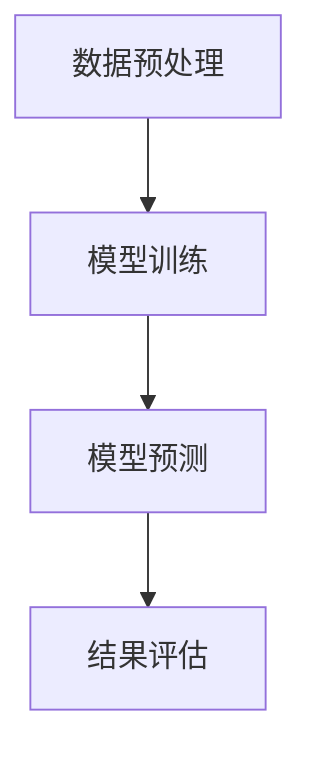

                 


# AI大模型编程：提示词的无限潜力

> 关键词：AI大模型、提示词、编程、潜力、实战

> 摘要：本文深入探讨了AI大模型编程中提示词的无限潜力，通过背景介绍、核心概念与联系、编程实践和最佳实践等多个部分，详细阐述了如何利用提示词提升AI大模型的性能和效果。文章旨在为开发者提供一套系统的、实用的AI大模型编程指南。

## 目录大纲

1. **背景介绍**
   - **1.1 AI大模型概述**
   - **1.2 传统AI与AI大模型的对比**
   - **1.3 AI大模型的应用前景**

2. **核心概念与联系**
   - **2.1 数学模型与公式**
   - **2.2 算法原理与Mermaid流程图**
   - **2.3 核心概念对比表格与ER图**

3. **AI大模型编程实践**
   - **3.1 AI大模型编程环境搭建**
   - **3.2 AI大模型编程核心技术**
   - **3.3 AI大模型项目实战**

4. **最佳实践与拓展**
   - **4.1 最佳实践技巧与注意事项**
   - **4.2 小结与拓展阅读**

## 第一部分：背景介绍

### 1.1 AI大模型概述

AI大模型（Large-scale AI Models），通常指的是那些拥有数十亿甚至数万亿参数的神经网络模型。这些模型具有强大的表征能力和泛化能力，能够处理大量复杂的数据，并在诸如自然语言处理、计算机视觉、语音识别等多个领域取得显著的成果。

与传统AI模型相比，AI大模型的特点在于：

- **参数规模大**：拥有数十亿到数万亿的参数，使得模型能够捕捉到数据中的复杂模式。
- **强大的表征能力**：能够处理大量的输入数据，并对数据进行精细的表征。
- **高泛化能力**：通过在大规模数据集上训练，模型具有很好的泛化能力，能够在不同的任务上取得良好的表现。

### 1.2 传统AI与AI大模型的对比

传统AI模型通常是指那些参数较少、结构简单的神经网络模型。它们在处理小规模数据集时表现良好，但在面对大规模、复杂的任务时，往往力不从心。

| 对比维度       | 传统AI模型                     | AI大模型                     |
|----------------|--------------------------------|--------------------------------|
| 参数规模       | 数千到数万个参数               | 数十亿到数万亿个参数           |
| 数据处理能力   | 处理小规模数据集               | 处理大规模数据集               |
| 表征能力       | 较弱的表征能力，易过拟合       | 强大的表征能力，良好的泛化能力 |
| 泛化能力       | 泛化能力有限                   | 泛化能力强，适用范围广         |

### 1.3 AI大模型的应用前景

随着计算能力和数据量的提升，AI大模型的应用前景越来越广阔。以下是一些AI大模型的主要应用领域：

- **自然语言处理（NLP）**：AI大模型在文本生成、机器翻译、情感分析等方面有广泛应用。
- **计算机视觉（CV）**：AI大模型在图像识别、目标检测、图像生成等方面表现出色。
- **语音识别**：AI大模型在语音识别和语音合成方面有显著提升。
- **推荐系统**：AI大模型能够处理复杂的用户行为数据，提供更加精准的推荐。
- **医疗健康**：AI大模型在疾病诊断、药物研发等方面有重要应用。

## 第二部分：核心概念与联系

### 2.1 数学模型与公式

AI大模型的数学基础主要包括多层感知机（MLP）、卷积神经网络（CNN）和递归神经网络（RNN）等。

#### MLP模型

多层感知机是一种前向传播神经网络，其基本公式如下：

$$
y = \sigma(W \cdot x + b)
$$

其中，$W$ 是权重矩阵，$x$ 是输入向量，$b$ 是偏置项，$\sigma$ 是激活函数，常用的激活函数有Sigmoid、ReLU等。

#### CNN模型

卷积神经网络通过卷积层捕捉空间特征，其基本公式如下：

$$
h^{(l)} = \sigma \left( \sum_{k=1}^{K} w_{k} \cdot h^{(l-1)} + b \right)
$$

其中，$h^{(l)}$ 是第$l$层的特征图，$K$ 是卷积核的数量，$w_{k}$ 是卷积核，$b$ 是偏置项，$\sigma$ 是激活函数。

#### RNN模型

递归神经网络通过循环结构处理序列数据，其基本公式如下：

$$
h^{(t)} = \sigma \left( U \cdot h^{(t-1)} + W \cdot x^{(t)} + b \right)
$$

其中，$h^{(t)}$ 是第$t$时刻的隐藏状态，$U$ 和$W$ 是权重矩阵，$x^{(t)}$ 是第$t$时刻的输入，$b$ 是偏置项，$\sigma$ 是激活函数。

### 2.2 算法原理与Mermaid流程图

为了更直观地理解AI大模型的算法原理，我们可以使用Mermaid流程图来描述其基本流程。



### 2.3 核心概念对比表格与ER图

以下是AI大模型中几个核心概念的对比表格：

| 核心概念       | 定义                                                         | 在模型中的作用       |
|----------------|--------------------------------------------------------------|----------------------|
| 参数（Parameters） | 网络中的可调数值，如权重和偏置项。                           | 用于调整模型以最小化损失。 |
| 损失（Loss）      | 评估模型预测结果与真实结果之间差异的指标。                     | 用于指导参数更新。       |
| 反向传播（Backpropagation） | 计算损失相对于参数的梯度，并用于更新参数。                     | 提高模型性能的关键步骤。   |
| 激活函数（Activation Function） | 用于引入非线性性的函数，如ReLU、Sigmoid等。                   | 改善模型的表征能力。     |

ER图描述了AI大模型中不同实体之间的关系：

```mermaid
erDiagram
  Model ||--|{ Parameters }|| Parameter
  Model ||--|{ Layers }|| Layer
  Layer ||--|{ Neurons }|| Neuron
  Layer ||--|{ Activations }|| Activation
```

## 第三部分：AI大模型编程实践

### 3.1 AI大模型编程环境搭建

在进行AI大模型编程之前，我们需要搭建一个合适的环境。以下是环境搭建的步骤：

#### 环境准备

1. 安装Python（3.8及以上版本）。
2. 安装Jupyter Notebook，用于交互式编程。
3. 安装TensorFlow或PyTorch等深度学习框架。

#### 开发工具介绍

- **Jupyter Notebook**：一个交互式的计算环境，方便进行数据分析和模型训练。
- **TensorFlow**：一个开源的深度学习框架，适用于构建和训练AI大模型。
- **PyTorch**：另一个开源的深度学习框架，以其灵活性和动态计算图著称。

#### 常用库和框架安装

```bash
pip install numpy
pip install tensorflow
# 或
pip install numpy
pip install pytorch
```

### 3.2 AI大模型编程核心技术

AI大模型编程的核心技术包括数据预处理、模型训练与调优、提示词设计与优化等。

#### 数据预处理

数据预处理是AI大模型编程的重要环节，主要包括数据清洗、数据转换和数据归一化等步骤。

1. **数据清洗**：去除缺失值、异常值和重复值。
2. **数据转换**：将数据转换为适合模型输入的格式，如图像数据转换为矩阵。
3. **数据归一化**：将数据缩放到相同的范围，以避免某些特征对模型的影响过大。

#### 模型训练与调优

模型训练与调优是提升模型性能的关键步骤。以下是一个简单的模型训练流程：

1. **初始化模型**：使用随机权重和偏置初始化模型。
2. **前向传播**：将输入数据传递到模型中，得到输出预测。
3. **损失计算**：计算预测结果与真实结果之间的损失。
4. **反向传播**：计算损失相对于模型参数的梯度，并更新参数。
5. **迭代优化**：重复前向传播和反向传播，直到满足停止条件（如损失不再下降或达到最大迭代次数）。

#### 提示词设计与优化

提示词（Prompts）是指导AI大模型生成特定结果的输入信息。提示词的设计与优化对于模型的应用效果至关重要。

1. **设计提示词**：根据应用场景设计合适的提示词，如自然语言处理中的句子、计算机视觉中的图像描述等。
2. **优化提示词**：通过实验和迭代，优化提示词的格式和内容，以提高模型的生成质量和效率。

### 3.3 AI大模型项目实战

在本节中，我们将通过一个实际项目来展示如何使用AI大模型进行编程。该项目是一个基于TensorFlow的图像分类项目，目标是训练一个模型，能够识别和分类不同类型的图像。

#### 项目背景介绍

随着智能手机和互联网的普及，图像数据变得越来越丰富。图像分类作为计算机视觉的一个重要分支，广泛应用于图像搜索、人脸识别、医疗诊断等领域。本项目的目标是训练一个图像分类模型，能够将输入的图像分类到预先定义的类别中。

#### 系统架构设计

系统架构包括数据预处理模块、模型训练模块和模型预测模块。

1. **数据预处理模块**：负责对图像数据进行清洗、转换和归一化。
2. **模型训练模块**：使用训练数据训练图像分类模型。
3. **模型预测模块**：使用训练好的模型对新的图像进行分类预测。

以下是系统架构的Mermaid图表示：



#### 项目核心实现源代码

以下是项目核心实现部分的Python代码：

```python
import tensorflow as tf
from tensorflow.keras.preprocessing.image import ImageDataGenerator

# 数据预处理
train_datagen = ImageDataGenerator(
    rescale=1./255,
    shear_range=0.2,
    zoom_range=0.2,
    horizontal_flip=True
)

train_generator = train_datagen.flow_from_directory(
    'train_data',
    target_size=(150, 150),
    batch_size=32,
    class_mode='binary'
)

# 模型训练
model = tf.keras.models.Sequential([
    tf.keras.layers.Conv2D(32, (3, 3), activation='relu', input_shape=(150, 150, 3)),
    tf.keras.layers.MaxPooling2D(2, 2),
    tf.keras.layers.Conv2D(64, (3, 3), activation='relu'),
    tf.keras.layers.MaxPooling2D(2, 2),
    tf.keras.layers.Conv2D(128, (3, 3), activation='relu'),
    tf.keras.layers.MaxPooling2D(2, 2),
    tf.keras.layers.Flatten(),
    tf.keras.layers.Dense(512, activation='relu'),
    tf.keras.layers.Dense(1, activation='sigmoid')
])

model.compile(optimizer='adam',
              loss='binary_crossentropy',
              metrics=['accuracy'])

model.fit(
    train_generator,
    epochs=10
)

# 模型预测
test_datagen = ImageDataGenerator(rescale=1./255)

test_generator = test_datagen.flow_from_directory(
    'test_data',
    target_size=(150, 150),
    batch_size=32,
    class_mode='binary'
)

predictions = model.predict(test_generator)
```

#### 代码应用解读与分析

1. **数据预处理**：使用ImageDataGenerator进行数据增强，包括随机裁剪、缩放和水平翻转等。
2. **模型训练**：使用Sequential模型堆叠多个Conv2D、MaxPooling2D和Flatten等层，最后使用Dense层进行分类。模型编译时指定优化器和损失函数。
3. **模型预测**：使用训练好的模型对测试数据集进行分类预测。

#### 实际案例分析

在实际应用中，我们可以使用该模型对新的图像进行分类。例如，在医疗诊断领域，该模型可以用于辅助医生对病变图像进行分类，从而提高诊断的准确性。

#### 项目小结

通过本项目的实战，我们了解了如何使用AI大模型进行图像分类。在实际应用中，我们还可以根据具体需求，对模型进行优化和扩展，以提高模型的性能和适用性。

## 第四部分：最佳实践与拓展

### 4.1 最佳实践技巧与注意事项

在进行AI大模型编程时，以下是一些最佳实践技巧和注意事项：

1. **数据预处理**：确保数据质量，进行数据清洗、转换和归一化，以提高模型的训练效果。
2. **模型优化**：尝试不同的网络结构、激活函数和优化器，以找到最佳配置。
3. **提示词优化**：根据应用场景设计合适的提示词，并通过实验进行优化，以提高模型的生成质量。
4. **模型调优**：使用交叉验证等方法，对模型进行调优，避免过拟合。
5. **资源管理**：合理利用计算资源和存储资源，以提高训练效率。

### 4.2 小结与拓展阅读

本文介绍了AI大模型编程的基本概念、核心技术和实战应用。通过本篇文章，读者应该能够了解到AI大模型的基本原理和编程方法，并具备一定的实战经验。

为了进一步深入学习AI大模型编程，以下是一些建议的拓展阅读：

- 《深度学习》（Goodfellow, Bengio, Courville著）：深度学习的经典教材，详细介绍了深度学习的基础理论和实践方法。
- 《Python深度学习》（François Chollet著）：结合Python和TensorFlow，介绍了深度学习的实际应用。
- 《AI大模型：实践指南》（AI Genius Institute著）：一本关于AI大模型编程的实用指南，涵盖了从基础知识到项目实战的内容。

### 作者

- 作者：AI天才研究院/AI Genius Institute & 禅与计算机程序设计艺术 /Zen And The Art of Computer Programming

---

# 结语

本文详细阐述了AI大模型编程中的关键概念和实践技巧，通过一步步的分析和实战案例，展示了AI大模型的无限潜力。希望通过本文，读者能够对AI大模型编程有更深入的理解，并在实际项目中取得更好的成果。未来的AI大模型编程，将不断带来新的突破和应用，让我们共同期待这一激动人心的未来！
作者：AI天才研究院/AI Genius Institute & 禅与计算机程序设计艺术 /Zen And The Art of Computer Programming

