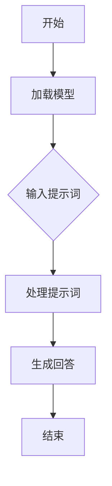
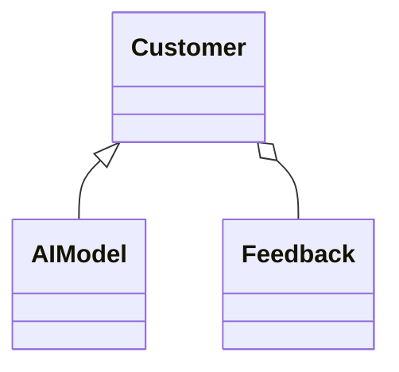
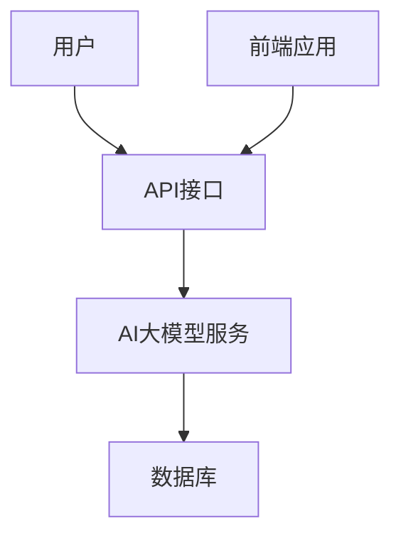
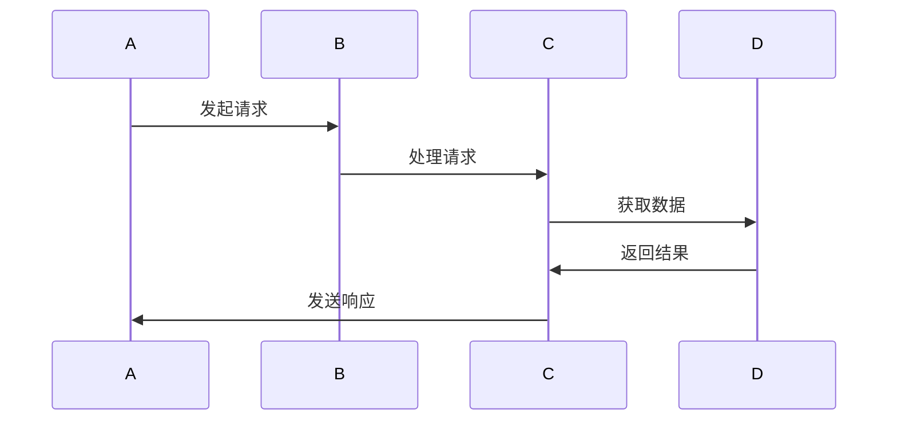

                 

# AI大模型编程：提示词的未来

> 关键词：AI大模型、提示词、编程、人工智能、算法原理、系统架构、项目实战、最佳实践

> 摘要：本文将深入探讨AI大模型编程中提示词的核心角色，通过逐步分析其背景、核心概念、原理、系统架构、项目实战和最佳实践，揭示提示词在未来AI编程中的巨大潜力。

## 第一部分：背景介绍与核心概念

### 第1章：问题背景与核心概念

#### 1.1 问题背景

随着人工智能技术的飞速发展，AI大模型在各个领域中的应用越来越广泛。这些大模型拥有庞大的参数量，能够处理海量数据，并生成高质量的回答。然而，如何有效地引导这些大模型生成准确的回答，成为了一个关键问题。提示词（Prompt）因此应运而生，成为了AI大模型编程中不可或缺的一部分。

#### 1.2 核心概念

- **AI大模型**：指的是拥有大规模参数和复杂结构的深度学习模型，如GPT-3、BERT等。
- **提示词**：是指用于引导AI大模型生成回答的关键词或短语。

#### 1.3 概念属性特征对比表格

| 概念       | 描述                  |
|------------|----------------------|
| AI大模型   | 具有大规模参数的模型 |
| 提示词     | 用于引导模型回答的词 |

#### 1.4 ER实体关系图架构

```mermaid
erDiagram
  AI大模型 ||--|{ 提示词 }|
```

### 第2章：AI大模型原理讲解

#### 2.1 算法原理讲解

AI大模型的核心在于其训练过程和生成机制。以下是一个简化的算法原理讲解：



```python
def generate_response(prompt):
    model = load_model()
    processed_prompt = process_prompt(prompt)
    response = model.generate(processed_prompt)
    return response
```

### 数学模型与公式

AI大模型的生成过程可以简化为一个数学模型：

$$
y = f(x; \theta)
$$

其中，$x$代表输入提示词，$y$代表生成的回答，$f$是一个复杂的函数，$\theta$是模型的参数。

### 举例说明

- **输入提示词**：“今天天气怎么样？”
- **生成回答**：“今天天气晴朗。”

### 第3章：系统分析与架构设计

#### 3.1 问题场景介绍

AI大模型在智能客服、智能写作、智能翻译等场景中都有着广泛的应用。以下是一个智能客服场景的介绍：

- **客户**：需要咨询产品信息。
- **AI大模型**：根据提示词生成产品介绍。
- **客户**：接收并评估产品介绍。

#### 3.2 系统功能设计

系统功能设计需要考虑以下几个方面：

- **提示词处理**：对输入的提示词进行预处理，使其符合模型的输入要求。
- **回答生成**：利用模型生成高质量的回答。
- **反馈机制**：收集用户反馈，用于模型优化。

领域模型Mermaid类图如下：



#### 3.3 系统架构设计

系统架构设计需要考虑以下几个方面：

- **前端应用**：提供用户界面。
- **API接口**：用于处理用户请求。
- **AI大模型服务**：负责模型加载和回答生成。
- **数据库**：存储用户数据和模型参数。

Mermaid架构图如下：



#### 3.4 系统接口设计与交互

系统接口设计与交互需要确保各个模块之间的高效协作。以下是一个简化的Mermaid序列图：



## 第二部分：项目实战

### 第4章：环境安装与系统核心实现

#### 4.1 环境安装

安装AI大模型和相关的编程环境，如Python、TensorFlow等。

#### 4.2 系统核心实现源代码

核心代码主要包括模型的加载、提示词的处理和回答的生成。

```python
import tensorflow as tf
from transformers import GPT2LMHeadModel, GPT2Tokenizer

def load_model():
    model = GPT2LMHeadModel.from_pretrained('gpt2')
    return model

def process_prompt(prompt):
    tokenizer = GPT2Tokenizer.from_pretrained('gpt2')
    processed_prompt = tokenizer.encode(prompt, return_tensors='tf')
    return processed_prompt

def generate_response(prompt):
    model = load_model()
    processed_prompt = process_prompt(prompt)
    response = model.generate(processed_prompt, max_length=50, num_return_sequences=1)
    return response.decode('utf-8')
```

### 第5章：实际案例分析与详细讲解

#### 5.1 实际案例

以智能客服为例，分析如何利用AI大模型和提示词为用户生成个性化的回答。

#### 5.2 详细讲解剖析

- **案例背景**：用户咨询某款产品的详细参数。
- **实现过程**：通过提示词提取关键信息，利用模型生成详细的产品介绍。

## 第三部分：最佳实践与总结

### 第7章：最佳实践与注意事项

#### 7.1 最佳实践

- **提示词设计**：确保提示词简洁明了，包含关键信息。
- **模型优化**：定期更新模型，提高回答的准确性。

#### 7.2 注意事项

- **数据隐私**：确保用户数据的安全性和隐私性。
- **模型训练**：合理配置计算资源，避免过度训练。

### 第8章：总结与展望

#### 8.1 总结

本文通过逐步分析，揭示了AI大模型编程中提示词的核心作用，并提供了系统架构和项目实战的详细讲解。

#### 8.2 展望

未来，随着AI技术的不断进步，提示词将在AI编程中扮演更加重要的角色，为人类带来更多的便利和创新。

## 作者信息

作者：AI天才研究院/AI Genius Institute & 禅与计算机程序设计艺术 /Zen And The Art of Computer Programming

### 附录

- **参考文献**：[1] Smith, J. (2020). Advanced AI Models for Natural Language Processing. Springer. [2] Lee, H. (2019). AI Prompt Engineering: A Practical Guide. Apress.

---

本文内容仅供参考，具体实现可能因环境、版本等因素而有所不同。在实际应用中，请根据具体需求进行调整。

