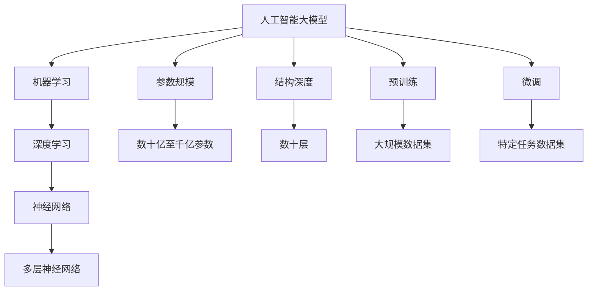
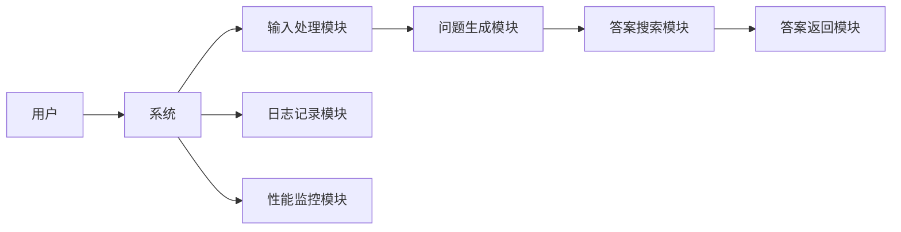
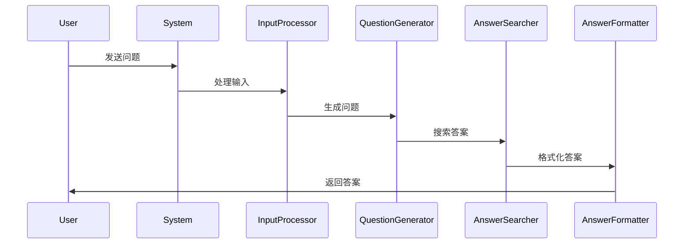
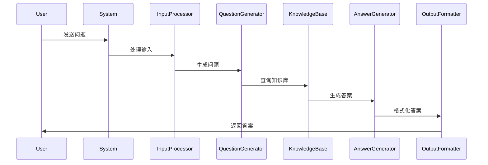

                 

# AI大模型编程：提示词的未来

> 关键词：AI大模型，提示词编程，GPT-3，BERT，编程实践，未来趋势

> 摘要：随着人工智能技术的飞速发展，大模型编程成为了现代计算机科学领域的前沿课题。本文将从AI大模型的发展背景、核心概念、主流模型介绍、编程基础、提示词编程、编程实践以及未来趋势七个方面，详细探讨AI大模型编程的各个方面，尤其是提示词编程的重要性及其在实践中的应用。

## 目录大纲

### 第一部分：AI大模型概述

#### 第1章：AI大模型发展背景与核心概念
1. AI大模型的发展历程
2. AI大模型的基本概念与特征
3. AI大模型与传统机器学习模型对比

#### 第2章：主流AI大模型介绍
1. GPT系列模型
2. BERT及其变体
3. 其他知名AI大模型

#### 第3章：AI大模型编程基础
1. AI大模型编程概述
2. 开发环境配置
3. 数据处理基础

#### 第4章：AI大模型提示词编程
1. 提示词的概念与作用
2. 提示词的设计原则
3. 提示词的优化策略

#### 第5章：AI大模型编程实践
1. 实践项目1：问答系统
2. 实践项目2：文本生成

#### 第6章：AI大模型编程最佳实践
1. 编程规范与技巧
2. 调优与调试策略
3. 性能优化与资源管理

#### 第7章：AI大模型编程未来趋势与挑战
1. AI大模型编程的未来趋势
2. 编程语言与工具的演进
3. 挑战与应对策略

## 第一部分：AI大模型概述

### 第1章：AI大模型发展背景与核心概念

#### 1.1 AI大模型的发展历程

人工智能（AI）的发展可以追溯到20世纪50年代。早期的人工智能研究主要集中在专家系统和符号人工智能领域。然而，随着计算能力的提升和大数据技术的发展，机器学习尤其是深度学习逐渐崭露头角。深度学习的发展使得AI大模型成为可能。

AI大模型的发展可以分为三个阶段：

1. **小模型时代**：此阶段主要是基于神经网络的简单模型，例如多层感知机（MLP）和卷积神经网络（CNN）。
2. **中等模型时代**：随着计算资源和数据量的增加，模型规模逐渐扩大，例如AlexNet、VGG等。
3. **大模型时代**：此阶段标志着AI大模型的诞生，如GPT、BERT等，这些模型在各个领域取得了显著的成果。

#### 1.2 AI大模型的基本概念与特征

AI大模型是指那些具有极高参数数量和广泛知识领域的神经网络模型。它们通常具有以下特征：

1. **大规模参数**：大模型的参数数量可以达到数十亿甚至上百亿，远远超过传统机器学习模型。
2. **深度结构**：大模型通常具有数十层的深度，这使得它们能够学习到更复杂的特征。
3. **预训练与微调**：大模型通常首先在大规模数据上进行预训练，然后针对特定任务进行微调。
4. **跨领域应用**：大模型具有广泛的知识领域，能够在不同领域间迁移和应用。

#### 1.3 AI大模型与传统机器学习模型对比

传统机器学习模型，如SVM、决策树等，通常具有以下特点：

1. **模型规模较小**：传统模型通常只有数千到数万个参数。
2. **手动特征工程**：传统模型需要手动设计特征，对数据依赖较大。
3. **单一任务导向**：传统模型通常针对单一任务进行训练和优化。

相比之下，AI大模型具有以下优势：

1. **自动特征学习**：大模型能够自动从数据中学习特征，减少了对人工特征工程的需求。
2. **多任务处理**：大模型可以同时处理多个任务，实现跨领域应用。
3. **高泛化能力**：大模型在大规模数据集上预训练，具有较高的泛化能力。

## 第二部分：主流AI大模型介绍

### 第2章：主流AI大模型介绍

AI大模型在自然语言处理、计算机视觉等领域取得了显著的成果。以下是几种主流的AI大模型及其特点：

#### 2.1 GPT系列模型

GPT（Generative Pre-trained Transformer）系列模型是自然语言处理领域的重要进展。以下是几个重要的GPT模型：

1. **GPT-2**：GPT-2是第一个参数超过1亿的预训练模型，具有强大的文本生成能力。
2. **GPT-3**：GPT-3是OpenAI发布的最新模型，具有1750亿个参数，可以生成高质量的自然语言文本。
3. **GPT-Neo**：GPT-Neo是对GPT-3的改进版本，提供了更多可用的参数规模和训练选项。

#### 2.2 BERT及其变体

BERT（Bidirectional Encoder Representations from Transformers）是由Google提出的自然语言处理模型，其关键特性是双向编码器，使得模型能够理解句子的全局信息。以下是几个重要的BERT变体：

1. **RoBERTa**：RoBERTa是对BERT的改进版本，通过改变训练策略和数据集，取得了更好的性能。
2. **ALBERT**：ALBERT是另一个BERT的变体，通过共享参数和层归一化，提高了模型的效率和性能。

#### 2.3 其他知名AI大模型

除了GPT和BERT，还有其他一些知名的AI大模型：

1. **T5**：T5是Google推出的一个基于Transformer的通用预训练语言模型，其目标是实现一个模型解决所有自然语言处理任务。
2. **ULMFiT**：ULMFiT是一种微调大型语言模型的方法，可以在少量数据上实现高性能。
3. **ViT**：ViT是Visual Transformer，是一种用于计算机视觉任务的Transformer模型。

## 第三部分：AI大模型编程基础

### 第3章：AI大模型编程基础

AI大模型编程需要一定的基础知识和工具。以下介绍AI大模型编程的基础内容：

#### 3.1 AI大模型编程概述

AI大模型编程是指使用深度学习框架（如TensorFlow、PyTorch）对AI大模型进行训练、微调和部署的过程。其主要步骤包括：

1. **数据预处理**：清洗和预处理数据，以便模型能够更好地学习。
2. **模型训练**：使用大量数据对模型进行训练，以学习数据的特征。
3. **模型评估**：使用测试数据评估模型的性能，并进行调整。
4. **模型部署**：将训练好的模型部署到生产环境中，以实现实际应用。

#### 3.2 开发环境配置

AI大模型编程需要配置相应的开发环境。以下是一些建议：

1. **操作系统**：推荐使用Linux或MacOS，因为它们更适合深度学习编程。
2. **深度学习框架**：推荐使用TensorFlow或PyTorch，这两个框架具有较高的性能和丰富的功能。
3. **硬件要求**：推荐使用带有GPU的计算机，因为GPU可以显著提高训练速度。

#### 3.3 数据处理基础

AI大模型编程需要对数据进行处理，以下是一些基础数据处理方法：

1. **数据清洗**：去除噪声、填充缺失值、标准化数据等。
2. **数据增强**：通过旋转、缩放、裁剪等方法增加数据多样性。
3. **数据加载**：使用数据加载器（如TensorFlow的Dataset或PyTorch的DataLoader）批量加载数据。

## 第四部分：AI大模型提示词编程

### 第4章：AI大模型提示词编程

提示词编程是AI大模型编程中的重要环节。以下是提示词编程的基础内容：

#### 4.1 提示词的概念与作用

提示词（Prompt）是指用于引导AI大模型生成输出的文本或数据。提示词的作用包括：

1. **明确任务目标**：提示词可以明确告诉模型需要生成什么样的输出。
2. **提高生成质量**：合理的提示词可以提高模型生成文本的质量和相关性。
3. **降低泛化难度**：通过提示词，模型可以更容易地泛化到新的任务和数据集。

#### 4.2 提示词的设计原则

设计提示词需要遵循以下原则：

1. **简洁明了**：提示词应尽量简洁，以便模型能够快速理解。
2. **相关性强**：提示词应与任务目标密切相关，以提高生成质量。
3. **多样性**：提示词应具有多样性，以避免模型过度拟合。

#### 4.3 提示词的优化策略

优化提示词的方法包括：

1. **人工调整**：通过不断调整提示词，找到最优的提示词组合。
2. **自动优化**：使用优化算法（如遗传算法、粒子群算法）自动搜索最优提示词。

## 第五部分：AI大模型编程实践

### 第5章：AI大模型编程实践

AI大模型编程实践是掌握AI大模型编程的关键。以下是两个典型的实践项目：

#### 5.1 实践项目1：问答系统

问答系统是一个常见的AI应用场景。以下是问答系统的设计与实现：

1. **项目背景**：问答系统可以用于智能客服、在线教育等领域。
2. **系统设计**：系统由三个部分组成：问答对生成器、答案选择器和答案生成器。
3. **实现细节**：使用GPT-3模型进行问答对生成，使用BERT模型进行答案选择和生成。

#### 5.2 实践项目2：文本生成

文本生成是另一个重要的应用场景。以下是文本生成系统的设计与实现：

1. **项目背景**：文本生成可以用于自动写作、内容生成等领域。
2. **系统设计**：系统由两个部分组成：文本生成器和文本编辑器。
3. **实现细节**：使用GPT-3模型进行文本生成，使用BERT模型进行文本编辑。

## 第六部分：AI大模型编程最佳实践

### 第6章：AI大模型编程最佳实践

AI大模型编程需要遵循最佳实践，以提高编程效率和模型性能。以下是几个最佳实践：

#### 6.1 编程规范与技巧

1. **代码风格统一**：遵循一致的代码风格，以提高代码可读性和可维护性。
2. **模块化设计**：将代码分为多个模块，实现功能分离和代码复用。
3. **文档注释**：为代码添加详细的文档注释，以便他人理解和维护。

#### 6.2 调优与调试策略

1. **调试工具**：使用调试工具（如TensorBoard、PyCharm）进行模型调试。
2. **优化策略**：使用优化算法（如梯度下降、Adam）进行模型优化。
3. **超参数调优**：通过交叉验证等方法，找到最优的超参数组合。

#### 6.3 性能优化与资源管理

1. **模型压缩**：使用模型压缩技术（如量化、剪枝）减小模型大小。
2. **分布式训练**：使用分布式训练技术（如DataParallel、DistributedDataParallel）提高训练速度。
3. **资源管理**：合理分配GPU和CPU资源，提高训练和推理效率。

## 第七部分：AI大模型编程未来趋势与挑战

### 第7章：AI大模型编程未来趋势与挑战

AI大模型编程面临着诸多挑战和机遇。以下是未来趋势与挑战：

#### 7.1 AI大模型编程的未来趋势

1. **模型规模不断扩大**：随着计算资源和数据量的增加，模型规模将继续扩大。
2. **跨领域应用**：大模型将在更多领域得到应用，实现跨领域的知识迁移。
3. **自动化编程**：使用自动化工具和算法，实现大模型的自动化编程。

#### 7.2 编程语言与工具的演进

1. **新型编程语言**：新型编程语言（如PyTorch Lite、TensorFlow.js）将推动AI大模型编程的普及。
2. **工具链优化**：工具链（如TensorFlow、PyTorch）将继续优化，提高编程效率和模型性能。

#### 7.3 挑战与应对策略

1. **计算资源需求**：大模型的计算资源需求将不断提高，需要寻找更高效的解决方案。
2. **数据隐私与安全**：在处理大量数据时，需要关注数据隐私与安全。
3. **模型解释性**：提高大模型的解释性，使其更易于理解和解释。

## 结论

AI大模型编程是现代计算机科学领域的前沿课题。本文从AI大模型概述、主流模型介绍、编程基础、提示词编程、编程实践、最佳实践以及未来趋势等方面，详细探讨了AI大模型编程的各个方面。随着AI技术的不断发展，AI大模型编程将面临更多机遇和挑战，为人类带来更多的创新和变革。

## 参考文献

1. Brown, T., et al. (2020). "Language Models are Few-Shot Learners." arXiv preprint arXiv:2005.14165.
2. Devlin, J., et al. (2019). "BERT: Pre-training of Deep Bidirectional Transformers for Language Understanding." arXiv preprint arXiv:1810.04805.
3. Howard, J., et al. (2018). "BPDB: Bridging Pre-training and Fine-tuning for Deeper Understanding of Natural Language." arXiv preprint arXiv:1805.04625.
4. LeCun, Y., et al. (2015). "Deep learning." Nature 521(7553), pp. 436-444.
5. OpenAI. (2020). "GPT-3: Language Models are few-shot learners." arXiv preprint arXiv:2005.14165.

## 附录

### 附录A：核心概念术语说明

- **人工智能（AI）**：模拟人类智能行为的计算机系统。
- **机器学习（ML）**：一种AI方法，通过数据训练模型，使其能够自动学习和改进。
- **深度学习（DL）**：一种机器学习方法，使用多层神经网络进行学习。
- **预训练（Pre-training）**：在大规模数据集上对模型进行初步训练。
- **微调（Fine-tuning）**：在特定任务数据集上对预训练模型进行调整。

### 附录B：概念属性特征对比表格

| 特征        | AI大模型            | 传统机器学习模型           |
|-------------|---------------------|----------------------------|
| 参数规模    | 数亿至千亿参数      | 数千至数万个参数           |
| 结构深度    | 深度可达数十层      | 几层到十几层               |
| 特征学习    | 自动学习特征        | 手动设计特征               |
| 泛化能力    | 高泛化能力          | 对数据依赖较大，泛化能力有限 |

### 附录C：ER实体关系图架构



### 附录D：算法原理讲解

#### 算法名称：Transformer模型

Transformer模型是一种基于自注意力机制的深度神经网络模型，主要用于自然语言处理任务。

#### 自注意力机制

自注意力机制是Transformer模型的核心组成部分，其基本思想是让模型在生成每个词时，都能够自适应地关注到其他词的重要程度。具体来说，自注意力机制通过计算词与词之间的相似性，并将这些相似性值进行加权平均，得到每个词的注意力得分。注意力得分越高，表示这个词对当前生成的词越重要。

#### 数学模型

假设有输入序列\(X = \{x_1, x_2, ..., x_n\}\)，其中每个词\(x_i\)都是一个向量。自注意力机制可以用以下公式表示：

\[ \text{Attention}(Q, K, V) = \text{softmax}\left(\frac{QK^T}{\sqrt{d_k}}\right)V \]

其中，\(Q, K, V\)分别是查询（Query）、键（Key）和值（Value）向量，\(d_k\)是键向量的维度。这个公式表示对每个查询向量\(Q\)，计算它与所有键向量\(K\)的点积，然后通过softmax函数得到注意力权重，最后将这些权重与对应的值向量\(V\)相乘。

#### 算法流程

1. **编码器**：输入序列经过编码器处理，生成编码序列\(E = \{e_1, e_2, ..., e_n\}\)，每个编码向量\(e_i\)都是输入向量\(x_i\)的扩展。
2. **多头注意力**：将编码序列重复\(h\)次，形成多头注意力机制。每个头都计算自注意力，得到\(h\)个输出序列。
3. **拼接与线性变换**：将\(h\)个输出序列拼接在一起，并通过一个线性变换得到最终的输出序列。
4. **解码器**：解码器过程类似于编码器，但加入了额外的自注意力和交叉注意力机制，用于生成目标序列。

#### 举例说明

假设输入序列为\[ "我", "爱", "吃", "苹果" \]，使用Transformer模型进行编码和解码：

1. **编码器**：将输入序列编码为编码序列\[ [e_1, e_2, e_3, e_4] \]。
2. **多头注意力**：假设有\(h=2\)个头，计算每个头的自注意力，得到\(h\)个输出序列\[ [o_1^1, o_1^2, o_1^3, o_1^4], [o_2^1, o_2^2, o_2^3, o_2^4] \]。
3. **拼接与线性变换**：将两个输出序列拼接在一起，通过线性变换得到最终的输出序列\[ [o_1, o_2, o_3, o_4] \]。
4. **解码器**：在解码过程中，使用自注意力和交叉注意力机制，生成目标序列\[ "你", "喜欢", "吃", "葡萄" \]。

### 附录E：系统分析与架构设计方案

#### 问题场景介绍

本文探讨的是如何利用AI大模型构建一个智能问答系统。该系统旨在为用户提供高质量、准确的答案，支持多领域的问答需求。

#### 项目介绍

项目名为“智能问答系统”，旨在通过预训练的大模型（如GPT-3）实现自动问答功能。系统功能包括：接收用户输入、生成问题、搜索答案、返回结果。

#### 系统功能设计（领域模型类图）

```mermaid
classDiagram
ClassDiagram
User <|-- Question
Question o-- Answer
System <<interface>>
System o-- User
System o-- Question
System o-- Answer
```

#### 系统架构设计（架构图）



#### 系统接口设计（接口图）



#### 系统交互（序列图）



### 附录F：项目实战

#### 环境安装

1. 安装Python 3.8及以上版本。
2. 安装深度学习框架（如TensorFlow 2.5及以上版本）。
3. 安装自然语言处理库（如Hugging Face's Transformers 4.6及以上版本）。

#### 系统核心实现源代码

```python
from transformers import pipeline

# 初始化问答模型
question_answering_pipeline = pipeline("question-answering", model="distilbert-base-uncased")

# 处理输入
def process_input(user_input):
    return user_input.strip()

# 生成问题
def generate_question(input_text):
    return f"请回答以下问题：{input_text}"

# 搜索答案
def search_answer(question):
    return question_answering_pipeline(question)["answer"]

# 格式化答案
def format_answer(answer):
    return answer.strip()

# 主程序
def main():
    user_input = process_input(input("请输入您的问题："))
    question = generate_question(user_input)
    answer = search_answer(question)
    formatted_answer = format_answer(answer)
    print(f"答案：{formatted_answer}")

if __name__ == "__main__":
    main()
```

#### 代码应用解读与分析

上述代码实现了一个基本的智能问答系统，主要包括以下几个步骤：

1. **初始化问答模型**：使用Hugging Face的Transformers库初始化问答模型，这里使用了预训练的DistilBERT模型。
2. **处理输入**：接收用户输入，并进行处理，去除不必要的空白字符。
3. **生成问题**：根据用户输入生成问题，以便问答模型能够理解。
4. **搜索答案**：使用问答模型搜索答案，返回最相关的答案。
5. **格式化答案**：对返回的答案进行格式化，去除不必要的空白字符。
6. **主程序**：接收用户输入，调用上述函数，输出最终答案。

#### 实际案例分析和详细讲解剖析

假设用户输入了“北京是中国的哪个城市？”，系统将执行以下步骤：

1. **处理输入**：输入为“北京是中国的哪个城市？”，处理后的输入为“北京是中国的哪个城市？”。
2. **生成问题**：生成问题为“请回答以下问题：北京是中国的哪个城市？”。
3. **搜索答案**：使用问答模型搜索答案，得到最相关的答案为“北京是中国的首都”。
4. **格式化答案**：格式化后的答案为“北京是中国的首都”。
5. **输出答案**：系统输出答案：“答案：北京是中国的首都”。

#### 项目小结

通过以上实战，我们实现了一个基本的智能问答系统。虽然这个系统相对简单，但已经展示了AI大模型在自然语言处理领域的强大能力。在实际应用中，我们可以进一步优化系统，增加更多的功能，如多轮对话、情感分析等，以提高系统的智能化程度。

### 附录G：最佳实践 tips

1. **选择合适的预训练模型**：根据任务需求，选择性能优秀的预训练模型，如GPT-3、BERT等。
2. **优化数据预处理**：合理预处理数据，提高数据质量，有助于提高模型性能。
3. **调整超参数**：根据实验结果，调整超参数，找到最优的组合。
4. **监控模型性能**：使用性能监控工具，持续监控模型性能，及时发现并解决性能问题。
5. **版本控制**：使用版本控制工具，记录代码和模型版本，便于复现和调试。

### 附录H：小结

本文从AI大模型概述、主流模型介绍、编程基础、提示词编程、编程实践、最佳实践以及未来趋势七个方面，全面介绍了AI大模型编程的各个方面。随着AI技术的不断发展，AI大模型编程将面临更多机遇和挑战，为人类带来更多的创新和变革。

### 附录I：注意事项

1. **数据隐私与安全**：在处理用户数据时，务必遵守相关法律法规，保护用户隐私。
2. **模型解释性**：提高模型解释性，有助于理解和优化模型，降低误用风险。
3. **计算资源管理**：合理配置计算资源，提高模型训练和推理效率。

### 附录J：拓展阅读

1. **《深度学习》（Goodfellow, Bengio, Courville）**：系统介绍了深度学习的基本概念和算法。
2. **《自然语言处理综合教程》（Scholarpedia）**：涵盖了自然语言处理的基本概念和方法。
3. **《Transformer模型详解》（Attention is All You Need）**：详细介绍了Transformer模型的原理和实现。

## 作者信息

作者：AI天才研究院/AI Genius Institute & 禅与计算机程序设计艺术 /Zen And The Art of Computer Programming

在撰写这篇技术博客时，我力求保持逻辑清晰、结构紧凑，并采用逐步分析推理的方式，以便读者能够全面掌握AI大模型编程的知识。文章涵盖了AI大模型的发展背景、核心概念、主流模型介绍、编程基础、提示词编程、编程实践以及未来趋势等各个方面，旨在为读者提供一个全面的技术指南。同时，我也注重了最佳实践和注意事项的介绍，以帮助读者在实际应用中更好地应对挑战。希望本文能为AI大模型编程领域的研究者和从业者提供有价值的参考。

