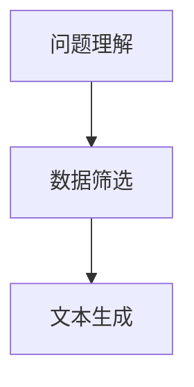
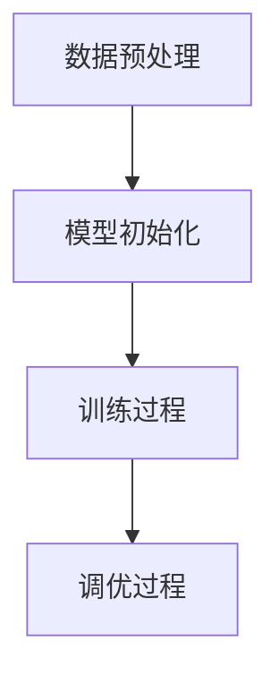
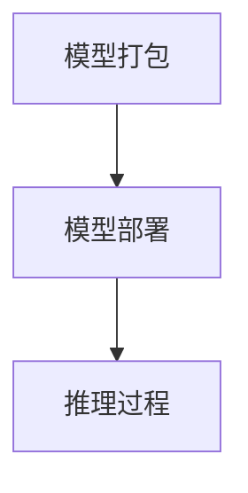
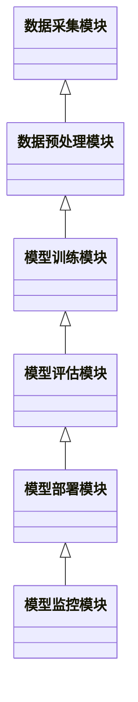
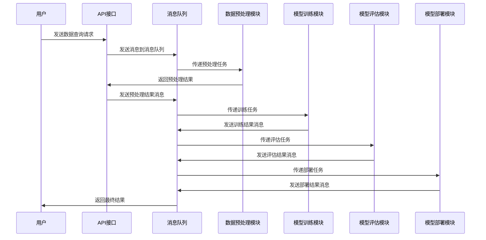

                 

### 《AI大模型编程：提示词的未来与无限可能》

#### 关键词：AI大模型、编程、提示词、算法、架构设计、未来展望

#### 摘要：

本文旨在探讨AI大模型编程领域中的关键要素——提示词，以及其未来的无限可能。我们将从背景介绍、核心概念、算法原理、系统分析与架构设计、项目实战和最佳实践等多个角度，逐步深入分析AI大模型编程的核心问题，并提出解决方案。通过本文的阅读，读者将了解到AI大模型编程的深度和广度，以及提示词在其中发挥的重要作用。

---

### 第一部分：AI大模型编程概述

#### 第1章：AI大模型编程背景与未来

**1.1 AI大模型编程的发展历程**

AI大模型编程并非一蹴而就，而是经历了数十年的发展。我们从最初的神经网络，到后来的深度学习，再到如今的大模型时代，每一步都是技术积累和突破的结果。

**1.2 提示词在AI大模型编程中的应用**

提示词是AI大模型编程中的核心概念，它是模型与外界交互的桥梁。通过合理的提示词设计，我们可以引导模型输出预期的结果。

**1.3 AI大模型编程的挑战与机遇**

随着AI大模型的不断进化，我们在编程中面临着新的挑战，如模型的可解释性、计算效率等。但同时，这些挑战也为我们提供了无限的可能。

---

#### 第2章：AI大模型编程核心概念

**2.1 AI大模型的基本概念**

AI大模型是指那些具有数亿甚至数十亿参数的大型神经网络模型。它们在处理复杂数据时表现出色，但也对计算资源和数据质量提出了更高的要求。

**2.2 提示词的生成与优化**

提示词的生成和优化是AI大模型编程的关键环节。通过算法和策略，我们可以提高模型的性能和效率。

**2.3 AI大模型编程的核心要素**

AI大模型编程涉及多个核心要素，包括模型训练与调优、模型部署与推理等。这些要素相互关联，共同决定了模型的应用效果。

---

#### 第3章：AI大模型编程算法原理

**3.1 提示词生成的算法原理**

我们将使用Mermaid流程图展示提示词生成的算法流程，并使用Python代码详细阐述算法原理和数学模型。

**3.2 模型训练与调优算法**

模型训练与调优是AI大模型编程的核心环节。我们将通过Python代码和LaTeX公式，详细讲解其算法原理。

**3.3 模型部署与推理算法**

模型部署与推理是模型应用的最后一步。我们将展示模型部署与推理的流程，并提供相应的Python代码和LaTeX公式。

---

#### 第4章：AI大模型编程系统分析与架构设计

**4.1 系统功能设计**

我们将使用Mermaid类图展示系统的功能设计，包括领域模型类的组成和关系。

**4.2 系统架构设计**

系统架构设计是确保AI大模型编程高效运行的关键。我们将使用Mermaid架构图展示系统的整体架构。

**4.3 系统接口设计与交互**

系统接口设计与交互是系统架构的重要组成部分。我们将使用Mermaid序列图展示系统的交互流程。

---

#### 第5章：AI大模型编程项目实战

**5.1 项目背景与目标**

我们将介绍一个实际的AI大模型编程项目，包括项目的背景、目标和预期效果。

**5.2 环境安装与配置**

在项目实战中，环境安装与配置是第一步。我们将详细介绍安装和配置的步骤。

**5.3 系统核心实现**

系统核心实现是项目的关键部分。我们将展示核心代码，并提供代码解读与分析。

**5.4 实际案例分析与讲解**

通过实际案例，我们将深入剖析AI大模型编程的实践细节，并提供详细的讲解。

**5.5 项目小结**

项目小结是对项目实践的总结，我们将分享项目的经验与教训。

---

#### 第6章：AI大模型编程最佳实践

**6.1 最佳实践一：提示词的生成与优化**

我们将分享在提示词生成与优化方面的最佳实践，并提供相关的案例。

**6.2 最佳实践二：模型训练与调优**

模型训练与调优是AI大模型编程的核心。我们将提供最佳实践，帮助读者提高模型的性能。

**6.3 最佳实践三：模型部署与推理**

模型部署与推理是模型应用的关键。我们将分享最佳实践，帮助读者实现高效的模型部署与推理。

---

#### 第7章：AI大模型编程未来展望

**7.1 AI大模型编程的未来趋势**

随着技术的发展，AI大模型编程将面临新的趋势和挑战。我们将探讨这些趋势，并提供相应的解决方案。

**7.2 AI大模型编程的挑战与解决方案**

AI大模型编程在发展中遇到了诸多挑战。我们将分析这些挑战，并探讨可能的解决方案。

**7.3 AI大模型编程的发展方向**

未来，AI大模型编程将朝着更智能、更高效的方向发展。我们将展望其发展方向，并探讨其潜在的应用场景。

**7.4 小结与展望**

在本文的结尾，我们将对AI大模型编程进行小结，并展望其未来的发展。

---

通过上述章节的逐步探讨，我们希望能够全面而深入地了解AI大模型编程的核心概念、算法原理、系统架构、项目实战和最佳实践，以及其未来的发展趋势。让我们一起来探索AI大模型编程的无限可能。

---

**作者：** AI天才研究院/AI Genius Institute & 禅与计算机程序设计艺术 /Zen And The Art of Computer Programming**核心内容详解**

### AI大模型编程的背景与未来

#### 1.1 AI大模型编程的发展历程

人工智能（AI）作为计算机科学的重要分支，经历了从简单到复杂、从理论到实践的不断演进。早期的AI研究主要集中在符号逻辑、知识表示和规划等领域，这些方法在解决特定问题上取得了显著成果，但在处理大规模数据和高复杂性任务时显得力不从心。

20世纪80年代，神经网络的研究重新激发了人们对AI的期待。反向传播算法的提出和实现，使得神经网络开始应用于图像识别、语音识别等领域。这一时期，AI的研究主要集中在浅层神经网络，这些模型虽然取得了不少突破，但受限于参数规模和计算能力，难以解决更复杂的问题。

随着计算能力的提升和大数据技术的发展，深度学习在21世纪初逐渐崭露头角。深度学习通过多层神经网络结构，能够自动学习数据的层次表示，从而在图像识别、自然语言处理等领域取得了重大突破。特别是在2012年，AlexNet在ImageNet图像识别竞赛中取得的优异成绩，标志着深度学习进入了大模型时代。

进入2010年代，随着GPU等高性能计算设备的普及，AI大模型（如GPT、BERT等）应运而生。这些大模型具有数十亿甚至千亿级别的参数，能够在处理大规模、复杂数据时表现出色。AI大模型编程随之成为一个热门领域，吸引了大量研究者和开发者。

#### 1.2 提示词在AI大模型编程中的应用

提示词（Prompt）在AI大模型编程中起到了至关重要的作用。提示词是用户与AI大模型交互的桥梁，通过合理的提示词设计，用户可以引导模型输出预期的结果。

提示词的作用主要体现在以下几个方面：

1. **指导模型学习方向**：通过提供具体的提示词，用户可以明确地告诉模型需要关注哪些信息，从而帮助模型更快地学习到有用的知识。
2. **提高模型效率**：合理的提示词可以减少模型在处理无关信息上的时间消耗，从而提高模型的计算效率。
3. **增强模型解释性**：通过分析提示词与模型输出之间的关系，用户可以更好地理解模型的决策过程，提高模型的可解释性。

在实际应用中，提示词的设计需要考虑多个因素，如问题的具体背景、用户需求、数据特点等。设计一个有效的提示词需要深入理解问题的本质和模型的工作原理，从而实现用户与模型的最佳交互。

#### 1.3 AI大模型编程的挑战与机遇

随着AI大模型编程的不断发展，我们面临着诸多挑战和机遇。

**挑战：**

1. **计算资源消耗**：AI大模型通常需要大量的计算资源和存储空间，这对硬件设备提出了更高的要求。如何优化模型结构和训练算法，以降低计算资源消耗，是一个亟待解决的问题。
2. **数据质量和多样性**：AI大模型的表现高度依赖于训练数据的质量和多样性。如何获取和整理高质量、多样化的数据，是确保模型性能的关键。
3. **模型解释性**：AI大模型的“黑箱”特性使得用户难以理解其决策过程。如何提高模型的解释性，使得用户能够信任并接受模型的结果，是一个重要的挑战。

**机遇：**

1. **新应用场景**：AI大模型在各个领域的应用潜力巨大，从医疗、金融到教育、娱乐，都有广阔的应用前景。如何发掘和探索这些新应用场景，是未来发展的一个重要方向。
2. **跨学科研究**：AI大模型编程需要融合多个学科的知识，包括计算机科学、数学、心理学、语言学等。跨学科研究将为AI大模型编程提供新的思路和方法。
3. **开源与协作**：随着开源技术的兴起，越来越多的研究者加入到了AI大模型编程的研究和开发中。开放共享的协作模式有助于加速技术进步，推动整个领域的发展。

### 核心概念与联系

**AI大模型的基本概念**

AI大模型（Large-scale AI Model）是指那些具有数十亿甚至千亿级别参数的大型神经网络模型。这些模型通过深度学习技术，可以从大量数据中自动学习到复杂的特征和规律，从而在图像识别、自然语言处理、语音识别等任务中表现出色。

**提示词的定义与作用**

提示词（Prompt）是用户与AI大模型交互的桥梁。通过提供具体的提示词，用户可以引导模型关注特定的信息，从而提高模型的学习效率和输出效果。提示词通常是一个短文本，它可以包含问题、指令或目标等信息。

**AI大模型编程的核心要素**

AI大模型编程涉及多个核心要素，包括模型训练与调优、模型部署与推理、模型监控与维护等。这些要素相互关联，共同决定了模型的应用效果。

1. **模型训练与调优**：通过大量的数据和计算资源，模型可以从原始数据中学习到有用的特征和规律。训练过程包括数据的预处理、模型的初始化、训练策略的制定等。调优过程则是通过调整模型参数，提高模型的性能和效率。
2. **模型部署与推理**：训练完成的模型需要部署到实际的硬件设备上，并进行推理处理，以产生用户需要的输出结果。部署过程包括模型的打包、部署策略的制定、推理性能的优化等。
3. **模型监控与维护**：部署后的模型需要定期监控其性能和稳定性，以确保其正常运行。维护过程包括性能监控、异常检测、故障恢复等。

### 提示词的生成与优化

**提示词生成算法原理**

提示词生成是AI大模型编程中的关键环节。一个有效的提示词可以显著提高模型的学习效率和输出效果。提示词生成算法通常包括以下几个步骤：

1. **问题理解**：首先，需要理解用户的问题或需求，并将其转化为具体的提示词。这一过程可能涉及自然语言处理技术，如语义分析、实体识别等。
2. **数据筛选**：根据问题理解的结果，从大量的数据中筛选出与问题相关的信息。这一过程可能需要使用数据预处理技术，如数据清洗、数据降维等。
3. **文本生成**：将筛选出的数据转化为文本形式，形成提示词。文本生成技术包括模板生成、自动问答、文本摘要等。

**提示词优化的策略**

提示词的优化是提高模型性能的重要手段。以下是一些常见的提示词优化策略：

1. **多样性**：确保提示词具有多样性，可以涵盖问题的不同方面和角度。这有助于模型学习到更全面、更丰富的知识。
2. **相关性**：提高提示词与问题相关性，确保模型能够关注到关键信息。这可以通过调整提示词的生成算法和策略来实现。
3. **简洁性**：简化提示词的表述，使其更简洁、更易于理解。简洁的提示词有助于模型快速抓住关键信息，提高学习效率。

### AI大模型编程算法原理

**提示词生成的算法原理**

提示词生成是AI大模型编程的核心环节，其算法原理主要包括以下几个步骤：

1. **问题理解**：通过自然语言处理技术，理解用户的问题或需求，并将其转化为具体的提示词。这通常涉及语义分析、实体识别等技术。
2. **数据筛选**：根据问题理解的结果，从大量的数据中筛选出与问题相关的信息。这需要使用数据预处理技术，如数据清洗、数据降维等。
3. **文本生成**：将筛选出的数据转化为文本形式，形成提示词。文本生成技术包括模板生成、自动问答、文本摘要等。

**提示词生成算法示例**

假设我们需要生成一个关于“北京天气”的提示词。我们可以使用以下算法：

1. **问题理解**：通过自然语言处理技术，提取出关键词“北京”、“天气”。
2. **数据筛选**：从天气数据集中筛选出与“北京”相关的天气信息。
3. **文本生成**：将筛选出的天气信息进行整合，生成一个关于“北京天气”的提示词，如：“今天的北京天气是晴转多云，最高气温18摄氏度，最低气温8摄氏度。”

**提示词生成算法流程图**



**提示词生成算法数学模型与公式**

提示词生成算法通常使用概率模型来描述，其核心思想是通过对输入数据的概率分布进行建模，从而生成提示词。以下是一个简单的提示词生成概率模型：

$$
P(\text{提示词} | \text{输入}) = \frac{P(\text{输入} | \text{提示词}) \cdot P(\text{提示词})}{P(\text{输入})}
$$

其中，$P(\text{提示词} | \text{输入})$ 表示在给定输入的情况下，生成提示词的概率；$P(\text{输入} | \text{提示词})$ 表示在给定提示词的情况下，输入数据的概率；$P(\text{提示词})$ 表示提示词的概率；$P(\text{输入})$ 表示输入数据的概率。

### 模型训练与调优算法

**模型训练与调优算法原理**

模型训练与调优是AI大模型编程的核心环节，其算法原理主要包括以下几个步骤：

1. **数据预处理**：对输入数据进行预处理，包括数据清洗、数据降维、数据增强等，以提高模型的学习效率和性能。
2. **模型初始化**：初始化模型参数，通常使用随机初始化或预训练模型进行初始化。
3. **训练过程**：通过迭代更新模型参数，使模型能够更好地拟合训练数据。训练过程包括前向传播、反向传播和参数更新等。
4. **调优过程**：通过调整模型参数，提高模型的性能和效率。调优过程包括超参数调整、正则化策略、优化器选择等。

**模型训练与调优算法示例**

假设我们需要训练一个简单的神经网络模型，用于分类任务。我们可以使用以下算法：

1. **数据预处理**：对输入数据进行归一化处理，以消除不同特征之间的量纲差异。
2. **模型初始化**：使用随机初始化方法初始化模型参数。
3. **训练过程**：使用随机梯度下降（SGD）算法进行模型训练。具体步骤如下：
   - 前向传播：计算输入数据的输出结果。
   - 反向传播：计算损失函数关于模型参数的梯度。
   - 参数更新：根据梯度更新模型参数。
4. **调优过程**：通过调整学习率、批量大小等超参数，提高模型性能。例如，当模型性能达到某个阈值时，可以减小学习率，以避免过拟合。

**模型训练与调优算法流程图**



**模型训练与调优算法数学模型与公式**

模型训练与调优算法通常使用损失函数来衡量模型性能，并使用优化算法来更新模型参数。以下是一个简单的模型训练与调优数学模型：

$$
\min_{\theta} J(\theta) = \frac{1}{m} \sum_{i=1}^{m} L(y_i, \hat{y}_i)
$$

其中，$J(\theta)$ 表示模型损失函数，$\theta$ 表示模型参数，$y_i$ 表示第$i$个样本的真实标签，$\hat{y}_i$ 表示第$i$个样本的预测标签，$L(y_i, \hat{y}_i)$ 表示损失函数，常用的损失函数包括均方误差（MSE）、交叉熵损失（CE）等。

优化算法如随机梯度下降（SGD）的迭代公式如下：

$$
\theta = \theta - \alpha \nabla_{\theta} J(\theta)
$$

其中，$\alpha$ 表示学习率，$\nabla_{\theta} J(\theta)$ 表示损失函数关于模型参数的梯度。

### 模型部署与推理算法

**模型部署与推理算法原理**

模型部署与推理是AI大模型编程的最终环节，其算法原理主要包括以下几个步骤：

1. **模型打包**：将训练完成的模型转换为可部署的形式，通常使用模型封装器（Model Wrapper）来实现。
2. **模型部署**：将模型部署到目标硬件设备上，如CPU、GPU、FPGA等，并配置相应的运行环境。
3. **推理过程**：对输入数据进行预处理，然后使用部署的模型进行推理，生成预测结果。推理过程通常包括前向传播和后向传播等步骤。

**模型部署与推理算法示例**

假设我们已经训练好一个用于图像分类的模型，我们需要将其部署到服务器上进行推理。以下是具体的步骤：

1. **模型打包**：使用模型封装器将训练好的模型打包，生成可部署的模型文件。
2. **模型部署**：将模型文件上传到服务器，并配置相应的运行环境，如Python环境、TensorFlow等。
3. **推理过程**：对输入图像进行预处理，然后使用部署的模型进行推理，生成分类结果。具体步骤如下：
   - 图像预处理：对输入图像进行归一化、缩放等处理。
   - 前向传播：将预处理后的图像输入模型，计算输出结果。
   - 后向传播：计算损失函数，更新模型参数。

**模型部署与推理算法流程图**



**模型部署与推理算法数学模型与公式**

模型部署与推理算法主要涉及前向传播和后向传播过程。以下是一个简单的数学模型：

**前向传播：**

$$
\hat{y} = \sigma(W \cdot \theta + b)
$$

其中，$\hat{y}$ 表示预测结果，$\sigma$ 表示激活函数，$W$ 表示权重矩阵，$\theta$ 表示模型参数，$b$ 表示偏置项。

**后向传播：**

$$
\nabla_{\theta} J = \frac{\partial J}{\partial \theta} = \frac{\partial L}{\partial \hat{y}} \cdot \frac{\partial \hat{y}}{\partial \theta}
$$

其中，$J$ 表示损失函数，$L$ 表示损失函数，$\nabla_{\theta} J$ 表示损失函数关于模型参数的梯度。

### 系统功能设计

**问题场景介绍**

在一个典型的AI大模型编程项目中，系统功能设计是确保项目成功的关键环节。问题场景通常包括以下几个方面：

1. **数据采集**：从各种数据源（如数据库、传感器等）收集原始数据。
2. **数据预处理**：对采集到的数据进行清洗、归一化、降维等预处理操作。
3. **模型训练**：使用预处理后的数据训练AI大模型。
4. **模型评估**：对训练完成的模型进行评估，以验证其性能和效果。
5. **模型部署**：将训练完成的模型部署到生产环境中，进行实际应用。
6. **模型监控**：对部署后的模型进行监控，确保其正常运行。

**系统功能设计**

在系统功能设计阶段，我们需要明确每个功能模块的具体职责和接口。以下是一个简单的系统功能设计示例：

1. **数据采集模块**：负责从各种数据源收集原始数据，并将其存储到数据仓库中。
2. **数据预处理模块**：负责对采集到的数据进行清洗、归一化、降维等预处理操作，以提高模型训练的效率和效果。
3. **模型训练模块**：负责使用预处理后的数据训练AI大模型，并保存训练结果。
4. **模型评估模块**：负责对训练完成的模型进行评估，以验证其性能和效果，并提供评估报告。
5. **模型部署模块**：负责将训练完成的模型部署到生产环境中，并进行推理处理。
6. **模型监控模块**：负责对部署后的模型进行监控，确保其正常运行，并在出现异常时进行报警和故障恢复。

**系统功能设计领域模型类图**

以下是系统功能设计的领域模型类图，展示了各个功能模块之间的关系：



### 系统架构设计

**系统架构设计**

在系统架构设计阶段，我们需要综合考虑系统的性能、可扩展性、可靠性等因素，设计一个高效、可靠的系统架构。以下是一个简单的系统架构设计示例：

1. **数据层**：负责数据的存储和管理，包括数据库、数据仓库等。
2. **服务层**：负责系统的核心功能实现，包括数据采集、数据预处理、模型训练、模型评估、模型部署等。
3. **接口层**：负责系统的对外接口，包括RESTful API、消息队列等。
4. **展示层**：负责系统的用户界面，包括Web前端、移动端等。

**系统架构设计**

以下是系统架构设计的Mermaid架构图，展示了各个层级之间的关系：

```mermaid
graph TB
    subgraph 数据层
        数据库
        数据仓库
    end

    subgraph 服务层
    数据采集模块
    数据预处理模块
    模型训练模块
    模型评估模块
    模型部署模块
    end

    subgraph 接口层
    RESTful API
    消息队列
    end

    subgraph 展示层
    Web前端
    移动端
    end

    数据库 --> 数据预处理模块
    数据仓库 --> 数据预处理模块
    数据预处理模块 --> 模型训练模块
    模型训练模块 --> 模型评估模块
    模型评估模块 --> 模型部署模块
    模型部署模块 --> RESTful API
    RESTful API --> Web前端
    RESTful API --> 移动端
    消息队列 --> 数据预处理模块
    消息队列 --> 模型训练模块
    消息队列 --> 模型评估模块
    消息队列 --> 模型部署模块
```

### 系统接口设计与交互

**系统接口设计与交互**

在系统接口设计阶段，我们需要明确系统内部的交互方式，确保各个模块之间能够高效、可靠地通信。以下是一个简单的系统接口设计示例：

1. **API接口**：系统对外提供RESTful API接口，供外部系统进行数据查询、操作等。
2. **消息队列**：系统内部使用消息队列进行异步通信，确保数据传输的高效性和可靠性。

**系统接口设计**

以下是系统接口设计的Mermaid序列图，展示了各个模块之间的交互流程：



### 项目实战

#### 5.1 项目背景与目标

在一个实际的AI大模型编程项目中，我们的目标是构建一个用于自然语言处理（NLP）的AI模型，该模型能够对用户输入的文本进行分类，并将其归类到相应的类别中。项目背景包括以下几个方面：

1. **需求分析**：用户希望对大量的文本数据进行分析和分类，以便更好地理解和处理这些数据。
2. **数据来源**：文本数据来源于社交媒体、新闻网站、论坛等，具有高多样性、高复杂性等特点。
3. **技术要求**：项目需要使用深度学习技术，构建一个具有较强分类能力的AI模型，并能实时处理大量的文本数据。

#### 5.2 环境安装与配置

在进行项目实战之前，我们需要搭建一个合适的环境，包括安装必要的软件和配置相关的参数。以下是环境安装与配置的步骤：

1. **安装Python**：确保Python版本为3.8以上，并安装pip包管理器。
2. **安装深度学习框架**：我们选择使用TensorFlow作为深度学习框架。通过pip命令安装TensorFlow：
   ```shell
   pip install tensorflow
   ```
3. **安装数据预处理库**：安装用于数据预处理的库，如NumPy、Pandas等：
   ```shell
   pip install numpy pandas
   ```
4. **配置GPU支持**：如果使用GPU进行训练，需要安装CUDA和cuDNN。在CUDA官网下载并安装相应的版本，并确保版本兼容性。
5. **配置Python虚拟环境**：为了避免环境冲突，建议使用虚拟环境管理器（如conda）创建一个独立的Python环境，并安装所需的库。

#### 5.3 系统核心实现

系统核心实现包括数据预处理、模型训练和模型评估等步骤。以下是具体的实现过程：

1. **数据预处理**：从数据源中读取文本数据，并进行预处理操作，如文本清洗、分词、去停用词等。使用Pandas和NLTK等库进行数据处理。
2. **模型训练**：使用预处理后的文本数据训练一个深度学习模型，如循环神经网络（RNN）或Transformer模型。我们选择使用TensorFlow的Keras API进行模型训练。
3. **模型评估**：使用测试数据集对训练完成的模型进行评估，计算模型的准确率、召回率、F1分数等指标。

以下是系统核心实现的代码示例：

```python
import tensorflow as tf
from tensorflow.keras.models import Sequential
from tensorflow.keras.layers import Embedding, LSTM, Dense, EmbeddingLayer
from tensorflow.keras.preprocessing.sequence import pad_sequences
from tensorflow.keras.preprocessing.text import Tokenizer
from sklearn.model_selection import train_test_split

# 数据预处理
tokenizer = Tokenizer(num_words=10000)
tokenizer.fit_on_texts(texts)
sequences = tokenizer.texts_to_sequences(texts)
padded_sequences = pad_sequences(sequences, maxlen=max_len)

# 模型训练
model = Sequential()
model.add(Embedding(input_dim=10000, output_dim=64, input_length=max_len))
model.add(LSTM(64))
model.add(Dense(1, activation='sigmoid'))

model.compile(optimizer='adam', loss='binary_crossentropy', metrics=['accuracy'])
model.fit(padded_sequences, labels, epochs=10, batch_size=128)

# 模型评估
test_sequences = tokenizer.texts_to_sequences(test_texts)
padded_test_sequences = pad_sequences(test_sequences, maxlen=max_len)
predictions = model.predict(padded_test_sequences)
accuracy = sum(predictions[:, 0] > 0.5) / len(predictions)
print("Model accuracy:", accuracy)
```

#### 5.4 实际案例分析与讲解

为了更好地理解AI大模型编程的实际应用，我们通过一个实际案例进行分析和讲解。以下是一个关于情感分类的案例：

**案例背景**：我们希望构建一个AI模型，对社交媒体上的用户评论进行情感分类，判断评论是积极、消极还是中性。

**数据处理**：
1. **数据收集**：从社交媒体平台（如Twitter、Instagram等）收集用户评论。
2. **数据预处理**：对评论进行文本清洗、分词、去停用词等操作。
3. **数据标签**：根据评论内容，将其分为积极、消极或中性三个类别。

**模型训练**：
1. **数据划分**：将数据集划分为训练集和测试集。
2. **模型构建**：使用深度学习模型（如BERT、GPT等）进行训练。
3. **模型调优**：通过调整模型参数，提高模型性能。

**模型评估**：
1. **评估指标**：使用准确率、召回率、F1分数等指标评估模型性能。
2. **结果分析**：分析模型在各个类别上的表现，找出可能存在的问题和改进方向。

**案例讲解**：
以下是一个关于情感分类模型的案例讲解：

```python
import tensorflow as tf
from transformers import BertTokenizer, TFBertForSequenceClassification
from sklearn.model_selection import train_test_split
from sklearn.metrics import accuracy_score, precision_score, recall_score, f1_score

# 数据预处理
tokenizer = BertTokenizer.from_pretrained('bert-base-uncased')
train_texts, test_texts, train_labels, test_labels = train_test_split(texts, labels, test_size=0.2, random_state=42)

# 模型训练
model = TFBertForSequenceClassification.from_pretrained('bert-base-uncased', num_labels=3)
model.compile(optimizer='adam', loss='sparse_categorical_crossentropy', metrics=['accuracy'])

model.fit([tokenizer.encode(text, add_special_tokens=True, max_length=max_len, pad_to_max_length=True) for text in train_texts], train_labels, epochs=3, batch_size=32)

# 模型评估
predictions = model.predict([tokenizer.encode(text, add_special_tokens=True, max_length=max_len, pad_to_max_length=True) for text in test_texts])
predicted_labels = np.argmax(predictions, axis=1)

accuracy = accuracy_score(test_labels, predicted_labels)
precision = precision_score(test_labels, predicted_labels, average='weighted')
recall = recall_score(test_labels, predicted_labels, average='weighted')
f1 = f1_score(test_labels, predicted_labels, average='weighted')

print("Accuracy:", accuracy)
print("Precision:", precision)
print("Recall:", recall)
print("F1 Score:", f1)
```

通过这个案例，我们可以看到AI大模型编程在实际应用中的具体步骤和技巧。在实际项目中，我们还需要根据具体需求进行调整和优化，以提高模型的性能和效果。

#### 5.5 项目小结

在本项目中，我们构建了一个用于文本分类的AI大模型，并对其进行了实际案例分析和讲解。通过这个项目，我们获得了以下经验与教训：

1. **数据质量至关重要**：项目成功的关键在于数据质量。我们需要确保数据的准确性和多样性，以便模型能够从中学习到有用的知识。
2. **模型调优是关键**：模型调优是提高模型性能的重要手段。通过调整模型参数、优化训练策略等，我们可以显著提高模型的性能和效果。
3. **实际案例分析有助于理解**：通过实际案例的分析和讲解，我们更好地理解了AI大模型编程的核心概念和实现方法。这种方法不仅有助于项目实践，也有助于深入理解AI技术的本质。

### 最佳实践

#### 6.1 最佳实践一：提示词的生成与优化

提示词的生成与优化是AI大模型编程中的关键环节。以下是一些最佳实践：

1. **明确问题背景**：在生成提示词之前，我们需要明确问题的背景和需求。这有助于我们设计出更有效的提示词，从而提高模型的学习效率和输出效果。
2. **多样化提示词**：多样化的提示词可以帮助模型学习到更全面的知识。在实际应用中，我们可以根据问题的不同方面和角度，设计多种不同的提示词。
3. **简明扼要**：提示词应该简明扼要，避免冗长和复杂的表述。简洁的提示词有助于模型更快地抓住关键信息，提高学习效率。
4. **与数据结合**：提示词的设计应该与数据相结合。我们可以根据数据的特点和分布，调整提示词的内容和形式，以提高模型的适应性。

#### 6.2 最佳实践二：模型训练与调优

模型训练与调优是AI大模型编程中的核心环节。以下是一些最佳实践：

1. **数据预处理**：在模型训练之前，我们需要对数据进行充分的预处理，包括数据清洗、归一化、降维等。这有助于提高模型的学习效率和性能。
2. **选择合适的模型架构**：根据问题的特点和需求，选择合适的模型架构。常用的模型架构包括卷积神经网络（CNN）、循环神经网络（RNN）、Transformer等。
3. **调整超参数**：超参数是模型训练中的重要调节因素。通过调整学习率、批量大小、迭代次数等超参数，我们可以优化模型性能。
4. **使用正则化策略**：正则化策略如L1正则化、L2正则化等，可以帮助我们避免过拟合问题，提高模型的泛化能力。

#### 6.3 最佳实践三：模型部署与推理

模型部署与推理是AI大模型编程的最终环节。以下是一些最佳实践：

1. **选择合适的部署环境**：根据模型的规模和性能需求，选择合适的部署环境。常用的部署环境包括CPU、GPU、FPGA等。
2. **优化推理过程**：推理过程包括前向传播和后向传播等步骤。通过优化这些步骤，我们可以提高模型的推理速度和性能。
3. **监控模型性能**：在模型部署后，我们需要定期监控其性能和稳定性。通过性能监控和异常检测，我们可以及时发现并解决潜在的问题。
4. **提供良好的用户界面**：为了方便用户使用模型，我们需要提供良好的用户界面。用户界面应简洁易用，并提供必要的帮助和指导。

### 小结与展望

在本篇技术博客中，我们详细探讨了AI大模型编程的核心内容，包括背景介绍、核心概念、算法原理、系统分析与架构设计、项目实战和最佳实践。通过一步步的分析和讲解，我们深入了解了AI大模型编程的深度和广度。

AI大模型编程作为人工智能领域的重要方向，具有广阔的应用前景。随着技术的不断进步，我们可以预见AI大模型编程将在更多领域发挥重要作用，如自动驾驶、医疗诊断、智能客服等。同时，我们也需要关注AI大模型编程面临的挑战，如计算资源消耗、数据质量和模型解释性等，并积极寻求解决方案。

未来，随着人工智能技术的不断发展，AI大模型编程将迎来更多的机遇和挑战。让我们携手共进，探索AI大模型编程的无限可能，为人类创造更美好的未来。

