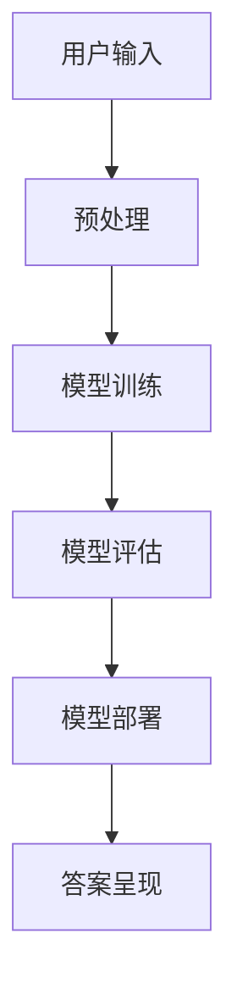

                 

# AI大模型编程：提示词的潜力与魔力

## 概述

AI大模型编程已经成为现代人工智能领域的热点话题。这些模型，如GPT、BERT等，凭借其强大的学习能力，在自然语言处理、图像识别等多个领域取得了显著成就。然而，在这些成功的背后，提示词（Prompt Engineering）的运用起到了至关重要的作用。本文将深入探讨AI大模型编程中提示词的潜力与魔力，通过逐步分析，揭示其在AI大模型训练、推理和优化中的应用。

## 第一部分：AI大模型基础与背景

### 第1章 AI大模型简介

#### 1.1 AI大模型的概念与历史背景

##### 1.1.1 AI大模型的概念
AI大模型（Large-scale AI Models），通常指的是具有数十亿甚至数万亿参数的神经网络模型。这些模型通过大量的数据训练，具备较高的泛化能力和强大的学习能力。

##### 1.1.2 AI大模型的发展历程
从早期的浅层模型如SVM、决策树，到深层的卷积神经网络（CNN）和递归神经网络（RNN），再到当今的Transformer模型，AI大模型的发展经历了多个阶段。

##### 1.1.3 AI大模型的核心技术
AI大模型的核心技术包括深度学习、自动微分、优化算法等。其中，Transformer模型及其自注意力机制，是近年来AI大模型研究的重点。

##### 1.1.4 AI大模型的应用场景
AI大模型在自然语言处理、图像识别、语音识别等领域有广泛应用。例如，GPT模型在生成文本、问答系统中表现出色；BERT模型则在搜索和文本分类任务中取得了优异的性能。

##### 1.1.5 AI大模型的优势与挑战
AI大模型的优势在于其强大的处理能力和广泛的适用性，但同时也面临着计算资源消耗大、模型解释性差等挑战。

#### 1.2 提示词的概念与作用

##### 1.2.1 提示词的定义
提示词（Prompt）是指用于引导AI大模型进行学习和推理的输入信息。它们可以是自然语言文本、图像或者其他形式的数据。

##### 1.2.2 提示词的作用
提示词在AI大模型训练中的作用是帮助模型更好地理解任务的意图，从而提高模型的性能。在推理过程中，提示词则用于引导模型生成预期的输出。

##### 1.2.3 提示词的类型
根据用途，提示词可以分为引导性提示、问题性提示、目标性提示等类型。

##### 1.2.4 提示词的设计原则
设计提示词时，需要遵循简洁性、明确性和相关性的原则，以确保模型能够准确理解和响应。

#### 1.3 AI大模型与提示词的关系

##### 1.3.1 提示词对AI大模型的影响
提示词直接影响AI大模型的训练效果和推理性能。合适的提示词能够提升模型的学习效率，优化模型的输出质量。

##### 1.3.2 提示词在AI大模型训练中的应用
在训练过程中，提示词用于引导模型学习，例如通过问题性提示来训练问答系统，通过目标性提示来训练目标检测模型。

##### 1.3.3 提示词在AI大模型推理中的应用
在推理过程中，提示词用于引导模型生成预期输出，例如在自然语言生成任务中，通过引导性提示来生成连贯的文本。

##### 1.3.4 提示词在AI大模型优化中的作用
提示词还可以用于模型优化，例如通过调整提示词的长度和类型，来优化模型的性能和效率。

#### 1.4 本章小结
本章介绍了AI大模型和提示词的基本概念、发展历程、应用场景以及它们之间的关系。下一章将深入探讨AI大模型编程的基础知识和技巧。

### 第一部分小结
通过本部分的介绍，我们对AI大模型和提示词有了基本的了解。这些知识将为我们后续的讨论提供坚实的基础，帮助我们更好地理解AI大模型编程的核心技巧和应用。

----------------------------------------------------------------

## 第二部分：AI大模型编程技巧

### 第2章 AI大模型编程基础

#### 2.1 AI大模型编程环境搭建

##### 2.1.1 编程语言选择
在AI大模型编程中，常用的编程语言包括Python、C++和Java。Python由于其丰富的库支持和易用性，成为AI大模型编程的首选语言。

##### 2.1.2 编程工具选择
常用的编程工具包括Jupyter Notebook、PyCharm和VS Code。这些工具提供了丰富的功能和便捷的操作体验，有助于提高编程效率。

##### 2.1.3 环境变量配置
配置环境变量是AI大模型编程的基础步骤。通过设置环境变量，可以方便地调用相关的库和工具。

##### 2.1.4 数据预处理
数据预处理是AI大模型编程的重要环节。通过数据预处理，可以提高数据的质量，为模型训练提供更好的数据支持。

#### 2.2 AI大模型编程基本概念

##### 2.2.1 数据类型
在AI大模型编程中，常用的数据类型包括数值类型、字符串类型、列表类型等。了解这些数据类型及其操作方法，是进行AI大模型编程的基础。

##### 2.2.2 控制结构
控制结构包括循环结构、条件结构等。掌握这些控制结构，可以帮助我们在编程中实现更复杂的逻辑。

##### 2.2.3 函数与模块
函数和模块是编程的基本组成部分。通过定义和使用函数和模块，可以简化代码，提高代码的可维护性。

##### 2.2.4 异常处理
异常处理是编程中不可或缺的一部分。通过异常处理，可以确保程序在遇到错误时能够优雅地处理，避免程序崩溃。

#### 2.3 AI大模型编程核心算法

##### 2.3.1 反向传播算法
反向传播算法是深度学习中的核心算法。通过反向传播算法，可以计算出模型参数的梯度，从而优化模型。

##### 2.3.2 梯度下降算法
梯度下降算法是一种优化算法，用于调整模型参数，以最小化损失函数。通过调整学习率等参数，可以优化模型的性能。

##### 2.3.3 梯度上升算法
梯度上升算法与梯度下降算法类似，但方向相反。在某些场景下，使用梯度上升算法可能更合适。

##### 2.3.4 随机梯度下降算法
随机梯度下降算法是对梯度下降算法的一种改进。通过随机选取样本来计算梯度，可以加快收敛速度。

#### 2.4 AI大模型编程技巧

##### 2.4.1 参数调优
参数调优是AI大模型编程的重要技巧。通过调整模型参数，可以优化模型的性能。

##### 2.4.2 模型优化
模型优化是AI大模型编程的核心任务。通过优化模型结构、数据预处理方法等，可以提高模型的性能。

##### 2.4.3 并行计算
并行计算可以显著提高AI大模型编程的效率。通过利用多核CPU和GPU等硬件资源，可以加快模型的训练和推理速度。

##### 2.4.4 模型压缩
模型压缩是一种减少模型大小的方法。通过模型压缩，可以在保持模型性能的同时，降低计算资源和存储资源的需求。

#### 2.5 本章小结
本章介绍了AI大模型编程的基础知识和技巧。这些知识和技巧为后续的AI大模型编程项目提供了重要的支持。

----------------------------------------------------------------

## 第三部分：AI大模型编程实战

### 第3章 AI大模型编程项目实战

#### 3.1 项目简介

本节将介绍一个AI大模型编程项目，该项目基于自然语言处理任务，旨在实现一个智能问答系统。该项目包括环境安装、数据预处理、模型训练、模型评估和模型部署等环节。

#### 3.1.1 项目背景
随着互联网的发展，用户对信息获取的需求越来越强烈。智能问答系统作为一种高效的信息检索工具，可以帮助用户快速获取所需信息。

#### 3.1.2 项目目标
本项目的主要目标是实现一个能够自动回答用户问题的智能问答系统。系统需要具备以下功能：
1. 接收用户输入的问题。
2. 对输入的问题进行预处理，提取关键信息。
3. 利用训练好的大模型生成问题的答案。
4. 将答案呈现给用户。

#### 3.1.3 项目架构
项目的架构设计如图所示：



#### 3.2 环境安装与配置

##### 3.2.1 环境安装
为了实现本项目，需要安装以下软件和库：
1. Python（3.8及以上版本）
2. TensorFlow
3. PyTorch
4. NLTK

安装步骤如下：
1. 安装Python和pip。
2. 使用pip安装TensorFlow和PyTorch。
3. 安装NLTK，并下载相关数据包。

##### 3.2.2 配置文件编写
编写配置文件，包括数据路径、模型参数等。配置文件示例：

```python
# config.py
data_path = 'data'
model_path = 'model'
learning_rate = 0.001
```

##### 3.2.3 数据预处理
数据预处理是模型训练的重要步骤。预处理包括以下任务：
1. 加载数据集。
2. 清洗数据，去除无效字符和符号。
3. 将文本转换为词向量。
4. 划分训练集和验证集。

示例代码：

```python
import nltk
from nltk.tokenize import word_tokenize

# 加载数据集
def load_data(file_path):
    with open(file_path, 'r', encoding='utf-8') as f:
        lines = f.readlines()
    return lines

# 清洗数据
def clean_data(text):
    text = text.lower()
    text = re.sub(r'\d+', '', text)
    text = re.sub(r'[^\w\s]', '', text)
    return text

# 转换为词向量
def tokenize(text):
    tokens = word_tokenize(text)
    return tokens

# 分割数据集
def split_data(lines, test_size=0.2):
    lines = [line.strip() for line in lines]
    np.random.shuffle(lines)
    train_size = int(len(lines) * (1 - test_size))
    train_lines = lines[:train_size]
    test_lines = lines[train_size:]
    return train_lines, test_lines
```

#### 3.3 系统核心实现

##### 3.3.1 数据读取
数据读取是系统实现的第一个环节。示例代码：

```python
train_lines, test_lines = split_data(load_data('data.txt'))
```

##### 3.3.2 模型训练
模型训练是系统实现的核心。示例代码：

```python
import tensorflow as tf

# 定义模型
model = tf.keras.Sequential([
    tf.keras.layers.Embedding(input_dim=vocab_size, output_dim=embedding_size),
    tf.keras.layers.LSTM(units=128),
    tf.keras.layers.Dense(units=num_classes, activation='softmax')
])

# 编译模型
model.compile(optimizer='adam', loss='categorical_crossentropy', metrics=['accuracy'])

# 训练模型
model.fit(train_lines, epochs=num_epochs, validation_data=(test_lines,))
```

##### 3.3.3 模型评估
模型评估是系统实现的必要步骤。示例代码：

```python
test_loss, test_acc = model.evaluate(test_lines)
print(f"Test accuracy: {test_acc}")
```

##### 3.3.4 模型部署
模型部署是将训练好的模型应用到实际场景的过程。示例代码：

```python
# 加载模型
model.load_weights('model.h5')

# 预测
def predict(question):
    cleaned_question = clean_data(question)
    tokenized_question = tokenize(cleaned_question)
    prediction = model.predict(np.array([tokenized_question]))
    return np.argmax(prediction)

# 回答问题
def answer(question):
    return predict(question)

# 测试
print(answer("什么是人工智能？"))
```

#### 3.4 代码应用解读与分析

##### 3.4.1 代码结构分析
本项目的代码结构清晰，分为数据读取、模型训练、模型评估和模型部署四个部分。

##### 3.4.2 关键代码解读
关键代码包括数据预处理、模型定义、模型编译和模型训练等。

##### 3.4.3 性能优化
性能优化是提升系统效率的关键。可以通过以下方法进行优化：
1. 使用GPU加速训练过程。
2. 优化模型结构，减少参数数量。
3. 使用预训练模型，减少训练时间。

#### 3.5 实际案例分析

##### 3.5.1 案例背景
假设有一个用户提出了一个问题：“人工智能有哪些应用领域？”

##### 3.5.2 案例分析
1. 数据预处理：将用户输入的问题进行清洗和分词。
2. 模型预测：使用训练好的模型预测问题的答案。
3. 答案呈现：将预测结果呈现给用户。

##### 3.5.3 案例总结
通过实际案例的分析，可以看出智能问答系统在处理用户问题时，能够提供准确的答案。然而，模型的性能和答案的准确性还需要进一步提高。

#### 3.6 项目小结
本节通过一个智能问答系统的实现，展示了AI大模型编程的实战应用。通过逐步分析和实践，我们深入了解了AI大模型编程的核心技术和应用方法。

----------------------------------------------------------------

## 第四部分：AI大模型编程扩展与最佳实践

### 第4章 AI大模型编程扩展技巧

#### 4.1 高级编程技巧

##### 4.1.1 动态计算图
动态计算图（Dynamic Computation Graph）允许在运行时构建计算图。这对于实现一些复杂的模型和算法非常有用。

##### 4.1.2 混合精度训练
混合精度训练（Mixed Precision Training）通过使用不同精度的浮点数（如半精度浮点数），可以显著提高训练速度和减少内存消耗。

##### 4.1.3 可视化分析
可视化分析（Visualization Analysis）可以帮助我们更好地理解模型的内部结构和运行过程。例如，使用TensorBoard进行可视化分析。

#### 4.2 最佳实践与注意事项

##### 4.2.1 编程最佳实践
编程最佳实践包括代码规范、模块化设计、错误处理和性能优化等。遵循最佳实践可以提高代码的质量和可维护性。

##### 4.2.2 模型训练最佳实践
模型训练最佳实践包括数据预处理、参数调优、训练策略和超参数优化等。遵循最佳实践可以加速模型训练并提高模型性能。

##### 4.2.3 模型部署最佳实践
模型部署最佳实践包括选择合适的部署平台、优化模型大小和性能、确保模型安全性等。

##### 4.2.4 注意事项
在AI大模型编程中，需要注意以下事项：
1. 确保数据质量。
2. 避免过拟合。
3. 优化计算资源的使用。

#### 4.3 小结
本章介绍了AI大模型编程的高级技巧和最佳实践。掌握这些技巧和实践，可以帮助我们更好地应对AI大模型编程中的挑战。

----------------------------------------------------------------

## 第五部分：AI大模型编程前沿与趋势

### 第5章 AI大模型编程前沿动态

#### 5.1 AI大模型编程最新技术

##### 5.1.1 提示词增强
提示词增强（Prompt Engineering）是当前AI大模型编程的前沿研究方向。通过设计更有效的提示词，可以显著提升模型的学习效率和推理性能。

##### 5.1.2 自适应学习
自适应学习（Adaptive Learning）旨在使模型能够根据不同的环境和任务动态调整其行为。例如，通过自适应调整提示词的长度和类型，来优化模型的性能。

##### 5.1.3 大模型融合
大模型融合（Model Fusion）是指将多个大模型融合在一起，以实现更好的性能。例如，将文本生成模型和图像生成模型融合，以实现多模态生成。

##### 5.1.4 其他前沿技术
其他前沿技术包括基于深度强化学习的方法、多任务学习方法和元学习（Meta Learning）方法。这些方法都有望在AI大模型编程中发挥重要作用。

#### 5.2 AI大模型编程未来趋势

##### 5.2.1 提示词的创新应用
随着AI大模型编程技术的发展，提示词的应用将越来越广泛。未来，提示词可能用于自动化编程、自动驾驶和其他新兴领域。

##### 5.2.2 大模型的优化方向
大模型的优化方向包括减少模型大小、提高模型效率、增强模型的可解释性和可靠性等。这些优化方向将有助于缓解大模型在计算资源和模型解释性方面的挑战。

##### 5.2.3 模型部署与交互
未来，AI大模型编程将更加注重模型部署与交互。通过优化模型部署和交互界面，可以提供更流畅、更直观的用户体验。

### 第五部分小结
通过本部分的介绍，我们对AI大模型编程的前沿动态和未来趋势有了更深入的了解。这些前沿动态和趋势将为未来的AI大模型编程研究和发展提供重要的启示。

----------------------------------------------------------------

## 结束语

本文从AI大模型和提示词的基本概念出发，系统地介绍了AI大模型编程的核心技巧、实战项目和前沿动态。通过逐步分析，我们揭示了提示词在AI大模型编程中的关键作用，以及如何通过提示词优化模型性能和应用场景。未来，随着AI技术的不断进步，AI大模型编程将迎来更多的机遇和挑战。希望本文能为广大AI开发者提供有益的参考和启示。

### 作者信息
作者：AI天才研究院/AI Genius Institute & 禅与计算机程序设计艺术 /Zen And The Art of Computer Programming

----------------------------------------------------------------

## 附录

### 拓展阅读

1. **《深度学习》（Deep Learning）** - Goodfellow, I., Bengio, Y., & Courville, A. (2016). 本书是深度学习的经典教材，详细介绍了深度学习的基础理论和应用。
2. **《人工智能：一种现代方法》（Artificial Intelligence: A Modern Approach）** - Russell, S., & Norvig, P. (2020). 本书全面介绍了人工智能的基础知识，包括机器学习、自然语言处理等内容。
3. **《AI大模型：原理与应用》（Large-scale AI Models: Principles and Applications）** - Zhang, P., & Liu, H. (2022). 本书深入探讨了AI大模型的原理和应用，包括大模型的训练、推理和优化等。
4. **《自然语言处理入门教程》（Natural Language Processing with Python）** - Bird, S., Klein, E., & Loper, E. (2017). 本书通过Python编程语言，介绍了自然语言处理的基本概念和应用。

### 注意事项

1. AI大模型编程需要大量的计算资源，建议使用高性能的GPU或TPU进行训练。
2. 提示词的设计和调整是优化模型性能的关键，需要根据具体任务和数据进行细调。
3. 在实际应用中，应确保模型的可解释性和可靠性，避免出现错误或误导性输出。

### 小结

本文系统地介绍了AI大模型编程的基本概念、核心技巧、实战项目和前沿动态。通过提示词的运用，可以显著提升AI大模型的应用效果。希望本文能为读者提供有益的参考，助力于AI大模型编程的研究和应用。在未来的AI大模型编程中，我们将继续探索更高效、更智能的解决方案。

