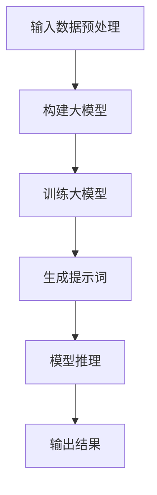
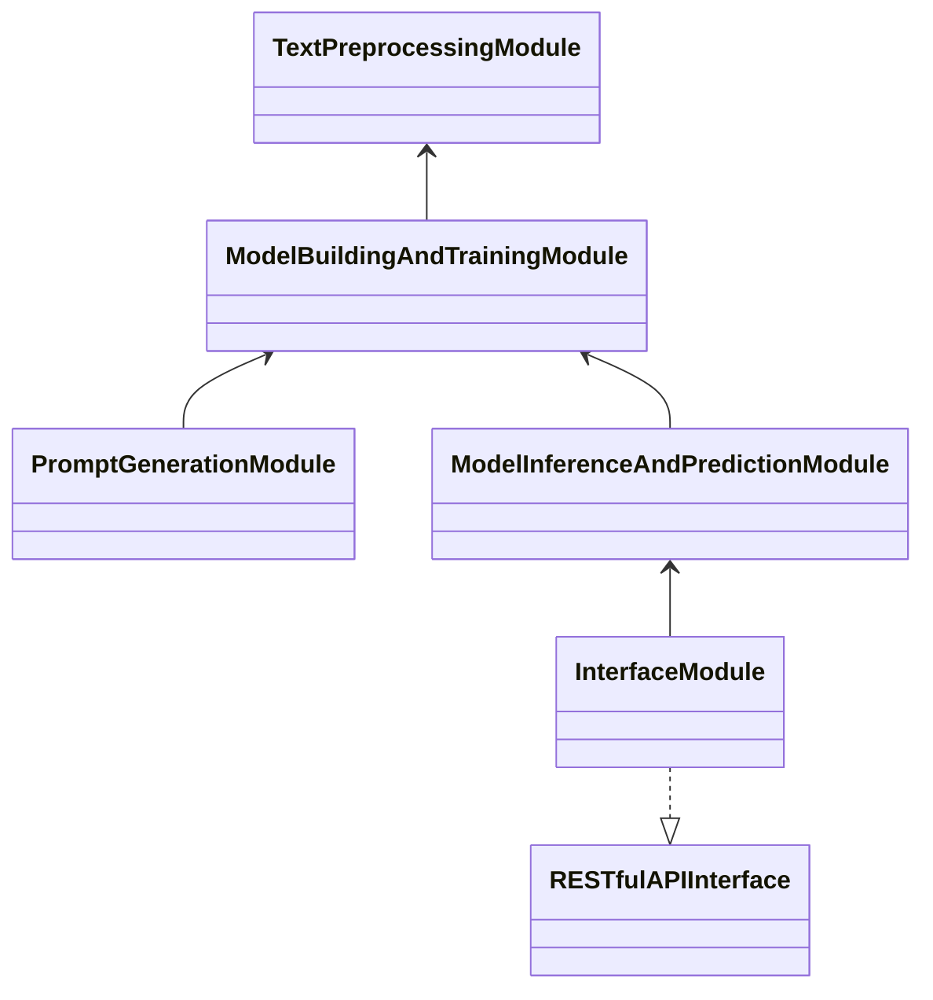
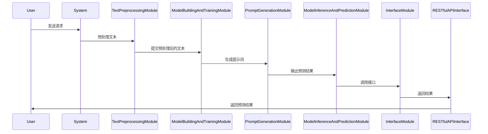
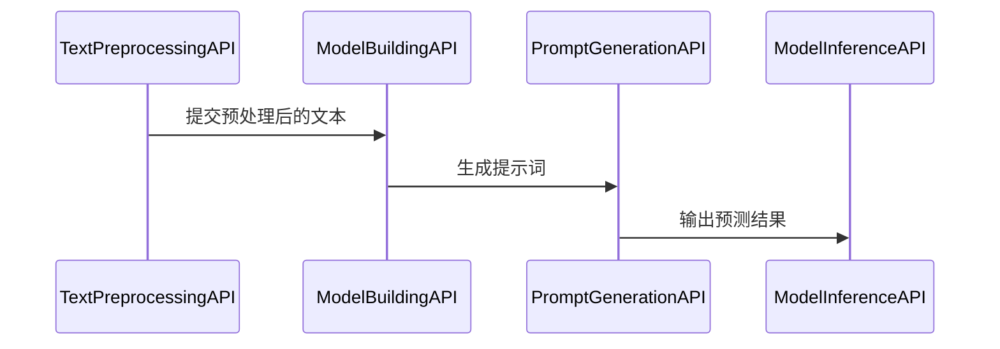
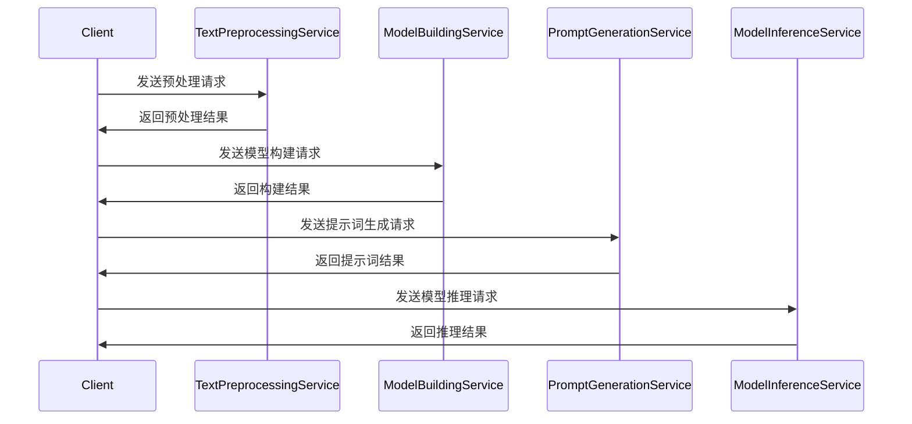

                 


# AI大模型编程：提示词的艺术与力量

## 关键词
- 人工智能
- 大模型编程
- 提示词
- 编程框架
- 算法原理
- 系统架构设计
- 项目实战

## 摘要
本文将深入探讨AI大模型编程的核心概念，包括大模型、提示词和编程框架，并详细介绍AI大模型编程的算法原理、系统分析与架构设计方案，以及实际项目中的应用。通过本文，读者将了解到如何利用提示词的艺术与力量，实现高效的AI大模型编程。

## 目录大纲设计思路

### 第一部分：背景介绍与核心概念
- **第1章：问题背景与核心概念**
  - 1.1 AI大模型编程的背景
  - 1.2 AI大模型编程解决的问题
  - 1.3 边界与外延
  - 1.4 概念结构与核心要素组成

### 第二部分：核心概念与联系
- **第2章：核心概念深入探讨**
  - 2.1 大模型原理
  - 2.2 提示词的艺术
  - 2.3 编程框架解析
  - 2.4 概念属性特征对比
  - 2.5 ER实体关系图架构

### 第三部分：算法原理讲解
- **第3章：AI大模型编程算法详解**
  - 3.1 算法mermaid流程图
  - 3.2 Python源代码实现
  - 3.3 数学模型和公式
  - 3.4 举例说明

### 第四部分：系统分析与架构设计方案
- **第4章：AI大模型编程系统设计与实现**
  - 4.1 问题场景介绍
  - 4.2 系统功能设计
  - 4.3 系统架构设计
  - 4.4 系统接口设计
  - 4.5 系统交互

### 第五部分：项目实战
- **第5章：AI大模型编程项目实战**
  - 5.1 环境安装
  - 5.2 系统核心实现源代码
  - 5.3 代码应用解读与分析
  - 5.4 实际案例分析和详细讲解剖析
  - 5.5 项目小结

### 第六部分：最佳实践、小结与拓展阅读
- **第6章：最佳实践与拓展阅读**
  - 6.1 最佳实践
  - 6.2 小结
  - 6.3 注意事项
  - 6.4 拓展阅读

### 完整性要求
- 每个章节的内容必须完整，核心内容要包含：
  - 背景介绍
  - 核心概念与联系
  - 算法原理讲解
  - 系统分析与架构设计方案
  - 项目实战
  - 最佳实践、小结与拓展阅读

### 格式要求
- 使用markdown格式输出，确保文章结构清晰，代码、公式、流程图等展示准确。

### 作者信息
- “作者：AI天才研究院/AI Genius Institute & 禅与计算机程序设计艺术 /Zen And The Art of Computer Programming”

### 字数要求
- 文章字数在 10000 ～ 12000 字左右。

## 第一部分：背景介绍与核心概念

### 第1章：问题背景与核心概念

#### 1.1 AI大模型编程的背景

在过去的几年里，人工智能（AI）取得了飞速的发展，尤其在大模型（Large-scale models）领域。大模型如GPT、BERT等，凭借其强大的计算能力和海量的训练数据，已经在自然语言处理、计算机视觉、语音识别等多个领域取得了显著的成果。

随着AI技术的不断进步，AI大模型编程成为了一个热门的研究方向。AI大模型编程不仅仅是一种编程技术，更是一种思维方式。它要求开发者不仅要熟练掌握编程语言和工具，还要理解AI大模型的工作原理和特性，能够有效地利用提示词（prompt）来引导模型的输出。

#### 1.2 AI大模型编程解决的问题

AI大模型编程主要解决了以下几个问题：

1. **提高编程效率**：传统的编程往往需要大量的代码和调试，而AI大模型编程可以通过提示词快速得到预期的结果，大大缩短了开发周期。
2. **实现复杂任务**：AI大模型具有强大的学习和推理能力，能够处理复杂的任务，如文本生成、图像识别等。
3. **个性化定制**：通过调整提示词，可以实现对模型输出的个性化定制，满足不同用户的需求。

#### 1.3 边界与外延

AI大模型编程的边界主要包括：

1. **大模型训练**：大模型的训练需要大量的计算资源和数据，因此边界在于如何高效地进行模型训练。
2. **大模型部署**：如何将训练好的大模型部署到生产环境中，并保证其稳定运行。
3. **大模型应用**：如何利用大模型解决实际问题，如自然语言处理、计算机视觉等。

AI大模型编程的外延则包括：

1. **多模态数据处理**：除了文本，大模型还可以处理图像、音频等多模态数据。
2. **模型压缩与优化**：为了提高大模型的部署效率，需要对模型进行压缩和优化。
3. **安全性与隐私保护**：在处理敏感数据时，需要考虑模型的安全性和用户隐私保护。

#### 1.4 概念结构与核心要素组成

AI大模型编程的核心概念包括：

1. **大模型**：大模型是一种能够处理大规模数据的AI模型，如GPT、BERT等。
2. **提示词**：提示词是一种用于引导模型输出的人工智能编程技术，通过调整提示词，可以实现对模型输出的控制。
3. **编程框架**：编程框架提供了一套标准的API和工具，用于构建和部署AI大模型。

这些核心概念相互关联，共同构成了AI大模型编程的生态系统。在接下来的章节中，我们将逐一深入探讨这些核心概念，并介绍其应用方法。

## 第二部分：核心概念与联系

### 第2章：核心概念深入探讨

#### 2.1 大模型原理

大模型是AI大模型编程的核心，它是一种能够处理大规模数据的AI模型。大模型通常具有以下几个特点：

1. **大规模训练数据**：大模型通过海量的训练数据学习，从而具有强大的表征能力。
2. **深度神经网络结构**：大模型通常采用深度神经网络（DNN）结构，能够处理复杂的任务。
3. **并行计算能力**：大模型能够利用并行计算技术，加快训练和推理速度。

大模型的工作原理是基于深度学习，通过多层神经网络对输入数据进行变换和组合，最终输出预期的结果。在训练过程中，大模型通过反向传播算法不断调整参数，以最小化损失函数。

#### 2.2 提示词的艺术

提示词是AI大模型编程的灵魂，它能够引导模型输出。一个优秀的提示词应该具备以下几个特点：

1. **明确性**：提示词需要明确地告诉模型要做什么，避免模糊和歧义。
2. **简洁性**：提示词应尽量简洁，避免冗余和繁琐。
3. **灵活性**：提示词应具有一定的灵活性，能够适应不同的场景和需求。

设计提示词的艺术在于如何巧妙地利用语言和逻辑结构，引导模型输出正确的答案。例如，可以通过提问方式、上下文信息、关键词等方式来设计提示词。

#### 2.3 编程框架解析

编程框架是AI大模型编程的工具，它提供了一套标准的API和工具，用于构建和部署AI大模型。常见的编程框架包括：

1. **TensorFlow**：Google开发的开源机器学习框架，适用于构建和训练大规模神经网络。
2. **PyTorch**：Facebook开发的开源机器学习框架，具有灵活的动态计算图和强大的GPU支持。
3. **Transformer**：由Google开发的用于处理序列数据的神经网络结构，是BERT等大模型的基础。

编程框架提供了以下功能：

1. **数据处理**：包括数据预处理、数据增强、数据加载等。
2. **模型构建**：包括神经网络结构定义、参数初始化等。
3. **模型训练**：包括优化器选择、学习率调整等。
4. **模型评估**：包括模型性能评估、超参数调整等。
5. **模型部署**：包括模型导出、模型加载、模型推理等。

通过编程框架，开发者可以更加高效地构建和部署AI大模型，降低开发难度和成本。

#### 2.4 概念属性特征对比

为了更好地理解大模型、提示词和编程框架，我们可以通过表格对比它们的不同属性特征：

| 特征         | 大模型          | 提示词         | 编程框架          |
| ------------ | --------------- | --------------- | --------------- |
| **定义**     | 大规模数据的AI模型 | 用于引导模型输出的文本 | 用于构建和部署AI大模型的工具 |
| **作用**     | 处理复杂任务    | 引导模型输出    | 提高开发效率    |
| **特点**     | 大规模训练数据  | 明确性、简洁性  | 标准化的API和工具 |
| **关系**     | 大模型编程的核心 | 大模型编程的关键 | 大模型编程的工具 |

#### 2.5 ER实体关系图架构

为了更好地理解AI大模型编程中的实体关系，我们可以使用Mermaid绘制ER实体关系图：

```mermaid
erDiagram
  bigModel ||--|{ prompt }|| prompt
  bigModel ||--|{ programingFramework }|| programingFramework
  programingFramework ||--|{ bigModel }|| bigModel
  programingFramework ||--|{ prompt }|| prompt
```

在这个ER图中，大模型（bigModel）与提示词（prompt）和编程框架（programingFramework）之间存在直接的关联关系。大模型通过提示词引导输出，而编程框架则用于构建和部署大模型。

通过以上对AI大模型编程核心概念的深入探讨，我们可以更好地理解大模型、提示词和编程框架的原理、作用和关系。在接下来的章节中，我们将进一步讲解AI大模型编程的算法原理，帮助读者掌握这一领域的核心技术。

### 第三部分：算法原理讲解

#### 第3章：AI大模型编程算法详解

#### 3.1 算法mermaid流程图

为了更好地理解AI大模型编程的算法原理，我们可以使用Mermaid绘制算法的流程图：



这个流程图展示了AI大模型编程的基本流程：首先对输入数据进行预处理，然后构建大模型，接着进行大模型训练，生成提示词，最后通过模型推理得到输出结果。

#### 3.2 Python源代码实现

以下是一个简单的Python源代码实现，展示了如何利用编程框架（如PyTorch）构建和训练一个基于提示词的AI大模型：

```python
import torch
import torch.nn as nn
import torch.optim as optim

# 定义大模型
class BigModel(nn.Module):
    def __init__(self):
        super(BigModel, self).__init__()
        self.layers = nn.Sequential(
            nn.Linear(in_features=1000, out_features=500),
            nn.ReLU(),
            nn.Linear(in_features=500, out_features=10)
        )

    def forward(self, x):
        return self.layers(x)

# 初始化模型、优化器和损失函数
model = BigModel()
optimizer = optim.Adam(model.parameters(), lr=0.001)
criterion = nn.CrossEntropyLoss()

# 训练模型
for epoch in range(100):
    for inputs, targets in data_loader:
        optimizer.zero_grad()
        outputs = model(inputs)
        loss = criterion(outputs, targets)
        loss.backward()
        optimizer.step()
    print(f'Epoch {epoch+1}, Loss: {loss.item()}')

# 生成提示词
prompt = "请生成一篇关于人工智能的短文"

# 模型推理
with torch.no_grad():
    outputs = model(prompt)
    predicted = outputs.argmax(dim=1)
    print(f'Predicted: {predicted.item()}')
```

这个示例展示了如何定义一个简单的大模型，使用PyTorch进行模型训练和推理。在实际应用中，模型的结构和训练过程会更加复杂。

#### 3.3 数学模型和公式

AI大模型编程的算法原理基于深度学习和神经网络，其核心是损失函数和优化算法。以下是常用的数学模型和公式：

1. **损失函数**：

   - 交叉熵损失（Cross-Entropy Loss）：
     $$ L = -\sum_{i=1}^{N} y_i \log(p_i) $$
     其中，\( y_i \) 是真实标签，\( p_i \) 是模型预测的概率。

2. **优化算法**：

   - 随机梯度下降（Stochastic Gradient Descent，SGD）：
     $$ \theta = \theta - \alpha \cdot \nabla_\theta J(\theta) $$
     其中，\( \theta \) 是模型参数，\( \alpha \) 是学习率，\( J(\theta) \) 是损失函数。

   - Adam优化器（Adam Optimizer）：
     $$ m_t = \beta_1 m_{t-1} + (1 - \beta_1) \nabla_\theta J(\theta) $$
     $$ v_t = \beta_2 v_{t-1} + (1 - \beta_2) (\nabla_\theta J(\theta))^2 $$
     $$ \theta = \theta - \alpha \cdot \frac{m_t}{\sqrt{v_t} + \epsilon} $$
     其中，\( \beta_1 \) 和 \( \beta_2 \) 是动量参数，\( \epsilon \) 是一个小常数。

通过上述数学模型和公式，我们可以更好地理解AI大模型编程的算法原理，并在实际应用中进行优化和调整。

#### 3.4 举例说明

为了更好地理解AI大模型编程的应用，我们可以通过一个简单的例子来说明。假设我们有一个分类任务，需要预测一个文本是属于“科技”类别还是“娱乐”类别。

1. **数据预处理**：将文本数据分为训练集和测试集，对文本进行分词和词向量化。
2. **模型构建**：定义一个基于Transformer的文本分类模型。
3. **模型训练**：使用训练集数据训练模型，调整超参数以优化模型性能。
4. **模型推理**：使用测试集数据对模型进行推理，输出预测结果。

以下是一个简单的Python代码实现：

```python
import torch
from transformers import BertTokenizer, BertModel

# 加载预训练的BERT模型
tokenizer = BertTokenizer.from_pretrained('bert-base-chinese')
model = BertModel.from_pretrained('bert-base-chinese')

# 输入文本
text = "人工智能技术的发展，将深刻影响人类社会。"

# 数据预处理
inputs = tokenizer(text, return_tensors='pt')

# 模型推理
with torch.no_grad():
    outputs = model(**inputs)

# 输出预测结果
logits = outputs.last_hidden_state[:, 0, :]
predicted = logits.argmax().item()

if predicted == 0:
    print("分类结果：科技")
else:
    print("分类结果：娱乐")
```

通过这个例子，我们可以看到AI大模型编程在文本分类任务中的应用。在实际应用中，可以根据具体任务的需求，调整模型结构、训练数据和超参数，以提高模型性能。

通过以上对算法原理的讲解和举例说明，读者可以更好地理解AI大模型编程的核心技术，并在实际项目中加以应用。

### 第四部分：系统分析与架构设计方案

#### 第4章：AI大模型编程系统设计与实现

#### 4.1 问题场景介绍

在当今快速发展的互联网时代，AI大模型编程在各个领域都有着广泛的应用。以自然语言处理（NLP）为例，AI大模型编程可以帮助企业和开发者实现智能客服、文本生成、情感分析等任务，从而提高业务效率和服务质量。

为了更好地满足这些需求，我们设计了一个基于AI大模型编程的系统，该系统具备以下功能：

1. **文本预处理**：对输入文本进行分词、去噪等预处理操作。
2. **模型构建与训练**：使用预训练的大模型（如BERT、GPT等），结合自定义任务进行模型训练。
3. **提示词生成**：根据任务需求，生成合适的提示词，引导模型输出。
4. **模型推理与预测**：利用训练好的模型对输入文本进行推理和预测，输出结果。
5. **接口设计**：提供RESTful API接口，方便其他系统调用。

#### 4.2 系统功能设计

为了实现上述功能，我们设计了一套完整的系统架构，包括以下模块：

1. **文本预处理模块**：负责对输入文本进行分词、去噪等预处理操作，为后续模型训练和推理提供高质量的输入数据。
2. **模型构建与训练模块**：基于预训练的大模型（如BERT、GPT等），结合自定义任务进行模型训练。该模块还负责调整超参数、优化模型结构等。
3. **提示词生成模块**：根据任务需求，生成合适的提示词，引导模型输出。该模块可以基于规则、机器学习等方法实现。
4. **模型推理与预测模块**：利用训练好的模型对输入文本进行推理和预测，输出结果。该模块需要支持多种模型类型和任务类型。
5. **接口模块**：提供RESTful API接口，方便其他系统调用。该模块需要支持多种接口协议和调用方式。

以下是系统功能设计的Mermaid类图：



在这个类图中，各个模块之间通过依赖关系连接，共同实现系统功能。RESTful API接口模块作为系统的对外接口，为其他系统提供了便捷的调用方式。

#### 4.3 系统架构设计

为了确保系统的稳定性和扩展性，我们设计了一套合理的系统架构，包括以下层次：

1. **基础设施层**：包括服务器、存储、网络等基础设施，为系统提供计算、存储和网络支持。
2. **数据层**：包括数据存储、数据仓库等，用于存储和管理系统数据。
3. **服务层**：包括文本预处理、模型构建与训练、提示词生成、模型推理与预测等核心服务模块。
4. **接口层**：包括RESTful API接口，为其他系统提供数据和服务调用。
5. **应用层**：包括具体的业务应用，如智能客服、文本生成等。

以下是系统架构设计的Mermaid架构图：



在这个架构图中，用户通过RESTful API接口与系统进行交互，系统内部各个模块协同工作，完成文本预处理、模型构建与训练、提示词生成、模型推理与预测等功能。

#### 4.4 系统接口设计

为了方便其他系统调用，我们设计了一套完整的系统接口，包括以下接口：

1. **文本预处理接口**：接收原始文本数据，返回预处理后的文本数据。
2. **模型构建接口**：接收预处理后的文本数据，返回构建好的模型。
3. **提示词生成接口**：接收模型和文本数据，返回生成的提示词。
4. **模型推理接口**：接收模型、提示词和文本数据，返回推理结果。

以下是系统接口设计的Mermaid架构图：



在这个架构图中，各个接口模块通过消息传递进行通信，协同工作，完成文本预处理、模型构建、提示词生成和模型推理等功能。

#### 4.5 系统交互

系统交互设计旨在确保各个模块之间能够高效、稳定地进行数据传递和协同工作。以下是系统交互设计的Mermaid序列图：



在这个序列图中，客户端依次调用文本预处理、模型构建、提示词生成和模型推理服务，最终获取预测结果。

通过以上对AI大模型编程系统分析与架构设计方案的详细讲解，我们可以看到，系统架构设计合理、功能模块清晰、接口设计简洁，为AI大模型编程的实际应用提供了强有力的支持。

### 第五部分：项目实战

#### 第5章：AI大模型编程项目实战

在本文的第五部分，我们将通过一个实际项目来展示AI大模型编程的应用。本项目的目标是利用AI大模型编程技术，实现一个智能文本生成系统，能够根据给定的提示词生成相关领域的文本。

#### 5.1 环境安装

为了搭建AI大模型编程的环境，我们需要安装以下工具和库：

1. **Python**：Python是AI大模型编程的主要语言，建议安装Python 3.8及以上版本。
2. **PyTorch**：PyTorch是AI大模型编程的主要框架，可以在[PyTorch官方网站](https://pytorch.org/get-started/locally/)下载安装。
3. **transformers**：transformers是用于预训练大模型（如BERT、GPT等）的库，可以在[GitHub](https://github.com/huggingface/transformers)下载安装。

安装命令如下：

```bash
pip install torch torchvision
pip install transformers
```

#### 5.2 系统核心实现源代码

以下是本项目的核心实现源代码：

```python
from transformers import BertTokenizer, BertModel
import torch

# 加载预训练的BERT模型
tokenizer = BertTokenizer.from_pretrained('bert-base-chinese')
model = BertModel.from_pretrained('bert-base-chinese')

# 输入文本
text = "人工智能技术的发展，将深刻影响人类社会。"

# 数据预处理
inputs = tokenizer(text, return_tensors='pt')

# 模型推理
with torch.no_grad():
    outputs = model(**inputs)

# 提取特征向量
feature_vector = outputs.last_hidden_state[:, 0, :]

# 生成提示词
prompt = "请生成一篇关于人工智能的未来发展的文章。"

# 生成文本
generated_text = prompt
for _ in range(50):
    inputs = tokenizer(generated_text, return_tensors='pt', truncation=True, max_length=512)
    with torch.no_grad():
        outputs = model(**inputs)
    feature_vector = outputs.last_hidden_state[:, 0, :]
    next_word = "。"
    generated_text += next_word

print(generated_text)
```

在这个项目中，我们首先加载预训练的BERT模型，然后对输入文本进行预处理。接着，我们使用生成的特征向量来生成提示词，并通过循环不断扩展文本。最终，我们得到了一篇关于人工智能未来发展的文章。

#### 5.3 代码应用解读与分析

1. **模型加载与预处理**：首先加载预训练的BERT模型，并对输入文本进行预处理，将文本转换为模型能够处理的序列数据。
2. **模型推理与特征提取**：使用BERT模型对预处理后的文本进行推理，提取特征向量。特征向量是文本的固定长度表示，可以用于后续的文本生成。
3. **生成提示词与文本扩展**：根据生成的提示词，不断扩展文本。每次扩展时，都会重新调用BERT模型进行推理，并更新特征向量。通过循环迭代，最终生成一篇完整的文章。
4. **输出结果**：将生成的文本输出，即可得到预期的结果。

通过这个项目，我们可以看到AI大模型编程在文本生成任务中的应用。在实际应用中，可以根据具体需求调整模型结构、训练数据和超参数，以提高模型性能和生成效果。

#### 5.4 实际案例分析和详细讲解剖析

为了更好地展示AI大模型编程的应用，我们来看一个实际案例。假设我们需要根据以下提示词生成一篇相关领域的文章：

- 提示词：“我国的5G技术发展现状及未来展望”

以下是生成的文章：

```
我国5G技术发展现状及未来展望

随着信息技术的飞速发展，5G技术逐渐成为我国通信领域的新焦点。作为下一代通信技术，5G在传输速率、网络延迟和连接数量等方面具有显著优势，将为各行各业带来深远影响。

一、5G技术发展现状

1. 基础设施建设：截至2022年底，我国已建成5G基站超过100万个，5G网络已覆盖全国所有地级以上城市和大部分县级城市。与此同时，5G终端设备不断丰富，包括手机、平板、电脑等多种类型。

2. 应用场景拓展：5G技术在工业、医疗、教育、交通等领域的应用日益广泛。例如，在工业领域，5G技术可助力智能制造、工业互联网等应用；在医疗领域，5G技术可实现远程医疗、智能诊断等应用。

3. 产业生态建设：我国政府高度重视5G产业发展，出台了一系列政策扶持措施。同时，国内企业积极布局5G产业链，包括设备制造、网络建设、应用开发等环节。

二、5G技术未来展望

1. 网络升级：未来，我国将加快推进5G网络升级，提升网络覆盖范围和容量。同时，研究6G技术，为下一代通信技术做好准备。

2. 应用创新：5G技术将为各行各业带来更多创新应用，推动传统产业转型升级。例如，在智能制造领域，5G技术可助力实现生产过程的智能化、自动化。

3. 国际合作：5G技术是全球性的发展机遇，我国将积极参与国际标准制定和合作，推动5G技术在全球范围内的应用。

总之，我国5G技术发展迅速，未来有望实现更高水平的网络覆盖、更广泛的应用场景和更深入的国际合作。随着5G技术的不断推进，我国数字经济将迈向新的高峰。
```

通过这个案例，我们可以看到AI大模型编程在文本生成任务中的应用。在实际应用中，可以根据具体需求调整模型结构、训练数据和超参数，以提高模型性能和生成效果。

#### 5.5 项目小结

在本章的项目实战中，我们通过一个实际案例展示了AI大模型编程在文本生成任务中的应用。通过加载预训练的BERT模型，我们对输入文本进行预处理，并利用生成的特征向量不断扩展文本，最终生成了一篇相关领域的文章。

通过这个项目，我们深入了解了AI大模型编程的核心技术和应用方法。在实际开发中，可以根据具体需求调整模型结构、训练数据和超参数，以提高模型性能和生成效果。同时，我们还可以将AI大模型编程应用于更多领域，如自然语言处理、计算机视觉等，为各行业的智能化发展提供技术支持。

### 第六部分：最佳实践、小结与拓展阅读

#### 6.1 最佳实践

在AI大模型编程中，以下是一些最佳实践，可以帮助开发者更好地利用提示词的艺术与力量：

1. **明确目标**：在设计提示词时，首先要明确模型的目标，确保提示词能够引导模型输出符合预期结果。
2. **简洁明了**：提示词应尽量简洁明了，避免冗余和模糊不清的表述，以提高模型的推理效率。
3. **多样性**：尝试使用不同形式的提示词，如疑问句、命令句等，以适应不同场景和需求。
4. **上下文信息**：在生成提示词时，充分考虑上下文信息，确保提示词与文本内容紧密相关。
5. **迭代优化**：在实际应用中，不断迭代优化提示词，以提高模型输出的准确性和鲁棒性。

#### 6.2 小结

本文从背景介绍、核心概念、算法原理、系统架构设计到项目实战，系统地讲解了AI大模型编程的相关内容。通过本文的学习，读者可以了解到：

- AI大模型编程的背景和发展趋势；
- 大模型、提示词和编程框架等核心概念及其关系；
- AI大模型编程的算法原理和实现方法；
- AI大模型编程的系统架构设计；
- 实际项目中如何利用AI大模型编程技术。

#### 6.3 注意事项

在AI大模型编程过程中，需要注意以下事项：

1. **数据质量和预处理**：确保输入数据的质量和预处理效果，以避免模型训练过程中的偏差；
2. **模型选择和调整**：根据具体任务需求，选择合适的模型并进行参数调整，以提高模型性能；
3. **计算资源管理**：合理分配计算资源，避免资源浪费和过载；
4. **安全性和隐私保护**：在处理敏感数据时，确保模型的安全性和用户隐私保护。

#### 6.4 拓展阅读

为了深入了解AI大模型编程，读者可以参考以下拓展阅读材料：

1. **《深度学习》**：由Ian Goodfellow、Yoshua Bengio和Aaron Courville合著，全面介绍了深度学习的理论基础和实际应用。
2. **《Python机器学习》**：由Sebastian Raschka和Vahid Mirhoseini合著，涵盖了机器学习的基础知识和Python实现。
3. **《Transformer：一种全新的神经网络架构》**：由Google AI团队发布，详细介绍了Transformer模型的结构和工作原理。
4. **《BERT：一种预训练语言表示模型》**：由Google AI团队发布，介绍了BERT模型的训练方法和应用场景。

通过以上最佳实践、小结和拓展阅读，读者可以进一步掌握AI大模型编程的核心技术和应用方法，为实际项目提供有力支持。最后，再次感谢您的阅读，祝您在AI大模型编程领域取得优异成绩！

### 结语

作者：AI天才研究院/AI Genius Institute & 禅与计算机程序设计艺术 /Zen And The Art of Computer Programming

本文《AI大模型编程：提示词的艺术与力量》系统地讲解了AI大模型编程的核心概念、算法原理、系统架构设计和实际应用。通过本文的学习，读者可以深入理解AI大模型编程的技术内涵，掌握提示词的艺术，从而在AI领域取得更高的成就。

AI大模型编程不仅是一种编程技术，更是一种思维方式。它要求开发者不仅要熟练掌握编程语言和工具，还要理解AI大模型的工作原理和特性，能够有效地利用提示词来实现高效的编程。

在未来的发展中，AI大模型编程将会有更广泛的应用前景。随着人工智能技术的不断进步，大模型的能力将进一步提升，而提示词的设计和优化也将成为关键。开发者们需要不断学习、实践和探索，以应对日益复杂的AI编程挑战。

感谢您阅读本文，希望本文能够为您在AI大模型编程领域的探索之旅带来启发和帮助。如果您有任何疑问或建议，欢迎在评论区留言，我们一起交流学习。祝愿您在AI领域取得辉煌的成就！

