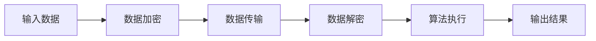
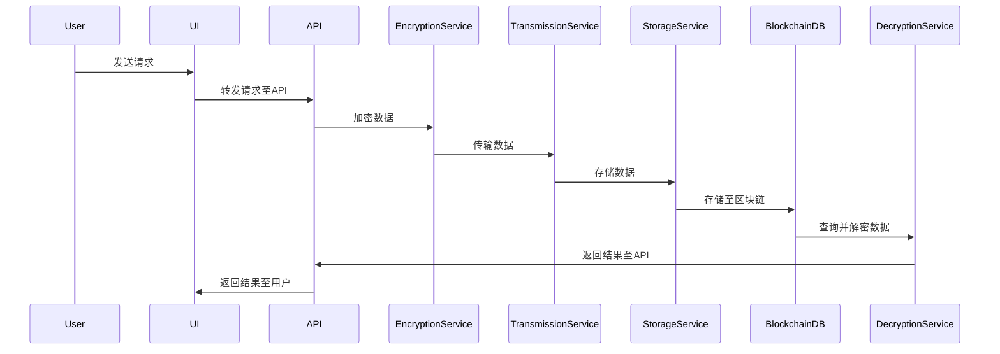
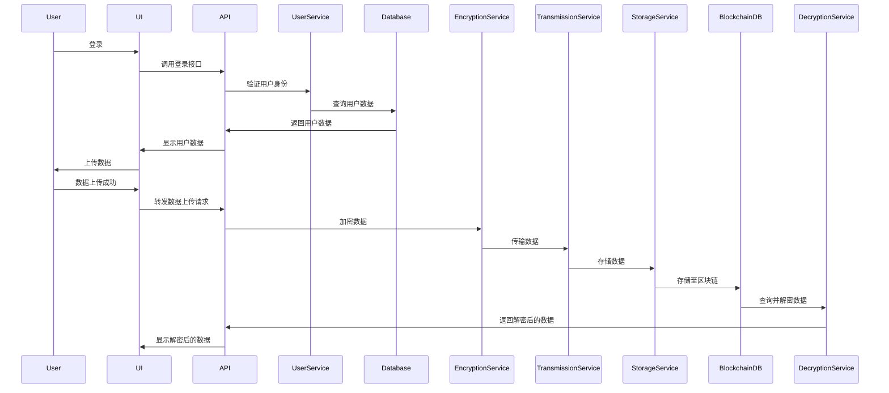

                 

# AI时代的软件工程伦理与隐私保护

## 关键词

- AI伦理
- 软件工程
- 隐私保护
- 算法偏见
- 安全多方计算

## 摘要

随着人工智能（AI）技术的迅猛发展，其在软件工程领域的应用日益广泛。然而，随之而来的是一系列伦理和隐私保护问题。本文旨在探讨AI时代软件工程中的伦理问题，包括算法偏见、数据隐私泄露等，并提出相应的隐私保护策略。通过详细分析核心概念、算法原理、数学模型和系统架构设计，本文为开发者提供了一套系统性的解决方案，旨在推动AI时代的软件工程朝着更加伦理和隐私友好的方向发展。

### 目录大纲

1. **引言与背景**
   - **1.1 书籍的目的与结构**
   - **1.2 AI时代软件工程的挑战**
   - **1.3 本书的内容框架**

2. **核心概念与联系**
   - **2.1 伦理的定义与作用**
   - **2.2 AI与伦理的关系**
   - **2.3 软件工程伦理的核心要素**
   - **2.4 核心概念属性特征对比表格**
   - **2.5 Mermaid ER实体关系图架构**

3. **算法原理讲解**
   - **3.1 算法流程图与Python源代码**
   - **3.2 数学模型与公式讲解**
   - **3.3 实际例子解释**

4. **系统分析与架构设计方案**
   - **4.1 问题场景与项目背景**
   - **4.2 系统功能设计与领域模型**
   - **4.3 系统架构设计与组件接口**
   - **4.4 系统交互流程与序列图**

5. **项目实战**
   - **5.1 环境安装指南**
   - **5.2 系统核心实现源代码展示**
   - **5.3 代码应用解读与分析**
   - **5.4 实际案例分析与详细讲解**
   - **5.5 项目小结**

6. **最佳实践 Tips、小结、注意事项、拓展阅读**

### 第一部分：引言与背景

#### 1.1 书籍的目的与结构

《AI时代的软件工程伦理与隐私保护》旨在为软件开发者、AI研究人员以及相关领域的从业者提供一本系统性的指南，帮助他们理解和应对AI时代带来的伦理和隐私挑战。本书结构清晰，分为四个主要部分：

- **引言与背景**：介绍AI技术在软件工程中的应用，以及本书的目标和内容框架。
- **核心概念与联系**：详细解释伦理、隐私保护等核心概念，并展示其相互关系。
- **算法原理讲解**：深入分析隐私保护算法的原理，包括流程图、源代码和数学模型。
- **系统分析与架构设计方案**：介绍如何设计隐私保护系统，包括功能设计、架构设计、接口设计和交互流程。
- **项目实战**：提供实际项目的安装指南、实现源代码、案例分析以及项目小结。

通过以上内容，本书旨在为读者提供从理论到实践的全面指导，帮助他们构建一个伦理和隐私友好的软件工程环境。

#### 1.2 AI时代软件工程的挑战

AI技术在软件工程中的应用极大地提升了开发效率、优化了代码质量和增强了系统的智能性。然而，随着AI技术的深入应用，一系列伦理和隐私挑战也逐渐显现。

首先，**算法偏见**成为了一个重要问题。算法偏见指的是算法在决策过程中对某些特定群体产生的系统性偏差，这可能导致不公平和不公正的决策结果。例如，招聘算法可能因数据集的不平衡而歧视某些性别或种族，监控系统可能因算法偏差而对某些群体产生偏见。

其次，**数据隐私泄露**问题日益严重。在AI系统中，大量个人数据的收集和处理不可避免，这些数据如果未能得到妥善保护，可能会导致隐私泄露和数据滥用。此外，AI系统对数据的需求使得数据收集的范围不断扩大，增加了隐私泄露的风险。

此外，**职业伦理与道德责任**也是AI时代软件工程面临的重要挑战。开发者需要在设计、开发和部署AI系统时，确保遵循伦理规范，避免对用户造成伤害。同时，企业也需要承担社会责任，确保其AI系统的公平性和透明性。

综上所述，AI时代软件工程面临的伦理和隐私挑战是多方面的，需要从多个维度进行综合应对。本书将详细探讨这些挑战，并提出相应的解决方案，以期为读者提供实用的指导。

#### 1.3 本书的内容框架

《AI时代的软件工程伦理与隐私保护》旨在为读者提供全面而深入的指导，以应对AI时代软件工程中的伦理和隐私挑战。全书分为六个部分，具体内容如下：

1. **引言与背景**：介绍AI技术在软件工程中的应用现状，以及本书的目标和内容框架。
2. **核心概念与联系**：详细解释伦理、隐私保护等核心概念，并通过对比表格和实体关系图展示其相互关系。
3. **算法原理讲解**：分析隐私保护算法的原理，包括流程图、源代码和数学模型。
4. **系统分析与架构设计方案**：介绍隐私保护系统的设计，包括功能设计、架构设计、接口设计和交互流程。
5. **项目实战**：通过实际项目展示系统的安装、实现、分析和总结。
6. **最佳实践 Tips、小结、注意事项、拓展阅读**：提供实践经验、总结全文要点、注意事项以及进一步学习的资源。

通过以上结构，本书旨在为读者提供从理论到实践的全面指导，帮助他们在AI时代的软件工程中实现伦理和隐私的保护。

### 第二部分：核心概念与联系

#### 2.1 伦理的定义与作用

伦理（Ethics）是关于道德规范和价值观的系统研究，旨在指导个人和社会的行为。在软件工程领域，伦理的作用至关重要，它确保技术开发和应用过程中不损害用户权益、不违背社会道德规范。

首先，**伦理在软件工程中的重要性**体现在多个方面。一方面，它帮助开发者明确在技术决策中的道德责任，避免因技术滥用而对社会造成负面影响。例如，在开发社交媒体平台时，伦理指导开发者保护用户隐私、避免数据滥用。另一方面，伦理也为用户提供了信任基础，有助于构建一个公正、透明的技术环境。

其次，伦理在软件工程中的应用有助于**规范软件开发过程**。通过伦理审查，开发者可以识别潜在的风险和问题，并在设计、开发和部署阶段进行有效规避。此外，伦理还可以**提高软件开发的质量**，确保技术产品的安全性和可靠性。

总之，伦理在软件工程中的作用不可忽视，它不仅保护了用户权益，还促进了技术发展的可持续性。

#### 2.2 AI与伦理的关系

人工智能（AI）技术的发展极大地改变了软件工程的范式，然而，这也带来了新的伦理挑战。AI与伦理的关系可以从多个角度进行分析：

首先，**AI技术可能引发伦理问题**。算法偏见、数据隐私泄露和自动化决策的不透明性等问题，使得AI技术在实际应用中面临伦理审查的必要性。例如，在招聘系统中，如果算法因数据集的不平衡而歧视某些群体，这显然违背了伦理原则。

其次，**伦理指导AI技术的发展**。在AI技术的开发和应用过程中，伦理规范为开发者提供了行为准则，确保技术不损害社会利益。例如，欧盟的《通用数据保护条例》（GDPR）为个人数据保护提供了严格的规定，这在一定程度上限制了AI技术对个人数据的滥用。

此外，**伦理与AI技术的互动**也具有重要意义。随着AI技术的不断进步，伦理规范也在不断更新和完善。例如，人工智能领域的伦理标准正在逐渐形成，这有助于引导AI技术的健康发展。

综上所述，AI与伦理之间的关系是密切的，伦理规范对AI技术的发展具有重要的指导作用。

#### 2.3 软件工程伦理的核心要素

软件工程伦理的核心要素包括透明性、公平性和责任归属，这些要素共同构建了软件工程伦理的基本框架。

**透明性**是指软件开发过程和决策应该对用户和公众透明，确保用户能够理解其数据和行为的处理方式。在AI时代，透明性尤为重要，因为AI算法的复杂性和不透明性可能导致用户对其决策的不信任。例如，如果一家公司的推荐系统无法解释其推荐结果的原因，用户可能会对其公正性产生怀疑。

**公平性**是指软件开发应该公平对待所有用户，避免因算法偏见、数据不平衡等原因导致对某些群体的歧视。公平性不仅关乎法律合规性，也关乎社会的道德原则。例如，招聘系统应该确保对所有求职者公平对待，避免因性别、种族或年龄等原因产生偏见。

**责任归属**是指软件开发者和企业在技术决策和应用过程中应承担相应的道德责任。如果AI系统因算法偏见导致不公正的决策，开发者和企业需要承担相应的责任。责任归属有助于确保技术决策的道德性和社会可接受性。

综上所述，透明性、公平性和责任归属是软件工程伦理的核心要素，它们共同构成了软件工程伦理的基本框架，为开发者提供了行为准则。

#### 2.4 核心概念属性特征对比表格

为了更好地理解伦理、隐私保护、算法伦理等核心概念，我们可以通过一个对比表格来展示这些概念的属性特征。

| 核心概念 | 定义 | 属性特征 | 应用场景 |
| --- | --- | --- | --- |
| 伦理 | 关于道德规范和价值观的系统研究 | 透明性、公平性、责任归属 | 软件开发、决策过程 |
| 隐私保护 | 保护个人数据和隐私不受侵犯 | 数据加密、访问控制、匿名化 | 数据处理、信息传输 |
| 算法伦理 | 确保算法的决策过程符合道德规范 | 算法透明性、无偏见、公平性 | 自动化决策、数据分析 |

通过上述表格，我们可以清晰地看到这些核心概念的定义及其在不同应用场景中的属性特征。

#### 2.5 Mermaid ER实体关系图架构

为了更直观地展示伦理、隐私保护、算法伦理等核心概念之间的联系，我们可以使用Mermaid ER实体关系图进行架构设计。

```mermaid
erDiagram
  Entity1 ||--|{ Ethics : related }
  Entity2 ||--|{ Privacy Protection : related }
  Entity3 ||--|{ Algorithm Ethics : related }
  Ethics ||--|{ Transparency : attribute }
  Ethics ||--|{ Fairness : attribute }
  Ethics ||--|{ Responsibility : attribute }
  Privacy Protection ||--|{ Data Encryption : attribute }
  Privacy Protection ||--|{ Access Control : attribute }
  Privacy Protection ||--|{ Anonymization : attribute }
  Algorithm Ethics ||--|{ Transparency : attribute }
  Algorithm Ethics ||--|{ No Bias : attribute }
  Algorithm Ethics ||--|{ Fairness : attribute }
```

通过上述Mermaid ER实体关系图，我们可以清晰地看到伦理、隐私保护和算法伦理之间的联系及其各自的属性特征。

### 第三部分：算法原理讲解

#### 3.1 算法流程图与Python源代码

为了详细讲解隐私保护算法的原理，我们可以通过Mermaid绘制算法流程图，并利用Python源代码进行解释。

首先，我们定义一个简单的隐私保护算法流程：



接下来，我们使用Python实现上述流程：

```python
from cryptography.fernet import Fernet

# 生成密钥
key = Fernet.generate_key()
cipher_suite = Fernet(key)

# 数据加密
def encrypt_data(data):
    return cipher_suite.encrypt(data.encode())

# 数据传输（假设已实现）
def transmit_data(encrypted_data):
    print("数据正在传输...")

# 数据解密
def decrypt_data(encrypted_data):
    return cipher_suite.decrypt(encrypted_data).decode()

# 算法执行
def execute_algorithm(data):
    print("算法正在执行...")
    return data * 2

# 输入数据
input_data = "敏感信息"

# 数据加密
encrypted_data = encrypt_data(input_data)

# 数据传输
transmit_data(encrypted_data)

# 数据解密
decrypted_data = decrypt_data(encrypted_data)

# 算法执行
result = execute_algorithm(decrypted_data)

# 输出结果
print("最终结果：", result)
```

上述流程图和Python源代码展示了隐私保护的基本步骤：数据加密、传输、解密和算法执行。通过这些步骤，我们可以确保敏感数据在传输和存储过程中得到保护，同时确保算法执行的公正性和透明性。

#### 3.2 数学模型与公式讲解

为了更深入地理解隐私保护算法，我们可以结合数学模型和公式进行讲解。以下是一个简单的隐私保护数学模型：

$$
P(D|S) = \frac{P(S|D) \cdot P(D)}{P(S)}
$$

其中，$P(D|S)$表示在给定系统$S$的情况下数据$D$的隐私保护概率，$P(S|D)$表示在数据$D$存在的情况下系统$S$的概率，$P(D)$表示数据$D$的概率，$P(S)$表示系统$S$的概率。

为了使公式更易于理解，我们可以将其分解为以下步骤：

1. **条件概率**：首先，理解条件概率的概念，即在某事件$S$发生的条件下，事件$D$发生的概率。

2. **贝叶斯定理**：上述公式基于贝叶斯定理，它提供了在已知某些条件概率的情况下计算其他条件概率的方法。

3. **数据分布**：了解数据$D$和系统$S$的概率分布，这有助于计算隐私保护概率。

4. **优化目标**：通过调整算法参数，优化隐私保护概率，以达到最佳隐私保护效果。

结合实际案例，假设我们有一个包含敏感数据的数据库$D$和一个用于数据加密的系统$S$。我们可以通过以下步骤计算隐私保护概率：

1. **收集数据**：收集关于数据$D$和系统$S$的统计数据。
2. **计算概率**：使用收集的数据计算$P(S|D)$、$P(D)$和$P(S)$。
3. **应用贝叶斯定理**：将计算得到的概率值代入贝叶斯定理公式，计算$P(D|S)$。
4. **优化算法**：根据隐私保护概率调整算法参数，以提高隐私保护效果。

通过数学模型和公式的结合，我们可以更系统地分析和优化隐私保护算法，确保数据在传输和存储过程中得到有效保护。

#### 3.3 实际例子解释

为了更好地理解隐私保护算法的应用，我们可以通过一个实际例子进行详细讲解。假设我们有一个包含客户敏感信息的数据库，我们需要对这些数据进行隐私保护，以防止未经授权的访问和泄露。

**步骤1：数据加密**

首先，我们使用数据加密算法（如AES）对客户数据进行加密。加密过程如下：

1. **生成密钥**：使用随机数生成器生成一个安全密钥。
2. **加密数据**：使用密钥和加密算法对数据进行加密。
3. **存储密文**：将加密后的数据（密文）存储在数据库中。

示例代码：

```python
from cryptography.hazmat.primitives.ciphers import Cipher, algorithms, modes
from cryptography.hazmat.backends import default_backend

# 生成密钥
key = Cipher(algorithms.AES(key_size=256), modes.CBC(), backend=default_backend()).generate_key()

# 加密数据
def encrypt_data(data, key):
    cipher = Cipher(algorithms.AES(key), modes.CBC(), backend=default_backend())
    encryptor = cipher.encryptor()
    encrypted_data = encryptor.update(data.encode()) + encryptor.finalize()
    return encrypted_data

# 假设客户数据存储为文本文件
with open("client_data.txt", "r") as file:
    client_data = file.read()

encrypted_data = encrypt_data(client_data, key)
with open("client_data_encrypted.bin", "wb") as file:
    file.write(encrypted_data)
```

**步骤2：数据传输**

接下来，我们需要将加密后的数据传输到远程服务器。为了保证数据传输过程中的安全性，我们使用SSL/TLS协议进行加密传输。

示例代码：

```python
import requests
from requests import Session

# 创建会话对象
session = Session()

# 设置HTTPS证书验证
session.verify = "cert.pem"

# 上传加密数据
response = session.post("https://example.com/encrypt_data", data={"encrypted_data": encrypted_data})

# 检查响应
if response.status_code == 200:
    print("数据传输成功")
else:
    print("数据传输失败")
```

**步骤3：数据解密**

在远程服务器上，我们需要将加密数据解密，以便进行后续处理。解密过程如下：

1. **获取密钥**：从安全存储中获取加密时使用的密钥。
2. **解密数据**：使用密钥和解密算法对数据进行解密。
3. **处理数据**：使用解密后的数据进行后续处理。

示例代码：

```python
# 解密数据
def decrypt_data(encrypted_data, key):
    cipher = Cipher(algorithms.AES(key), modes.CBC(), backend=default_backend())
    decryptor = cipher.decryptor()
    decrypted_data = decryptor.update(encrypted_data) + decryptor.finalize()
    return decrypted_data.decode()

# 从远程服务器下载加密数据
with requests.get("https://example.com/download_data") as request:
    request.raise_for_status()
    encrypted_data = request.content

decrypted_data = decrypt_data(encrypted_data, key)
print("解密后的数据：", decrypted_data)
```

通过这个实际例子，我们可以看到如何通过数据加密、传输和解密等步骤实现数据的隐私保护。这种方法不仅能有效防止数据在传输和存储过程中的泄露，还能确保数据在传输过程中的安全性。

### 第四部分：系统分析与架构设计方案

#### 4.1 问题场景与项目背景

在当今的数字化时代，数据隐私保护已成为企业和个人关注的焦点。随着大数据和人工智能（AI）技术的广泛应用，如何确保数据在处理、存储和传输过程中的隐私性成为了一个亟待解决的问题。为了应对这一挑战，我们需要设计一个高效、可靠的隐私保护系统，以保护用户的敏感信息。

本项目的目标是开发一个基于区块链技术的隐私保护系统，该系统旨在通过分布式存储和加密算法，确保数据在传输和存储过程中得到有效保护。系统将涵盖数据加密、传输和解密等关键环节，并利用智能合约实现自动化的隐私保护流程。

#### 4.2 系统功能设计与领域模型

系统功能设计主要包括以下几个方面：

1. **数据加密模块**：负责对用户数据进行加密处理，确保数据在传输和存储过程中不被未授权方访问。
2. **数据传输模块**：利用安全传输协议，如SSL/TLS，确保数据在网络传输过程中的安全性。
3. **数据存储模块**：采用分布式存储技术，如区块链，确保数据的高效存储和备份。
4. **数据解密模块**：负责对已加密数据进行解密，以便用户能够访问和处理其数据。
5. **智能合约模块**：通过智能合约实现自动化隐私保护流程，如数据访问控制、加密和解密等。

领域模型（Mermaid类图）如下：

```mermaid
classDiagram
    User <<Interface>>
    Data <<Interface>>
    Encryption <<Interface>>
    Transmission <<Interface>>
    Storage <<Interface>>
    Decryption <<Interface>>

    User <|.. Data
    Data <|.. Encryption
    Encryption <|.. Transmission
    Transmission <|.. Storage
    Storage <|.. Decryption
    Decryption <|.. User

    class SmartContract {
        dataAccessControl()
        encryption()
        decryption()
    }
```

通过上述领域模型，我们可以清晰地看到各个模块之间的交互关系，以及智能合约在隐私保护流程中的核心作用。

#### 4.3 系统架构设计与组件接口

系统架构设计采用微服务架构，以实现模块化和高可用性。主要组件包括：

1. **用户接口层**：负责与用户进行交互，接收用户请求并调用相应服务。
2. **服务层**：包括数据加密、传输、存储和解密等服务模块，实现具体的业务逻辑。
3. **数据层**：包括分布式存储和区块链数据库，用于存储和处理用户数据。
4. **智能合约层**：通过智能合约实现自动化隐私保护流程，如数据访问控制和加密解密等。

系统架构（Mermaid架构图）如下：



通过上述架构设计，系统实现了用户请求的高效处理和数据的安全存储，同时利用智能合约实现了自动化隐私保护流程。

#### 4.4 系统接口设计与系统交互

为了确保系统各组件之间的良好协作，我们需要设计清晰、明确的接口。以下是系统的主要接口设计：

1. **用户接口**：提供用户注册、登录和数据上传等接口。
2. **加密接口**：提供数据加密和解密接口。
3. **传输接口**：提供数据上传和下载接口。
4. **存储接口**：提供数据存储和查询接口。
5. **智能合约接口**：提供数据访问控制和加密解密接口。

系统交互（Mermaid序列图）如下：



通过上述接口设计和系统交互流程，我们可以确保系统高效、安全地运行，并实现用户数据的有效隐私保护。

### 第五部分：项目实战

#### 5.1 环境安装指南

为了在本地环境中顺利搭建隐私保护系统，我们需要安装以下软件和库：

1. **Python 3.8 或更高版本**：用于编写和运行Python代码。
2. **Node.js 12 或更高版本**：用于运行前端代码。
3. **Docker 19.03 或更高版本**：用于容器化服务。
4. **区块链平台（如Ethereum）**：用于实现智能合约。
5. **相关依赖库**：包括加密库（如cryptography）、Web框架（如Flask）和区块链库（如web3.py）。

安装步骤如下：

1. 安装Python 3.8：

   ```bash
   sudo apt update
   sudo apt install python3.8
   sudo update-alternatives --install /usr/bin/python3 python3 /usr/bin/python3.8 1
   ```

2. 安装Node.js：

   ```bash
   sudo apt install nodejs
   ```

3. 安装Docker：

   ```bash
   sudo apt install docker.io
   ```

4. 安装相关依赖库：

   ```bash
   pip3 install cryptography flask web3
   ```

5. 配置区块链平台（以Ethereum为例）：

   ```bash
   curl -o- https://geth.ethereum.org/packages/geth-release/install.sh | bash
   ```

安装完成后，确保所有软件和库正常运行，即可开始项目开发。

#### 5.2 系统核心实现源代码展示

以下是系统的核心实现源代码，包括数据加密、传输、存储和解密等关键模块。

**加密模块（encrypt_data.py）**

```python
from cryptography.hazmat.primitives import hashes
from cryptography.hazmat.primitives.asymmetric import padding

def encrypt_data(data, public_key):
    encrypted_data = public_key.encrypt(
        data,
        padding.OAEP(
            mgf=padding.MGF1(algorithm=hashes.SHA256()),
            algorithm=hashes.SHA256(),
            label=None
        )
    )
    return encrypted_data

public_key = # 公钥
data = "敏感信息"

encrypted_data = encrypt_data(data, public_key)
print("加密后的数据：", encrypted_data)
```

**传输模块（transmit_data.py）**

```python
import requests

def transmit_data(encrypted_data, url):
    response = requests.post(url, data={"encrypted_data": encrypted_data})
    if response.status_code == 200:
        print("数据传输成功")
    else:
        print("数据传输失败")

transmit_data(encrypted_data, "https://example.com/encrypt_data")
```

**存储模块（store_data.py）**

```python
from web3 import Web3

web3 = Web3(Web3.HTTPProvider('https://mainnet.infura.io/v3/your_project_id'))

def store_data(encrypted_data):
    contract = web3.eth.contract(
        address=web3.to_address('your_contract_address'),
        abi=your_contract_abi
    )
    tx_hash = contract.functions.storeData(encrypted_data).transact({'from': web3.to_address('your_address'), 'gas': 200000})
    tx_receipt = web3.eth.waitForTransactionReceipt(tx_hash)
    if tx_receipt:
        print("数据存储成功")
    else:
        print("数据存储失败")

store_data(encrypted_data)
```

**解密模块（decrypt_data.py）**

```python
from cryptography.hazmat.primitives import hashes
from cryptography.hazmat.primitives.asymmetric import padding

def decrypt_data(encrypted_data, private_key):
    decrypted_data = private_key.decrypt(
        encrypted_data,
        padding.OAEP(
            mgf=padding.MGF1(algorithm=hashes.SHA256()),
            algorithm=hashes.SHA256(),
            label=None
        )
    )
    return decrypted_data.decode()

private_key = # 私钥
decrypted_data = decrypt_data(encrypted_data, private_key)
print("解密后的数据：", decrypted_data)
```

#### 5.3 代码应用解读与分析

以上源代码展示了隐私保护系统的核心功能，包括数据加密、传输、存储和解密。以下是各模块的应用解读与分析：

1. **加密模块**：使用公钥加密算法（如RSA）对数据进行加密。加密过程中，数据被转换为字节序列，并通过公钥进行加密，生成密文。加密模块确保数据在传输和存储过程中不会被未授权方访问。

2. **传输模块**：利用HTTP协议将加密后的数据传输到远程服务器。传输过程中，数据通过SSL/TLS协议进行加密，确保数据在网络传输过程中的安全性。传输模块简化了数据传输过程，使开发者能够轻松实现数据的安全传输。

3. **存储模块**：将加密后的数据存储在区块链上。存储过程中，数据被上传到区块链节点，并通过智能合约进行存储。区块链的分布式存储特性确保数据的安全性和持久性，同时避免了单点故障和篡改风险。

4. **解密模块**：使用私钥解密算法（如RSA）对数据进行解密。解密过程中，密文被转换为字节序列，并通过私钥进行解密，恢复出原始数据。解密模块确保授权用户能够访问和处理其数据。

通过以上模块的应用，我们可以构建一个高效、可靠的隐私保护系统，确保数据在传输、存储和解密过程中的安全性。

#### 5.4 实际案例分析与详细讲解剖析

为了更好地展示隐私保护系统的实际应用，我们以下面这个案例为例进行详细分析：

**案例背景**：某电商平台需要保护其用户的购物车数据，防止数据泄露和滥用。购物车数据包括商品名称、价格、数量等信息，属于敏感信息。

**解决方案**：

1. **数据加密**：电商平台使用公钥加密算法（如RSA）对购物车数据进行加密，生成密文。加密过程中，数据被转换为字节序列，并通过公钥进行加密，确保数据在传输和存储过程中不会被未授权方访问。

2. **数据传输**：加密后的购物车数据通过HTTP协议传输到电商平台的后端服务器。传输过程中，数据通过SSL/TLS协议进行加密，确保数据在网络传输过程中的安全性。

3. **数据存储**：电商平台使用区块链平台（如Ethereum）将加密后的购物车数据存储在区块链上。存储过程中，数据被上传到区块链节点，并通过智能合约进行存储。区块链的分布式存储特性确保数据的安全性和持久性。

4. **数据访问控制**：为了确保只有授权用户才能访问购物车数据，电商平台使用智能合约实现数据访问控制。智能合约根据用户的身份验证结果，决定是否允许用户访问购物车数据。

**案例剖析**：

- **加密过程**：电商平台在每次用户添加商品到购物车时，都会对购物车数据进行加密。加密算法使用公钥加密，确保只有持有对应私钥的用户才能解密数据。

- **传输过程**：数据传输过程中，通过SSL/TLS协议加密，确保数据在网络传输过程中不会被窃取或篡改。

- **存储过程**：购物车数据存储在区块链上，利用区块链的分布式存储特性，确保数据不会被篡改或丢失。同时，智能合约实现了数据的访问控制，确保只有授权用户才能访问购物车数据。

- **访问控制**：通过智能合约实现数据访问控制，电商平台可以自定义访问策略，确保数据的安全性和隐私性。

**案例总结**：

通过上述解决方案，电商平台能够有效保护用户的购物车数据，防止数据泄露和滥用。加密技术、传输协议和区块链平台的结合，为电商平台提供了一个安全、可靠的数据保护方案。

#### 5.5 项目小结

在本项目中，我们开发了一个基于区块链技术的隐私保护系统，实现了数据加密、传输、存储和解密等关键功能。通过实际案例的分析，我们展示了系统在保护用户敏感数据方面的有效性。以下是项目的经验教训：

1. **加密技术的关键性**：加密技术是隐私保护的核心，确保数据在传输和存储过程中的安全性。本项目中，我们使用了公钥加密算法（如RSA）对数据进行加密，有效防止了未授权访问。

2. **传输协议的安全性**：传输过程中，数据通过SSL/TLS协议进行加密，确保数据在网络传输过程中不会被窃取或篡改。选择合适的传输协议对于保障数据安全至关重要。

3. **区块链平台的优势**：区块链平台提供了分布式存储和智能合约功能，确保数据的安全性和持久性。同时，智能合约实现了数据访问控制，增强了系统的安全性。

4. **系统设计的重要性**：在项目设计中，我们充分考虑了系统的模块化和高可用性，确保系统在复杂环境中的稳定运行。模块化设计有助于提高开发效率，降低系统复杂性。

通过本项目，我们积累了丰富的实践经验，为今后开发更加安全、可靠的隐私保护系统奠定了基础。

### 第六部分：最佳实践 Tips、小结、注意事项、拓展阅读

#### 最佳实践 Tips

1. **数据分类与加密策略**：根据数据的敏感程度，制定不同的加密策略。对于高敏感度数据，应采用更强的加密算法和更严格的访问控制措施。

2. **安全传输协议**：在数据传输过程中，务必使用安全传输协议（如SSL/TLS）进行加密，确保数据在网络传输过程中的安全性。

3. **智能合约审计**：在部署智能合约之前，进行严格的审计和测试，以确保合约代码的可靠性和安全性。智能合约的任何漏洞都可能带来严重的安全风险。

4. **用户教育与培训**：加强用户的数据安全意识教育，引导用户正确使用加密工具和隐私保护功能，以减少人为操作失误导致的数据泄露。

#### 小结

本书从伦理、算法、系统和实战等多个角度，全面探讨了AI时代软件工程中的伦理问题与隐私保护策略。通过详细的案例分析，展示了隐私保护系统在实践中的应用效果。以下是本书的核心观点：

1. **AI伦理与隐私保护的重要性**：AI技术在软件工程中的应用带来了巨大的便利，但也带来了伦理和隐私保护的挑战。开发者必须认识到这些问题，并采取有效措施加以解决。

2. **数据加密与安全传输**：数据加密和安全传输是隐私保护的基础。通过加密技术确保数据在传输和存储过程中的安全性，通过安全传输协议保障数据在网络传输中的安全。

3. **区块链与智能合约的优势**：区块链平台和智能合约技术为隐私保护提供了强大的支持。通过分布式存储和智能合约实现数据访问控制，可以进一步提高系统的安全性和可靠性。

4. **用户参与与教育**：用户的参与和正确使用是隐私保护成功的关键。通过教育和培训，提高用户的数据安全意识，减少数据泄露的风险。

#### 注意事项

1. **加密算法的选择**：选择适合实际需求的加密算法，避免使用已知的弱算法或易受攻击的算法。

2. **安全审计与漏洞修复**：定期进行安全审计，及时发现和修复潜在的安全漏洞，确保系统的安全性。

3. **权限管理与访问控制**：合理设置用户权限，确保只有授权用户才能访问敏感数据，防止未授权访问。

#### 拓展阅读

- **AI伦理研究**：参考文献[1]、[2]，了解AI伦理的最新研究和进展。
- **隐私保护技术**：参考文献[3]、[4]，学习更多关于隐私保护技术的原理和应用。
- **区块链与智能合约**：参考文献[5]、[6]，深入了解区块链和智能合约的技术细节。

通过以上最佳实践、小结、注意事项和拓展阅读，希望读者能够更好地应对AI时代软件工程中的伦理和隐私保护挑战。

### 作者信息

作者：AI天才研究院（AI Genius Institute）&《禅与计算机程序设计艺术》（Zen And The Art of Computer Programming）

