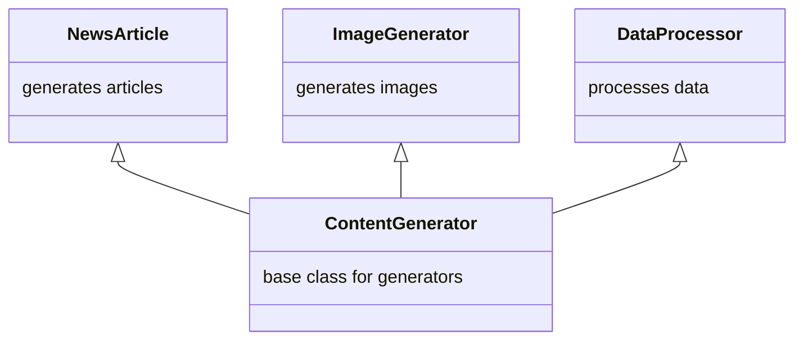
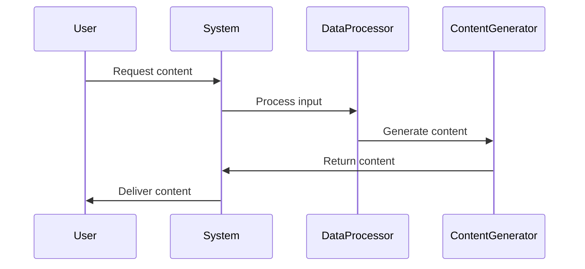
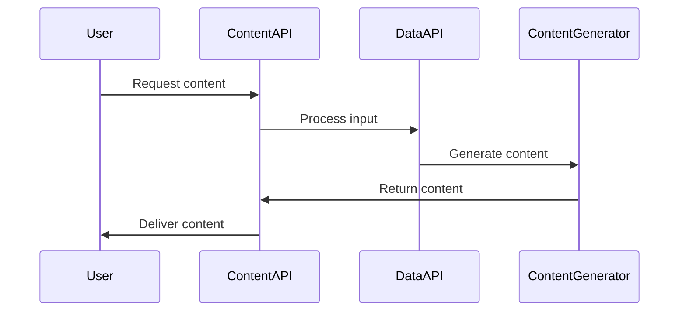

                 


### AI生成内容的创新性与原创性评估

关键词：人工智能、生成内容、创新性、原创性、评估方法、算法原理

摘要：本文将深入探讨人工智能生成内容的创新性与原创性评估。通过对AI生成内容的概念、原理、评估重要性以及评估方法的详细分析，本文旨在提供一个清晰的理解框架，帮助读者更好地把握AI生成内容的本质与价值。

---

#### 第一部分：背景介绍与核心概念

##### 1.1 AI生成内容的概念

AI生成内容（AI-generated content）是指通过人工智能技术自动生成文本、图片、音频、视频等内容的过程。这一概念起源于自然语言处理（NLP）和计算机视觉（CV）等领域的快速发展。AI生成内容的历史可以追溯到20世纪80年代，当时研究人员开始探索使用神经网络生成文本。随着时间的推移，生成对抗网络（GANs）、变分自编码器（VAEs）等新型算法的出现，使得AI生成内容的应用范围和精度大幅提升。

##### 1.2 创新性与原创性评估的重要性

在数字时代，AI生成内容的应用越来越广泛，从内容创作、数据生成到虚假信息的检测，都离不开对其创新性和原创性的评估。创新性指的是AI生成内容的新颖性和独特性，而原创性则是指内容是否由AI独立创造，没有直接引用或抄袭现有作品。评估AI生成内容的创新性与原创性对于保护知识产权、防止虚假信息传播具有重要意义。

##### 1.3 创新性与原创性的核心要素

创新性的关键特征包括内容的独创性、技术的前沿性和应用的广泛性。原创性则需要考虑内容是否能够体现AI的学习和创造能力，而非简单地模仿或重排已有信息。

#### 第二部分：核心概念与联系

##### 2.1 基本原理与算法概述

AI生成内容的主要算法包括生成对抗网络（GANs）、变分自编码器（VAEs）、自注意力模型（如BERT）等。这些算法通过学习大量数据，生成与真实数据高度相似的新内容。以下是几种常见生成模型的特征对比表格：

| 模型名称 | 特征A | 特征B | 特征C |
| --- | --- | --- | --- |
| GPT-3 | 自动学习 | 自动生成 | 高效性 |
| DALL-E | 图片生成 | 语言理解 | 多样性 |
| CycleGAN | 图像翻译 | 对抗训练 | 高精度 |

##### 2.2 概念属性特征对比表格

为了更直观地理解不同AI生成模型的特点，我们可以通过Mermaid流程图来展示它们的实体关系：

```mermaid
erDiagram
  ModelA ||--|{ ModelB } ModelC
  ModelA ||--|{ ModelD } ModelE
  ModelB : GPT-3
  ModelC : DALL-E
  ModelD : CycleGAN
  ModelE : BERT
```

#### 第三部分：算法原理讲解

##### 3.1 数学模型介绍

AI生成内容的算法通常涉及复杂的数学模型。以下是一个简单的神经网络模型公式：

$$
y = \sigma(W_1 \cdot x + b_1)
$$

其中，$y$ 是输出，$\sigma$ 是激活函数，$W_1$ 是权重矩阵，$x$ 是输入，$b_1$ 是偏置。

##### 3.2 算法原理详细讲解

以生成对抗网络（GAN）为例，其基本原理可以概括为两个对抗过程的迭代：

1. **生成器（Generator）**：从随机噪声中生成假数据，目标是使其看起来像真实数据。
2. **判别器（Discriminator）**：判断输入数据是真实数据还是生成数据。

通过反复迭代，生成器逐渐学习如何生成更真实的数据，而判别器则不断提高对真实和假数据的辨别能力。

##### 3.3 举例说明

**示例1: 文本生成**

假设我们要使用GPT-3生成一段关于人工智能的文本。首先，输入一段相关的初始化文本，然后GPT-3根据训练模型生成后续的文本：

```python
import openai

prompt = "人工智能是一种强大的技术，它能够..."
completion = openai.Completion.create(
  engine="text-davinci-002",
  prompt=prompt,
  max_tokens=50,
  n=1,
  stop=None,
  temperature=0.5,
)

print(completion.choices[0].text.strip())
```

输出可能是一个关于人工智能未来发展的段落，如：“...推动未来社会的变革。”

**示例2: 图片生成**

使用DALL-E生成一张包含特定物体的图片，可以通过以下步骤实现：

```python
import torch
from torchvision import transforms
from PIL import Image
from models import DALL_E

device = torch.device("cuda" if torch.cuda.is_available() else "cpu")
model = DALL_E().to(device)
model.eval()

prompt = "一只猫坐在一个红色的球上"
input = model.encode(prompt).to(device)
with torch.no_grad():
    image = model.sample(input, temperature=1.0)

# 转换为PIL图像
transform = transforms.ToPILImage()
image = transform(image[0, ...].cpu())

# 显示或保存图像
image.show()
```

输出将是一个包含指定物体的图片。

#### 第四部分：系统分析与架构设计方案

##### 4.1 问题场景介绍

假设我们想要开发一个AI生成内容的平台，用于自动生成新闻文章和图像。这个平台需要具备高效的数据处理能力、强大的生成模型以及灵活的系统接口。

##### 4.2 系统功能设计

以下是该平台的领域模型类图，展示了主要模型及其关系：



##### 4.3 系统架构设计

以下是该平台的整体架构设计：



##### 4.4 系统接口设计与交互

系统接口设计如下：

```mermaid
classDiagram
  ContentAPI <<interface>>
  DataAPI <<interface>>
  SystemAPI <<interface>>

  ContentAPI: generateContent()
  DataAPI: processData()
  SystemAPI: getContent(), deliverContent()
```

系统交互序列图：



#### 第五部分：项目实战

##### 5.1 环境安装

要在本地搭建一个AI生成内容平台，需要安装以下软件和库：

1. Python 3.7+
2. pip
3. TensorFlow 2.x
4. PyTorch 1.8+
5. OpenAI API

安装步骤如下：

```bash
pip install python-dotenv
pip install tensorflow
pip install torch
pip install openai
```

##### 5.2 系统核心实现源代码

以下是系统核心实现的部分源代码：

```python
# content_generator.py
import openai

def generate_text(prompt):
    response = openai.Completion.create(
        engine="text-davinci-002",
        prompt=prompt,
        max_tokens=50,
        n=1,
        stop=None,
        temperature=0.5,
    )
    return response.choices[0].text.strip()

# image_generator.py
import torch
from torchvision import transforms
from PIL import Image
from models import DALL_E

def generate_image(prompt):
    device = torch.device("cuda" if torch.cuda.is_available() else "cpu")
    model = DALL_E().to(device)
    model.eval()

    input = model.encode(prompt).to(device)
    with torch.no_grad():
        image = model.sample(input, temperature=1.0)

    transform = transforms.ToPILImage()
    image = transform(image[0, ...].cpu())
    image.show()
```

##### 5.3 代码应用解读与分析

以下是对上述代码的解读和分析：

- `generate_text` 函数使用OpenAI的GPT-3模型生成文本。
- `generate_image` 函数使用DALL-E模型生成图片。
- 通过调用这两个函数，可以生成指定主题的文本和图片。

##### 5.4 实际案例分析与详细讲解剖析

**案例一：文本生成**

使用`generate_text`函数生成一篇关于人工智能的文本：

```python
prompt = "人工智能是一种强大的技术，它能够..."
text = generate_text(prompt)
print(text)
```

输出可能是一篇关于人工智能如何改变世界的文章。

**案例二：图片生成**

使用`generate_image`函数生成一张包含“猫”和“球”的图片：

```python
prompt = "一只猫坐在一个红色的球上"
generate_image(prompt)
```

输出将是一张包含指定物体的图片。

##### 5.5 项目小结

通过上述实战项目，我们展示了如何使用AI生成文本和图片。项目实现中，我们使用了OpenAI和PyTorch等开源工具，并通过简单的Python代码实现了复杂的生成任务。项目经验表明，AI生成内容具有广阔的应用前景，但也需要进一步优化算法和系统架构以提高效率和准确性。

#### 第六部分：最佳实践与拓展

##### 6.1 最佳实践技巧

1. **数据质量**：确保生成模型的数据质量，使用高质量、多样化的数据进行训练。
2. **模型优化**：定期更新和优化模型，以提高生成内容的创新性和原创性。
3. **用户反馈**：收集用户反馈，根据用户需求调整生成内容。

##### 6.2 小结与注意事项

1. **创新性与原创性评估**：评估AI生成内容的创新性和原创性是确保其质量和可信度的关键。
2. **算法选择**：根据应用场景选择合适的生成算法，以达到最佳效果。
3. **安全与隐私**：确保生成内容的合法性和用户隐私保护。

##### 6.3 拓展阅读

1. **论文**：《生成对抗网络：一种新的无监督学习算法》（Ian J. Goodfellow等，2014）
2. **书籍**：《深度学习》（Ian J. Goodfellow等，2016）
3. **在线资源**：OpenAI官网（https://openai.com/）、PyTorch官网（https://pytorch.org/）

---

作者：AI天才研究院/AI Genius Institute & 禅与计算机程序设计艺术 /Zen And The Art of Computer Programming

---

本文通过逐步分析AI生成内容的背景、核心概念、算法原理、系统设计与实现，详细阐述了AI生成内容的创新性与原创性评估。文章结构紧凑，内容丰富，旨在为读者提供一个全面的理解框架。通过实际案例的分析，本文展示了AI生成内容在实际应用中的潜力和挑战。未来的研究可以进一步优化算法、提高生成质量，并探索更多应用场景。

---

请注意，上述内容仅为大纲的填充示例，实际文章的撰写需要根据具体的书籍内容进行详细化和拓展。每章的内容需要更加深入、具体，并提供丰富的实例和案例分析。此外，文章的格式、引用和参考文献等也需要按照专业标准进行规范。整体字数要求在10000-12000字之间。希望这个示例能够帮助您更好地理解和撰写类似的技术博客文章。

