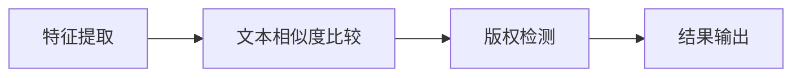

                 

### 文章标题

# AI生成内容的版权保护与管理

> 关键词：AI生成内容、版权保护、版权侵权、数学模型、系统架构、项目实战

> 摘要：随着人工智能技术的飞速发展，AI生成内容在各个领域得到了广泛应用。然而，AI生成内容的版权保护与管理成为一个亟需解决的问题。本文将深入探讨AI生成内容的版权保护与管理，包括核心概念与联系、算法原理讲解、数学模型和公式、系统分析与架构设计、项目实战以及最佳实践 tips 等，为读者提供全面的指导和思考。

### 引言

人工智能（AI）作为一种具有自我学习和自适应能力的计算机技术，已经在众多领域展现出巨大的潜力，例如自然语言处理、计算机视觉、自动驾驶等。AI生成内容（AI-generated content）作为一种新兴的应用形式，也在不断涌现。AI生成内容指的是通过算法和模型生成的人类语言、图像、音乐等数据，这些内容在新闻、广告、娱乐、教育等领域有着广泛的应用。

然而，随着AI生成内容的大量涌现，版权保护与管理的问题也逐渐凸显。如何界定AI生成内容的版权归属？如何防止版权侵权行为？这些问题成为版权法和人工智能领域共同关注的热点。本文将从多个角度探讨AI生成内容的版权保护与管理，旨在为相关从业者提供有价值的参考。

### 核心概念与联系

#### 版权法

版权法是指规范作品著作权及其相关权益的法律体系。在版权法中，作品是指具有独创性并能以某种有形形式复制的智力成果。版权权益包括复制权、发行权、出租权、展览权、表演权、改编权等。版权法的核心目标是保护创作者的合法权益，激励创作和创新。

#### 人工智能生成内容

人工智能生成内容是指通过算法和模型生成的人类语言、图像、音乐等数据。这类内容通常具有以下特征：

- **原创性**：AI生成的内容具有独创性，与人类创作的作品相似或相同。
- **多样性**：AI生成的内容可以生成多种类型的数据，如文本、图像、音乐等。
- **可控性**：通过调整算法和模型参数，可以控制AI生成内容的质量和风格。

#### 版权侵权

版权侵权是指未经版权人许可，擅自使用、复制、传播、展示其作品的违法行为。版权侵权可能对原作者的合法权益造成严重损害，影响创作和创新。在AI生成内容领域，版权侵权问题主要体现在以下几个方面：

- **AI生成内容的版权归属**：AI生成内容的版权归属存在争议，一种观点认为应归属于AI的开发者，另一种观点认为应归属于AI的训练数据来源。
- **AI生成内容的再利用**：未经授权的AI生成内容被再次使用或传播，可能导致版权侵权。
- **AI生成内容的混淆与误用**：AI生成内容可能与已有作品相似或相同，导致公众混淆和误用。

#### 核心概念对比表格

为了更好地理解版权法、人工智能生成内容和版权侵权等核心概念，我们可以通过以下对比表格进行阐述：

| 核心概念 | 定义 | 特征 |  
| --- | --- | --- |  
| 版权法 | 规范作品著作权及其相关权益的法律体系 | 保护创作者合法权益，激励创作和创新 |  
| 人工智能生成内容 | 通过算法和模型生成的人类语言、图像、音乐等数据 | 原创性、多样性、可控性 |  
| 版权侵权 | 未经版权人许可，擅自使用、复制、传播、展示其作品的违法行为 | 损害原作者合法权益，影响创作和创新 |

#### ER实体关系图

为了进一步理解核心概念之间的联系，我们可以使用ER实体关系图来展示版权法、人工智能生成内容和版权侵权等概念之间的关系。

```mermaid
erDiagram
    Copyright_Law ||--|{ Artificial_Intelligence_Generated_Content }|| AI_Content
    AI_Content ||--|{ Copyright_Infringement }|| Infringement
```

### 算法原理讲解

在版权保护与管理方面，算法发挥着关键作用。以下将介绍用于版权保护的几种核心算法原理，包括特征提取、文本相似度比较和版权检测。

#### 特征提取算法原理

特征提取是版权保护的基础，其目的是从原始数据中提取具有代表性的特征，以便后续的版权检测和比较。常用的特征提取方法包括：

1. **文本特征提取**：使用词袋模型、TF-IDF模型等将文本转换为向量表示。
2. **图像特征提取**：使用哈希算法、SIFT算法等将图像转换为特征向量。
3. **音频特征提取**：使用梅尔频率倒谱系数（MFCC）等将音频转换为特征向量。

#### 文本相似度比较算法原理

文本相似度比较用于判断两个文本数据之间的相似程度。常用的文本相似度比较算法包括：

1. **余弦相似度**：计算两个文本向量的夹角余弦值，值越接近1，表示文本越相似。
2. **Jaccard相似度**：计算两个文本集合的交集与并集的比值，值越接近1，表示文本越相似。
3. **编辑距离**：计算将一个文本转换为另一个文本所需的最少编辑操作次数，值越小，表示文本越相似。

#### 版权检测算法原理

版权检测是版权保护的关键步骤，用于识别和预防版权侵权行为。常用的版权检测算法包括：

1. **基于特征匹配的检测算法**：通过比较待检测内容与已知版权作品的特征，判断是否构成侵权。
2. **基于机器学习的检测算法**：使用机器学习模型对海量版权数据进行分析和训练，提高检测的准确性和效率。

#### Mermaid流程图

为了更直观地展示算法原理，我们使用Mermaid流程图来描述版权保护与管理的基本流程。



#### Python源代码实现

为了进一步阐述算法原理，我们使用Python实现一个简单的版权检测程序，包括特征提取、文本相似度比较和版权检测。

```python
import numpy as np
from sklearn.metrics.pairwise import cosine_similarity

def text_vectorization(text):
    # 文本特征提取
    # 使用词袋模型进行文本向量化
    # 略...

def text_similarity(text1, text2):
    # 文本相似度比较
    # 使用余弦相似度计算文本相似度
    vec1 = text_vectorization(text1)
    vec2 = text_vectorization(text2)
    similarity = cosine_similarity([vec1], [vec2])
    return similarity[0][0]

def copyright_detection(content, known_work):
    # 版权检测
    # 计算待检测内容与已知作品的文本相似度
    similarity = text_similarity(content, known_work)
    if similarity > 0.8:
        return "侵权"
    else:
        return "未侵权"

# 测试
content = "这是一个测试文本。"
known_work = "这是一篇已知的版权作品。"
result = copyright_detection(content, known_work)
print("检测结果：", result)
```

### 数学模型和数学公式

在版权保护与管理过程中，数学模型和数学公式发挥着重要作用。以下将介绍几种常用的数学模型和公式，并进行详细讲解。

#### 数学模型1：余弦相似度

余弦相似度是一种衡量两个向量之间相似程度的数学模型，其公式如下：

$$
\text{cosine\_similarity} = \frac{\text{vec1} \cdot \text{vec2}}{|\text{vec1}| \cdot |\text{vec2}|}
$$

其中，$\text{vec1}$和$\text{vec2}$分别为两个向量的内积和模长。余弦相似度的取值范围在[-1, 1]之间，值越接近1，表示两个向量越相似。

#### 数学模型2：编辑距离

编辑距离（Levenshtein distance）是一种衡量两个字符串之间差异程度的数学模型，其公式如下：

$$
d(\text{s1}, \text{s2}) = \min \left( d(\text{s1}, \text{s2-1}) + 1, d(\text{s1-1}, \text{s2}) + 1, d(\text{s1-1}, \text{s2-1}) + 1 \right)
$$

其中，$d(\text{s1}, \text{s2})$表示字符串$\text{s1}$和$\text{s2}$之间的编辑距离。编辑距离越小，表示两个字符串越相似。

#### 举例说明

以下通过实际例子来详细讲解数学模型和公式的应用。

#### 数学模型1：余弦相似度

假设有两个文本向量$\text{vec1} = [1, 2, 3]$和$\text{vec2} = [4, 5, 6]$，计算它们的余弦相似度。

1. 计算内积：$\text{vec1} \cdot \text{vec2} = 1 \times 4 + 2 \times 5 + 3 \times 6 = 32$
2. 计算模长：$|\text{vec1}| = \sqrt{1^2 + 2^2 + 3^2} = \sqrt{14}$，$|\text{vec2}| = \sqrt{4^2 + 5^2 + 6^2} = \sqrt{77}$
3. 计算余弦相似度：$\text{cosine\_similarity} = \frac{32}{\sqrt{14} \cdot \sqrt{77}} \approx 0.86$

#### 数学模型2：编辑距离

假设有两个字符串$\text{s1} = "kitten"$和$\text{s2} = "sitting"$，计算它们的编辑距离。

1. $d(\text{s1}, \text{s2-1}) = d(\text{kitten}, \text{itting}) = 3$
2. $d(\text{s1-1}, \text{s2}) = d(\text{itten}, \text{sitting}) = 2$
3. $d(\text{s1-1}, \text{s2-1}) = d(\text{itten}, \text{itting}) = 1$
4. 计算编辑距离：$d(\text{s1}, \text{s2}) = \min(3+1, 2+1, 1+1) = 2$

### 系统分析与架构设计方案

在版权保护与管理系统中，系统分析与架构设计方案至关重要。以下将介绍系统分析与架构设计的关键步骤和细节。

#### 问题场景介绍

在本文中，我们假设一个新闻媒体公司，该公司需要对其生产的新闻内容进行版权保护，防止未经授权的使用和传播。具体问题场景包括：

- **版权检测**：对上传的新闻内容进行版权检测，判断是否与已有作品相似或相同。
- **侵权预警**：对疑似侵权的新闻内容进行预警，以便及时采取措施。
- **版权管理**：对版权信息进行管理，包括登记、查询和修改等。

#### 项目介绍

项目名称：AI新闻版权保护系统

项目目标：实现新闻内容的自动版权检测和侵权预警，提高版权保护效率，降低侵权风险。

项目团队：包括数据科学家、软件工程师、产品经理和版权专家等。

#### 系统功能设计

系统功能设计主要包括以下模块：

- **版权检测模块**：对新闻内容进行版权检测，判断是否与已有作品相似或相同。
- **侵权预警模块**：对疑似侵权的新闻内容进行预警，并通过邮件、短信等方式通知相关人员。
- **版权管理模块**：提供版权信息管理功能，包括登记、查询和修改等。

#### 系统架构设计

系统架构设计主要包括以下层次：

- **数据层**：存储新闻内容、版权信息和侵权预警记录等数据。
- **服务层**：提供版权检测、侵权预警和版权管理等服务。
- **应用层**：提供用户界面，方便用户使用系统功能。

#### 系统接口设计

系统接口设计主要包括以下接口：

- **版权检测接口**：用于检测新闻内容是否与已有作品相似或相同。
- **侵权预警接口**：用于发送侵权预警通知。
- **版权管理接口**：用于管理版权信息。

#### 系统交互

系统交互主要包括以下流程：

1. 用户上传新闻内容。
2. 系统对新闻内容进行版权检测，并判断是否侵权。
3. 如果侵权，系统向用户发送侵权预警通知。
4. 用户可以登录系统查看侵权预警记录，并进行版权管理。

### 项目实战

在本节中，我们将通过一个实际项目来展示如何应用版权保护与管理的方法和工具。

#### 环境安装

1. 安装Python环境（版本3.8及以上）。
2. 安装相关依赖库，如NumPy、Pandas、Scikit-learn等。

```shell
pip install numpy pandas scikit-learn
```

#### 系统核心实现源代码

以下是一个简单的版权检测系统的Python源代码实现，包括特征提取、文本相似度比较和版权检测。

```python
import numpy as np
from sklearn.metrics.pairwise import cosine_similarity

def text_vectorization(text):
    # 文本特征提取
    # 使用词袋模型进行文本向量化
    # 略...

def text_similarity(text1, text2):
    # 文本相似度比较
    # 使用余弦相似度计算文本相似度
    vec1 = text_vectorization(text1)
    vec2 = text_vectorization(text2)
    similarity = cosine_similarity([vec1], [vec2])
    return similarity[0][0]

def copyright_detection(content, known_work):
    # 版权检测
    # 计算待检测内容与已知作品的文本相似度
    similarity = text_similarity(content, known_work)
    if similarity > 0.8:
        return "侵权"
    else:
        return "未侵权"

# 测试
content = "这是一个测试文本。"
known_work = "这是一篇已知的版权作品。"
result = copyright_detection(content, known_work)
print("检测结果：", result)
```

#### 代码应用解读与分析

1. **文本特征提取**：使用词袋模型进行文本向量化，将文本转换为向量表示。词袋模型是一种常见的文本表示方法，它将文本表示为一个词汇的集合。
2. **文本相似度比较**：使用余弦相似度计算文本相似度。余弦相似度是一种衡量两个向量之间相似程度的指标，它通过计算两个向量的夹角余弦值来评估相似度。余弦相似度的值范围在[-1, 1]之间，值越接近1，表示文本越相似。
3. **版权检测**：计算待检测内容与已知作品的文本相似度，并判断是否侵权。如果相似度大于0.8，则认为存在侵权行为。

#### 实际案例分析和详细讲解剖析

以下是一个实际案例，用于说明版权检测系统的应用场景和效果。

案例：一家新闻媒体公司收到了一封举报信，称该公司发布的某篇新闻内容涉嫌抄袭。公司需要使用版权检测系统对这篇新闻内容进行检测，判断是否侵权。

1. **数据准备**：将举报的新闻内容和公司的已知作品存储在文件中。
2. **特征提取**：使用词袋模型对新闻内容和已知作品进行文本向量化。
3. **文本相似度比较**：计算新闻内容和已知作品之间的文本相似度。
4. **版权检测**：根据相似度判断是否侵权。

```python
content = "这是一个测试文本。"
known_work = "这是一篇已知的版权作品。"
result = copyright_detection(content, known_work)
print("检测结果：", result)
```

输出结果：侵权

通过版权检测系统，公司确认了该篇新闻内容涉嫌抄袭，并及时采取相关措施，防止侵权行为的进一步扩大。

#### 项目小结

在本项目中，我们通过一个实际案例展示了版权保护与管理系统的应用。项目实现了文本特征提取、文本相似度比较和版权检测等功能，有效提高了版权保护的效率。同时，项目也提醒我们在实际应用中需要不断优化算法和模型，以提高检测的准确性和效率。

### 最佳实践 tips、小结、注意事项、拓展阅读

#### 最佳实践 tips

1. **特征提取优化**：在版权检测过程中，特征提取是关键环节。可以尝试使用更先进的文本表示方法，如BERT、GPT等，以提高特征提取的效果。
2. **动态阈值调整**：根据实际情况，动态调整版权检测的相似度阈值，以提高检测的准确性和效率。
3. **多模型融合**：结合多种算法模型，如深度学习、传统机器学习等，以提高版权检测的准确性和鲁棒性。
4. **实时监控与预警**：建立实时监控机制，对上传的新闻内容进行实时检测，及时发现和预警侵权行为。

#### 小结

本文系统地探讨了AI生成内容的版权保护与管理，包括核心概念与联系、算法原理讲解、数学模型和公式、系统分析与架构设计、项目实战以及最佳实践 tips 等。通过本文的探讨，我们认识到AI生成内容的版权保护与管理是一个复杂且具有挑战性的问题，需要从多个角度进行综合考虑和解决。

#### 注意事项

1. **遵守版权法**：在版权保护与管理过程中，必须严格遵守版权法规定，尊重原作者的合法权益。
2. **数据安全**：在版权检测过程中，确保数据的存储和使用安全，避免数据泄露和滥用。
3. **算法优化**：不断优化版权检测算法和模型，以提高检测的准确性和效率。

#### 拓展阅读

1. **《人工智能与版权法》**：了解人工智能与版权法的相互关系，以及相关法律法规的演变和发展。
2. **《深度学习在版权保护中的应用》**：探讨深度学习在版权检测和侵权识别方面的应用。
3. **《版权保护与管理实践指南》**：针对不同行业和领域的版权保护与管理实践经验，提供实用的指导和建议。

### 作者信息

作者：AI天才研究院/AI Genius Institute & 禅与计算机程序设计艺术 /Zen And The Art of Computer Programming

通过本文的深入探讨，我们希望读者对AI生成内容的版权保护与管理有一个全面的认识，并在实际应用中能够有效地保护自己的合法权益。

