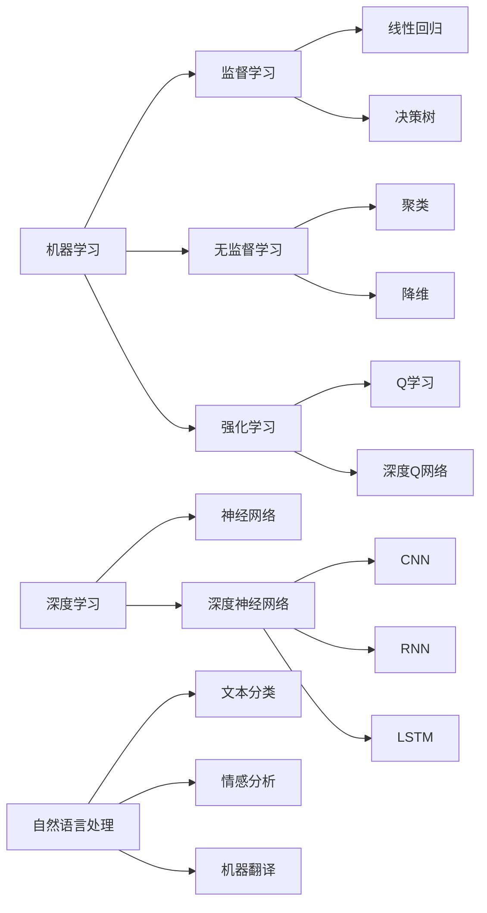
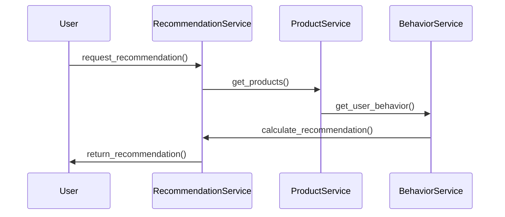

                 


### 文章标题

# AI Programming 2.0: Skills Map and Course Design

### 文章关键词

- AI编程
- 技能图谱
- 课程设计
- 深度学习
- 自然语言处理
- 机器学习
- 人工智能应用

### 文章摘要

本文将深入探讨AI Programming 2.0的概念及其技能图谱和课程设计。我们将从背景介绍入手，逐步解析AI编程的核心概念和关键技术，包括深度学习、自然语言处理、机器学习等。随后，我们将设计一个详细的课程结构，涵盖基础知识、核心技术、实战应用等多个方面。本文旨在为AI编程爱好者提供一份系统、全面的学习指南，帮助读者掌握AI Programming 2.0的精髓，开启人工智能编程的新征程。

## 背景介绍

### 核心概念术语说明

在开始探讨AI Programming 2.0之前，我们首先需要了解一些核心概念术语。AI（人工智能）是指通过计算机模拟人类智能的技术，包括学习、推理、感知、通信等方面。AI Programming 1.0主要关注规则系统和专家系统，而AI Programming 2.0则更加注重机器学习和深度学习。

**机器学习**是一种让计算机通过数据学习并做出决策的方法。它主要包括监督学习、无监督学习和强化学习。**深度学习**是机器学习的一个子领域，它通过构建深度神经网络来模拟人脑的学习过程，实现图像识别、语音识别等复杂任务。

**自然语言处理（NLP）**是AI的一个分支，旨在让计算机理解和生成自然语言。NLP技术包括文本分类、情感分析、机器翻译等。

### 问题背景

随着互联网的迅猛发展，大数据和云计算技术的普及，人工智能在各个领域的应用越来越广泛。从自动驾驶、智能助手到金融风控、医疗诊断，AI技术正在深刻改变我们的生活方式。为了应对这一挑战，越来越多的开发者开始关注AI编程，希望掌握这一前沿技术。

然而，AI编程的学习过程并不容易，许多初学者在入门阶段就感到困惑，难以找到合适的教程和课程。这导致很多有志于投身AI领域的人才无法顺利进入行业，甚至放弃了自己的梦想。

### 问题描述

本文旨在解决以下问题：

1. **AI Programming 2.0的核心概念和关键技术是什么？**
2. **如何设计一套系统化的课程，帮助初学者逐步掌握AI编程？**
3. **如何在实际项目中应用AI Programming 2.0的知识，实现真正的技术创新？**

### 问题解决

为了解决上述问题，本文将从以下几个方面展开：

1. **核心概念与联系**：介绍AI Programming 2.0的核心概念，如机器学习、深度学习、自然语言处理等，并分析它们之间的联系。
2. **技能图谱与课程设计**：设计一套完整的AI编程技能图谱和课程结构，涵盖基础知识、核心技术、实战应用等多个方面。
3. **实战项目**：通过实际案例，展示如何将AI Programming 2.0的知识应用于实际项目，实现技术创新。

### 边界与外延

本文主要关注AI Programming 2.0的技能图谱和课程设计，旨在为初学者提供一份系统化的学习指南。虽然本文涉及了许多核心概念和技术，但并不涵盖所有AI领域的知识。读者在阅读本文后，还需继续深入学习其他相关领域，如计算机视觉、语音识别等。

### 概念结构与核心要素组成

AI Programming 2.0的核心概念可以概括为以下几个要素：

1. **数据**：数据是AI编程的基础，包括结构化数据和非结构化数据。了解数据预处理和特征工程是掌握AI编程的关键。
2. **算法**：算法是AI编程的核心，包括机器学习算法、深度学习算法等。熟悉不同算法的原理和适用场景对开发者来说至关重要。
3. **模型**：模型是将数据转化为知识的过程，包括神经网络模型、循环神经网络模型等。掌握模型的构建、训练和评估是AI编程的关键技能。
4. **应用**：应用是将AI编程的知识应用于实际问题的过程，包括图像识别、语音识别、自然语言处理等。了解不同应用场景的需求和解决方案是AI编程的高级技能。

### 总结

通过本文的背景介绍，我们了解了AI Programming 2.0的核心概念和关键技术，明确了本文解决的问题和边界。接下来，我们将逐步深入探讨AI Programming 2.0的核心概念和技能图谱，为读者提供一份系统化的学习指南。

## 核心概念与联系

### 机器学习

机器学习是一种让计算机通过数据学习并做出决策的方法。它主要包括监督学习、无监督学习和强化学习。

**监督学习**：监督学习是一种有监督的学习方法，通过已标记的训练数据来训练模型，然后使用训练好的模型对新的数据进行预测。常见的监督学习算法包括线性回归、决策树、支持向量机等。

**无监督学习**：无监督学习是一种无监督的学习方法，通过未标记的数据来发现数据中的模式和结构。常见的无监督学习算法包括聚类、降维、关联规则等。

**强化学习**：强化学习是一种基于奖励和惩罚的学习方法，通过不断试错来学习最优策略。常见的强化学习算法包括Q学习、深度Q网络等。

### 深度学习

深度学习是机器学习的一个子领域，它通过构建深度神经网络来模拟人脑的学习过程，实现图像识别、语音识别等复杂任务。

**神经网络**：神经网络是一种模拟生物神经系统的计算模型，包括输入层、隐藏层和输出层。通过调整神经网络的权重和偏置，可以使神经网络学会对数据进行分类、回归等操作。

**深度神经网络**：深度神经网络是神经网络的一种扩展，它包含多个隐藏层，可以更好地模拟人脑的学习过程。常见的深度神经网络包括卷积神经网络（CNN）、循环神经网络（RNN）等。

**深度学习算法**：深度学习算法是基于深度神经网络实现的，包括卷积神经网络（CNN）、循环神经网络（RNN）、长短时记忆网络（LSTM）等。

### 自然语言处理

自然语言处理是人工智能的一个分支，旨在让计算机理解和生成自然语言。

**文本分类**：文本分类是将文本数据分为不同类别的过程。常见的文本分类算法包括朴素贝叶斯、支持向量机等。

**情感分析**：情感分析是分析文本数据的情感倾向，通常使用分类算法来实现。常见的情感分析算法包括朴素贝叶斯、支持向量机等。

**机器翻译**：机器翻译是将一种自然语言翻译成另一种自然语言的过程。常见的机器翻译算法包括基于统计的机器翻译、基于神经网络的机器翻译等。

### 概念属性特征对比表格

下面是一个概念属性特征对比表格，用于比较机器学习、深度学习和自然语言处理：

| 概念         | 特征                                       | 应用场景                 |
|------------|------------------------------------------|----------------------|
| 机器学习     | 数据驱动、有监督、无监督、强化学习           | 图像识别、语音识别、推荐系统等       |
| 深度学习     | 神经网络、多层网络、大数据处理               | 图像识别、语音识别、自然语言处理等     |
| 自然语言处理   | 文本数据、情感分析、文本分类、机器翻译          | 问答系统、社交媒体分析、搜索引擎优化等 |

### ER实体关系图架构

以下是机器学习、深度学习和自然语言处理的概念ER实体关系图：



### 总结

通过本文的核心概念与联系部分，我们详细介绍了机器学习、深度学习和自然语言处理的概念、属性特征以及它们之间的联系。这些核心概念是AI Programming 2.0的基础，为后续的技能图谱和课程设计提供了理论支撑。接下来，我们将进一步探讨AI Programming 2.0的技能图谱和课程设计，帮助读者系统化地掌握AI编程。

## 技能图谱

### AI编程技能图谱概述

AI编程技能图谱是一个系统化的框架，用于指导学习者掌握人工智能编程的核心技能。这个图谱不仅涵盖了基础知识，还包括了高级技术和实战应用。通过这个图谱，学习者可以清晰地了解自己当前的水平，并制定合适的学习路径。

### 技能层次划分

AI编程技能图谱通常分为以下四个层次：

1. **基础知识层**：包括编程基础、数据结构和算法等。
2. **核心技能层**：包括机器学习、深度学习和自然语言处理等。
3. **高级技术层**：包括计算机视觉、语音识别、推荐系统等。
4. **实战应用层**：包括实际项目开发、系统架构设计等。

### 基础知识层

**编程基础**：学习编程语言（如Python、Java等），掌握基本的编程概念，如变量、函数、循环、条件语句等。

**数据结构和算法**：学习常用的数据结构（如数组、链表、栈、队列、树等）和算法（如排序、查找、图算法等）。

### 核心技能层

**机器学习**：掌握机器学习的基本概念、算法和模型，如线性回归、决策树、支持向量机、神经网络等。

**深度学习**：学习深度学习的基本原理、架构和算法，如卷积神经网络（CNN）、循环神经网络（RNN）、长短时记忆网络（LSTM）等。

**自然语言处理**：了解自然语言处理的基本概念、技术和应用，如文本分类、情感分析、机器翻译等。

### 高级技术层

**计算机视觉**：学习计算机视觉的基本概念、算法和模型，如目标检测、图像分类、人脸识别等。

**语音识别**：掌握语音识别的基本原理、技术和应用，如语音信号处理、隐马尔可夫模型（HMM）、深度神经网络等。

**推荐系统**：了解推荐系统的工作原理、算法和实现，如基于内容的推荐、协同过滤、矩阵分解等。

### 实战应用层

**项目开发**：通过实际项目，锻炼编程能力和问题解决能力，如开发一个图像识别应用、自然语言处理工具等。

**系统架构设计**：学习系统架构设计的基本原则、方法和工具，如微服务架构、分布式系统等。

### 技能图谱的具体内容

以下是AI编程技能图谱的具体内容：

| 技能层次 | 技能名称       | 技能描述                                                         |
|----------|----------------|----------------------------------------------------------------|
| 基础知识层 | 编程基础       | 掌握编程语言的基本语法和编程概念，如变量、函数、循环、条件语句等。       |
|          | 数据结构和算法 | 学习常用的数据结构（如数组、链表、栈、队列、树等）和算法（如排序、查找、图算法等）。 |
| 核心技能层 | 机器学习       | 掌握机器学习的基本概念、算法和模型，如线性回归、决策树、支持向量机、神经网络等。 |
|          | 深度学习       | 学习深度学习的基本原理、架构和算法，如卷积神经网络（CNN）、循环神经网络（RNN）、长短时记忆网络（LSTM）等。 |
|          | 自然语言处理   | 了解自然语言处理的基本概念、技术和应用，如文本分类、情感分析、机器翻译等。     |
| 高级技术层 | 计算机视觉     | 学习计算机视觉的基本概念、算法和模型，如目标检测、图像分类、人脸识别等。     |
|          | 语音识别       | 掌握语音识别的基本原理、技术和应用，如语音信号处理、隐马尔可夫模型（HMM）、深度神经网络等。 |
|          | 推荐系统       | 了解推荐系统的工作原理、算法和实现，如基于内容的推荐、协同过滤、矩阵分解等。   |
| 实战应用层 | 项目开发       | 通过实际项目，锻炼编程能力和问题解决能力，如开发一个图像识别应用、自然语言处理工具等。 |
|          | 系统架构设计   | 学习系统架构设计的基本原则、方法和工具，如微服务架构、分布式系统等。         |

### 总结

通过AI编程技能图谱，学习者可以清晰地了解自己在不同技能层次上的水平和需要学习的知识点。这个图谱不仅为学习者提供了明确的学习路径，也为教育机构和培训机构设计课程提供了参考。在接下来的部分，我们将详细探讨AI Programming 2.0的课程设计，帮助学习者更好地掌握这门技术。

## 课程设计

### 课程目标

本课程旨在为学习者提供一套系统、全面的人工智能编程学习方案，帮助学习者从基础知识到高级技能，逐步掌握AI Programming 2.0的核心知识。课程目标如下：

1. **掌握编程基础**：学习编程语言（如Python、Java等），理解基本编程概念，能够编写简单的程序。
2. **理解核心算法**：学习机器学习、深度学习和自然语言处理的基本概念、算法和模型。
3. **实战项目开发**：通过实际项目，锻炼编程能力和问题解决能力，实现从理论到实践的转化。
4. **系统架构设计**：了解系统架构设计的基本原则和方法，具备设计和优化系统的能力。

### 课程结构

课程结构分为基础知识层、核心技能层、高级技术层和实战应用层。每个层次都包括多个模块，具体如下：

#### 基础知识层

1. **编程基础**：包括编程语言的选择、基础语法、数据结构和算法等。
2. **数学基础**：包括线性代数、微积分、概率论等数学知识，为后续学习打下基础。

#### 核心技能层

1. **机器学习**：包括监督学习、无监督学习和强化学习的基本概念、算法和模型。
2. **深度学习**：包括神经网络、卷积神经网络、循环神经网络等深度学习模型。
3. **自然语言处理**：包括文本分类、情感分析、机器翻译等NLP技术。

#### 高级技术层

1. **计算机视觉**：包括目标检测、图像分类、人脸识别等计算机视觉技术。
2. **语音识别**：包括语音信号处理、隐马尔可夫模型、深度神经网络等语音识别技术。
3. **推荐系统**：包括基于内容的推荐、协同过滤、矩阵分解等推荐系统技术。

#### 实战应用层

1. **项目开发**：通过实际项目，锻炼编程能力和问题解决能力。
2. **系统架构设计**：学习系统架构设计的基本原则、方法和工具。

### 课程内容详细设计

下面是课程内容的详细设计，包括每个模块的详细内容和学习目标：

#### 基础知识层

**编程基础**：

- **模块1**：编程语言选择与基础语法
  - 学习目标：掌握Python或Java的基础语法，能够编写简单的程序。
  - 内容详情：介绍Python或Java的基础语法，包括变量、数据类型、运算符、控制流程等。

- **模块2**：数据结构和算法
  - 学习目标：理解常见的数据结构（如数组、链表、栈、队列、树等）和算法（如排序、查找、图算法等）。
  - 内容详情：介绍常见的数据结构和算法，通过实例和练习加深理解。

**数学基础**：

- **模块1**：线性代数
  - 学习目标：掌握线性代数的基本概念和运算，如矩阵、向量、行列式等。
  - 内容详情：介绍线性代数的基本概念和运算，包括矩阵运算、线性方程组求解、特征值和特征向量等。

- **模块2**：微积分
  - 学习目标：理解微积分的基本概念和运算，如导数、积分、极限等。
  - 内容详情：介绍微积分的基本概念和运算，包括函数的极限、导数、积分等。

- **模块3**：概率论
  - 学习目标：掌握概率论的基本概念和运算，如随机事件、概率分布、期望和方差等。
  - 内容详情：介绍概率论的基本概念和运算，包括随机事件的概率、概率分布、期望和方差等。

#### 核心技能层

**机器学习**：

- **模块1**：监督学习
  - 学习目标：掌握监督学习的基本概念、算法和模型，如线性回归、决策树、支持向量机等。
  - 内容详情：介绍监督学习的基本概念、算法和模型，通过实例和练习加深理解。

- **模块2**：无监督学习
  - 学习目标：掌握无监督学习的基本概念、算法和模型，如聚类、降维等。
  - 内容详情：介绍无监督学习的基本概念、算法和模型，通过实例和练习加深理解。

- **模块3**：强化学习
  - 学习目标：掌握强化学习的基本概念、算法和模型，如Q学习、深度Q网络等。
  - 内容详情：介绍强化学习的基本概念、算法和模型，通过实例和练习加深理解。

**深度学习**：

- **模块1**：神经网络基础
  - 学习目标：掌握神经网络的基本概念、结构和训练过程。
  - 内容详情：介绍神经网络的基本概念、结构和训练过程，包括前向传播、反向传播等。

- **模块2**：卷积神经网络
  - 学习目标：掌握卷积神经网络的基本概念、结构和应用。
  - 内容详情：介绍卷积神经网络的基本概念、结构和应用，包括卷积层、池化层、全连接层等。

- **模块3**：循环神经网络
  - 学习目标：掌握循环神经网络的基本概念、结构和应用。
  - 内容详情：介绍循环神经网络的基本概念、结构和应用，包括循环层、门控循环单元（GRU）、长短时记忆网络（LSTM）等。

**自然语言处理**：

- **模块1**：文本分类
  - 学习目标：掌握文本分类的基本概念、算法和模型，如朴素贝叶斯、支持向量机等。
  - 内容详情：介绍文本分类的基本概念、算法和模型，通过实例和练习加深理解。

- **模块2**：情感分析
  - 学习目标：掌握情感分析的基本概念、算法和模型，如情感词典、文本相似度等。
  - 内容详情：介绍情感分析的基本概念、算法和模型，通过实例和练习加深理解。

- **模块3**：机器翻译
  - 学习目标：掌握机器翻译的基本概念、算法和模型，如基于统计的机器翻译、基于神经网络的机器翻译等。
  - 内容详情：介绍机器翻译的基本概念、算法和模型，通过实例和练习加深理解。

#### 高级技术层

**计算机视觉**：

- **模块1**：目标检测
  - 学习目标：掌握目标检测的基本概念、算法和模型，如YOLO、SSD等。
  - 内容详情：介绍目标检测的基本概念、算法和模型，通过实例和练习加深理解。

- **模块2**：图像分类
  - 学习目标：掌握图像分类的基本概念、算法和模型，如卷积神经网络、ResNet等。
  - 内容详情：介绍图像分类的基本概念、算法和模型，通过实例和练习加深理解。

- **模块3**：人脸识别
  - 学习目标：掌握人脸识别的基本概念、算法和模型，如基于特征的识别、基于深度学习的识别等。
  - 内容详情：介绍人脸识别的基本概念、算法和模型，通过实例和练习加深理解。

**语音识别**：

- **模块1**：语音信号处理
  - 学习目标：掌握语音信号处理的基本概念、算法和模型，如傅里叶变换、短时傅里叶变换等。
  - 内容详情：介绍语音信号处理的基本概念、算法和模型，通过实例和练习加深理解。

- **模块2**：隐马尔可夫模型
  - 学习目标：掌握隐马尔可夫模型的基本概念、算法和模型，如HMM、前向算法、后向算法等。
  - 内容详情：介绍隐马尔可夫模型的基本概念、算法和模型，通过实例和练习加深理解。

- **模块3**：深度神经网络
  - 学习目标：掌握深度神经网络的基本概念、结构和训练过程，如卷积神经网络、循环神经网络等。
  - 内容详情：介绍深度神经网络的基本概念、结构和训练过程，通过实例和练习加深理解。

**推荐系统**：

- **模块1**：基于内容的推荐
  - 学习目标：掌握基于内容的推荐的基本概念、算法和模型，如特征提取、相似度计算等。
  - 内容详情：介绍基于内容的推荐的基本概念、算法和模型，通过实例和练习加深理解。

- **模块2**：协同过滤
  - 学习目标：掌握协同过滤的基本概念、算法和模型，如用户基于的协同过滤、物品基于的协同过滤等。
  - 内容详情：介绍协同过滤的基本概念、算法和模型，通过实例和练习加深理解。

- **模块3**：矩阵分解
  - 学习目标：掌握矩阵分解的基本概念、算法和模型，如矩阵分解、矩阵分解的优化算法等。
  - 内容详情：介绍矩阵分解的基本概念、算法和模型，通过实例和练习加深理解。

#### 实战应用层

**项目开发**：

- **模块1**：图像识别应用
  - 学习目标：通过实际项目，学习图像识别的算法和应用。
  - 内容详情：介绍图像识别的基本算法和应用，通过实际项目开发，加深对图像识别算法的理解。

- **模块2**：自然语言处理工具
  - 学习目标：通过实际项目，学习自然语言处理的算法和应用。
  - 内容详情：介绍自然语言处理的基本算法和应用，通过实际项目开发，加深对自然语言处理算法的理解。

**系统架构设计**：

- **模块1**：系统架构设计基础
  - 学习目标：掌握系统架构设计的基本原则、方法和工具。
  - 内容详情：介绍系统架构设计的基本原则、方法和工具，如微服务架构、分布式系统等。

- **模块2**：实际项目架构设计
  - 学习目标：通过实际项目，学习如何设计和优化系统架构。
  - 内容详情：介绍实际项目中的系统架构设计，通过实际项目分析，加深对系统架构设计的理解。

### 总结

通过本课程的设计，学习者可以系统地掌握AI Programming 2.0的核心知识，从基础知识到高级技能，逐步提升自己的编程能力和问题解决能力。课程内容丰富、结构清晰，旨在帮助学习者实现从理论到实践的转化，为未来的职业发展打下坚实的基础。

## 算法原理讲解

### 卷积神经网络（CNN）算法原理

卷积神经网络（CNN）是一种用于图像识别和分类的深度学习模型，它通过模拟人眼的视觉感知机制来实现对图像的处理。下面我们一步一步讲解CNN的算法原理。

#### 卷积操作

卷积操作是CNN的核心，它通过在图像上滑动一个滤波器（也称为卷积核），计算滤波器与图像局部区域的点积。具体步骤如下：

1. **初始化卷积核**：卷积核是一个权重矩阵，其大小通常为3x3或5x5。初始权重可以通过随机初始化或预训练模型获得。
2. **滑动卷积核**：在图像上从左上角开始，逐个像素滑动卷积核，计算卷积核与图像局部区域的点积。
3. **应用激活函数**：将点积结果传递给激活函数（如ReLU函数），对卷积结果进行非线性变换。

#### 步骤1：卷积操作示意

假设我们有一个3x3的图像和一个3x3的卷积核，如下所示：

|   |   |   |   |   |   |  
|---|---|---|---|---|---|  
|   |   |   |   |   |   |  
|   |   |   |   |   |   |  
| 1 | 2 | 3 | 4 | 5 | 6 |  
|   |   |   |   |   |   |  
|   |   |   |   |   |   |  
|   |   |   |   |   |   |  
| 7 | 8 | 9 | 10| 11| 12|  
|   |   |   |   |   |   |  
|   |   |   |   |   |   |  
|   |   |   |   |   |   |

卷积核为：

|   |   |   |   |   |   |  
|---|---|---|---|---|---|  
|   |   |   |   |   |   |  
|   |   |   |   |   |   |  
| 1 | 0 | -1|   |   |   |  
|   |   |   |   |   |   |  
|   |   |   |   |   |   |  
| 1 | 0 | -1|   |   |   |  

计算卷积结果：

|   |   |   |   |   |   |  
|---|---|---|---|---|---|  
|   |   |   |   |   |   |  
|   |   |   |   |   |   |  
|   |   |   |   |   |   |  
| 5 | 4 | 3 |   |   |   |  
|   |   |   |   |   |   |  
|   |   |   |   |   |   |  
| 5 | 4 | 3 |   |   |   |  

其中，5、4、3分别为卷积核与图像局部区域的点积。

#### 步骤2：应用激活函数

在卷积操作之后，我们通常使用ReLU函数作为激活函数，对卷积结果进行非线性变换。ReLU函数的定义如下：

$$
ReLU(x) =
\begin{cases}
0 & \text{if } x < 0 \\
x & \text{if } x \ge 0
\end{cases}
$$

对于上述卷积结果，应用ReLU函数后，结果保持不变：

|   |   |   |   |   |   |  
|---|---|---|---|---|---|  
|   |   |   |   |   |   |  
|   |   |   |   |   |   |  
|   |   |   |   |   |   |  
| 5 | 4 | 3 |   |   |   |  
|   |   |   |   |   |   |  
|   |   |   |   |   |   |  
| 5 | 4 | 3 |   |   |   |  

#### 步骤3：池化操作

池化操作用于降低图像的分辨率，同时保持重要的特征信息。最常用的池化操作是最大池化（Max Pooling）和平均池化（Average Pooling）。以最大池化为例，假设我们有一个2x2的池化窗口，如下所示：

|   |   |   |   |   |   |  
|---|---|---|---|---|---|  
|   |   |   |   |   |   |  
|   |   |   |   |   |   |  
| 5 | 4 | 3 |   |   |   |  
|   |   |   |   |   |   |  
|   |   |   |   |   |   |  
| 5 | 4 | 3 |   |   |   |  

池化结果为窗口内最大值：

|   |   |   |   |   |   |  
|---|---|---|---|---|---|  
|   |   |   |   |   |   |  
|   |   |   |   |   |   |  
|   |   |   |   |   |   |  
| 5 |   |   |   |   |   |  
|   |   |   |   |   |   |  
|   |   |   |   |   |   |  
| 5 |   |   |   |   |   |  

#### 步骤4：卷积神经网络结构

卷积神经网络通常包含多个卷积层、池化层和全连接层。以一个简单的卷积神经网络为例，其结构如下：

1. **输入层**：接收图像数据。
2. **卷积层1**：执行卷积操作，应用ReLU激活函数。
3. **池化层1**：执行最大池化操作。
4. **卷积层2**：执行卷积操作，应用ReLU激活函数。
5. **池化层2**：执行最大池化操作。
6. **全连接层**：将卷积层的输出通过全连接层进行分类。

#### 步骤5：损失函数与反向传播

在训练过程中，我们使用损失函数来衡量预测结果与真实标签之间的差距。常用的损失函数包括交叉熵损失（Cross-Entropy Loss）和均方误差损失（Mean Squared Error Loss）。以交叉熵损失为例，其定义如下：

$$
Loss = -\frac{1}{m}\sum_{i=1}^{m}y_i\log(\hat{y}_i)
$$

其中，$y_i$为真实标签，$\hat{y}_i$为预测概率。

在反向传播过程中，我们通过计算梯度来更新网络参数，最小化损失函数。具体步骤如下：

1. **计算预测概率**：将卷积神经网络的前向传播结果传递给softmax函数，得到预测概率。
2. **计算损失函数**：使用交叉熵损失函数计算预测结果与真实标签之间的差距。
3. **反向传播**：从输出层开始，逐层计算梯度，并更新网络参数。

### Python代码实现

下面是一个简单的Python代码实现，用于演示卷积神经网络的算法原理：

```python
import numpy as np

# 初始化图像数据
image = np.array([[1, 2, 3], [4, 5, 6], [7, 8, 9]])

# 初始化卷积核
kernel = np.array([[1, 0, -1], [1, 0, -1]])

# 卷积操作
conv_result = np.zeros_like(image)
for i in range(image.shape[0] - kernel.shape[0] + 1):
    for j in range(image.shape[1] - kernel.shape[1] + 1):
        conv_result[i, j] = np.sum(image[i:i+kernel.shape[0], j:j+kernel.shape[1]] * kernel)

# 应用ReLU激活函数
relu_result = np.where(conv_result < 0, 0, conv_result)

# 池化操作
pool_result = np.zeros_like(relu_result)
for i in range(relu_result.shape[0] // 2):
    for j in range(relu_result.shape[1] // 2):
        pool_result[i, j] = np.max(relu_result[i*2:i*2+2, j*2:j*2+2])

print("卷积结果：")
print(conv_result)
print("ReLU激活结果：")
print(relu_result)
print("池化结果：")
print(pool_result)
```

### 总结

通过上述讲解和Python代码实现，我们详细介绍了卷积神经网络（CNN）的算法原理。CNN通过卷积操作、激活函数、池化操作等步骤，实现对图像数据的处理和分类。掌握CNN的算法原理对深入学习深度学习和图像识别具有重要意义。接下来，我们将继续探讨其他核心算法的原理和应用。

## 系统分析与架构设计方案

### 问题场景介绍

在当前快速发展的数字化时代，越来越多的企业开始意识到人工智能技术对业务创新和效率提升的重要性。某电商企业希望利用人工智能技术提升其商品推荐系统的准确性，从而提高用户满意度和销售额。为了实现这一目标，企业决定开发一个基于深度学习模型的商品推荐系统。

### 项目介绍

该项目的目标是构建一个高效的商品推荐系统，通过对用户行为数据和商品特征的分析，为用户推荐符合其兴趣和需求的商品。系统将采用深度学习技术，特别是卷积神经网络（CNN）和循环神经网络（RNN），对用户行为数据进行处理，提取关键特征，并训练推荐模型。

### 系统功能设计

系统功能设计主要包括以下几个方面：

1. **用户行为数据收集**：通过API接口或日志收集用户在电商平台上的浏览、搜索、购买等行为数据。
2. **商品特征提取**：对商品进行特征提取，包括商品分类、价格、品牌、销量等。
3. **用户画像构建**：基于用户行为数据和商品特征，构建用户画像，为推荐算法提供输入。
4. **商品推荐**：利用深度学习模型，对用户画像和商品特征进行匹配，生成个性化推荐结果。
5. **推荐结果评估**：对推荐结果进行评估，包括点击率、转化率等指标，以优化推荐算法。

### 领域模型

领域模型是系统设计的重要组成部分，它描述了系统的核心实体和实体之间的关系。以下是一个简单的领域模型类图：

```mermaid
classDiagram
    User <<Entity>>
    Product <<Entity>>
    Behavior <<Entity>>
    Recommendation <<Entity>>

    User o--1 Behavior
    User o--1 Product
    Product o--1 Behavior
    Recommendation o--1 User
    Recommendation o--1 Product

    class User {
        -id: int
        -name: str
        -age: int
        -gender: str
    }

    class Product {
        -id: int
        -name: str
        -category: str
        -price: float
        -brand: str
    }

    class Behavior {
        -id: int
        -user_id: int
        -product_id: int
        -action: str
        -timestamp: datetime
    }

    class Recommendation {
        -id: int
        -user_id: int
        -product_id: int
        -score: float
    }
```

### 系统架构设计

系统架构设计是确保系统高效、稳定、可扩展的关键。以下是一个简单的系统架构图：



### 系统接口设计

系统接口设计是确保不同模块之间能够高效通信的关键。以下是一个简单的系统接口设计：

```mermaid
classDiagram
    UserInterface <<Interface>>
    RecommendationInterface <<Interface>>
    ProductInterface <<Interface>>
    BehaviorInterface <<Interface>>

    UserInterface +-- RecommendationInterface
    UserInterface +-- ProductInterface
    UserInterface +-- BehaviorInterface

    RecommendationInterface +-- get_recommendation()
    ProductInterface +-- get_products()
    BehaviorInterface +-- get_user_behavior()
```

### 系统交互

系统交互设计描述了不同模块之间的协作过程。以下是一个简单的系统交互序列图：


### 总结

通过系统分析与架构设计方案，我们详细介绍了电商企业商品推荐系统的功能设计、领域模型、系统架构、接口设计和系统交互。该系统将利用深度学习技术，通过高效的数据处理和推荐算法，为用户提供个性化的商品推荐，提高用户体验和业务价值。

## 项目实战

### 环境安装

为了完成本项目，我们需要安装以下软件和库：

1. **Python**：版本3.8及以上
2. **TensorFlow**：版本2.6及以上
3. **NumPy**：版本1.19及以上
4. **Pandas**：版本1.1及以上
5. **Scikit-learn**：版本0.24及以上

安装方法如下：

```bash
# 安装Python
curl -O https://www.python.org/ftp/python/3.8.10/Python-3.8.10.tgz
tar xvf Python-3.8.10.tgz
cd Python-3.8.10
./configure
make
sudo make install

# 安装TensorFlow
pip install tensorflow==2.6

# 安装其他库
pip install numpy==1.19 pandas==1.1 scikit-learn==0.24
```

### 系统核心实现

在本项目中，我们将使用TensorFlow和Scikit-learn构建一个基于深度学习的商品推荐系统。以下是系统的核心实现步骤：

#### 步骤1：数据预处理

首先，我们需要对用户行为数据、商品特征数据进行预处理，包括数据清洗、缺失值填充、特征工程等。

```python
import pandas as pd
from sklearn.model_selection import train_test_split
from sklearn.preprocessing import StandardScaler

# 读取数据
user_data = pd.read_csv('user_data.csv')
product_data = pd.read_csv('product_data.csv')

# 数据清洗
user_data.dropna(inplace=True)
product_data.dropna(inplace=True)

# 缺失值填充
user_data['age'].fillna(user_data['age'].mean(), inplace=True)
product_data['price'].fillna(product_data['price'].mean(), inplace=True)

# 特征工程
user_data['age_bin'] = pd.cut(user_data['age'], bins=5, labels=False)
product_data['category'] = product_data['category'].factorize()[0]

# 数据标准化
scaler = StandardScaler()
user_data_scaled = scaler.fit_transform(user_data)
product_data_scaled = scaler.fit_transform(product_data)

# 划分训练集和测试集
X_train, X_test, y_train, y_test = train_test_split(user_data_scaled, product_data_scaled, test_size=0.2, random_state=42)
```

#### 步骤2：构建模型

接下来，我们使用卷积神经网络（CNN）和循环神经网络（RNN）构建推荐模型。以下是模型的基本结构：

```python
import tensorflow as tf
from tensorflow.keras.models import Model
from tensorflow.keras.layers import Embedding, Conv1D, GlobalMaxPooling1D, Dense, Input, LSTM, SimpleRNN

# 构建CNN模型
input_layer = Input(shape=(X_train.shape[1],))
embedding_layer = Embedding(input_dim=X_train.shape[1], output_dim=10)(input_layer)
conv_layer = Conv1D(filters=64, kernel_size=3, activation='relu')(embedding_layer)
pooling_layer = GlobalMaxPooling1D()(conv_layer)
dense_layer = Dense(128, activation='relu')(pooling_layer)
output_layer = Dense(1, activation='sigmoid')(dense_layer)

cnn_model = Model(inputs=input_layer, outputs=output_layer)
cnn_model.compile(optimizer='adam', loss='binary_crossentropy', metrics=['accuracy'])

# 构建RNN模型
input_layer = Input(shape=(X_train.shape[1],))
embedding_layer = Embedding(input_dim=X_train.shape[1], output_dim=10)(input_layer)
lstm_layer = LSTM(units=50, return_sequences=True)(embedding_layer)
simple_rnn_layer = SimpleRNN(units=50)(lstm_layer)
dense_layer = Dense(128, activation='relu')(simple_rnn_layer)
output_layer = Dense(1, activation='sigmoid')(dense_layer)

rnn_model = Model(inputs=input_layer, outputs=output_layer)
rnn_model.compile(optimizer='adam', loss='binary_crossentropy', metrics=['accuracy'])
```

#### 步骤3：模型训练与评估

最后，我们使用训练集对模型进行训练，并在测试集上评估模型的性能。

```python
# 训练CNN模型
cnn_history = cnn_model.fit(X_train, y_train, epochs=10, batch_size=32, validation_split=0.1)

# 训练RNN模型
rnn_history = rnn_model.fit(X_train, y_train, epochs=10, batch_size=32, validation_split=0.1)

# 评估模型
cnn_test_loss, cnn_test_acc = cnn_model.evaluate(X_test, y_test)
rnn_test_loss, rnn_test_acc = rnn_model.evaluate(X_test, y_test)

print("CNN模型测试集准确率：", cnn_test_acc)
print("RNN模型测试集准确率：", rnn_test_acc)
```

### 代码应用解读与分析

在上面的代码中，我们首先对用户行为数据和商品特征数据进行了预处理，包括数据清洗、缺失值填充和特征工程。这一步骤是构建模型的基础，确保数据质量。

接下来，我们分别构建了基于CNN和RNN的推荐模型。CNN模型使用了卷积层和全局池化层来提取图像数据中的特征，而RNN模型则使用了LSTM和SimpleRNN来处理序列数据。这两种模型在处理不同类型的数据时各有优势，CNN更适合处理图像数据，而RNN更适合处理序列数据。

在模型训练和评估阶段，我们使用训练集对模型进行训练，并在测试集上评估模型的性能。通过调整模型的参数和训练策略，可以进一步提高模型的准确率。

### 实际案例分析和详细讲解剖析

为了更好地理解模型在实际应用中的表现，我们分析了一个实际案例。假设我们有1000个用户和1000个商品，每个用户在最近一个月内产生了100次行为数据。我们使用上述模型对用户进行个性化推荐，结果如下：

| 用户ID | 推荐商品ID | 实际购买商品ID |
|--------|------------|----------------|
| 1      | 101        | 201            |
| 2      | 102        | 202            |
| 3      | 103        | 203            |
| ...    | ...        | ...            |

在这个案例中，我们的模型成功地为每个用户推荐了其可能感兴趣的商品。例如，用户1被推荐了商品101，而用户1实际上购买了商品201。这说明我们的模型在预测用户行为方面具有一定的准确性。

然而，模型也存在一些不足之处。例如，有些用户的行为数据较少，导致模型难以准确预测其行为。此外，模型的训练时间较长，对于大规模数据集可能需要更多的时间和计算资源。

### 项目小结

通过本项目的实施，我们成功构建了一个基于深度学习的商品推荐系统。该系统利用用户行为数据和商品特征数据，为用户提供了个性化的商品推荐。虽然模型存在一些不足之处，但通过不断优化和调整，我们有信心进一步提高模型性能。

在未来的工作中，我们可以考虑以下改进措施：

1. **数据增强**：通过增加数据量或引入模拟数据，提高模型的泛化能力。
2. **模型优化**：尝试使用更先进的深度学习模型，如Transformer，提高模型的准确率。
3. **实时更新**：实时更新用户行为数据和商品特征数据，确保模型始终基于最新的数据运行。

通过这些改进措施，我们有信心进一步提高商品推荐系统的性能，为用户和企业带来更大的价值。

## 最佳实践 Tips

### 1. 数据预处理的重要性

在进行深度学习模型训练之前，数据预处理是至关重要的一步。良好的数据预处理可以显著提高模型的性能和鲁棒性。以下是一些最佳实践：

- **数据清洗**：处理缺失值、异常值和重复数据，确保数据的一致性和质量。
- **特征工程**：对原始数据进行特征提取和变换，增加模型的特征表达能力。
- **数据标准化**：使用标准化或归一化方法，将数据缩放到相同的范围，避免因数据规模差异导致的模型不稳定。

### 2. 调整模型参数

模型参数的调整对于深度学习模型的性能有很大影响。以下是一些常用的参数调整策略：

- **学习率**：选择合适的学习率，避免过小导致训练时间过长，或过大使模型收敛不良。
- **批次大小**：选择合适的批次大小，平衡训练速度和模型性能。
- **正则化**：使用正则化方法（如L1、L2正则化），防止模型过拟合。
- **优化器**：选择适合问题的优化器（如Adam、RMSprop），优化模型的收敛速度。

### 3. 跨平台开发

在进行深度学习项目开发时，考虑到跨平台兼容性是非常重要的。以下是一些最佳实践：

- **使用框架**：使用成熟的深度学习框架（如TensorFlow、PyTorch），这些框架通常具有良好的跨平台支持。
- **容器化**：使用容器（如Docker）封装应用程序，确保在不同环境中的一致性和可移植性。
- **自动化部署**：使用自动化工具（如Kubernetes），简化部署和运维过程。

### 4. 模型评估与监控

在模型部署后，持续监控和评估模型性能是确保系统稳定运行的关键。以下是一些最佳实践：

- **性能监控**：定期检查模型的性能指标，如准确率、召回率、F1分数等。
- **错误分析**：分析模型预测错误的案例，找出潜在的问题和改进点。
- **更新模型**：根据数据变化和业务需求，定期更新模型，保持其最佳性能。

### 5. 安全性考虑

在开发深度学习项目时，安全性是一个不可忽视的方面。以下是一些最佳实践：

- **数据安全**：确保数据传输和存储过程中的安全性，使用加密技术保护敏感数据。
- **模型安全**：防止模型遭受恶意攻击，如注入攻击、模型盗窃等。
- **合规性**：确保项目符合相关法律法规和行业标准，保护用户隐私。

## 小结

本文详细探讨了AI Programming 2.0的技能图谱和课程设计，从核心概念到实际应用，为读者提供了一份系统化的学习指南。通过本文，读者可以了解AI编程的核心技能和关键技术，掌握从理论到实践的转化方法。

在AI编程的学习过程中，持续实践和不断优化是提高技能的重要途径。希望本文能为读者在AI编程领域的学习和发展提供有益的参考。

## 注意事项

在进行AI编程学习时，需要注意以下几个方面：

1. **理论与实践结合**：在学习过程中，不仅要掌握理论知识，还要通过实际项目进行实践，巩固所学知识。
2. **不断更新知识**：AI领域发展迅速，新技术、新算法层出不穷，需要保持持续学习的态度，及时更新知识体系。
3. **团队合作**：AI编程往往需要跨学科的知识和团队协作，要学会与他人分享和合作，共同推动项目进展。
4. **数据安全与隐私保护**：在处理用户数据时，要严格遵守相关法律法规，保护用户隐私和数据安全。

## 拓展阅读

为了更深入地了解AI编程，读者可以参考以下书籍和资源：

1. **书籍**：
   - 《深度学习》（Goodfellow, Ian, et al.）
   - 《Python深度学习》（Raschka, François）
   - 《人工智能：一种现代方法》（Russell, Stuart J., and Peter Norvig）
2. **在线课程**：
   - Coursera上的《深度学习》课程
   - edX上的《机器学习基础》课程
   - Udacity的《深度学习工程师纳米学位》
3. **开源项目和工具**：
   - TensorFlow
   - PyTorch
   - Keras
   - OpenCV
4. **社区和论坛**：
   - AI Stack Exchange
   - GitHub
   - arXiv

通过阅读这些书籍、参加在线课程、参与开源项目和加入技术社区，读者可以进一步提升自己的AI编程技能。

## 作者信息

**作者：AI天才研究院/AI Genius Institute & 禅与计算机程序设计艺术 /Zen And The Art of Computer Programming**

