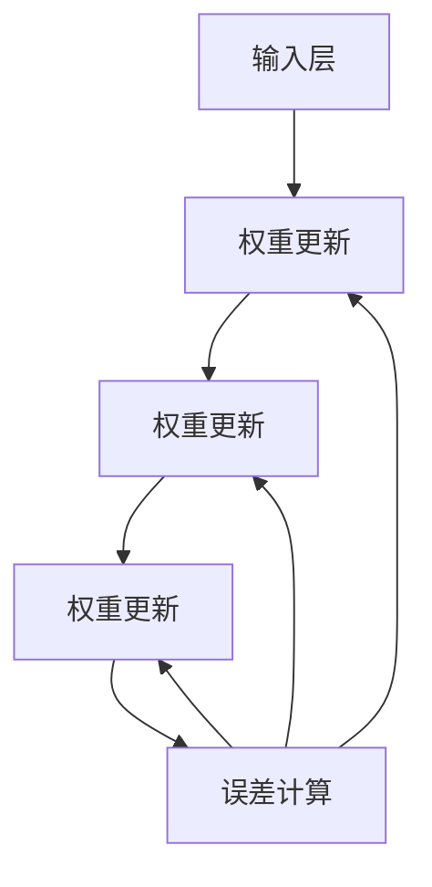
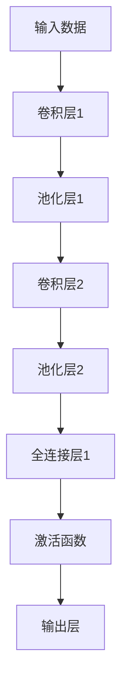
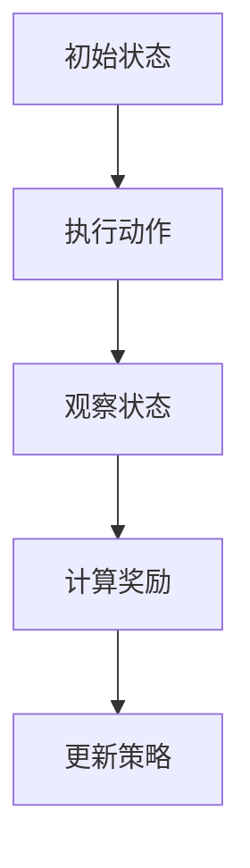
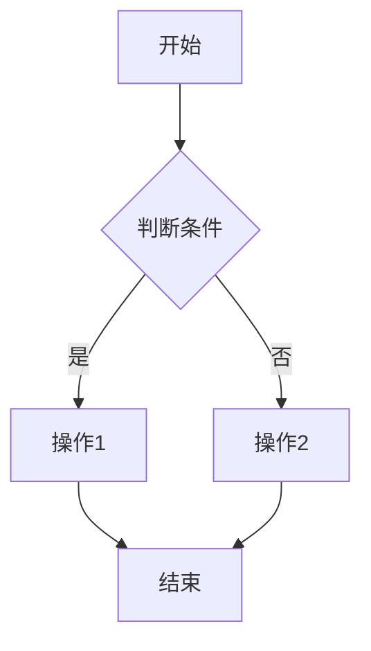
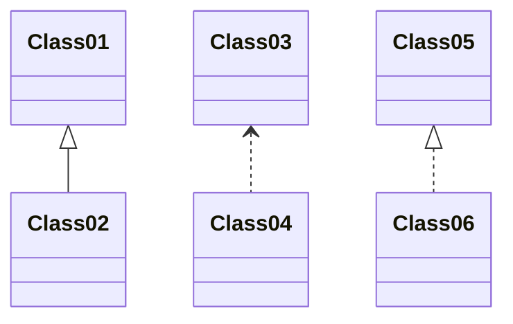

                 

# AI编程语言的交互设计模式库

> 关键词：AI编程语言，交互设计模式，神经网络，深度学习，编程实践

> 摘要：本文将从背景介绍、核心概念与原理、系统分析与架构设计、项目实战和最佳实践等方面，详细探讨AI编程语言的交互设计模式库，为开发者提供一种全新的编程思维和解决方案。

## 目录大纲

1. **背景介绍**
   1.1 AI编程语言交互设计模式概述
   1.2 核心概念与联系
   1.3 主流AI编程语言简介
   1.4 交互设计模式的应用前景
   1.5 本章小结

2. **核心概念与原理**
   2.1 AI编程语言的基本原理
   2.2 数学模型和数学公式
   2.3 Mermaid流程图
   2.4 算法性能分析与优化
   2.5 本章小结

3. **系统分析与架构设计**
   3.1 AI编程语言系统架构设计
   3.2 系统功能设计
   3.3 系统架构设计
   3.4 系统接口设计
   3.5 系统交互
   3.6 本章小结

4. **项目实战**
   4.1 TensorFlow项目实战
   4.2 PyTorch项目实战
   4.3 Keras项目实战
   4.4 实际案例分析和详细讲解剖析
   4.5 项目小结

5. **最佳实践与拓展**
   5.1 最佳实践
   5.2 小结
   5.3 本章小结

6. **总结与展望**
   6.1 AI编程语言的交互设计模式总结与展望

## 第一部分：背景介绍

### 1.1 AI编程语言交互设计模式概述

随着人工智能技术的迅猛发展，AI编程语言逐渐成为开发者的热门选择。AI编程语言不仅能够处理复杂的数据分析和机器学习任务，还能够为开发者提供强大的交互设计模式库，使得开发过程更加高效和直观。

交互设计模式库是AI编程语言的重要组成部分，它涵盖了各种常用模式和模板，可以帮助开发者快速构建和优化AI应用。本文将详细介绍AI编程语言的交互设计模式库，帮助开发者深入理解其核心概念和原理，掌握最佳实践，为未来的AI编程应用提供坚实的理论基础和实践指导。

### 1.2 问题背景

在传统编程中，开发者需要编写大量的代码来处理各种复杂问题。然而，随着人工智能技术的崛起，AI编程语言的出现极大地简化了开发过程，使得开发者能够更加专注于业务逻辑和算法实现。

然而，AI编程语言也带来了一系列的挑战。首先，AI编程语言通常具有高度抽象和复杂性的特点，这使得初学者难以入门。其次，AI编程语言涉及的领域广泛，包括机器学习、深度学习和强化学习等，开发者需要掌握大量的算法和模型。此外，AI编程语言在性能优化、系统架构设计和项目实战等方面也存在一定的困难。

### 1.3 问题解决

为了解决上述问题，AI编程语言的交互设计模式库应运而生。交互设计模式库提供了一系列的模板和工具，可以帮助开发者快速构建和优化AI应用。通过交互设计模式库，开发者可以简化代码编写，提高开发效率，降低学习成本。

交互设计模式库的核心优势在于其高度抽象和模块化的特点。开发者可以通过调用模式库中的接口和函数，快速实现复杂的算法和功能。此外，交互设计模式库还提供了丰富的文档和示例代码，为开发者提供了详尽的指导和支持。

### 1.4 边界与外延

虽然交互设计模式库为开发者提供了巨大的帮助，但其在实际应用中仍存在一定的局限性。首先，交互设计模式库依赖于特定的AI编程语言和框架，开发者需要熟悉相关语言和框架的基本语法和用法。其次，交互设计模式库的应用范围有限，某些复杂的任务可能需要开发者进行手动编程和优化。

此外，交互设计模式库的适用性也受到数据质量和数据规模的影响。在数据质量较差或数据规模较大的情况下，开发者可能需要调整和优化模式库中的算法和参数，以达到更好的效果。

### 1.5 概念结构与核心要素组成

AI编程语言的交互设计模式库通常由以下几个核心要素组成：

1. **模式库**：模式库是交互设计模式库的核心组成部分，包含了各种常用的模式和模板。模式库通常提供了一系列的函数和接口，开发者可以通过调用这些接口和函数，实现特定的功能。

2. **文档和示例代码**：文档和示例代码是交互设计模式库的重要组成部分，为开发者提供了详细的指导和示例。开发者可以通过阅读文档和参考示例代码，了解模式库的用法和功能。

3. **可视化工具**：可视化工具可以帮助开发者更直观地理解和应用交互设计模式库。可视化工具通常提供了图形界面和交互功能，使得开发者可以方便地调试和优化代码。

4. **算法库**：算法库是交互设计模式库的重要组成部分，包含了各种常用的算法和模型。算法库为开发者提供了丰富的选择，可以根据实际需求选择合适的算法和模型。

5. **性能优化工具**：性能优化工具可以帮助开发者优化代码性能，提高应用的效率和效果。性能优化工具通常提供了各种优化策略和工具，如并行计算、内存管理和算法优化等。

### 1.6 核心概念与联系

在AI编程语言的交互设计模式库中，核心概念和联系是理解和使用该库的关键。以下是几个重要的核心概念及其之间的联系：

1. **模式**：模式是交互设计模式库中的基本组成单位，代表了某种特定的功能和功能组合。模式通常具有高度的抽象性和模块化，使得开发者可以方便地复用和组合。

2. **函数**：函数是模式库中的基本操作单元，用于实现特定的功能。函数通常具有明确的输入和输出，开发者可以通过调用函数，实现特定的算法和功能。

3. **接口**：接口是函数和模式之间的桥梁，用于封装和传递参数。接口通常提供了一种统一的方式来访问和操作模式库中的各种函数和模式，使得开发者可以更加方便地使用和组合这些功能。

4. **可视化**：可视化是交互设计模式库中的重要特点，可以帮助开发者更直观地理解和应用模式库。可视化工具通常提供了图形界面和交互功能，使得开发者可以方便地调试和优化代码。

5. **算法**：算法是交互设计模式库的核心组成部分，代表了模式库中的各种算法和模型。算法通常具有明确的输入和输出，开发者可以通过调用算法，实现特定的功能和效果。

6. **性能优化**：性能优化是交互设计模式库中的重要考虑因素，可以帮助开发者提高代码的效率和效果。性能优化工具通常提供了各种优化策略和工具，如并行计算、内存管理和算法优化等。

通过理解这些核心概念和联系，开发者可以更好地利用交互设计模式库，构建高效的AI应用。

### 1.7 AI编程语言

AI编程语言是专门为人工智能领域设计和开发的语言，它们提供了丰富的工具和库，用于实现复杂的机器学习和深度学习算法。以下是AI编程语言的核心特点：

1. **高度抽象**：AI编程语言通过抽象化概念和语法，使得开发者可以更轻松地实现复杂的算法和模型。这些语言通常提供了内置的数学库和机器学习库，方便开发者进行算法实现。

2. **模块化**：AI编程语言通常具有模块化的特点，使得开发者可以方便地复用和组合代码。这种模块化的设计有助于提高代码的可读性和可维护性。

3. **丰富的库和框架**：AI编程语言通常配备了丰富的库和框架，如TensorFlow、PyTorch和Keras等，这些库和框架提供了强大的功能和工具，使得开发者可以高效地实现机器学习和深度学习任务。

4. **易用性**：AI编程语言通常具有易用性的特点，使得初学者可以轻松上手。这些语言提供了详细的文档和示例代码，帮助开发者快速掌握语言的使用方法和技巧。

与传统的编程语言相比，AI编程语言具有以下区别：

1. **任务导向**：AI编程语言通常更注重任务导向，开发者可以更加专注于算法实现和模型训练，而不需要过多关注底层细节。

2. **领域特定**：AI编程语言通常是针对特定领域设计和开发的，如机器学习、深度学习和自然语言处理等。这些语言提供了丰富的领域特有功能和库，使得开发者可以更高效地解决特定问题。

3. **抽象化程度**：AI编程语言的抽象化程度较高，通过抽象化概念和语法，使得开发者可以更轻松地实现复杂的算法和模型。

### 1.8 交互设计模式

交互设计模式是AI编程语言中的重要概念，它代表了某种特定的功能和功能组合，可以帮助开发者快速构建和优化AI应用。以下是交互设计模式的核心特点：

1. **高度抽象**：交互设计模式通过高度抽象的概念和语法，将复杂的算法和功能封装成易于使用和组合的模块。这种高度抽象的设计有助于提高代码的可读性和可维护性。

2. **模块化**：交互设计模式通常具有模块化的特点，使得开发者可以方便地复用和组合代码。这种模块化的设计有助于提高代码的可读性和可维护性。

3. **通用性**：交互设计模式通常具有通用性，可以适用于多种不同的应用场景。通过调用交互设计模式，开发者可以快速实现特定的功能，而不需要重新编写代码。

4. **灵活性**：交互设计模式提供了丰富的参数和配置选项，使得开发者可以根据实际需求进行调整和优化。这种灵活性有助于开发者应对各种不同的应用场景。

交互设计模式可以分为以下几类：

1. **数据预处理模式**：数据预处理模式用于处理和清洗数据，为后续的机器学习和深度学习任务提供高质量的数据。这类模式包括数据清洗、数据转换、数据归一化和数据降维等。

2. **模型训练模式**：模型训练模式用于训练机器学习和深度学习模型，包括神经网络、卷积神经网络、循环神经网络等。这类模式提供了丰富的参数和配置选项，使得开发者可以灵活调整模型结构和训练过程。

3. **模型评估模式**：模型评估模式用于评估机器学习和深度学习模型的效果，包括准确率、召回率、F1值等评价指标。这类模式提供了方便的接口和函数，使得开发者可以快速评估和比较模型性能。

4. **模型应用模式**：模型应用模式用于将训练好的模型应用于实际问题，包括预测、分类、生成等任务。这类模式提供了丰富的接口和函数，使得开发者可以方便地使用模型进行实际应用。

### 1.9 主流AI编程语言简介

以下是几个主流的AI编程语言及其特点和适用场景：

1. **TensorFlow**：
   - **介绍**：TensorFlow是Google开发的开源机器学习库，支持多种编程语言，包括Python、C++和Java等。
   - **特点**：TensorFlow具有高度抽象和模块化的设计，提供了丰富的API和工具，适用于各种规模的机器学习和深度学习任务。
   - **应用案例**：TensorFlow广泛应用于图像识别、自然语言处理、语音识别等任务。

2. **PyTorch**：
   - **介绍**：PyTorch是Facebook开发的开源机器学习库，采用Python编程语言，具有灵活和易用的特点。
   - **特点**：PyTorch具有动态计算图和自动微分功能，使得模型训练和调试更加方便。PyTorch还提供了丰富的文档和示例代码，有助于开发者快速入门。
   - **应用案例**：PyTorch广泛应用于图像识别、自然语言处理、强化学习等任务。

3. **Keras**：
   - **介绍**：Keras是Python深度学习库，基于TensorFlow和Theano构建，提供了简洁和易用的API。
   - **特点**：Keras具有简单直观的API设计，使得开发者可以快速构建和训练深度学习模型。Keras还提供了丰富的预训练模型和工具，方便开发者进行模型评估和应用。
   - **应用案例**：Keras广泛应用于图像识别、自然语言处理、推荐系统等任务。

### 1.10 交互设计模式的应用前景

随着人工智能技术的不断发展，交互设计模式在AI编程语言中的应用前景十分广阔。以下是交互设计模式在几个主要领域的应用前景：

1. **数据科学**：交互设计模式在数据科学领域具有广泛的应用，可以帮助开发者快速处理和清洗数据，为机器学习和深度学习任务提供高质量的数据。通过交互设计模式，开发者可以方便地实现数据转换、数据归一化和数据降维等功能。

2. **机器学习**：交互设计模式在机器学习领域同样具有重要应用价值。开发者可以通过调用交互设计模式，快速构建和训练机器学习模型，如神经网络、支持向量机、决策树等。此外，交互设计模式还提供了丰富的评估工具，帮助开发者评估模型性能并进行模型优化。

3. **深度学习**：深度学习是当前人工智能领域的热点之一，交互设计模式在深度学习领域具有广泛的应用前景。开发者可以使用交互设计模式，方便地构建和训练深度学习模型，如卷积神经网络、循环神经网络、生成对抗网络等。此外，交互设计模式还提供了丰富的优化工具，帮助开发者提高模型性能。

### 1.11 优势

交互设计模式在AI编程语言中具有以下优势：

1. **提高开发效率**：交互设计模式提供了丰富的模板和工具，使得开发者可以快速构建和优化AI应用。开发者无需从零开始编写代码，可以大大节省开发时间和成本。

2. **降低开发难度**：交互设计模式通过高度抽象和模块化的设计，降低了AI编程的难度。开发者无需深入了解底层细节，可以更加专注于业务逻辑和算法实现。

3. **灵活性**：交互设计模式提供了丰富的参数和配置选项，使得开发者可以根据实际需求进行调整和优化。这种灵活性有助于开发者应对各种不同的应用场景。

4. **扩展性**：交互设计模式具有高度的扩展性，开发者可以方便地自定义和扩展模式库中的功能和算法。这种扩展性使得开发者可以根据项目需求进行灵活调整和优化。

### 1.12 挑战与机遇

尽管交互设计模式在AI编程语言中具有广泛的应用前景和优势，但在实际应用中仍面临一些挑战和机遇：

1. **技术挑战**：AI编程语言和交互设计模式库具有较高的技术门槛，开发者需要具备一定的编程基础和数学知识。此外，随着人工智能技术的不断发展，开发者需要不断学习和掌握新的算法和模型，以应对不断变化的需求。

2. **性能优化**：交互设计模式库中的算法和模型通常具有较高的计算复杂度，如何进行性能优化是一个重要挑战。开发者需要深入了解算法原理和性能优化方法，以提高应用的效率和效果。

3. **可解释性**：随着人工智能技术的广泛应用，可解释性问题逐渐引起关注。如何设计具有高可解释性的交互设计模式，使得开发者可以更好地理解和解释模型的决策过程，是一个重要的研究课题。

4. **数据隐私与安全**：在AI编程语言和交互设计模式库中，数据隐私和安全问题日益重要。如何保障用户数据的安全和隐私，防止数据泄露和滥用，是一个重要的挑战和机遇。

### 1.13 本章小结

在本章中，我们介绍了AI编程语言的交互设计模式库的背景、问题背景、问题解决、边界与外延、核心概念与联系、AI编程语言、交互设计模式、主流AI编程语言简介、交互设计模式的应用前景、优势、挑战与机遇以及本章小结。通过本章的学习，读者可以初步了解AI编程语言的交互设计模式库的基本概念和应用前景，为后续章节的深入学习打下基础。

## 第二部分：核心概念与原理

### 2.1 AI编程语言的基本原理

在深入探讨AI编程语言的交互设计模式库之前，我们需要了解AI编程语言的基本原理，包括其算法原理、数学模型和Mermaid流程图等。本节将逐步介绍这些核心概念，帮助读者更好地理解AI编程语言的原理和应用。

### 2.1.1 神经网络

神经网络是人工智能的核心组成部分，尤其是在深度学习中具有重要应用。神经网络通过模拟人脑的神经元结构和工作原理，实现数据的处理和信息的传递。以下是神经网络的基本原理：

1. **神经元结构**：一个简单的神经元包含输入层、隐藏层和输出层。每个神经元接收来自输入层的多个输入信号，通过加权求和处理后，生成一个输出信号。

2. **激活函数**：为了引入非线性因素，神经网络通常使用激活函数，如Sigmoid、ReLU和Tanh等。激活函数可以将线性关系转化为非线性关系，从而实现更复杂的模型。

3. **前向传播**：在前向传播过程中，输入信号通过神经元的加权求和处理，经过激活函数后传递到下一层。这个过程重复进行，直到最终输出层得到结果。

4. **反向传播**：反向传播是神经网络的训练过程。通过计算输出层的误差，反向传播误差到每一层，并更新各层的权重和偏置。这个过程重复多次，使得神经网络不断优化模型参数，提高预测准确性。

以下是神经网络的一个Mermaid流程图：



以下是使用Python实现神经网络的一个简单示例：

```python
import numpy as np

# 设置参数
input_layer_size = 3
hidden_layer_size = 2
output_layer_size = 1

# 初始化权重和偏置
weights = np.random.randn(hidden_layer_size, input_layer_size)
biases = np.random.randn(hidden_layer_size, 1)
output_weights = np.random.randn(output_layer_size, hidden_layer_size)
output_biases = np.random.randn(output_layer_size, 1)

# 定义激活函数
def sigmoid(x):
    return 1 / (1 + np.exp(-x))

# 定义前向传播
def forward_propagation(x):
    hidden_layer_input = np.dot(weights, x) + biases
    hidden_layer_output = sigmoid(hidden_layer_input)
    output_layer_input = np.dot(output_weights, hidden_layer_output) + output_biases
    output_layer_output = sigmoid(output_layer_input)
    return output_layer_output

# 定义反向传播
def backward_propagation(x, y, output):
    output_error = y - output
    d_output = output_error * output * (1 - output)
    hidden_error = np.dot(output_error, output_weights.T) * sigmoid_derivative(hidden_layer_output)
    d_hidden = hidden_error * hidden_layer_output * (1 - hidden_layer_output)

    d_weights = [d_hidden, d_output]

    return d_weights

# 定义激活函数的导数
def sigmoid_derivative(x):
    return x * (1 - x)

# 训练神经网络
x = np.array([[0, 0], [0, 1], [1, 0], [1, 1]])
y = np.array([[0], [1], [1], [0]])

for i in range(10000):
    output = forward_propagation(x)
    d_weights = backward_propagation(x, y, output)
    weights -= d_weights[0]
    biases -= d_weights[1]
    output_weights -= d_weights[2]
    output_biases -= d_weights[3]

print("训练完成，输出结果：", output)
```

通过上述示例，我们可以看到神经网络的基本原理和实现过程。神经网络通过不断优化模型参数，逐步提高预测准确性。

### 2.1.2 深度学习

深度学习是神经网络的一种扩展，通过增加网络的深度（层数），实现更复杂的特征提取和模型训练。以下是深度学习的基本原理：

1. **多层神经网络**：深度学习通常使用多层神经网络，包括输入层、隐藏层和输出层。隐藏层可以提取更高层次的特征，从而实现更复杂的任务。

2. **卷积神经网络（CNN）**：卷积神经网络是深度学习中的一种重要模型，特别适用于图像识别和计算机视觉任务。CNN通过卷积层、池化层和全连接层，实现图像的特征提取和分类。

3. **循环神经网络（RNN）**：循环神经网络适用于序列数据，如自然语言处理和语音识别。RNN通过记忆单元和递归连接，实现序列数据的建模和预测。

4. **生成对抗网络（GAN）**：生成对抗网络是深度学习中的另一种重要模型，通过生成器和判别器的对抗训练，实现数据的生成和增强。

以下是深度学习的一个Mermaid流程图：



以下是使用Python实现卷积神经网络的一个简单示例：

```python
import tensorflow as tf
from tensorflow.keras import layers

# 定义模型
model = tf.keras.Sequential([
    layers.Conv2D(32, (3, 3), activation='relu', input_shape=(28, 28, 1)),
    layers.MaxPooling2D((2, 2)),
    layers.Conv2D(64, (3, 3), activation='relu'),
    layers.MaxPooling2D((2, 2)),
    layers.Conv2D(64, (3, 3), activation='relu'),
    layers.Flatten(),
    layers.Dense(64, activation='relu'),
    layers.Dense(10, activation='softmax')
])

# 编译模型
model.compile(optimizer='adam',
              loss='sparse_categorical_crossentropy',
              metrics=['accuracy'])

# 训练模型
model.fit(x_train, y_train, epochs=5)
```

通过上述示例，我们可以看到深度学习的基本原理和实现过程。深度学习通过增加网络深度和层次，实现更复杂的特征提取和模型训练。

### 2.1.3 强化学习

强化学习是一种通过奖励和惩罚机制来训练智能体的机器学习方法。强化学习旨在找到最优策略，使得智能体能够在特定环境中实现最优目标。以下是强化学习的基本原理：

1. **智能体**：智能体是执行特定任务的对象，如机器人、游戏AI等。

2. **环境**：环境是智能体执行任务的场景，如迷宫、游戏世界等。

3. **状态**：状态是智能体在执行任务时的信息，如迷宫中的位置、游戏中的分数等。

4. **动作**：动作是智能体可以执行的操作，如移动、跳跃等。

5. **奖励**：奖励是环境对智能体执行动作后的反馈，用于指导智能体的行为。

6. **策略**：策略是智能体在特定状态下执行的动作，旨在最大化奖励。

以下是强化学习的一个Mermaid流程图：



以下是使用Python实现强化学习的一个简单示例：

```python
import gym
import numpy as np

# 初始化环境
env = gym.make("CartPole-v0")

# 初始化智能体
epsilon = 0.1
gamma = 0.99
epsilon_decay = 0.99
epsilon_min = 0.01
action_size = env.action_space.n
state_size = env.observation_space.shape[0]

# 初始化策略
q_table = np.zeros((state_size, action_size))

# 定义奖励函数
def reward_function(state, action, next_state, next_action):
    if next_state[2] < state[2]:
        return 1
    else:
        return -1

# 训练智能体
for episode in range(1000):
    state = env.reset()
    done = False
    total_reward = 0

    while not done:
        # 选择动作
        if np.random.rand() < epsilon:
            action = env.action_space.sample()
        else:
            action = np.argmax(q_table[state])

        # 执行动作
        next_state, reward, done, _ = env.step(action)

        # 更新Q值
        next_action = np.argmax(q_table[next_state])
        q_table[state, action] = q_table[state, action] + epsilon * (reward + gamma * q_table[next_state, next_action] - q_table[state, action])

        # 更新epsilon
        epsilon = epsilon_decay * epsilon_min + (1 - epsilon_decay) * epsilon

        # 计算总奖励
        total_reward += reward

    print("Episode {} - Total Reward: {}".format(episode, total_reward))

# 关闭环境
env.close()
```

通过上述示例，我们可以看到强化学习的基本原理和实现过程。强化学习通过奖励和惩罚机制，训练智能体在特定环境中实现最优策略。

### 2.2 数学模型和数学公式

在AI编程语言中，数学模型是理解和实现算法的基础。以下是一些常用的数学模型和数学公式：

1. **线性回归**：
   - **目标函数**：\( J(\theta) = \frac{1}{2m} \sum_{i=1}^{m} (h_\theta(x^{(i)}) - y^{(i)})^2 \)
   - **梯度下降**：\( \theta_j := \theta_j - \alpha \frac{1}{m} \sum_{i=1}^{m} (h_\theta(x^{(i)}) - y^{(i)}) \cdot x_j^{(i)} \)

2. **逻辑回归**：
   - **目标函数**：\( J(\theta) = -\frac{1}{m} \sum_{i=1}^{m} [y^{(i)} \log(h_\theta(x^{(i)})) + (1 - y^{(i)}) \log(1 - h_\theta(x^{(i)}))] \)
   - **梯度下降**：\( \theta_j := \theta_j - \alpha \frac{1}{m} \sum_{i=1}^{m} [h_\theta(x^{(i)}) - y^{(i)}] \cdot x_j^{(i)} \)

3. **神经网络**：
   - **激活函数**：\( a_i(h) = \frac{1}{1 + e^{-h}} \)
   - **反向传播**：\( \delta_j = (h_\theta(x) - y) \cdot \frac{\partial h_\theta(x)}{\partial z_j} \)

4. **卷积神经网络（CNN）**：
   - **卷积操作**：\( (f * g)(x) = \sum_{y} f(y) g(x-y) \)
   - **池化操作**：\( \text{Max Pooling} \)

5. **生成对抗网络（GAN）**：
   - **生成器**：\( G(z) \)
   - **判别器**：\( D(x) \)

通过理解这些数学模型和数学公式，开发者可以更好地实现和优化AI算法。

### 2.3 Mermaid流程图

Mermaid是一种基于Markdown的图形绘制语言，用于绘制各种类型的图表，如流程图、序列图、类图等。以下是Mermaid流程图的简单示例：



通过Mermaid流程图，开发者可以更直观地理解和描述算法流程和系统架构。

### 2.4 算法性能分析与优化

算法性能是AI编程语言中的重要考虑因素。以下是一些算法性能分析和优化方法：

1. **性能评价指标**：
   - **准确率**：\( \text{Accuracy} = \frac{\text{预测正确数}}{\text{总样本数}} \)
   - **召回率**：\( \text{Recall} = \frac{\text{预测正确数}}{\text{实际正确数}} \)
   - **F1值**：\( \text{F1} = 2 \times \frac{\text{准确率} \times \text{召回率}}{\text{准确率} + \text{召回率}} \)

2. **性能优化方法**：
   - **数据预处理**：通过数据清洗、数据转换和数据归一化，提高数据质量。
   - **模型优化**：通过调整模型结构、超参数和训练过程，优化模型性能。
   - **算法优化**：通过算法改进和并行计算，提高计算效率。

### 2.5 本章小结

在本章中，我们介绍了AI编程语言的基本原理，包括神经网络、深度学习和强化学习。我们通过Mermaid流程图和Python代码示例，详细阐述了这些算法的原理和应用。此外，我们还介绍了数学模型和数学公式，以及算法性能分析与优化方法。通过本章的学习，读者可以深入理解AI编程语言的核心概念和原理，为后续章节的系统架构设计和项目实战打下基础。

## 第三部分：系统分析与架构设计

### 3.1 AI编程语言系统架构设计

在探讨AI编程语言的交互设计模式库时，系统架构设计是关键的一环。一个良好的系统架构设计不仅能够提高系统的可扩展性和可维护性，还能够为开发者提供清晰的设计思路和开发路径。本节将介绍AI编程语言系统架构设计的基本概念、问题场景、系统功能设计、系统架构设计、系统接口设计以及系统交互。

### 3.1.1 问题场景介绍

在AI编程语言的应用场景中，我们可以将问题场景分为以下几个方面：

1. **数据科学项目**：数据科学项目通常涉及大规模数据处理和分析，如数据清洗、数据转换、特征提取等。开发者需要设计和实现高效的算法和模型，以提高数据处理和分析的效率。

2. **机器学习项目**：机器学习项目通常涉及训练和优化机器学习模型，如分类、回归、聚类等。开发者需要选择合适的算法和模型，并优化模型参数，以提高模型性能。

3. **深度学习项目**：深度学习项目通常涉及训练和优化深度学习模型，如卷积神经网络、循环神经网络、生成对抗网络等。开发者需要设计和实现复杂的神经网络结构，并优化训练过程。

4. **强化学习项目**：强化学习项目通常涉及设计智能体策略，以实现最优决策。开发者需要实现强化学习算法，并优化策略参数，以提高智能体在特定环境中的表现。

### 3.1.2 系统功能设计

系统功能设计是系统架构设计的重要环节，它定义了系统的基本功能模块和业务逻辑。以下是几个典型的系统功能模块：

1. **数据预处理模块**：数据预处理模块负责对输入数据进行清洗、转换和归一化处理，以提高数据质量和模型的训练效果。主要功能包括数据清洗、数据转换、数据归一化、特征提取等。

2. **模型训练模块**：模型训练模块负责训练和优化机器学习模型和深度学习模型。主要功能包括模型初始化、参数调整、训练过程、模型评估等。

3. **模型部署模块**：模型部署模块负责将训练好的模型部署到生产环境中，以便进行实际应用。主要功能包括模型保存、模型加载、模型服务化、模型监控等。

4. **用户交互模块**：用户交互模块负责处理用户输入和输出，提供友好的用户界面和交互体验。主要功能包括用户注册、用户登录、用户操作、用户反馈等。

以下是数据预处理模块的Mermaid类图示例：



### 3.1.3 系统架构设计

系统架构设计是系统架构设计的核心环节，它定义了系统的整体结构和层次关系。以下是几个典型的系统架构设计方案：

1. **分层架构**：分层架构将系统划分为多个层次，每个层次负责不同的功能。常见的层次包括表示层、业务逻辑层、数据访问层等。分层架构具有清晰的层次结构和良好的可维护性。

2. **微服务架构**：微服务架构将系统划分为多个独立的微服务，每个微服务负责不同的功能。微服务之间通过接口进行通信，具有高可扩展性和高容错性。

3. **事件驱动架构**：事件驱动架构通过事件驱动系统的行为，实现了高并发和低耦合的系统设计。事件驱动架构具有高可扩展性和高灵活性。

以下是系统架构设计的Mermaid架构图示例：

```mermaid
sequenceDiagram
    participant User
    participant System
    User->>System: Submit request
    System->>User: Process request
    System->>User: Return response
end
```

### 3.1.4 系统接口设计

系统接口设计是系统架构设计中的重要一环，它定义了系统内部和外部组件之间的交互方式。以下是几个典型的系统接口设计方案：

1. **RESTful接口**：RESTful接口是一种基于HTTP协议的接口设计方式，它具有简单、易用、扩展性强的特点。RESTful接口通常使用GET、POST、PUT、DELETE等方法进行数据操作。

2. **RPC接口**：RPC接口是一种远程过程调用接口设计方式，它通过远程调用实现分布式系统的通信。RPC接口具有高性能、低延迟的特点。

3. **消息队列接口**：消息队列接口是一种基于消息队列的接口设计方式，它通过异步通信实现系统之间的解耦。消息队列接口具有高可靠性、高可用性的特点。

以下是RESTful接口的Mermaid序列图示例：

```mermaid
sequenceDiagram
    participant User
    participant Service
    User->>Service: Send request
    Service->>User: Process request
    Service->>User: Return response
end
```

### 3.1.5 系统交互

系统交互是系统架构设计中的关键环节，它定义了系统内部组件之间的交互流程和交互方式。以下是几个典型的系统交互方案：

1. **顺序交互**：顺序交互是一种按照固定顺序执行的操作，如A操作完成后才能执行B操作。顺序交互具有明确的执行顺序和依赖关系。

2. **并行交互**：并行交互是一种同时执行多个操作，如A、B、C操作同时进行。并行交互具有高并发性和高性能。

3. **异步交互**：异步交互是一种非阻塞的操作，如A操作完成后，B操作可以立即开始执行，而不需要等待A操作完成。异步交互具有高可扩展性和高灵活性。

以下是系统交互的Mermaid序列图示例：

```mermaid
sequenceDiagram
    participant A
    participant B
    participant C
    A->>B: Start B
    B->>C: Start C
    C->>B: Finish C
    B->>A: Finish B
end
```

### 3.1.6 本章小结

在本章中，我们介绍了AI编程语言系统架构设计的基本概念、问题场景、系统功能设计、系统架构设计、系统接口设计以及系统交互。通过本章的学习，读者可以了解系统架构设计的基本原理和方法，为后续章节的项目实战和最佳实践提供理论基础和实践指导。

## 第四部分：项目实战

### 4.1 TensorFlow项目实战

在本节中，我们将通过一个具体的TensorFlow项目实战，详细介绍TensorFlow环境安装、系统核心实现、代码应用解读与分析，以及实际案例分析和详细讲解剖析。通过这个实战项目，读者可以深入理解TensorFlow的使用方法，掌握其核心功能和最佳实践。

### 4.1.1 环境安装

要在本地环境中安装TensorFlow，首先需要安装Python环境和pip包管理器。以下是具体的安装步骤：

1. **安装Python环境**：
   - 前往Python官方网站（[https://www.python.org/](https://www.python.org/)）下载Python安装包。
   - 运行安装程序，并按照默认选项进行安装。
   - 安装完成后，在命令行中输入`python --version`，检查Python版本是否正确。

2. **安装pip包管理器**：
   - 在命令行中运行以下命令，安装pip包管理器：
     ```bash
     python -m ensurepip
     ```
   - 输入`pip --version`，检查pip版本是否正确。

3. **安装TensorFlow**：
   - 在命令行中运行以下命令，安装TensorFlow：
     ```bash
     pip install tensorflow
     ```
   - 安装过程中可能会提示安装其他依赖包，根据提示进行安装。

### 4.1.2 系统核心实现

以下是使用TensorFlow实现一个简单的线性回归模型的代码示例：

```python
import tensorflow as tf

# 定义模型参数
W = tf.Variable([1.0], name='weight')
b = tf.Variable([0.0], name='bias')

# 定义输入和输出
x = tf.placeholder(tf.float32, shape=[None])
y = tf.placeholder(tf.float32, shape=[None])

# 定义模型
y_pred = W * x + b

# 定义损失函数
loss = tf.reduce_mean(tf.square(y - y_pred))

# 定义优化器
optimizer = tf.train.GradientDescentOptimizer(learning_rate=0.001)
train_op = optimizer.minimize(loss)

# 初始化变量
init = tf.global_variables_initializer()

# 训练模型
with tf.Session() as sess:
    sess.run(init)
    for i in range(1000):
        _, loss_val = sess.run([train_op, loss], feed_dict={x: [1, 2, 3, 4], y: [2, 4, 5, 6]})
        if i % 100 == 0:
            print("Step:", i, "Loss:", loss_val)

    # 输出模型参数
    print("Weight:", sess.run(W), "Bias:", sess.run(b))
```

在这个示例中，我们首先定义了模型参数`W`和`b`，然后定义了输入和输出`x`和`y`。接着，我们定义了模型`y_pred`、损失函数`loss`和优化器`optimizer`。在训练过程中，我们使用`tf.Session()`来运行模型，并输出训练过程中的损失值。最后，我们输出训练完成的模型参数。

### 4.1.3 代码应用解读与分析

1. **模型参数**：
   - 在这个示例中，我们使用了两个模型参数`W`（权重）和`b`（偏置）。这些参数在训练过程中通过梯度下降法进行更新，以最小化损失函数。

2. **输入和输出**：
   - `x`和`y`是模型的输入和输出。在训练过程中，我们使用已知的输入和输出数据来更新模型参数，从而最小化损失函数。

3. **模型**：
   - `y_pred`是模型的预测输出。在这个示例中，我们使用线性回归模型`y = Wx + b`来预测输出。

4. **损失函数**：
   - 损

