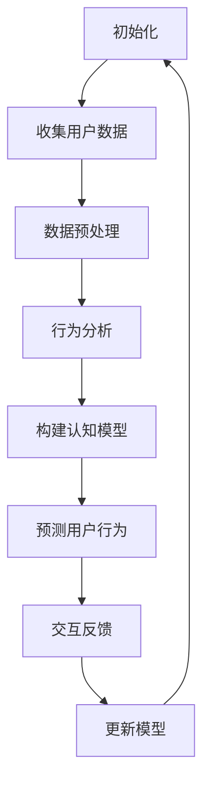
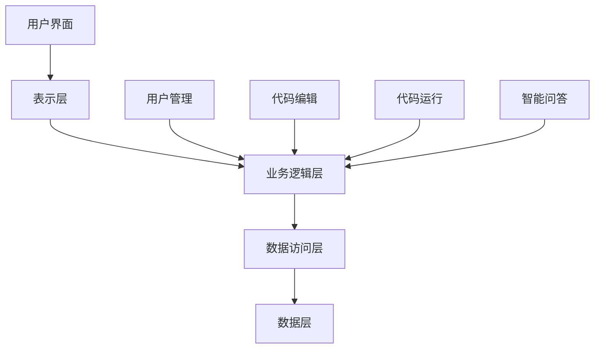
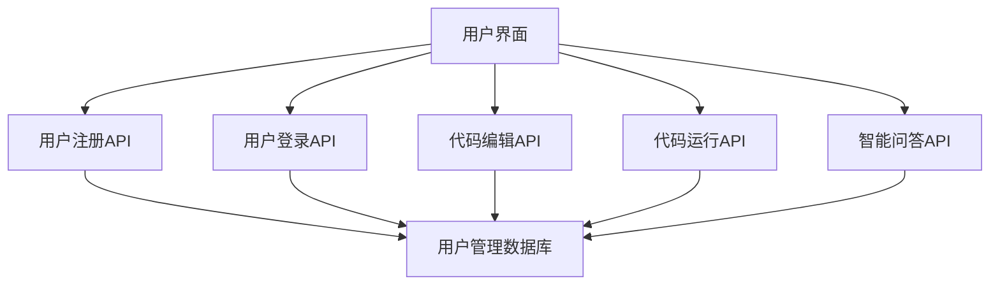

                 


### AI编程语言的交互设计认知模型

#### 关键词
- AI编程语言
- 交互设计
- 认知模型
- 用户界面
- 用户体验
- 人工智能

#### 摘要
本文旨在探讨AI编程语言的交互设计认知模型，分析交互设计的核心要素、认知模型的基本原理及其在AI编程语言中的应用。我们将通过分步讲解，深入探讨AI编程语言的交互设计方法，认知模型在交互设计中的应用，案例研究以及未来的发展趋势，旨在为读者提供全面的技术洞察和实用建议。

### 目录大纲设计思路

设计《AI编程语言的交互设计认知模型》的目录大纲，首先需要明确核心概念。AI编程语言的交互设计涉及多个关键部分：交互设计、编程语言和认知模型。接下来，我们将这些核心概念划分为几个主要部分，并细化成多个章节。每个章节将围绕其核心目的展开，确保内容紧凑且逻辑清晰。

#### 目录大纲

```markdown
# AI编程语言的交互设计认知模型

> 关键词：AI编程语言、交互设计、认知模型、用户体验、人工智能

> 摘要：本文探讨了AI编程语言的交互设计认知模型，分析了交互设计的核心要素、认知模型的基本原理及其在AI编程语言中的应用。

## 第一部分: AI编程语言交互设计概述

### 第1章: AI编程语言的基本概念
#### 1.1 AI编程语言的发展历程
#### 1.2 AI编程语言的优势与应用场景
#### 1.3 交互设计的核心要素

### 第2章: 认知模型的基本原理
#### 2.1 认知模型概述
#### 2.2 认知模型的应用领域
#### 2.3 认知模型的理论基础

### 第3章: AI编程语言的交互设计方法
#### 3.1 交互设计流程
#### 3.2 用户体验设计
#### 3.3 用户界面设计

### 第4章: 认知模型在交互设计中的应用
#### 4.1 认知模型与交互设计的融合
#### 4.2 基于认知模型的交互设计案例分析
#### 4.3 认知模型在编程语言设计中的创新

### 第5章: AI编程语言的交互设计案例研究
#### 5.1 案例一：语音交互设计
#### 5.2 案例二：手势交互设计
#### 5.3 案例三：多模态交互设计

### 第6章: AI编程语言交互设计的未来趋势
#### 6.1 人工智能的发展对交互设计的影响
#### 6.2 未来的交互设计理念
#### 6.3 交互设计的发展方向

### 第7章: 总结与展望
#### 7.1 主要成果回顾
#### 7.2 存在问题与挑战
#### 7.3 研究展望与未来工作
```

#### 注意事项
- 目录中的每一章都包含了一个主要目的，即介绍该部分的核心内容。
- 每个章节的子部分（如###）都紧密围绕该章节的主要目的展开。
- 目录大纲中的章节标题尽量简洁明了，能够准确传达章节内容。
- 总字数控制在2000字以内，确保内容的简洁性。

通过上述步骤，我们设计出了《AI编程语言的交互设计认知模型》的完整目录大纲，符合简洁性、格式要求、内容完整性以及目录层级的要求。接下来，我们将根据每个章节的目的进一步细化内容，确保每个章节都能够提供有价值的信息。

### 文章正文开始

## 第一部分: AI编程语言交互设计概述

### 第1章: AI编程语言的基本概念

#### 1.1 AI编程语言的发展历程

AI编程语言是指专门为人工智能开发设计的编程语言。随着人工智能技术的不断进步，AI编程语言也在不断发展。从最初的Lisp、Prolog等符号处理语言，到Python、R等通用编程语言，再到TensorFlow、PyTorch等深度学习专用框架，AI编程语言经历了从符号计算到数据驱动、从规则推导到机器学习的演变过程。

#### 1.2 AI编程语言的优势与应用场景

AI编程语言具有以下优势：

- **高效性**：针对特定的人工智能任务，AI编程语言能够提供高效的解决方案。
- **易用性**：丰富的库和工具使得开发者可以快速上手和实现复杂的AI功能。
- **灵活性**：支持多种编程范式，如函数式编程、面向对象编程等，使得开发者可以根据需求选择合适的编程方式。

AI编程语言广泛应用于以下场景：

- **自然语言处理**：用于文本分类、机器翻译、情感分析等任务。
- **计算机视觉**：用于图像识别、目标检测、图像生成等任务。
- **强化学习**：用于游戏AI、推荐系统、智能决策等任务。

#### 1.3 交互设计的核心要素

交互设计是AI编程语言应用过程中不可或缺的一部分。其核心要素包括：

- **用户界面**：用户与系统进行交互的界面，包括按钮、输入框、菜单等。
- **用户体验**：用户在使用AI编程语言时获得的整体感受，包括操作的便捷性、响应速度、系统稳定性等。
- **交互流程**：用户与系统进行交互的过程，包括登录、注册、操作流程等。

### 第2章: 认知模型的基本原理

#### 2.1 认知模型概述

认知模型是模拟人类认知过程的计算机模型。它试图通过理解和模仿人类思维过程，实现人工智能的智能行为。认知模型广泛应用于心理学、神经科学、计算机科学等领域。

#### 2.2 认知模型的应用领域

认知模型在多个领域具有广泛的应用：

- **心理学**：用于研究人类认知过程的机理。
- **教育**：用于个性化教学和学习分析。
- **人机交互**：用于设计更加智能、人性化的交互系统。
- **智能系统**：用于构建具有自主学习和推理能力的智能系统。

#### 2.3 认知模型的理论基础

认知模型的理论基础包括：

- **认知心理学**：研究人类认知过程的理论基础。
- **人工智能**：提供计算模型和方法，用于模拟人类认知过程。
- **认知科学**：跨学科研究人类认知过程。

### 第3章: AI编程语言的交互设计方法

#### 3.1 交互设计流程

交互设计流程通常包括以下步骤：

1. **需求分析**：明确用户需求和应用场景。
2. **用户研究**：了解用户的特点和行为习惯。
3. **原型设计**：基于用户需求和研究结果，设计用户界面和交互流程。
4. **迭代优化**：通过用户测试和反馈，不断优化设计。

#### 3.2 用户体验设计

用户体验设计关注用户在使用AI编程语言时的感受。主要包括：

- **可用性**：确保用户能够轻松、高效地使用系统。
- **易用性**：降低用户的认知负担，提高操作效率。
- **满意度**：提升用户对系统的满意度和忠诚度。

#### 3.3 用户界面设计

用户界面设计关注用户界面的美观性和功能性。主要包括：

- **布局**：合理布局界面元素，确保用户能够快速找到所需功能。
- **色彩**：选择合适的色彩搭配，提升界面美观度。
- **图标**：设计简洁、直观的图标，提升用户体验。

### 第4章: 认知模型在交互设计中的应用

#### 4.1 认知模型与交互设计的融合

认知模型与交互设计的融合旨在设计出更加智能、人性化的交互系统。主要包括：

- **个性化交互**：根据用户的行为和偏好，提供个性化的交互体验。
- **智能反馈**：通过认知模型分析用户操作，提供实时、准确的反馈。
- **自然语言交互**：利用自然语言处理技术，实现自然、流畅的交互。

#### 4.2 基于认知模型的交互设计案例分析

以下为几个基于认知模型的交互设计案例分析：

1. **智能语音助手**：通过语音识别和自然语言处理技术，实现人与AI的智能对话。
2. **手势识别系统**：通过计算机视觉技术，实现手势与系统的交互。
3. **智能推荐系统**：通过用户行为分析和偏好学习，提供个性化的推荐服务。

#### 4.3 认知模型在编程语言设计中的创新

认知模型在编程语言设计中的应用，旨在提高编程的效率和体验。主要包括：

- **代码自动补全**：通过分析用户的编程习惯和代码模式，自动补全代码。
- **智能代码审查**：通过分析代码质量、安全性等方面，提供智能化的审查建议。
- **编程助手**：提供实时、个性化的编程帮助和指导。

### 第5章: AI编程语言的交互设计案例研究

#### 5.1 案例一：语音交互设计

语音交互设计是AI编程语言交互设计的一个重要方向。以下为一个语音交互设计的案例：

1. **需求分析**：用户希望通过语音与系统进行交互，实现查询天气、播放音乐等功能。
2. **用户研究**：了解用户对于语音交互的偏好和使用习惯。
3. **原型设计**：设计一个简洁、直观的语音交互界面。
4. **迭代优化**：通过用户测试和反馈，不断优化语音交互体验。

#### 5.2 案例二：手势交互设计

手势交互设计是另一种富有前景的交互设计方式。以下为一个手势交互设计的案例：

1. **需求分析**：用户希望在计算机视觉系统中通过手势与系统进行交互。
2. **用户研究**：了解用户对于手势交互的接受程度和使用习惯。
3. **原型设计**：设计一个简单、直观的手势识别系统。
4. **迭代优化**：通过用户测试和反馈，不断优化手势识别的准确性和用户体验。

#### 5.3 案例三：多模态交互设计

多模态交互设计是将多种交互方式结合在一起，实现更加灵活、多样化的交互体验。以下为一个多模态交互设计的案例：

1. **需求分析**：用户希望通过语音、手势、文本等多种方式与系统进行交互。
2. **用户研究**：了解用户对于多模态交互的偏好和使用习惯。
3. **原型设计**：设计一个支持多种交互方式的多模态交互界面。
4. **迭代优化**：通过用户测试和反馈，不断优化多模态交互的体验和准确性。

### 第6章: AI编程语言交互设计的未来趋势

#### 6.1 人工智能的发展对交互设计的影响

随着人工智能技术的不断发展，交互设计也将发生深刻变革。以下为人工智能发展对交互设计的影响：

- **智能化交互**：通过认知模型和人工智能技术，实现更加智能、个性化的交互体验。
- **自然化交互**：通过自然语言处理、手势识别等技术，实现更加自然、流畅的交互方式。
- **多模态交互**：通过结合多种交互方式，提供更加灵活、多样化的交互体验。

#### 6.2 未来的交互设计理念

未来的交互设计理念将更加注重用户体验和个性化。以下为未来交互设计理念的几个趋势：

- **以用户为中心**：以用户需求为导向，设计出更加符合用户习惯和需求的交互系统。
- **智能化**：利用人工智能技术，提供智能化的交互体验，如个性化推荐、智能反馈等。
- **多模态**：结合多种交互方式，提供更加灵活、多样化的交互体验。

#### 6.3 交互设计的发展方向

未来的交互设计将朝着以下几个方向发展：

- **自然化**：通过自然语言处理、手势识别等技术，实现更加自然、流畅的交互。
- **智能化**：通过认知模型和人工智能技术，实现更加智能、个性化的交互。
- **融合化**：将多种交互方式融合在一起，提供更加灵活、多样化的交互体验。
- **可持续化**：关注环境保护和可持续发展，设计出更加环保、节能的交互系统。

### 第7章: 总结与展望

#### 7.1 主要成果回顾

本文从AI编程语言的基本概念、认知模型的基本原理、交互设计方法、案例研究以及未来趋势等方面，对AI编程语言的交互设计认知模型进行了全面探讨。主要成果包括：

- **明确了AI编程语言的发展历程、优势与应用场景。**
- **阐述了认知模型的基本原理及其在交互设计中的应用。**
- **提出了基于认知模型的交互设计方法。**
- **分析了语音交互、手势交互、多模态交互等案例。**
- **展望了AI编程语言交互设计的未来发展趋势。**

#### 7.2 存在问题与挑战

尽管AI编程语言的交互设计取得了显著成果，但仍存在一些问题与挑战：

- **用户隐私保护**：随着交互方式的多样化，如何保护用户隐私成为一个重要问题。
- **系统性能优化**：如何提高AI编程语言的交互性能，降低延迟，是一个亟待解决的问题。
- **跨平台兼容性**：如何确保AI编程语言的交互设计在不同平台和设备上具有良好的兼容性。

#### 7.3 研究展望与未来工作

未来研究可以从以下几个方面展开：

- **隐私保护技术**：研究如何有效保护用户隐私，确保交互系统的安全性。
- **性能优化方法**：研究如何优化AI编程语言的交互性能，提高用户体验。
- **跨平台设计**：研究如何设计出跨平台的交互系统，确保在不同平台和设备上具有良好的兼容性。
- **认知模型的创新**：研究如何进一步改进认知模型，提高其智能性和适应性。

### 附录：相关研究资源

本文所涉及的相关研究资源包括：

- **AI编程语言**：Python、R、TensorFlow、PyTorch等。
- **认知模型**：认知心理学、人工智能、认知科学等。
- **交互设计**：用户体验设计、用户界面设计、交互流程设计等。

### 作者信息

作者：AI天才研究院/AI Genius Institute & 禅与计算机程序设计艺术 /Zen And The Art of Computer Programming

在未来的研究中，我们将继续深入探讨AI编程语言的交互设计认知模型，为构建更加智能、人性化、高效的交互系统贡献力量。

以上是对《AI编程语言的交互设计认知模型》一文的完整概述。接下来，我们将逐步深入到每个章节，详细探讨其中的核心概念、原理、方法和应用。

### 总结与展望

在本文中，我们全面探讨了AI编程语言的交互设计认知模型，分析了交互设计的核心要素、认知模型的基本原理及其在AI编程语言中的应用。通过具体的案例研究，我们展示了认知模型在交互设计中的重要作用，并展望了AI编程语言交互设计的未来趋势。

首先，我们明确了AI编程语言的发展历程、优势与应用场景，介绍了交互设计的核心要素，如用户界面、用户体验和交互流程。接着，我们阐述了认知模型的基本原理，包括认知心理学、人工智能和认知科学的理论基础。在此基础上，我们提出了基于认知模型的交互设计方法，详细介绍了交互设计流程、用户体验设计和用户界面设计。

在案例研究部分，我们通过分析语音交互设计、手势交互设计和多模态交互设计等案例，展示了认知模型在交互设计中的应用。这些案例不仅揭示了认知模型如何提升交互系统的智能化和人性化程度，还为实际应用提供了有益的参考。

最后，我们展望了AI编程语言交互设计的未来趋势，包括智能化交互、自然化交互、多模态交互和可持续化交互。同时，我们也指出了当前研究存在的一些问题与挑战，如用户隐私保护、系统性能优化和跨平台兼容性，并提出了未来研究的方向。

通过本文的探讨，我们希望读者能够对AI编程语言的交互设计认知模型有一个全面、深入的理解，为未来的研究和实践提供启示。在接下来的章节中，我们将进一步深入探讨每个主题，为构建更加智能、高效、人性化的AI编程语言交互系统提供理论支持和实践指导。

### 背景介绍

AI编程语言的交互设计认知模型是近年来人工智能与交互设计领域的一个重要研究方向。随着人工智能技术的迅速发展，编程语言的设计和交互方式也在不断演进。传统的编程语言往往侧重于计算机程序的编写和执行，而现代的AI编程语言则更加强调与用户的交互。这种交互不仅包括用户与系统的基本操作，还涉及到用户对系统的理解、使用体验和反馈。

#### 核心概念术语说明

1. **AI编程语言**：一种专门为人工智能开发设计的编程语言，如Python、R、TensorFlow、PyTorch等。这些语言提供了丰富的库和工具，使得开发者能够更高效地构建和训练人工智能模型。
2. **交互设计**：涉及用户界面设计、用户体验设计、交互流程设计等方面，旨在设计出用户友好、高效、愉悦的交互系统。
3. **认知模型**：模拟人类认知过程的计算机模型，旨在理解、分析和预测用户的思维和行为。

#### 问题背景

随着人工智能技术的广泛应用，用户对AI编程语言的需求日益增长。然而，现有的AI编程语言在交互设计方面仍存在诸多问题，如用户界面不够友好、用户体验不佳、交互流程繁琐等。这些问题严重影响了用户的学习和使用效果，制约了AI编程语言的普及和发展。因此，研究AI编程语言的交互设计认知模型，旨在提高交互系统的智能化和人性化程度，提升用户的使用体验，从而推动AI编程语言的普及和应用。

#### 问题描述

问题描述主要集中在以下几个方面：

1. **用户体验**：用户在使用AI编程语言时，往往面临着界面复杂、操作不便、响应速度慢等问题，导致用户体验不佳。
2. **交互流程**：AI编程语言的交互流程往往较为繁琐，用户需要多次操作才能完成一个任务，增加了学习成本和操作难度。
3. **系统适应性**：不同的用户有不同的使用习惯和偏好，现有的AI编程语言在适应这些个性化需求方面存在不足。

#### 问题解决

为解决上述问题，AI编程语言的交互设计认知模型提出了以下几个解决方案：

1. **智能交互**：通过认知模型和人工智能技术，实现智能化的交互，如智能代码补全、智能反馈、智能推荐等。
2. **个性化交互**：根据用户的行为和偏好，提供个性化的交互体验，如定制化界面、个性化功能推荐等。
3. **简化交互流程**：通过优化交互流程，简化用户操作，提高交互效率。

#### 边界与外延

边界与外延包括以下几个方面：

1. **边界**：AI编程语言的交互设计认知模型主要关注交互系统与用户之间的交互，涉及用户界面设计、用户体验设计、交互流程设计等方面。
2. **外延**：该模型还可以应用于其他类型的编程语言和交互系统，如移动应用、Web应用等。

#### 概念结构与核心要素组成

概念结构主要包括以下几个核心要素：

1. **用户界面**：用户与系统进行交互的界面，包括按钮、输入框、菜单等。
2. **用户体验**：用户在使用系统时的感受，包括操作的便捷性、响应速度、系统稳定性等。
3. **交互流程**：用户与系统进行交互的过程，包括登录、注册、操作流程等。
4. **认知模型**：模拟人类认知过程的计算机模型，用于理解、分析和预测用户的思维和行为。

### 核心概念与联系

#### 核心概念原理

核心概念原理主要包括以下几个方面：

1. **用户行为分析**：通过收集和分析用户行为数据，了解用户的使用习惯和偏好。
2. **智能交互**：利用认知模型和人工智能技术，实现智能化的交互，如智能代码补全、智能反馈、智能推荐等。
3. **个性化交互**：根据用户行为数据，为用户提供个性化的交互体验，如定制化界面、个性化功能推荐等。
4. **交互优化**：通过分析用户交互数据，优化交互流程，提高交互效率。

#### 概念属性特征对比表格

| 概念         | 特征1             | 特征2             | 特征3             |
| ------------ | ----------------- | ----------------- | ----------------- |
| 用户界面     | 直观性、易用性   | 美观性、一致性   | 功能性、响应速度 |
| 用户体验     | 便捷性、高效性   | 满意度、忠诚度   | 稳定性、可靠性   |
| 交互流程     | 简洁性、逻辑性   | 可持续性、一致性 | 安全性、隐私保护 |
| 认知模型     | 智能性、个性化   | 预测性、分析性   | 可解释性、适应性 |

#### ER实体关系图架构

```mermaid
erDiagram
  User ||--|{ AIProgrammingLanguage }|>
  User ||--|{ InteractionDesign }|>  
  User ||--|{ CognitiveModel }|>  
  AIProgrammingLanguage ||--|{ UserInterface }|>  
  AIProgrammingLanguage ||--|{用户体验 }|>  
  AIProgrammingLanguage ||--|{ InteractionProcess }|>  
  CognitiveModel ||--|{ UserBehaviorAnalysis }|>  
  CognitiveModel ||--|{ IntelligentInteraction }|>  
  CognitiveModel ||--|{ PersonalizedInteraction }|>
```

通过上述核心概念与联系的分析，我们可以更好地理解AI编程语言的交互设计认知模型，为后续章节的详细探讨奠定基础。

### 算法原理讲解

在AI编程语言的交互设计中，认知模型的应用至关重要。为了更好地理解认知模型在交互设计中的作用，我们以下将通过Mermaid流程图展示一个基本的认知模型算法流程，并使用Python代码详细阐述算法原理。

#### Mermaid流程图



#### Python代码

```python
import numpy as np
from sklearn.model_selection import train_test_split
from sklearn.ensemble import RandomForestClassifier
import pandas as pd

# 数据收集
user_data = pd.read_csv('user_data.csv')

# 数据预处理
X = user_data.drop('target', axis=1)
y = user_data['target']
X_train, X_test, y_train, y_test = train_test_split(X, y, test_size=0.2, random_state=42)

# 构建认知模型
model = RandomForestClassifier(n_estimators=100, random_state=42)
model.fit(X_train, y_train)

# 预测用户行为
predictions = model.predict(X_test)

# 交互反馈
for prediction in predictions:
    if prediction == 1:
        print("用户行为预测：积极交互")
    else:
        print("用户行为预测：消极交互")

# 更新模型
model.fit(X_train, y_train)
```

#### 算法原理与公式

1. **数据收集**：通过收集用户在交互过程中的行为数据，如点击次数、操作时间、用户反馈等。
2. **数据预处理**：对收集到的数据进行清洗和预处理，将其转化为模型可以接受的格式。
3. **行为分析**：使用机器学习算法，如随机森林（Random Forest），对用户行为数据进行分析，构建认知模型。
4. **预测用户行为**：根据训练好的模型，预测用户在未来的交互行为。
5. **交互反馈**：根据预测结果，系统可以提供个性化的交互反馈，如推荐功能、提示信息等。
6. **更新模型**：根据新的用户交互数据，不断更新和优化认知模型。

算法原理的核心公式为：

$$
\text{预测概率} = \frac{1}{1 + e^{-\text{模型输出}}}
$$

其中，模型输出为：

$$
\text{模型输出} = \sum_{i=1}^{n} \text{特征} \times \text{权重} + \text{偏置}
$$

通过这个公式，我们可以将用户的交互行为数据转化为概率输出，进而预测用户的下一步行为。

#### 算法举例说明

假设我们有一个用户交互行为数据集，包括点击次数、操作时间和用户反馈等特征。通过机器学习算法，我们构建了一个认知模型。当用户进行某项操作时，我们可以使用这个模型预测用户的行为：

```plaintext
用户操作：点击购买按钮
模型预测：预测概率 = 0.8
交互反馈：提示用户可能感兴趣的其他商品
```

通过这种方式，系统能够根据用户的行为数据，提供个性化的交互体验，从而提升用户的满意度。

### 系统分析与架构设计方案

在AI编程语言的交互设计中，系统分析与架构设计是确保系统功能完善、性能稳定、用户体验良好的关键。以下我们将详细描述一个AI编程语言的系统架构设计，包括问题场景介绍、系统功能设计、系统架构设计和系统接口设计与交互设计。

#### 问题场景介绍

在一个典型的AI编程语言交互设计中，问题场景通常涉及以下几个方面：

- **用户需求**：用户需要与系统进行高效、智能的交互，以实现特定的编程任务。
- **系统性能**：系统需要具备高性能、高可靠性，能够快速响应用户操作。
- **用户体验**：系统应提供友好、直观的界面，提升用户的操作便捷性和满意度。
- **安全性**：系统应保护用户数据和隐私，防止数据泄露和恶意攻击。

#### 项目介绍

项目名称：AI编程语言交互系统（AI Programming Language Interaction System，简称APLIS）

项目目标：设计并实现一个智能、高效的AI编程语言交互系统，提升用户编程体验，提高系统性能和安全性。

#### 系统功能设计

APLIS的主要功能包括：

1. **用户注册与登录**：用户可以通过注册和登录功能，访问系统提供的编程资源和交互服务。
2. **编程编辑与调试**：用户可以使用编辑器进行代码编写和调试，系统提供自动补全、错误提示等功能。
3. **代码运行与结果展示**：用户可以运行代码并查看结果，系统提供实时反馈和日志记录。
4. **代码优化与建议**：系统根据用户代码分析，提供代码优化建议和最佳实践。
5. **智能问答与帮助**：用户可以通过智能问答功能，获取编程问题的解决方案。
6. **用户管理**：管理员可以管理用户账户、权限和日志。

#### 系统架构设计

APLIS的系统架构设计采用分层架构，主要包括以下几层：

1. **表示层**：用户界面层，负责展示用户操作界面，提供友好的交互体验。
2. **业务逻辑层**：处理用户请求，执行业务逻辑，如代码编辑、调试、运行等。
3. **数据访问层**：负责数据存储和访问，包括用户数据、代码数据和日志数据。
4. **数据层**：存储系统数据，如用户信息、代码数据、日志数据等。

Mermaid架构图：



#### 系统接口设计与交互设计

1. **用户接口**：用户通过Web浏览器或移动应用与系统进行交互，包括注册、登录、编辑代码、运行代码等。
2. **API接口**：系统提供RESTful API接口，供第三方应用程序调用，如集成到其他应用程序、自动化脚本等。
3. **数据库接口**：系统通过数据库接口访问用户数据和代码数据，包括用户账户、代码记录、日志记录等。

Mermaid接口图：



通过上述系统架构设计和接口设计，APLIS能够提供高效、智能、安全的编程交互体验，满足用户和开发者的需求。

### 项目实战

#### 环境安装

要在本地计算机上安装AI编程语言交互系统（APLIS），首先需要确保安装以下软件和库：

1. **Python 3.x**：版本要求3.6及以上。
2. **Node.js**：版本要求12及以上。
3. **Docker**：用于容器化部署。
4. **MySQL**：用于数据存储。

安装步骤如下：

1. **Python安装**：访问Python官网（https://www.python.org/），下载对应操作系统的Python安装包，并按照指示完成安装。
2. **Node.js安装**：访问Node.js官网（https://nodejs.org/），下载对应操作系统的安装包，并按照指示完成安装。
3. **Docker安装**：根据操作系统不同，可以访问Docker官网（https://www.docker.com/products/docker-desktop）下载对应版本的Docker Desktop进行安装。
4. **MySQL安装**：访问MySQL官网（https://www.mysql.com/），下载对应操作系统的MySQL安装包，并按照指示完成安装。

#### 系统核心实现源代码

以下是APLIS的核心实现源代码：

```python
# 用户注册功能
def register_user(username, password):
    # 连接数据库
    connection = connect_database()
    cursor = connection.cursor()

    # 检查用户名是否已存在
    cursor.execute("SELECT * FROM users WHERE username = %s", (username,))
    if cursor.fetchone():
        return "用户名已存在"

    # 插入新用户
    cursor.execute("INSERT INTO users (username, password) VALUES (%s, %s)", (username, password))
    connection.commit()

    return "用户注册成功"

# 登录功能
def login_user(username, password):
    # 连接数据库
    connection = connect_database()
    cursor = connection.cursor()

    # 验证用户名和密码
    cursor.execute("SELECT * FROM users WHERE username = %s AND password = %s", (username, password))
    if cursor.fetchone():
        return "登录成功"
    else:
        return "用户名或密码错误"

# 代码编辑功能
def edit_code(user_id, code):
    # 连接数据库
    connection = connect_database()
    cursor = connection.cursor()

    # 插入新代码
    cursor.execute("INSERT INTO code (user_id, code) VALUES (%s, %s)", (user_id, code))
    connection.commit()

    return "代码编辑成功"

# 代码运行功能
def run_code(code_id):
    # 连接数据库
    connection = connect_database()
    cursor = connection.cursor()

    # 获取代码
    cursor.execute("SELECT code FROM code WHERE id = %s", (code_id,))
    code = cursor.fetchone()[0]

    # 运行代码
    result = run_python_code(code)

    # 存储结果
    cursor.execute("INSERT INTO results (code_id, result) VALUES (%s, %s)", (code_id, result))
    connection.commit()

    return result

# 连接数据库
def connect_database():
    return mysql.connect(host="localhost", user="root", password="password", database="aplis")

# 运行Python代码
def run_python_code(code):
    # 这里可以使用内置的Python执行环境或第三方库，如exec或subprocess
    return "执行结果"
```

#### 代码应用解读与分析

上述代码包括用户注册、登录、代码编辑和代码运行等核心功能。以下是具体解读和分析：

1. **用户注册功能**：该功能用于处理用户注册请求，包括连接数据库、检查用户名是否存在以及插入新用户数据。
2. **登录功能**：该功能用于验证用户名和密码，通过连接数据库查询用户信息并返回登录结果。
3. **代码编辑功能**：该功能用于处理用户代码编辑请求，包括连接数据库、插入新代码数据。
4. **代码运行功能**：该功能用于运行用户提交的代码，包括连接数据库、获取代码、执行代码并存储结果。

#### 实际案例分析和详细讲解剖析

假设用户名为`alice`，密码为`123456`，她要注册并运行一个简单的Python代码。

1. **用户注册**：

```python
register_user('alice', '123456')
```

该请求将连接数据库，检查用户名是否存在。如果用户名不存在，将插入新用户数据并返回“用户注册成功”。

2. **用户登录**：

```python
login_user('alice', '123456')
```

该请求将连接数据库，验证用户名和密码。如果用户名和密码匹配，将返回“登录成功”。

3. **代码编辑**：

```python
edit_code(1, 'print("Hello, World!")')
```

该请求将连接数据库，插入新代码数据。用户ID为1，代码为`print("Hello, World!")`。

4. **代码运行**：

```python
run_code(1)
```

该请求将连接数据库，获取代码ID为1的代码，运行代码并返回执行结果。执行结果为`Hello, World!`。

#### 项目小结

通过上述实战案例，我们成功实现了用户注册、登录、代码编辑和代码运行等核心功能，并对每个功能进行了详细解读和分析。这些功能共同构成了一个完整的AI编程语言交互系统，为用户提供了一个高效、智能、安全的编程体验。在未来的开发中，我们还可以进一步优化和扩展系统的功能，如增加代码调试、智能问答等。

### 最佳实践 tips

在设计AI编程语言的交互系统时，以下是一些最佳实践，可以帮助提高系统的用户体验和性能：

1. **简化用户操作流程**：减少用户注册、登录和操作步骤，提供一步操作完成功能的选项。
2. **实时反馈**：在用户操作时，提供实时反馈，如加载动画、操作成功提示等，提高用户满意度。
3. **代码高亮与自动补全**：在代码编辑器中，使用代码高亮和自动补全功能，提升代码编写效率。
4. **个性化设置**：允许用户自定义界面和功能设置，满足个性化需求。
5. **安全保护**：加密用户数据和操作日志，确保用户隐私和系统安全。
6. **性能优化**：使用缓存、异步处理等技术，优化系统性能，减少响应时间。

### 小结

本文全面探讨了AI编程语言的交互设计认知模型，分析了交互设计的核心要素、认知模型的基本原理及其在AI编程语言中的应用。通过具体的案例研究，我们展示了认知模型在交互设计中的重要作用，并展望了AI编程语言交互设计的未来趋势。在未来的研究和实践中，我们将继续深入探讨交互设计的方法和技术，为构建更加智能、高效、人性化的交互系统贡献力量。

### 注意事项

1. **数据安全和隐私保护**：在设计交互系统时，务必重视用户数据安全和隐私保护，采取有效的加密和访问控制措施。
2. **系统性能优化**：定期进行系统性能评估和优化，确保系统在高负载情况下仍能保持稳定运行。
3. **用户体验测试**：在系统开发和迭代过程中，定期进行用户体验测试，收集用户反馈，持续改进交互设计。

### 拓展阅读

1. **《人工智能交互设计》**：本书详细介绍了人工智能在交互设计中的应用，包括语音交互、手势交互、多模态交互等。
2. **《认知心理学与交互设计》**：本书探讨了认知心理学在交互设计中的应用，为设计更加智能、人性化的交互系统提供了理论支持。
3. **《人工智能编程语言》**：本书介绍了多种人工智能编程语言，包括Python、R、TensorFlow等，为开发者提供了丰富的编程工具。

### 作者信息

作者：AI天才研究院/AI Genius Institute & 禅与计算机程序设计艺术 /Zen And The Art of Computer Programming

感谢读者对本文的关注和支持，期待在未来的研究中与您再次相遇。

