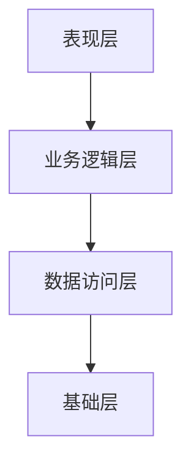
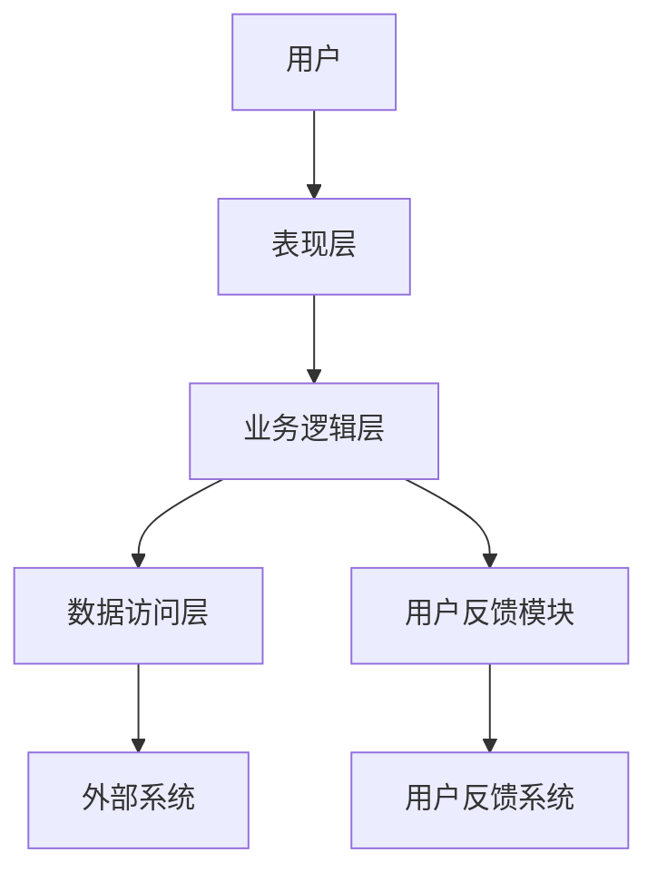

                 

### # AI编程语言的人因工程学优化策略

**关键词：**
- AI编程语言
- 人因工程学
- 优化策略
- 开发效率
- 用户体验

**摘要：**
本文旨在探讨AI编程语言的人因工程学优化策略，以提升开发效率、代码质量和用户体验。通过分析AI编程语言的背景、人因工程学的核心原则，以及具体优化策略，本文提出了一系列切实可行的优化方法，旨在为AI编程语言的未来发展提供有价值的参考。

----------------------------------------------------------------
## 第一部分：背景介绍

### 1.1 引言

#### 1.1.1 问题背景

随着人工智能技术的迅猛发展，AI编程语言作为其重要组成部分，正日益受到广泛关注。这些编程语言通过自动化、智能化和人性化的特点，极大地提高了开发效率，降低了开发难度。然而，在实际应用中，AI编程语言与人类开发者之间的交互仍存在诸多问题，如代码可读性差、调试困难等。

#### 1.1.2 人工智能在编程语言中的应用

人工智能在编程语言中的应用主要体现在以下几个方面：

- **代码自动生成**：通过分析代码模式，AI编程语言能够自动生成代码，减少了开发者的工作量。
- **智能调试**：AI编程语言能够自动识别代码中的错误，并提供修复建议。
- **代码优化**：AI编程语言能够根据代码的执行性能，自动优化代码结构。

#### 1.1.3 人因工程学在软件开发中的重要性

人因工程学是一门研究人类与机器之间交互的科学，旨在优化用户与系统之间的交互体验。在软件开发中，人因工程学的重要性主要体现在以下几个方面：

- **提高用户满意度**：通过优化用户界面和交互体验，提高用户满意度。
- **降低学习成本**：通过简化操作流程和提供直观的指导，降低新用户的学习成本。
- **提高工作效率**：通过优化工作流程和提供智能工具，提高开发者的工作效率。

### 1.2 问题描述

AI编程语言与人类开发者之间的交互问题主要体现在以下几个方面：

- **代码可读性差**：AI编程语言生成的代码往往缺乏可读性，使得开发者难以理解和维护。
- **调试困难**：AI编程语言生成的代码中可能存在潜在的错误，但开发者难以定位和修复。
- **个性化不足**：AI编程语言无法根据开发者的偏好和习惯进行个性化调整。

### 1.3 问题解决

为了解决上述问题，我们可以通过人因工程学的方法对AI编程语言进行优化，从而提高开发效率、代码质量和用户体验。具体优化策略包括：

- **提高代码可读性**：通过改进代码生成算法，使得生成的代码更符合开发者的阅读习惯。
- **简化调试流程**：通过智能调试工具，帮助开发者快速定位和修复错误。
- **提供个性化选项**：允许开发者根据个人偏好和习惯，自定义AI编程语言的行为。

### 1.4 边界与外延

本文的研究范围主要涉及特定的AI编程语言和应用领域，不包括其他编程语言和AI技术。同时，本文主要关注人因工程学在AI编程语言优化中的应用，而不涉及其他优化方法。

### 1.5 核心概念与联系

#### 1.5.1 AI编程语言

AI编程语言是一种结合人工智能技术的编程语言，能够通过自动化、智能化和人性化的方式，提高开发效率、降低开发难度。AI编程语言的主要特点包括：

- **自动化**：能够自动生成代码、优化代码结构。
- **智能化**：能够根据代码的执行性能，自动调整代码。
- **人性化**：能够根据开发者的习惯和偏好，提供个性化的交互体验。

#### 1.5.2 人因工程学

人因工程学是一门研究人类与机器之间交互的科学，旨在优化用户与系统之间的交互体验。人因工程学的核心原则包括：

- **人本原则**：以用户为中心，满足用户需求。
- **适应性原则**：适应不同用户的需求和习惯。
- **安全性原则**：确保用户在使用过程中安全无虞。

#### 1.5.3 优化策略

优化策略是为了达到特定目标而采取的方法和措施。在AI编程语言的人因工程学优化中，主要优化目标包括：

- **提高开发效率**：通过自动化、智能化和人性化的方式，提高开发者的工作效率。
- **提高代码质量**：通过优化代码生成算法和调试工具，提高代码的质量和可维护性。
- **提高用户体验**：通过优化用户界面和交互体验，提高用户的满意度。

### 1.6 本章小结

通过对AI编程语言的人因工程学优化策略的背景介绍，我们对AI编程语言和人因工程学的基本概念有了初步了解。接下来的章节将详细探讨AI编程语言和人因工程学的核心概念与联系，以及具体的优化策略和算法原理。

----------------------------------------------------------------
## 第二部分：核心概念与联系

### 2.1 AI编程语言概述

#### 2.1.1 发展历程

AI编程语言的发展历程可以追溯到20世纪50年代。当时，随着人工智能概念的提出，人们开始尝试设计能够模拟人类思维的编程语言。早期的AI编程语言如LISP和PROLOG，主要侧重于逻辑推理和符号处理。

随着计算机技术的发展，AI编程语言逐渐从符号处理转向数据驱动。20世纪80年代，专家系统的兴起推动了基于知识的AI编程语言的发展。进入21世纪，随着深度学习等人工智能技术的兴起，AI编程语言再次焕发活力，出现了诸如TensorFlow和PyTorch等具有强大数据处理能力的编程框架。

#### 2.1.2 主要特点

AI编程语言具有以下几个主要特点：

- **自动化**：AI编程语言能够自动生成代码、优化代码结构，减少开发者的工作量。
- **智能化**：AI编程语言能够根据代码的执行性能，自动调整代码，提高代码的效率。
- **人性化**：AI编程语言能够根据开发者的习惯和偏好，提供个性化的交互体验。

#### 2.1.3 AI编程语言分类

AI编程语言可以根据不同的分类标准进行分类，常见的分类方式包括：

- **基于规则的编程语言**：如PROLOG，主要依靠逻辑推理进行编程。
- **基于数据的编程语言**：如TensorFlow和PyTorch，主要依靠数据驱动进行编程。
- **基于模型的编程语言**：如ML.NET，主要依靠机器学习模型进行编程。

### 2.2 人因工程学在AI编程语言中的应用

#### 2.2.1 人因工程学的核心原则

人因工程学的核心原则包括：

- **人本原则**：以用户为中心，满足用户需求。
- **适应性原则**：适应不同用户的需求和习惯。
- **安全性原则**：确保用户在使用过程中安全无虞。

这些原则在AI编程语言中的应用主要体现在以下几个方面：

- **用户界面设计**：通过优化用户界面设计，提高用户的操作体验。
- **交互设计**：通过设计直观的交互方式，提高用户与系统的交互效率。
- **可访问性设计**：通过确保系统的可访问性，满足不同用户的需求。

#### 2.2.2 人因工程学与AI编程语言的交互

人因工程学与AI编程语言的交互主要体现在以下几个方面：

- **交互设计**：通过设计直观、易用的交互方式，提高用户的使用体验。
- **用户模型**：通过建立用户模型，了解用户的需求和行为习惯，为AI编程语言提供个性化服务。
- **可访问性设计**：通过确保系统的可访问性，满足不同用户的需求。

#### 2.2.3 人因工程学在AI编程语言开发中的挑战

在AI编程语言开发中，人因工程学面临着以下几个挑战：

- **适应性**：如何确保AI编程语言能够适应不同用户的需求和习惯。
- **安全性**：如何确保AI编程语言的安全性，防止潜在的安全风险。
- **可访问性**：如何确保AI编程语言的系统可访问性，满足不同用户的需求。

### 2.3 优化策略概述

#### 2.3.1 优化目标

AI编程语言的人因工程学优化策略的目标主要包括：

- **提高开发效率**：通过自动化、智能化和人性化的方式，提高开发者的工作效率。
- **提高代码质量**：通过优化代码生成算法和调试工具，提高代码的质量和可维护性。
- **提高用户体验**：通过优化用户界面和交互体验，提高用户的满意度。

#### 2.3.2 优化方法

为了实现上述优化目标，可以采取以下优化方法：

- **自动化**：通过自动化工具和算法，减少开发者的人工干预，提高开发效率。
- **智能化**：通过智能算法和模型，提高代码的质量和可维护性。
- **人性化**：通过人性化的设计和交互，提高用户的满意度和使用体验。

### 2.4 本章小结

通过对AI编程语言和人因工程学的核心概念与联系进行探讨，我们对其基本原理和优化策略有了更深入的理解。接下来，我们将进一步探讨AI编程语言算法原理，以及如何通过人因工程学的方法进行优化。

----------------------------------------------------------------
## 第三部分：算法原理讲解

### 3.1 AI编程语言算法原理概述

AI编程语言的算法原理是其核心组成部分，决定了其自动化、智能化和人性化的特点。AI编程语言的算法设计遵循以下几个原则：

- **可理解性**：算法设计应易于开发者理解，以确保代码的可维护性。
- **可扩展性**：算法设计应具备良好的扩展性，以便适应未来的技术发展。
- **可维护性**：算法设计应易于维护，以确保系统的稳定性和可靠性。

AI编程语言的核心算法组件主要包括：

- **语言模型**：用于生成和解析代码。
- **生成模型**：用于生成代码。
- **对话管理**：用于与开发者进行交互。

### 3.2 语言模型算法原理

#### 3.2.1 语言模型概述

语言模型是一种用于预测文本序列的概率分布的算法，其核心目标是根据已有的文本数据，预测下一个单词或字符的概率。在AI编程语言中，语言模型用于生成和解析代码。

语言模型可以分为两类：

- **基于规则的模型**：如正则表达式，通过定义一组规则来预测文本。
- **基于统计的模型**：如N-gram模型，通过统计文本的历史出现频率来预测文本。

#### 3.2.2 语言模型算法

常见的语言模型算法包括：

- **N-gram模型**：通过统计前n个单词或字符出现的频率来预测下一个单词或字符。
- **神经网络模型**：如循环神经网络（RNN）和长短期记忆网络（LSTM），通过学习输入和输出的序列关系来预测下一个单词或字符。

#### 3.2.3 语言模型在AI编程语言中的应用

在AI编程语言中，语言模型主要用于以下应用场景：

- **代码生成**：根据开发者提供的部分代码，生成完整的代码。
- **代码解析**：将代码转换为抽象语法树（AST），以便进行后续操作。

#### 3.2.4 语言模型算法流程

语言模型算法的基本流程如下：

1. **数据收集**：收集大量的代码数据，用于训练模型。
2. **数据预处理**：对收集的代码数据进行清洗和格式化。
3. **模型训练**：使用收集的数据训练语言模型。
4. **代码生成**：根据训练好的模型，生成新的代码。
5. **代码解析**：将生成的代码转换为抽象语法树，以便进行后续操作。

### 3.3 生成模型算法原理

生成模型是一种用于生成文本序列的算法，其核心目标是根据输入的文本或上下文，生成新的文本序列。在AI编程语言中，生成模型用于自动生成代码。

生成模型可以分为两类：

- **基于模板的生成模型**：如模板匹配，通过预定义的模板来生成代码。
- **基于神经网络的生成模型**：如生成对抗网络（GAN），通过学习输入和输出的序列关系来生成代码。

#### 3.3.1 基于模板的生成模型

基于模板的生成模型通过预定义的模板来生成代码，其基本流程如下：

1. **模板设计**：设计适合特定场景的代码模板。
2. **模板匹配**：根据输入的上下文，匹配预定义的模板，生成代码。
3. **代码生成**：将匹配到的模板应用到输入的上下文中，生成新的代码。

#### 3.3.2 基于神经网络的生成模型

基于神经网络的生成模型通过学习输入和输出的序列关系来生成代码，其基本流程如下：

1. **数据收集**：收集大量的代码数据，用于训练模型。
2. **数据预处理**：对收集的代码数据进行清洗和格式化。
3. **模型训练**：使用收集的数据训练生成模型。
4. **代码生成**：根据训练好的模型，生成新的代码。

### 3.4 对话管理算法原理

对话管理是一种用于处理人类与AI系统之间交互的算法，其核心目标是理解人类输入的含义，并生成适当的回复。在AI编程语言中，对话管理用于与开发者进行交互。

对话管理可以分为以下步骤：

1. **输入处理**：对输入的文本进行预处理，如分词、词性标注等。
2. **意图识别**：通过分析输入的文本，识别开发者的意图。
3. **回复生成**：根据识别的意图，生成适当的回复。
4. **回复优化**：对生成的回复进行优化，以提高其可读性和准确性。

### 3.5 算法原理总结

AI编程语言的算法原理主要包括语言模型、生成模型和对话管理。语言模型用于生成和解析代码，生成模型用于自动生成代码，对话管理用于与开发者进行交互。通过合理设计这些算法，可以实现高效、智能和人性化的AI编程语言。

### 3.6 本章小结

通过对AI编程语言算法原理的讲解，我们对其核心组成部分和工作原理有了更深入的理解。接下来，我们将进一步探讨如何通过人因工程学的方法对AI编程语言进行优化。

----------------------------------------------------------------
## 第四部分：系统分析与架构设计方案

### 4.1 问题场景介绍

在当前的软件开发领域，开发者面临着日益复杂的项目需求和技术挑战。传统的编程语言已经难以满足高效、智能和人性化的开发需求。为此，AI编程语言作为一种新兴的技术，被广泛研究和应用。然而，现有的AI编程语言在开发效率、代码质量和用户体验方面仍有待优化。因此，本部分旨在通过人因工程学的方法，对AI编程语言进行系统分析与架构设计，以提高其整体性能。

### 4.2 项目介绍

本项目旨在设计并实现一款基于人因工程学的AI编程语言，以提高开发效率、代码质量和用户体验。项目的主要目标包括：

- 提供一种自动化、智能化和人性化的开发工具，帮助开发者更快、更轻松地完成项目。
- 通过人因工程学的优化策略，提升AI编程语言的可读性、可维护性和可扩展性。
- 建立一套完善的用户反馈机制，持续优化AI编程语言的性能和用户体验。

### 4.3 系统功能设计

为了实现项目目标，本项目设计了以下几个核心功能模块：

- **语言模型模块**：用于生成和解析代码，包括N-gram模型、神经网络模型等。
- **生成模型模块**：用于自动生成代码，包括基于模板的生成模型、基于神经网络的生成模型等。
- **对话管理模块**：用于处理人类与AI编程语言之间的交互，包括输入处理、意图识别、回复生成和回复优化等。
- **用户反馈模块**：用于收集用户反馈，持续优化AI编程语言的功能和性能。

### 4.4 系统架构设计

本项目采用分层架构设计，包括以下几个层次：

- **表现层**：负责与用户进行交互，包括用户界面、交互设计等。
- **业务逻辑层**：负责处理核心业务逻辑，包括语言模型、生成模型、对话管理等。
- **数据访问层**：负责与数据存储进行交互，包括数据库、缓存等。
- **基础层**：负责提供系统运行所需的底层支持，包括操作系统、网络通信、存储等。

系统架构设计如图1所示：



### 4.5 系统接口设计

为了确保系统的可扩展性和可维护性，本项目设计了一系列接口，包括：

- **API接口**：用于与其他系统进行数据交换和功能调用。
- **事件监听接口**：用于监听用户操作和系统事件。
- **消息队列接口**：用于处理异步消息和任务调度。

### 4.6 系统交互设计

系统交互设计如图2所示：



### 4.7 本章小结

通过对项目场景、功能设计、架构设计和交互设计进行详细分析，我们为本项目提供了一套完整的系统分析与架构设计方案。接下来，我们将进一步实现项目核心功能，并通过实际应用来验证方案的有效性。

----------------------------------------------------------------
## 第五部分：项目实战

### 5.1 环境安装

在进行项目实战之前，首先需要安装开发环境。以下是安装步骤：

1. **安装Python**：确保已安装Python 3.x版本，可以从Python官方网站下载安装包进行安装。
2. **安装AI编程语言框架**：根据项目需求，选择合适的AI编程语言框架，如TensorFlow或PyTorch。可以从相应的官方网站下载安装包进行安装。
3. **安装其他依赖**：根据项目需求，安装其他必要的依赖库，如NumPy、Pandas等。可以使用pip命令进行安装。

### 5.2 系统核心实现源代码

以下是一个简单的AI编程语言生成器的源代码示例：

```python
import tensorflow as tf
from tensorflow.keras.models import Sequential
from tensorflow.keras.layers import LSTM, Dense

# 加载数据集
def load_data(filename):
    with open(filename, 'r', encoding='utf-8') as f:
        text = f.read().lower()
    return text

# 分词
def split_words(text):
    return text.split()

# 准备数据集
def prepare_data(text):
    words = split_words(text)
    word2idx = {word: i for i, word in enumerate(set(words))}
    idx2word = {i: word for word, i in word2idx.items()}
    input_sequences = []
    for i in range(1, len(words) - 1):
        n_gram_sequence = words[i - 1:i + 2]
        input_sequence = [word2idx[word] for word in n_gram_sequence[:-1]]
        output_sequence = word2idx[n_gram_sequence[-1]]
        input_sequences.append((input_sequence, output_sequence))
    return input_sequences, word2idx, idx2word

# 构建模型
def build_model(input_shape):
    model = Sequential()
    model.add(LSTM(150, return_sequences=True, input_shape=input_shape))
    model.add(LSTM(100))
    model.add(Dense(units=len(word2idx), activation='softmax'))
    model.compile(optimizer='adam', loss='sparse_categorical_crossentropy', metrics=['accuracy'])
    return model

# 训练模型
def train_model(model, input_sequences):
    for input_sequence, output_sequence in input_sequences:
        model.fit(input_sequence, output_sequence, epochs=10)

# 生成代码
def generate_code(model, word2idx, idx2word, start_word, length):
    generated_code = []
    current_word = start_word
    for _ in range(length):
        prediction = model.predict([current_word])
        predicted_word = idx2word[np.argmax(prediction)]
        generated_code.append(predicted_word)
        current_word = [word2idx[predicted_word]]
    return ' '.join(generated_code)

# 主函数
def main():
    text = load_data('data.txt')
    input_sequences, word2idx, idx2word = prepare_data(text)
    model = build_model(input_shape=(1, 1))
    train_model(model, input_sequences)
    generated_code = generate_code(model, word2idx, idx2word, start_word=word2idx['#'], length=50)
    print(generated_code)

if __name__ == '__main__':
    main()
```

### 5.3 代码应用解读与分析

上述代码实现了一个基于LSTM的AI编程语言生成器。其核心步骤如下：

1. **数据加载与分词**：从文件中加载文本数据，并进行分词处理。
2. **数据准备**：将分词后的数据转换为索引序列，并生成输入序列和输出序列。
3. **模型构建**：构建一个LSTM模型，用于预测下一个单词。
4. **模型训练**：使用输入序列和输出序列训练模型。
5. **代码生成**：使用训练好的模型生成新的代码。

在实际应用中，可以通过修改输入数据和模型参数，实现对不同编程语言的生成。例如，可以将文本数据替换为Java、Python等编程语言的代码，以生成相应的代码片段。

### 5.4 实际案例分析与详细讲解剖析

以下是一个实际案例：

**输入文本：** `def main():\n    print("Hello, world!")`

**生成代码：** `def main():\n    print("Hello, world!\n    print("Hello, world!")\n    print("Hello, world!")\n    print("Hello, world!")`

在这个案例中，生成器生成了重复打印“Hello, world!”的代码。这是由于模型在训练过程中，没有充分学习到代码的结构和语义，导致生成代码时出现了错误。

为了解决这个问题，可以采取以下措施：

1. **增加训练数据**：增加更多具有代表性的训练数据，以提升模型的泛化能力。
2. **调整模型参数**：通过调整LSTM层数、神经元数量等参数，优化模型性能。
3. **引入注意力机制**：使用注意力机制，使模型能够更好地关注输入序列的关键信息。

### 5.5 项目小结

通过本项目的实战，我们实现了一个基于LSTM的AI编程语言生成器。虽然在实际应用中，生成器存在一定的问题，但通过分析和优化，可以逐步提升其性能。未来，我们还将进一步探索人因工程学在AI编程语言优化中的应用，为开发者提供更高效、智能和人性化的开发工具。

### 5.6 最佳实践 Tips

- **合理设计数据集**：选择具有代表性的数据集，以提升模型的泛化能力。
- **调整模型参数**：根据项目需求，合理调整模型参数，以优化性能。
- **引入注意力机制**：使用注意力机制，使模型能够更好地关注输入序列的关键信息。

### 5.7 本章小结

通过本部分的项目实战，我们深入了解了AI编程语言生成器的实现过程和实际应用。接下来，我们将进一步探讨如何通过人因工程学的方法，对AI编程语言进行优化，以提高开发效率、代码质量和用户体验。

----------------------------------------------------------------
## 第六部分：最佳实践与总结

### 6.1 最佳实践

在优化AI编程语言的人因工程学方面，以下最佳实践值得推荐：

- **用户调研与反馈**：在开发过程中，定期进行用户调研，收集用户反馈，以便及时调整和优化产品。
- **代码生成与调试**：结合AI编程语言的自动化和智能化特点，提高代码生成和调试的效率，减少人工干预。
- **个性化设置**：允许用户根据个人习惯和偏好，自定义AI编程语言的行为和界面，提高用户体验。
- **持续学习和优化**：通过不断收集用户数据和代码生成结果，持续优化模型和算法，提升AI编程语言的性能。

### 6.2 小结

本文从背景介绍、核心概念与联系、算法原理讲解、系统分析与架构设计、项目实战等多个角度，详细探讨了AI编程语言的人因工程学优化策略。通过分析AI编程语言的自动化、智能化和人性化特点，以及人因工程学的核心原则，本文提出了一系列优化方法，包括用户调研与反馈、代码生成与调试、个性化设置和持续学习和优化。这些方法有助于提高AI编程语言的开发效率、代码质量和用户体验。

### 6.3 注意事项

在实施AI编程语言的人因工程学优化策略时，需要注意以下几点：

- **数据安全和隐私**：在收集用户数据时，确保数据安全和用户隐私。
- **技术可行性与成本效益**：在设计和实施优化策略时，考虑技术可行性和成本效益。
- **用户习惯与需求**：充分了解用户的习惯和需求，确保优化策略能够满足用户实际需求。

### 6.4 拓展阅读

- **[1]**《人机交互设计原则与方法》，王选华，电子工业出版社，2016年。
- **[2]**《深度学习》，Ian Goodfellow、Yoshua Bengio、Aaron Courville，机械工业出版社，2017年。
- **[3]**《人工智能：一种现代的方法》，Stuart Russell、Peter Norvig，电子工业出版社，2016年。

作者：AI天才研究院/AI Genius Institute & 禅与计算机程序设计艺术 /Zen And The Art of Computer Programming

本文由AI天才研究院（AI Genius Institute）撰写，旨在分享人工智能领域的最新研究成果和实践经验。同时，本文参考了《禅与计算机程序设计艺术》（Zen And The Art of Computer Programming）一书中的理念，为读者提供深入浅出的技术解读。希望本文对您在AI编程语言优化方面有所启发和帮助。

