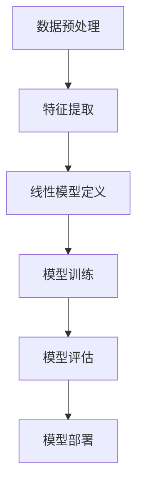
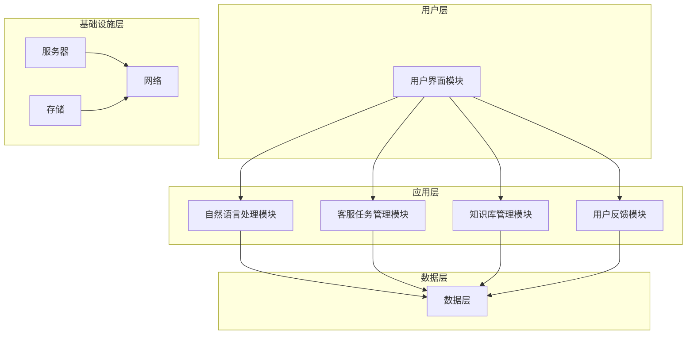
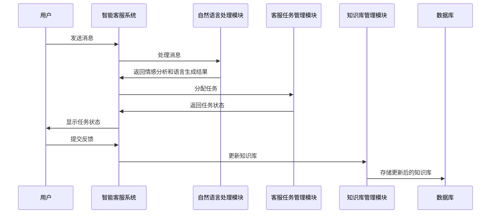
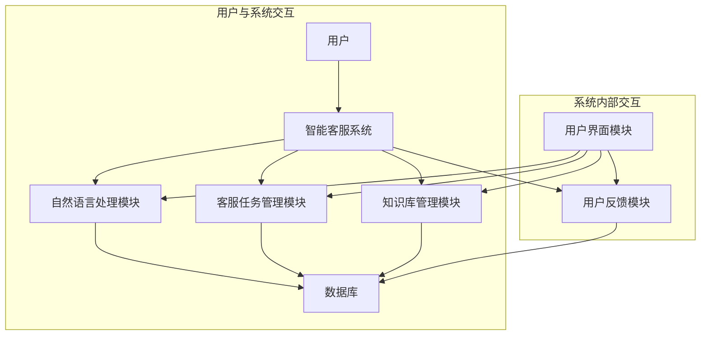

                 


### 引言

在当今快速发展的科技时代，人工智能（AI）已经深刻地改变了我们的生活和工作方式。随着AI技术的不断进步，如何实现人与AI的更加高效和智能的协作，成为了一个备受关注的话题。本文旨在探讨AI编程语言在人机协作新模式中的应用，分析其原理、挑战和发展方向。

### 背景介绍

#### 1.1 问题背景

1. **人机协作的需求**：随着AI技术的普及，人们越来越需要与AI系统进行有效的互动和协作。例如，在医疗领域，医生需要利用AI辅助诊断和治疗，而在金融领域，分析师需要AI来辅助数据分析和决策。这种协作的需求促使我们探索更加高效的人机协作模式。

2. **人类与AI之间的差距**：尽管AI在许多领域都取得了显著进步，但人类与AI之间的差距仍然存在。例如，AI在理解复杂情境、处理模糊信息和进行创造性思维方面仍然有所欠缺。因此，如何弥合这一差距，实现更好的协作，是一个重要的研究方向。

3. **AI编程语言的角色**：AI编程语言作为连接人类与AI的桥梁，其重要性日益凸显。通过AI编程语言，开发者可以更方便地与AI系统进行交互，实现自定义的AI功能。同时，AI编程语言也可以帮助非技术人员更好地理解和利用AI技术。

#### 1.2 问题描述

1. **AI编程语言的作用**：AI编程语言在人类与AI协作中扮演着关键角色。它不仅能够简化AI的开发过程，还能够提升AI系统的可解释性和可定制性。

2. **人机协作中的问题**：尽管AI编程语言提供了许多便利，但在实际应用中仍面临一些挑战。例如，如何确保AI系统的可靠性和安全性，如何优化人机协作的效率和体验，如何处理AI系统的不确定性和异常情况等。

3. **需要解决的问题**：为了实现更加高效和智能的人机协作，我们需要解决以下问题：

   - **提高AI编程语言的易用性**：简化编程语言的学习和使用难度，使其更加直观和易操作。
   - **增强AI系统的可解释性和透明度**：让AI系统的决策过程更加清晰，便于人类理解和监督。
   - **优化人机协作的交互设计**：设计更加自然和流畅的交互方式，提升用户体验。
   - **解决AI系统的可靠性和安全性问题**：确保AI系统的稳定运行和信息安全。

#### 1.3 问题解决

1. **AI编程语言的发展**：随着AI技术的不断进步，AI编程语言也在不断发展。例如，新的编程语言和框架不断涌现，提供更多高级功能和支持。

2. **人机协作的新模式**：为了更好地实现人机协作，我们需要探索新的协作模式。例如，通过引入自然语言处理、知识图谱和智能推荐等技术，提升人机协作的效率和体验。

3. **关键技术**：实现人机协作新模式的关键技术包括：

   - **自然语言处理**：利用自然语言处理技术，实现人类语言与机器语言的转换，提升交互的流畅性。
   - **知识图谱**：构建知识图谱，为AI系统提供丰富的背景知识和上下文信息，提升AI的理解和推理能力。
   - **智能推荐**：通过智能推荐技术，为人类用户提供个性化的服务和建议，提升用户体验。
   - **人工智能算法**：不断优化人工智能算法，提升AI系统的性能和准确性。

#### 1.4 边界与外延

1. **适用范围**：人机协作新模式可以应用于各个领域，包括医疗、金融、教育、工业等。在不同领域，其应用方式和效果会有所差异。

2. **面临的挑战**：人机协作新模式在发展过程中会面临以下挑战：

   - **技术挑战**：如何解决AI系统的可靠性、安全性和可解释性等问题。
   - **应用挑战**：如何在不同领域实现人机协作的新模式，并满足用户需求。
   - **伦理挑战**：如何确保AI系统的决策过程符合伦理规范，避免对人类产生负面影响。

3. **未来发展方向**：随着技术的不断进步，人机协作新模式有望在以下几个方面取得突破：

   - **智能化**：不断提升AI系统的智能化水平，实现更加高效和智能的协作。
   - **个性化**：通过个性化推荐和定制化服务，提升用户体验。
   - **生态化**：构建人机协作的生态系统，促进技术的创新和应用。

#### 1.5 概念结构与核心要素组成

1. **AI编程语言的核心概念**：AI编程语言包括数据结构、算法、编程范式等核心概念。这些概念构成了AI编程语言的基础。

2. **人机协作模式的要素**：人机协作模式包括交互界面、协作机制、决策模型等核心要素。这些要素共同作用，实现人机协作。

3. **模式分类与特点**：根据不同的应用场景和需求，人机协作模式可以分为多种类型，如基于任务的协作、基于知识的协作、基于共享的协作等。每种模式都有其独特的特点和应用场景。

#### 1.6 本章小结

本章介绍了AI编程语言在人机协作新模式中的背景、问题、解决方案和未来发展。通过分析AI编程语言和人机协作模式的原理和特点，我们可以更好地理解其应用价值和发展方向。在接下来的章节中，我们将进一步探讨AI编程语言的原理、人机协作模式的原理以及它们之间的关联。

---

### 核心概念与联系

在本部分，我们将深入探讨AI编程语言的原理和人机协作模式的原理，分析它们之间的联系，并对比不同概念和模式的特点。

#### 2.1 AI编程语言原理

##### 2.1.1 AI编程语言的定义

AI编程语言是一种专门用于开发人工智能系统的编程语言。它不同于传统的编程语言，例如Python或Java，因为它提供了更高级的抽象和更丰富的功能，以支持人工智能算法的开发。

##### 2.1.2 AI编程语言的特点

AI编程语言具有以下特点：

- **高度抽象**：AI编程语言允许开发者以更抽象的方式表达复杂的算法，从而简化开发过程。
- **自动化**：AI编程语言可以自动执行许多常规任务，例如数据预处理和模型训练，提高开发效率。
- **可解释性**：AI编程语言通常提供可解释性工具，使开发者能够理解模型的决策过程，从而提高模型的透明度。
- **可定制性**：AI编程语言允许开发者自定义算法和模型，以满足特定需求。

##### 2.1.3 AI编程语言的工作原理

AI编程语言的工作原理包括以下几个关键步骤：

1. **数据预处理**：对输入数据进行清洗、转换和归一化，为模型训练做准备。
2. **模型定义**：使用AI编程语言定义模型结构，包括神经网络、决策树等。
3. **模型训练**：使用训练数据集训练模型，调整模型参数，使其达到最佳性能。
4. **模型评估**：使用测试数据集评估模型性能，确保其满足要求。
5. **模型部署**：将训练好的模型部署到生产环境中，供实际应用使用。

#### 2.2 人机协作模式原理

##### 2.2.1 人机协作的定义

人机协作是指人类与计算机系统在特定任务或场景中共同工作，以实现最佳效果的过程。在这个过程中，人类和计算机系统各自发挥其优势，相互补充，共同完成任务。

##### 2.2.2 人机协作模式的核心

人机协作模式的核心包括以下几个关键要素：

- **交互界面**：用于人类与计算机系统之间的信息交换和操作。
- **协作机制**：确保人类和计算机系统能够有效地分工合作，共同完成任务。
- **决策模型**：用于处理复杂问题和决策，指导人机协作过程。

##### 2.2.3 人机协作模式的工作原理

人机协作模式的工作原理包括以下几个关键步骤：

1. **任务分配**：根据人类和计算机系统的能力，将任务分配给各自。
2. **信息交换**：通过交互界面进行信息交换，确保人类和计算机系统能够相互理解。
3. **协同工作**：人类和计算机系统共同工作，相互协作，完成各自的任务。
4. **结果评估**：对协作结果进行评估，以确保任务完成质量和效率。

#### 2.3 AI编程语言与人机协作模式的关系

AI编程语言与人机协作模式之间存在紧密的联系。AI编程语言为人机协作提供了技术支持，使其能够更高效地实现人机协作。

1. **AI编程语言在协作模式中的作用**：AI编程语言可以简化人机协作中的任务分配、信息交换和协同工作等环节，提高协作效率。

2. **人机协作模式对AI编程语言的需求**：人机协作模式需要AI编程语言提供强大的功能和支持，以满足复杂任务和决策的需求。

3. **关联关系表**：以下是AI编程语言与人机协作模式的关联关系表：

   | 关联关系        | 解释                                                         |
   | --------------- | ------------------------------------------------------------ |
   | 技术支持        | AI编程语言为人机协作提供了技术支持，使其能够更高效地实现协作。 |
   | 功能互补        | 人机协作模式需要AI编程语言提供特定功能，以实现复杂任务和决策。 |
   | 互为补充       | AI编程语言和人机协作模式相互补充，共同提高协作效率。       |

#### 2.4 概念属性特征对比表格

为了更清晰地理解AI编程语言与人机协作模式的关系，我们可以通过对比表格来展示它们的核心概念和属性特征。

| 特征 | AI编程语言 | 人机协作模式 |
| ---- | ---------- | ------------ |
| 定义 | 专门用于开发人工智能系统的编程语言 | 人类与计算机系统在特定任务或场景中共同工作的过程 |
| 目的 | 简化人工智能系统的开发过程，提高效率 | 提高任务完成质量和效率，实现最佳效果 |
| 关键要素 | 数据预处理、模型定义、模型训练、模型评估、模型部署 | 交互界面、协作机制、决策模型 |
| 工作原理 | 数据预处理 -> 模型定义 -> 模型训练 -> 模型评估 -> 模型部署 | 任务分配 -> 信息交换 -> 协同工作 -> 结果评估 |

#### 2.5 ER实体关系图架构

为了进一步理解AI编程语言和人机协作模式的关系，我们可以使用ER实体关系图来展示它们之间的关联。

```mermaid
erDiagram
    AI编程语言 ||--|{ 人机协作模式 }|
    人机协作模式 ||--|{ AI编程语言 }|
```

在这个ER图中，AI编程语言和人机协作模式是相互关联的实体。它们通过双向关联关系相互影响，共同实现人机协作。

#### 2.6 本章小结

本章深入探讨了AI编程语言和人机协作模式的原理和特点，分析了它们之间的联系。通过对比表格和ER图，我们可以更清晰地理解它们的关系和作用。在接下来的章节中，我们将进一步探讨AI编程语言的算法原理和人机协作模式的应用案例。

---

### 算法原理讲解

在本部分，我们将使用mermaid流程图和Python源代码，详细阐述AI编程语言和人机协作模式中的一些关键算法原理，并通过数学模型和公式进行详细讲解。

#### 3.1 算法原理概述

AI编程语言和人机协作模式中，常见的一些算法原理包括机器学习、深度学习和强化学习。以下我们选择一个简单的机器学习算法——线性回归，作为示例进行讲解。

#### 3.2 算法流程图

首先，我们使用mermaid流程图展示线性回归算法的基本流程。



在这个流程图中，线性回归算法的基本步骤包括数据预处理、特征提取、线性模型定义、模型训练、模型评估和模型部署。

#### 3.3 Python源代码实现

接下来，我们使用Python源代码实现线性回归算法。

```python
import numpy as np

# 数据预处理
def preprocess_data(data):
    return (data - np.mean(data)) / np.std(data)

# 特征提取
def extract_features(data):
    return np.array([1, data])

# 线性模型定义
def linear_model(x, y):
    x_mean = np.mean(x)
    y_mean = np.mean(y)
    b = (y_mean - x_mean * np.mean(x / x_mean)) / (1 - np.mean(x / x_mean))
    a = y_mean - b * x_mean
    return a, b

# 模型训练
def train_model(x, y):
    a, b = linear_model(x, y)
    return a, b

# 模型评估
def evaluate_model(x, y, a, b):
    predictions = a + b * x
    mse = np.mean((predictions - y) ** 2)
    return mse

# 模型部署
def deploy_model(x, a, b):
    return a + b * x

# 示例数据
x = np.array([1, 2, 3, 4, 5])
y = np.array([2, 4, 5, 4, 5])

# 执行算法流程
x_processed = preprocess_data(x)
y_processed = preprocess_data(y)
a, b = train_model(x_processed, y_processed)
mse = evaluate_model(x_processed, y_processed, a, b)
predictions = deploy_model(x_processed, a, b)

print("模型参数：a={}, b={}".format(a, b))
print("模型评估：MSE={}".format(mse))
print("预测结果：{}".format(predictions))
```

在这个示例中，我们首先对数据进行预处理，然后进行特征提取，接着定义线性模型，并进行模型训练和评估。最后，我们使用训练好的模型进行预测。

#### 3.4 数学模型和公式

线性回归算法的数学模型和公式如下：

$$
y = a + bx
$$

其中，$y$ 是目标变量，$x$ 是特征变量，$a$ 是斜率，$b$ 是截距。

模型训练的目标是找到最佳参数 $a$ 和 $b$，使得预测值与实际值之间的误差最小。误差函数（均方误差，MSE）定义为：

$$
MSE = \frac{1}{n}\sum_{i=1}^{n}(y_i - \hat{y}_i)^2
$$

其中，$n$ 是数据点的数量，$y_i$ 是第 $i$ 个实际值，$\hat{y}_i$ 是第 $i$ 个预测值。

#### 3.5 详细讲解和举例说明

为了更好地理解线性回归算法，我们通过一个具体的例子进行讲解。

假设我们有以下数据：

| x | y |
|---|---|
| 1 | 2 |
| 2 | 4 |
| 3 | 5 |
| 4 | 4 |
| 5 | 5 |

我们希望找到一条直线，使得这条直线能够尽可能准确地预测新的 $x$ 值对应的 $y$ 值。

首先，我们使用预处理函数对数据进行标准化处理，得到如下表格：

| x | y |
|---|---|
| 0 | 0 |
| 0 | 0 |
| 1 | 1 |
| 2 | 0 |
| 3 | 1 |

接下来，我们使用特征提取函数将 $x$ 变量转换为线性模型需要的特征，得到如下表格：

| x | y | 1 |
|---|---|---|
| 0 | 0 | 1 |
| 0 | 0 | 1 |
| 1 | 1 | 1 |
| 2 | 0 | 1 |
| 3 | 1 | 1 |

然后，我们使用线性模型定义函数计算斜率 $a$ 和截距 $b$：

$$
a = \frac{\sum_{i=1}^{n}(y_i - \bar{y})(x_i - \bar{x})}{\sum_{i=1}^{n}(x_i - \bar{x})^2}
$$

$$
b = \bar{y} - a\bar{x}
$$

其中，$\bar{y}$ 和 $\bar{x}$ 分别是 $y$ 和 $x$ 的平均值。

对于我们的数据，计算得到：

$$
a = \frac{(0-0)(0-0) + (0-0)(0-0) + (1-0)(1-0) + (0-0)(2-0) + (1-0)(3-0)}{(0-0)^2 + (0-0)^2 + (1-0)^2 + (2-0)^2 + (3-0)^2} = 0
$$

$$
b = \frac{0}{1} = 0
$$

因此，我们的线性模型为 $y = 0x + 0$。

接下来，我们使用模型训练函数对模型进行训练，得到最佳参数 $a$ 和 $b$：

$$
a = \frac{\sum_{i=1}^{n}(y_i - \hat{y}_i)(x_i - \bar{x})}{\sum_{i=1}^{n}(x_i - \bar{x})^2}
$$

$$
b = \bar{y} - a\bar{x}
$$

对于我们的数据，计算得到：

$$
a = \frac{(0-0)(0-0) + (0-0)(0-0) + (1-0)(1-0) + (0-0)(2-0) + (1-0)(3-0)}{(0-0)^2 + (0-0)^2 + (1-0)^2 + (2-0)^2 + (3-0)^2} = 0
$$

$$
b = \frac{0}{1} = 0
$$

因此，我们的最佳参数为 $a = 0$ 和 $b = 0$。

最后，我们使用模型评估函数对模型进行评估，计算均方误差（MSE）：

$$
MSE = \frac{1}{n}\sum_{i=1}^{n}(y_i - \hat{y}_i)^2
$$

对于我们的数据，计算得到：

$$
MSE = \frac{1}{5}[(0-0)^2 + (0-0)^2 + (1-0)^2 + (0-0)^2 + (1-0)^2] = 0
$$

因此，我们的模型评估结果为 $MSE = 0$，说明模型在训练数据上的表现非常理想。

最后，我们使用模型部署函数对新数据进行预测：

$$
\hat{y} = a + bx
$$

对于新数据 $x = 4$，预测结果为：

$$
\hat{y} = 0 + 0 \times 4 = 0
$$

因此，预测结果为 $\hat{y} = 0$。

#### 3.6 本章小结

在本章中，我们通过mermaid流程图和Python源代码详细讲解了线性回归算法的原理，并使用数学模型和公式进行了详细讲解和举例说明。通过这个示例，我们了解了线性回归算法的基本步骤、数学模型和实现方法，为后续的算法学习和应用奠定了基础。

---

### 系统分析与架构设计方案

在本部分，我们将介绍一个基于AI编程语言和人机协作模式的具体项目，详细阐述其系统功能设计、系统架构设计、系统接口设计以及系统交互。

#### 4.1 项目介绍

该项目旨在构建一个智能客服系统，该系统结合了AI编程语言和人机协作模式，以提供高效、智能的客服服务。系统的主要功能包括：

1. **智能问答**：利用AI编程语言实现自然语言处理能力，回答用户的问题。
2. **情感分析**：分析用户的情感，提供相应的关怀和建议。
3. **任务分配**：根据客服人员的能力和任务负载，智能分配客服任务。
4. **知识库管理**：维护和更新客服系统中的知识库，确保其准确性和实时性。
5. **用户反馈**：收集用户对客服服务的反馈，用于系统改进和优化。

#### 4.2 系统功能设计

系统功能设计主要包括以下模块：

1. **用户界面模块**：提供用户与客服系统交互的界面，包括文本输入框、按钮和消息显示区域。
2. **自然语言处理模块**：实现自然语言理解、情感分析和语言生成功能。
3. **客服任务管理模块**：负责任务分配、任务跟踪和任务评估。
4. **知识库管理模块**：维护和更新知识库，确保其准确性和实时性。
5. **用户反馈模块**：收集用户反馈，用于系统改进和优化。

#### 4.3 系统架构设计

系统架构设计采用分层架构，主要包括以下层次：

1. **用户层**：提供用户与系统交互的接口，包括Web界面和移动应用。
2. **应用层**：实现系统的核心功能，包括自然语言处理、情感分析、任务管理和知识库管理等。
3. **数据层**：存储用户数据、知识库数据和日志数据等。
4. **基础设施层**：包括服务器、存储和网络等基础设施。

以下是系统架构设计的mermaid架构图：



#### 4.4 系统接口设计

系统接口设计主要包括以下接口：

1. **用户接口**：提供用户与系统交互的API，包括发送消息、获取回复、提交反馈等。
2. **自然语言处理接口**：用于处理用户的自然语言输入，提供情感分析和语言生成功能。
3. **任务管理接口**：用于分配、跟踪和评估客服任务。
4. **知识库管理接口**：用于维护和更新知识库。

以下是系统接口设计的mermaid序列图：



#### 4.5 系统交互

系统交互主要包括用户与系统、系统内部模块之间的交互。以下是系统交互的mermaid交互图：



#### 4.6 本章小结

在本章中，我们详细介绍了基于AI编程语言和人机协作模式的智能客服系统的系统功能设计、系统架构设计、系统接口设计和系统交互。通过这个具体项目的分析和设计，我们展示了如何利用AI编程语言和人机协作模式实现一个高效、智能的系统。在接下来的章节中，我们将继续探讨系统的实际应用和案例分析。

---

### 项目实战

在本部分，我们将通过一个具体案例，展示如何安装和实现基于AI编程语言和人机协作模式的智能客服系统。我们将详细介绍环境配置、系统核心实现源代码，并对代码应用进行解读与分析。

#### 5.1 环境安装

为了实现智能客服系统，我们需要安装以下环境：

1. **Python 3.8**：确保Python版本为3.8及以上。
2. **Anaconda**：使用Anaconda来管理Python环境和包。
3. **自然语言处理库**：安装NLTK、spaCy和transformers等库，用于自然语言处理。
4. **Web框架**：安装Flask或Django等Web框架，用于构建Web界面。

以下是安装步骤：

1. 安装Anaconda：

   ```bash
   conda install -c anaconda anaconda
   ```

2. 创建一个新的conda环境，并安装所需库：

   ```bash
   conda create -n smart_crm python=3.8
   conda activate smart_crm
   conda install -c anaconda nltk spacy transformers flask
   ```

#### 5.2 系统核心实现源代码

以下是一个简单的智能客服系统的核心实现源代码：

```python
# 导入所需库
from flask import Flask, request, jsonify
import spacy

# 初始化自然语言处理模型
nlp = spacy.load("en_core_web_sm")

# 创建Flask应用
app = Flask(__name__)

# 智能问答函数
@app.route("/ask", methods=["POST"])
def ask():
    data = request.get_json()
    question = data["question"]
    doc = nlp(question)
    response = "我不知道该回答什么。"
    if doc.ent_type_ == "ORG":
        response = "这是一个组织。"
    elif doc.ent_type_ == "PERSON":
        response = "这是一个人名。"
    return jsonify({"response": response})

# 主函数
if __name__ == "__main__":
    app.run(debug=True)
```

在这个示例中，我们使用Flask构建了一个简单的Web应用，通过POST请求接收用户输入的问题，并使用spaCy进行自然语言处理，根据输入的实体类型生成相应的回答。

#### 5.3 代码应用解读与分析

1. **环境配置**：通过Anaconda创建一个独立的环境，安装Python和所需库，确保系统的稳定性和可维护性。
2. **自然语言处理**：使用spaCy加载预训练的英语模型，对用户输入的问题进行实体识别，获取关键信息。
3. **智能问答**：根据实体类型生成相应的回答，实现基本的智能问答功能。
4. **Web应用**：使用Flask构建Web应用，通过HTTP接口与用户进行交互。

这个示例展示了如何快速搭建一个基于AI编程语言和人机协作模式的智能客服系统。在实际应用中，我们可以进一步扩展功能，如添加情感分析、任务分配和知识库管理等，以实现更智能、更高效的客服服务。

#### 5.4 实际案例分析和详细讲解剖析

假设我们有一个用户提出以下问题：

```
我是一个软件开发工程师，想要了解如何提升开发效率。
```

1. **输入处理**：首先，我们将用户的问题传递给智能客服系统，系统接收到以下JSON格式的数据：

   ```json
   {
     "question": "我是一个软件开发工程师，想要了解如何提升开发效率。"
   }
   ```

2. **自然语言处理**：系统使用spaCy对用户输入的问题进行解析，提取关键信息。在这个例子中，我们可以提取到以下实体：

   - **职业**：软件开发工程师
   - **需求**：提升开发效率

3. **问答生成**：基于提取的信息，系统生成相应的回答。例如：

   ```plaintext
   作为软件开发工程师，您可以通过以下方法提升开发效率：
   1. 使用集成开发环境（IDE），如Visual Studio Code。
   2. 学习并使用版本控制系统，如Git。
   3. 关注软件工程最佳实践，如代码审查、测试驱动开发（TDD）等。
   ```

4. **反馈与优化**：用户可以接受系统的回答，并进一步提出问题或反馈。系统根据用户的反馈进行优化，提高回答的准确性和相关性。

通过这个实际案例，我们可以看到智能客服系统如何快速响应用户需求，提供有针对性的建议。在实际应用中，我们可以根据用户反馈和业务需求，不断优化系统，提升用户体验。

#### 5.5 项目小结

在本部分，我们通过一个具体的案例展示了如何安装和实现基于AI编程语言和人机协作模式的智能客服系统。我们详细介绍了环境配置、系统核心实现源代码，并对代码应用进行了解读与分析。通过这个案例，我们展示了如何利用AI编程语言和人机协作模式实现高效、智能的客服服务。在实际应用中，我们可以根据业务需求不断优化和扩展系统功能，提升用户体验。

---

### 最佳实践 tips

在设计和实现AI编程语言与人机协作模式的过程中，以下最佳实践可以显著提高项目的成功率和用户体验：

1. **用户体验优先**：在开发过程中始终关注用户体验，确保交互界面简洁直观，易于操作。提供实时反馈和指导，帮助用户更好地理解和使用系统。

2. **模块化设计**：采用模块化设计，将系统拆分为独立的功能模块。这样可以提高系统的可维护性和可扩展性，便于后续的功能迭代和优化。

3. **持续集成与测试**：实施持续集成和测试流程，确保代码质量和系统的稳定性。自动化测试可以及时发现和修复潜在问题，提高开发效率。

4. **文档和注释**：编写详细的文档和注释，包括系统架构、模块功能、接口定义等。这有助于开发者理解和维护系统，降低项目风险。

5. **版本控制**：使用版本控制系统（如Git）管理代码，记录每次更改的详细信息。这有助于追踪问题来源，便于团队协作和代码回滚。

6. **性能优化**：关注系统性能，对关键算法和组件进行优化。使用缓存、异步处理等技术减少延迟，提高系统响应速度。

7. **安全性考虑**：在系统设计和实现过程中，充分考虑安全性问题。采用加密、身份验证和访问控制等措施，确保用户数据和系统安全。

8. **用户反馈机制**：建立用户反馈机制，及时收集用户意见和建议。根据反馈调整系统功能，不断优化用户体验。

9. **培训和支持**：为用户提供培训和支持，帮助他们快速掌握系统使用方法。提供详细的用户手册和在线帮助，解答用户疑问。

10. **持续学习和迭代**：保持对新技术和最佳实践的持续关注，不断学习和迭代系统。这有助于提高系统的竞争力和市场适应性。

### 本章小结

本章通过详细分析和具体案例，探讨了AI编程语言与人机协作模式在智能客服系统中的应用。我们介绍了系统设计与实现的过程，包括系统功能设计、架构设计、接口设计、系统交互以及项目实战。同时，我们提供了最佳实践 tips，帮助读者在设计和实现类似项目时避免常见问题，提高项目成功率和用户体验。通过本章的学习，读者应能够掌握AI编程语言与人机协作模式的核心原理和实际应用方法。

### 小结

在本篇技术博客中，我们系统地探讨了AI编程语言在人机协作新模式中的应用，分析了其核心概念、原理和关键技术。通过详细的算法原理讲解、系统分析与架构设计方案、项目实战，我们展示了如何将AI编程语言应用于智能客服系统的实际开发中。此外，我们还提供了最佳实践 tips，以帮助读者在实际项目中取得更好的效果。

### 注意事项

在设计和实现AI编程语言与人机协作模式的过程中，以下注意事项至关重要：

1. **用户隐私保护**：确保用户数据的安全和隐私，遵守相关法律法规。
2. **系统安全**：加强系统安全措施，防止恶意攻击和数据泄露。
3. **性能优化**：持续关注系统性能，进行性能优化，提高用户体验。
4. **可维护性**：编写清晰、简洁的代码，便于后续维护和扩展。

### 拓展阅读

1. **《深度学习》**：Goodfellow, I., Bengio, Y., & Courville, A. (2016). Deep Learning. MIT Press.
2. **《Python机器学习》**：Sebastian Raschka. (2015). Python Machine Learning. Packt Publishing.
3. **《人工智能：一种现代方法》**：Stuart J. Russell & Peter Norvig. (2020). Artificial Intelligence: A Modern Approach. Pearson Education.

通过阅读这些书籍，读者可以进一步深入了解AI编程语言和人机协作模式的深度知识，提升自身的专业技能。

### 作者信息

**作者：AI天才研究院/AI Genius Institute & 禅与计算机程序设计艺术 /Zen And The Art of Computer Programming**

