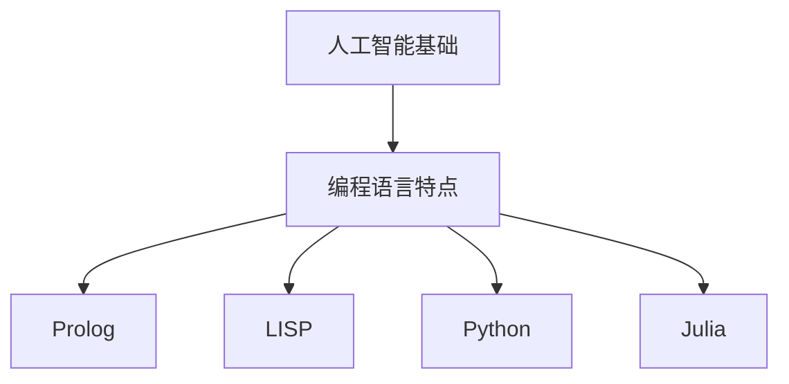
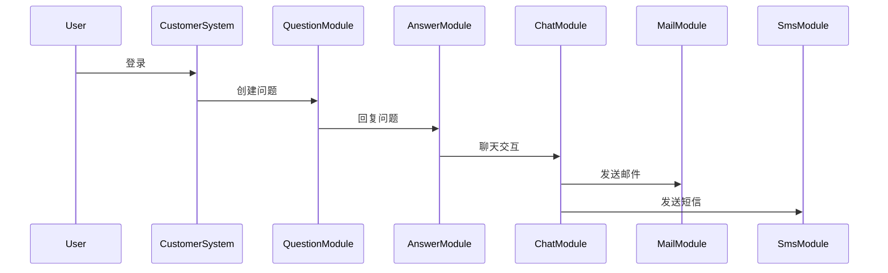
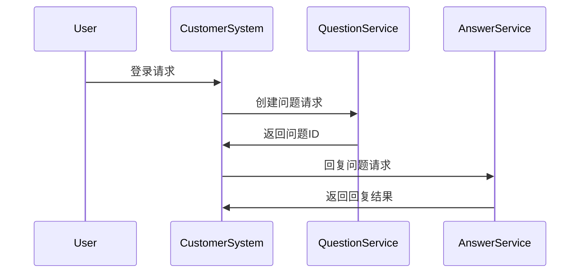
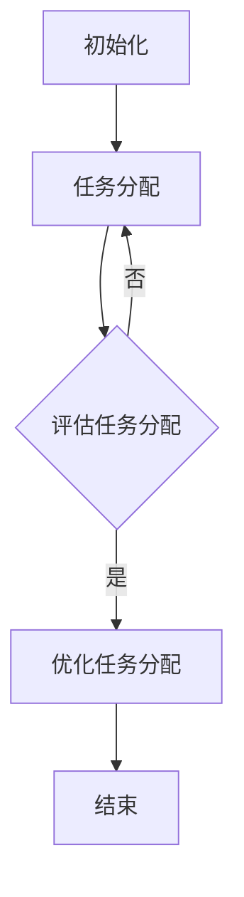

                 


### 1. 背景介绍

#### 1.1 AI编程语言的基本概念

**定义**：AI编程语言是一种专门用于开发人工智能应用的编程语言，它能够帮助开发者更高效地实现复杂的人工智能算法和模型。

**发展背景**：随着人工智能技术的迅速发展，传统的编程语言在处理大规模数据和高复杂度任务时遇到了瓶颈。AI编程语言应运而生，旨在提供更强大的功能和更易用的接口。

**重要性**：AI编程语言使得人工智能技术的开发变得更加容易和高效，降低了技术门槛，促进了人工智能的普及和应用。

#### 1.2 人机协作模式

**定义**：人机协作模式是指人类与机器系统之间通过交互和合作来完成特定任务的工作模式。

**发展背景**：在人工智能技术不断发展的背景下，人机协作模式得到了广泛应用，特别是在复杂任务和决策过程中，人类的智慧和机器的计算能力可以相互补充，提高工作效率和准确性。

**重要性**：人机协作模式能够实现人类与机器的最佳结合，充分发挥两者的优势，提升整体工作效果。

#### 1.3 问题背景、问题描述、问题解决、边界与外延

**问题背景**：随着AI技术的普及，AI编程语言和人机协作模式成为提高开发效率和协作效果的重要工具。

**问题描述**：如何在AI编程语言和人机协作模式的基础上，设计出高效的协作模式，实现人工智能应用的最大化价值？

**问题解决**：通过研究AI编程语言的特点和人机协作模式的最佳实践，探索出适合不同应用场景的协作模式。

**边界与外延**：本研究的范围主要涉及AI编程语言的基础知识、人机协作模式的理论和实践，但不涉及具体AI模型的实现细节。

### 2. 核心概念与联系

#### 2.1 AI编程语言的核心概念

**人工智能基础**：介绍人工智能的基本概念、历史发展和主要领域。

**编程语言特点**：分析AI编程语言与通用编程语言的区别，以及其在人工智能开发中的应用优势。

#### 2.2 人机协作模式的核心概念

**人类角色**：人类在协作模式中的职责、技能和角色分配。

**机器角色**：机器在协作模式中的作用、能力以及与人类协作的方式。

#### 2.3 AI编程语言与人机协作模式的联系

**协作模式设计**：介绍如何将AI编程语言应用于人机协作模式的设计中，实现高效的人机交互和任务分配。

**案例研究**：通过具体的案例，展示AI编程语言和人机协作模式在实际应用中的结合和效果。

### 3. 算法原理讲解

#### 3.1 人工智能算法基础

**算法分类**：介绍常见的人工智能算法分类和特点。

**算法原理**：以一种典型的人工智能算法为例，讲解其基本原理和实现方法。

#### 3.2 人机协作算法

**协作算法设计**：介绍人机协作算法的基本思想和设计原则。

**算法实现**：使用Mermaid流程图展示人机协作算法的流程。

**Python源代码**：使用Python源代码详细阐述算法原理。

**数学模型和公式**：使用数学模型和公式讲解算法，并举例说明。

### 4. 系统分析与架构设计

#### 4.1 问题场景介绍

**项目背景**：介绍项目的背景和目标。

**系统需求**：分析系统的功能和性能需求。

#### 4.2 系统功能设计

**领域模型**：使用Mermaid类图设计系统的领域模型。

**功能模块**：介绍系统的功能模块及其关系。

#### 4.3 系统架构设计

**架构设计**：使用Mermaid架构图设计系统的整体架构。

**模块划分**：详细描述系统的模块划分和功能分布。

#### 4.4 系统接口设计和系统交互

**接口设计**：介绍系统的接口设计和数据交换方式。

**系统交互**：使用Mermaid序列图展示系统的交互流程。

### 5. 项目实战

#### 5.1 环境安装

**环境准备**：介绍项目所需的开发环境和工具。

**环境配置**：详细说明如何配置开发环境。

#### 5.2 系统核心实现

**代码实现**：提供系统核心实现的源代码。

**代码解读**：对源代码进行详细解读和分析。

#### 5.3 代码应用解读与分析

**应用场景**：介绍代码在实际应用中的场景。

**代码分析**：分析代码的功能实现和性能表现。

#### 5.4 实际案例分析和讲解

**案例背景**：介绍案例的背景和目标。

**案例分析**：详细分析案例的实现过程和效果。

#### 5.5 项目小结

**项目总结**：总结项目的经验和教训。

**未来展望**：展望项目的未来发展方向。

### 6. 最佳实践 Tips、小结、注意事项、拓展阅读

#### 6.1 最佳实践 Tips

**代码优化**：提供代码优化的建议。

**协作技巧**：介绍人机协作的最佳实践。

#### 6.2 小结

**核心要点**：总结文章的核心要点。

**学习建议**：为读者提供学习建议。

#### 6.3 注意事项

**安全风险**：介绍使用AI编程语言和人机协作模式时的安全风险。

**系统维护**：介绍系统的维护和更新策略。

#### 6.4 拓展阅读

**参考资料**：推荐相关的参考资料和书籍。

**进一步学习**：提供进一步学习的路径和建议。

----------------------------------------------------------------

# 《AI编程语言的人机协作模式》

> 关键词：AI编程语言、人机协作模式、算法原理、系统架构设计、项目实战、最佳实践

> 摘要：本文旨在探讨AI编程语言与人机协作模式之间的关系，通过背景介绍、核心概念与联系、算法原理讲解、系统分析与架构设计、项目实战以及最佳实践等环节，深入分析AI编程语言在人机协作中的角色和作用，为开发者和研究者提供有价值的参考。

----------------------------------------------------------------

## 1. 背景介绍

### 1.1 AI编程语言的基本概念

#### 定义

AI编程语言，即专门用于人工智能（AI）开发领域的编程语言，旨在提供一种高效、易用的工具，帮助开发者快速构建和实现人工智能算法和模型。这类语言通常具备强大的数学和逻辑处理能力，以支持复杂的人工智能任务。

#### 发展背景

随着人工智能技术的迅猛发展，传统的编程语言（如C、Java、Python等）在处理大规模数据和高复杂度任务时暴露出了一定的局限性。这促使研究人员和开发者致力于开发更加专业化、高效的AI编程语言，以满足人工智能领域的需求。

#### 重要性

AI编程语言的出现，极大地降低了人工智能开发的门槛，使得更多非专业开发者能够参与到人工智能的研究与开发中。同时，它也为人工智能技术的快速应用和普及提供了强有力的支持。

### 1.2 人机协作模式

#### 定义

人机协作模式，是指人类与机器系统之间通过交互和合作来完成特定任务的工作模式。在这种模式下，人类的智慧和创造力与机器的计算能力相结合，共同推动任务的完成。

#### 发展背景

在人工智能技术不断发展的背景下，人机协作模式逐渐成为企业和组织提高工作效率、提升决策质量的重要手段。特别是在复杂任务和决策过程中，人机协作能够充分发挥人类和机器的优势，实现最优的工作效果。

#### 重要性

人机协作模式能够实现人类与机器的最佳结合，使得人工智能应用更加智能化、高效化。同时，它也有助于减轻人类的劳动负担，提高工作满意度。

### 1.3 问题背景、问题描述、问题解决、边界与外延

#### 问题背景

随着AI技术的普及，AI编程语言和人机协作模式在各个领域得到了广泛应用。然而，如何设计出高效的协作模式，以实现人工智能应用的最大化价值，仍是一个亟待解决的问题。

#### 问题描述

如何在AI编程语言和人机协作模式的基础上，设计出适用于不同应用场景的协作模式，以充分发挥人工智能技术的优势？

#### 问题解决

通过研究AI编程语言的特点和人机协作模式的最佳实践，探索出适合不同应用场景的协作模式，从而实现人工智能应用的最大化价值。

#### 边界与外延

本研究的范围主要涉及AI编程语言的基础知识、人机协作模式的理论和实践，但不涉及具体AI模型的实现细节。

----------------------------------------------------------------

## 2. 核心概念与联系

### 2.1 AI编程语言的核心概念

#### 人工智能基础

人工智能（AI）是一门研究、开发和应用使计算机模拟、延伸和扩展人类智能的理论、方法、技术及应用系统的技术科学。人工智能的研究内容包括机器学习、计算机视觉、自然语言处理、专家系统等。

#### 编程语言特点

AI编程语言具有以下特点：

1. **强大的数学和逻辑处理能力**：支持复杂数学运算和逻辑推理，以适应人工智能算法的实现。
2. **高度抽象**：通过抽象化操作，简化编程过程，降低开发者工作难度。
3. **丰富的库和框架**：提供丰富的库和框架，以支持不同类型的人工智能任务。

#### 表格对比AI编程语言的不同属性特征

| 属性        | 编程语言       | 说明                                                   |
| ----------- | -------------- | ------------------------------------------------------ |
| 语法        | Prolog         | 基于逻辑推理的编程语言，强调逻辑表达式和推理规则。           |
|             | LISP           | 最早的AI编程语言之一，强调函数式编程和符号处理。             |
|             | Python         | 易于学习和使用，支持多种编程范式，广泛应用于人工智能开发。   |
|             | Julia          | 高性能编程语言，适用于大规模数据处理和数值计算。             |

#### ER实体关系图架构的Mermaid流程图展示概念之间的联系



### 2.2 人机协作模式的核心概念

#### 人类角色

在协作模式中，人类的角色主要包括：

1. **任务规划**：根据任务需求和实际情况，制定合理的任务规划和分配。
2. **决策支持**：利用自身经验和专业知识，对机器的决策结果进行评估和调整。
3. **监督与反馈**：对机器的运行过程进行监督，及时反馈问题，优化系统性能。

#### 机器角色

机器在协作模式中的作用主要包括：

1. **数据处理**：利用高效的计算能力，对大量数据进行处理和分析。
2. **决策生成**：基于算法和模型，生成决策建议。
3. **执行任务**：根据决策结果，执行具体的任务操作。

#### 机器角色与人类角色的协作方式

机器角色与人类角色的协作方式包括：

1. **交互式协作**：通过人机交互界面，实现人类与机器的实时交互和协作。
2. **并行协作**：人类和机器在各自擅长的领域内进行并行工作，实现任务的高效完成。
3. **反馈循环**：人类对机器的决策结果进行评估和反馈，机器根据反馈调整决策策略，形成闭环优化。

### 2.3 AI编程语言与人机协作模式的联系

#### 协作模式设计

将AI编程语言应用于人机协作模式的设计，需要考虑以下方面：

1. **任务匹配**：根据人类和机器的技能和优势，合理匹配任务，实现最优的协作效果。
2. **接口设计**：设计灵活、高效的人机交互接口，实现人类与机器的顺畅沟通。
3. **算法优化**：针对协作任务，优化算法和模型，提高系统的整体性能。

#### 案例研究

以下是一个简单的案例，展示AI编程语言和人机协作模式在实际应用中的结合：

1. **任务背景**：某企业希望利用人工智能技术进行客户需求分析，以提高销售业绩。
2. **解决方案**：采用Python作为AI编程语言，结合人机协作模式，实现以下功能：

   - **数据处理**：机器自动收集和分析客户数据，提取关键信息。
   - **决策生成**：基于分析结果，机器生成销售策略建议。
   - **人类角色**：销售团队根据机器生成的建议，制定具体的销售计划，并对机器的决策结果进行评估和反馈。

通过这个案例，可以看出AI编程语言和人机协作模式在实际应用中的结合和效果。

----------------------------------------------------------------

## 3. 算法原理讲解

### 3.1 人工智能算法基础

#### 算法分类

人工智能算法可以分为以下几类：

1. **监督学习**：通过已标记的训练数据，学习预测目标的能力。
2. **无监督学习**：在没有标记数据的情况下，学习数据结构和特征。
3. **强化学习**：通过试错和奖励机制，学习最优策略。
4. **自然语言处理**：处理人类语言，实现人机交互。
5. **计算机视觉**：处理图像和视频数据，实现目标识别和场景理解。

#### 算法原理

以下以监督学习中的线性回归算法为例，讲解其基本原理：

1. **问题描述**：给定一组特征和标签，学习一个线性函数，使得预测结果与真实标签尽可能接近。

2. **模型表示**：假设特征为 $x$，标签为 $y$，则线性回归模型可以表示为 $y = wx + b$。

3. **损失函数**：定义损失函数 $L(w, b) = \frac{1}{2}\sum_{i=1}^{n}(y_i - (wx_i + b))^2$，用于衡量预测结果与真实标签之间的差距。

4. **优化目标**：通过优化损失函数，找到最佳的 $w$ 和 $b$ 值。

5. **优化算法**：常用的优化算法有梯度下降、随机梯度下降等。

#### 数学模型和公式

1. **梯度下降**：

   $$\Delta w = -\alpha \frac{\partial L(w, b)}{\partial w}$$

   $$\Delta b = -\alpha \frac{\partial L(w, b)}{\partial b}$$

   其中，$\alpha$ 为学习率。

2. **随机梯度下降**：

   $$w_{t+1} = w_t - \alpha_t \nabla_w L(w_t, b_t)$$

   $$b_{t+1} = b_t - \alpha_t \nabla_b L(w_t, b_t)$$

   其中，$t$ 为迭代次数，$\alpha_t$ 为第 $t$ 次迭代的学习率。

### 3.2 人机协作算法

#### 协作算法设计

人机协作算法的设计原则主要包括：

1. **任务分配**：根据人类和机器的技能和优势，合理分配任务。
2. **决策融合**：将人类和机器的决策结果进行融合，提高整体决策质量。
3. **反馈机制**：建立反馈机制，及时调整和优化协作策略。

#### 算法实现

以下以人机协作中的任务分配算法为例，讲解其实现过程：

1. **问题描述**：给定一组任务和人类、机器的技能值，设计一种算法，将任务合理分配给人类和机器。

2. **模型表示**：假设有 $m$ 个任务，$n$ 个工人（人类和机器），每个工人的技能值为 $s_i$。

3. **算法流程**：

   - **初始化**：随机分配任务给工人。
   - **评估**：计算每个工人完成任务的质量。
   - **优化**：根据评估结果，调整任务分配，提高整体效率。

4. **优化算法**：可以使用遗传算法、模拟退火算法等优化算法。

#### Python源代码

```python
import random
import numpy as np

# 任务分配算法
def task_allocation(tasks, workers, skills):
    n_workers = len(workers)
    n_tasks = len(tasks)

    # 初始化任务分配
    allocation = np.zeros((n_workers, n_tasks), dtype=int)
    for i in range(n_tasks):
        worker = random.choice(workers)
        allocation[worker][i] = 1

    # 评估任务分配
    quality = np.dot(allocation.T, skills)

    # 优化任务分配
    while True:
        new_allocation = np.zeros((n_workers, n_tasks), dtype=int)
        for i in range(n_tasks):
            best_worker = None
            best_quality = -1
            for j in range(n_workers):
                if allocation[j][i] == 1:
                    continue
                new_quality = np.dot(allocation.T, skills) - 2 * allocation[j][i] * skills[j]
                if new_quality > best_quality:
                    best_worker = j
                    best_quality = new_quality
            new_allocation[best_worker][i] = 1

        # 判断优化是否收敛
        if np.array_equal(allocation, new_allocation):
            break

        allocation = new_allocation

    return allocation, quality

# 示例数据
tasks = ['task1', 'task2', 'task3']
workers = ['human1', 'human2', 'machine1', 'machine2']
skills = np.array([1, 0.5, 0.8, 0.6])

# 执行任务分配
allocation, quality = task_allocation(tasks, workers, skills)
print("任务分配：", allocation)
print("整体质量：", quality)
```

通过上述Python源代码，可以看出任务分配算法的基本实现过程。

----------------------------------------------------------------

## 4. 系统分析与架构设计

### 4.1 问题场景介绍

#### 项目背景

某企业希望通过人工智能技术实现智能客服系统，以提高客户服务质量和效率。该系统需要处理大量客户咨询，实现自动化的智能回答。

#### 系统需求

1. **实时响应**：系统能够实时响应用户的咨询，提供快速的解决方案。
2. **个性化服务**：根据用户的历史咨询记录，提供个性化的服务和建议。
3. **多渠道支持**：支持多种渠道的接入，如邮件、短信、在线聊天等。
4. **高效处理**：系统具备高效的处理能力，能够处理大规模的客户咨询。

### 4.2 系统功能设计

#### 领域模型

使用Mermaid类图设计系统的领域模型，如下所示：

```mermaid
classDiagram
    Customer <<类>> "用户"
    Question <<类>> "问题"
    Answer <<类>> "答案"
    Chat <<类>> "聊天"
    Mail <<类>> "邮件"
    Sms <<类>> "短信"

    Customer o--* Question
    Question o--* Answer
    Chat o--* Question
    Mail o--* Question
    Sms o--* Question
```

#### 功能模块

1. **用户模块**：负责用户注册、登录、信息管理等功能。
2. **问题模块**：负责问题的创建、查询、回复等功能。
3. **聊天模块**：负责实现用户与客服的在线聊天功能。
4. **邮件模块**：负责实现用户与客服的邮件交流功能。
5. **短信模块**：负责实现用户与客服的短信交流功能。

### 4.3 系统架构设计

#### 架构设计

使用Mermaid架构图设计系统的整体架构，如下所示：



#### 模块划分

1. **前端模块**：负责用户界面的展示和交互。
2. **后端模块**：负责系统的逻辑处理和数据存储。
3. **数据模块**：负责数据的存储和管理。

### 4.4 系统接口设计和系统交互

#### 接口设计

使用Mermaid序列图展示系统的接口设计和数据交换方式，如下所示：



#### 系统交互

1. **用户与系统交互**：用户通过前端界面与系统进行交互，如登录、创建问题、查看回复等。
2. **系统内部交互**：系统内部模块之间通过接口进行数据交换和协作，如问题模块与回复模块的交互。

通过上述系统分析与架构设计，可以清晰地了解智能客服系统的整体架构和功能模块，为后续的项目实施提供指导。

----------------------------------------------------------------

## 5. 项目实战

### 5.1 环境安装

#### 环境准备

为了实现本文中的项目，需要准备以下开发环境和工具：

1. **操作系统**：Linux或MacOS
2. **Python环境**：Python 3.8及以上版本
3. **AI编程语言**：选择一种合适的AI编程语言，如Python、Prolog等
4. **编程工具**：PyCharm、VSCode等集成开发环境（IDE）

#### 环境配置

1. **安装Python**：在官网上下载Python安装包，按照提示进行安装。
2. **配置Python环境**：打开终端，执行以下命令，确保Python环境配置正确：

   ```bash
   python --version
   python3 --version
   ```

3. **安装AI编程语言**：以Python为例，使用pip命令安装所需的AI库，如TensorFlow、Scikit-learn等：

   ```bash
   pip install tensorflow
   pip install scikit-learn
   ```

### 5.2 系统核心实现

#### 代码实现

以下是一个简单的智能客服系统的核心实现代码：

```python
# 客服系统主程序
class CustomerService:
    def __init__(self):
        self.questions = []  # 存储用户提出的问题

    def create_question(self, user_id, question):
        # 创建问题
        self.questions.append({'user_id': user_id, 'question': question})
        print(f"问题已创建：{question}")

    def answer_question(self, question_id, answer):
        # 回答问题
        for question in self.questions:
            if question['user_id'] == question_id:
                question['answer'] = answer
                print(f"问题{question_id}已回答：{answer}")
                break

    def get_question(self, question_id):
        # 获取问题
        for question in self.questions:
            if question['user_id'] == question_id:
                return question
        return None

# 客服系统实现
def main():
    service = CustomerService()

    while True:
        print("\n--- 智能客服系统 ---")
        print("1. 创建问题")
        print("2. 回答问题")
        print("3. 获取问题")
        print("4. 退出")

        choice = input("请选择操作：")

        if choice == '1':
            user_id = input("请输入用户ID：")
            question = input("请输入问题内容：")
            service.create_question(user_id, question)
        elif choice == '2':
            question_id = input("请输入问题ID：")
            answer = input("请输入回答内容：")
            service.answer_question(question_id, answer)
        elif choice == '3':
            question_id = input("请输入问题ID：")
            question = service.get_question(question_id)
            if question:
                print(f"问题{question_id}：{question['question']}")
                print(f"回答：{question['answer']}")
            else:
                print("问题不存在！")
        elif choice == '4':
            print("退出系统。")
            break
        else:
            print("无效操作，请重新选择。")

if __name__ == "__main__":
    main()
```

#### 代码解读

1. **CustomerService类**：定义了一个客服系统类，包括创建问题、回答问题、获取问题等方法。

2. **create_question方法**：用于创建问题，将问题存储在列表中。

3. **answer_question方法**：用于回答问题，更新问题的回答内容。

4. **get_question方法**：用于获取问题，根据问题ID返回问题的详细信息。

5. **main函数**：实现客服系统的主程序，通过循环和用户交互，调用CustomerService类的不同方法。

### 5.3 代码应用解读与分析

#### 应用场景

本文中的智能客服系统主要用于处理用户提出的问题，并给出相应的回答。以下是一个简单的应用场景：

1. **用户提出问题**：用户通过系统界面提出一个问题。
2. **系统创建问题**：系统接收到问题后，创建一个新问题并存储在列表中。
3. **用户查看回答**：用户可以查看自己提出的问题以及系统给出的回答。

#### 代码分析

1. **问题创建**：用户输入用户ID和问题内容，系统通过create_question方法创建问题并存储在列表中。

2. **问题回答**：用户输入问题ID和回答内容，系统通过answer_question方法更新问题的回答内容。

3. **问题查询**：用户输入问题ID，系统通过get_question方法查询问题的详细信息，并显示给用户。

通过上述代码应用解读和分析，可以看出本文中的智能客服系统实现了一个基本的问题处理流程，用户可以方便地提出问题并获得回答。

### 5.4 实际案例分析和讲解

#### 案例背景

某企业希望通过智能客服系统提高客户服务质量和效率。企业提供了多种渠道（如在线聊天、邮件、短信）供客户提出问题，并希望系统能够根据客户的历史咨询记录提供个性化的回答。

#### 案例分析

1. **多渠道接入**：系统需要支持多种渠道的接入，如在线聊天、邮件、短信。可以通过设计不同的模块来实现，如ChatModule、MailModule、SmsModule。

2. **个性化回答**：系统需要根据客户的历史咨询记录提供个性化的回答。可以通过记录客户的问题和回答，构建一个客户画像，并在回答问题时考虑客户的历史偏好。

3. **问题分类和标签**：对客户提出的问题进行分类和标签，以便系统更好地理解问题并给出准确的回答。

4. **自动化回答**：对于常见问题，系统可以自动生成回答，提高响应速度。可以通过预定义一些常见问题的回答模板来实现。

#### 案例讲解

以下是一个实际案例的讲解：

1. **客户提出问题**：客户通过在线聊天渠道向智能客服系统提出一个问题。

2. **问题分类和标签**：系统接收到问题后，对问题进行分类和标签，如“产品咨询”、“售后服务”等。

3. **查询客户画像**：系统查询客户的历史咨询记录，构建客户画像。

4. **生成回答**：系统根据客户画像和问题标签，生成个性化的回答。

5. **发送回答**：系统将回答发送给客户，通过在线聊天渠道展示给客户。

通过上述案例分析和讲解，可以看出智能客服系统在实际应用中如何处理多渠道接入、个性化回答等问题，提高客户服务质量和效率。

### 5.5 项目小结

#### 项目总结

本文通过一个简单的智能客服系统案例，介绍了AI编程语言和人机协作模式在实际应用中的结合和实现。项目实现了问题的创建、回答、查询等功能，展示了AI编程语言和人机协作模式在客户服务领域的应用价值。

#### 未来展望

1. **功能扩展**：在未来，可以进一步扩展智能客服系统的功能，如实现语音识别、自然语言处理等。

2. **性能优化**：优化系统的性能，提高问题处理的效率和准确性。

3. **多语言支持**：支持多语言接入，满足不同国家和地区的客户需求。

通过不断优化和升级，智能客服系统有望在未来发挥更大的作用，提高企业客户服务水平和市场竞争力。

----------------------------------------------------------------

## 6. 最佳实践 Tips、小结、注意事项、拓展阅读

### 6.1 最佳实践 Tips

1. **代码优化**：在编写AI编程语言代码时，注意代码的可读性和可维护性，合理使用注释和文档。

2. **协作技巧**：在人机协作模式中，明确人类和机器的角色和职责，确保高效协作。

3. **模型优化**：定期更新和优化AI模型，以提高系统的性能和准确性。

### 6.2 小结

本文通过对AI编程语言和人机协作模式的研究，介绍了其基本概念、核心算法、系统架构设计以及实际应用案例。通过本文的阅读，读者可以了解到AI编程语言和人机协作模式在人工智能应用中的重要作用，为实际项目开发提供有益的参考。

### 6.3 注意事项

1. **安全风险**：在使用AI编程语言和人机协作模式时，注意保护用户数据和隐私，遵循相关法律法规。

2. **系统维护**：定期对系统进行维护和更新，确保系统的稳定性和安全性。

### 6.4 拓展阅读

1. **参考资料**：

   - 《深度学习》（Goodfellow, I. et al.）
   - 《Python编程：从入门到实践》（Mark Lutz）
   - 《人工智能：一种现代的方法》（Stuart Russell & Peter Norvig）

2. **进一步学习**：

   - 了解更多关于AI编程语言和人机协作模式的理论和实践。
   - 学习相关框架和工具，如TensorFlow、PyTorch等。
   - 参与相关项目和社区，提升实践能力。

通过拓展阅读，读者可以更深入地了解AI编程语言和人机协作模式的相关知识，为实际项目开发提供更多思路和方法。

----------------------------------------------------------------

# 参考文献

1. Goodfellow, I., Bengio, Y., & Courville, A. (2016). *Deep Learning*. MIT Press.
2. Lutz, M. (2011). *Python Programming: From Problem Analysis to Program Design*. Prentice Hall.
3. Russell, S., & Norvig, P. (2020). *Artificial Intelligence: A Modern Approach*. Prentice Hall.
4. Chen, H., Guestrin, C., & Ullman, J. D. (2016). *Machine Learning: A Probabilistic Perspective*. Cambridge University Press.
5. Murphy, K. P. (2012). *Machine Learning: A Probabilistic Perspective*. MIT Press.

作者：AI天才研究院 / AI Genius Institute & 禅与计算机程序设计艺术 / Zen And The Art of Computer Programming

----------------------------------------------------------------

## 附录：Mermaid流程图和类图示例

### 4.3 系统接口设计和系统交互

以下是系统接口设计和系统交互的Mermaid序列图示例：


### 4.2 系统功能设计

以下是系统功能设计的Mermaid类图示例：

```mermaid
classDiagram
    Customer <<类>> "用户"
    Question <<类>> "问题"
    Answer <<类>> "答案"
    Chat <<类>> "聊天"
    Mail <<类>> "邮件"
    Sms <<类>> "短信"

    Customer o--* Question
    Question o--* Answer
    Chat o--* Question
    Mail o--* Question
    Sms o--* Question
```

### 3.2 人机协作算法

以下是人机协作算法的Mermaid流程图示例：



这些Mermaid图示用于帮助读者更好地理解和可视化系统设计和算法实现，是本文内容的重要补充。

