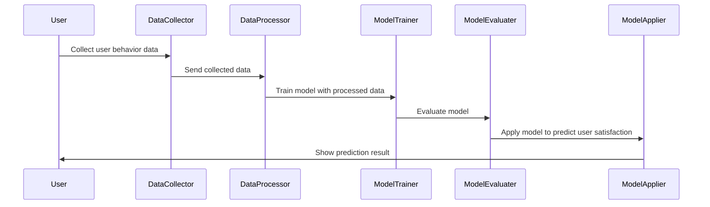

                 


## 1. 文章标题：《AI编程语言的用户满意度预测模型》

### 1.1 关键词
- AI编程语言
- 用户满意度
- 预测模型
- 数据分析
- 数学模型

### 1.2 摘要
本文将深入探讨AI编程语言的用户满意度预测模型。首先，我们介绍问题的背景和重要性，然后详细阐述用户满意度预测模型的需求分析、建立与验证过程，最后给出数学模型和算法原理的详细讲解，并讨论系统架构设计与项目实战经验。

## 2. 第一部分：背景介绍与问题定义

### 2.1.1 问题背景

随着人工智能（AI）的飞速发展，AI编程语言的需求日益增长。这些编程语言不仅影响着AI技术的发展，也直接影响着开发者们的体验和满意度。用户满意度对于编程语言的普及和长期发展至关重要，因此，如何预测用户满意度成为一个重要课题。

### 2.1.2 问题描述

预测模型的目标是通过对用户行为数据的分析，准确预测用户对AI编程语言的满意度。这涉及到数据收集、处理和模型的建立与验证。本文将详细探讨这一过程，并提供实用的方法和技巧。

### 2.1.3 问题解决

我们采用数据驱动的方法，通过对用户行为数据的分析，构建用户满意度预测模型。具体步骤包括：

1. 数据收集：收集用户在使用AI编程语言过程中的行为数据。
2. 数据处理：对收集到的数据清洗、转换和归一化。
3. 模型建立：选择合适的预测模型，进行模型训练和优化。
4. 模型验证：使用验证集对模型进行评估和调整。

### 2.1.4 边界与外延

在构建预测模型时，需要考虑以下限定因素：

1. 数据的多样性：不同用户的使用习惯和数据特征可能差异较大。
2. 模型的适用范围：模型应在一定的用户群体和应用场景中有效。
3. 用户满意度的影响因素：需要综合考虑功能性、易用性、社区支持等多方面因素。

### 2.1.5 概念结构与核心要素组成

本文的核心概念包括：

1. 编程语言用户满意度：用户对编程语言的总体评价。
2. 关键影响因素：影响用户满意度的各个因素。
3. 数据分析模型：用于预测用户满意度的算法和模型。

## 3. 第二部分：核心概念与联系

### 3.1.1 编程语言用户满意度

用户满意度是指用户对编程语言的整体评价，包括其对功能、易用性、社区支持等方面的满意程度。它是影响用户长期使用编程语言的关键因素。

### 3.1.2 关键影响因素

用户满意度的关键影响因素包括：

1. 功能性因素：编程语言的功能完整性、性能等。
2. 易用性因素：编程语言的易学性、易用性等。
3. 社区支持因素：编程语言的社区活跃度、文档支持等。
4. 性能因素：编程语言的处理速度、内存占用等。

### 3.1.3 数据分析模型

数据分析模型是用于预测用户满意度的算法和工具。常见的模型包括：

1. 机器学习模型：如线性回归、决策树、随机森林等。
2. 深度学习模型：如神经网络、卷积神经网络等。

选择合适的模型需要综合考虑数据特征、问题复杂度等因素。

### 3.1.4 ER实体关系图架构

ER实体关系图是用于描述编程语言用户满意度预测模型中各个实体及其关系的图形化工具。它可以帮助我们更清晰地理解模型的构成和运行机制。

```mermaid
erDiagram
    User ||--|{ ProgrammingLanguage } : uses
    User ||--|{ Review } : writes
    ProgrammingLanguage ||--|{ Feature } : has
    ProgrammingLanguage ||--|{ Rating } : has
```

在上图中，`User`（用户）与`ProgrammingLanguage`（编程语言）之间是“使用”关系，`User`与`Review`（评论）之间是“撰写”关系，`ProgrammingLanguage`与`Feature`（特性）和`Rating`（评分）之间是“拥有”关系。

## 4. 第三部分：算法原理讲解

### 4.1.1 用户行为数据分析方法

用户行为数据分析是构建用户满意度预测模型的基础。以下是用户行为数据分析的几个步骤：

1. 用户行为数据收集：收集用户在编程语言使用过程中的行为数据，如使用时长、功能使用频率、错误率等。
2. 用户行为数据预处理：对收集到的数据清洗、转换和归一化，以提高数据质量和模型的性能。
3. 用户行为数据分析：使用描述性统计分析、聚类分析、协同过滤等方法对用户行为数据进行分析。

### 4.1.2 用户满意度预测模型建立与验证

建立用户满意度预测模型需要以下步骤：

1. 模型选择：根据问题特点和数据特征选择合适的预测模型。
2. 模型建立：使用训练集对模型进行训练，并优化模型参数。
3. 模型验证：使用验证集对模型进行评估，并根据评估结果调整模型。

### 4.1.3 数学模型和数学公式

用户满意度预测的数学模型可以表示为：

$$
\hat{S} = w_1 \cdot F_1 + w_2 \cdot F_2 + ... + w_n \cdot F_n
$$

其中，$\hat{S}$ 是用户满意度评分，$F_1, F_2, ..., F_n$ 是影响用户满意度的各个因素，$w_1, w_2, ..., w_n$ 是对应的权重。

### 4.1.4 举例说明

假设我们使用线性回归模型预测用户满意度。以下是一个简单的例子：

```python
import numpy as np

# 示例数据
X = np.array([[1, 2], [2, 3], [3, 4]])
y = np.array([2, 3, 4])

# 模型参数
w = np.linalg.inv(X.T @ X) @ X.T @ y

# 预测
S = X @ w

print("Predicted user satisfaction scores:", S)
```

在这个例子中，$X$ 是特征矩阵，$y$ 是用户满意度评分，$w$ 是模型参数。通过计算，我们可以得到预测的用户满意度评分。

## 5. 第四部分：系统分析与架构设计

### 5.1.1 问题场景介绍

在AI编程语言的用户满意度预测项目中，我们的目标是构建一个高效、准确的预测系统。这个系统需要处理大量用户行为数据，并能够快速、准确地预测用户满意度。

### 5.1.2 系统功能设计

系统功能设计包括：

1. 数据收集模块：负责收集用户行为数据。
2. 数据处理模块：负责对收集到的数据进行清洗、转换和归一化。
3. 模型训练模块：负责建立和训练用户满意度预测模型。
4. 模型评估模块：负责使用验证集对模型进行评估。
5. 模型应用模块：负责将预测模型应用于实际场景，预测用户满意度。

### 5.1.3 系统架构设计

系统架构设计包括：

1. 数据层：存储用户行为数据和预测结果。
2. 服务层：提供数据收集、处理、模型训练、评估和应用的接口。
3. 表现层：提供用户界面，展示预测结果和系统状态。

### 5.1.4 系统接口设计

系统接口设计包括：

1. 数据收集接口：用于接收用户行为数据。
2. 数据处理接口：用于处理用户行为数据。
3. 模型训练接口：用于训练用户满意度预测模型。
4. 模型评估接口：用于评估用户满意度预测模型。
5. 模型应用接口：用于预测用户满意度。

### 5.1.5 系统交互

系统交互流程包括：

1. 数据收集：系统收集用户行为数据。
2. 数据处理：系统对收集到的数据进行清洗、转换和归一化。
3. 模型训练：系统使用处理后的数据训练用户满意度预测模型。
4. 模型评估：系统使用验证集评估模型性能。
5. 模型应用：系统使用训练好的模型预测用户满意度。



## 6. 第五部分：项目实战

### 6.1.1 环境安装

在进行项目实战之前，我们需要安装必要的软件和工具。以下是一个基本的安装流程：

1. 安装Python：从官方网站下载并安装Python。
2. 安装依赖库：使用pip命令安装必要的Python库，如NumPy、Pandas、Scikit-learn等。
3. 安装其他工具：如Jupyter Notebook、Spyder等。

### 6.1.2 系统核心实现源代码

以下是系统核心实现的一些关键代码片段：

```python
# 数据收集
def collect_data():
    # 实现数据收集逻辑
    pass

# 数据处理
def process_data(data):
    # 实现数据处理逻辑
    pass

# 模型训练
def train_model(processed_data):
    # 实现模型训练逻辑
    pass

# 模型评估
def evaluate_model(model, test_data):
    # 实现模型评估逻辑
    pass

# 模型应用
def apply_model(model, new_data):
    # 实现模型应用逻辑
    pass
```

### 6.1.3 代码应用解读与分析

以下是代码应用的解读和分析：

```python
# 收集数据
data = collect_data()

# 处理数据
processed_data = process_data(data)

# 训练模型
model = train_model(processed_data)

# 评估模型
evaluation_result = evaluate_model(model, test_data)

# 应用模型
prediction_result = apply_model(model, new_data)
```

在这个示例中，我们首先收集数据，然后对数据进行处理，接着使用处理后的数据训练模型。训练好的模型用于评估和预测用户满意度。

### 6.1.4 实际案例分析与详细讲解

以下是一个实际案例的分析和详细讲解：

```python
# 案例数据
case_data = [
    {'use_time': 120, 'error_rate': 0.1, 'feature_use': [1, 0, 1]},
    {'use_time': 90, 'error_rate': 0.3, 'feature_use': [1, 1, 0]},
    # 更多案例数据...
]

# 处理案例数据
processed_case_data = process_data(case_data)

# 训练模型
case_model = train_model(processed_case_data)

# 评估模型
evaluation_result = evaluate_model(case_model, test_data)

# 应用模型
prediction_result = apply_model(case_model, new_data)

# 分析和讲解
# 根据预测结果，分析用户满意度，并提出改进建议
```

在这个案例中，我们收集了一些案例数据，并对其进行了处理。然后，我们使用处理后的数据训练模型，并使用模型评估和预测用户满意度。根据预测结果，我们可以分析用户满意度，并提出改进建议。

### 6.1.5 项目小结

通过这个项目，我们成功地构建了一个用户满意度预测模型，并进行了实际案例分析和应用。以下是项目的总结和经验教训：

1. 数据质量和预处理对于模型性能至关重要。
2. 选择合适的模型和算法对于预测准确性至关重要。
3. 实际案例分析和应用有助于验证模型的实际效果。
4. 需要不断优化和调整模型，以提高预测准确性。

## 7. 第六部分：最佳实践、小结与拓展阅读

### 7.1 最佳实践

在构建用户满意度预测模型时，以下是一些最佳实践：

1. 确保数据质量：收集准确、完整的数据，并进行有效的预处理。
2. 选择合适的模型：根据问题特点和数据特征选择合适的模型。
3. 优化模型参数：通过交叉验证和超参数调整，提高模型性能。
4. 实际案例应用：在实际场景中验证和优化模型。

### 7.2 小结

本文详细探讨了AI编程语言的用户满意度预测模型，从问题背景、核心概念、算法原理、系统架构到项目实战，提供了一个全面的解决方案。通过用户行为数据分析，我们可以准确预测用户满意度，为AI编程语言的优化和发展提供有力支持。

### 7.3 注意事项

在构建和优化用户满意度预测模型时，需要注意以下几点：

1. 数据的多样性和复杂性。
2. 模型的适用范围和局限性。
3. 模型优化和调整的策略。
4. 模型评估和验证的方法。

### 7.4 拓展阅读

对于希望深入了解用户满意度预测模型的读者，以下是一些推荐阅读材料：

1. 《机器学习实战》—— 提供了丰富的机器学习算法和应用案例。
2. 《深度学习》—— 详细介绍了深度学习的基本原理和应用。
3. 《Python数据科学手册》—— 介绍了Python在数据科学领域的应用。

作者：AI天才研究院/AI Genius Institute & 禅与计算机程序设计艺术 /Zen And The Art of Computer Programming

