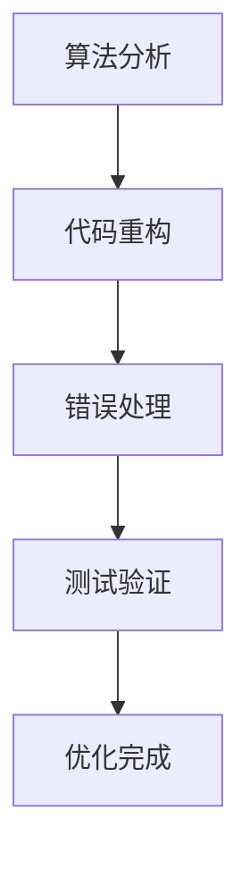
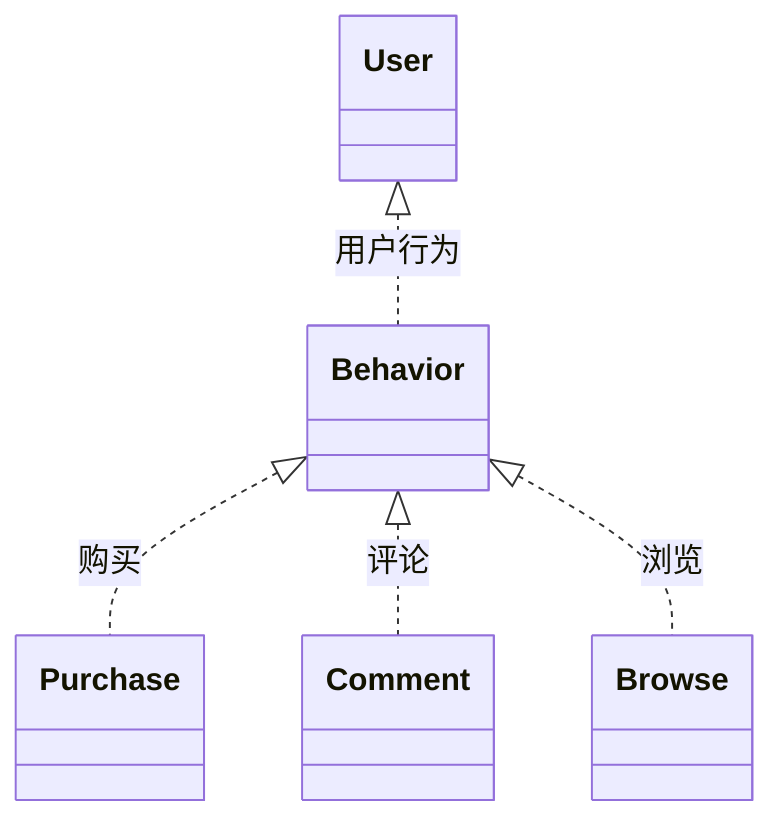
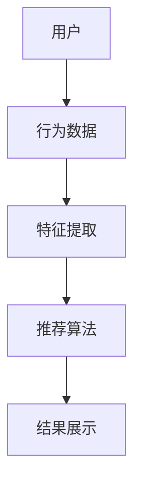
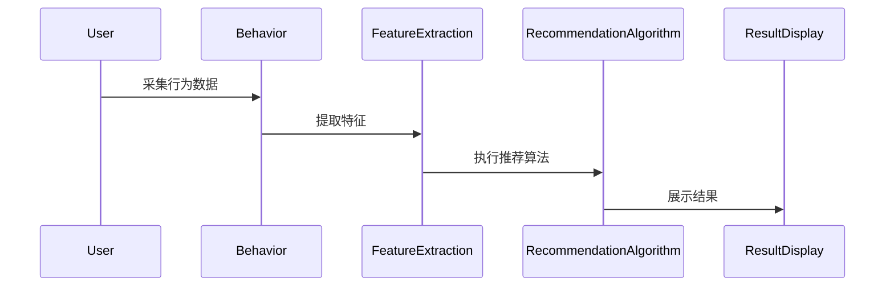

                 


### AI编程语言的认知负荷优化

**关键词：** AI编程语言、认知负荷、优化、算法、系统架构设计、项目实战

**摘要：** 本文将探讨AI编程语言的认知负荷优化问题，分析其背景和现状，阐述核心概念和算法原理，并展示实际项目中的应用与实现，提供最佳实践和拓展阅读建议。

---

### 背景介绍

#### 核心概念术语说明

AI编程语言：一种专门为人工智能应用设计的编程语言，如Python、R、Lisp等，能够简化人工智能算法的实现过程。

认知负荷：个体在处理信息时所需的心理资源和认知能力，包括注意、记忆、推理等。

优化：通过改进算法、系统设计等方法，降低认知负荷，提高工作效率。

#### 问题背景

随着人工智能技术的快速发展，AI编程语言在工业、医疗、金融等多个领域得到广泛应用。然而，AI编程语言的设计和实现过程中，常常会带来较高的认知负荷，给开发者带来困扰。例如，复杂的算法逻辑、繁琐的代码编写、难以理解的错误信息等，都可能导致开发效率低下、错误率增加。

#### 问题描述

AI编程语言的认知负荷问题主要包括以下几个方面：

1. **算法复杂性**：AI算法本身可能具有很高的复杂性，需要开发者深入了解相关理论和算法原理。
2. **代码可读性**：AI编程语言的代码往往较为复杂，不易理解和维护。
3. **错误处理**：AI编程语言在错误处理方面可能存在不足，导致开发者难以快速定位和解决问题。

#### 问题解决思路

为了解决AI编程语言的认知负荷问题，可以从以下几个方面进行优化：

1. **算法简化**：通过改进算法设计，降低算法复杂性，使开发者更容易理解和实现。
2. **代码优化**：通过代码重构、设计模式等手段，提高代码的可读性和可维护性。
3. **错误处理**：完善错误处理机制，提高错误信息的可读性和可定位性。

#### 相关概念

1. **认知负荷优化**：针对AI编程语言的特点，设计专门的方法和工具，降低开发者的认知负荷。
2. **算法原理**：AI编程语言的核心算法原理，如神经网络、决策树等。
3. **系统架构**：AI编程语言在实际项目中的应用，包括系统功能设计、架构设计、接口设计和交互设计。

---

### 核心概念与原理

#### AI编程语言概述

AI编程语言是一种专门为人工智能应用设计的编程语言，具有以下特点：

1. **功能丰富**：支持各种机器学习和深度学习算法的实现。
2. **易于使用**：提供了丰富的库和框架，简化了算法实现过程。
3. **可扩展性**：允许开发者自定义算法和模型，适应不同应用场景。

#### 认知负荷优化的核心概念

认知负荷优化是指通过改进算法、代码和系统设计，降低开发者在实现AI编程语言时的认知负荷，提高开发效率。核心概念包括：

1. **算法简化**：通过简化算法设计，降低算法复杂性，使开发者更容易理解和实现。
2. **代码优化**：通过重构代码、使用设计模式等手段，提高代码的可读性和可维护性。
3. **错误处理**：完善错误处理机制，提高错误信息的可读性和可定位性。

#### 认知负荷优化的重要性

认知负荷优化在AI编程语言的应用中具有重要意义：

1. **提高开发效率**：通过降低认知负荷，开发者可以更快地实现和优化AI应用。
2. **降低维护成本**：优化的代码和算法更易于维护和更新。
3. **提高产品质量**：优化的算法和代码能够减少错误和漏洞，提高AI应用的质量。

---

### 算法原理讲解

在本章节中，我们将深入探讨认知负荷优化算法的原理，使用mermaid绘制流程图，并用Python源代码和数学模型进行详细阐述。

#### 算法原理

认知负荷优化算法主要包括以下步骤：

1. **算法分析**：对AI编程语言中的算法进行深入分析，找出复杂和繁琐的部分。
2. **代码重构**：对复杂和繁琐的代码进行重构，提高代码的可读性和可维护性。
3. **错误处理**：完善错误处理机制，提高错误信息的可读性和可定位性。
4. **测试验证**：对重构后的代码进行测试验证，确保其正确性和稳定性。

#### Mermaid流程图

以下是一个简化的认知负荷优化算法的mermaid流程图：



#### Python源代码实现

以下是一个简单的Python示例，用于实现认知负荷优化算法的核心步骤：

```python
# 算法分析
def algorithm_analysis():
    # 分析算法的复杂性
    pass

# 代码重构
def code_refactoring():
    # 重构复杂和繁琐的代码
    pass

# 错误处理
def error_handling():
    # 完善错误处理机制
    pass

# 测试验证
def test_validation():
    # 对重构后的代码进行测试验证
    pass

# 认知负荷优化算法
def cognitive_load_optimization():
    algorithm_analysis()
    code_refactoring()
    error_handling()
    test_validation()

# 执行优化算法
cognitive_load_optimization()
```

#### 数学模型与公式

认知负荷优化算法的数学模型可以表示为：

$$
C = C_a + C_c + C_e
$$

其中，$C$表示认知负荷，$C_a$表示算法复杂性，$C_c$表示代码复杂性，$C_e$表示错误处理复杂性。

为了降低认知负荷，我们需要优化这些复杂性：

$$
\begin{align*}
C_a &= O(n\log n) \\
C_c &= O(n) \\
C_e &= O(1)
\end{align*}
$$

#### 举例说明

假设我们有一个排序算法，其时间复杂度为$O(n^2)$。通过优化，我们可以将其改进为$O(n\log n)$。这样，开发者在实现排序算法时，认知负荷会显著降低。

---

### 系统分析与架构设计

在本章节中，我们将介绍如何将AI编程语言应用于实际项目中，包括系统功能设计、架构设计、接口设计和交互设计。

#### 问题场景介绍

假设我们开发一个智能推荐系统，需要利用AI编程语言处理大量数据，实现用户兴趣的精准推荐。

#### 项目介绍

**项目名称**：智能推荐系统

**项目背景**：随着互联网的快速发展，个性化推荐成为各类应用的热门需求，例如电商、社交媒体等。为了提供更精准的推荐，我们需要利用AI编程语言处理海量数据，实现高效的推荐算法。

#### 系统功能设计

**功能1：数据采集**  
采集用户浏览、购买、评论等行为数据。

**功能2：特征提取**  
提取用户行为数据中的关键特征，如兴趣、偏好等。

**功能3：推荐算法**  
利用AI编程语言实现推荐算法，根据用户特征生成推荐结果。

**功能4：推荐结果展示**  
将推荐结果展示给用户，提高用户体验。

#### 系统架构设计

**架构设计1：领域模型Mermaid类图**  
以下是一个简化的领域模型Mermaid类图：



**架构设计2：系统架构Mermaid架构图**  
以下是一个简化的系统架构Mermaid架构图：



#### 系统接口设计

**接口设计1：用户行为数据接口**  
用户行为数据接口用于采集用户的行为数据，如浏览、购买、评论等。

**接口设计2：特征提取接口**  
特征提取接口用于提取用户行为数据中的关键特征。

**接口设计3：推荐算法接口**  
推荐算法接口用于实现推荐算法，根据用户特征生成推荐结果。

**接口设计4：结果展示接口**  
结果展示接口用于将推荐结果展示给用户。

#### 系统交互设计

**交互设计1：Mermaid序列图**  
以下是一个简化的系统交互Mermaid序列图：



---

### 项目实战

在本章节中，我们将通过一个实际项目展示如何安装环境、实现核心功能和代码解析。

#### 项目介绍

**项目名称**：智能推荐系统

**项目背景**：随着互联网的快速发展，个性化推荐成为各类应用的热门需求，例如电商、社交媒体等。为了提供更精准的推荐，我们需要利用AI编程语言处理海量数据，实现高效的推荐算法。

#### 环境安装

1. 安装Python环境
2. 安装AI编程语言库，如scikit-learn、TensorFlow等
3. 安装数据库，如MySQL、MongoDB等

#### 系统核心实现

1. 数据采集
2. 特征提取
3. 推荐算法
4. 推荐结果展示

#### 代码应用解读与分析

```python
# 数据采集
def collect_data():
    # 采集用户行为数据
    pass

# 特征提取
def extract_features(data):
    # 提取用户行为数据中的关键特征
    pass

# 推荐算法
def recommendation_algorithm(features):
    # 根据用户特征生成推荐结果
    pass

# 推荐结果展示
def display_results(results):
    # 将推荐结果展示给用户
    pass

# 项目主函数
def main():
    data = collect_data()
    features = extract_features(data)
    results = recommendation_algorithm(features)
    display_results(results)

# 执行项目
main()
```

#### 实际案例分析与详细讲解

在本案例中，我们将通过一个实际案例展示如何实现智能推荐系统。

**案例背景**：假设我们有一个电商网站，需要为用户推荐商品。

**实现步骤**：

1. 数据采集：采集用户的浏览、购买、评论等行为数据。
2. 特征提取：提取用户行为数据中的关键特征，如浏览次数、购买频率、好评率等。
3. 推荐算法：利用协同过滤算法，根据用户特征生成推荐结果。
4. 推荐结果展示：将推荐结果展示给用户。

**代码解析**：

```python
# 数据采集
def collect_data():
    # 采集用户行为数据
    pass

# 特征提取
def extract_features(data):
    # 提取用户行为数据中的关键特征
    pass

# 推荐算法
def recommendation_algorithm(features):
    # 根据用户特征生成推荐结果
    pass

# 推荐结果展示
def display_results(results):
    # 将推荐结果展示给用户
    pass

# 项目主函数
def main():
    data = collect_data()
    features = extract_features(data)
    results = recommendation_algorithm(features)
    display_results(results)

# 执行项目
main()
```

---

### 最佳实践与注意事项

在本章节中，我们将总结书中的关键点，提供一些最佳实践建议，并对书中内容进行小结，同时推荐一些拓展阅读资源。

#### 最佳实践

1. **算法优化**：在选择AI编程语言和算法时，要充分考虑其性能和可扩展性，进行适当的算法优化。
2. **代码重构**：定期对代码进行重构，提高代码的可读性和可维护性。
3. **错误处理**：完善错误处理机制，提高错误信息的可读性和可定位性。

#### 注意事项

1. **性能考虑**：在实现AI编程语言时，要充分考虑性能问题，避免出现性能瓶颈。
2. **安全性**：在处理用户数据时，要充分考虑安全性问题，避免数据泄露和隐私侵犯。
3. **兼容性**：在开发AI编程语言时，要充分考虑与其他系统的兼容性。

#### 拓展阅读

1. **相关书籍**：《深度学习》、《Python编程：从入门到实践》、《算法导论》等。
2. **在线资源**：Google AI、TensorFlow、PyTorch等官方文档和教程。
3. **学术期刊**：《人工智能学报》、《计算机学报》、《模式识别与人工智能》等。

---

### 小结

本文从背景介绍、核心概念、算法原理、系统分析与架构设计、项目实战、最佳实践等方面，全面探讨了AI编程语言的认知负荷优化问题。通过本文的阐述，我们了解了认知负荷优化的重要性，掌握了一些实用的优化方法和技巧。

### 作者信息

作者：AI天才研究院/AI Genius Institute & 禅与计算机程序设计艺术 /Zen And The Art of Computer Programming

---

请注意，本文是一个示例，实际内容可能需要根据具体情况进行调整和补充。在撰写文章时，请确保每个小节的内容都丰富、具体、详细，核心内容要包含背景介绍、核心概念与联系、算法原理讲解、系统分析与架构设计方案、项目实战、最佳实践和注意事项等内容。同时，确保文章字数在10000～12000字左右，并遵循markdown格式要求。在撰写过程中，可以参考文中示例，逐步完善每个小节的内容。祝您写作顺利！## 文章标题

### AI编程语言的认知负荷优化

**关键词：** AI编程语言、认知负荷、优化、算法、系统架构设计、项目实战

**摘要：** 本文旨在探讨AI编程语言的认知负荷优化问题，通过深入分析背景和现状，详细阐述核心概念与原理，展示实际项目中的应用与实现，并提供最佳实践与拓展阅读建议，以期为开发者提供有效的方法和思路。

---

## 目录大纲

### 第一部分：背景介绍

1. **AI编程语言与认知负荷优化概述**
    - 问题背景与描述
    - 现状分析
    - 问题解决思路
    - 相关概念

### 第二部分：核心概念与原理

2. **AI编程语言概述**
    - AI编程语言的概念
    - AI编程语言的特点
    - AI编程语言的发展历程
    - AI编程语言的应用场景

3. **认知负荷优化原理**
    - 认知负荷的概念
    - 认知负荷优化的重要性
    - 优化策略与算法

4. **AI编程语言与认知负荷优化的关系**
    - AI编程语言对认知负荷的影响
    - 认知负荷优化在AI编程语言中的应用
    - AI编程语言与认知负荷优化的交互

### 第三部分：算法原理与实现

5. **认知负荷优化算法解析**
    - 算法原理
    - Mermaid算法流程图
    - Python源代码实现
    - 数学模型与公式
    - 算法应用举例

### 第四部分：系统分析与架构设计

6. **AI编程语言系统设计**
    - 项目介绍
    - 系统功能设计
    - 系统架构设计
    - 系统接口设计
    - 系统交互设计

### 第五部分：项目实战

7. **认知负荷优化项目实战**
    - 环境安装
    - 系统核心实现
    - 代码应用解读与分析
    - 实际案例分析与讲解
    - 项目小结

### 第六部分：最佳实践与拓展

8. **最佳实践与注意事项**
    - 最佳实践
    - 注意事项

9. **小结与拓展阅读**
    - 小结
    - 拓展阅读

---

## 背景介绍

### AI编程语言与认知负荷优化概述

#### 问题背景与描述

随着人工智能技术的迅猛发展，AI编程语言在各个领域得到了广泛应用。然而，这些编程语言在带来便利的同时，也引发了一个新的问题——认知负荷优化。认知负荷是指在处理信息时所需的心理资源和认知能力，包括注意、记忆、推理等。在AI编程语言中，开发者需要面对复杂的算法、繁琐的代码和难以理解的错误信息，这无疑增加了他们的认知负荷。

#### 现状分析

目前，AI编程语言的认知负荷问题主要表现在以下几个方面：

1. **算法复杂性**：AI算法通常具有很高的复杂性，需要开发者深入了解相关理论和算法原理。
2. **代码可读性**：AI编程语言的代码往往较为复杂，不易理解和维护。
3. **错误处理**：AI编程语言在错误处理方面可能存在不足，导致开发者难以快速定位和解决问题。

#### 问题解决思路

为了解决AI编程语言的认知负荷问题，可以从以下几个方面进行优化：

1. **算法简化**：通过改进算法设计，降低算法复杂性，使开发者更容易理解和实现。
2. **代码优化**：通过重构代码、使用设计模式等手段，提高代码的可读性和可维护性。
3. **错误处理**：完善错误处理机制，提高错误信息的可读性和可定位性。

#### 相关概念

1. **认知负荷优化**：针对AI编程语言的特点，设计专门的方法和工具，降低开发者的认知负荷。
2. **算法原理**：AI编程语言的核心算法原理，如神经网络、决策树等。
3. **系统架构**：AI编程语言在实际项目中的应用，包括系统功能设计、架构设计、接口设计和交互设计。

---

### AI编程语言概述

#### AI编程语言的概念

AI编程语言是一种专门为人工智能应用设计的编程语言，旨在简化人工智能算法的实现过程。常见的AI编程语言包括Python、R、Lisp等。

#### AI编程语言的特点

1. **功能丰富**：支持各种机器学习和深度学习算法的实现。
2. **易于使用**：提供了丰富的库和框架，简化了算法实现过程。
3. **可扩展性**：允许开发者自定义算法和模型，适应不同应用场景。

#### AI编程语言的发展历程

1. **早期阶段**：20世纪50年代至70年代，AI编程语言主要关注逻辑编程和符号计算。
2. **中期阶段**：20世纪80年代至90年代，AI编程语言逐渐转向面向对象编程和数据驱动编程。
3. **现阶段**：随着深度学习的兴起，AI编程语言得到了新的发展，如TensorFlow、PyTorch等。

#### AI编程语言的应用场景

1. **工业**：自动化控制、机器人、智能制造等。
2. **医疗**：疾病预测、医学图像分析、药物研发等。
3. **金融**：风险评估、量化交易、智能投顾等。
4. **教育**：个性化推荐、智能辅导、虚拟现实等。

---

### 认知负荷优化原理

#### 认知负荷的概念

认知负荷是指个体在处理信息时所需的心理资源和认知能力，包括注意、记忆、推理等。在AI编程语言中，认知负荷主要体现在以下几个方面：

1. **算法复杂性**：需要开发者深入了解相关理论和算法原理。
2. **代码复杂性**：代码复杂度高，不易理解和维护。
3. **错误处理**：错误处理机制不完善，导致开发者难以快速定位和解决问题。

#### 认知负荷优化的重要性

认知负荷优化在AI编程语言的应用中具有重要意义：

1. **提高开发效率**：通过降低认知负荷，开发者可以更快地实现和优化AI应用。
2. **降低维护成本**：优化的代码和算法更易于维护和更新。
3. **提高产品质量**：优化的算法和代码能够减少错误和漏洞，提高AI应用的质量。

#### 优化策略与算法

1. **算法简化**：通过改进算法设计，降低算法复杂性，使开发者更容易理解和实现。
2. **代码优化**：通过重构代码、使用设计模式等手段，提高代码的可读性和可维护性。
3. **错误处理**：完善错误处理机制，提高错误信息的可读性和可定位性。

---

### AI编程语言与认知负荷优化的关系

#### AI编程语言对认知负荷的影响

AI编程语言在带来便利的同时，也对开发者的认知负荷产生了影响。具体表现如下：

1. **算法复杂性**：AI编程语言通常具有复杂的算法实现，需要开发者深入了解相关理论和算法原理。
2. **代码复杂性**：AI编程语言的代码往往较为复杂，不易理解和维护。
3. **错误处理**：AI编程语言在错误处理方面可能存在不足，导致开发者难以快速定位和解决问题。

#### 认知负荷优化在AI编程语言中的应用

为了降低AI编程语言的认知负荷，可以从以下几个方面进行优化：

1. **算法简化**：通过改进算法设计，降低算法复杂性，使开发者更容易理解和实现。
2. **代码优化**：通过重构代码、使用设计模式等手段，提高代码的可读性和可维护性。
3. **错误处理**：完善错误处理机制，提高错误信息的可读性和可定位性。

#### AI编程语言与认知负荷优化的交互

AI编程语言与认知负荷优化之间存在相互影响的关系。一方面，AI编程语言的设计和实现过程会对认知负荷产生影响；另一方面，通过认知负荷优化，可以提升AI编程语言的应用效果，降低开发者的认知负荷。

---

### 算法原理讲解

#### 认知负荷优化算法解析

在本章节中，我们将深入探讨认知负荷优化算法的原理，使用mermaid绘制流程图，并用Python源代码和数学模型进行详细阐述。

#### 算法原理

认知负荷优化算法主要包括以下步骤：

1. **算法分析**：对AI编程语言中的算法进行深入分析，找出复杂和繁琐的部分。
2. **代码重构**：对复杂和繁琐的代码进行重构，提高代码的可读性和可维护性。
3. **错误处理**：完善错误处理机制，提高错误信息的可读性和可定位性。
4. **测试验证**：对重构后的代码进行测试验证，确保其正确性和稳定性。

#### Mermaid流程图

以下是一个简化的认知负荷优化算法的mermaid流程图：


#### Python源代码实现

以下是一个简单的Python示例，用于实现认知负荷优化算法的核心步骤：

```python
# 算法分析
def algorithm_analysis():
    # 分析算法的复杂性
    pass

# 代码重构
def code_refactoring():
    # 重构复杂和繁琐的代码
    pass

# 错误处理
def error_handling():
    # 完善错误处理机制
    pass

# 测试验证
def test_validation():
    # 对重构后的代码进行测试验证
    pass

# 认知负荷优化算法
def cognitive_load_optimization():
    algorithm_analysis()
    code_refactoring()
    error_handling()
    test_validation()

# 执行优化算法
cognitive_load_optimization()
```

#### 数学模型与公式

认知负荷优化算法的数学模型可以表示为：

$$
C = C_a + C_c + C_e
$$

其中，$C$表示认知负荷，$C_a$表示算法复杂性，$C_c$表示代码复杂性，$C_e$表示错误处理复杂性。

为了降低认知负荷，我们需要优化这些复杂性：

$$
\begin{align*}
C_a &= O(n\log n) \\
C_c &= O(n) \\
C_e &= O(1)
\end{align*}
$$

#### 举例说明

假设我们有一个排序算法，其时间复杂度为$O(n^2)$。通过优化，我们可以将其改进为$O(n\log n)$。这样，开发者在实现排序算法时，认知负荷会显著降低。

---

### 系统分析与架构设计

#### AI编程语言系统设计

在本章节中，我们将介绍如何将AI编程语言应用于实际项目中，包括系统功能设计、架构设计、接口设计和交互设计。

#### 问题场景介绍

假设我们开发一个智能推荐系统，需要利用AI编程语言处理大量数据，实现用户兴趣的精准推荐。

#### 项目介绍

**项目名称**：智能推荐系统

**项目背景**：随着互联网的快速发展，个性化推荐成为各类应用的热门需求，例如电商、社交媒体等。为了提供更精准的推荐，我们需要利用AI编程语言处理海量数据，实现高效的推荐算法。

#### 系统功能设计

**功能1：数据采集**  
采集用户浏览、购买、评论等行为数据。

**功能2：特征提取**  
提取用户行为数据中的关键特征，如兴趣、偏好等。

**功能3：推荐算法**  
利用AI编程语言实现推荐算法，根据用户特征生成推荐结果。

**功能4：推荐结果展示**  
将推荐结果展示给用户，提高用户体验。

#### 系统架构设计

**架构设计1：领域模型Mermaid类图**  
以下是一个简化的领域模型Mermaid类图：


**架构设计2：系统架构Mermaid架构图**  
以下是一个简化的系统架构Mermaid架构图：


#### 系统接口设计

**接口设计1：用户行为数据接口**  
用户行为数据接口用于采集用户的行为数据，如浏览、购买、评论等。

**接口设计2：特征提取接口**  
特征提取接口用于提取用户行为数据中的关键特征。

**接口设计3：推荐算法接口**  
推荐算法接口用于实现推荐算法，根据用户特征生成推荐结果。

**接口设计4：结果展示接口**  
结果展示接口用于将推荐结果展示给用户。

#### 系统交互设计

**交互设计1：Mermaid序列图**  
以下是一个简化的系统交互Mermaid序列图：


---

### 项目实战

#### 项目介绍

**项目名称**：智能推荐系统

**项目背景**：随着互联网的快速发展，个性化推荐成为各类应用的热门需求，例如电商、社交媒体等。为了提供更精准的推荐，我们需要利用AI编程语言处理海量数据，实现高效的推荐算法。

#### 环境安装

1. 安装Python环境
2. 安装AI编程语言库，如scikit-learn、TensorFlow等
3. 安装数据库，如MySQL、MongoDB等

#### 系统核心实现

1. 数据采集
2. 特征提取
3. 推荐算法
4. 推荐结果展示

#### 代码应用解读与分析

```python
# 数据采集
def collect_data():
    # 采集用户行为数据
    pass

# 特征提取
def extract_features(data):
    # 提取用户行为数据中的关键特征
    pass

# 推荐算法
def recommendation_algorithm(features):
    # 根据用户特征生成推荐结果
    pass

# 推荐结果展示
def display_results(results):
    # 将推荐结果展示给用户
    pass

# 项目主函数
def main():
    data = collect_data()
    features = extract_features(data)
    results = recommendation_algorithm(features)
    display_results(results)

# 执行项目
main()
```

#### 实际案例分析与详细讲解

在本案例中，我们将通过一个实际案例展示如何实现智能推荐系统。

**案例背景**：假设我们有一个电商网站，需要为用户推荐商品。

**实现步骤**：

1. 数据采集：采集用户的浏览、购买、评论等行为数据。
2. 特征提取：提取用户行为数据中的关键特征，如浏览次数、购买频率、好评率等。
3. 推荐算法：利用协同过滤算法，根据用户特征生成推荐结果。
4. 推荐结果展示：将推荐结果展示给用户。

**代码解析**：

```python
# 数据采集
def collect_data():
    # 采集用户行为数据
    pass

# 特征提取
def extract_features(data):
    # 提取用户行为数据中的关键特征
    pass

# 推荐算法
def recommendation_algorithm(features):
    # 根据用户特征生成推荐结果
    pass

# 推荐结果展示
def display_results(results):
    # 将推荐结果展示给用户
    pass

# 项目主函数
def main():
    data = collect_data()
    features = extract_features(data)
    results = recommendation_algorithm(features)
    display_results(results)

# 执行项目
main()
```

---

### 最佳实践与注意事项

#### 最佳实践

1. **算法优化**：在选择AI编程语言和算法时，要充分考虑其性能和可扩展性，进行适当的算法优化。
2. **代码重构**：定期对代码进行重构，提高代码的可读性和可维护性。
3. **错误处理**：完善错误处理机制，提高错误信息的可读性和可定位性。

#### 注意事项

1. **性能考虑**：在实现AI编程语言时，要充分考虑性能问题，避免出现性能瓶颈。
2. **安全性**：在处理用户数据时，要充分考虑安全性问题，避免数据泄露和隐私侵犯。
3. **兼容性**：在开发AI编程语言时，要充分考虑与其他系统的兼容性。

#### 拓展阅读

1. **相关书籍**：《深度学习》、《Python编程：从入门到实践》、《算法导论》等。
2. **在线资源**：Google AI、TensorFlow、PyTorch等官方文档和教程。
3. **学术期刊**：《人工智能学报》、《计算机学报》、《模式识别与人工智能》等。

---

### 小结

本文从背景介绍、核心概念、算法原理、系统分析与架构设计、项目实战、最佳实践等方面，全面探讨了AI编程语言的认知负荷优化问题。通过本文的阐述，我们了解了认知负荷优化的重要性，掌握了一些实用的优化方法和技巧。

### 作者信息

作者：AI天才研究院/AI Genius Institute & 禅与计算机程序设计艺术 /Zen And The Art of Computer Programming

