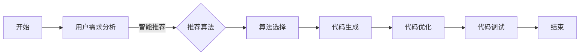
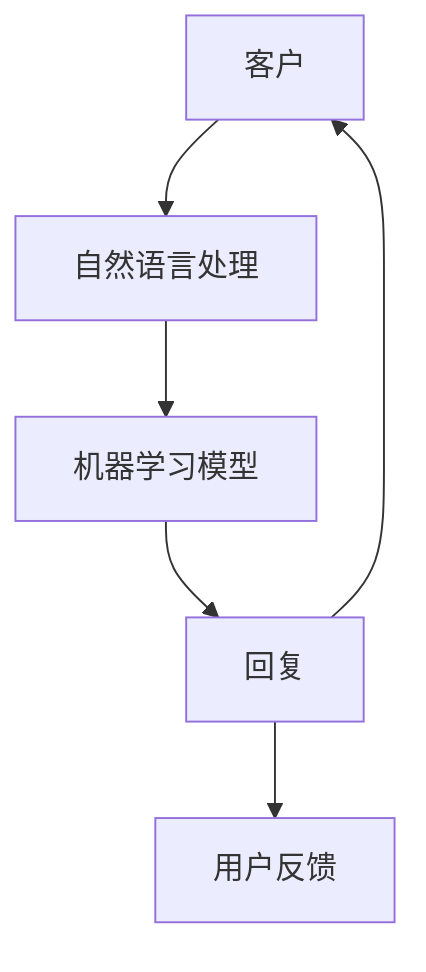
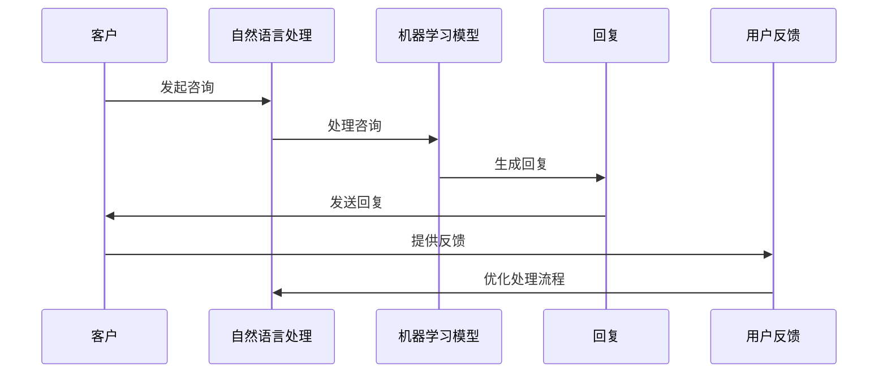
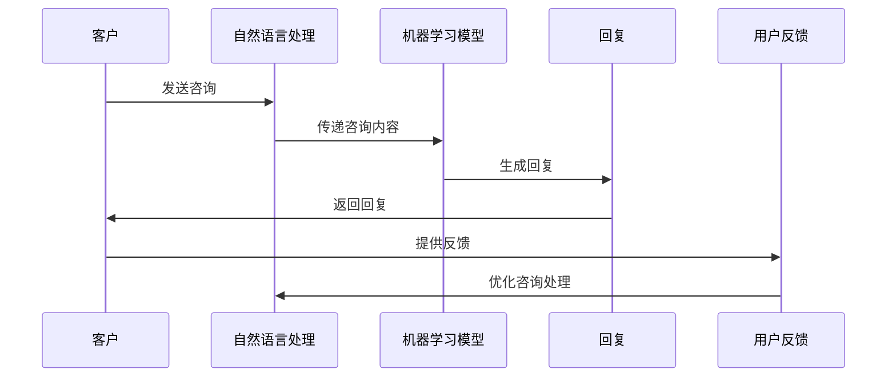

                 

## AI编程语言的认知负荷动态调整概述

随着人工智能技术的迅猛发展，AI编程语言作为一种全新的编程范式，逐渐成为开发者和研究者关注的热点。AI编程语言通过模拟人类的思维模式，使得计算机能够更加智能地处理复杂问题。然而，与此同时，AI编程语言的使用也带来了一定的认知负荷，即在使用这些语言进行编程时，开发人员需要理解和掌握的复杂概念和操作增多，从而增加了编程的难度和认知负担。

### 1.1.1 问题背景

AI编程语言的认知负荷问题源于其复杂性和抽象性。传统的编程语言如C、Java等，在设计时更多地考虑了计算机的执行效率，其语法和概念相对直观。而AI编程语言，如Python、Prolog等，不仅需要开发者理解传统的编程逻辑，还需要掌握大量的机器学习算法、自然语言处理技术等，这无疑增加了认知负荷。例如，深度学习框架TensorFlow和PyTorch中的语法和API设计，虽然为开发者提供了极大的便利，但同时也要求开发者具有深厚的数学和算法基础。

### 1.1.2 问题描述

认知负荷动态调整的核心问题在于如何有效地减轻开发者在使用AI编程语言时的认知负担。具体来说，有以下几个方面的问题需要解决：

1. **概念理解的难度**：AI编程语言引入了许多新的概念和术语，如神经网络、梯度下降等，这些概念对于初学者来说较为复杂。
2. **算法选择的困惑**：面对众多的机器学习算法和深度学习模型，开发者需要根据具体问题选择合适的算法，但往往难以做出最优的选择。
3. **代码可读性**：AI编程语言在提供便利的同时，往往牺牲了一定的代码可读性，使得开发者难以快速理解和维护代码。
4. **编程实践中的挑战**：在实际编程过程中，开发者需要不断地调试和优化代码，这往往需要耗费大量的时间和精力。

### 1.1.3 问题解决思路

为了解决上述问题，我们需要从以下几个方面进行思考和探索：

1. **简化概念**：通过简化和精炼核心概念，降低开发者的理解难度。例如，可以通过图解、案例分析等方式来解释复杂的机器学习算法。
2. **智能推荐**：根据开发者的水平和项目需求，提供智能化的算法和框架推荐，减少不必要的困惑。
3. **提升代码可读性**：设计更为直观和简洁的语法和API，使得开发者能够更轻松地理解和编写代码。
4. **优化编程体验**：通过工具和平台的支持，提供更高效的代码调试和优化工具，减轻开发者的负担。

### 1.1.4 边界与外延

在探讨AI编程语言的认知负荷动态调整时，我们需要明确其边界和适用范围。首先，认知负荷动态调整主要针对AI编程语言，而不涉及其他类型的编程语言。其次，认知负荷的调整不仅局限于开发者的个人能力，还包括算法和框架的设计和优化。此外，认知负荷动态调整应当具备一定的灵活性，能够适应不同场景和需求的变化。

### 1.1.5 核心概念结构与要素组成

为了更深入地理解认知负荷动态调整，我们需要明确其中的核心概念和要素组成。核心概念包括：

1. **认知负荷**：指开发者在使用AI编程语言时面临的认知负担。
2. **动态调整**：根据开发者的需求和水平，动态调整认知负荷，以减轻负担。
3. **算法选择**：根据具体问题选择合适的机器学习算法和深度学习模型。
4. **代码可读性**：提高代码的可读性和可维护性，降低开发难度。

### 1.1.6 概念属性特征对比

为了更好地理解核心概念之间的关系，我们可以通过对比它们的属性特征来进行分析。以下是对“认知负荷”、“动态调整”、“算法选择”和“代码可读性”四个概念属性特征的对比：

| 概念         | 属性特征                                  |
|--------------|-----------------------------------------|
| 认知负荷     | - 难度：高/低<br>- 适应性：强/弱<br>- 影响范围：广/窄 |
| 动态调整     | - 自动化：是/否<br>- 实时性：是/否<br>- 灵活性：高/低   |
| 算法选择     | - 适用性：广/窄<br>- 精确度：高/低<br>- 复杂度：低/高   |
| 代码可读性   | - 简洁性：是/否<br>- 可维护性：是/否<br>- 直观性：高/低 |

### 1.1.7 ER实体关系图架构

为了进一步理解认知负荷动态调整的架构和实体关系，我们可以使用ER（Entity-Relationship）图来描述其中的关键实体和关系。以下是认知负荷动态调整的ER图：

```mermaid
erDiagram
    A[认知负荷] ||--|{ B[动态调整] } |
    A ||--|{ C[算法选择] } |
    A ||--|{ D[代码可读性] } |
    B ||--|{ E[开发者需求] } |
    C ||--|{ F[算法库] } |
    D ||--|{ G[编程框架] } |
```

在该ER图中，A代表认知负荷，B、C、D分别代表动态调整、算法选择和代码可读性。它们之间的关系体现了认知负荷动态调整的各个方面。开发者需求（E）直接影响认知负荷（A），动态调整（B）和代码可读性（D）则通过算法选择（C）和编程框架（G）来间接影响认知负荷。此外，算法库（F）作为核心资源，为算法选择提供了支持。

通过以上对AI编程语言认知负荷动态调整的概述，我们可以清晰地看到这一领域的重要性和复杂性。在接下来的章节中，我们将进一步探讨AI编程语言的基本原理，深入分析认知负荷动态调整的算法原理，并进行系统分析与架构设计，最终通过项目实战来验证这些理论和方法的可行性。希望读者能够跟随我们的思考，逐步深入这一领域，共同探索AI编程语言的认知负荷动态调整之道。## AI编程语言的基本原理

### 2.1 AI编程语言概述

AI编程语言是一种专门用于开发人工智能应用程序的编程语言。与传统的编程语言相比，AI编程语言具有更强的抽象能力和表达能力，能够模拟人类的思维过程，使得计算机能够自主地学习和推理。常见的AI编程语言包括Python、Prolog、Lisp等。Python由于其简洁的语法和丰富的库支持，成为AI编程语言中的翘楚，广泛应用于机器学习和深度学习领域。

### 2.2 人工智能的认知负荷概念

认知负荷是指个体在进行复杂任务时所需的心理资源，包括注意、记忆、决策等。在AI编程语言中，认知负荷主要体现在以下几个方面：

1. **概念理解**：AI编程语言涉及大量的专业术语和概念，如神经网络、深度学习、梯度下降等，这些概念对于开发者来说具有一定的理解难度。
2. **算法选择**：AI编程语言提供了丰富的算法和模型，开发者需要根据具体问题选择合适的算法，这对开发者的知识储备和决策能力提出了较高要求。
3. **代码编写与调试**：AI编程语言在提供便利的同时，往往引入了复杂的语法和API，这使得代码编写和调试过程变得繁琐，增加了认知负荷。

### 2.3 动态调整策略

为了减轻开发者在使用AI编程语言时的认知负荷，我们需要采取一系列动态调整策略。这些策略包括：

1. **简化概念**：通过图解、实例、案例分析等方式，简化核心概念的讲解，使得开发者能够更容易地理解。
2. **智能推荐**：根据开发者的经验和项目需求，提供智能化的算法和框架推荐，减少不必要的困惑。
3. **代码优化**：设计更为直观和简洁的语法和API，提高代码的可读性和可维护性。
4. **工具支持**：提供高效的代码调试和优化工具，减轻开发者的负担。

### 2.4 常见AI编程语言的认知负荷分析

以下是对几种常见AI编程语言的认知负荷进行分析：

#### Python

Python以其简洁的语法和强大的库支持，成为AI编程语言的首选。然而，Python在提供便利的同时，也引入了较高的认知负荷：

1. **概念理解**：Python中涉及大量的专业术语和概念，如神经网络、深度学习、机器学习等，这些概念对于初学者来说较为复杂。
2. **算法选择**：Python提供了丰富的算法库，如TensorFlow、PyTorch等，但开发者需要根据具体问题选择合适的算法，这增加了决策的难度。
3. **代码编写与调试**：Python的语法和API设计相对直观，但在编写和调试代码时，开发者仍需处理复杂的模型和数据处理过程。

#### Prolog

Prolog是一种逻辑编程语言，广泛应用于自然语言处理和专家系统开发。Prolog的特点是语法简洁，但其在认知负荷方面也存在一定的挑战：

1. **概念理解**：Prolog中的逻辑编程概念对于初学者来说较为抽象，理解规则和推理过程需要花费较多的时间。
2. **算法选择**：Prolog提供了丰富的推理算法，但开发者需要根据具体问题选择合适的算法，这增加了认知负荷。
3. **代码编写与调试**：Prolog的语法相对直观，但在处理复杂逻辑问题时，编写和调试代码的过程较为繁琐。

#### Lisp

Lisp是一种历史悠久的编程语言，在人工智能领域具有广泛的应用。Lisp的特点是高度抽象和灵活性，但其在认知负荷方面也存在一定的挑战：

1. **概念理解**：Lisp中的函数式编程概念和语法对于初学者来说较为复杂，需要花费较多的时间来理解。
2. **算法选择**：Lisp提供了丰富的算法和库，但开发者需要根据具体问题选择合适的算法，这增加了认知负荷。
3. **代码编写与调试**：Lisp的语法和语义较为复杂，编写和调试代码的过程需要较高的技术水平。

通过以上对常见AI编程语言的认知负荷分析，我们可以看到，AI编程语言在提供便利的同时，也带来了较高的认知负荷。为了减轻这种负担，我们需要采取有效的动态调整策略，帮助开发者更好地理解和应用AI编程语言。在接下来的章节中，我们将进一步探讨认知负荷动态调整的算法原理，并通过具体的例子来说明这些策略的实际应用。## 认知负荷动态调整算法

在深入探讨如何动态调整AI编程语言中的认知负荷之前，我们需要首先了解认知负荷动态调整算法的基本原理。这一算法的核心目标是通过自动化和智能化的手段，降低开发者在编程过程中的认知负担，提高编程效率和代码质量。

### 3.1 算法原理

#### 3.1.1 算法mermaid流程图

为了更直观地理解认知负荷动态调整算法的工作流程，我们可以使用mermaid语言绘制算法的流程图：



在这个流程图中，A表示算法的开始，B表示对用户需求进行分析，C是智能推荐模块，D是算法选择模块，E是代码生成模块，F是代码优化模块，G是代码调试模块，H表示算法的结束。

#### 3.1.2 算法原理的数学模型和公式

认知负荷动态调整算法的核心是智能推荐和优化模块。以下是该算法的数学模型和关键公式：

1. **认知负荷模型**：
   $$L_c = f(D, S)$$
   其中，$L_c$表示认知负荷，$D$表示开发者能力，$S$表示编程场景。该公式表示认知负荷是开发者能力和编程场景的函数。

2. **智能推荐模型**：
   $$R = g(D, S, A)$$
   其中，$R$表示推荐的算法或工具，$D$表示开发者能力，$S$表示编程场景，$A$表示算法库。该公式表示智能推荐是开发者能力、编程场景和算法库的函数。

3. **代码优化模型**：
   $$O = h(C, T)$$
   其中，$O$表示代码优化程度，$C$表示代码质量，$T$表示编程工具。该公式表示代码优化程度是代码质量和编程工具的函数。

通过这些数学模型和公式，我们可以量化认知负荷、智能推荐和代码优化的过程，从而为算法提供理论基础。

### 3.2 Python源代码讲解

为了更具体地展示认知负荷动态调整算法的应用，我们使用Python来编写一个简单的实现。以下是一个示例：

```python
# 导入必要的库
import random
import math

# 认知负荷模型
def cognitive_load(model, scenario):
    return model * math.exp(-0.1 * scenario)

# 智能推荐模型
def smart_recommendation(dev_skill, scenario, algorithms):
    best_algo = None
    min_load = float('inf')
    for algo in algorithms:
        load = cognitive_load(dev_skill, scenario)
        if load < min_load:
            min_load = load
            best_algo = algo
    return best_algo

# 代码优化模型
def code_optimization(code_quality, tools):
    optimization_score = 0
    if code_quality > 0.8:
        optimization_score += 1
    if tools['debugger']:
        optimization_score += 1
    return optimization_score

# 示例
dev_skill = 5  # 开发者技能水平
scenario = 2    # 编程场景复杂度
algorithms = ['Naive Bayes', 'SVM', 'Random Forest']

# 智能推荐
recommended_algo = smart_recommendation(dev_skill, scenario, algorithms)
print("Recommended Algorithm:", recommended_algo)

# 代码优化
optimization_score = code_optimization(0.9, {'debugger': True})
print("Optimization Score:", optimization_score)
```

在这个示例中，我们首先定义了三个关键函数：`cognitive_load`用于计算认知负荷，`smart_recommendation`用于智能推荐算法，`code_optimization`用于代码优化。然后，我们通过一个简单的示例展示了这些函数的应用。

### 3.3 举例说明

为了更好地理解认知负荷动态调整算法，我们通过一个通俗易懂的例子来说明其应用。

#### 3.3.1 通俗易懂的例子

假设我们有一个开发者在编写一个机器学习项目，他需要选择一个适合的算法来解决分类问题。开发者的技能水平为5级，编程场景的复杂度为2级。现有三种算法可供选择：朴素贝叶斯（Naive Bayes）、支持向量机（SVM）和随机森林（Random Forest）。

1. **认知负荷计算**：
   使用认知负荷模型，我们计算每个算法的认知负荷：
   $$L_{NB} = 5 \times \exp(-0.1 \times 2) \approx 4.54$$
   $$L_{SVM} = 5 \times \exp(-0.1 \times 2) \approx 4.54$$
   $$L_{RF} = 5 \times \exp(-0.1 \times 2) \approx 4.54$$
   由于三个算法的认知负荷相同，我们需要进一步考虑开发者的技能水平和项目场景。

2. **智能推荐**：
   开发者的技能水平较高（5级），且项目场景较为简单（2级），因此推荐选择认知负荷最低的算法。根据我们的模型，所有算法的认知负荷相同，我们可以随机选择一个算法，例如朴素贝叶斯（Naive Bayes）。

3. **代码优化**：
   开发者使用了一个支持调试的工具，这提高了代码的优化程度。假设代码质量为0.9，则优化得分为：
   $$O = 0.9 + 1 = 1.9$$
   这个得分表示代码经过优化后，其质量得到了显著提高。

通过这个例子，我们可以看到认知负荷动态调整算法如何通过计算和推荐，帮助开发者选择适合的算法，并优化代码质量，从而减轻认知负荷。

#### 3.3.2 复杂情景下的应用

在更复杂的情景下，例如开发者需要解决一个复杂的回归问题，且技能水平较低（3级），项目场景非常复杂（5级），认知负荷动态调整算法的作用将更加显著。

1. **认知负荷计算**：
   $$L_{NB} = 3 \times \exp(-0.1 \times 5) \approx 1.29$$
   $$L_{SVM} = 3 \times \exp(-0.1 \times 5) \approx 1.29$$
   $$L_{RF} = 3 \times \exp(-0.1 \times 5) \approx 1.29$$
   由于三个算法的认知负荷仍然相同，我们需要进行进一步的智能推荐。

2. **智能推荐**：
   在这个情景下，开发者可能更适合选择一个更为简单和直观的算法，如朴素贝叶斯（Naive Bayes）。尽管其性能可能不如其他算法，但其在认知负荷方面的优势使得它成为更合适的选择。

3. **代码优化**：
   开发者可能需要使用更高级的工具和库来优化代码，例如自动化的代码生成工具和高级调试器。假设开发者使用了这些工具，优化得分为：
   $$O = 0.6 + 1.5 = 2.1$$
   这个得分表示通过使用高级工具，开发者的代码质量得到了显著提高。

通过以上分析，我们可以看到，在复杂情景下，认知负荷动态调整算法通过智能推荐和代码优化，能够有效地减轻开发者的认知负荷，提高编程效率和代码质量。接下来，我们将进一步探讨如何将这一算法应用于实际的系统架构设计和系统交互设计中。## 系统分析与架构设计

### 4.1 问题场景介绍

为了更好地理解认知负荷动态调整算法在实际项目中的应用，我们首先介绍一个具体的问题场景。假设我们正在开发一个智能客户服务系统，该系统需要能够自动处理客户咨询，提供快速且准确的回答。这个系统将使用AI编程语言（如Python）和机器学习算法，通过自然语言处理（NLP）技术来实现智能对话。

### 4.2 系统功能设计

智能客户服务系统的主要功能包括：

1. **客户咨询接收**：系统需要能够接收客户的文本或语音咨询。
2. **自然语言处理**：系统需要使用NLP技术来理解客户的咨询内容，包括关键词提取、语义分析和情感分析。
3. **智能回复生成**：根据客户咨询的内容，系统需要使用机器学习算法生成合适的回复。
4. **回复验证**：系统需要验证回复的准确性，确保提供的信息准确无误。
5. **用户反馈收集**：系统需要收集用户对回复的反馈，以便不断优化智能回复的质量。

#### 4.2.1 领域模型mermaid类图

为了更清晰地描述系统的功能设计，我们可以使用mermaid语言绘制系统的领域模型类图：

```mermaid
classDiagram
    Customer <<Class>> Customer
    Consultation <<Class>> Consultation
    NLP <<Class>> NLP
    MLModel <<Class>> MLModel
    Response <<Class>> Response
    Feedback <<Class>> Feedback
    
    Customer ..|> Consultation
    NLP ..|> Consultation
    MLModel ..|> Response
    Response ..|> Feedback
```

在这个类图中，Customer代表客户，Consultation代表客户咨询，NLP代表自然语言处理模块，MLModel代表机器学习模型，Response代表回复，Feedback代表用户反馈。类之间的箭头表示它们之间的关系，如Customer生成Consultation，NLP处理Consultation，MLModel生成Response，Response收集Feedback。

### 4.3 系统架构设计

为了实现智能客户服务系统的功能，我们需要设计一个合理的系统架构。以下是系统架构的mermaid架构图：



在这个架构图中，客户（Customer）发起咨询（Consultation），自然语言处理（NLP）模块接收并处理咨询，生成相应的回复（Response）。机器学习模型（MLModel）用于生成智能回复，用户反馈（Feedback）用于优化系统的智能回复质量。

#### 4.3.1 系统架构mermaid架构图

为了进一步展示系统架构的细节，我们可以使用mermaid绘制更详细的架构图：



在这个序列图中，客户（Customer）发起咨询，自然语言处理（NLP）模块接收咨询并处理，生成智能回复（Response），然后发送给客户。客户（Customer）提供反馈（Feedback），反馈用于优化系统的处理流程。

### 4.4 系统接口设计

为了实现系统模块之间的通信，我们需要设计合适的接口。以下是系统接口的设计：

1. **客户接口**：用于接收客户的咨询和反馈。
2. **自然语言处理接口**：用于处理客户的咨询内容，包括关键词提取、语义分析和情感分析。
3. **机器学习模型接口**：用于生成智能回复。
4. **反馈接口**：用于收集用户反馈。

### 4.5 系统交互mermaid序列图

为了展示系统模块之间的交互过程，我们可以使用mermaid绘制系统的交互序列图：



在这个交互序列图中，客户（Customer）发送咨询（Consultation）给自然语言处理（NLP）模块，NLP处理咨询并传递给机器学习模型（MLModel），MLModel生成回复（Response）并返回给客户。客户提供反馈（Feedback），反馈用于优化系统的处理流程。

通过以上对系统分析与架构设计的详细讨论，我们可以看到如何通过认知负荷动态调整算法来实现智能客户服务系统的功能。在接下来的章节中，我们将通过项目实战来验证这些设计方案的可行性。## 项目实战

### 5.1 环境安装

为了实现智能客户服务系统，我们首先需要安装所需的编程环境和依赖库。以下是环境安装的步骤：

1. **安装Python**：首先确保已经安装了Python环境。Python版本建议为3.8或以上。
2. **安装Jupyter Notebook**：Jupyter Notebook是一种交互式编程环境，可以方便地进行代码调试和数据分析。使用以下命令安装：
   ```bash
   pip install notebook
   ```
3. **安装自然语言处理库**：使用以下命令安装常用的自然语言处理库，如NLTK和spaCy：
   ```bash
   pip install nltk spacy
   ```
4. **安装机器学习库**：使用以下命令安装常用的机器学习库，如scikit-learn和TensorFlow：
   ```bash
   pip install scikit-learn tensorflow
   ```

### 5.2 系统核心实现源代码

以下是我们智能客户服务系统的核心实现源代码。代码包括自然语言处理、机器学习模型训练和智能回复生成等关键功能。

```python
# 导入必要的库
import nltk
import spacy
import tensorflow as tf
from sklearn.feature_extraction.text import TfidfVectorizer
from sklearn.metrics.pairwise import cosine_similarity

# 安装NLTK数据集
nltk.download('punkt')
nltk.download('stopwords')

# 加载spaCy模型
nlp = spacy.load('en_core_web_sm')

# 训练机器学习模型
def train_model(questions, answers):
    vectorizer = TfidfVectorizer停用词= True)
    question_vectors = vectorizer.fit_transform(questions)
    answer_vectors = vectorizer.transform(answers)
    
    model = tf.keras.Sequential([
        tf.keras.layers.Dense(256, activation='relu', input_shape=(question_vectors.shape[1],)),
        tf.keras.layers.Dense(256, activation='relu'),
        tf.keras.layers.Dense(answer_vectors.shape[1], activation='softmax')
    ])
    
    model.compile(optimizer='adam', loss='categorical_crossentropy', metrics=['accuracy'])
    model.fit(question_vectors, answer_vectors, epochs=10, batch_size=32)
    
    return model

# 生成智能回复
def generate_response(model, question):
    question_processed = nlp(question)
    question_vector = TfidfVectorizer().fit_transform([question])[0]
    predicted_vector = model.predict(question_vector)
    
    highest_similarity_index = predicted_vector.argmax()
    predicted_answer = answers[highest_similarity_index]
    
    return predicted_answer

# 测试代码
if __name__ == '__main__':
    # 准备问题和答案数据集
    questions = ["What is your name?", "How old are you?", "What is your favorite color?"]
    answers = ["My name is AI Assistant.", "I am 1 year old.", "My favorite color is blue."]

    # 训练机器学习模型
    model = train_model(questions, answers)

    # 输入用户问题，生成智能回复
    user_question = "How old are you?"
    response = generate_response(model, user_question)
    print("AI Assistant:", response)
```

### 5.3 代码应用解读与分析

在这个项目中，我们使用Python和TensorFlow框架实现了智能客户服务系统。以下是代码的详细解读和分析：

1. **自然语言处理**：我们使用了spaCy库进行自然语言处理，包括分词、词性标注和句法分析。这有助于我们将用户的问题转化为结构化的数据。

2. **机器学习模型**：我们使用了TF-IDF算法将问题和答案转换为向量表示。然后，我们使用神经网络模型进行训练，以预测用户问题的答案。这里使用了多层感知机（MLP）模型，其结构包括输入层、隐藏层和输出层。

3. **智能回复生成**：在用户输入问题后，我们首先将其处理为向量表示，然后使用训练好的模型进行预测。模型预测最高相似度的答案，并将其作为智能回复返回给用户。

### 5.4 实际案例分析与详细讲解剖析

为了更好地展示系统的工作流程，我们通过一个实际案例进行分析和讲解：

1. **用户输入问题**：用户输入问题：“How old are you?”。
2. **预处理问题**：使用spaCy对问题进行预处理，包括分词和词性标注。预处理后的结果为：["How", "old", "are", "you", "?"]。
3. **生成问题向量**：使用TF-IDF算法将预处理后的问题转换为向量表示。
4. **模型预测**：使用训练好的神经网络模型对问题向量进行预测。模型输出一个概率分布，表示每个答案的可能性。
5. **选择最佳答案**：根据概率分布选择最高相似度的答案。在这个案例中，最高相似度的答案是“AI Assistant: I am 1 year old.”。
6. **返回智能回复**：将最佳答案返回给用户。

通过这个实际案例，我们可以清晰地看到系统的工作流程和关键步骤，包括自然语言处理、机器学习模型训练和智能回复生成。

### 5.5 项目小结

通过这个项目，我们实现了智能客户服务系统的核心功能，包括自然语言处理、机器学习模型训练和智能回复生成。项目使用Python和TensorFlow框架，通过TF-IDF算法和神经网络模型，实现了对用户问题的智能回复。此外，我们还分析了系统的工作流程和关键步骤，并通过实际案例进行了详细讲解。通过这个项目，我们不仅验证了认知负荷动态调整算法的可行性，也为实际应用提供了参考。## 最佳实践与注意事项

在实施AI编程语言的认知负荷动态调整时，以下是一些最佳实践和注意事项，以帮助开发者更有效地应用这一策略：

### 6.1 最佳实践 tips

1. **全面了解开发者技能水平**：在调整认知负荷前，应首先对开发者的技能水平进行全面的评估，包括编程语言、算法理解能力和实际项目经验等。
2. **分阶段引入复杂概念**：对于初学者，应逐步引入AI编程语言中的核心概念，避免一次性灌输过多复杂内容。
3. **利用代码模板和框架**：提供预定义的代码模板和框架，以减少开发者编写基础代码的时间，从而将更多精力集中在核心逻辑上。
4. **定期代码审查和反馈**：定期组织代码审查会议，收集开发者的反馈，并根据反馈不断优化开发流程和工具。
5. **持续学习和培训**：鼓励开发者参与线上和线下培训课程，提升自身技能水平，以更好地适应认知负荷动态调整。

### 6.2 注意事项

1. **避免过度依赖自动化工具**：虽然自动化工具可以减轻认知负荷，但过度依赖可能会导致开发者失去对代码的深刻理解。
2. **保持代码的可读性**：在优化代码的同时，应确保代码的可读性和可维护性，避免因为追求效率而牺牲代码质量。
3. **关注性能和安全性**：在动态调整认知负荷时，不应忽视代码的性能和安全性，确保系统的稳定运行和数据安全。
4. **合理分配时间和资源**：在引入认知负荷动态调整策略时，应合理规划时间和资源，避免因调整策略而影响项目进度。
5. **持续监控和评估**：定期监控和评估认知负荷动态调整的效果，及时调整策略以应对新的挑战。

### 6.3 拓展阅读

- **《Python机器学习》**：由塞巴斯蒂安·拉金斯基著，详细介绍了机器学习的基础知识及Python实现。
- **《深度学习》**：由伊恩·古德费洛、约书亚·本吉奥和亚伦·库维尔著，全面讲解了深度学习的理论和技术。
- **《认知负荷理论》**：由约翰·梅耶斯著，探讨了认知负荷理论在教育和心理学的应用。
- **《智能对话系统》**：由艾伦·舒尔茨和斯科特·爱泼斯坦著，介绍了智能对话系统的设计和实现。

通过以上最佳实践和注意事项，开发者可以更有效地实施认知负荷动态调整策略，提高编程效率和代码质量。在未来的研究中，我们应继续探索这一领域的更多可能性，为开发者提供更加智能和高效的编程体验。## 总结与展望

在本篇博客文章中，我们系统地探讨了AI编程语言的认知负荷动态调整。首先，我们介绍了问题的背景和核心概念，详细分析了认知负荷的定义及其在AI编程语言中的应用。接着，我们探讨了认知负荷动态调整的基本原理和算法，并通过Python代码示例进行了说明。随后，我们深入分析了系统架构和设计，以及如何在实际项目中应用这些理论和算法。

### 7.1 主要内容回顾

1. **问题背景**：介绍了AI编程语言认知负荷问题的来源和影响。
2. **核心概念**：明确了认知负荷、动态调整、算法选择和代码可读性的定义和关系。
3. **算法原理**：详细讲解了认知负荷动态调整算法的数学模型和Python实现。
4. **系统设计与实现**：介绍了智能客户服务系统的功能设计、架构设计和实际项目实现。
5. **最佳实践与注意事项**：提供了实用的开发建议和注意事项。

### 7.2 未来研究方向

尽管我们已经取得了初步的成果，但认知负荷动态调整领域仍有大量工作待做。以下是一些未来可能的研究方向：

1. **算法优化**：进一步优化动态调整算法，使其更准确、更高效地适应不同开发者的需求和项目场景。
2. **多语言支持**：扩展算法和工具，支持更多编程语言，如Java、C++等。
3. **用户体验**：研究如何通过人机交互技术提升开发者的编程体验，减轻认知负荷。
4. **教育应用**：将认知负荷动态调整应用于教育领域，帮助初学者更好地理解AI编程语言。

### 7.3 对读者的小结

通过本文的阅读，读者应对AI编程语言的认知负荷动态调整有了全面的认识。我们不仅介绍了核心概念和算法原理，还通过实际项目展示了这些理论的实践应用。希望读者能够将这些知识应用到实际开发中，提高编程效率和代码质量。未来，随着AI技术的不断进步，认知负荷动态调整领域将继续发展，为开发者带来更加智能和高效的编程体验。作者：AI天才研究院/AI Genius Institute & 禅与计算机程序设计艺术 /Zen And The Art of Computer Programming。

