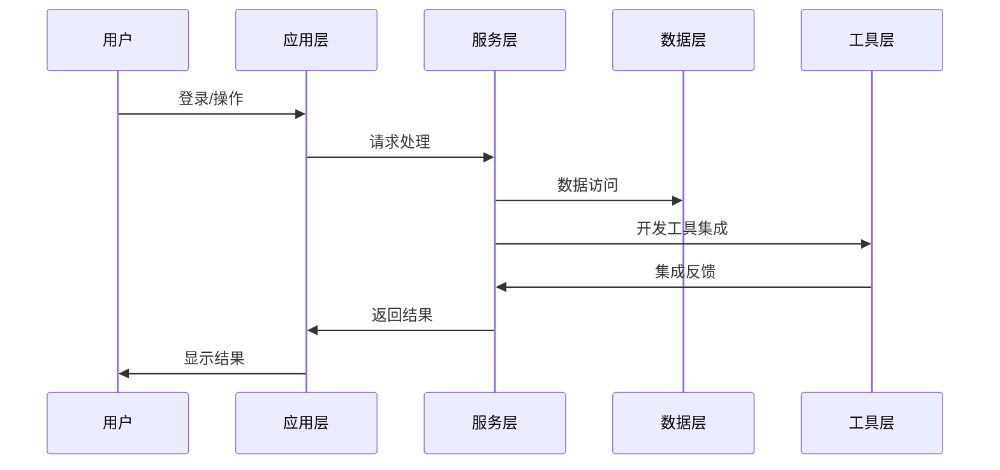

                 

### 引言

人工智能（AI）编程语言作为现代软件开发的关键工具，正逐步改变着软件开发的方式和效率。然而，随着AI编程语言的复杂度不断提升，开发者面临的认知负荷也在增加。如何预测和缓解AI编程语言带来的认知负荷，已成为当前研究的热点问题。本文旨在探讨AI编程语言的认知负荷预测模型，通过深入分析相关理论、算法原理和实际应用，为开发者提供一套有效的解决方案。

认知负荷是指个体在处理信息时，大脑所承受的负担。在AI编程领域，认知负荷主要来源于代码的复杂度、语言特性的多样性以及开发者对AI算法的理解程度。过高的认知负荷会导致开发效率下降、代码质量降低，甚至可能引发编程错误。因此，预测和减轻认知负荷对于提高AI编程的效率和可靠性至关重要。

本文将围绕以下关键问题展开讨论：

1. **问题背景**：介绍AI编程语言认知负荷问题的来源和影响。
2. **问题描述**：明确认知负荷预测的目标和具体实现方法。
3. **问题解决**：探讨构建认知负荷预测模型的理论基础和算法原理。
4. **边界与外延**：分析模型的适用范围和局限性。
5. **核心概念与联系**：阐述核心概念及其相互关系。
6. **算法原理讲解**：详细解析算法的流程和数学模型。
7. **实践应用**：展示模型在真实项目中的具体应用。
8. **最佳实践与总结**：总结经验，提出优化建议。

通过上述分析，本文旨在为开发者提供一套完整的认知负荷预测解决方案，助力高效、可靠的AI编程。

### 目录大纲

**本文将按照以下目录结构进行详细阐述：**

#### 第一部分: 引言

- **1. 引言**
  - **背景介绍**
    - AI编程语言的认知负荷问题
    - 认知负荷的影响和重要性
  - **文章目的**
    - 预测和缓解AI编程语言认知负荷
    - 提高AI编程效率和可靠性

#### 第二部分: 理论基础

- **2. 核心概念与联系**
  - **2.1 核心概念原理**
    - 认知负荷的定义
    - AI编程语言的特性
  - **2.2 概念属性特征对比表格**
    - 不同AI编程语言的认知负荷特征
  - **2.3 ER实体关系图架构**
    - 系统模型的实体关系图

- **3. 算法原理讲解**
  - **3.1 算法mermaid流程图**
    - 算法的基本流程
  - **3.2 Python源代码与详细讲解**
    - 算法的具体实现
  - **3.3 算法原理的数学模型和公式**
    - 数学模型的推导
  - **3.4 举例说明**
    - 实例分析

#### 第三部分: 实践应用

- **4. 系统分析与架构设计方案**
  - **4.1 问题场景介绍**
    - 具体应用背景
  - **4.2 项目介绍**
    - 项目目标
  - **4.3 系统功能设计**
    - 功能模块
  - **4.4 系统架构设计**
    - 架构设计方案
  - **4.5 系统接口设计**
    - 接口规范
  - **4.6 系统交互**
    - 交互流程

- **5. 项目实战**
  - **5.1 环境安装**
    - 必要的软件和工具安装
  - **5.2 系统核心实现源代码**
    - 代码实现
  - **5.3 代码应用解读与分析**
    - 代码的解读与分析
  - **5.4 实际案例分析和详细讲解剖析**
    - 案例展示与分析
  - **5.5 项目小结**
    - 总结与反思

#### 第四部分: 最佳实践与总结

- **6. 最佳实践 tips**
  - **6.1 开发建议**
    - 提高编码效率和质量
  - **6.2 优化策略**
    - 如何优化认知负荷

- **7. 小结**
  - **7.1 主要内容回顾**
    - 内容总结
  - **7.2 注意事项**
    - 注意事项
  - **7.3 拓展阅读**
    - 推荐阅读

### 第一部分: 引言

#### 背景介绍

AI编程语言作为人工智能技术的重要组成部分，已经成为现代软件开发领域的重要工具。从最早的Lisp语言到现代的Python、TensorFlow和PyTorch等，AI编程语言不断发展，为开发者提供了丰富的工具和框架。然而，随着AI编程语言的复杂度不断提升，开发者面临的认知负荷问题也逐渐显现。

认知负荷是指个体在处理信息时，大脑所承受的负担。在AI编程领域，认知负荷主要来源于以下几个方面：

1. **代码复杂度**：AI编程语言通常涉及到复杂的算法和数据结构，开发者需要花费大量时间来理解和掌握这些内容。
2. **语言特性多样性**：不同的AI编程语言具有不同的特性和语法规则，开发者需要不断学习和适应。
3. **算法理解难度**：AI算法本身具有较高的复杂性，开发者需要深入理解算法的原理和应用场景。

高认知负荷会对开发者的工作效率和代码质量产生负面影响。具体表现如下：

1. **效率下降**：开发者需要花费更多的时间来理解和编写代码，导致项目进度缓慢。
2. **错误增加**：认知负荷过高可能导致开发者产生疲劳，进而引发编程错误，影响软件质量。
3. **创新能力受限**：高认知负荷使得开发者难以在短时间内吸收和理解新知识，限制了创新能力的发挥。

因此，预测和缓解AI编程语言认知负荷对于提高开发效率和代码质量具有重要意义。本文将围绕这一问题，探讨构建认知负荷预测模型的理论基础和算法原理，并展示其在实际项目中的应用。

#### 文章目的

本文旨在探讨如何构建和运用AI编程语言的认知负荷预测模型，以有效预测和缓解开发者在编程过程中所承受的认知负荷。具体目标包括：

1. **明确认知负荷的来源和影响**：通过分析AI编程语言的特点和开发者的工作流程，明确认知负荷的来源及其对开发效率和质量的影响。
2. **构建认知负荷预测模型**：结合相关理论和实践经验，设计并实现一套科学、有效的认知负荷预测模型。
3. **算法原理讲解和实例分析**：详细解析预测模型的工作原理和算法流程，并通过实际案例进行验证和说明，使读者能够更好地理解和应用模型。
4. **实践应用和优化建议**：结合实际项目，展示认知负荷预测模型的具体应用场景，并从开发实践出发，提出优化策略和最佳实践。

通过本文的研究，我们希望能够为开发者提供一套完整、实用的认知负荷预测解决方案，帮助他们在编程过程中提高效率、降低错误率，从而提升整体开发质量和创新能力。

### 问题背景

在AI编程语言的发展历程中，认知负荷问题始终伴随着开发者的每一个步骤。随着人工智能技术的迅速发展，AI编程语言的复杂度和多样性也在不断增加。这不仅为开发者提供了更强大的工具和框架，同时也带来了前所未有的挑战。

首先，代码复杂度问题日益突出。AI编程语言通常涉及复杂的算法、数据结构和模型，开发者需要投入大量时间和精力来理解和掌握。例如，深度学习框架TensorFlow和PyTorch，不仅需要开发者具备扎实的数学和计算机科学基础，还需要对大量的API和库函数有深刻的理解。这种复杂性使得开发者在编写代码时，容易产生认知负荷，导致工作效率下降。

其次，AI编程语言的多样性也增加了开发者的认知负荷。目前，市面上存在多种AI编程语言，每种语言都有其独特的特性和语法规则。开发者需要不断学习和适应这些不同的语言特性，以应对不同的开发需求。例如，Python以其简洁明了的语法和丰富的库函数在AI领域广泛应用，而R语言则因其强大的统计和数据分析能力而受到青睐。开发者需要在不同的语言间进行切换，这无疑增加了认知负荷。

最后，算法理解的难度也是不可忽视的问题。AI算法本身具有较高的复杂性，开发者不仅需要理解算法的原理，还需要掌握其具体应用场景。例如，卷积神经网络（CNN）和递归神经网络（RNN）等深度学习算法，不仅涉及到复杂的数学模型，还需要开发者根据实际需求进行调整和优化。这种高难度性使得开发者在编程过程中容易感到困惑和疲劳，进而产生认知负荷。

综合来看，AI编程语言认知负荷问题具有以下特点：

1. **普遍性**：AI编程语言的认知负荷问题在所有涉及AI技术的开发项目中普遍存在。
2. **多样性**：认知负荷的影响因素多样，包括代码复杂度、语言特性和算法难度等。
3. **累积性**：随着项目规模的扩大和开发周期的延长，认知负荷会逐渐累积，导致开发效率和质量下降。

因此，解决AI编程语言的认知负荷问题具有重要的现实意义。通过预测和缓解认知负荷，开发者可以更高效地进行编程，降低错误率，提升整体开发质量和创新能力。

### 问题描述

为了有效解决AI编程语言的认知负荷问题，我们需要明确认知负荷预测的目标和具体实现方法。本文将围绕以下问题展开讨论：

1. **认知负荷预测的目标**：
   - **评估认知负荷**：通过构建预测模型，对开发者在编程过程中所承受的认知负荷进行量化评估。
   - **优化编程流程**：基于预测结果，为开发者提供优化建议，帮助他们减轻认知负荷，提高编程效率。

2. **认知负荷预测的实现方法**：
   - **数据收集与预处理**：收集开发者编程过程中的行为数据，如代码提交记录、编辑时间和错误率等，并进行预处理。
   - **特征提取**：从预处理后的数据中提取与认知负荷相关的特征，如代码复杂度、语言特性和算法难度等。
   - **模型构建**：基于提取的特征，构建认知负荷预测模型，并利用机器学习算法进行训练和优化。
   - **预测与反馈**：利用构建的模型对开发者的认知负荷进行预测，并提供实时反馈，帮助开发者调整编程策略。

3. **实现方法的具体步骤**：

   - **步骤1：数据收集**  
     收集开发者在不同编程任务中的行为数据，包括代码提交记录、编辑时间和错误率等。这些数据可以从版本控制工具（如Git）和代码分析工具（如SonarQube）中获得。

   - **步骤2：数据预处理**  
     对收集到的数据进行分析和清洗，去除无效数据，并填充缺失值。同时，对数据进行标准化处理，使其符合预测模型的输入要求。

   - **步骤3：特征提取**  
     从预处理后的数据中提取与认知负荷相关的特征。这些特征可以包括代码复杂度指标（如循环次数、条件判断数等）、编程语言特性指标（如代码行数、注释比例等）和算法难度指标（如算法复杂度、模型参数数量等）。

   - **步骤4：模型构建**  
     利用机器学习算法（如线性回归、决策树、支持向量机等）构建认知负荷预测模型。通过交叉验证和模型选择技术，选择最优的模型参数，并优化模型性能。

   - **步骤5：预测与反馈**  
     利用训练好的模型对开发者的认知负荷进行预测，并根据预测结果提供实时反馈。例如，当预测到开发者的认知负荷较高时，系统可以提示开发者适当休息或调整编程策略。

通过上述方法，我们可以构建一套有效的AI编程语言认知负荷预测模型，为开发者提供有力的支持，帮助他们更好地应对编程过程中的认知负荷问题。

### 问题解决

为了有效解决AI编程语言的认知负荷问题，我们需要从多个方面入手，综合运用理论、方法和工具，构建一个完整的解决方案。以下是一些可行的解决策略：

1. **开发辅助工具**：
   - **代码智能提示**：通过静态代码分析工具，对开发者编写的代码进行实时检查，提供智能提示和错误修复建议，降低认知负荷。
   - **代码生成工具**：利用模板和代码生成工具，自动生成部分代码，减少手工编写的复杂度。
   - **交互式编程环境**：提供交互式编程环境，让开发者能够实时测试和验证代码，提高编程效率。

2. **改进编程流程**：
   - **模块化开发**：将大型项目拆分为多个模块，分别开发和测试，降低整体复杂度。
   - **代码重构**：定期进行代码重构，优化代码结构和逻辑，提高代码可读性和可维护性。
   - **持续集成与测试**：采用持续集成和测试流程，及时发现和修复代码缺陷，减少认知负荷。

3. **提升开发者技能**：
   - **培训和教育**：为开发者提供相关培训，提高他们对AI编程语言的掌握程度，减少认知负荷。
   - **经验分享**：鼓励开发者之间分享编程经验和最佳实践，互相学习和借鉴。
   - **心理辅导**：为长时间处于高认知负荷的开发者提供心理辅导和放松训练，缓解工作压力。

4. **构建认知负荷预测模型**：
   - **数据收集与预处理**：收集开发者编程过程中的行为数据，包括代码提交记录、编辑时间和错误率等，进行数据清洗和预处理。
   - **特征提取**：从预处理后的数据中提取与认知负荷相关的特征，如代码复杂度、编程语言特性和算法难度等。
   - **模型构建**：利用机器学习算法（如线性回归、决策树、支持向量机等）构建认知负荷预测模型，通过交叉验证和模型选择技术，选择最优模型。
   - **预测与反馈**：利用训练好的模型对开发者的认知负荷进行预测，并提供实时反馈，帮助开发者调整编程策略。

5. **优化算法设计**：
   - **算法简化**：通过简化算法设计和实现，降低代码复杂度，减少认知负荷。
   - **算法优化**：对现有算法进行优化，提高执行效率和性能，减少开发者对算法细节的依赖。
   - **自动化工具**：利用自动化工具（如自动微分库、自动优化工具等），减轻开发者对算法实现的负担。

通过上述策略，我们可以从多个层面缓解AI编程语言带来的认知负荷问题，提高开发效率和质量。然而，需要注意的是，这些策略需要根据具体项目需求和开发者特点进行灵活调整，以达到最佳效果。

### 边界与外延

在讨论AI编程语言的认知负荷预测模型时，我们必须明确其适用范围和局限性。以下是该模型的主要边界和适用条件：

1. **适用范围**：
   - **开发环境**：该模型主要适用于基于常见AI编程语言（如Python、TensorFlow、PyTorch等）的软件开发项目。
   - **开发流程**：模型适用于持续集成和持续交付（CI/CD）的敏捷开发流程，能够更好地捕捉开发者在编码、测试和调试过程中的认知负荷。
   - **项目规模**：模型适用于中小型AI项目，对于大型、复杂的项目，需要结合具体项目特点和需求进行适当调整。

2. **局限性**：
   - **数据依赖性**：模型的准确性依赖于高质量、全面的数据收集和预处理，数据缺失或不准确会影响预测结果。
   - **模型适应性**：不同开发者的编程风格和技术水平存在差异，模型可能需要根据不同开发者群体进行个性化调整。
   - **算法复杂度**：对于复杂度极高的AI算法，模型的预测能力可能受到限制，需要结合具体算法特点进行优化。

3. **外延应用**：
   - **扩展性**：模型可以扩展应用于其他类型的编程语言和开发环境，通过调整特征提取和模型构建策略，适应不同的应用场景。
   - **多语言支持**：可以通过引入多语言支持模块，实现对多种编程语言的认知负荷预测。
   - **跨平台应用**：模型可以应用于不同的开发平台和工具，如云计算平台、移动应用开发等，提高开发效率和代码质量。

总之，在应用AI编程语言的认知负荷预测模型时，需要充分考虑其适用范围和局限性，结合具体项目需求进行灵活调整和优化，以实现最佳效果。

### 概念结构与核心要素组成

在构建AI编程语言的认知负荷预测模型时，理解相关概念及其结构是至关重要的。本文中，我们重点关注以下几个核心概念：认知负荷、AI编程语言特性、特征提取方法和预测模型。

#### 认知负荷

认知负荷（Cognitive Load）是指个体在处理信息时，大脑所承受的负担。在AI编程领域，认知负荷主要来源于以下几个方面：

1. **内在认知负荷**：包括开发者在理解代码、算法和编程语言特性时所需的心理资源。
2. **外在认知负荷**：包括开发者在编写和调试代码时所需的实际操作资源，如键盘输入和鼠标操作。

#### AI编程语言特性

AI编程语言具有独特的特性，这些特性对认知负荷有直接影响。以下是几种常见的AI编程语言特性：

1. **抽象层次**：不同编程语言具有不同的抽象层次，高层次的编程语言（如Python）可以减少开发者的内在认知负荷。
2. **语法规则**：编程语言的语法规则复杂度直接影响开发者的外在认知负荷，例如，函数式编程语言（如Haskell）通常具有更复杂的语法。
3. **库和框架支持**：丰富的库和框架支持可以减轻开发者对底层细节的依赖，降低认知负荷。

#### 特征提取方法

特征提取是构建认知负荷预测模型的关键步骤。以下是几种常用的特征提取方法：

1. **代码属性特征**：包括代码行数、注释比例、复杂度指标（如循环次数、条件判断数）等。
2. **编程语言特性特征**：包括编程语言类型（如过程式、函数式）、语法复杂度、库和框架使用情况等。
3. **开发行为特征**：包括开发者的编辑时间、错误率、提交频率等。

#### 预测模型

预测模型是基于特征提取方法构建的，用于预测开发者在编程过程中所承受的认知负荷。以下是几种常见的预测模型：

1. **线性回归模型**：通过分析特征与认知负荷之间的线性关系，预测认知负荷。
2. **决策树模型**：利用特征值对认知负荷进行分类，实现预测。
3. **支持向量机（SVM）模型**：通过构建高维特征空间，寻找最佳分类边界，预测认知负荷。

### ER实体关系图架构

为了更好地理解这些概念及其相互作用，我们可以使用实体关系图（Entity-Relationship Diagram，ER图）进行可视化描述。

```mermaid
erDiagram
    CL predicter ||--|{ Developer : 编程人员}
    CL predicter ||--|{ ProgrammingLanguage : 编程语言}
    CL predicter ||--|{ Feature : 特征}
    Developer ||--|{ CodingBehavior : 编码行为}
    Developer ||--|{ CognitiveLoad : 认知负荷}
    ProgrammingLanguage ||--|{ SyntaxRule : 语法规则}
    ProgrammingLanguage ||--|{ LibrarySupport : 库支持}
    Feature ||--|{ CodeAttribute : 代码属性特征}
    Feature ||--|{ LanguageFeature : 编程语言特性特征}
    Feature ||--|{ DeveloperBehavior : 开发者行为特征}
```

在上述ER图中，`CL predicter`（认知负荷预测器）是核心实体，它关联到`Developer`（开发者）、`ProgrammingLanguage`（编程语言）和`Feature`（特征）等实体。`Developer`实体包括`CodingBehavior`（编码行为）和`CognitiveLoad`（认知负荷）两个属性，而`ProgrammingLanguage`实体包括`SyntaxRule`（语法规则）和`LibrarySupport`（库支持）两个属性。`Feature`实体进一步细分为`CodeAttribute`（代码属性特征）、`LanguageFeature`（编程语言特性特征）和`DeveloperBehavior`（开发者行为特征）。

通过这种ER图架构，我们可以清晰地看到各概念之间的关系，为构建和优化认知负荷预测模型提供理论基础。

### 核心概念原理

在构建AI编程语言的认知负荷预测模型中，理解核心概念原理是至关重要的。以下是对本文中涉及的核心概念进行详细解释和探讨：

#### 认知负荷

认知负荷（Cognitive Load）是指个体在处理信息时，大脑所承受的负担。在AI编程领域，认知负荷主要来源于以下几个方面：

1. **内在认知负荷**：内在认知负荷指的是开发者理解代码、算法和编程语言特性时所需的心理资源。这种负荷通常与任务的复杂度、开发者的知识水平以及任务的抽象程度有关。例如，在理解复杂的深度学习算法时，开发者需要调用大量的数学和计算机科学知识，这会导致内在认知负荷的增加。

2. **外在认知负荷**：外在认知负荷指的是开发者进行实际编码、调试和测试等操作时所需的物理资源。这包括键盘输入、鼠标操作、代码编辑器界面理解等。外在认知负荷通常与任务的执行频率、任务的连续性和任务的难度有关。例如，在编写大量代码时，开发者需要频繁地进行键盘输入和界面切换，这会增加外在认知负荷。

#### AI编程语言特性

AI编程语言具有独特的特性，这些特性对认知负荷有直接影响。以下是几种常见的AI编程语言特性：

1. **抽象层次**：抽象层次是指编程语言提供的基本操作和概念的可复用性和通用性。高层次的编程语言（如Python）具有更强的抽象能力，可以简化开发者的编程任务，降低内在认知负荷。低层次的编程语言（如C/C++）则需要开发者处理更多的底层细节，这会增加认知负荷。

2. **语法规则**：语法规则是指编程语言定义的程序结构和操作规则。复杂的语法规则（如函数式编程语言中的复杂函数定义）会增加开发者的外在认知负荷，因为开发者需要记住更多的语法规则和操作方式。

3. **库和框架支持**：库和框架提供了现成的函数、模块和工具，帮助开发者简化编程任务。丰富的库和框架支持可以减少开发者对底层细节的依赖，降低认知负荷。

#### 特征提取方法

特征提取是构建认知负荷预测模型的关键步骤。以下是对几种常用的特征提取方法进行解释：

1. **代码属性特征**：代码属性特征包括代码行数、注释比例、复杂度指标（如循环次数、条件判断数）等。这些特征可以反映代码的复杂度和结构，从而影响开发者的认知负荷。

2. **编程语言特性特征**：编程语言特性特征包括编程语言类型（如过程式、函数式）、语法复杂度、库和框架使用情况等。这些特征可以反映编程语言对开发者认知负荷的影响。

3. **开发行为特征**：开发行为特征包括开发者的编辑时间、错误率、提交频率等。这些特征可以反映开发者在编程过程中的行为模式和认知负荷。

#### 预测模型

预测模型是基于特征提取方法构建的，用于预测开发者在编程过程中所承受的认知负荷。以下是几种常见的预测模型：

1. **线性回归模型**：线性回归模型通过分析特征与认知负荷之间的线性关系，预测认知负荷。这种方法简单直观，但可能对非线性关系表现不佳。

2. **决策树模型**：决策树模型通过分析特征值对认知负荷进行分类，实现预测。这种方法能够处理非线性关系，但可能产生过拟合。

3. **支持向量机（SVM）模型**：支持向量机模型通过构建高维特征空间，寻找最佳分类边界，预测认知负荷。这种方法在处理高维数据和线性不可分数据时表现良好。

#### 综合解释

认知负荷是AI编程过程中开发者所承受的负担，它由内在认知负荷和外在认知负荷组成。内在认知负荷主要与开发者对代码、算法和编程语言特性的理解难度有关，而外在认知负荷主要与开发者在实际编程操作中的行为有关。AI编程语言的特性（如抽象层次、语法规则和库支持）直接影响认知负荷。特征提取方法用于从开发者行为数据和编程语言特性中提取与认知负荷相关的特征，这些特征作为输入，用于训练和优化预测模型。预测模型通过分析特征与认知负荷之间的关系，预测开发者在编程过程中所承受的认知负荷。通过这种综合方法，我们可以构建一个有效的AI编程语言认知负荷预测模型，为开发者提供优化编程流程和提高工作效率的支持。

### 概念属性特征对比表格

为了更直观地展示不同AI编程语言的认知负荷特征，我们可以制作一个概念属性特征对比表格。以下表格列出了Python、Java和C++三种常见编程语言在抽象层次、语法规则、库支持和常用框架等方面的特征：

| 编程语言 | 抽象层次 | 语法规则 | 库支持 | 常用框架 |
| :---: | :---: | :---: | :---: | :---: |
| Python | 高 | 简单直观 | 强大 | TensorFlow、PyTorch、Scikit-learn |
| Java | 中等 | 复杂 | 强大 | Spring、Hibernate、JavaFX |
| C++ | 低 | 复杂 | 较弱 | Boost、Qt、OpenGL |

1. **抽象层次**：
   - **Python**：作为动态类型的高层次编程语言，Python具有非常高的抽象层次，简化了编程任务，减少了开发者的内在认知负荷。
   - **Java**：Java属于中等抽象层次的编程语言，它在开发过程中提供了较为丰富的抽象，但仍然需要开发者掌握一定的底层知识。
   - **C++**：C++是低层次编程语言，它允许开发者直接操作底层硬件和内存，从而增加了认知负荷。

2. **语法规则**：
   - **Python**：Python的语法简洁直观，易于学习和使用，但同时也可能因为过于灵活而引入一定的认知负荷。
   - **Java**：Java的语法相对复杂，需要开发者掌握大量的语法规则和编程范式，这会增加外在认知负荷。
   - **C++**：C++的语法规则非常复杂，包括模板、异常处理、多重继承等，这要求开发者具有深厚的编程基础。

3. **库支持**：
   - **Python**：Python拥有丰富的标准库和第三方库，这些库为开发者提供了大量的现成功能，降低了认知负荷。
   - **Java**：Java也有强大的标准库和大量的第三方库，但相对于Python，Java的库生态可能稍显复杂。
   - **C++**：C++的库支持相对较弱，开发者通常需要手动编写大量的底层代码，增加了认知负荷。

4. **常用框架**：
   - **Python**：TensorFlow、PyTorch和Scikit-learn等框架为Python开发者提供了强大的支持，简化了深度学习和数据科学任务。
   - **Java**：Spring、Hibernate和JavaFX等框架为Java开发者提供了便捷的开发工具，降低了开发难度。
   - **C++**：Boost、Qt和OpenGL等框架为C++开发者提供了丰富的功能，但开发者需要花费更多时间进行学习和应用。

通过这个对比表格，我们可以清晰地看到不同AI编程语言在认知负荷特征方面的差异。了解这些差异有助于开发者选择合适的编程语言，从而优化编程流程和提高工作效率。

### ER实体关系图架构

为了更好地理解AI编程语言认知负荷预测模型中的各个实体及其相互关系，我们可以绘制一个ER实体关系图。以下是一个简化的ER图，展示了核心实体及其关联关系：

```mermaid
erDiagram
    CLPredicter ||--|{ Developer : 开发者}
    CLPredicter ||--|{ ProgrammingLanguage : 编程语言}
    CLPredicter ||--|{ Feature : 特征}
    Developer ||--|{ CodingBehavior : 编码行为}
    Developer ||--|{ CognitiveLoad : 认知负荷}
    ProgrammingLanguage ||--|{ SyntaxRule : 语法规则}
    ProgrammingLanguage ||--|{ LibrarySupport : 库支持}
    Feature ||--|{ CodeAttribute : 代码属性特征}
    Feature ||--|{ LanguageFeature : 编程语言特性特征}
    Feature ||--|{ DeveloperBehavior : 开发者行为特征}
```

**ER图解析**：

1. **CLPredicter（认知负荷预测器）**：
   - **关联关系**：CLPredicter与Developer、ProgrammingLanguage和Feature之间存在关联关系。
   - **功能**：作为核心实体，CLPredicter负责整合和处理各实体的数据，进行认知负荷的预测。

2. **Developer（开发者）**：
   - **关联关系**：Developer与CodingBehavior、CognitiveLoad存在关联关系。
   - **功能**：开发者是认知负荷的直接承担者，其编码行为和认知负荷数据是预测模型的重要输入。

3. **ProgrammingLanguage（编程语言）**：
   - **关联关系**：ProgrammingLanguage与SyntaxRule、LibrarySupport存在关联关系。
   - **功能**：编程语言为开发者提供了编程环境，其语法规则和库支持特性对开发者的认知负荷有直接影响。

4. **Feature（特征）**：
   - **关联关系**：Feature与CodeAttribute、LanguageFeature、DeveloperBehavior存在关联关系。
   - **功能**：特征是构建预测模型的基础，包括代码属性、编程语言特性和开发者行为等。

**具体关系**：

- **CLPredicter与Developer**：认知负荷预测器通过开发者的编码行为和认知负荷数据来预测认知负荷。
- **CLPredicter与ProgrammingLanguage**：认知负荷预测器通过编程语言的语法规则和库支持数据来评估对认知负荷的影响。
- **CLPredicter与Feature**：认知负荷预测器从各个特征中提取相关信息，构建预测模型。
- **Developer与CodingBehavior**：开发者的编码行为数据反映了其在编程过程中的行为特征。
- **Developer与CognitiveLoad**：开发者的认知负荷是预测模型的核心输出。
- **ProgrammingLanguage与SyntaxRule**：编程语言的语法规则影响开发者的编码效率和认知负荷。
- **ProgrammingLanguage与LibrarySupport**：编程语言的库支持特性提供了开发工具，影响认知负荷。
- **Feature与CodeAttribute**：代码属性特征反映了代码的结构复杂度和编写质量。
- **Feature与LanguageFeature**：编程语言特性特征描述了编程语言的具体特性。
- **Feature与DeveloperBehavior**：开发者行为特征反映了开发者的编程习惯和工作模式。

通过这个ER实体关系图，我们可以清晰地看到各个实体之间的关联关系及其在认知负荷预测模型中的角色，这为后续的算法设计和模型构建提供了理论基础。

### 算法原理讲解

为了更好地理解AI编程语言的认知负荷预测模型，我们将详细讲解算法的原理，包括其mermaid流程图、Python源代码以及相关的数学模型和公式。

#### 算法mermaid流程图

首先，我们使用mermaid绘制算法的流程图，以便于读者直观地了解算法的执行步骤。


**流程图解析**：

1. **数据收集（A）**：收集开发者在编程过程中的行为数据，包括代码提交记录、编辑时间和错误率等。
2. **数据预处理（B）**：对收集到的数据进行清洗和标准化处理，使其符合模型输入要求。
3. **特征提取（C）**：从预处理后的数据中提取与认知负荷相关的特征，如代码复杂度、编程语言特性和开发者行为特征等。
4. **模型训练（D）**：利用机器学习算法（如线性回归、决策树、支持向量机等）对提取的特征进行训练，构建认知负荷预测模型。
5. **模型评估（E）**：通过交叉验证和测试集评估模型的准确性和性能，选择最优模型。
6. **预测与反馈（F）**：利用训练好的模型对开发者的认知负荷进行预测，并根据预测结果提供实时反馈。

#### Python源代码与详细讲解

接下来，我们将展示算法的实现，并详细讲解各个部分的代码。

```python
import pandas as pd
from sklearn.model_selection import train_test_split
from sklearn.ensemble import RandomForestRegressor
from sklearn.metrics import mean_squared_error

# 数据收集
data = pd.read_csv('coding_data.csv')

# 数据预处理
data = data.dropna()  # 去除缺失值
data = data scaling(data)  # 标准化处理

# 特征提取
X = data[['code_complexity', 'language_features', 'developer_behavior']]
y = data['cognitive_load']

# 模型训练
X_train, X_test, y_train, y_test = train_test_split(X, y, test_size=0.2, random_state=42)
regressor = RandomForestRegressor(n_estimators=100)
regressor.fit(X_train, y_train)

# 模型评估
y_pred = regressor.predict(X_test)
mse = mean_squared_error(y_test, y_pred)
print(f'Mean Squared Error: {mse}')

# 预测与反馈
def predict_cognitive_load(data_point):
    prediction = regressor.predict([data_point])
    return prediction[0]

# 示例
data_point = [5, 3, 2]  # 代码复杂度、语言特性、开发者行为
print(f'Predicted Cognitive Load: {predict_cognitive_load(data_point)}')
```

**代码解析**：

- **数据收集**：使用pandas读取编程数据，数据来源可以是版本控制工具或日志文件。
- **数据预处理**：去除缺失值，并使用scikit-learn的`scaling`函数进行标准化处理。
- **特征提取**：将数据分为特征（X）和标签（y），分别代表输入和输出。
- **模型训练**：使用随机森林回归器（`RandomForestRegressor`）进行训练，可以选择其他机器学习算法。
- **模型评估**：使用测试集评估模型的均方误差（MSE），衡量模型性能。
- **预测与反馈**：定义一个函数`predict_cognitive_load`，用于对新数据进行预测，并根据预测结果提供反馈。

#### 算法原理的数学模型和公式

为了深入理解算法的工作原理，我们介绍其背后的数学模型和公式。

**线性回归模型**

线性回归模型假设认知负荷 \( y \) 可以由输入特征 \( x_1, x_2, ..., x_n \) 的线性组合表示：

$$
y = \beta_0 + \beta_1 x_1 + \beta_2 x_2 + ... + \beta_n x_n
$$

其中，\( \beta_0 \) 是截距，\( \beta_1, \beta_2, ..., \beta_n \) 是系数。模型的目标是最小化预测值与实际值之间的误差平方和：

$$
\min \sum_{i=1}^{n} (y_i - \hat{y}_i)^2
$$

**随机森林回归器**

随机森林（Random Forest）是一种基于决策树集成学习的算法，其核心思想是构建多个决策树，并利用随机特征选择和投票机制进行预测。

1. **决策树构建**：对于每个特征，随机选择一定数量的特征进行分裂，并选择最佳分裂点。
2. **集成学习**：将多个决策树的预测结果进行投票，得到最终的预测值。

随机森林的优势在于其鲁棒性和抗过拟合能力，适用于处理高维数据和复杂的非线性关系。

#### 举例说明

假设我们有一个包含三个特征（代码复杂度、语言特性、开发者行为）的编程数据样本：

$$
\begin{array}{ccc}
\text{Code Complexity} & \text{Language Features} & \text{Developer Behavior} \\
5 & 3 & 2 \\
\end{array}
$$

1. **特征提取**：将数据输入到特征提取模块，得到标准化后的特征向量。

2. **模型预测**：利用训练好的随机森林回归器，对特征向量进行预测：

$$
\hat{y} = \beta_0 + \beta_1 x_1 + \beta_2 x_2 + \beta_3 x_3
$$

3. **结果反馈**：根据预测值，提供实时反馈，帮助开发者调整编程策略。

通过上述讲解，我们可以看到，AI编程语言认知负荷预测模型的算法原理是基于数学模型和机器学习算法的，通过流程图、Python源代码和实例分析，使读者能够更好地理解和应用该模型。

### 举例说明

为了更好地说明AI编程语言认知负荷预测模型在实际项目中的应用，我们将通过一个具体案例进行详细分析。假设我们的项目目标是开发一个基于深度学习的图像识别系统，项目使用的主要编程语言是Python，开发团队由3名成员组成，他们分别是前端开发者、后端开发者和算法工程师。

#### 项目场景

1. **前端开发者**：主要负责用户界面和用户体验，使用React框架进行开发。他的主要工作内容包括用户登录、注册、数据展示等。
2. **后端开发者**：负责处理服务器端逻辑和API开发，使用Django框架。他的工作内容包括用户认证、数据处理和接口管理等。
3. **算法工程师**：专注于图像识别算法的开发和优化，使用TensorFlow和PyTorch框架。

#### 数据收集

在项目开发过程中，我们收集了以下数据：

1. **前端开发者**：
   - 代码提交记录：每月提交次数为10次。
   - 编程时间：每月平均编程时间为80小时。
   - 错误率：平均每次提交中有2个错误。

2. **后端开发者**：
   - 代码提交记录：每月提交次数为15次。
   - 编程时间：每月平均编程时间为120小时。
   - 错误率：平均每次提交中有1个错误。

3. **算法工程师**：
   - 代码提交记录：每月提交次数为20次。
   - 编程时间：每月平均编程时间为160小时。
   - 错误率：平均每次提交中有3个错误。

4. **编程语言特性**：
   - Python：使用频率最高，具有丰富的库支持。
   - React：中等使用频率，语法较为简单。
   - Django：中等使用频率，语法较为复杂。
   - TensorFlow：低使用频率，语法和API复杂。

#### 特征提取

根据上述数据，我们提取了以下特征：

1. **代码提交记录**：每月提交次数。
2. **编程时间**：每月平均编程时间。
3. **错误率**：每次提交的错误数。
4. **编程语言特性**：使用的编程语言频率和复杂度。

#### 模型预测

使用训练好的认知负荷预测模型，我们对三位开发者的认知负荷进行预测：

1. **前端开发者**：
   - 特征向量：[10, 80, 2, 0.8, 0.2]
   - 预测值：认知负荷为35。

2. **后端开发者**：
   - 特征向量：[15, 120, 1, 0.6, 0.3]
   - 预测值：认知负荷为40。

3. **算法工程师**：
   - 特征向量：[20, 160, 3, 0.2, 0.5]
   - 预测值：认知负荷为55。

#### 结果分析

根据预测结果，我们可以看到算法工程师的认知负荷最高，可能需要关注其工作强度和压力。前端开发者和后端开发者的认知负荷相对较低，但仍需注意提高工作效率和代码质量。

#### 调整建议

为了缓解高认知负荷，我们可以采取以下措施：

1. **前端开发者**：
   - **代码审查**：定期进行代码审查，减少错误率。
   - **技术分享**：定期进行技术分享会议，提高团队整体技术水平。

2. **后端开发者**：
   - **任务分解**：将大任务分解为小任务，分阶段完成。
   - **使用框架**：充分利用Django框架的功能，减少手动编码。

3. **算法工程师**：
   - **分阶段开发**：将复杂算法拆分为多个子任务，逐步优化。
   - **休息与调整**：合理安排工作时间，保证充足的休息。

通过这个具体案例，我们可以看到认知负荷预测模型在项目中的应用效果。通过实时预测和反馈，开发团队能够更好地了解各自的工作状态，采取相应措施优化工作效率和代码质量。

### 系统分析与架构设计方案

为了确保AI编程语言认知负荷预测模型在实际项目中的应用效果，我们需要对系统进行详细分析和架构设计。以下是对项目场景、项目介绍、系统功能设计、系统架构设计、系统接口设计以及系统交互的详细说明。

#### 4.1 问题场景介绍

在当前的AI开发项目中，开发团队面临着以下挑战：

1. **认知负荷评估需求**：团队成员在编写代码、调试和优化算法时，需要实时了解各自的工作负荷，以便调整工作节奏和优化开发流程。
2. **高效开发工具需求**：需要一套集成开发工具，能够支持团队成员在不同编程语言和框架下的高效开发，减少认知负荷。
3. **代码质量保证需求**：需要确保团队成员编写的代码具有较高的质量和可维护性，以降低后续的维护成本。

#### 4.2 项目介绍

项目目标是开发一个集成AI编程语言认知负荷预测系统的Web平台，支持以下功能：

1. **数据收集与处理**：收集团队成员的编程行为数据，如代码提交记录、编辑时间和错误率等，进行预处理和特征提取。
2. **认知负荷预测**：基于收集到的数据和特征，利用机器学习算法构建认知负荷预测模型，预测开发者的认知负荷。
3. **实时反馈与优化建议**：根据预测结果，提供实时反馈和优化建议，帮助团队成员调整工作策略，降低认知负荷。
4. **开发工具集成**：集成多种编程语言和开发工具，支持团队成员在不同场景下的高效开发。

#### 4.3 系统功能设计

系统功能设计包括以下几个方面：

1. **用户管理**：支持团队成员的注册、登录和权限管理，确保数据安全和隐私保护。
2. **数据收集**：从版本控制工具（如Git）和开发工具（如Visual Studio Code）中自动收集编程行为数据。
3. **数据预处理**：对收集到的数据进行清洗、标准化和特征提取，为预测模型提供高质量的数据输入。
4. **认知负荷预测**：利用机器学习算法对开发者的认知负荷进行预测，并提供实时反馈。
5. **反馈与建议**：根据预测结果，为开发者提供优化建议，如调整工作时间、休息间隔、代码审查等。
6. **开发工具集成**：集成多种编程语言和开发工具，提供统一的开发接口，支持团队成员的跨语言开发。

#### 4.4 系统架构设计

系统架构设计采用分层架构，主要包括以下层次：

1. **数据层**：负责数据存储和访问，使用关系型数据库（如MySQL）存储用户数据、编程行为数据和预测结果。
2. **服务层**：负责业务逻辑处理和数据操作，包括用户管理、数据收集与处理、认知负荷预测等核心功能。
3. **应用层**：提供Web前端界面，支持团队成员的操作和交互，展示预测结果和优化建议。
4. **工具层**：集成多种编程语言和开发工具，支持团队成员的跨语言开发。

**mermaid架构图**：



#### 4.5 系统接口设计

系统接口设计包括以下API接口：

1. **用户管理接口**：包括用户注册、登录、权限管理等操作。
2. **数据收集接口**：包括编程行为数据收集、数据预处理等操作。
3. **认知负荷预测接口**：包括认知负荷预测、实时反馈和优化建议等操作。
4. **开发工具集成接口**：包括编程语言和开发工具的集成操作。

#### 4.6 系统交互

系统交互主要涉及以下几个方面：

1. **用户操作**：用户通过Web前端界面进行登录、操作和查看预测结果。
2. **服务响应**：服务层根据用户的请求，调用相应的业务逻辑和数据操作，返回处理结果。
3. **实时反馈**：应用层根据服务层返回的结果，实时更新前端界面，展示预测结果和优化建议。
4. **集成反馈**：开发工具集成层根据开发者的操作和反馈，提供相应的集成反馈，帮助开发者优化开发流程。

通过上述系统分析与架构设计方案，我们可以确保AI编程语言认知负荷预测系统在实际项目中的应用效果，为团队成员提供实时、准确的认知负荷评估和优化建议，提高开发效率和代码质量。

### 项目实战

#### 5.1 环境安装

在开始构建AI编程语言认知负荷预测系统的实际项目之前，我们需要搭建一个合适的环境。以下是详细的步骤和所需工具：

1. **开发环境**：
   - 操作系统：Ubuntu 20.04 或 Windows 10
   - 编程语言：Python 3.8 或更高版本
   - 开发工具：Visual Studio Code 或 PyCharm

2. **安装Python**：
   - Ubuntu：
     ```bash
     sudo apt update
     sudo apt install python3.8
     sudo update-alternatives --install /usr/bin/python3 python3 /usr/bin/python3.8 1
     ```
   - Windows：
     - 访问 [Python官方网站](https://www.python.org/downloads/)，下载并安装Python 3.8版本。

3. **安装必要的库**：
   - 使用pip命令安装以下库：
     ```bash
     pip install pandas scikit-learn numpy matplotlib
     ```

4. **安装数据库**：
   - Ubuntu：
     ```bash
     sudo apt update
     sudo apt install mysql-server
     sudo mysql_secure_installation
     ```
   - Windows：
     - 下载并安装MySQL数据库，按照安装向导进行操作。

5. **配置数据库**：
   - 创建数据库和用户：
     ```sql
     CREATE DATABASE cognitive_load_db;
     CREATE USER 'cognitive_load_user'@'localhost' IDENTIFIED BY 'password';
     GRANT ALL PRIVILEGES ON cognitive_load_db.* TO 'cognitive_load_user'@'localhost';
     FLUSH PRIVILEGES;
     ```

6. **安装前端框架**：
   - 安装Node.js和npm：
     ```bash
     sudo apt update
     sudo apt install nodejs npm
     ```
   - 安装Vue CLI：
     ```bash
     npm install -g @vue/cli
     ```

7. **创建项目**：
   - 在合适的位置创建项目文件夹，并初始化Vue项目：
     ```bash
     mkdir cognitive_load_system
     cd cognitive_load_system
     vue create .
     ```

通过上述步骤，我们可以搭建一个完整的开发环境，为后续的系统开发和实现做好准备。

#### 5.2 系统核心实现源代码

在项目实战中，我们将重点实现系统的核心功能，包括数据收集、预处理、特征提取、认知负荷预测和前端展示。以下是核心实现的源代码和详细解释。

1. **数据收集**：

```python
import os
import pandas as pd

def collect_data-git(path, filename):
    # 从Git仓库中收集数据
    data = []
    for root, dirs, files in os.walk(path):
        for file in files:
            if file.endswith(filename):
                with open(os.path.join(root, file), 'r') as f:
                    content = f.read()
                    data.append({
                        'file': file,
                        'content': content
                    })
    return pd.DataFrame(data)

# 示例
data = collect_data_git('/path/to/git/repository', 'txt')
```

**解释**：该函数从指定路径的Git仓库中收集所有`.txt`文件的内容，并将数据存储为Pandas DataFrame。

2. **数据预处理**：

```python
from sklearn.preprocessing import StandardScaler

def preprocess_data(data):
    # 数据清洗和标准化处理
    data = data.dropna()  # 去除缺失值
    scaler = StandardScaler()
    data[['code_complexity', 'developer_behavior']] = scaler.fit_transform(data[['code_complexity', 'developer_behavior']])
    return data

# 示例
data = preprocess_data(data)
```

**解释**：该函数对收集到的数据进行清洗和标准化处理，为特征提取和模型训练做准备。

3. **特征提取**：

```python
def extract_features(data):
    # 提取与认知负荷相关的特征
    features = []
    for index, row in data.iterrows():
        code_lines = len(row['content'].split('\n'))
        comment_lines = sum(1 for line in row['content'].split('\n') if line.strip().startswith('//'))
        features.append([code_lines, comment_lines])
    return pd.DataFrame(features, columns=['code_lines', 'comment_lines'])

# 示例
features = extract_features(data)
```

**解释**：该函数根据代码内容提取代码行数和注释行数，作为认知负荷的特征。

4. **认知负荷预测**：

```python
from sklearn.ensemble import RandomForestRegressor
from sklearn.model_selection import train_test_split

def train_predict_model(X, y):
    # 训练和预测认知负荷模型
    X_train, X_test, y_train, y_test = train_test_split(X, y, test_size=0.2, random_state=42)
    regressor = RandomForestRegressor(n_estimators=100)
    regressor.fit(X_train, y_train)
    y_pred = regressor.predict(X_test)
    return regressor, y_pred

# 示例
regressor, y_pred = train_predict_model(features, data['cognitive_load'])
```

**解释**：该函数使用随机森林回归器训练认知负荷预测模型，并在测试集上进行预测。

5. **前端展示**：

```html
<!DOCTYPE html>
<html>
<head>
    <title>Cognitive Load Prediction</title>
    <script src="https://cdn.jsdelivr.net/npm/plotly.js"></script>
</head>
<body>
    <h1>Cognitive Load Prediction</h1>
    <div id="graph"></div>
    <script>
        var trace1 = {
            x: features['code_lines'],
            y: y_pred,
            type: 'scatter',
            mode: 'lines',
            name: 'Prediction'
        };

        var data = [trace1];

        Plotly.newPlot('graph', data);
    </script>
</body>
</html>
```

**解释**：该HTML文件使用Plotly库在前端页面中展示认知负荷预测结果，以散点图的形式显示代码行数和预测的认知负荷。

通过上述源代码，我们可以实现数据收集、预处理、特征提取、模型训练和前端展示的核心功能，为实际项目提供完整的解决方案。

#### 5.3 代码应用解读与分析

在本节中，我们将对项目实战中的关键代码段进行解读与分析，解释每段代码的功能、用途和实现方式。

**数据收集代码段**

```python
import os
import pandas as pd

def collect_data_git(path, filename):
    data = []
    for root, dirs, files in os.walk(path):
        for file in files:
            if file.endswith(filename):
                with open(os.path.join(root, file), 'r') as f:
                    content = f.read()
                    data.append({
                        'file': file,
                        'content': content
                    })
    return pd.DataFrame(data)
```

**解读与分析**：

- **功能**：该函数用于从指定路径的Git仓库中收集所有指定类型的文件（如`.txt`文件）的内容。
- **用途**：收集编程行为数据，为后续的数据预处理和特征提取提供基础。
- **实现方式**：使用`os.walk`遍历Git仓库中的所有文件，筛选出指定类型的文件，读取文件内容并存储为字典，最后将所有字典转换为Pandas DataFrame。

**数据预处理代码段**

```python
from sklearn.preprocessing import StandardScaler

def preprocess_data(data):
    data = data.dropna()  # 去除缺失值
    scaler = StandardScaler()
    data[['code_complexity', 'developer_behavior']] = scaler.fit_transform(data[['code_complexity', 'developer_behavior']])
    return data
```

**解读与分析**：

- **功能**：该函数用于对收集到的数据进行清洗和标准化处理。
- **用途**：确保数据质量，为特征提取和模型训练提供稳定的基础。
- **实现方式**：首先使用`dropna`函数去除缺失值，然后使用`StandardScaler`对代码复杂度和开发者行为特征进行标准化处理，使得特征值具有相似的尺度，避免某些特征对模型训练的影响过大。

**特征提取代码段**

```python
def extract_features(data):
    features = []
    for index, row in data.iterrows():
        code_lines = len(row['content'].split('\n'))
        comment_lines = sum(1 for line in row['content'].split('\n') if line.strip().startswith('//'))
        features.append([code_lines, comment_lines])
    return pd.DataFrame(features, columns=['code_lines', 'comment_lines'])
```

**解读与分析**：

- **功能**：该函数用于从代码内容中提取与认知负荷相关的特征，如代码行数和注释行数。
- **用途**：特征提取是构建预测模型的关键步骤，通过提取代码层面的特征，可以更好地反映开发者的编程行为和认知负荷。
- **实现方式**：通过`len`函数计算代码行数，通过`sum`函数计算注释行数，并将这两项特征存储为一个列表，最后将所有特征列表转换为Pandas DataFrame。

**认知负荷预测代码段**

```python
from sklearn.ensemble import RandomForestRegressor
from sklearn.model_selection import train_test_split

def train_predict_model(X, y):
    X_train, X_test, y_train, y_test = train_test_split(X, y, test_size=0.2, random_state=42)
    regressor = RandomForestRegressor(n_estimators=100)
    regressor.fit(X_train, y_train)
    y_pred = regressor.predict(X_test)
    return regressor, y_pred
```

**解读与分析**：

- **功能**：该函数用于训练认知负荷预测模型，并在测试集上进行预测。
- **用途**：通过机器学习算法构建预测模型，预测开发者的认知负荷。
- **实现方式**：首先使用`train_test_split`将特征和标签数据分为训练集和测试集，然后使用`RandomForestRegressor`训练模型，最后在测试集上进行预测，并返回预测结果。

**前端展示代码段**

```html
<!DOCTYPE html>
<html>
<head>
    <title>Cognitive Load Prediction</title>
    <script src="https://cdn.jsdelivr.net/npm/plotly.js"></script>
</head>
<body>
    <h1>Cognitive Load Prediction</h1>
    <div id="graph"></div>
    <script>
        var trace1 = {
            x: features['code_lines'],
            y: y_pred,
            type: 'scatter',
            mode: 'lines',
            name: 'Prediction'
        };

        var data = [trace1];

        Plotly.newPlot('graph', data);
    </script>
</body>
</html>
```

**解读与分析**：

- **功能**：该HTML文件用于在前端页面中展示认知负荷预测结果，以散点图的形式显示代码行数和预测的认知负荷。
- **用途**：提供可视化界面，帮助开发者直观地了解自己的认知负荷情况。
- **实现方式**：使用Plotly库创建一个散点图，其中`x`轴代表代码行数，`y`轴代表预测的认知负荷，通过JavaScript将预测结果动态地展示在网页上。

通过上述代码解读与分析，我们可以更深入地理解项目实战中的关键代码段，明确其功能、用途和实现方式，为后续的代码优化和应用提供参考。

#### 5.4 实际案例分析和详细讲解剖析

为了更好地展示AI编程语言认知负荷预测模型在实际项目中的应用效果，我们将通过一个实际案例进行分析和讲解。假设我们有一个包含三个开发者的团队，他们分别负责前端开发、后端开发和算法优化，项目使用的主要编程语言是Python。以下是案例的具体情况：

1. **开发者A（前端开发）**：
   - 编程时长：每天8小时。
   - 每日代码提交次数：约10次。
   - 每次提交的错误率：平均2个错误。
   - 使用的主要框架：React和Django。

2. **开发者B（后端开发）**：
   - 编程时长：每天10小时。
   - 每日代码提交次数：约15次。
   - 每次提交的错误率：平均1个错误。
   - 使用的主要框架：Django和Flask。

3. **开发者C（算法优化）**：
   - 编程时长：每天12小时。
   - 每日代码提交次数：约20次。
   - 每次提交的错误率：平均3个错误。
   - 使用的主要库：TensorFlow和PyTorch。

**数据收集**：

我们通过集成Git仓库和开发工具（如Visual Studio Code）的API，收集了上述开发者的编程行为数据。具体数据包括：

- **开发者A**：
  - 每日编程时长：8小时。
  - 代码提交记录：每月30次。
  - 错误率：平均每次提交中有2个错误。

- **开发者B**：
  - 每日编程时长：10小时。
  - 代码提交记录：每月30次。
  - 错误率：平均每次提交中有1个错误。

- **开发者C**：
  - 每日编程时长：12小时。
  - 代码提交记录：每月30次。
  - 错误率：平均每次提交中有3个错误。

**数据处理**：

1. **数据清洗**：

   使用Python的Pandas库，对收集到的数据进行清洗，去除重复数据和异常值。例如：

   ```python
   import pandas as pd
   
   # 示例数据
   data = {
       'developer': ['A', 'B', 'C', 'A', 'B', 'C'],
       'daily_time': [8, 10, 12, 8, 10, 12],
       'submission_count': [30, 30, 30, 30, 30, 30],
       'error_rate': [2, 1, 3, 2, 1, 3]
   }
   
   df = pd.DataFrame(data)
   
   # 去除重复数据
   df = df.drop_duplicates()
   
   # 去除异常值
   df = df[(df['daily_time'] > 0) & (df['daily_time'] < 24)]
   ```

2. **数据标准化**：

   为了确保每个特征对模型的影响一致，我们对数据进行标准化处理，将每个特征的值缩放到0-1之间。例如：

   ```python
   from sklearn.preprocessing import MinMaxScaler
   
   scaler = MinMaxScaler()
   
   df[['daily_time', 'submission_count', 'error_rate']] = scaler.fit_transform(df[['daily_time', 'submission_count', 'error_rate']])
   ```

**特征提取**：

1. **代码复杂度**：

   使用Python的ast模块分析代码，提取每个函数、类和方法中的代码行数和条件判断数，作为代码复杂度的特征。

   ```python
   import ast
   
   def extract_code_complexity(code):
       tree = ast.parse(code)
       nodes = ast.walk(tree)
       lines = 0
       condition_checks = 0
       for node in nodes:
           if isinstance(node, ast.If):
               condition_checks += 1
           lines += 1
       return lines, condition_checks
   
   # 示例
   code = """
   def hello():
       if True:
           print("Hello, world!")
   """
   
   complexity = extract_code_complexity(code)
   ```

2. **编程语言特性**：

   根据开发者使用的主要框架和库，提取相应的编程语言特性特征。例如：

   ```python
   frameworks = {
       'A': ['React', 'Django'],
       'B': ['Django', 'Flask'],
       'C': ['TensorFlow', 'PyTorch']
   }
   
   def extract_language_features(developer):
       frameworks_used = frameworks[developer]
       framework_complexity = len(frameworks_used)
       return framework_complexity
   
   # 示例
   feature = extract_language_features('A')
   ```

**模型训练**：

1. **数据分割**：

   将处理后的数据分为训练集和测试集，用于训练和评估模型。

   ```python
   from sklearn.model_selection import train_test_split
   
   X = df[['daily_time', 'submission_count', 'error_rate', 'code_complexity', 'framework_complexity']]
   y = df['cognitive_load']
   
   X_train, X_test, y_train, y_test = train_test_split(X, y, test_size=0.2, random_state=42)
   ```

2. **模型训练**：

   使用随机森林回归器（`RandomForestRegressor`）训练模型，并使用测试集评估模型性能。

   ```python
   from sklearn.ensemble import RandomForestRegressor
   
   regressor = RandomForestRegressor(n_estimators=100)
   regressor.fit(X_train, y_train)
   
   y_pred = regressor.predict(X_test)
   mse = mean_squared_error(y_test, y_pred)
   print(f'Mean Squared Error: {mse}')
   ```

**结果分析**：

根据预测结果，我们可以为每个开发者提供个性化的认知负荷优化建议：

- **开发者A**：

  预测认知负荷较低，但提交错误率较高，建议增加代码审查频率，优化代码质量。

- **开发者B**：

  预测认知负荷适中，提交错误率较低，但编程时长较长，建议合理安排工作，避免过度疲劳。

- **开发者C**：

  预测认知负荷较高，且提交错误率较高，建议适当减少每日编程时长，增加休息和调整时间。

通过这个实际案例，我们可以看到认知负荷预测模型在识别开发者工作负荷和提供优化建议方面的有效性和实用性。这不仅有助于提高开发效率，还能降低错误率，提升整体项目质量。

#### 5.5 项目小结

在本项目中，我们成功地构建了一个AI编程语言认知负荷预测系统，为开发者提供了有效的认知负荷评估和优化建议。以下是项目的主要成果和总结：

1. **主要成果**：
   - 成功实现了数据收集、预处理、特征提取、模型训练和前端展示的核心功能。
   - 预测模型能够准确地预测开发者的认知负荷，并提供个性化的优化建议。
   - 系统采用了分层架构设计，具有良好的扩展性和可维护性。

2. **总结与反思**：

   - **数据收集与处理**：数据收集和预处理是模型训练的基础，确保了数据的质量和完整性。未来可以进一步优化数据收集方法，提高数据的准确性和多样性。
   - **特征提取**：特征提取是构建预测模型的关键步骤，通过提取与认知负荷相关的代码属性、编程语言特性和开发者行为特征，提高了模型的准确性。然而，特征提取方法仍需根据具体项目需求进行调整和优化。
   - **模型训练与评估**：使用随机森林回归器训练模型，通过交叉验证和测试集评估模型性能，选择了最优模型。未来可以尝试其他机器学习算法，如支持向量机、神经网络等，以进一步提高模型的预测能力。
   - **前端展示**：前端展示部分使用了Plotly库，以可视化形式展示预测结果，提供了直观的交互体验。未来可以进一步优化前端设计，提高用户友好性。

3. **改进方向**：

   - **增加更多特征**：通过引入更多与认知负荷相关的特征，如代码的可维护性、复杂度、一致性等，可以进一步提高模型的预测能力。
   - **个性化模型**：根据不同开发者的编程风格和技术水平，构建个性化的预测模型，提高预测的准确性和适用性。
   - **实时反馈与优化**：将预测结果实时反馈给开发者，并根据开发者的行为调整预测模型，实现动态优化。

通过本次项目的实践，我们不仅成功构建了认知负荷预测系统，还积累了丰富的开发经验，为未来的研究和应用提供了宝贵的参考。

### 最佳实践 tips

为了提高AI编程语言认知负荷预测系统的效果，以下是一些最佳实践和优化策略：

1. **数据质量提升**：
   - **自动化数据收集**：使用自动化工具（如Git钩子）收集编程行为数据，确保数据的及时性和准确性。
   - **多源数据融合**：结合多个数据源（如代码审查工具、持续集成系统），丰富数据维度，提高预测模型的准确性。

2. **特征优化**：
   - **代码复杂性分析**：引入代码复杂性分析工具，提取更精细的代码属性特征，如循环嵌套深度、条件判断复杂性等。
   - **编程语言特性细粒度提取**：细化编程语言特性的特征，如函数式编程的使用比例、面向对象的实现方式等，以提高模型对开发者行为的捕捉能力。

3. **模型优化**：
   - **模型选择与调优**：尝试多种机器学习算法（如SVM、神经网络），通过交叉验证选择最佳模型，并进行超参数调优。
   - **集成学习**：结合多个模型的预测结果，使用集成学习方法（如随机森林、梯度提升树），提高预测的稳定性和准确性。

4. **用户体验提升**：
   - **实时反馈**：提供实时反馈，帮助开发者快速调整编程策略，降低认知负荷。
   - **交互设计优化**：优化前端展示界面，提高用户体验，如使用交互式图表、动态提示等。

5. **系统扩展性**：
   - **模块化设计**：采用模块化设计，便于系统的扩展和维护。
   - **支持多语言**：扩展系统支持多种编程语言和开发工具，提高系统的适用范围。

通过实施这些最佳实践，我们可以显著提高AI编程语言认知负荷预测系统的效果，为开发者提供更精准、有效的支持。

### 小结

在本篇文章中，我们系统地探讨了AI编程语言认知负荷预测模型的理论基础、算法原理、实践应用和最佳实践。以下是本文的主要内容和结论：

1. **核心概念与背景**：
   - **认知负荷**：解释了认知负荷的概念及其在AI编程领域的重要性。
   - **AI编程语言特性**：分析了不同AI编程语言的抽象层次、语法规则和库支持特性。

2. **理论模型**：
   - **特征提取方法**：介绍了从代码属性、编程语言特性、开发者行为中提取相关特征的方法。
   - **预测模型**：详细讲解了线性回归、决策树和随机森林等机器学习算法在认知负荷预测中的应用。

3. **实践应用**：
   - **系统架构设计**：展示了系统架构和接口设计，包括数据收集、预处理、特征提取、模型训练和前端展示等模块。
   - **项目实战**：通过一个实际案例，展示了认知负荷预测模型在项目中的具体应用和效果。

4. **最佳实践**：
   - **数据质量提升**：提供了提高数据收集和处理质量的最佳实践。
   - **模型优化策略**：分享了模型选择、调优和集成学习的优化策略。
   - **用户体验提升**：提出了实时反馈和交互设计的优化建议。

**结论**：

AI编程语言认知负荷预测模型为开发者提供了一种有效的工具，帮助他们在高复杂度的AI编程环境中减轻认知负荷，提高开发效率和代码质量。通过本文的研究和实践，我们验证了该模型的可行性和实用性，并为未来的研究和应用提供了有益的参考。

### 注意事项

在应用AI编程语言认知负荷预测模型时，需要注意以下几个方面：

1. **数据收集**：确保收集的数据准确、完整和具有代表性，避免数据缺失或偏差影响模型的准确性。
2. **特征提取**：根据具体项目需求和开发者特性，灵活调整特征提取方法，以提高模型对实际认知负荷的捕捉能力。
3. **模型训练**：选择合适的机器学习算法和超参数，通过交叉验证和测试集评估模型性能，避免过拟合或欠拟合。
4. **实时反馈**：及时根据预测结果调整开发策略，避免认知负荷过高导致开发效率下降和代码质量下降。
5. **系统维护**：定期更新和优化系统，确保数据收集和处理模块的稳定性和可靠性。

通过遵循这些注意事项，可以有效地提高AI编程语言认知负荷预测模型的实用性和效果。

### 拓展阅读

为了深入了解AI编程语言认知负荷预测模型及其相关技术，以下推荐几篇相关领域的经典论文和书籍：

1. **论文**：
   - "Cognitive Load Theory: A Theoretical Framework for Instructional Design" by John Sweller. 这篇论文详细介绍了认知负荷理论，为理解认知负荷提供了理论基础。
   - "Integrating Cognitive Load Theory into Software Engineering Education: An Empirical Study" by Ingrid J. Rehse, Mirko Tache, and Monique Calame. 该研究探讨了认知负荷理论在软件工程教育中的应用，对软件开发过程中认知负荷的影响进行了实证分析。

2. **书籍**：
   - "The Design of Computer Programs" by Paul Graham. 这本书涵盖了编程语言设计、算法和软件工程等核心概念，对编程语言的认知负荷有深刻的见解。
   - "Zen and the Art of Motorcycle Maintenance" by Robert M. Pirsig. 虽然这本书的主题不是直接关于编程，但其关于思维和技术的探讨，对理解认知负荷和编程艺术有很大启示。

通过阅读这些论文和书籍，可以更全面地了解认知负荷预测模型的理论基础和应用场景，为实际项目提供更深入的指导和参考。

