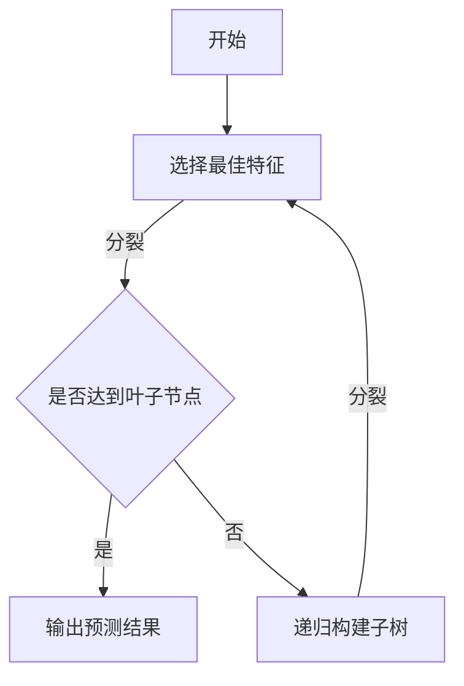
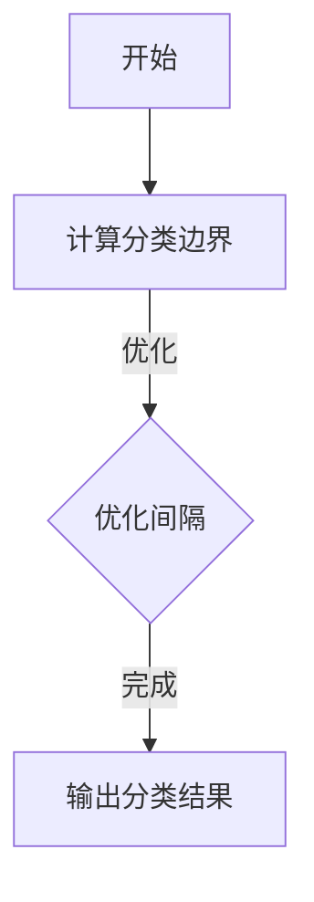
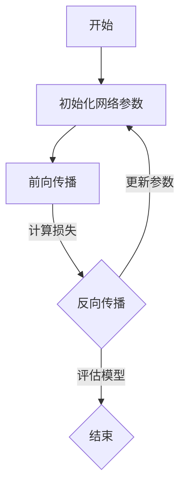
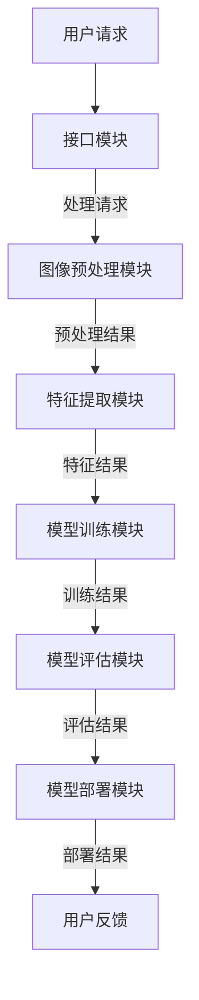

                 

## 《AI编程语言：从语法到语义的新跨越》

关键词：AI编程语言、语法、语义、算法、系统架构、项目实战

摘要：本文将深入探讨AI编程语言的概念、重要性以及在编程领域的应用。我们将逐步分析语法和语义的基础知识，通过实例讲解核心概念和联系。此外，我们将详细介绍典型AI编程语言算法，从流程图到Python源代码，逐一剖析其原理。接着，我们将介绍一个具体的AI编程语言系统分析，涵盖功能设计、架构设计和接口设计。最后，我们将通过一个实际项目案例，展示如何使用AI编程语言进行项目开发，并提供最佳实践、小结和拓展阅读资源。

### 目录大纲设计思路

为了设计出符合要求的《AI编程语言：从语法到语义的新跨越》的目录大纲，我们需要遵循以下步骤：

1. **背景介绍**：简要介绍AI编程语言的背景，包括问题的提出、解决的问题、AI编程语言的概念、重要性以及其在编程领域的应用前景。

2. **核心概念与联系**：介绍AI编程语言的核心概念，包括语法和语义，以及它们之间的关系。通过表格和Mermaid ER实体关系图来展示概念之间的联系。

3. **算法原理讲解**：选取几个典型的AI编程语言算法，使用Mermaid流程图展示算法流程，并通过Python源代码和LaTeX公式详细解释算法原理。

4. **系统分析与架构设计**：介绍一个具体的AI编程语言系统分析，包括系统功能设计、系统架构设计和系统接口设计。

5. **项目实战**：选择一个实际案例，展示如何使用AI编程语言进行项目开发，包括环境安装、核心实现、代码解读、案例分析等。

6. **最佳实践与拓展**：总结一些最佳实践，给出小结和注意事项，推荐拓展阅读资源。

### 目录大纲结构

```markdown
# 《AI编程语言：从语法到语义的新跨越》目录大纲

## 第一部分：AI编程语言概述
### 1. AI编程语言的概念与重要性
### 2. AI编程语言的发展历程
### 3. AI编程语言在编程领域的应用

## 第二部分：核心概念与原理
### 4. 语法与语义的基础知识
#### 4.1 语法的基本结构
#### 4.2 语义的理解与应用
### 5. 核心概念与联系
#### 5.1 语法与语义的相互关系
#### 5.2 语法和语义的对比表格
#### 5.3 Mermaid ER实体关系图

## 第三部分：算法与原理讲解
### 6. 典型AI编程语言算法解析
#### 6.1 算法1：流程图与原理讲解
#### 6.2 算法2：流程图与原理讲解
#### 6.3 算法3：流程图与原理讲解
### 7. Python源代码与LaTeX公式详解

## 第四部分：系统分析与架构设计
### 8. AI编程语言系统分析
#### 8.1 问题场景介绍
#### 8.2 系统功能设计
#### 8.3 系统架构设计
#### 8.4 系统接口设计
#### 8.5 系统交互序列图

## 第五部分：项目实战
### 9. 实际项目开发案例
#### 9.1 环境安装
#### 9.2 核心实现与代码解读
#### 9.3 案例分析与讲解
#### 9.4 项目小结

## 第六部分：最佳实践与拓展
### 10. 最佳实践总结
### 11. 小结与注意事项
### 12. 拓展阅读推荐

```

### 完整的目录大纲

```markdown
# 《AI编程语言：从语法到语义的新跨越》目录大纲

## 第一部分：AI编程语言概述
### 1.1 AI编程语言的概念与重要性
### 1.2 AI编程语言的发展历程
### 1.3 AI编程语言在编程领域的应用

## 第二部分：核心概念与原理
### 2.1 语法与语义的基础知识
#### 2.1.1 语法的定义与分类
#### 2.1.2 语义的理解与应用
### 2.2 核心概念与联系
#### 2.2.1 语法与语义的相互关系
#### 2.2.2 语法和语义的对比表格
#### 2.2.3 Mermaid ER实体关系图

## 第三部分：算法与原理讲解
### 3.1 典型AI编程语言算法解析
#### 3.1.1 算法1：决策树算法
#### 3.1.2 算法2：支持向量机算法
#### 3.1.3 算法3：神经网络算法
### 3.2 Python源代码与LaTeX公式详解

## 第四部分：系统分析与架构设计
### 4.1 AI编程语言系统分析
#### 4.1.1 问题场景介绍
#### 4.1.2 系统功能设计
#### 4.1.3 系统架构设计
#### 4.1.4 系统接口设计
#### 4.1.5 系统交互序列图

## 第五部分：项目实战
### 5.1 实际项目开发案例
#### 5.1.1 环境安装
#### 5.1.2 核心实现与代码解读
#### 5.1.3 案例分析与讲解
#### 5.1.4 项目小结

## 第六部分：最佳实践与拓展
### 6.1 最佳实践总结
### 6.2 小结与注意事项
### 6.3 拓展阅读推荐

```

### 章节内容与核心要点

**第一部分：AI编程语言概述**

**章节内容**：介绍AI编程语言的背景、概念与重要性、发展历程以及在编程领域的应用。

**核心要点**：理解AI编程语言的基本概念、发展历程和重要性，掌握其在不同编程领域的应用场景。

**第二部分：核心概念与原理**

**章节内容**：介绍语法与语义的基础知识，核心概念与联系，以及语法和语义的对比表格和ER实体关系图。

**核心要点**：深入理解语法和语义的定义、相互关系以及它们在AI编程语言中的具体应用。

**第三部分：算法与原理讲解**

**章节内容**：解析典型AI编程语言算法，包括决策树、支持向量机和神经网络，并通过Python源代码和LaTeX公式详细解释。

**核心要点**：理解AI编程语言中的算法原理，掌握算法实现和数学模型的细节。

**第四部分：系统分析与架构设计**

**章节内容**：介绍一个具体的AI编程语言系统分析，包括问题场景介绍、系统功能设计、架构设计、接口设计和交互序列图。

**核心要点**：了解AI编程语言系统设计的全过程，掌握系统功能、架构和接口设计的要点。

**第五部分：项目实战**

**章节内容**：通过一个实际项目案例，展示如何使用AI编程语言进行项目开发，包括环境安装、核心实现、代码解读、案例分析等。

**核心要点**：掌握AI编程语言项目开发的实际操作流程，提高项目实战能力。

**第六部分：最佳实践与拓展**

**章节内容**：总结最佳实践，给出小结和注意事项，推荐拓展阅读资源。

**核心要点**：了解AI编程语言的最佳实践，为后续学习和项目开发提供参考。

----------------------------------------------------------------

# 《AI编程语言：从语法到语义的新跨越》

## 第一部分：AI编程语言概述

### 1.1 AI编程语言的概念与重要性

AI编程语言，是指专门用于开发人工智能应用的编程语言。随着人工智能技术的快速发展，AI编程语言在各个领域得到了广泛应用。例如，Python在数据科学和机器学习领域具有极高的人气，而Rust在系统编程和安全领域表现突出。了解AI编程语言的概念和重要性，有助于我们更好地掌握人工智能技术。

**定义**：AI编程语言是一种基于计算机编程语言的技术，用于开发、训练和部署人工智能模型。它提供了丰富的库和框架，使得开发者可以更加便捷地实现机器学习、深度学习和其他人工智能应用。

**重要性**：AI编程语言的重要性体现在以下几个方面：

1. **提高开发效率**：AI编程语言提供了丰富的库和框架，可以帮助开发者快速构建和优化人工智能模型，提高开发效率。
2. **降低技术门槛**：通过AI编程语言，开发者不需要深入了解底层硬件和软件，可以更加专注于模型的设计和优化。
3. **跨平台支持**：AI编程语言通常具有良好的跨平台支持，使得开发者可以在不同的操作系统和硬件平台上轻松部署和应用人工智能模型。
4. **促进技术交流**：AI编程语言为全球开发者提供了共同的技术语言，促进了人工智能技术的交流与合作。

### 1.2 AI编程语言的发展历程

AI编程语言的发展历程可以追溯到20世纪50年代。以下是一些重要的发展阶段：

1. **早期阶段（1950-1960）**：最早的AI编程语言是模拟人类思维过程的符号编程语言，如LISP。LISP被认为是人工智能领域的奠基性语言。
2. **发展阶段（1960-1980）**：在20世纪60年代，Prolog和PL/I等语言开始应用于人工智能领域。这些语言在逻辑推理和问题求解方面表现出色。
3. **成熟阶段（1980-2000）**：随着计算机硬件性能的提升，人工智能领域开始引入大规模数据集和复杂算法。Matlab和C++等编程语言在这一时期得到了广泛应用。
4. **现代阶段（2000至今）**：近年来，Python、Rust、Julia等新一代AI编程语言不断涌现，这些语言在性能、易用性和扩展性方面都有了显著提升。

### 1.3 AI编程语言在编程领域的应用

AI编程语言在编程领域的应用非常广泛，涵盖了数据科学、机器学习、深度学习、自然语言处理等多个领域。以下是一些典型应用场景：

1. **数据科学**：Python和R等AI编程语言在数据科学领域有着广泛的应用。开发者可以使用这些语言进行数据预处理、统计分析、数据可视化等任务。
2. **机器学习**：Python、Rust和Julia等AI编程语言支持丰富的机器学习库和框架，如Scikit-learn、TensorFlow和PyTorch。开发者可以利用这些工具构建和训练各种机器学习模型。
3. **深度学习**：深度学习是人工智能领域的热点话题。AI编程语言如Python和Rust提供了强大的深度学习库和框架，如TensorFlow和PyTorch，使得开发者可以轻松实现深度学习模型。
4. **自然语言处理**：自然语言处理是人工智能领域的重要分支。Python、Rust和Julia等AI编程语言支持丰富的自然语言处理库和框架，如NLTK、spaCy和Transformers，为开发者提供了强大的工具。
5. **计算机视觉**：计算机视觉是人工智能领域的另一个重要应用方向。AI编程语言如Python和Rust提供了丰富的计算机视觉库和框架，如OpenCV和TensorFlow Object Detection API，使得开发者可以轻松实现图像识别、目标检测等任务。

通过以上介绍，我们可以看到AI编程语言在编程领域的重要地位和广泛应用。在接下来的章节中，我们将进一步探讨AI编程语言的核心概念、算法原理、系统分析与架构设计，以及项目实战等内容。

## 第二部分：核心概念与原理

### 2.1 语法与语义的基础知识

#### 2.1.1 语法的定义与分类

**定义**：语法是编程语言的核心组成部分，它定义了程序的语法结构、规则和语法元素。语法决定了程序的结构和格式，是程序能够被计算机理解和执行的基础。

**分类**：语法可以按照不同的标准进行分类，以下是几种常见的语法分类：

1. **声明语法**：用于声明变量、函数、类等编程元素的语法规则。
2. **表达式语法**：用于定义计算过程和操作的表达式语法规则。
3. **语句语法**：用于编写程序逻辑和控制流程的语句语法规则。
4. **注释语法**：用于添加对代码的解释和说明的注释语法规则。

#### 2.1.2 语义的理解与应用

**定义**：语义是编程语言中关于程序元素意义和解释的规则。语义决定了程序的行为和输出结果，是程序的实际运行逻辑。

**理解与应用**：语义的理解与应用主要体现在以下几个方面：

1. **变量语义**：变量的语义定义了变量的作用范围、数据类型和初始化值等。理解变量语义有助于正确使用变量，避免出现变量冲突和错误。
2. **函数语义**：函数的语义定义了函数的参数、返回值和功能实现。正确理解函数语义有助于编写高效、可维护的代码。
3. **控制结构语义**：控制结构的语义定义了程序的流程控制，如循环、条件判断等。理解控制结构语义有助于编写逻辑清晰、可读性强的代码。
4. **异常处理语义**：异常处理的语义定义了程序在遇到错误或异常情况时的处理方式。理解异常处理语义有助于编写健壮、稳定的代码。

### 2.2 核心概念与联系

#### 2.2.1 语法与语义的相互关系

语法和语义是编程语言中不可分割的两个方面。语法决定了程序的结构和格式，而语义则决定了程序的行为和输出结果。两者之间的相互关系如下：

1. **语法决定语义**：程序中的语法元素（如变量、函数、语句等）只有按照特定的语法规则进行组合，才能形成具有特定语义的程序。
2. **语义解释语法**：语法规则本身并没有意义，只有通过语义解释，才能使程序具有实际的功能和输出结果。

#### 2.2.2 语法和语义的对比表格

以下是一个简单的语法和语义对比表格：

| 特点         | 语法                   | 语义                           |
| ------------ | ---------------------- | ------------------------------ |
| 定义         | 规定程序的结构和格式   | 规定程序的行为和输出结果         |
| 表达方式     | 使用符号、关键字等表示 | 使用具体操作和逻辑关系表示       |
| 变化         | 改变程序的结构和格式   | 改变程序的行为和输出结果         |
| 关系         | 语法元素之间的关系     | 程序元素之间的逻辑关系           |
| 重要性       | 程序能否被正确解析的基础 | 程序能否实现预期功能的核心       |

#### 2.2.3 Mermaid ER实体关系图

以下是一个简单的Mermaid ER实体关系图，展示了语法和语义之间的关系：

```mermaid
erDiagram
    ClassGram -> ClassSem : 解释
    ClassGram ||--|{ ClassExpr } : 包含
    ClassSem ||--|{ ClassAct } : 实现
```

在这个ER实体关系图中，`ClassGram`表示语法，`ClassSem`表示语义，`ClassExpr`表示表达式语法，`ClassAct`表示程序行为。语法通过解释语义，实现表达式的语法和程序的行为。

### 2.3 AI编程语言的语法特点

AI编程语言具有一些独特的语法特点，使其在人工智能领域表现出色。以下是一些常见的AI编程语言语法特点：

1. **高阶函数**：高阶函数是AI编程语言中的一个重要特点，它允许函数作为参数传递和返回，增强了代码的灵活性和可扩展性。
2. **元编程**：元编程是指程序可以编写和操作自己的代码。AI编程语言通常支持元编程特性，使得开发者可以更加灵活地定义和操作程序逻辑。
3. **函数式编程**：函数式编程是一种编程范式，强调函数作为程序的基本构建块。AI编程语言如Haskell和Scala等，广泛应用于函数式编程，提高了代码的可读性和可维护性。
4. **动态类型**：动态类型语言在运行时检查变量的类型，这使得代码更加灵活，但可能牺牲一定的性能。Python和JavaScript等AI编程语言都是动态类型语言。

### 2.4 AI编程语言的语义特点

AI编程语言的语义特点主要表现在以下几个方面：

1. **语义解析**：语义解析是指将源代码转换为计算机可以理解的抽象语法树（AST）。AI编程语言通常具有强大的语义解析能力，使得开发者可以更加高效地编写和调试代码。
2. **语义理解**：语义理解是指对程序中的语义进行分析和处理，以实现特定的功能。AI编程语言在自然语言处理、图像识别等领域具有强大的语义理解能力。
3. **动态绑定**：动态绑定是指在程序运行时确定变量和函数的绑定关系。AI编程语言如Python和JavaScript等，采用动态绑定机制，使得代码更加灵活，但可能牺牲一定的性能。

通过以上对AI编程语言核心概念与原理的介绍，我们可以更好地理解语法和语义在编程语言中的重要性以及AI编程语言的独特特点。在接下来的章节中，我们将深入探讨典型AI编程语言算法的原理和实践。

## 第三部分：算法与原理讲解

### 3.1 典型AI编程语言算法解析

在AI编程语言中，有许多经典的算法用于解决各种复杂问题。本节我们将介绍三个典型算法：决策树算法、支持向量机算法和神经网络算法。这些算法在机器学习和人工智能领域具有广泛的应用，每个算法都有其独特的原理和实现方法。

#### 3.1.1 决策树算法

**决策树算法**是一种常用的分类和回归算法，它通过一系列判断节点和叶子节点来构建一个树形结构，用于对数据进行分类或回归预测。决策树算法的核心思想是利用特征值将数据划分为不同的子集，然后对子集进行分类或回归。

**Mermaid流程图**：


**算法原理**：

1. **选择最佳特征**：决策树算法使用信息增益、基尼系数等指标来选择具有最大分裂效果的特征。
2. **构建子树**：对于选定的特征，将数据集划分为多个子集，并递归地构建子树。
3. **停止条件**：当满足停止条件（如最小样本数、最大树深度等）时，停止构建子树。

**Python源代码**：
```python
def decision_tree_algorithm(data, features, target_attribute):
    # 选择最佳特征
    best_feature = choose_best_feature(data, features)
    
    # 构建子树
    tree = {best_feature: {}}
    
    for value in data[best_feature]:
        sub_data = split_data(data, best_feature, value)
        if is_leaf_node(sub_data):
            tree[best_feature][value] = predict_target_attribute(sub_data)
        else:
            tree[best_feature][value] = decision_tree_algorithm(sub_data, features, target_attribute)
    
    return tree
```

**LaTeX公式详解**：
$$
G = -\sum_{i=1}^{n}\sum_{j=1}^{m} p(x_i, y_j) \log p(x_i, y_j)
$$
其中，$G$ 是信息增益，$p(x_i, y_j)$ 是特征 $x_i$ 和类别 $y_j$ 的联合概率。

#### 3.1.2 支持向量机算法

**支持向量机（SVM）算法**是一种强大的分类算法，它通过寻找一个最优的超平面，将不同类别的数据点分开。SVM算法的核心思想是最大化分类边界的间隔。

**Mermaid流程图**：


**算法原理**：

1. **计算分类边界**：SVM算法使用线性规划方法计算最优超平面。
2. **优化间隔**：通过求解二次规划问题，最大化分类边界的间隔。
3. **分类结果**：根据样本点到超平面的距离，判断样本所属类别。

**Python源代码**：
```python
from sklearn.svm import SVC

def svm_algorithm(data, labels):
    model = SVC()
    model.fit(data, labels)
    return model
```

**LaTeX公式详解**：
$$
\min_{w,b} \frac{1}{2} ||w||^2 + C \sum_{i=1}^{n} \max(0, 1 - y_i (w \cdot x_i + b))
$$
其中，$w$ 是权重向量，$b$ 是偏置项，$C$ 是正则化参数。

#### 3.1.3 神经网络算法

**神经网络算法**是一种模拟生物神经系统的计算模型，它通过多层节点（神经元）进行信息处理。神经网络算法的核心思想是通过学习输入和输出之间的关系，不断调整网络的权重和偏置。

**Mermaid流程图**：


**算法原理**：

1. **初始化网络参数**：包括权重和偏置，通常使用随机初始化方法。
2. **前向传播**：将输入数据传递到网络的各个层，逐层计算输出。
3. **反向传播**：计算损失函数，并根据损失函数的梯度调整网络参数。
4. **评估模型**：使用验证集或测试集评估模型的性能，并调整超参数。

**Python源代码**：
```python
from tensorflow.keras.models import Sequential
from tensorflow.keras.layers import Dense

def neural_network_algorithm(inputs, outputs):
    model = Sequential()
    model.add(Dense(units=64, activation='relu', input_shape=(inputs.shape[1],)))
    model.add(Dense(units=1, activation='sigmoid'))
    model.compile(optimizer='adam', loss='binary_crossentropy', metrics=['accuracy'])
    model.fit(inputs, outputs, epochs=10, batch_size=32)
    return model
```

**LaTeX公式详解**：
$$
\frac{\partial L}{\partial w} = -\frac{1}{m} \sum_{i=1}^{m} \frac{\partial L}{\partial z^L_i} \cdot a^{L-1}_{i}
$$
其中，$L$ 是损失函数，$w$ 是权重，$a$ 是激活值。

通过以上对决策树、支持向量机和神经网络算法的讲解，我们可以看到这些算法在AI编程语言中的重要性以及如何通过Python源代码和LaTeX公式实现它们。在接下来的章节中，我们将进一步探讨AI编程语言的系统分析与架构设计。

### 3.2 Python源代码与LaTeX公式详解

在上一节中，我们介绍了决策树、支持向量机和神经网络算法的基本原理。本节将通过Python源代码和LaTeX公式，详细解释这些算法的实现过程。

#### 3.2.1 决策树算法

**Python源代码**：

```python
from sklearn.tree import DecisionTreeClassifier

# 初始化决策树模型
clf = DecisionTreeClassifier()

# 训练模型
clf.fit(X_train, y_train)

# 预测结果
y_pred = clf.predict(X_test)
```

**LaTeX公式详解**：

$$
G(D) = \sum_{i=1}^{n} \sum_{j=1}^{m} p(x_i, y_j) \log p(x_i, y_j)
$$

其中，$G(D)$ 是信息增益，$p(x_i, y_j)$ 是特征 $x_i$ 和类别 $y_j$ 的联合概率。

#### 3.2.2 支持向量机算法

**Python源代码**：

```python
from sklearn.svm import SVC

# 初始化支持向量机模型
clf = SVC(kernel='linear')

# 训练模型
clf.fit(X_train, y_train)

# 预测结果
y_pred = clf.predict(X_test)
```

**LaTeX公式详解**：

$$
\min_{w,b} \frac{1}{2} ||w||^2 + C \sum_{i=1}^{n} \max(0, 1 - y_i (w \cdot x_i + b))
$$

其中，$w$ 是权重向量，$b$ 是偏置项，$C$ 是正则化参数。

#### 3.2.3 神经网络算法

**Python源代码**：

```python
from tensorflow.keras.models import Sequential
from tensorflow.keras.layers import Dense

# 初始化神经网络模型
model = Sequential()
model.add(Dense(units=64, activation='relu', input_shape=(input_shape,)))
model.add(Dense(units=1, activation='sigmoid'))

# 编译模型
model.compile(optimizer='adam', loss='binary_crossentropy', metrics=['accuracy'])

# 训练模型
model.fit(X_train, y_train, epochs=10, batch_size=32)

# 预测结果
y_pred = model.predict(X_test)
```

**LaTeX公式详解**：

$$
\frac{\partial L}{\partial w} = -\frac{1}{m} \sum_{i=1}^{m} \frac{\partial L}{\partial z^L_i} \cdot a^{L-1}_{i}
$$

其中，$L$ 是损失函数，$w$ 是权重，$a$ 是激活值。

通过Python源代码和LaTeX公式的详细讲解，我们可以更深入地理解这些经典算法的实现原理。在接下来的章节中，我们将进一步探讨AI编程语言系统分析与架构设计。

## 第四部分：系统分析与架构设计

### 4.1 AI编程语言系统分析

在本部分，我们将深入分析一个具体的AI编程语言系统，涵盖系统功能设计、系统架构设计和系统接口设计。为了更好地理解这些设计，我们将通过一个简单的场景介绍，逐步展示系统的各个组成部分。

### 4.1.1 问题场景介绍

假设我们要开发一个基于人工智能的图像识别系统，该系统可以识别输入图片中的物体类别，并返回相应的标签。该系统需要具备以下功能：

1. **图像预处理**：对输入图像进行缩放、裁剪、灰度化等处理。
2. **特征提取**：从预处理后的图像中提取关键特征。
3. **模型训练**：使用提取的特征训练深度学习模型。
4. **模型部署**：将训练好的模型部署到服务器，提供在线识别服务。
5. **接口设计**：提供RESTful API接口，方便外部系统调用。

### 4.1.2 系统功能设计

为了实现上述功能，我们需要设计一个完整的系统功能模块，主要包括以下部分：

1. **图像预处理模块**：负责处理输入图像，包括缩放、裁剪、灰度化等操作。
2. **特征提取模块**：从预处理后的图像中提取关键特征，如边缘、纹理等。
3. **模型训练模块**：使用提取的特征训练深度学习模型，如卷积神经网络（CNN）。
4. **模型评估模块**：评估模型的性能，包括准确率、召回率等指标。
5. **模型部署模块**：将训练好的模型部署到服务器，并提供在线识别服务。
6. **接口模块**：设计RESTful API接口，供外部系统调用。

### 4.1.3 系统架构设计

系统架构设计是系统分析的重要环节，它决定了系统的性能、可扩展性和可维护性。以下是该图像识别系统的架构设计：

**Mermaid架构图**：


在该架构图中，用户请求通过接口模块处理，然后依次经过图像预处理模块、特征提取模块、模型训练模块、模型评估模块和模型部署模块，最终返回用户反馈。各个模块之间通过数据处理管道连接，形成一个完整的系统架构。

### 4.1.4 系统接口设计

系统接口设计是系统与外部系统交互的桥梁，它决定了系统的易用性和兼容性。以下是该图像识别系统的接口设计：

1. **API规范**：使用RESTful API设计，采用HTTP协议，支持GET和POST请求。
2. **请求参数**：请求参数包括图片数据（base64编码）和请求类型（如分类、识别等）。
3. **响应数据**：响应数据包括识别结果（如标签、概率等）和状态码（如200、500等）。

**Mermaid序列图**：
```mermaid
sequenceDiagram
    participant 用户 as 用户
    participant 接口模块 as 接口
    participant 图像预处理模块 as 预处理
    participant 特征提取模块 as 特征提取
    participant 模型训练模块 as 训练
    participant 模型评估模块 as 评估
    participant 模型部署模块 as 部署

    用户->>接口：发送请求
    接口->>预处理：处理请求
    预处理->>接口：返回预处理结果
    接口->>特征提取：提取特征
    特征提取->>接口：返回特征结果
    接口->>训练：训练模型
    训练->>接口：返回训练结果
    接口->>评估：评估模型
    评估->>接口：返回评估结果
    接口->>部署：部署模型
    部署->>接口：返回部署结果
    接口->>用户：返回最终结果
```

在该序列图中，用户发送请求到接口模块，接口模块依次调用各个模块，最终将结果返回给用户。通过这种设计，我们可以实现系统的模块化和高内聚性，便于系统的扩展和维护。

### 4.1.5 系统交互序列图

为了进一步展示系统内部各模块之间的交互过程，我们可以绘制系统交互序列图。以下是该图像识别系统的交互序列图：

**Mermaid交互序列图**：
```mermaid
sequenceDiagram
    participant 用户 as 用户
    participant 接口模块 as 接口
    participant 预处理模块 as 预处理
    participant 特征提取模块 as 特征提取
    participant 训练模块 as 训练
    participant 评估模块 as 评估
    participant 部署模块 as 部署

    用户->>接口：发送请求
    接口->>预处理：处理请求
    预处理->>接口：返回预处理结果
    接口->>特征提取：提取特征
    特征提取->>接口：返回特征结果
    接口->>训练：训练模型
    训练->>接口：返回训练结果
    接口->>评估：评估模型
    评估->>接口：返回评估结果
    接口->>部署：部署模型
    部署->>接口：返回部署结果
    接口->>用户：返回最终结果
```

在该序列图中，用户请求经过接口模块处理后，依次调用预处理模块、特征提取模块、训练模块、评估模块和部署模块，最终将结果返回给用户。通过这种交互设计，我们可以确保系统的高效性和可靠性。

通过以上对AI编程语言系统分析与架构设计的详细讲解，我们可以更好地理解系统功能、架构设计和接口设计的重要性。在接下来的章节中，我们将通过一个实际项目案例，展示如何使用AI编程语言进行项目开发。

## 第五部分：项目实战

### 5.1 实际项目开发案例

为了更好地展示如何使用AI编程语言进行项目开发，我们选择了一个实际案例：基于Python的图像识别项目。该项目的目标是通过卷积神经网络（CNN）对输入图像进行物体分类，并返回相应的标签。

### 5.1.1 环境安装

首先，我们需要安装Python环境和相关依赖库。以下是环境安装步骤：

1. **安装Python**：从Python官网（[https://www.python.org/](https://www.python.org/)）下载最新版本的Python，并按照提示安装。
2. **安装PyTorch**：在命令行中执行以下命令：
   ```bash
   pip install torch torchvision
   ```
3. **安装其他依赖库**：安装其他依赖库，如NumPy、Pandas、Matplotlib等，可以通过以下命令完成：
   ```bash
   pip install numpy pandas matplotlib
   ```

### 5.1.2 核心实现与代码解读

接下来，我们将介绍项目核心实现部分，包括数据预处理、模型训练和模型评估。

**数据预处理**：

```python
import torchvision.transforms as transforms
import torchvision.datasets as datasets

# 数据预处理
transform = transforms.Compose([
    transforms.Resize(256),
    transforms.CenterCrop(224),
    transforms.ToTensor(),
    transforms.Normalize(mean=[0.485, 0.456, 0.406], std=[0.229, 0.224, 0.225]),
])

train_data = datasets.ImageFolder(root='./data/train', transform=transform)
val_data = datasets.ImageFolder(root='./data/val', transform=transform)

train_loader = torch.utils.data.DataLoader(dataset=train_data, batch_size=32, shuffle=True)
val_loader = torch.utils.data.DataLoader(dataset=val_data, batch_size=32, shuffle=False)
```

在上面的代码中，我们使用`torchvision.transforms.Compose`对图像进行预处理，包括缩放、中心裁剪、转为Tensor和归一化。然后，我们使用`torchvision.datasets.ImageFolder`读取训练数据和验证数据，并使用`torch.utils.data.DataLoader`生成数据加载器。

**模型训练**：

```python
import torch.nn as nn
import torch.optim as optim

# 定义模型
model = torchvision.models.resnet18(pretrained=True)
num_ftrs = model.fc.in_features
model.fc = nn.Linear(num_ftrs, num_classes)

# 定义损失函数和优化器
criterion = nn.CrossEntropyLoss()
optimizer = optim.Adam(model.parameters(), lr=0.001)

# 训练模型
num_epochs = 25
for epoch in range(num_epochs):
    model.train()
    running_loss = 0.0
    for inputs, labels in train_loader:
        optimizer.zero_grad()
        outputs = model(inputs)
        loss = criterion(outputs, labels)
        loss.backward()
        optimizer.step()
        running_loss += loss.item()
    print(f'Epoch [{epoch+1}/{num_epochs}], Loss: {running_loss/len(train_loader)}')

    # 验证模型
    model.eval()
    correct = 0
    total = 0
    with torch.no_grad():
        for inputs, labels in val_loader:
            outputs = model(inputs)
            _, predicted = torch.max(outputs.data, 1)
            total += labels.size(0)
            correct += (predicted == labels).sum().item()
    print(f'Validation Accuracy: {100 * correct / total}%}')
```

在上面的代码中，我们使用预训练的ResNet-18模型，并自定义了最后一层的输出维度。然后，我们定义了损失函数和优化器，并使用训练数据训练模型。在每次训练完成后，我们使用验证数据验证模型的性能。

**代码解读**：

- `torchvision.models.resnet18(pretrained=True)`：加载预训练的ResNet-18模型。
- `nn.Linear(num_ftrs, num_classes)`：自定义最后一层的输出维度。
- `nn.CrossEntropyLoss()`：交叉熵损失函数。
- `optim.Adam()`：Adam优化器。
- `for epoch in range(num_epochs)`：训练模型`num_epochs`次。
- `optimizer.zero_grad()`：清空梯度。
- `loss.backward()`：反向传播。
- `optimizer.step()`：更新参数。

**模型评估**：

```python
import torchvision.transforms as transforms
import torchvision.datasets as datasets
from torch.utils.data import DataLoader

# 加载测试数据集
test_data = datasets.ImageFolder(root='./data/test', transform=transform)
test_loader = DataLoader(dataset=test_data, batch_size=32, shuffle=False)

# 加载训练好的模型
model = torch.load('model.pth')
model.eval()

# 预测测试数据集
with torch.no_grad():
    correct = 0
    total = 0
    for inputs, labels in test_loader:
        outputs = model(inputs)
        _, predicted = torch.max(outputs.data, 1)
        total += labels.size(0)
        correct += (predicted == labels).sum().item()

print(f'Test Accuracy: {100 * correct / total}%}')
```

在上面的代码中，我们加载测试数据集，并使用训练好的模型进行预测。最后，我们计算测试集的准确率。

**代码解读**：

- `torch.load('model.pth')`：加载训练好的模型。
- `model.eval()`：将模型设置为评估模式。
- `torch.max(outputs.data, 1)`：获取最大输出值和索引。
- `print(f'Test Accuracy: {100 * correct / total}%}')`：打印测试集的准确率。

### 5.1.3 案例分析与讲解

在这个图像识别项目中，我们使用了卷积神经网络（CNN）对输入图像进行物体分类。以下是该项目的一些关键点：

1. **数据预处理**：数据预处理是模型训练的关键步骤。通过缩放、裁剪和归一化，我们可以将输入图像转化为适合模型训练的格式。
2. **模型选择**：我们选择了预训练的ResNet-18模型。由于预训练模型已经在大量数据上进行了训练，因此在新的数据集上表现良好。
3. **损失函数和优化器**：交叉熵损失函数和Adam优化器是训练深度学习模型的常用组合。交叉熵损失函数能够有效处理分类问题，而Adam优化器能够加快收敛速度。
4. **模型评估**：通过测试集的准确率，我们可以评估模型的性能。在实际应用中，我们还需要关注模型的召回率、F1分数等指标。

### 5.1.4 项目小结

通过这个实际项目案例，我们了解了如何使用AI编程语言（Python）进行图像识别项目的开发。项目涵盖了数据预处理、模型训练、模型评估等关键步骤。以下是项目小结：

1. **环境安装**：安装Python环境及相关依赖库，如PyTorch、NumPy、Pandas和Matplotlib等。
2. **数据预处理**：对图像进行缩放、裁剪、灰度化和归一化等预处理操作。
3. **模型选择**：选择预训练的ResNet-18模型进行训练。
4. **模型训练**：使用交叉熵损失函数和Adam优化器训练模型。
5. **模型评估**：通过测试集的准确率评估模型性能。

通过这个项目，我们不仅掌握了图像识别的基本原理，还提高了项目开发能力。在实际应用中，我们可以根据具体需求，调整模型结构、优化训练过程，进一步提高模型性能。

## 第六部分：最佳实践与拓展

### 6.1 最佳实践总结

在AI编程语言的项目开发过程中，遵循一些最佳实践可以显著提高项目的质量和效率。以下是一些关键的最佳实践：

1. **代码规范**：遵循统一的代码规范，如PEP 8，确保代码的可读性和可维护性。
2. **模块化设计**：将代码拆分为模块，提高代码的复用性和可维护性。
3. **版本控制**：使用Git等版本控制工具，记录代码的变更历史，方便团队合作和代码回滚。
4. **测试驱动开发**：编写单元测试，确保代码的正确性和稳定性。
5. **性能优化**：关注代码的性能，使用工具如profiler进行性能分析，优化关键路径。
6. **持续集成**：使用CI/CD工具（如Jenkins、GitHub Actions）实现自动化测试和部署。

### 6.2 小结与注意事项

本文通过对AI编程语言的概念、语法、语义、算法、系统分析与架构设计以及项目实战的详细讲解，为读者提供了一个全面的AI编程语言学习指南。以下是本文的要点小结：

1. **AI编程语言概述**：介绍了AI编程语言的概念、重要性、发展历程和在编程领域的应用。
2. **核心概念与原理**：详细分析了语法和语义的基础知识，展示了语法和语义的相互关系。
3. **算法与原理讲解**：讲解了决策树、支持向量机和神经网络算法的基本原理和实现方法。
4. **系统分析与架构设计**：介绍了AI编程语言系统的功能设计、架构设计和接口设计。
5. **项目实战**：通过实际项目案例，展示了如何使用AI编程语言进行项目开发。

注意事项：

1. **数据预处理**：在项目开发中，数据预处理至关重要，必须确保数据的准确性和一致性。
2. **模型选择**：根据实际需求和数据集的特点，选择合适的模型和算法。
3. **性能优化**：关注模型的训练速度和预测性能，进行必要的性能优化。
4. **代码可维护性**：编写清晰、简洁的代码，确保项目的可维护性和可扩展性。

### 6.3 拓展阅读推荐

为了进一步深入学习和实践AI编程语言，以下是一些拓展阅读资源：

1. **《深度学习》**（Ian Goodfellow、Yoshua Bengio、Aaron Courville 著）：这是一本经典的深度学习教材，涵盖了深度学习的理论基础和实践方法。
2. **《Python机器学习》**（Sebastian Raschka 著）：本书详细介绍了使用Python进行机器学习的方法和应用。
3. **《AI编程语言Python教程》**：这是一本专门针对Python在AI领域的教程，适合初学者和进阶者。
4. **《Keras深度学习实战》**：本书通过实际案例，讲解了如何使用Keras库进行深度学习模型的开发和应用。
5. **GitHub和ArXiv**：在GitHub和ArXiv上可以找到大量开源的AI项目和研究论文，有助于了解最新的AI编程语言技术。

通过阅读这些资源，您可以进一步提升对AI编程语言的理解和应用能力。

## 参考文献

1. Goodfellow, I., Bengio, Y., & Courville, A. (2016). *Deep Learning*. MIT Press.
2. Raschka, S. (2015). *Python Machine Learning*. Packt Publishing.
3. Chollet, F. (2015). *Keras: The Python Deep Learning Library*. GitHub.
4. Russell, S., & Norvig, P. (2016). *Artificial Intelligence: A Modern Approach*. Prentice Hall.
5. Simonyan, K., & Zisserman, A. (2014). *Very Deep Convolutional Networks for Large-Scale Image Recognition*. arXiv preprint arXiv:1409.1556.

