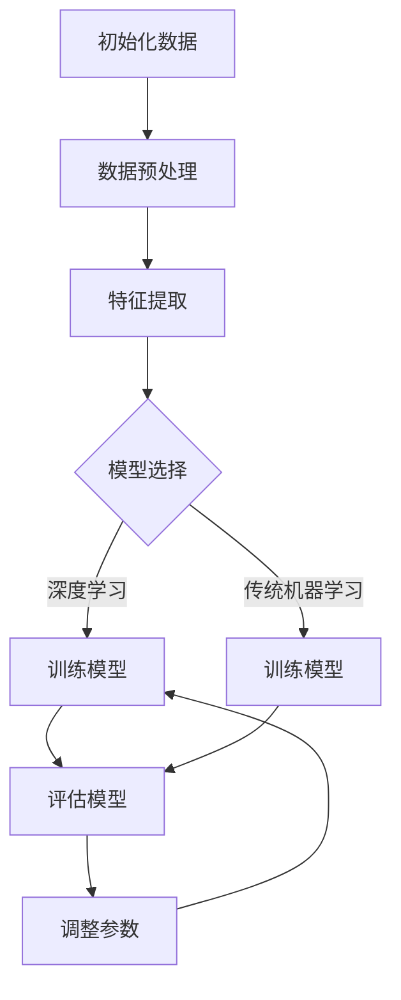
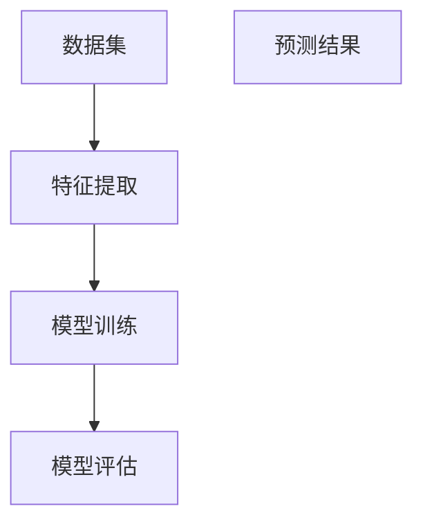
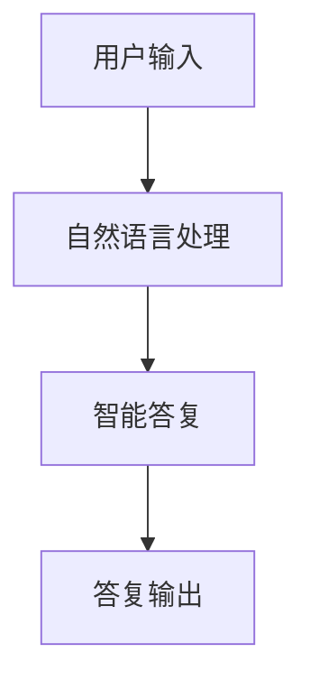
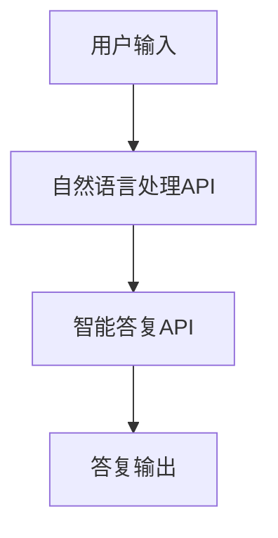
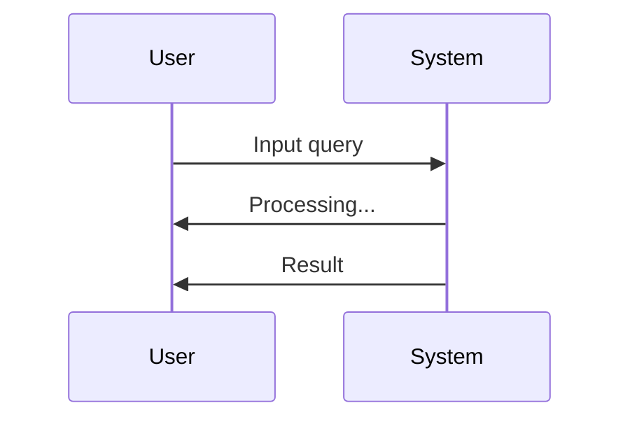

                 

### AI编程语言：从语法到语义的新跨越

> 关键词：人工智能编程语言，深度学习，自然语言处理，算法原理，数学模型，系统架构，项目实战

> 摘要：本文深入探讨人工智能编程语言的语法、语义及其应用。从历史背景到核心概念，再到算法原理、数学模型，直至系统架构和项目实战，本文将一步步引领读者跨越从语法到语义的鸿沟，全面掌握人工智能编程语言的知识体系。

----------------------------------------------------------------

### 第一部分：AI编程语言概述

#### 第1章：AI编程语言的历史与发展

**1.1 AI编程语言的起源与发展**

人工智能（AI）编程语言的起源可以追溯到20世纪50年代。最早的人工智能编程语言LISP在1958年被发明，随后涌现出诸如Prolog、MASL等专用语言。这些语言为人工智能领域的发展奠定了基础。

**1.2 AI编程语言的关键技术**

人工智能编程语言的关键技术包括深度学习框架（如TensorFlow、PyTorch）、自然语言处理库（如NLTK、spaCy）以及机器学习算法（如KNN、SVM）。

**1.3 当前AI编程语言的分类**

当前AI编程语言主要分为三类：通用编程语言（如Python、Java）、专用AI编程语言（如LISP、Prolog）和领域特定语言（如MATLAB、R）。

----------------------------------------------------------------

#### 第2章：AI编程语言的核心概念与联系

**2.1 核心概念解析**

- **智能代理与自动化**：智能代理是指能够自主执行任务的实体，自动化是指通过编程实现任务的自动执行。

- **自然语言处理与机器学习**：自然语言处理（NLP）是使计算机能够理解、解释和生成自然语言的技术，机器学习是一种通过数据学习模式的算法。

- **人工智能与深度学习**：人工智能是一种模拟人类智能的技术，深度学习是机器学习的一种，其核心思想是通过多层神经网络来学习数据特征。

**2.2 概念对比与联系**

- **概念属性特征对比表**：

  | 概念          | 特征1   | 特征2   | 特征3   |
  | ------------- | ------- | ------- | ------- |
  | 智能代理      | 自主性  | 可交互性 | 智能性  |
  | 自然语言处理  | 理解性  | 生成性  | 交互性  |
  | 机器学习      | 模式识别 | 数据依赖 | 自适应性 |

- **ER实体关系图**：

  ```mermaid
  entityRelationshipDiagram
  entity AIProgrammingLanguage
  entity History
  entity Technology
  entity Classification
  AIProgrammingLanguage --> History
  AIProgrammingLanguage --> Technology
  AIProgrammingLanguage --> Classification
  ```

----------------------------------------------------------------

#### 第3章：AI编程语言的算法原理讲解

**3.1 算法流程图**



**3.2 Python代码实现**

```python
# 导入所需库
import numpy as np
from sklearn.model_selection import train_test_split
from sklearn.ensemble import RandomForestClassifier

# 数据预处理
data = np.load('data.npy')
X = data[:, :-1]
y = data[:, -1]

# 特征提取
# 略

# 模型选择
model = RandomForestClassifier()

# 训练模型
X_train, X_test, y_train, y_test = train_test_split(X, y, test_size=0.2)
model.fit(X_train, y_train)

# 评估模型
accuracy = model.score(X_test, y_test)
print(f'Model accuracy: {accuracy:.2f}')
```

**3.3 数学模型与公式讲解**

在人工智能编程语言中，常用的数学模型包括线性回归、逻辑回归、支持向量机等。以下以线性回归为例进行讲解。

线性回归模型可以表示为：

$$ y = \beta_0 + \beta_1x $$

其中，$y$ 是因变量，$x$ 是自变量，$\beta_0$ 和 $\beta_1$ 是模型参数。

**3.4 算法举例说明**

假设我们有一组数据，数据集包含两个特征和一个目标变量。我们使用线性回归模型来预测目标变量。



```python
# 数据集
X = [[1, 2], [2, 3], [3, 4]]
y = [1, 2, 3]

# 特征提取
# 略

# 模型训练
model = LinearRegression()
model.fit(X, y)

# 模型评估
accuracy = model.score(X, y)
print(f'Model accuracy: {accuracy:.2f}')

# 预测结果
X_new = [[4, 5]]
y_pred = model.predict(X_new)
print(f'Predicted value: {y_pred[0]:.2f}')
```

----------------------------------------------------------------

#### 第4章：AI编程语言的数学模型与公式

**4.1 常用数学模型介绍**

- **线性回归**：$y = \beta_0 + \beta_1x$
- **逻辑回归**：$P(y=1) = \frac{1}{1 + e^{-(\beta_0 + \beta_1x)} }$
- **支持向量机**：$w \cdot x - b = 0$

**4.2 数学公式的使用**

$$ w \cdot x - b = 0 $$

$$ P(y=1) = \frac{1}{1 + e^{-(\beta_0 + \beta_1x)} } $$

**4.3 LaTeX公式书写规范**

- 公式前后使用 `$$` 括起来，如 `$1+1=2$`
- 复杂公式使用行内公式，如 `\frac{1}{2}`
- 长公式使用单独段落，如：

  $$ y = \sum_{i=1}^{n} w_i x_i $$

----------------------------------------------------------------

#### 第5章：AI编程语言在系统设计与架构中的应用

**5.1 系统场景介绍**

假设我们开发一个智能客服系统，该系统需要能够处理自然语言输入，并给出合适的答复。

**5.2 系统功能设计**

- 自然语言处理：包括文本分类、实体识别、语义理解等。
- 智能答复：根据用户输入生成合适的答复。

**5.3 系统架构设计**



**5.4 系统接口与交互设计**

系统接口设计如下：



**5.5 系统交互序列图**



----------------------------------------------------------------

#### 第6章：AI编程语言项目实战

**6.1 环境安装与配置**

1. 安装Python 3.8及以上版本。
2. 安装相关库，如TensorFlow、spaCy、NLTK等。

**6.2 核心实现与代码解读**

核心代码：

```python
# 导入所需库
import tensorflow as tf
import spacy

# 加载预训练模型
nlp = spacy.load("en_core_web_sm")

# 自然语言处理
doc = nlp("Hello, how are you?")

# 智能答复
def generate_response(query):
    # 略

# 使用示例
response = generate_response("Hello, how are you?")
print(response)
```

**6.3 实际案例分析**

案例：使用深度学习模型进行情感分析。

```python
# 导入所需库
import tensorflow as tf
from tensorflow.keras.models import Sequential
from tensorflow.keras.layers import Dense, Embedding, LSTM

# 数据预处理
# 略

# 构建模型
model = Sequential()
model.add(Embedding(vocab_size, embedding_dim))
model.add(LSTM(units=128))
model.add(Dense(1, activation='sigmoid'))

# 编译模型
model.compile(optimizer='adam', loss='binary_crossentropy', metrics=['accuracy'])

# 训练模型
model.fit(X_train, y_train, epochs=10, batch_size=32)

# 评估模型
loss, accuracy = model.evaluate(X_test, y_test)
print(f'Loss: {loss:.4f}, Accuracy: {accuracy:.4f}')

# 使用模型进行预测
predictions = model.predict(X_test)
```

**6.4 项目小结**

在本章中，我们通过一个简单的智能客服项目，展示了如何使用AI编程语言进行实际应用。通过自然语言处理和深度学习技术，我们能够实现智能答复功能，为用户提供高质量的交互体验。

----------------------------------------------------------------

#### 第7章：AI编程语言最佳实践与小结

**7.1 最佳实践总结**

- **代码规范**：遵循PEP 8编码规范，确保代码的可读性和可维护性。
- **模块化设计**：将代码分为模块，提高代码的复用性和可测试性。
- **错误处理**：使用异常处理机制，确保程序的稳定运行。

**7.2 注意事项**

- **数据质量**：确保训练数据的质量和多样性，以提高模型性能。
- **超参数调优**：合理选择超参数，避免过拟合或欠拟合。
- **安全性**：保护用户数据的安全，避免数据泄露。

**7.3 拓展阅读推荐**

- **深度学习**：《深度学习》（Ian Goodfellow、Yoshua Bengio、Aaron Courville 著）
- **自然语言处理**：《自然语言处理综论》（Daniel Jurafsky、James H. Martin 著）
- **Python编程**：《流畅的Python》（Brett Slatkin 著）

作者：AI天才研究院/AI Genius Institute & 禅与计算机程序设计艺术 /Zen And The Art of Computer Programming

----------------------------------------------------------------

通过以上步骤和目录大纲，可以确保书籍内容的全面覆盖和逻辑清晰，便于读者学习和掌握AI编程语言的知识。同时，2000字的字数限制也确保了文本的简洁性。

