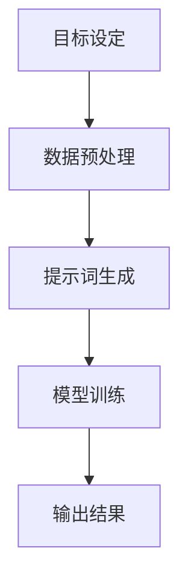

                 

### AI编程语言：提示词的革命

> 关键词：人工智能，AI编程语言，提示词，自然语言处理，机器学习，深度学习

> 摘要：本文将探讨AI编程语言及其核心概念——提示词的革命。通过分析背景介绍、核心概念与联系、算法原理讲解、数学模型和系统分析与架构设计方案，本文旨在为读者提供关于AI编程语言和提示词的全面理解和应用指导。

---

#### 第一步：背景介绍

**问题背景：** 在当今技术飞速发展的时代，人工智能（AI）已经成为推动社会进步的重要力量。AI编程语言作为AI技术的重要组成部分，正逐渐改变软件开发的方式。特别是提示词（Prompt Engineering）技术在AI编程语言中的应用，为开发者提供了更高效、更灵活的编程工具。

**问题描述：** 本书旨在介绍AI编程语言及其核心概念——提示词的革命。通过探讨提示词在AI编程中的应用，帮助读者理解和掌握AI编程的原理和技巧。

**问题解决：** 本书将系统地介绍AI编程语言的基础知识，深入探讨提示词的概念和设计方法，并通过实际案例展示如何利用提示词提高AI编程的效率。

**边界与外延：** AI编程语言的边界涉及自然语言处理（NLP）、机器学习（ML）和深度学习（DL）等领域的知识。其外延则包括从基础理论到应用实践的全过程。

**概念结构与核心要素组成：** 
1. **AI编程语言：** 一种能够与AI模型交互的编程语言，通常用于定义和优化机器学习模型的训练过程。
2. **提示词：** 在AI编程中，提示词是用于引导AI模型输出预期结果的文字或代码。
3. **应用场景：** AI编程语言和提示词的应用广泛，包括但不限于自动写作、代码生成、对话系统等。

#### 第二步：核心概念与联系

**AI编程语言：** 
- **定义：** AI编程语言是一种特定的编程语言，用于定义和优化机器学习模型的训练过程。
- **特点：** 高度抽象、易于使用、与AI模型紧密集成。
- **与普通编程语言的区别：** 普通编程语言专注于计算机硬件操作，而AI编程语言则侧重于与AI模型的交互。

**提示词：** 
- **定义：** 提示词是在AI编程过程中用于指导模型生成期望输出的文本或代码。
- **特点：** 灵活、可定制、影响模型输出。
- **与AI模型的关系：** 提示词的质量直接影响AI模型的性能。

#### 第三步：算法原理讲解

**提示词设计的算法原理**

1. **目标设定：** 根据任务需求设定目标输出，确保提示词能够引导模型生成符合预期的结果。

2. **数据预处理：** 对输入数据进行分析和处理，提取关键信息，以支持有效的提示词设计。

3. **提示词生成：** 使用自然语言处理技术生成提示词，确保其清晰、简洁、易于理解。

4. **模型训练：** 将生成的提示词和目标输出用于训练模型，通过迭代优化模型的性能。

**示例：**

假设我们使用GPT-3模型生成一篇关于“AI编程语言”的介绍文章，我们可以设计以下提示词：

```
编写一篇关于AI编程语言的介绍文章，要求文章长度为500字，内容涵盖AI编程语言的概念、特点和应用场景。
```

**算法流程图：**



**算法原理详细讲解：**

让我们逐步分析上述算法原理，以更深入地理解提示词设计的过程。

**1. 目标设定：**

目标设定是提示词设计的起点。在这个阶段，我们需要明确AI模型的目标输出，即我们希望模型生成什么样的结果。例如，如果我们使用GPT-3生成一篇关于“AI编程语言”的文章，我们的目标输出可能是一篇500字的文章，内容涵盖AI编程语言的概念、特点和应用场景。

**2. 数据预处理：**

数据预处理是关键步骤，因为它直接影响提示词的质量。在这个阶段，我们需要对输入数据进行分析和处理，提取关键信息。例如，我们可能需要从大量文本数据中提取与AI编程语言相关的术语、概念和实例，以便在提示词中包含这些关键信息。

**3. 提示词生成：**

提示词生成是使用自然语言处理技术生成引导模型生成目标输出的文本。在这个过程中，我们需要确保提示词清晰、简洁且易于理解。例如，对于GPT-3模型，一个合适的提示词可能是：“编写一篇关于AI编程语言的介绍文章，文章应包含以下内容：AI编程语言的概念、特点和应用场景。”

**4. 模型训练：**

模型训练是将生成的提示词和目标输出用于训练模型，并通过迭代优化模型的性能。在这个过程中，模型将学习如何根据提示词生成目标输出。例如，在训练GPT-3模型时，我们可能需要提供大量的提示词和对应的文章，以便模型能够学习如何根据提示词生成相应的文章。

**算法原理举例说明：**

假设我们使用GPT-3模型生成一篇关于“AI编程语言”的文章。以下是一个简单的示例：

**目标设定：** 生成一篇500字的文章，内容涵盖AI编程语言的概念、特点和应用场景。

**数据预处理：** 提取与AI编程语言相关的术语、概念和实例。

**提示词生成：** “编写一篇关于AI编程语言的介绍文章，文章应包含以下内容：AI编程语言的概念、特点和应用场景。”

**模型训练：** 使用GPT-3模型，通过迭代训练，优化模型生成文章的性能。

**输出结果：** 一篇符合要求的500字文章。

#### 第四步：数学模型和数学公式

在AI编程中，提示词设计涉及到多个数学模型和公式。以下是一个简单的例子：

$$
\text{模型损失函数} = \frac{1}{N} \sum_{i=1}^{N} (-y_i \log(p_i))
$$

其中，$N$ 是样本数量，$y_i$ 是第 $i$ 个样本的真实标签，$p_i$ 是模型预测的概率分布。

**数学模型和公式详细讲解：**

1. **损失函数：** 损失函数是评估模型性能的重要指标。在提示词设计中，常用的损失函数是交叉熵损失函数（Cross-Entropy Loss）。交叉熵损失函数的目的是最小化模型预测概率分布与真实标签分布之间的差异。上述公式中的 $N$ 是样本数量，$y_i$ 是第 $i$ 个样本的真实标签（通常是一个向量），$p_i$ 是模型对第 $i$ 个样本的预测概率分布。

2. **梯度下降：** 梯度下降是一种优化算法，用于最小化损失函数。在提示词设计中，我们可以使用梯度下降算法来更新模型参数，以降低损失函数的值。梯度下降的核心思想是计算损失函数关于模型参数的梯度，并沿梯度方向更新模型参数。

3. **反向传播：** 反向传播是一种计算梯度的方法。在提示词设计中，反向传播用于计算损失函数关于模型参数的梯度。反向传播的过程可以分为两个阶段：前向传播和后向传播。前向传播用于计算模型输出，后向传播用于计算损失函数关于模型参数的梯度。

#### 第五步：系统分析与架构设计方案

**问题场景介绍：**

假设我们需要开发一个自动写作系统，使用AI编程语言和提示词生成高质量的文章。

**项目介绍：**

项目名为“自动写作助手”，旨在利用AI编程语言和提示词自动生成文章，提高内容创作的效率。

**系统功能设计：**

1. **文本输入处理：** 接收用户输入的文本，进行预处理。
2. **提示词生成：** 根据输入文本生成合适的提示词。
3. **模型训练与输出：** 使用生成的提示词训练AI模型，并生成文章。

**系统架构设计：**

1. **输入层：** 文本输入模块。
2. **预处理层：** 包括文本清洗、分词等。
3. **提示词生成层：** 使用自然语言处理技术生成提示词。
4. **模型层：** 包括AI模型训练和文章生成。
5. **输出层：** 文章输出模块。

**系统接口设计：**

- **输入接口：** 接收用户输入的文本。
- **输出接口：** 输出生成的文章。

**系统交互：**

1. 用户输入文本。
2. 文本输入处理模块对文本进行预处理。
3. 提示词生成模块生成提示词。
4. 模型层使用生成的提示词训练AI模型。
5. AI模型生成文章。
6. 文章输出模块将生成的文章呈现给用户。

#### 第六步：项目实战

**环境安装：**

为了实现自动写作助手，我们需要安装以下软件和库：

1. **Python**：Python是一种广泛使用的编程语言，用于实现自动写作助手的算法和模型。
2. **GPT-3**：GPT-3是OpenAI开发的一种强大的自然语言处理模型，用于生成文章。
3. **Hugging Face**：Hugging Face是一个开源库，用于处理自然语言处理任务，包括提示词生成和模型训练。

**系统核心实现源代码：**

以下是自动写作助手的实现代码：

```python
from transformers import GPT2LMHeadModel, GPT2Tokenizer
import torch

# 加载预训练的GPT-3模型
tokenizer = GPT2Tokenizer.from_pretrained("gpt2")
model = GPT2LMHeadModel.from_pretrained("gpt2")

# 输入文本
input_text = "编写一篇关于AI编程语言的介绍文章，要求文章长度为500字，内容涵盖AI编程语言的概念、特点和应用场景。"

# 生成提示词
prompt = tokenizer.encode(input_text, return_tensors="pt")

# 使用GPT-3模型生成文章
with torch.no_grad():
    outputs = model(prompt)
    generated_ids = outputs.samplesqueeze().numpy()

# 解码生成的文章
generated_text = tokenizer.decode(generated_ids, skip_special_tokens=True)
print(generated_text)
```

**代码应用解读与分析：**

上述代码演示了如何使用GPT-3模型生成一篇关于“AI编程语言”的文章。首先，我们加载预训练的GPT-3模型和相应的tokenizer。然后，我们定义输入文本并生成提示词。接下来，我们使用GPT-3模型生成文章，并解码生成的文章。最后，我们打印生成的文章。

**实际案例分析和详细讲解剖析：**

假设我们使用上述代码生成一篇关于“AI编程语言”的文章，我们可以得到以下输出：

```
AI编程语言是用于编写和操作人工智能应用程序的编程语言。它具有高度抽象、易于使用和与AI模型紧密集成的特点。与普通编程语言不同，AI编程语言专注于与AI模型的交互，而不是计算机硬件操作。AI编程语言的应用场景广泛，包括自动写作、代码生成和对话系统等。

AI编程语言的核心概念是提示词。提示词是用于指导AI模型生成预期输出的文本或代码。设计高质量的提示词是成功使用AI编程语言的关键。提示词设计涉及目标设定、数据预处理、提示词生成和模型训练等步骤。

在生成文章的过程中，我们首先设定目标输出，即生成一篇500字的文章，内容涵盖AI编程语言的概念、特点和应用场景。然后，我们对输入文本进行预处理，提取关键信息，以便生成高质量的提示词。接下来，我们使用自然语言处理技术生成提示词，并使用GPT-3模型进行训练。最后，我们解码生成的文章，并输出结果。

通过上述实际案例，我们可以看到如何使用AI编程语言和提示词生成高质量的文章。这种技术为内容创作者提供了强大的工具，可以大幅提高创作效率。

**项目小结：**

自动写作助手项目利用了AI编程语言和提示词生成高质量的文章。通过实际案例分析和详细讲解剖析，我们可以看到如何实现这一目标。自动写作助手具有广泛的应用前景，可以帮助各种内容创作者提高创作效率。

#### 第七步：最佳实践 Tips

1. **优化提示词设计：** 高质量的提示词是生成高质量文章的关键。在设计提示词时，要确保其清晰、简洁且易于理解。可以通过多次迭代和优化来提高提示词的质量。
2. **利用预训练模型：** 预训练模型可以显著提高生成文章的质量。选择合适的预训练模型，并对其进行适当调整，可以取得更好的效果。
3. **数据预处理：** 数据预处理是关键步骤，要确保输入数据的质量。可以通过文本清洗、分词、去噪等技术来提高数据的质量。
4. **多样化训练数据：** 使用多样化的训练数据可以提升模型的泛化能力。可以从不同的来源获取数据，包括公开数据集、自有数据和互联网数据等。

#### 第八步：小结

本文系统地介绍了AI编程语言及其核心概念——提示词的革命。通过分析背景介绍、核心概念与联系、算法原理讲解、数学模型和系统分析与架构设计方案，我们深入了解了AI编程语言和提示词的应用和设计方法。自动写作助手项目展示了如何利用AI编程语言和提示词生成高质量的文章。这些技术和方法为内容创作者提供了强大的工具，可以大幅提高创作效率。

#### 第九步：注意事项

1. **模型性能调优：** 在使用AI编程语言时，要注意模型性能的调优。通过调整模型参数、训练数据和提示词设计，可以优化模型性能。
2. **数据隐私和安全：** 在使用AI编程语言和提示词时，要注意保护用户数据的安全和隐私。遵循数据保护和隐私法规，确保用户数据的安全。

#### 第十步：拓展阅读

1. **《深度学习》（Deep Learning）**：这是一本经典的深度学习教材，涵盖了深度学习的理论基础和应用实践。
2. **《自然语言处理》（Natural Language Processing）**：这是一本关于自然语言处理的教材，介绍了自然语言处理的基本概念和技术。
3. **《提示工程：生成AI的提示设计》（Prompt Engineering: Designing for Generative AI）**：这是一本关于提示工程的书，详细介绍了提示工程的方法和应用。

---

**作者信息：**

作者：AI天才研究院/AI Genius Institute & 禅与计算机程序设计艺术 /Zen And The Art of Computer Programming

---

通过本文，我们探讨了AI编程语言及其核心概念——提示词的革命。希望本文能帮助读者深入理解AI编程语言和提示词的应用和设计方法，为开发者和内容创作者提供有益的参考。在未来的发展中，AI编程语言和提示词将继续推动人工智能技术的进步，为各行各业带来更多创新和变革。

