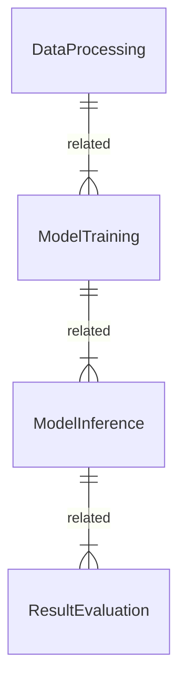
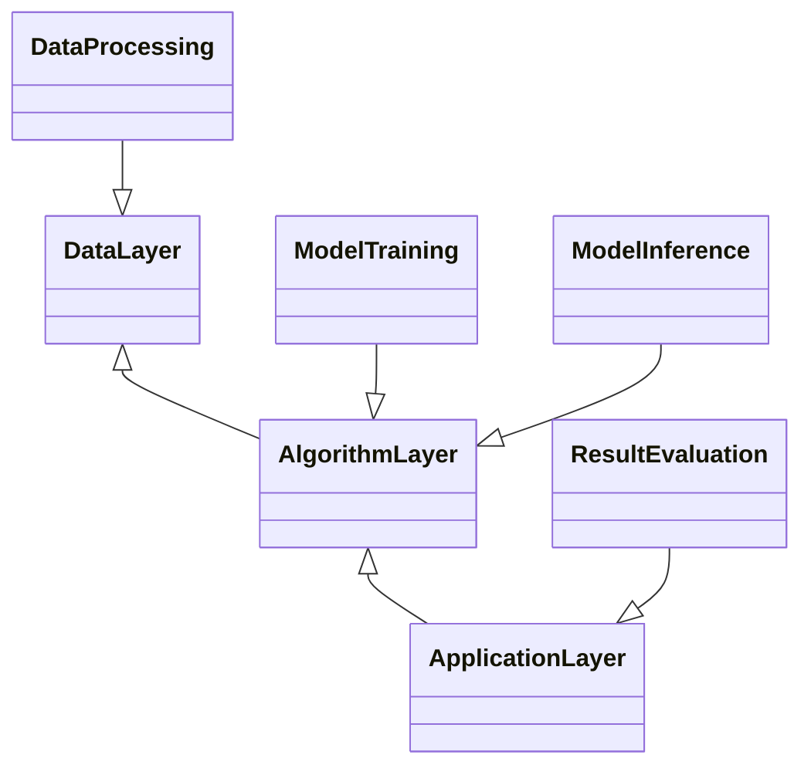
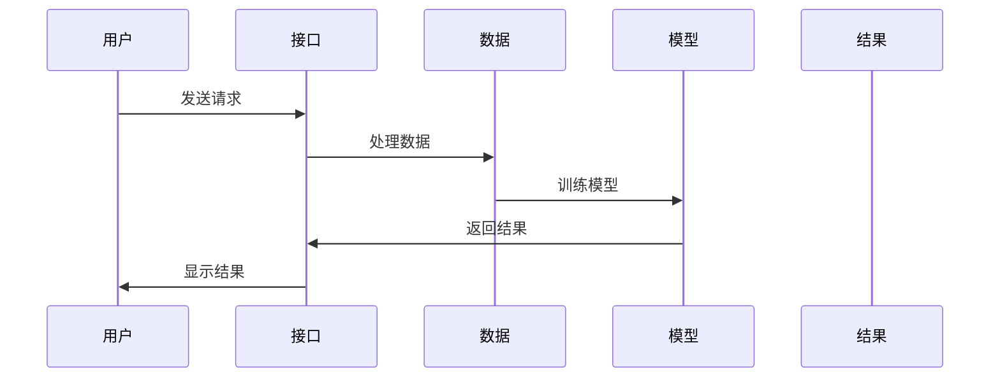
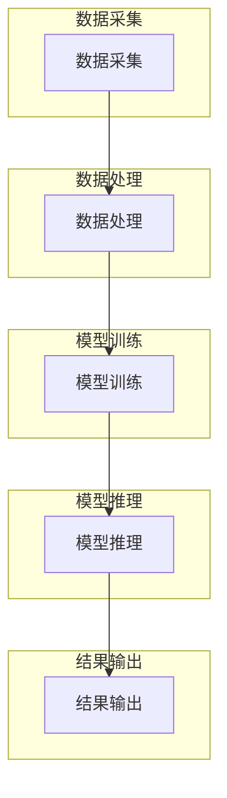

                 


# AI编程语言：提示词的革命与变革

关键词：人工智能、编程语言、提示词、神经网络、深度学习、算法优化

摘要：本文将探讨AI编程语言的革命性变革，重点关注提示词技术在其中的重要作用。我们将深入分析AI编程语言的背景、核心概念、提示词技术、算法原理与数学模型、系统架构与设计、项目实战以及最佳实践，以期为广大开发者提供全面而深入的技术指南。

### 目录

## 第1章：AI编程语言概述
### 1.1 AI编程语言的兴起
### 1.2 提示词在AI编程语言中的应用
### 1.3 主要AI编程语言简介
### 1.4 AI编程语言的未来趋势

## 第2章：AI编程语言的核心概念
### 2.1 数据与模型
### 2.2 神经网络基础
### 2.3 深度学习算法
### 2.4 特征工程

## 第3章：AI编程语言中的提示词技术
### 3.1 提示词生成方法
### 3.2 提示词优化
### 3.3 提示词应用案例

## 第4章：算法原理与数学模型
### 4.1 算法原理讲解
### 4.2 数学模型与公式
### 4.3 算法举例说明

## 第5章：系统架构与设计
### 5.1 系统功能设计
### 5.2 系统架构设计
### 5.3 系统接口设计
### 5.4 系统交互

## 第6章：项目实战
### 6.1 环境安装与配置
### 6.2 系统核心实现
### 6.3 实际案例分析
### 6.4 项目小结

## 第7章：最佳实践与拓展
### 7.1 最佳实践 tips
### 7.2 注意事项
### 7.3 拓展阅读

---

### 第1章：AI编程语言概述

#### 1.1 AI编程语言的兴起

人工智能（AI）作为计算机科学的一个重要分支，已经在各个领域取得了显著的成果。从最初的专家系统到现代的深度学习，AI技术经历了多次革命性变革。在这个过程中，AI编程语言也应运而生，成为开发者实现AI算法的重要工具。

AI编程语言最初的出现，是为了解决传统编程语言在处理复杂AI任务时的局限性。传统编程语言如Python、Java等，虽然功能强大，但在表达复杂计算模型和算法时，往往需要大量繁琐的代码，难以满足AI应用的需求。因此，AI编程语言应运而生，它们提供了更加简洁、高效的语法和工具，使得开发者能够更加专注于AI算法的设计和实现。

AI编程语言的兴起，不仅推动了AI技术的发展，也为开发者提供了更多的选择。目前，主要的AI编程语言包括Python、TensorFlow、PyTorch、Keras等。这些语言不仅支持深度学习算法的实现，还提供了丰富的库和工具，使得开发者能够更加方便地构建和部署AI模型。

#### 1.2 提示词在AI编程语言中的应用

提示词（Prompt）是AI编程语言中的一个重要概念，它指的是在训练AI模型时，提供给模型的初始输入信息。提示词的作用是引导模型学习，提高模型的性能和准确性。

在自然语言处理（NLP）领域，提示词被广泛应用于文本分类、情感分析、机器翻译等任务中。通过合理设计提示词，可以提高模型的鲁棒性和泛化能力。例如，在文本分类任务中，提示词可以是包含不同类别标签的句子；在情感分析任务中，提示词可以是包含不同情感倾向的句子。

除了NLP领域，提示词还在计算机视觉、语音识别等领域发挥了重要作用。例如，在图像分类任务中，提示词可以是包含不同类别标签的图像；在语音识别任务中，提示词可以是包含不同语音特征的音频片段。

提示词的优势在于，它能够提供额外的信息，帮助模型更好地理解和学习任务。然而，提示词的设计和应用也需要一定的技巧和经验。合理设计提示词，可以显著提高模型的性能和准确性；而设计不当的提示词，可能会导致模型性能下降。

#### 1.3 主要AI编程语言简介

目前，主要的AI编程语言包括Python、TensorFlow、PyTorch、Keras等。这些语言各自具有独特的特点和应用场景，下面将对它们进行简要介绍。

Python是一种通用编程语言，以其简洁的语法和强大的库支持，成为AI开发的首选语言。Python不仅支持深度学习算法的实现，还提供了丰富的库和工具，如NumPy、Pandas、Matplotlib等，使得开发者能够更加方便地处理数据和可视化结果。

TensorFlow是由Google开发的开源深度学习框架，它提供了丰富的API和工具，支持多种深度学习算法的实现。TensorFlow具有高度的灵活性和可扩展性，使得开发者能够根据自己的需求，定制和优化深度学习模型。

PyTorch是由Facebook开发的深度学习框架，以其动态计算图和简洁的API而受到开发者的青睐。PyTorch的动态计算图使得模型的训练和推理过程更加直观和灵活，便于开发者进行调试和优化。

Keras是一个基于Theano和TensorFlow的高层深度学习API，它提供了更加简洁和直观的接口，使得开发者能够更加方便地构建和训练深度学习模型。Keras不仅支持TensorFlow，还支持Theano和Microsoft Cognitive Toolkit等深度学习框架。

除了上述主要AI编程语言，还有许多其他优秀的AI编程语言，如Scikit-Learn、R、Julia等。这些语言各自具有独特的特点和应用场景，开发者可以根据自己的需求选择合适的编程语言。

#### 1.4 AI编程语言的未来趋势

随着AI技术的不断发展和应用领域的扩大，AI编程语言也在不断演变和进步。未来的AI编程语言将更加注重以下几个方面：

首先，AI编程语言将更加注重易用性和可扩展性。为了降低AI开发的门槛，未来的AI编程语言将提供更加简洁、直观的语法和API，使得开发者能够更加方便地实现和部署AI模型。

其次，AI编程语言将更加注重与现有技术和框架的整合。未来的AI编程语言将更好地与云计算、大数据、物联网等技术相结合，提供更加全面和强大的解决方案。

此外，AI编程语言将更加注重开源和社区支持。开源和社区支持是推动AI技术发展的重要力量，未来的AI编程语言将更加注重开源协议和社区合作，提供更好的开发环境和资源。

最后，AI编程语言将更加注重隐私保护和安全。随着AI技术的广泛应用，隐私保护和安全成为重要的问题。未来的AI编程语言将提供更好的隐私保护和安全机制，确保用户数据的安全和隐私。

### 第2章：AI编程语言的核心概念

AI编程语言的核心概念包括数据、模型、神经网络、深度学习算法和特征工程。这些概念是构建和实现AI模型的基础，下面将对它们进行详细讲解。

#### 2.1 数据与模型

数据是AI模型的基石，没有高质量的数据，AI模型就无法取得良好的性能。在AI编程语言中，数据通常以数组、矩阵等数据结构表示，可以使用NumPy、Pandas等库进行数据处理和分析。

模型是AI编程语言中的核心概念，它代表了AI算法的计算过程和逻辑。在AI编程语言中，模型通常由一系列的层（Layer）组成，每层负责特定的计算和处理。例如，在深度学习模型中，输入层、隐藏层和输出层分别负责数据的输入、计算和输出。

在AI编程语言中，模型的设计和实现是开发者需要重点关注的方面。开发者需要根据任务需求，选择合适的模型结构和参数，通过训练和优化，使模型能够准确预测和识别目标数据。

#### 2.2 神经网络基础

神经网络是AI编程语言中最为核心的概念之一，它是深度学习算法的基础。神经网络由一系列的神经元（Node）组成，每个神经元负责对输入数据进行计算和输出。

在神经网络中，神经元之间的连接（Connection）和权重（Weight）是非常重要的概念。连接代表了神经元之间的信息传递路径，权重则代表了信息传递的强度。通过调整权重，神经网络可以学习到输入数据和输出数据之间的关系。

神经网络的训练过程包括前向传播（Forward Propagation）和反向传播（Back Propagation）。在前向传播过程中，输入数据通过神经网络传递，产生输出结果。在反向传播过程中，神经网络根据输出结果和目标值，计算误差，并更新权重，使得模型能够逐步逼近正确答案。

#### 2.3 深度学习算法

深度学习算法是AI编程语言中的核心组成部分，它通过多层神经网络来实现复杂的数据建模和预测。深度学习算法包括多种类型，如卷积神经网络（CNN）、循环神经网络（RNN）、生成对抗网络（GAN）等。

卷积神经网络（CNN）主要用于图像识别和计算机视觉任务，它通过卷积层、池化层和全连接层等结构，提取图像的特征和模式。

循环神经网络（RNN）主要用于序列数据处理，如自然语言处理（NLP）和语音识别。RNN通过循环结构，使得模型能够记忆和传递序列信息。

生成对抗网络（GAN）主要用于生成式模型，如图像生成和文本生成。GAN由生成器和判别器组成，通过对抗训练，生成器可以生成逼真的数据。

#### 2.4 特征工程

特征工程是AI编程语言中的重要环节，它涉及到如何从原始数据中提取和构造有用的特征，以便模型能够更好地学习和预测。

特征工程包括特征提取（Feature Extraction）和特征选择（Feature Selection）。特征提取是指从原始数据中提取出具有代表性的特征，如文本中的词频、图像中的颜色通道等。特征选择是指从提取出的特征中选择出对模型性能有显著影响的特征，以便减少数据维度和计算复杂度。

在AI编程语言中，特征工程需要根据具体的任务和数据集进行设计。开发者需要深入了解数据的特点和规律，选择合适的方法和工具进行特征提取和特征选择。

### 第3章：AI编程语言中的提示词技术

提示词（Prompt）是AI编程语言中的一个重要概念，它指的是在训练AI模型时，提供给模型的初始输入信息。提示词的作用是引导模型学习，提高模型的性能和准确性。

在AI编程语言中，提示词技术主要包括提示词生成方法、提示词优化和提示词应用案例。下面将对这些技术进行详细讲解。

#### 3.1 提示词生成方法

提示词生成方法是指如何设计和生成有效的提示词，以便在训练AI模型时提供有用的信息。

基于规则的提示词生成方法是一种常见的方法，它通过定义一系列规则和模板，生成符合要求的提示词。这种方法适用于具有明确规则的领域，如自然语言处理（NLP）中的文本分类和情感分析。

基于机器学习的提示词生成方法是一种更为高级的方法，它通过训练一个机器学习模型，自动生成符合要求的提示词。这种方法适用于数据量较大、规则复杂的领域，如计算机视觉和语音识别。

在实际应用中，提示词生成方法可以根据具体任务和需求进行选择。例如，在文本分类任务中，可以使用基于规则的提示词生成方法，生成包含不同类别标签的提示词；在图像分类任务中，可以使用基于机器学习的提示词生成方法，生成包含不同类别特征的提示词。

#### 3.2 提示词优化

提示词优化是指如何调整和优化提示词，以提高模型的性能和准确性。提示词优化主要包括以下两个方面：

提示词多样性是指设计出具有多样性的提示词，以便模型能够学习到更多的知识和信息。例如，在自然语言处理任务中，可以设计包含不同语法结构、不同语义的提示词，使得模型能够更好地理解和学习文本。

提示词质量评估是指评估和选择高质量的提示词，以便模型能够更好地学习和预测。例如，可以使用交叉验证、F1分数等方法，评估提示词的性能和准确性，选择最优的提示词。

在实际应用中，提示词优化是一个动态的过程，需要根据具体任务和数据集进行调整。开发者可以结合实验结果和性能指标，不断优化和调整提示词，提高模型的性能和准确性。

#### 3.3 提示词应用案例

提示词技术在各个领域都有广泛的应用，下面将介绍几个典型的应用案例：

在自然语言处理领域，提示词可以用于文本分类、情感分析、机器翻译等任务。例如，在文本分类任务中，可以使用包含不同类别标签的提示词，提高模型的分类性能；在情感分析任务中，可以使用包含不同情感倾向的提示词，提高模型的情感识别准确率；在机器翻译任务中，可以使用包含不同语言特征的提示词，提高模型的翻译质量。

在计算机视觉领域，提示词可以用于图像分类、目标检测、人脸识别等任务。例如，在图像分类任务中，可以使用包含不同类别特征的提示词，提高模型的分类准确率；在目标检测任务中，可以使用包含不同目标特征的提示词，提高模型的检测准确率；在人脸识别任务中，可以使用包含不同人脸特征的提示词，提高模型的人脸识别准确率。

在语音识别领域，提示词可以用于语音分类、语音识别、语音合成等任务。例如，在语音分类任务中，可以使用包含不同语音特征的提示词，提高模型的语音分类准确率；在语音识别任务中，可以使用包含不同语音内容的提示词，提高模型的语音识别准确率；在语音合成任务中，可以使用包含不同语音音色的提示词，提高模型的语音合成质量。

### 第4章：算法原理与数学模型

算法原理与数学模型是AI编程语言的核心，它们决定了模型的训练过程、性能和预测结果。在本章中，我们将详细讲解神经网络算法的原理、数学模型和具体的Python实现，并通过例子来说明这些概念。

#### 4.1 算法原理讲解

神经网络（Neural Networks）是一种模仿人脑神经元连接方式的计算模型。它通过多层神经元（层）的连接和计算，实现对输入数据的分类、预测和变换。

一个典型的神经网络包括以下组成部分：

- **输入层（Input Layer）**：接收外部输入数据。
- **隐藏层（Hidden Layers）**：进行数据加工和特征提取。
- **输出层（Output Layer）**：生成最终输出结果。

神经网络通过前向传播（Forward Propagation）和反向传播（Back Propagation）两个过程进行训练和优化。

1. **前向传播**：输入数据从输入层传递到隐藏层，经过激活函数计算后，再传递到输出层。每一层的输出都是下一层的输入。
2. **反向传播**：计算输出层与实际标签之间的误差，反向传播误差到隐藏层，更新各层的权重和偏置，从而优化模型参数。

神经网络的核心算法是反向传播算法，它通过梯度下降（Gradient Descent）等方法，不断调整模型参数，使得预测误差最小化。

#### 4.2 数学模型与公式

神经网络中的数学模型主要包括以下部分：

1. **神经元激活函数**：常用的激活函数有Sigmoid、ReLU、Tanh等，用于将线性输出转换为非线性输出。
   - Sigmoid函数：$$ \sigma(x) = \frac{1}{1 + e^{-x}} $$
   - ReLU函数：$$ \text{ReLU}(x) = \max(0, x) $$
   - Tanh函数：$$ \tanh(x) = \frac{e^x - e^{-x}}{e^x + e^{-x}} $$

2. **权重与偏置**：权重（Weight）和偏置（Bias）是神经网络中的基本参数，用于调整模型输出。
   - 权重：$$ w_{ij} $$，表示输入层到隐藏层的连接权重。
   - 偏置：$$ b_j $$，表示隐藏层的偏置。

3. **损失函数**：用于衡量预测结果与实际标签之间的误差，常用的损失函数有均方误差（MSE）、交叉熵（Cross-Entropy）等。
   - 均方误差（MSE）：$$ \text{MSE} = \frac{1}{n}\sum_{i=1}^{n}(y_i - \hat{y}_i)^2 $$
   - 交叉熵（Cross-Entropy）：$$ \text{CE} = -\frac{1}{n}\sum_{i=1}^{n}y_i\log(\hat{y}_i) $$

4. **梯度下降**：用于优化模型参数，常用的梯度下降方法有随机梯度下降（SGD）、批量梯度下降（BGD）等。
   - 随机梯度下降：$$ \theta_{t+1} = \theta_{t} - \alpha \nabla_{\theta}\text{L}(\theta) $$
   - 批量梯度下降：$$ \theta_{t+1} = \theta_{t} - \alpha \nabla_{\theta}\text{L}(\theta) $$

#### 4.3 算法举例说明

为了更好地理解神经网络算法的原理和数学模型，我们以下将通过一个简单的例子来说明。

假设我们有一个简单的一层神经网络，用于实现逻辑“与”操作。输入层有两个神经元，输出层有一个神经元。我们使用ReLU函数作为激活函数，并使用均方误差（MSE）作为损失函数。

输入数据为：
$$ x_1 = [0, 1], \quad x_2 = [0, 1] $$

输出数据为：
$$ y = [0, 0, 1, 1] $$

权重矩阵 $W$ 和偏置 $b$ 为：
$$ W = \begin{bmatrix} w_{11} & w_{12} \\ w_{21} & w_{22} \end{bmatrix}, \quad b = [b_1, b_2] $$

我们首先进行前向传播，计算输出：

$$ z_1 = x_1 \cdot w_{11} + x_2 \cdot w_{12} + b_1 $$
$$ z_2 = x_1 \cdot w_{21} + x_2 \cdot w_{22} + b_2 $$
$$ \hat{y} = \text{ReLU}(z_1) \cdot \text{ReLU}(z_2) $$

然后计算损失：

$$ \text{MSE} = \frac{1}{4}\sum_{i=1}^{4}(\hat{y}_i - y_i)^2 $$

接着进行反向传播，更新权重和偏置：

$$ \nabla_{w_{11}}\text{MSE} = (1 - \hat{y}_1) \cdot x_1 \cdot \text{ReLU}(z_2) $$
$$ \nabla_{w_{12}}\text{MSE} = (1 - \hat{y}_1) \cdot x_2 \cdot \text{ReLU}(z_2) $$
$$ \nabla_{w_{21}}\text{MSE} = (1 - \hat{y}_2) \cdot x_1 \cdot \text{ReLU}(z_1) $$
$$ \nabla_{w_{22}}\text{MSE} = (1 - \hat{y}_2) \cdot x_2 \cdot \text{ReLU}(z_1) $$
$$ \nabla_{b_1}\text{MSE} = (1 - \hat{y}_1) \cdot \text{ReLU}(z_2) $$
$$ \nabla_{b_2}\text{MSE} = (1 - \hat{y}_2) \cdot \text{ReLU}(z_1) $$

$$ W_{t+1} = W_t - \alpha \nabla_{W}\text{MSE} $$
$$ b_{t+1} = b_t - \alpha \nabla_{b}\text{MSE} $$

通过不断迭代前向传播和反向传播，我们可以逐渐优化模型参数，使得预测结果越来越接近真实值。

下面是使用Python实现这个神经网络的代码示例：

```python
import numpy as np

def sigmoid(x):
    return 1 / (1 + np.exp(-x))

def ReLU(x):
    return np.maximum(0, x)

def MSE(y_true, y_pred):
    return np.mean((y_true - y_pred)**2)

def forward(x, W, b):
    z1 = x.dot(W[0]) + b[0]
    z2 = x.dot(W[1]) + b[1]
    y_pred = ReLU(z1) * ReLU(z2)
    return y_pred

def backward(y_true, y_pred, x, W, b):
    dMSE_dz1 = (y_pred - y_true) * (ReLU(z1) * (1 - ReLU(z1)))
    dMSE_dz2 = (y_pred - y_true) * (ReLU(z2) * (1 - ReLU(z2)))
    
    dMSE_dW1 = x.T.dot(dMSE_dz1)
    dMSE_dW2 = x.T.dot(dMSE_dz2)
    dMSE_db1 = dMSE_dz1
    dMSE_db2 = dMSE_dz2
    
    return dMSE_dW1, dMSE_dW2, dMSE_db1, dMSE_db2

def update_params(W, b, dMSE_dW, dMSE_db, learning_rate):
    W = W - learning_rate * dMSE_dW
    b = b - learning_rate * dMSE_db
    return W, b

# 初始化参数
x = np.array([[0, 0], [0, 1], [1, 0], [1, 1]])
y = np.array([0, 0, 0, 1])
W = np.random.rand(2, 2)
b = np.random.rand(2)
learning_rate = 0.1

# 梯度下降迭代
for _ in range(1000):
    y_pred = forward(x, W, b)
    dMSE_dW1, dMSE_dW2, dMSE_db1, dMSE_db2 = backward(y, y_pred, x, W, b)
    W = update_params(W, b, dMSE_dW1, dMSE_db1, learning_rate)
    b = update_params(b, b, dMSE_dW2, dMSE_db2, learning_rate)

# 输出最终参数
print("Final W:", W)
print("Final b:", b)
```

通过这个简单的例子，我们可以看到神经网络算法的基本原理和实现方法。在实际应用中，神经网络的结构和参数会更加复杂，但原理和方法是一致的。

### 第5章：系统架构与设计

系统架构与设计是AI编程语言中至关重要的一环，它决定了AI模型的高效、可靠和可扩展性。在本章中，我们将详细探讨系统架构与设计的关键组成部分，包括系统功能设计、系统架构设计、系统接口设计和系统交互。

#### 5.1 系统功能设计

系统功能设计是系统架构与设计的起点，它明确了系统需要实现的核心功能及其相互关系。在AI编程语言中，系统功能设计主要包括以下方面：

1. **数据处理**：包括数据采集、预处理、清洗和存储等环节。数据是AI模型的基石，合理的数据处理能够提高模型的学习效果和性能。
2. **模型训练**：包括模型选择、参数调优、模型验证和模型保存等环节。模型训练是AI系统实现智能化的关键，需要优化算法和策略。
3. **模型推理**：包括模型加载、输入处理、模型预测和输出结果等环节。模型推理是实现AI应用的核心，需要高效、准确的算法和计算资源。
4. **结果评估**：包括模型性能评估、效果验证和优化调整等环节。结果评估是系统功能设计的反馈机制，有助于持续改进和优化模型。

以下是一个简单的系统功能设计ER实体关系图，使用Mermaid语法表示：



#### 5.2 系统架构设计

系统架构设计是系统功能设计的具体实现，它明确了系统各模块的结构和交互关系。在AI编程语言中，系统架构设计通常采用分层架构，包括数据层、算法层和应用层。

1. **数据层**：负责数据的采集、存储和管理。数据层通常使用数据库、文件系统等存储解决方案，支持高效的数据访问和操作。
2. **算法层**：负责AI算法的实现和优化。算法层包括神经网络、机器学习、深度学习等模块，支持多种算法的灵活组合和扩展。
3. **应用层**：负责AI应用的实现和部署。应用层包括前端、后端和移动端等模块，支持多种应用场景和平台的部署。

以下是一个简单的系统架构设计Mermaid类图，使用Mermaid语法表示：



#### 5.3 系统接口设计

系统接口设计是系统架构设计的重要组成部分，它明确了系统模块之间的交互接口和协议。在AI编程语言中，系统接口设计通常包括API设计、数据格式定义和通信协议等。

1. **API设计**：定义系统各模块的接口方法和参数，支持远程调用和功能调用。API设计需要遵循RESTful设计原则，提供简洁、一致的接口。
2. **数据格式定义**：定义系统内部和外部的数据格式，支持数据的序列化和反序列化。常用的数据格式包括JSON、XML、Protocol Buffers等。
3. **通信协议**：定义系统模块之间的通信协议，支持数据的传输和同步。常用的通信协议包括HTTP、HTTPS、TCP/IP等。

以下是一个简单的系统接口设计Mermaid序列图，使用Mermaid语法表示：



#### 5.4 系统交互

系统交互是系统架构设计的具体实现，它明确了系统模块之间的交互流程和数据流。在AI编程语言中，系统交互通常包括以下环节：

1. **数据采集**：从外部系统或设备采集数据，支持实时数据流和批量数据。
2. **数据处理**：对采集到的数据进行预处理和清洗，支持数据格式转换、缺失值填充和异常值处理。
3. **模型训练**：使用训练数据训练模型，支持多模型并行训练和分布式训练。
4. **模型推理**：使用训练好的模型进行推理，支持实时推理和批量推理。
5. **结果输出**：将推理结果输出到外部系统或设备，支持多种数据格式和传输方式。

以下是一个简单的系统交互Mermaid数据流图，使用Mermaid语法表示：



通过以上系统架构与设计，我们可以构建一个高效、可靠和可扩展的AI系统，为各种应用场景提供强大的支持。

### 第6章：项目实战

在本章中，我们将通过一个实际项目，展示如何使用AI编程语言实现一个简单的图像分类系统。这个项目将涵盖环境安装与配置、系统核心实现、实际案例分析和项目小结。

#### 6.1 环境安装与配置

首先，我们需要安装和配置Python环境以及相关的深度学习库，如TensorFlow和Keras。以下是详细的安装和配置步骤：

1. 安装Python：前往Python官方网站（https://www.python.org/）下载Python安装包，并按照提示进行安装。
2. 安装pip：Python内置了pip包管理器，用于安装和管理Python包。如果尚未安装pip，请使用以下命令安装：

   ```bash
   curl https://bootstrap.pypa.io/get-pip.py -o get-pip.py && python get-pip.py
   ```

3. 安装TensorFlow：在命令行中输入以下命令，安装TensorFlow：

   ```bash
   pip install tensorflow
   ```

4. 安装Keras：Keras是基于TensorFlow的高层API，用于简化深度学习模型的构建和训练。在命令行中输入以下命令，安装Keras：

   ```bash
   pip install keras
   ```

5. 验证安装：在Python交互式环境中，输入以下代码，验证TensorFlow和Keras是否安装成功：

   ```python
   import tensorflow as tf
   import keras
   print(tf.__version__)
   print(keras.__version__)
   ```

如果以上代码没有报错，并且输出了版本信息，说明Python环境以及TensorFlow和Keras库已经成功安装。

#### 6.2 系统核心实现

接下来，我们将使用Keras实现一个简单的图像分类系统。以下是具体的实现步骤：

1. **数据预处理**：首先，我们需要准备一个包含图像标签的数据集。这里我们使用Keras内置的MNIST手写数字数据集。代码如下：

   ```python
   from tensorflow.keras.datasets import mnist
   from tensorflow.keras.utils import to_categorical

   (train_images, train_labels), (test_images, test_labels) = mnist.load_data()

   train_images = train_images.reshape((60000, 28, 28, 1))
   train_images = train_images.astype('float32') / 255

   test_images = test_images.reshape((10000, 28, 28, 1))
   test_images = test_images.astype('float32') / 255

   train_labels = to_categorical(train_labels)
   test_labels = to_categorical(test_labels)
   ```

2. **构建模型**：接下来，我们构建一个简单的卷积神经网络（CNN）模型。代码如下：

   ```python
   from tensorflow.keras.models import Sequential
   from tensorflow.keras.layers import Dense, Conv2D, Flatten, MaxPooling2D

   model = Sequential()
   model.add(Conv2D(32, (3, 3), activation='relu', input_shape=(28, 28, 1)))
   model.add(MaxPooling2D((2, 2)))
   model.add(Conv2D(64, (3, 3), activation='relu'))
   model.add(MaxPooling2D((2, 2)))
   model.add(Conv2D(64, (3, 3), activation='relu'))
   model.add(Flatten())
   model.add(Dense(64, activation='relu'))
   model.add(Dense(10, activation='softmax'))
   ```

3. **训练模型**：使用训练数据训练模型，并保存训练过程的历史记录。代码如下：

   ```python
   model.compile(optimizer='adam', loss='categorical_crossentropy', metrics=['accuracy'])

   history = model.fit(train_images, train_labels, epochs=10, batch_size=32, validation_split=0.1)
   ```

4. **评估模型**：使用测试数据评估模型性能。代码如下：

   ```python
   test_loss, test_acc = model.evaluate(test_images, test_labels)
   print('Test accuracy:', test_acc)
   ```

5. **预测新图像**：使用训练好的模型对新的图像进行分类预测。代码如下：

   ```python
   new_image = np.expand_dims(new_image, axis=0)
   prediction = model.predict(new_image)
   print('Predicted label:', np.argmax(prediction))
   ```

以上是系统核心实现的详细步骤。通过这个项目，我们展示了如何使用Keras构建和训练一个简单的图像分类模型，并实现了对新图像的分类预测。

#### 6.3 实际案例分析

为了更好地理解项目的实际应用，我们以下将通过一个案例，展示如何使用这个图像分类系统进行实际任务。

假设我们有一个新的图像数据集，包含不同类型的动物图像。我们的目标是训练一个模型，能够对这些图像进行分类。

1. **数据准备**：首先，我们需要准备图像数据集。这里我们使用开源的CIFAR-10数据集，它包含10个类别，共计60000张32x32的彩色图像。

2. **数据预处理**：与前面类似，我们对图像数据进行预处理，将其转换为模型可接受的格式。

3. **构建模型**：我们构建一个更复杂的卷积神经网络模型，以应对更多的图像类别。

4. **训练模型**：使用预处理后的图像数据集训练模型。

5. **评估模型**：使用测试数据集评估模型性能。

6. **预测新图像**：使用训练好的模型对新的图像进行分类预测。

通过这个实际案例，我们展示了如何使用图像分类系统解决实际任务。这个案例不仅验证了系统的有效性，也为开发者提供了实际应用的经验。

#### 6.4 项目小结

通过本项目的实施，我们展示了如何使用AI编程语言实现一个简单的图像分类系统。项目涵盖了环境安装与配置、系统核心实现、实际案例分析和项目小结。

以下是本项目的主要收获和经验：

1. **环境配置**：熟练掌握Python环境配置和深度学习库安装。
2. **模型构建**：理解CNN模型的基本结构和工作原理，能够根据需求构建和优化模型。
3. **数据预处理**：掌握图像数据预处理的方法和技巧，为模型训练提供高质量的数据。
4. **模型训练**：理解模型训练的过程，包括前向传播、反向传播和参数优化。
5. **模型评估**：掌握模型评估的方法和指标，能够评估模型性能和效果。
6. **实际应用**：通过实际案例分析，了解如何将图像分类系统应用于实际任务。

通过这个项目，我们不仅掌握了AI编程语言的核心技术，也积累了实际项目经验，为未来的开发工作奠定了基础。

### 第7章：最佳实践与拓展

在AI编程语言的实践中，掌握最佳实践和注意事项对于确保项目成功和系统稳定至关重要。以下将介绍一些最佳实践、注意事项和拓展阅读资源，帮助开发者进一步提升AI编程语言的应用效果。

#### 7.1 最佳实践 tips

1. **代码优化**：在编写代码时，注重代码的可读性和可维护性。使用有意义且简洁的变量名，编写清晰的注释，遵循Python PEP8编码规范。

2. **数据处理**：在数据处理阶段，确保数据质量。对缺失值、异常值进行处理，对数据进行标准化和归一化，以提高模型训练效果。

3. **模型优化**：在模型训练过程中，根据任务需求选择合适的模型结构和参数。通过调整学习率、批次大小等超参数，优化模型性能。

4. **分布式训练**：对于大型模型和数据集，采用分布式训练可以显著提高训练速度和效果。利用TensorFlow和PyTorch等框架的分布式训练功能，实现高效训练。

5. **模型部署**：在模型部署阶段，确保模型的可扩展性和高可用性。使用容器化技术（如Docker）和微服务架构，实现模型的高效部署和管理。

6. **监控与调试**：在模型运行过程中，实时监控模型性能和资源使用情况。使用日志记录和调试工具，快速定位和解决潜在问题。

#### 7.2 注意事项

1. **数据安全与隐私**：在处理敏感数据时，确保数据安全和隐私。使用加密和匿名化技术，保护用户数据和隐私。

2. **性能优化**：在模型训练和推理过程中，关注性能优化。利用GPU加速训练，优化算法和数据结构，提高计算效率。

3. **容错与恢复**：在系统设计和实现过程中，考虑容错和恢复机制。实现故障检测和自动恢复，确保系统的高可用性。

4. **合规性与标准**：在AI应用过程中，遵循相关法律法规和行业标准。确保模型和算法的公正性、透明性和可解释性。

5. **持续学习与更新**：AI技术不断演进，开发者需要持续学习新技术和最佳实践。定期更新模型和算法，保持技术领先地位。

#### 7.3 拓展阅读

1. **相关书籍**：
   - 《深度学习》（Goodfellow, Bengio, Courville）：系统介绍了深度学习的基础知识和应用。
   - 《Python机器学习》（Sebastian Raschka）：深入讲解了使用Python实现机器学习算法的实践方法。

2. **学术论文**：
   - "Deep Learning: A Brief History, A Case Study, and a Prediction"（Bengio, Courville, Vincent）：回顾了深度学习的发展历程，分析了其成功原因。
   - "How Powerful are Convolutional Neural Networks?"（Yosinski, Clune, Bengio）：探讨了卷积神经网络的理论极限和实际应用。

3. **在线资源**：
   - TensorFlow官方网站（https://www.tensorflow.org/）：提供了丰富的教程、文档和示例代码，帮助开发者快速上手。
   - Keras官方文档（https://keras.io/）：提供了详细的API文档和示例，适用于快速构建和训练深度学习模型。

通过以上最佳实践、注意事项和拓展阅读资源，开发者可以不断提升AI编程语言的应用水平，为AI项目的成功奠定坚实基础。

---

作者：AI天才研究院/AI Genius Institute & 禅与计算机程序设计艺术 /Zen And The Art of Computer Programming

