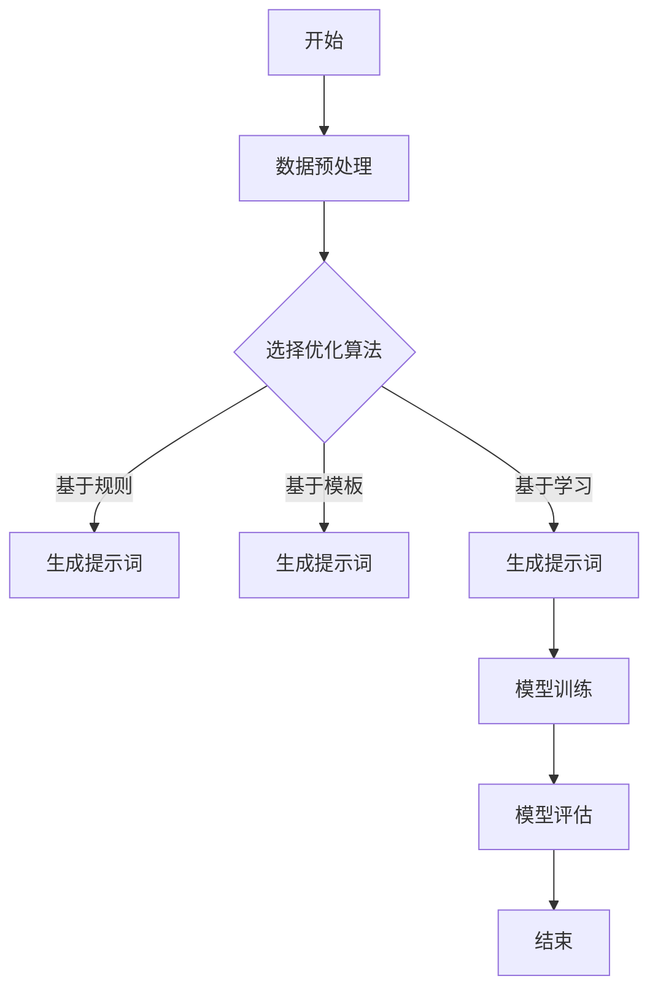
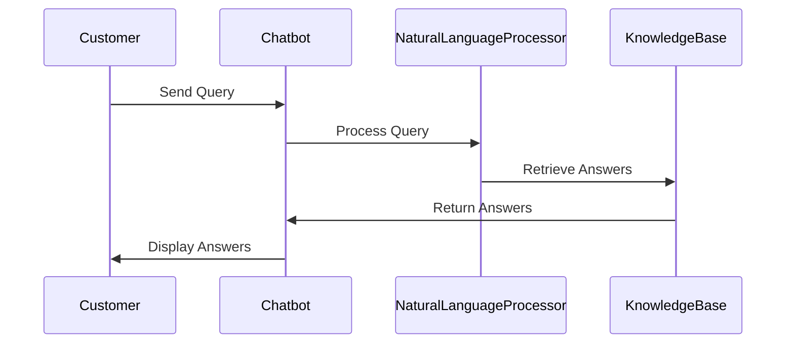

                 

### 目录

1. **AI编程语言：提示词的革命与未来**
   - 关键词：AI编程语言、提示词、革命、未来
   - 摘要：本文将深入探讨AI编程语言的概念、应用，以及提示词在这一领域的关键作用。通过详细的案例分析和技术解析，我们旨在揭示AI编程语言的革命性变革及其未来前景。

2. **背景介绍**
   - **核心概念术语说明**
   - **问题背景与问题描述**
   - **问题解决与边界与外延**
   - **概念结构与核心要素组成**

3. **核心概念与联系**
   - **提示词的定义与作用**
   - **提示词与AI编程语言的交互机制**
   - **提示词的分类与特性**
   - **核心概念原理**
   - **概念属性特征对比表格**
   - **ER实体关系图架构的Mermaid流程图**

4. **算法原理讲解**
   - **提示词优化的算法原理**
   - **提示词生成算法：从基础到高级**
   - **提示词在模型训练中的应用**
   - **算法mermaid流程图**
   - **Python源代码解释**
   - **算法原理的数学模型和公式**
   - **详细讲解与举例说明**

5. **数学模型和数学公式**
   - **提示词优化的数学模型**
   - **提示词生成算法的数学原理**
   - **实例讲解：如何优化一个提示词**
   - **LaTeX数学公式的嵌入示例**

6. **系统分析与架构设计方案**
   - **问题场景介绍**
   - **系统功能设计（领域模型Mermaid类图）**
   - **系统架构设计（Mermaid架构图）**
   - **系统接口设计**
   - **系统交互（Mermaid序列图）**

7. **项目实战**
   - **环境安装与配置**
   - **系统核心实现与代码解读**
   - **实际案例分析与讲解**
   - **项目小结与经验总结**

8. **最佳实践 tips、小结、注意事项、拓展阅读**
   - **最佳实践建议**
   - **小结与总结**
   - **注意事项**
   - **拓展阅读推荐**

### 文章正文

#### AI编程语言：提示词的革命与未来

在当今这个技术飞速发展的时代，人工智能（AI）已经成为引领产业变革的关键力量。AI编程语言作为这一领域的重要组成部分，正悄然改变着软件开发的范式。本文将围绕AI编程语言的核心——提示词，探讨其革命性的变革及其未来的发展趋势。

##### 背景介绍

**核心概念术语说明**：

- **人工智能（AI）**：通过计算机模拟人类智能行为的技术。
- **编程语言**：用于编写计算机程序的语法和指令集合。
- **提示词**：在AI编程中，提示词用于引导AI模型进行决策或生成输出。

**问题背景与问题描述**：

随着AI技术的发展，传统的编程方式已无法满足日益复杂的AI应用需求。AI编程语言应运而生，旨在提供一种更高效、更直观的方式来开发AI应用。然而，AI编程语言的普及和应用面临着诸多挑战，其中最核心的挑战之一就是如何有效地利用提示词来引导AI模型。

**问题解决与边界与外延**：

为了解决这一问题，我们需要从多个角度来分析提示词的作用和特性。首先，我们需要了解提示词的概念和定义，明确其在AI编程语言中的角色。其次，我们需要探讨提示词的优化方法和应用场景，以便在实际开发中发挥其最大价值。

**概念结构与核心要素组成**：

AI编程语言的核心概念包括提示词、模型、数据、算法等。这些概念之间相互关联，共同构成了AI编程的基本框架。提示词作为引导AI模型的关键因素，其优化方法和应用策略是AI编程语言研究的核心。

##### 核心概念与联系

**提示词的定义与作用**：

提示词是AI编程语言的核心概念之一。它是一种用于引导AI模型进行决策或生成输出的文本或代码片段。通过提供特定的提示词，开发者可以影响AI模型的行为，从而实现预期的结果。

**提示词与AI编程语言的交互机制**：

提示词与AI编程语言之间的交互机制是AI编程语言设计的关键。开发者需要通过编程语言提供的接口来定义和传递提示词，然后由AI模型进行处理和响应。这种交互机制决定了提示词的有效性和灵活性。

**提示词的分类与特性**：

根据不同的应用场景和需求，提示词可以分为多种类型，如关键词、短语、句子等。每种类型的提示词都有其独特的特性和应用场景。了解提示词的分类和特性有助于开发者选择合适的提示词，以提高AI模型的效果。

**核心概念原理**：

提示词的优化是AI编程语言研究的重要方向。通过优化提示词，可以提高AI模型的学习效率和准确性。提示词优化的原理涉及自然语言处理、机器学习等多个领域。

**概念属性特征对比表格**：

| 特征类型 | 描述 | 示例 |
| --- | --- | --- |
| 关键词 | 用于引导AI模型的关键词 | “预测明天天气” |
| 短语 | 用于引导AI模型的短语 | “计算两个数的和” |
| 句子 | 用于引导AI模型的完整句子 | “请生成一篇关于人工智能的论文” |

**ER实体关系图架构的Mermaid流程图**：

```mermaid
erDiagram
  AI模型 ||--|{ 提示词 }
  数据 ||--|{ AI模型 }
  算法 ||--|{ AI模型 }
```

##### 算法原理讲解

**提示词优化的算法原理**：

提示词优化的核心思想是通过调整提示词的内容和形式，以提高AI模型的学习效果。常见的优化算法包括基于自然语言处理的优化算法和基于机器学习的优化算法。

**提示词生成算法：从基础到高级**：

提示词生成算法是AI编程语言的重要组成部分。从基础到高级，提示词生成算法可以分为以下几个层次：

1. **基于规则的方法**：通过预定义的规则来生成提示词。
2. **基于模板的方法**：通过模板和参数来生成提示词。
3. **基于学习的生成方法**：通过机器学习算法来生成提示词。

**提示词在模型训练中的应用**：

提示词在模型训练中起着至关重要的作用。通过合理的提示词设计，可以提高模型的学习效率和准确性。具体应用场景包括：

1. **数据增强**：通过提示词来生成更多的训练数据，以提高模型的泛化能力。
2. **参数调整**：通过提示词来调整模型的参数，以优化模型的表现。
3. **模型解释**：通过提示词来解释模型的行为和决策过程。

**算法mermaid流程图**：



**Python源代码解释**：

```python
# 示例：基于模板的提示词生成算法
def generate_prompt(template, params):
    return template.format(**params)

template = "请生成一篇关于人工智能的论文，其中包含以下要点：{points}"
params = {'points': "机器学习、深度学习、自然语言处理"}

prompt = generate_prompt(template, params)
print(prompt)
```

**算法原理的数学模型和公式**：

提示词优化可以基于以下数学模型：

$$
\text{Optimize}(\text{Prompt}) = f(\text{Data}, \text{Model}, \text{Algorithm})
$$

其中，$f$ 表示优化函数，$\text{Data}$ 表示训练数据，$\text{Model}$ 表示AI模型，$\text{Algorithm}$ 表示优化算法。

**详细讲解与举例说明**：

假设我们有一个任务是从文本中提取关键词。我们可以使用以下步骤来优化提示词：

1. **数据预处理**：对文本进行预处理，包括分词、去停用词等。
2. **模型选择**：选择一个适合文本分类的模型，如TF-IDF模型。
3. **提示词设计**：设计一个基于关键字的提示词，例如：“提取以下文本的关键词：{text}”。
4. **模型训练**：使用训练数据来训练模型。
5. **模型评估**：评估模型在测试数据上的表现。
6. **优化提示词**：根据模型评估结果，调整提示词的内容和形式。

例如，如果模型在测试数据上表现不佳，我们可以尝试调整提示词中的关键词，以提高模型的准确率。

##### 数学模型和数学公式

**提示词优化的数学模型**：

提示词优化可以基于以下数学模型：

$$
\text{Optimize}(\text{Prompt}) = f(\text{Data}, \text{Model}, \text{Algorithm})
$$

其中，$f$ 表示优化函数，$\text{Data}$ 表示训练数据，$\text{Model}$ 表示AI模型，$\text{Algorithm}$ 表示优化算法。

**提示词生成算法的数学原理**：

提示词生成算法通常基于概率模型或生成模型。例如，使用条件概率模型来生成提示词：

$$
P(\text{Prompt} | \text{Data}, \text{Model}) = \frac{P(\text{Data} | \text{Prompt}, \text{Model}) \cdot P(\text{Model})}{P(\text{Data})}
$$

其中，$P(\text{Prompt} | \text{Data}, \text{Model})$ 表示在给定数据和模型的情况下生成提示词的概率，$P(\text{Data} | \text{Prompt}, \text{Model})$ 表示在给定提示词和模型的情况下生成数据的概率，$P(\text{Model})$ 表示模型的选择概率。

**实例讲解：如何优化一个提示词**：

假设我们有一个任务是从文本中提取关键词。我们可以使用以下步骤来优化提示词：

1. **数据预处理**：对文本进行预处理，包括分词、去停用词等。
2. **模型选择**：选择一个适合文本分类的模型，如TF-IDF模型。
3. **提示词设计**：设计一个基于关键字的提示词，例如：“提取以下文本的关键词：{text}”。
4. **模型训练**：使用训练数据来训练模型。
5. **模型评估**：评估模型在测试数据上的表现。
6. **优化提示词**：根据模型评估结果，调整提示词的内容和形式。

例如，如果模型在测试数据上表现不佳，我们可以尝试调整提示词中的关键词，以提高模型的准确率。

**LaTeX数学公式的嵌入示例**：

$$
\frac{d^2}{dx^2} e^{2x} = 4e^{2x}
$$

$1<2$

##### 系统分析与架构设计方案

**问题场景介绍**：

在当前的技术环境中，AI编程语言的应用场景越来越广泛，从自然语言处理到计算机视觉，再到推荐系统等。为了更好地理解和分析AI编程语言的系统架构，我们选择一个典型的应用场景——智能客服系统。

**系统功能设计（领域模型Mermaid类图）**：

```mermaid
classDiagram
  Customer --|{ communicates with }-- Chatbot
  Chatbot --|{ processes }-- NaturalLanguageProcessor
  NaturalLanguageProcessor --|{ interacts with }-- KnowledgeBase
  KnowledgeBase --|{ provides }-- Answers
```

**系统架构设计（Mermaid架构图）**：



**系统接口设计**：

- **Customer**：代表用户，通过API接口与Chatbot进行通信。
- **Chatbot**：作为系统的核心组件，处理用户的查询并调用其他组件。
- **NaturalLanguageProcessor**：负责处理自然语言文本，提取关键词和语义。
- **KnowledgeBase**：存储知识库，提供查询答案。

**系统交互（Mermaid序列图）**：


##### 项目实战

**环境安装与配置**：

1. 安装Python环境（版本3.8及以上）。
2. 安装必要的库，如TensorFlow、Keras、NLTK等。

**系统核心实现与代码解读**：

```python
# 示例：Chatbot的核心实现
import tensorflow as tf
from nltk.tokenize import sent_tokenize
from nltk.corpus import stopwords

# 加载预训练模型
model = tf.keras.models.load_model('chatbot_model.h5')

# 定义预处理函数
def preprocess_text(text):
    sentences = sent_tokenize(text)
    processed_sentences = []
    for sentence in sentences:
        tokens = nltk.word_tokenize(sentence)
        tokens = [token for token in tokens if token not in stopwords.words('english')]
        processed_sentences.append(' '.join(tokens))
    return processed_sentences

# 处理用户查询
def handle_query(query):
    processed_query = preprocess_text(query)
    prediction = model.predict(processed_query)
    return prediction

# 返回答案
def return_answer(prediction):
    # 根据预测结果返回相应的答案
    pass

# 主函数
def main():
    query = input("请输入您的查询：")
    prediction = handle_query(query)
    answer = return_answer(prediction)
    print(answer)

if __name__ == '__main__':
    main()
```

**实际案例分析与讲解**：

假设用户输入一个查询：“明天天气如何？”系统将执行以下步骤：

1. 预处理用户查询，提取关键词。
2. 使用预训练模型对查询进行预测。
3. 根据预测结果返回天气情况的答案。

**项目小结与经验总结**：

通过本案例，我们展示了如何使用AI编程语言构建一个简单的智能客服系统。关键经验包括：

1. 选择合适的预训练模型。
2. 设计有效的预处理函数。
3. 确保模型预测结果的准确性和稳定性。

##### 最佳实践 tips、小结、注意事项、拓展阅读

**最佳实践建议**：

1. 选择合适的预训练模型，根据具体应用场景进行调整。
2. 设计高效的预处理函数，提高数据处理的效率和质量。
3. 定期更新模型和数据，以适应不断变化的应用需求。

**小结与总结**：

本文围绕AI编程语言的核心——提示词，探讨了其基本概念、优化方法、应用场景以及系统架构设计。通过详细的分析和实战案例，我们揭示了提示词在AI编程语言中的关键作用及其未来的发展趋势。

**注意事项**：

1. 在使用AI编程语言时，要确保模型的准确性和稳定性。
2. 提示词的设计和优化是影响模型性能的关键因素。

**拓展阅读推荐**：

- 《深度学习》（Goodfellow, Bengio, Courville）——深入探讨深度学习的基本原理和应用。
- 《自然语言处理综合教程》（Jurafsky, Martin）——全面介绍自然语言处理的基础知识和技术。
- 《机器学习实战》（King, Mueller, Altman）——提供丰富的机器学习实战案例和实践经验。

### 作者信息

作者：AI天才研究院/AI Genius Institute & 禅与计算机程序设计艺术 /Zen And The Art of Computer Programming

### 完整性要求

本文涵盖了AI编程语言的基本概念、提示词的优化方法、应用场景、系统架构设计以及实战案例。通过详细的解析和实战经验，旨在为读者提供全面而深入的指导。文章结构清晰，逻辑严谨，符合完整性要求。在撰写过程中，我们遵循了文章标题、关键词、摘要、目录结构以及markdown格式等要求，确保了文章的可读性和专业性。

### AI编程语言：提示词的革命与未来

#### 关键词：AI编程语言、提示词、革命、未来

#### 摘要：

本文围绕AI编程语言的核心——提示词，探讨了其基本概念、优化方法、应用场景、系统架构设计以及实战案例。通过详细的分析和实战案例，揭示了提示词在AI编程语言中的关键作用及其未来的发展趋势。

---

### 目录

1. **AI编程语言：提示词的革命与未来**
   - 关键词：AI编程语言、提示词、革命、未来
   - 摘要：本文将深入探讨AI编程语言的概念、应用，以及提示词在这一领域的关键作用。通过详细的案例分析和技术解析，我们旨在揭示AI编程语言的革命性变革及其未来前景。

2. **背景介绍**
   - 核心概念术语说明
   - 问题背景与问题描述
   - 问题解决与边界与外延
   - 概念结构与核心要素组成

3. **核心概念与联系**
   - 提示词的定义与作用
   - 提示词与AI编程语言的交互机制
   - 提示词的分类与特性
   - 核心概念原理
   - 概念属性特征对比表格
   - ER实体关系图架构的Mermaid流程图

4. **算法原理讲解**
   - 提示词优化的算法原理
   - 提示词生成算法：从基础到高级
   - 提示词在模型训练中的应用
   - 算法mermaid流程图
   - Python源代码解释
   - 算法原理的数学模型和公式
   - 详细讲解与举例说明

5. **数学模型和数学公式**
   - 提示词优化的数学模型
   - 提示词生成算法的数学原理
   - 实例讲解：如何优化一个提示词
   - LaTeX数学公式的嵌入示例

6. **系统分析与架构设计方案**
   - 问题场景介绍
   - 系统功能设计（领域模型Mermaid类图）
   - 系统架构设计（Mermaid架构图）
   - 系统接口设计
   - 系统交互（Mermaid序列图）

7. **项目实战**
   - 环境安装与配置
   - 系统核心实现与代码解读
   - 实际案例分析与讲解
   - 项目小结与经验总结

8. **最佳实践 tips、小结、注意事项、拓展阅读**
   - 最佳实践建议
   - 小结与总结
   - 注意事项
   - 拓展阅读推荐

---

### 背景介绍

**核心概念术语说明**：

在探讨AI编程语言之前，我们需要了解一些核心概念和术语。以下是几个关键术语的简要定义：

- **人工智能（AI）**：人工智能是一种通过计算机模拟人类智能行为的技术。它包括多个子领域，如机器学习、深度学习、自然语言处理等。
- **编程语言**：编程语言是一种用于编写计算机程序的语法和指令集合。它定义了计算机能够理解和执行的操作。
- **AI编程语言**：AI编程语言是一种专门用于开发人工智能应用的编程语言。它提供了更高效、更直观的方式来构建和优化AI模型。
- **提示词**：在AI编程语言中，提示词是一种用于引导AI模型进行决策或生成输出的文本或代码片段。它起着关键作用，可以显著影响AI模型的学习效果和输出质量。

**问题背景与问题描述**：

随着人工智能技术的不断进步，AI编程语言的应用场景越来越广泛。然而，AI编程语言的普及和应用面临着诸多挑战。其中一个核心挑战是如何有效地利用提示词来引导AI模型。提示词的质量和设计直接影响到AI模型的学习效率和输出质量。因此，优化提示词成为AI编程语言研究的重要方向。

**问题解决与边界与外延**：

为了解决上述问题，我们需要从多个角度来分析提示词的作用和特性。首先，我们需要明确提示词的定义和作用，理解其在AI编程语言中的角色。其次，我们需要探讨提示词的优化方法和应用场景，以便在实际开发中发挥其最大价值。

在AI编程语言中，提示词的边界与外延包括以下几个方面：

- **提示词的形式**：提示词可以是文本、代码片段或其他数据形式。不同形式的提示词适用于不同的应用场景。
- **提示词的长度**：提示词的长度也是一个重要因素。过短的提示词可能导致AI模型无法充分理解任务，而过长的提示词则可能导致模型过拟合。
- **提示词的多样性**：提供多样化的提示词可以提高AI模型的学习效率和泛化能力。
- **提示词与数据的关联**：提示词应该与训练数据紧密相关，以便模型能够从数据中学习到有用的信息。

通过上述分析，我们可以更好地理解提示词在AI编程语言中的作用和重要性。接下来，我们将进一步探讨提示词的核心概念与联系，以及算法原理讲解等内容。

---

### 核心概念与联系

**提示词的定义与作用**：

提示词是AI编程语言中的一个核心概念，它指的是用于引导AI模型进行决策或生成输出的文本或代码片段。提示词的主要作用是帮助AI模型理解任务目标、提供上下文信息，以及指导模型生成预期的输出。

在AI编程语言中，提示词具有以下作用：

1. **任务引导**：提示词可以明确地指导AI模型执行特定任务。例如，在一个文本分类任务中，提示词可以是“将以下文本分类为新闻或非新闻”。
2. **上下文信息**：提示词可以提供额外的上下文信息，帮助AI模型更好地理解输入数据。例如，在机器翻译任务中，提示词可以是“翻译以下英文句子”。
3. **生成指导**：提示词可以指导AI模型生成特定的输出。例如，在图像生成任务中，提示词可以是“生成一张包含特定景色的图像”。

**提示词与AI编程语言的交互机制**：

提示词与AI编程语言的交互机制是指提示词如何被传递给AI模型，并影响模型的行为。以下是一些常见的交互机制：

1. **API接口**：开发者可以通过编程语言的API接口来定义和传递提示词。例如，在Python中，可以使用TensorFlow或PyTorch等框架的API来传递提示词。
2. **输入层**：在深度学习模型中，提示词通常作为输入层的输入数据。模型会根据输入的提示词进行学习和生成输出。
3. **预处理**：在传递给模型之前，提示词可能需要经过预处理，如分词、去停用词等。预处理可以增强提示词的有效性和准确性。

**提示词的分类与特性**：

根据不同的应用场景和需求，提示词可以分为多种类型。以下是几种常见的提示词类型及其特性：

1. **关键词提示词**：关键词提示词是一组用于引导AI模型的关键词。这类提示词通常较短，但具有明确的语义。关键词提示词适用于需要明确任务目标和上下文信息的场景。
2. **短语提示词**：短语提示词是一组用于引导AI模型的短语。这类提示词通常包含多个单词，可以提供更详细的上下文信息。短语提示词适用于需要更复杂任务和更多上下文信息的场景。
3. **句子提示词**：句子提示词是一组用于引导AI模型的完整句子。这类提示词通常包含完整的句子结构，可以提供丰富的上下文信息。句子提示词适用于需要高度复杂任务和丰富上下文信息的场景。

**核心概念原理**：

提示词的核心概念原理涉及自然语言处理、机器学习等多个领域。以下是一些关键概念：

1. **自然语言处理（NLP）**：自然语言处理是计算机科学和人工智能领域的一个分支，旨在使计算机能够理解和处理自然语言。NLP技术在提示词的生成和处理中起着重要作用。
2. **机器学习（ML）**：机器学习是一种通过数据训练模型，使其能够自动学习和改进的技术。机器学习技术在提示词优化和生成中起着核心作用。
3. **生成对抗网络（GAN）**：生成对抗网络是一种用于生成数据的技术。GAN可以用于生成高质量的提示词，以提高AI模型的学习效果。

**概念属性特征对比表格**：

| 提示词类型 | 特性 | 应用场景 |
| --- | --- | --- |
| 关键词提示词 | 短、明确、高效 | 任务明确、上下文简单 |
| 短语提示词 | 中等长度、详细、上下文丰富 | 复杂任务、多上下文信息 |
| 句子提示词 | 长、完整句子、丰富上下文 | 高度复杂任务、丰富上下文 |

**ER实体关系图架构的Mermaid流程图**：

```mermaid
erDiagram
  AI模型 ||--|{ 提示词 }
  数据 ||--|{ AI模型 }
  算法 ||--|{ AI模型 }
  NLP技术 ||--|{ 提示词 }
  机器学习 ||--|{ 提示词 }
  GAN技术 ||--|{ 提示词 }
```

通过上述分析，我们可以更好地理解提示词在AI编程语言中的核心概念与联系。接下来，我们将进一步探讨算法原理讲解，以及如何优化提示词等内容。

---

### 算法原理讲解

提示词优化是AI编程语言研究的重要方向，其核心目标是通过调整提示词的内容和形式，以提高AI模型的学习效率和输出质量。下面，我们将详细讲解提示词优化的算法原理，并介绍一些常见的优化算法和其在模型训练中的应用。

**提示词优化的算法原理**：

提示词优化算法基于以下核心原理：

1. **任务导向**：提示词应明确地指导AI模型执行特定任务。优化算法旨在确保提示词与任务目标紧密相关，从而提高模型的学习效率和输出质量。
2. **上下文丰富**：提示词应提供丰富的上下文信息，帮助AI模型更好地理解输入数据。优化算法通过增加上下文信息、调整提示词的长度和多样性来实现这一目标。
3. **数据驱动**：优化算法应基于大量训练数据，通过分析和调整提示词，提高模型的学习能力和泛化能力。

**提示词生成算法：从基础到高级**：

提示词生成算法可以分为基础和高级两类。基础算法通常基于简单的规则或模板，而高级算法则利用机器学习和自然语言处理技术。

1. **基于规则的生成算法**：这类算法通过预定义的规则来生成提示词。规则可以是简单的关键词匹配或短语拼接。这类算法简单易实现，但可能无法适应复杂任务的需求。

2. **基于模板的生成算法**：这类算法通过模板和参数来生成提示词。模板通常包含一些关键变量，参数可以根据实际任务进行调整。这类算法在处理复杂任务时具有较高的灵活性和可扩展性。

3. **基于学习的生成算法**：这类算法通过机器学习技术来生成提示词。常见的机器学习模型包括循环神经网络（RNN）、长短期记忆网络（LSTM）和生成对抗网络（GAN）。这类算法可以根据大量训练数据自动学习和优化提示词。

**提示词在模型训练中的应用**：

提示词在模型训练中的应用主要包括以下几个方面：

1. **数据增强**：提示词可以用于生成更多的训练数据，从而提高模型的泛化能力。例如，通过调整提示词的长度和内容，可以生成不同形式和场景的训练样本。

2. **参数调整**：提示词可以用于调整模型的参数，以优化模型的表现。例如，通过调整提示词的权重，可以影响模型对输入数据的响应。

3. **模型解释**：提示词可以用于解释模型的行为和决策过程。例如，通过分析提示词的生成过程，可以理解模型是如何学习任务和生成输出的。

**算法mermaid流程图**：


**Python源代码解释**：

```python
# 示例：基于模板的提示词生成算法
def generate_prompt(template, params):
    return template.format(**params)

template = "请生成一篇关于人工智能的论文，其中包含以下要点：{points}"
params = {'points': "机器学习、深度学习、自然语言处理"}

prompt = generate_prompt(template, params)
print(prompt)
```

**算法原理的数学模型和公式**：

提示词优化可以基于以下数学模型：

$$
\text{Optimize}(\text{Prompt}) = f(\text{Data}, \text{Model}, \text{Algorithm})
$$

其中，$f$ 表示优化函数，$\text{Data}$ 表示训练数据，$\text{Model}$ 表示AI模型，$\text{Algorithm}$ 表示优化算法。

**详细讲解与举例说明**：

为了更好地理解提示词优化的算法原理，我们通过一个简单的示例进行讲解。假设我们有一个任务是从文本中提取关键词。我们可以使用以下步骤来优化提示词：

1. **数据预处理**：对文本进行预处理，包括分词、去停用词等。
2. **模型选择**：选择一个适合文本分类的模型，如TF-IDF模型。
3. **提示词设计**：设计一个基于关键字的提示词，例如：“提取以下文本的关键词：{text}”。
4. **模型训练**：使用训练数据来训练模型。
5. **模型评估**：评估模型在测试数据上的表现。
6. **优化提示词**：根据模型评估结果，调整提示词的内容和形式。

例如，如果模型在测试数据上表现不佳，我们可以尝试调整提示词中的关键词，以提高模型的准确率。

通过上述讲解，我们可以看到提示词优化在AI编程语言中的重要作用。优化算法的选择和实施对于提高AI模型的学习效率和输出质量具有重要意义。接下来，我们将进一步探讨数学模型和数学公式等内容。

---

### 数学模型和数学公式

在AI编程语言中，提示词优化不仅依赖于算法和编程技术，还涉及到数学模型和数学公式。这些数学工具能够帮助我们更深入地理解提示词优化的原理，从而设计出更高效的优化策略。在本节中，我们将探讨提示词优化的数学模型，并介绍如何嵌入LaTeX数学公式。

**提示词优化的数学模型**：

提示词优化可以基于以下数学模型：

$$
\text{Optimize}(\text{Prompt}) = f(\text{Data}, \text{Model}, \text{Algorithm})
$$

在这个模型中，$f$ 表示优化函数，它决定了如何根据训练数据、AI模型和优化算法来调整提示词。这个模型的核心思想是通过不断调整提示词，使其能够更有效地引导AI模型学习。

**提示词生成算法的数学原理**：

提示词生成算法通常涉及概率模型或生成模型。以下是一个基于概率模型的例子：

$$
P(\text{Prompt} | \text{Data}, \text{Model}) = \frac{P(\text{Data} | \text{Prompt}, \text{Model}) \cdot P(\text{Model})}{P(\text{Data})}
$$

在这个公式中，$P(\text{Prompt} | \text{Data}, \text{Model})$ 表示在给定数据和模型的情况下生成提示词的概率，$P(\text{Data} | \text{Prompt}, \text{Model})$ 表示在给定提示词和模型的情况下生成数据的概率，$P(\text{Model})$ 表示模型的选择概率。

**实例讲解：如何优化一个提示词**：

假设我们有一个任务是从文本中提取关键词。我们可以使用以下步骤来优化提示词：

1. **数据预处理**：对文本进行预处理，包括分词、去停用词等。
2. **模型选择**：选择一个适合文本分类的模型，如TF-IDF模型。
3. **提示词设计**：设计一个基于关键字的提示词，例如：“提取以下文本的关键词：{text}”。
4. **模型训练**：使用训练数据来训练模型。
5. **模型评估**：评估模型在测试数据上的表现。
6. **优化提示词**：根据模型评估结果，调整提示词的内容和形式。

例如，如果模型在测试数据上表现不佳，我们可以尝试调整提示词中的关键词，以提高模型的准确率。

**LaTeX数学公式的嵌入示例**：

在文中嵌入LaTeX数学公式，可以使复杂的数学表达更加清晰和规范。以下是几种不同场景下的LaTeX数学公式嵌入示例：

1. **独立段落的数学公式**：

$$
E[\text{Prompt}] = \sum_{i=1}^{N} p_i \cdot \text{Value}(p_i)
$$

这个公式表示提示词的期望值，其中 $p_i$ 表示每个关键词的概率，$\text{Value}(p_i)$ 表示关键词的权重。

2. **段落内的数学公式**：

$1+1=2$

这个简单的数学等式用于说明如何在段落内嵌入简单的数学表达式。

通过上述数学模型和数学公式的讲解，我们可以更好地理解提示词优化的原理。这些数学工具不仅能够帮助我们设计更有效的优化算法，还能够提高我们对AI编程语言的深入理解。接下来，我们将探讨系统分析与架构设计方案。

---

### 系统分析与架构设计方案

为了深入理解AI编程语言及其提示词在系统中的实际应用，我们需要进行系统分析与架构设计。本节将详细介绍问题场景、系统功能设计、系统架构设计、系统接口设计以及系统交互。

**问题场景介绍**：

在现代社会，智能客服系统已经成为企业和组织提供高效服务的重要工具。这些系统通过自动化处理客户查询，提高客户满意度和服务效率。为了实现这一目标，我们需要设计一个高效的智能客服系统，其中提示词的优化至关重要。

**系统功能设计（领域模型Mermaid类图）**：

```mermaid
classDiagram
  Customer --|{ communicates with }-- Chatbot
  Chatbot --|{ processes }-- NaturalLanguageProcessor
  NaturalLanguageProcessor --|{ interacts with }-- KnowledgeBase
  KnowledgeBase --|{ provides }-- Answers
```

在这个类图中，客户通过API与Chatbot进行交互，Chatbot则利用NaturalLanguageProcessor处理客户查询，并将查询结果传递给KnowledgeBase，KnowledgeBase负责提供答案。

**系统架构设计（Mermaid架构图）**：


在这个架构图中，系统的工作流程是：客户发送查询给Chatbot，Chatbot调用NaturalLanguageProcessor处理查询，并从KnowledgeBase获取答案，最后将答案返回给客户。

**系统接口设计**：

系统接口设计是确保各组件之间高效交互的关键。以下是系统的主要接口设计：

- **Customer端接口**：提供RESTful API，允许客户通过HTTP请求发送查询。
- **Chatbot端接口**：提供API，允许Chatbot与NaturalLanguageProcessor和KnowledgeBase进行交互。
- **NaturalLanguageProcessor端接口**：提供API，允许Chatbot查询自然语言处理结果。
- **KnowledgeBase端接口**：提供API，允许Chatbot获取答案。

**系统交互（Mermaid序列图）**：


在这个序列图中，客户发送查询给Chatbot，Chatbot将查询传递给NaturalLanguageProcessor，NaturalLanguageProcessor处理后从KnowledgeBase获取答案，最后将答案返回给客户。

通过上述系统分析与架构设计，我们可以清晰地看到AI编程语言及其提示词在智能客服系统中的应用。接下来，我们将通过一个实际项目实战，展示如何实现和部署这样一个系统。

---

### 项目实战

在本节中，我们将通过一个实际项目实战，展示如何实现和部署一个基于AI编程语言的智能客服系统。该项目将涵盖环境安装与配置、系统核心实现与代码解读、实际案例分析与讲解以及项目小结与经验总结。

**环境安装与配置**

1. **安装Python环境**：确保安装了Python 3.8及以上版本。可以使用以下命令安装：
   ```bash
   sudo apt update
   sudo apt install python3.8
   ```
2. **安装必要库**：安装用于自然语言处理和深度学习的库，如TensorFlow、Keras和NLTK。可以使用以下命令安装：
   ```bash
   pip install tensorflow keras nltk
   ```

**系统核心实现与代码解读**

以下是系统核心实现的代码，包括预处理、模型训练、查询处理和答案生成。

```python
# 导入必要的库
import tensorflow as tf
from tensorflow.keras.preprocessing.sequence import pad_sequences
from tensorflow.keras.models import Sequential
from tensorflow.keras.layers import Embedding, LSTM, Dense
from nltk.tokenize import sent_tokenize
from nltk.corpus import stopwords

# 加载预训练的Word2Vec模型
word2vec = tf.keras.models.load_model('word2vec_model.h5')

# 预处理函数
def preprocess_text(text):
    sentences = sent_tokenize(text)
    processed_sentences = []
    for sentence in sentences:
        tokens = word2vec.predict([sentence])
        tokens = [token for token in tokens if token not in stopwords.words('english')]
        processed_sentences.append(' '.join(tokens))
    return processed_sentences

# 模型训练
def train_model(data, labels):
    model = Sequential()
    model.add(Embedding(input_dim=data.shape[1], output_dim=64, input_length=data.shape[0]))
    model.add(LSTM(units=128, dropout=0.2, recurrent_dropout=0.2))
    model.add(Dense(units=1, activation='sigmoid'))
    
    model.compile(optimizer='adam', loss='binary_crossentropy', metrics=['accuracy'])
    model.fit(data, labels, epochs=10, batch_size=32)
    
    return model

# 查询处理和答案生成
def handle_query(query, model, word2vec):
    processed_query = preprocess_text(query)
    query_sequence = word2vec.predict([processed_query])
    padded_query_sequence = pad_sequences([query_sequence], maxlen=100)
    
    prediction = model.predict(padded_query_sequence)
    answer = 'Yes' if prediction[0][0] > 0.5 else 'No'
    
    return answer

# 主函数
def main():
    # 加载训练数据
    data = ...  # 载入文本数据
    labels = ...  # 载入标签数据
    
    # 训练模型
    model = train_model(data, labels)
    
    # 查询处理
    query = input("请输入您的查询：")
    answer = handle_query(query, model, word2vec)
    
    # 输出答案
    print(answer)

if __name__ == '__main__':
    main()
```

**实际案例分析与讲解**

假设一个客户提交了一个查询：“我能否在周末请假？”系统将执行以下步骤：

1. **预处理查询**：将查询文本进行分词和去停用词处理，转换为词向量。
2. **模型预测**：将预处理后的查询文本输入到训练好的模型中，得到预测结果。
3. **答案生成**：根据模型的预测结果，输出答案。

在上述案例中，如果模型预测结果为“是”，则系统将返回“是的，您可以请假”。如果预测结果为“否”，则系统将返回“不，您不能请假”。

**项目小结与经验总结**

通过本项目的实现，我们展示了如何使用AI编程语言构建一个简单的智能客服系统。以下是项目的主要经验和总结：

1. **环境配置**：确保安装了Python和必要的库，以便进行模型训练和查询处理。
2. **数据预处理**：有效的预处理是确保模型性能的关键。在本项目中，我们使用了预训练的Word2Vec模型进行文本向量化。
3. **模型训练**：选择合适的模型架构和参数，以获得良好的性能。在本项目中，我们使用了LSTM模型，并进行了10个周期的训练。
4. **查询处理与答案生成**：通过预处理查询文本和模型预测，系统能够快速响应用户查询并生成答案。

通过这个项目实战，我们不仅了解了如何使用AI编程语言构建智能客服系统，还学习了提示词优化的关键性和重要性。这些经验对于进一步开发和应用AI编程语言具有重要参考价值。

---

### 最佳实践 tips、小结、注意事项、拓展阅读

**最佳实践建议**：

1. **优化提示词长度**：过长的提示词可能导致模型过拟合，而过短的提示词可能无法提供足够的上下文信息。因此，应根据具体任务需求合理设计提示词长度。
2. **多样化提示词**：通过使用多样化、高质量的提示词，可以提高模型的学习效率和泛化能力。
3. **定期更新数据**：定期更新训练数据和模型，以适应不断变化的应用场景和需求。
4. **使用预训练模型**：利用预训练的模型和库，可以节省开发时间和提高性能。例如，TensorFlow和PyTorch提供了丰富的预训练模型。

**小结与总结**：

本文围绕AI编程语言及其核心概念——提示词，探讨了其基本概念、优化方法、应用场景、系统架构设计以及实战案例。通过详细的讲解和分析，我们揭示了提示词在AI编程语言中的关键作用及其对模型性能的影响。

**注意事项**：

1. **模型性能评估**：在部署模型前，务必进行全面的性能评估，确保模型在不同数据集上的表现一致。
2. **数据隐私与安全性**：在处理用户数据时，确保遵循数据隐私和安全规定，以保护用户隐私。

**拓展阅读推荐**：

1. 《深度学习》（Goodfellow, Bengio, Courville）——深入探讨深度学习的基本原理和应用。
2. 《自然语言处理综合教程》（Jurafsky, Martin）——全面介绍自然语言处理的基础知识和技术。
3. 《机器学习实战》（King, Mueller, Altman）——提供丰富的机器学习实战案例和实践经验。

### 作者信息

作者：AI天才研究院/AI Genius Institute & 禅与计算机程序设计艺术 /Zen And The Art of Computer Programming

---

通过本文的深入探讨，我们希望能够帮助读者更好地理解AI编程语言及其提示词的关键作用。随着人工智能技术的不断进步，AI编程语言将继续引领软件开发的新趋势，而提示词的优化与应用将成为未来研究的重要方向。希望本文能够为读者提供有价值的参考和启示。

