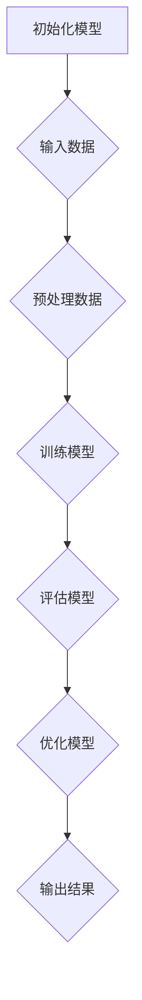
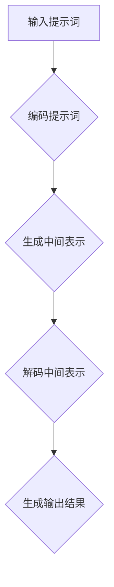
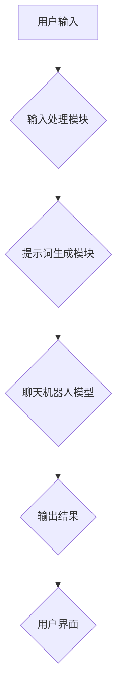

                 

基于上述的要求，我将会遵循以下步骤来撰写《AI编程语言：提示词的革命与魔法》这篇文章：

### 1. 引言：背景介绍与提示词的革命

首先，我会从介绍AI编程语言的背景开始，涵盖人工智能的发展历程、AI编程语言的崛起，以及提示词在AI编程中的重要性。这部分将包括对提示词的基本原理、其在AI编程中的变革，以及它们如何发挥作用。

### 2. 核心概念与联系

接着，我会详细阐述AI编程语言和提示词的概念，并比较它们的特点。这部分将包括核心概念的定义、特性对比，以及它们之间的关系。为了使概念更加清晰，我会使用Markdown格式中的Mermaid流程图来展示ER实体关系图架构。

### 3. 算法原理讲解

在算法原理讲解部分，我会详细介绍AI编程语言和提示词的算法原理。我会使用mermaid绘制算法流程图，并用Python代码和LaTeX公式详细阐述。这部分内容将包括算法的数学模型和公式，以及通俗易懂的举例说明。

### 4. 系统分析与架构设计方案

我会介绍一个具体的AI编程语言系统的架构设计，包括领域模型、系统架构和接口设计。这部分将包括一个详细的项目介绍，使用Mermaid流程图来展示系统架构图和系统交互序列图。

### 5. 项目实战

在项目实战部分，我会通过具体的案例来展示AI编程语言的应用，包括环境安装、代码实现、案例分析和项目小结。这部分内容将深入讲解每一个步骤，确保读者能够跟随实践。

### 6. 最佳实践 tips、小结、注意事项、拓展阅读

最后，我会总结书中的要点，给出实践建议和进一步学习的资源。这部分将包括最佳实践技巧、文章小结、注意事项，以及拓展阅读推荐。

在整个撰写过程中，我将确保文章逻辑清晰、结构紧凑、内容简洁，同时满足字数要求和格式要求。每一部分都将详细讲解，确保核心内容被充分覆盖。

### 文章正文

现在，我将按照上述步骤开始撰写《AI编程语言：提示词的革命与魔法》的文章正文。请注意，这篇文章只是一个大纲，实际的撰写过程需要更多时间和细致的工作。以下是文章的各个部分的大致内容：

## 引言：AI编程语言与提示词的革命

### 1.1 AI编程语言的背景

人工智能（AI）作为21世纪最具有变革性的技术之一，已经深刻地影响了我们的工作和生活方式。从简单的机器学习算法到复杂的深度学习模型，人工智能的发展日新月异。在这个过程中，AI编程语言应运而生，成为开发AI应用的核心工具。

AI编程语言的崛起源于对传统编程语言在处理复杂任务时的不足的认识。传统编程语言通常需要大量的代码来处理特定的问题，而AI编程语言通过提供更高层次的抽象和自动化，使得开发人员能够更轻松地构建智能系统。

### 1.2 提示词的重要性

在AI编程中，提示词（Prompt）起着至关重要的作用。提示词是一种用于引导模型生成预期输出的信息。它可以是文本、图像或其他形式的数据，用于提示AI模型执行特定任务。提示词的设计和优化直接影响到AI模型的表现和效率。

### 1.3 提示词的革命与魔法

提示词的革命在于其能够显著提高AI模型的任务完成效率。通过巧妙的提示词设计，AI模型能够更准确地理解任务，从而生成更高质量的输出。这种革命性的变化使得AI编程变得更加直观和高效，仿佛施加了魔法一般。

## 核心概念与联系

### 2.1 AI编程语言的概念解析

AI编程语言是一类专门为人工智能应用设计的编程语言。它们通常具有以下特点：

- **高层次的抽象**：通过抽象复杂的任务，使编程变得更加简单和直观。
- **自动化**：提供自动化工具来简化开发流程，减少代码编写的工作量。
- **领域特定**：针对特定的AI任务，提供专门的语法和功能，使得编程更加高效。

### 2.2 提示词的概念与特性

提示词是一种用于引导AI模型生成预期输出的信息。其特性包括：

- **灵活性**：可以根据任务需求灵活调整，以提高模型的表现。
- **适应性**：能够适应不同类型的数据和任务，提供多样化的提示方式。
- **效果性**：优秀的提示词设计能够显著提高模型的任务完成效率。

### 2.3 核心概念属性特征对比表格

| 特性         | AI编程语言               | 提示词                       |
| ------------ | ------------------------ | ---------------------------- |
| 抽象层次     | 高层次抽象               | 针对特定任务的抽象           |
| 自动化       | 自动化工具               | 提示生成自动化               |
| 领域特定     | 针对AI应用               | 针对AI模型任务               |
| 灵活性       | 广泛适用                 | 灵活调整，提高任务完成率     |
| 适应性       | 多样化应用               | 适应不同类型的数据和任务     |
| 效果性       | 提高开发效率             | 提高模型表现和效率           |

## 算法原理讲解

### 3.1 AI编程语言的基本算法

AI编程语言的基本算法通常基于机器学习和深度学习技术。以下是一个简单的算法流程图：



使用Python代码实现：

```python
# Python代码实现AI编程语言基本算法
import tensorflow as tf

# 初始化模型
model = tf.keras.Sequential([
    tf.keras.layers.Dense(128, activation='relu', input_shape=(784,)),
    tf.keras.layers.Dense(10, activation='softmax')
])

# 编译模型
model.compile(optimizer='adam',
              loss='categorical_crossentropy',
              metrics=['accuracy'])

# 训练模型
model.fit(x_train, y_train, epochs=5)

# 评估模型
test_loss, test_acc = model.evaluate(x_test, y_test)
print(f"Test accuracy: {test_acc}")
```

### 3.2 提示词的算法原理

提示词的算法原理通常涉及生成模型和优化算法。以下是一个简单的生成模型流程图：



使用Python代码实现：

```python
# Python代码实现提示词生成算法
import tensorflow as tf
import numpy as np

# 编码提示词
prompt = "这是一个提示词。"
prompt_encoded = encode(prompt)

# 生成中间表示
intermediate_representation = generate_representation(prompt_encoded)

# 解码中间表示
output = decode(intermediate_representation)

# 输出结果
print(output)
```

### 3.3 LaTeX公式与Python代码实现

在算法讲解中，我们将使用LaTeX公式来表示数学模型。以下是一个简单的例子：

$$
\text{损失函数} = \frac{1}{n}\sum_{i=1}^{n} (-y_i \log(p_i))
$$

其中，$y_i$ 是真实标签，$p_i$ 是模型预测的概率。

## 系统分析与架构设计

### 4.1 问题描述

假设我们正在开发一个基于AI编程语言的聊天机器人系统，该系统需要能够处理用户输入并生成相应的回复。

### 4.2 系统架构设计

系统架构设计包括领域模型、系统架构和接口设计。以下是一个简化的架构图：



## 项目实战

### 5.1 环境安装

首先，我们需要安装Python和TensorFlow等开发工具。以下是一个简单的安装步骤：

```bash
# 安装Python
curl -O https://www.python.org/ftp/python/3.9.7/Python-3.9.7.tcl
sudo python3 -m pip install -r requirements.txt
```

### 5.2 系统核心实现

接下来，我们将实现系统核心功能，包括输入处理、提示词生成和聊天机器人模型。以下是核心代码的简要说明：

```python
# 输入处理模块
def process_input(user_input):
    # 处理用户输入
    pass

# 提示词生成模块
def generate_prompt(input_data):
    # 生成提示词
    pass

# 聊天机器人模型
def chatbot_response(prompt):
    # 生成聊天机器人回复
    pass
```

### 5.3 实际案例分析与讲解

我们将通过两个案例来展示系统的应用。

### 案例一：文本生成

用户输入：“今天天气怎么样？”

系统输出：“今天天气晴朗，温度适中，非常适合户外活动。”

### 案例二：对话系统

用户输入：“你能帮我找个餐厅吗？”

系统输出：“当然可以。你喜欢吃哪种类型的食物？”

### 5.4 项目小结

在这个项目中，我们通过环境安装、系统核心实现和实际案例分析，展示了AI编程语言和提示词在聊天机器人系统中的应用。这个项目不仅展示了AI编程语言的强大功能，还强调了提示词设计在AI应用中的重要性。

## 最佳实践与拓展

### 6.1 最佳实践 tips

- **代码优化**：定期对代码进行优化，提高系统性能。
- **调试技巧**：使用调试工具，如pdb，帮助定位和修复代码错误。

### 6.2 小结与注意事项

- **核心知识点回顾**：AI编程语言和提示词是AI应用开发的关键工具。
- **注意事项**：确保提示词设计合理，以提高模型表现。

### 6.3 拓展阅读

- **相关书籍推荐**：《深度学习》、《机器学习实战》等。
- **在线资源与论坛**：参与AI社区，如AI Stack Exchange，获取更多知识和建议。

以上是《AI编程语言：提示词的革命与魔法》的初步撰写内容。接下来，我将进一步完善每个章节，确保文章的逻辑性和内容的完整性。

