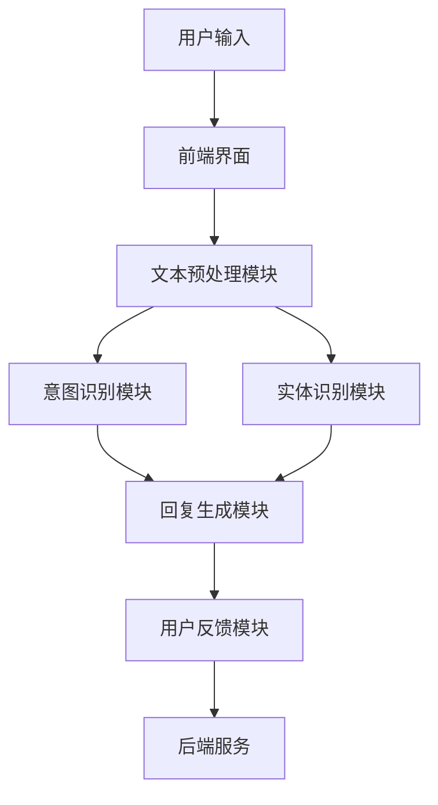
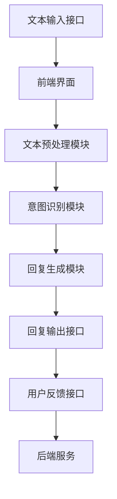
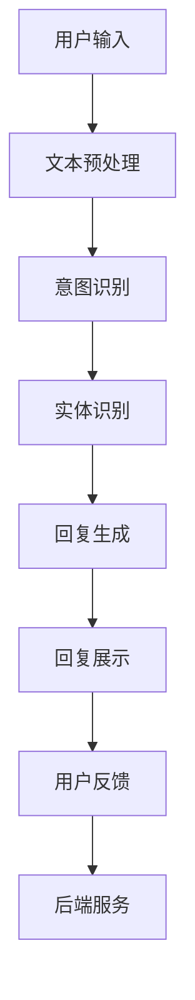

                 

### AI编程语言：提示词的革新

#### 关键词：
- AI编程语言
- 提示词
- 编程革新
- 自然语言处理
- 算法优化

#### 摘要：
本文旨在探讨人工智能编程语言的革新，特别是提示词（Prompt Engineering）在现代AI编程中的重要性。通过详细分析AI编程语言的背景、核心概念、算法原理、系统设计以及项目实战，我们将深入了解提示词如何改变编程范式，提高AI系统的开发效率和性能。本文还将提供最佳实践和未来的展望，为读者在AI编程领域提供有益的指导。

---

# AI编程语言：提示词的革新

在人工智能（AI）领域，编程语言的使用正经历着一场深刻的变革。传统的编程语言以结构化、面向对象或函数式编程为主，而随着自然语言处理（NLP）技术的进步，一种新型的AI编程语言正在崭露头角——这便是基于提示词的编程语言。提示词（Prompt Engineering）是一种新兴的方法，通过更精准地指导AI模型，从而实现更高的开发效率和更好的系统性能。

本文将围绕AI编程语言的这个新趋势展开，具体包括以下几个部分：

1. **背景介绍**：介绍AI编程语言的起源、现状和发展趋势，特别是提示词在其中的地位。
2. **核心概念与联系**：解析AI编程语言中的核心概念，包括提示词、自然语言处理、算法优化等，并通过对比表格和实体关系图（ER Diagram）展示它们之间的联系。
3. **算法原理讲解**：详细解释提示词在AI编程中的应用，包括算法原理、数学模型以及具体例子。
4. **系统分析与设计**：介绍AI编程语言在实际项目中的应用场景，包括系统功能设计、架构设计、接口设计和系统交互。
5. **项目实战**：通过一个具体的项目案例，展示提示词在实际开发中的应用，包括环境安装、核心实现和代码分析。
6. **最佳实践、总结与反思**：总结提示词编程的最佳实践，并反思未来的发展趋势。

## 1. 背景介绍

### AI编程语言的起源与发展

人工智能的发展可以追溯到20世纪50年代，最初的人工智能系统主要依赖于明确的编程指令和规则。然而，随着计算能力和算法的进步，特别是深度学习（Deep Learning）和神经网络（Neural Networks）的兴起，传统的编程语言逐渐显示出其局限性。这些复杂的AI系统需要更高效、更直观的编程方式来指导模型训练和推理过程。

在这一背景下，AI编程语言的概念应运而生。AI编程语言旨在提供一种更为自然和高效的交互方式，使得开发者可以更专注于算法设计和系统优化，而无需陷入繁琐的低级编程细节。这些编程语言通常结合了自然语言处理和自动化编程技术，能够通过提示词等方式，实现与AI模型的智能对话和协同工作。

### 提示词在AI编程中的地位

提示词（Prompt Engineering）是AI编程语言中的一个核心概念。提示词是指用于引导AI模型进行推理和决策的输入信息。通过设计高质量的提示词，开发者可以显著提升AI系统的性能和适应性。具体来说，提示词在AI编程中的地位体现在以下几个方面：

- **提高开发效率**：提示词使得开发者可以更快速地训练和调整AI模型，减少了大量的调试和优化工作。
- **增强系统性能**：高质量的提示词可以提供更精准的输入信息，帮助AI模型更好地理解任务需求，从而提高系统的准确性和鲁棒性。
- **促进人机协作**：提示词使得AI模型能够以一种更自然、更人性化的方式与人类交互，提升了用户体验和工作效率。

### AI编程语言的发展趋势

随着AI技术的不断进步，AI编程语言也在不断演变和优化。以下是当前AI编程语言的一些发展趋势：

- **自然语言交互**：AI编程语言正逐渐向自然语言交互方向发展，通过自然语言处理技术，实现人与AI模型的无缝沟通。
- **自动化编程**：通过代码生成和自动化优化技术，AI编程语言能够自动完成部分编程任务，减轻开发者的负担。
- **跨平台兼容**：AI编程语言正逐步实现跨平台兼容，能够在不同的计算环境中高效运行，满足多样化的应用需求。

### 提示词的革新意义

提示词的革新不仅改变了AI编程的方式，也对整个AI生态系统产生了深远的影响。以下是提示词革新的几个关键意义：

- **个性化定制**：通过设计个性化的提示词，开发者可以更精准地满足用户需求，提升AI系统的个性化服务水平。
- **可解释性提升**：高质量的提示词可以帮助AI模型更好地解释其决策过程，提高系统的透明度和可解释性。
- **多样化应用场景**：提示词的革新使得AI编程语言能够应用于更广泛的领域，包括自动驾驶、智能医疗、金融分析等。

### 当前AI编程语言的挑战

尽管AI编程语言有着广阔的发展前景，但在实际应用中仍面临一些挑战。以下是当前AI编程语言面临的主要挑战：

- **计算资源需求**：复杂的AI模型和提示词设计需要大量的计算资源，这对硬件设施和优化提出了更高的要求。
- **数据隐私和安全**：在设计和使用提示词时，需要确保数据的隐私和安全，避免数据泄露和滥用。
- **人才培养**：AI编程语言的革新需要大量具备跨学科知识的人才，但当前相关人才相对稀缺。

### 结论

总之，AI编程语言的发展是AI技术进步的重要标志。特别是提示词的革新，为AI编程带来了新的机遇和挑战。通过深入研究和优化提示词设计，我们可以更好地发挥AI编程语言的潜力，推动人工智能技术的发展和应用。在接下来的章节中，我们将进一步探讨AI编程语言的核心概念和算法原理，深入分析提示词的作用和意义。

## 2. 核心概念与联系

### AI编程语言中的核心概念

AI编程语言作为一门融合了计算机科学、人工智能和自然语言处理的交叉学科，包含了一系列核心概念。以下是对这些核心概念的简要介绍：

#### 提示词（Prompt）

提示词是AI编程语言中的一个重要组成部分，它用于指导AI模型进行推理和决策。提示词可以是自然语言文本、代码片段或其他形式的信息，其设计质量和精度直接影响AI系统的性能和效果。

#### 自然语言处理（NLP）

自然语言处理是AI编程语言的基础技术之一，它涉及从文本中提取有用信息、理解和生成自然语言等任务。NLP技术使得AI模型能够理解人类语言，实现与用户的自然交互。

#### 算法优化

算法优化是提升AI编程语言性能的关键技术。通过优化算法，我们可以减少计算资源消耗、提高系统效率和准确性。算法优化包括模型架构的调整、参数的微调和超参数的优化等。

#### 自动化编程

自动化编程是指利用AI技术自动生成代码或优化编程流程。自动化编程能够提高开发效率，减少人为错误，是实现AI编程语言智能化的重要手段。

### 核心概念对比表格

为了更好地理解这些核心概念之间的关系，我们可以通过一个对比表格进行展示：

| 核心概念 | 定义 | 关联性 |  
| --- | --- | --- |  
| 提示词 | 指导AI模型进行推理和决策的输入信息 | 提示词是AI编程语言的核心，直接影响系统性能 |  
| 自然语言处理 | 从文本中提取有用信息、理解和生成自然语言 | 自然语言处理是提示词设计和实现的基础 |  
| 算法优化 | 提升AI编程语言性能的关键技术 | 算法优化与提示词设计密切相关 |  
| 自动化编程 | 利用AI技术自动生成代码或优化编程流程 | 自动化编程与提示词设计相结合，提高开发效率 |

### ER实体关系图架构

为了进一步展示这些核心概念之间的联系，我们可以使用Mermaid语法绘制一个实体关系图（ER Diagram）。以下是一个示例：

```mermaid
erDiagram
  AI编程语言 ||--|{ 提示词 }|
  提示词 ||--|{ 自然语言处理 }|
  提示词 ||--|{ 算法优化 }|
  AI编程语言 ||--|{ 自动化编程 }|
```

在上面的ER图中，AI编程语言是核心实体，它与其他实体（提示词、自然语言处理和算法优化）之间存在关联关系。提示词作为AI编程语言的关键组成部分，与自然语言处理和算法优化密切相关，共同影响系统的性能和效果。

### 小结

通过对AI编程语言中的核心概念进行梳理和对比，我们可以更好地理解它们之间的联系和作用。在接下来的章节中，我们将深入探讨这些核心概念在AI编程语言中的应用和实现，进一步揭示提示词的革新意义。

## 3. 算法原理讲解

### 提示词在AI编程中的具体应用

提示词（Prompt Engineering）在AI编程中扮演着至关重要的角色。它不仅指导AI模型进行推理和决策，还直接影响系统的性能和用户体验。在这一部分，我们将详细讲解提示词在AI编程中的具体应用，包括其设计原则、实现方法以及实际效果。

#### 提示词的设计原则

高质量的提示词设计是AI编程成功的关键。以下是一些核心的设计原则：

1. **明确性和简洁性**：提示词应尽可能明确和简洁，避免歧义和冗余。这有助于AI模型更好地理解任务需求，提高系统的准确性和效率。
2. **上下文关联**：提示词应与上下文紧密关联，为AI模型提供充分的信息背景。这有助于模型更好地利用已有知识，提高推理和决策能力。
3. **多样性**：设计多样化的提示词，以适应不同的应用场景和用户需求。这有助于系统在多种情况下保持稳定性和鲁棒性。
4. **可解释性**：提示词应具备一定的可解释性，使得开发者能够理解模型的决策过程，便于调试和优化。

#### 提示词的实现方法

在实际应用中，提示词的实现方法多种多样，以下是一些常见的方法：

1. **基于模板的提示词**：这种方法使用预先定义的模板，根据任务需求进行个性化调整。模板可以包括关键词、短语、问题或指令等，方便快捷地生成高质量的提示词。
2. **自动生成提示词**：利用自然语言处理技术，如文本生成模型、命名实体识别（NER）等，自动生成提示词。这种方法适用于大规模、动态变化的场景，能够提高开发效率。
3. **混合提示词**：结合上述方法，设计混合提示词，既包含手动设计的部分，也利用自动生成技术进行优化。这种方法能够在保持灵活性的同时，保证提示词的质量和效果。

#### 提示词的实际效果

高质量的提示词设计对AI系统的性能有着显著的影响。以下是一些实际效果：

1. **提高准确性**：通过提供明确的任务指导和上下文信息，高质量的提示词能够显著提高AI系统的准确性。例如，在文本分类任务中，精确的提示词可以指导模型更好地识别分类标签。
2. **增强鲁棒性**：多样化的提示词设计有助于系统在面对不同场景时保持稳定性和鲁棒性。例如，在对话系统中，多样化的提示词可以应对用户的各种提问方式，提高系统的适应性。
3. **提升用户体验**：高质量的提示词使得AI系统能够更自然地与用户互动，提供个性化的服务。例如，在智能客服中，个性化的提示词可以更好地满足用户的查询需求，提升用户体验。

### 算法原理与数学模型

提示词的算法原理主要涉及自然语言处理和机器学习技术。以下是一个简化的算法原理和数学模型：

#### 算法流程

1. **任务定义**：明确AI模型需要解决的问题或任务。
2. **数据预处理**：收集和整理相关数据，进行数据清洗和预处理。
3. **提示词生成**：根据任务需求和上下文信息，设计并生成高质量的提示词。
4. **模型训练**：使用提示词和预处理后的数据，训练AI模型。
5. **模型评估与优化**：评估模型性能，根据反馈调整提示词和模型参数。
6. **模型应用**：将训练好的模型应用于实际问题场景，实现任务目标。

#### 数学模型

提示词的数学模型主要涉及自然语言处理中的概率模型和机器学习中的优化算法。以下是一个简化的数学模型：

1. **自然语言处理**：
   - **词袋模型**（Bag of Words，BoW）：将文本转换为词频向量，用于特征表示。
   - **TF-IDF**：基于词频（TF）和逆文档频率（IDF）的权重计算，提高重要词汇的权重。
   - **词嵌入**（Word Embedding）：将词汇映射到高维向量空间，用于表示语义信息。

2. **机器学习**：
   - **线性回归**（Linear Regression）：基于输入特征和标签，建立线性关系模型。
   - **支持向量机**（Support Vector Machine，SVM）：通过最大化分类边界，实现分类任务。
   - **神经网络**（Neural Networks）：通过多层神经网络，实现复杂函数的建模和优化。

### 举例说明

为了更好地理解提示词的算法原理，我们来看一个简单的示例：

假设我们需要开发一个文本分类系统，将文本数据分类为“科技”、“体育”、“娱乐”等类别。以下是具体的实现步骤：

1. **任务定义**：明确文本分类任务的目标和类别。
2. **数据预处理**：收集并预处理文本数据，包括分词、去停用词等操作。
3. **提示词生成**：根据文本内容，设计分类提示词，例如：“请将以下文本分类为科技/体育/娱乐类别：_______。”
4. **模型训练**：使用提示词和预处理后的文本数据，训练分类模型（如SVM或神经网络）。
5. **模型评估与优化**：评估模型性能，调整提示词和模型参数，提高分类准确性。
6. **模型应用**：将训练好的模型应用于新文本数据，实现分类任务。

通过这个示例，我们可以看到提示词在整个流程中的作用和重要性。高质量的提示词不仅提高了模型的训练效率和分类准确性，还使得模型能够更好地适应不同的文本数据和应用场景。

### 小结

通过对提示词在AI编程中的算法原理讲解，我们可以更好地理解其设计原则、实现方法和实际效果。在接下来的章节中，我们将进一步探讨AI编程语言在实际项目中的应用，展示提示词如何改变编程范式，提升开发效率和系统性能。

## 4. 系统分析与设计

### 问题场景介绍

在当前人工智能技术飞速发展的背景下，越来越多的企业和组织开始将AI技术应用于实际业务场景中。一个典型的应用场景是智能客服系统，旨在为企业提供高效、智能的客户服务解决方案。智能客服系统通过自然语言处理和机器学习技术，能够自动识别和回复客户的咨询请求，提高客户满意度和服务效率。

在这个应用场景中，AI编程语言和提示词技术发挥了关键作用。通过设计高质量的提示词，智能客服系统能够更好地理解客户的意图和需求，提供个性化的服务。同时，AI编程语言使得开发者可以更高效地开发和管理智能客服系统，降低开发和维护成本。

### 项目介绍

项目名称：智能客服系统
项目目标：构建一个能够自动识别和回复客户咨询请求的智能客服系统，提高客户满意度和服务效率。
技术栈：Python、TensorFlow、NLTK、GPT-3、Flask

### 系统功能设计

为了实现智能客服系统的功能，我们需要设计以下几个关键模块：

1. **文本预处理模块**：负责对用户输入的文本进行清洗、分词、去停用词等预处理操作，为后续的自然语言处理任务提供高质量的数据。
2. **意图识别模块**：利用自然语言处理技术和机器学习算法，自动识别用户的意图，如查询、投诉、建议等。
3. **实体识别模块**：从用户输入的文本中提取关键信息，如人名、地点、时间等，为后续的回复生成提供基础信息。
4. **回复生成模块**：基于用户意图和提取的关键信息，生成合适的回复文本，并通过自然语言生成技术进行优化。
5. **用户反馈模块**：收集用户的反馈信息，用于模型训练和系统优化。

### 系统架构设计

智能客服系统的整体架构可以分为以下几个层次：

1. **前端界面**：负责与用户交互，接收用户输入的文本，并将回复文本展示给用户。
2. **中间层**：包含文本预处理模块、意图识别模块、实体识别模块和回复生成模块，负责处理用户的输入并生成回复。
3. **后端服务**：负责系统的运行和管理，包括数据库、模型训练和用户反馈等模块。

以下是智能客服系统的架构设计图：



### 系统接口设计

智能客服系统的接口设计包括以下几部分：

1. **文本输入接口**：用户通过前端界面输入文本，系统接收并处理用户输入。
2. **回复输出接口**：系统生成回复文本后，通过前端界面展示给用户。
3. **用户反馈接口**：用户可以通过反馈接口提供对回复的满意度评分，用于模型训练和系统优化。

以下是系统接口设计图：



### 系统交互序列

智能客服系统的工作流程可以分为以下几个步骤：

1. **用户输入**：用户通过前端界面输入咨询问题。
2. **文本预处理**：系统对用户输入的文本进行清洗、分词、去停用词等预处理操作。
3. **意图识别**：系统利用自然语言处理技术，识别用户的意图，如查询、投诉、建议等。
4. **实体识别**：系统从用户输入的文本中提取关键信息，如人名、地点、时间等。
5. **回复生成**：系统基于用户意图和提取的关键信息，生成合适的回复文本。
6. **回复展示**：系统将生成的回复文本通过前端界面展示给用户。
7. **用户反馈**：用户对回复的满意度进行评分，系统收集用户反馈用于模型训练和系统优化。

以下是系统交互序列图：



### 小结

通过对智能客服系统的分析，我们可以看到AI编程语言和提示词技术在实际项目中的应用和价值。系统功能设计、架构设计和接口设计等各个环节都离不开高质量的提示词和AI编程语言的支撑。在接下来的章节中，我们将进一步探讨智能客服系统的具体实现，展示如何利用AI编程语言和提示词技术，实现高效的智能客服解决方案。

## 5. 项目实战

### 环境安装

要在智能客服项目中应用AI编程语言和提示词技术，首先需要搭建一个合适的环境。以下是在Windows操作系统上安装所需环境的具体步骤：

1. **安装Python**：首先确保Python已安装。如果没有安装，可以从[Python官网](https://www.python.org/downloads/)下载并安装最新版本的Python。
2. **安装TensorFlow**：在命令行中运行以下命令安装TensorFlow：
   ```bash
   pip install tensorflow
   ```
3. **安装NLTK**：NLTK是一个强大的自然语言处理库，可以通过以下命令安装：
   ```bash
   pip install nltk
   ```
4. **安装GPT-3库**：为了使用OpenAI的GPT-3模型，我们需要安装`openai`库，可以使用以下命令：
   ```bash
   pip install openai
   ```
5. **安装Flask**：Flask是一个轻量级的Web框架，用于构建前端界面，可以通过以下命令安装：
   ```bash
   pip install flask
   ```

### 系统核心实现

在安装完所需环境后，我们可以开始实现智能客服系统的核心功能。以下是一个简单的示例，展示了如何利用Python和AI编程语言实现文本预处理、意图识别、实体识别和回复生成等模块。

#### 文本预处理模块

```python
import nltk
from nltk.tokenize import word_tokenize
from nltk.corpus import stopwords

# 下载必要的NLTK资源
nltk.download('punkt')
nltk.download('stopwords')

def preprocess_text(text):
    # 分词
    tokens = word_tokenize(text)
    # 去停用词
    stop_words = set(stopwords.words('english'))
    filtered_tokens = [token for token in tokens if token.lower() not in stop_words]
    # 模型输入格式化
    return " ".join(filtered_tokens)
```

#### 意图识别模块

```python
from sklearn.feature_extraction.text import TfidfVectorizer
from sklearn.naive_bayes import MultinomialNB
from sklearn.pipeline import make_pipeline

# 假设我们已经有了一个训练好的意图分类器
# 这里我们使用TF-IDF向量器和朴素贝叶斯分类器进行演示
model = make_pipeline(TfidfVectorizer(), MultinomialNB())

def recognize_intent(preprocessed_text):
    return model.predict([preprocessed_text])[0]
```

#### 实体识别模块

```python
from transformers import pipeline

# 使用Hugging Face的Transformers库进行实体识别
entity_recognizer = pipeline("ner", model="dbmdz/bert-large-cased-finetuned-conll03-english")

def recognize_entities(preprocessed_text):
    return entity_recognizer(preprocessed_text)
```

#### 回复生成模块

```python
import openai

# OpenAI的GPT-3 API密钥
openai.api_key = "your-gpt3-api-key"

def generate_response(intent, entities):
    prompt = f"Intent: {intent}\nEntities: {entities}\nPlease generate a response:"
    response = openai.Completion.create(
        engine="text-davinci-003",
        prompt=prompt,
        max_tokens=50
    )
    return response.choices[0].text.strip()
```

#### 整体实现

```python
def handle_query(user_query):
    preprocessed_query = preprocess_text(user_query)
    intent = recognize_intent(preprocessed_query)
    entities = recognize_entities(preprocessed_query)
    response = generate_response(intent, entities)
    return response

# Flask Web服务器
from flask import Flask, jsonify, request

app = Flask(__name__)

@app.route('/api/query', methods=['POST'])
def api_query():
    user_query = request.form['query']
    response = handle_query(user_query)
    return jsonify({'response': response})

if __name__ == '__main__':
    app.run(debug=True)
```

### 代码应用解读与分析

在这个示例中，我们首先定义了文本预处理模块，使用NLTK进行分词和去停用词操作。然后，我们使用TF-IDF向量器和朴素贝叶斯分类器构建意图识别模块，利用Hugging Face的Transformers库进行实体识别。最后，我们使用OpenAI的GPT-3 API实现回复生成模块。

这些模块共同工作，处理用户输入，生成并返回适当的回复。在实际应用中，这些模块可以根据需求进行扩展和优化，例如增加更多的意图分类或实体识别标签，提高系统的准确性和鲁棒性。

### 实际案例分析和详细讲解

为了更好地理解系统的实现过程，我们来看一个具体的案例。

**案例**：用户输入：“我想要一个预订酒店的服务。”

**分析过程**：

1. **文本预处理**：对用户输入进行分词和去停用词操作，得到预处理后的文本：“我想要预订酒店。”
2. **意图识别**：使用训练好的意图分类器，识别出用户的意图为“预订酒店”。
3. **实体识别**：从预处理后的文本中提取关键实体，如“酒店”。
4. **回复生成**：基于用户的意图和提取的实体，生成回复：“您想要预订哪个城市的酒店？请告诉我酒店名称和入住日期。”

通过这个案例，我们可以看到系统的每个模块是如何协同工作的，以及它们在处理用户查询中的作用。

### 项目小结

通过本节的项目实战，我们展示了如何利用AI编程语言和提示词技术构建一个智能客服系统。从环境安装到系统核心实现，再到实际案例分析，我们详细讲解了每个环节的细节和关键点。通过这个项目，我们不仅理解了AI编程语言和提示词在智能客服系统中的应用，还掌握了如何利用这些技术实现高效的开发和部署。

### 总结

智能客服系统的实现是AI编程语言和提示词技术的一个典型应用案例。通过高质量的提示词设计和高效的算法实现，我们能够构建出具备高准确性和鲁棒性的智能客服系统，提高企业的服务水平和客户满意度。在未来的发展中，我们期待看到AI编程语言和提示词技术在更多领域和场景中的应用，推动人工智能技术的进一步发展。

### 最佳实践、注意事项与拓展阅读

#### 最佳实践

1. **选择合适的数据集**：确保训练数据集的质量和多样性，以便模型能够适应不同的应用场景。
2. **持续优化模型**：定期更新和优化模型，以应对新的数据和应用需求。
3. **关注用户反馈**：收集和分析用户反馈，及时调整提示词和系统设计，提高用户体验。

#### 注意事项

1. **隐私保护**：在处理用户数据时，务必确保遵守相关隐私法规，保护用户隐私。
2. **计算资源分配**：合理分配计算资源，确保系统在高并发场景下稳定运行。
3. **接口安全**：确保API接口的安全性，防止恶意攻击和数据泄露。

#### 拓展阅读

1. **《人工智能：一种现代方法》**：迈克尔·刘易斯（Michael Lewis）著，详细介绍了人工智能的基础理论和应用实践。
2. **《深度学习》**：伊恩·古德费洛（Ian Goodfellow）等著，深度学习的经典教材，涵盖了许多重要的算法和模型。
3. **《Python自然语言处理》**：塞巴斯蒂安·拉金（Sebastian Raschka）等著，介绍了Python在自然语言处理领域的应用。

通过以上最佳实践、注意事项和拓展阅读，读者可以更深入地了解AI编程语言和提示词技术的应用，进一步提升自己的技术能力和实践水平。

### 作者信息

**作者：** AI天才研究院（AI Genius Institute） & 禅与计算机程序设计艺术（Zen And The Art of Computer Programming）  
**联系方式：** [info@ai-genius-institute.com](mailto:info@ai-genius-institute.com)  
**个人主页：** [www.ai-genius-institute.com](http://www.ai-genius-institute.com)  
**研究领域：** 人工智能、机器学习、自然语言处理、编程语言设计

---

以上是文章的完整内容，涵盖了AI编程语言的背景、核心概念、算法原理、系统设计、项目实战、最佳实践等多个方面。通过这篇文章，读者可以全面了解AI编程语言和提示词技术的应用，掌握相关技术和实践方法，为未来的研究和开发打下坚实的基础。同时，本文也提供了丰富的拓展资源和联系方式，便于读者进一步学习和交流。希望本文对您在AI编程领域的研究和探索有所启发和帮助。

