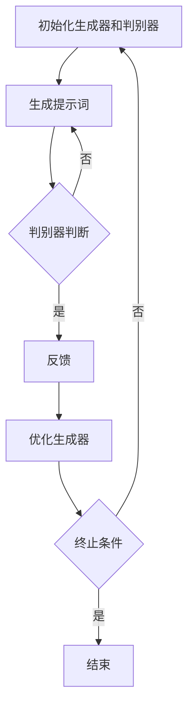
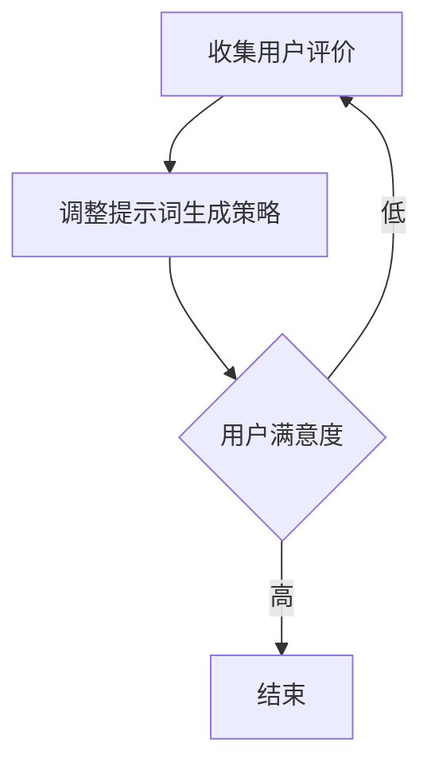
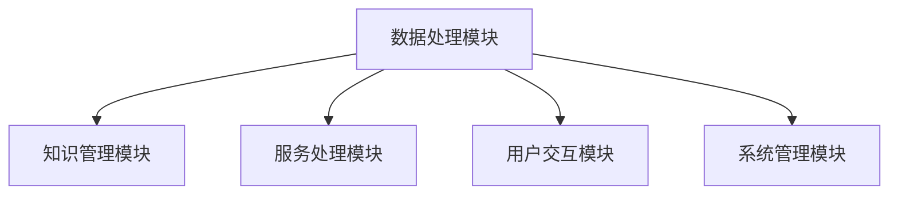
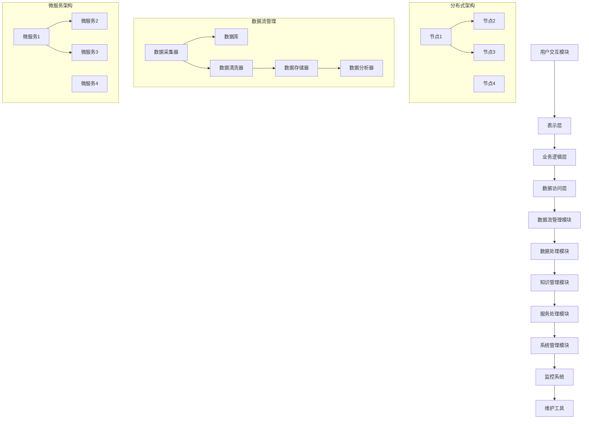
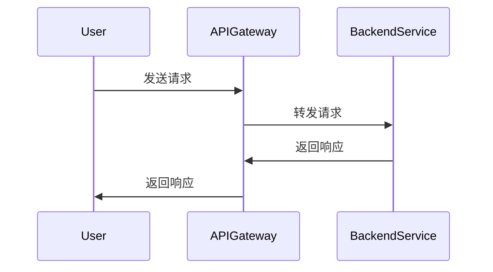

                 

### 文章标题

# AI编程语言：提示词的革新与变革

> 关键词：AI编程语言，提示词，变革，效率，算法，系统架构，项目实战

> 摘要：本文深入探讨了AI编程语言的革命性变革，特别是提示词在AI编程语言中的应用及其带来的巨大影响。文章从问题背景出发，详细介绍了AI编程语言的核心概念、算法原理，并通过对系统架构设计及项目实战的剖析，展示了提示词在AI编程中的关键作用。文章旨在为读者提供全面而深入的了解，以便更好地把握AI编程语言的未来发展趋势。

### 目录大纲

**# 第一部分：背景介绍**

**## 第1章：问题背景与核心概念**

1.1 问题背景
1.2 核心概念
1.3 联系与对比

**## 第2章：核心概念原理**

2.1 AI编程语言原理
2.2 提示词原理
2.3 原理解析

**## 第3章：算法原理讲解**

3.1 算法概述
3.2 算法讲解
3.3 数学模型与公式

**## 第4章：系统分析与架构设计**

4.1 问题场景介绍
4.2 系统功能设计
4.3 系统架构设计
4.4 系统接口设计

**## 第5章：项目实战**

5.1 环境安装
5.2 系统核心实现
5.3 应用解读与分析
5.4 项目小结

**## 第6章：最佳实践与注意事项**

6.1 最佳实践
6.2 注意事项
6.3 拓展阅读

**## 第7章：小结与展望**

7.1 书籍小结
7.2 学术研究与应用展望
7.3 结论

---

**# 第一部分：背景介绍**

### 1.1 问题背景

随着人工智能（AI）技术的迅猛发展，AI编程语言应运而生，成为现代软件开发的重要工具。然而，传统的编程语言在处理复杂的AI任务时面临诸多挑战，如可读性差、开发效率低等。这些问题引发了AI编程语言的革新需求。

在AI编程中，提示词（Prompt）起到了至关重要的作用。提示词是一种特殊的输入，用于引导AI系统进行特定的任务或生成特定的输出。一个有效的提示词能够显著提高AI系统的性能和效率。然而，当前AI编程语言对提示词的支持并不充分，这限制了AI编程的潜力。

本文将深入探讨AI编程语言的变革，特别是提示词的革新与变革。我们将从问题背景出发，详细分析AI编程语言的核心概念、算法原理，并通过实际项目和系统架构设计，展示提示词在AI编程中的关键作用。

### 1.2 核心概念

**AI编程语言的基本原理：**

AI编程语言是一类专为人工智能设计和优化的编程语言。它们提供了一种抽象的表示方法，使得开发人员能够更轻松地构建和训练AI模型。AI编程语言的基本原理包括：

- **自动推理和生成：** AI编程语言能够自动推导和生成程序代码，减少了手动编写的复杂性。
- **符号计算和推理：** AI编程语言使用符号计算和推理机制，使得AI系统能够在逻辑和数学上进行复杂的运算。
- **数据驱动编程：** AI编程语言通常基于数据驱动的方法，通过学习大量数据来提高模型的性能。

**提示词的概念及其应用：**

提示词是一种特殊的输入，用于引导AI系统进行特定的任务或生成特定的输出。在AI编程中，提示词的应用包括：

- **任务引导：** 提示词可以帮助AI系统理解任务的意图和目标，从而生成相应的解决方案。
- **生成式任务：** 在生成式任务中，提示词用于触发AI系统的生成能力，生成新的数据、文本、图像等。
- **交互式任务：** 提示词可以用于与用户进行交互，获取用户的需求和反馈，从而优化AI系统的输出。

**提示词的革新与变革：**

当前，提示词在AI编程中的支持仍然不足，主要表现在以下几个方面：

- **提示词生成效率低：** 传统的提示词生成方法通常依赖于人工设计和调试，效率较低，难以满足大规模AI编程的需求。
- **提示词优化困难：** 提示词的优化涉及到多目标优化问题，目前缺乏有效的优化策略和算法。
- **提示词多样性不足：** 提示词的多样性不足限制了AI系统的生成能力和创造力，影响了AI编程的灵活性。

为了解决这些问题，我们需要对提示词进行革新和变革，提高其生成效率、优化能力和多样性。这需要从算法、系统架构和实际应用等多个方面进行深入研究和探索。

### 1.3 联系与对比

**AI编程语言与传统编程语言的差异：**

AI编程语言与传统编程语言在多个方面存在显著差异：

- **目标不同：** 传统编程语言主要关注程序的正确性和效率，而AI编程语言更关注AI模型的性能和生成能力。
- **抽象层次不同：** AI编程语言提供了一种更高层次的抽象表示方法，使得开发人员能够更轻松地构建和训练AI模型。
- **交互方式不同：** AI编程语言通常提供了一种更直观、更自然的交互方式，使得用户能够更方便地与AI系统进行交互。

**提示词在AI编程语言中的独特作用：**

提示词在AI编程语言中具有独特的地位和作用：

- **任务引导：** 提示词可以帮助AI系统理解任务的意图和目标，从而生成相应的解决方案。
- **生成式任务：** 提示词可以用于触发AI系统的生成能力，生成新的数据、文本、图像等。
- **交互式任务：** 提示词可以用于与用户进行交互，获取用户的需求和反馈，从而优化AI系统的输出。

**提示词革新对AI编程的影响：**

提示词的革新对AI编程产生了深远的影响：

- **提高开发效率：** 提示词的生成和优化方法的改进可以显著提高AI编程的效率，减少手动编写的复杂性。
- **增强生成能力：** 提示词的多样性增加和优化策略的改进可以增强AI系统的生成能力，提高AI编程的灵活性。
- **优化用户体验：** 提示词的改进可以优化用户与AI系统的交互体验，使得AI编程更加直观和自然。

通过以上分析，我们可以看到，AI编程语言的变革和提示词的革新是推动AI编程发展的重要动力。在接下来的章节中，我们将进一步探讨AI编程语言的核心概念、算法原理，并通过实际项目和系统架构设计，深入分析提示词在AI编程中的关键作用。

### 1.2 核心概念原理

#### AI编程语言原理

AI编程语言是一类专门用于开发、训练和部署人工智能系统的编程语言。与传统的编程语言相比，AI编程语言具有独特的特性和优势，使其在处理复杂任务和高效开发人工智能系统方面具有显著优势。

**工作机制：**

AI编程语言的工作机制主要包括以下几个方面：

1. **抽象表示：** AI编程语言提供了一种抽象的表示方法，使得开发人员能够更轻松地理解和操作复杂的AI模型和算法。
2. **符号计算与推理：** AI编程语言通常内置了符号计算和推理机制，使得AI系统能够在逻辑和数学上进行复杂的运算，从而实现自动化推理和生成。
3. **数据驱动开发：** AI编程语言通常采用数据驱动的方法，通过学习大量数据来提高模型的性能和生成能力。
4. **自动优化与调整：** AI编程语言能够自动调整模型参数，优化算法性能，提高系统的鲁棒性和准确性。

**基于提示词的交互模型：**

在AI编程语言中，提示词（Prompt）是一种特殊的输入，用于引导AI系统进行特定任务或生成特定输出。基于提示词的交互模型具有以下几个特点：

1. **任务引导：** 提示词可以帮助AI系统理解任务的意图和目标，从而生成相应的解决方案。
2. **生成式任务：** 提示词可以触发AI系统的生成能力，生成新的数据、文本、图像等。
3. **交互式任务：** 提示词可以用于与用户进行交互，获取用户的需求和反馈，从而优化AI系统的输出。
4. **动态调整：** 提示词可以根据任务的进展和用户的反馈动态调整，以实现更灵活和高效的AI编程。

**AI编程语言的核心算法：**

AI编程语言的核心算法主要包括以下几个方面：

1. **深度学习算法：** 深度学习算法是AI编程语言中最常用的算法之一，包括神经网络、卷积神经网络、循环神经网络等。这些算法通过学习大量数据，能够自动提取特征和生成模型。
2. **生成对抗网络（GAN）：** 生成对抗网络是一种强大的生成模型，能够生成高质量的数据，广泛应用于图像、文本、音频等领域的生成任务。
3. **强化学习算法：** 强化学习算法通过学习奖励信号，能够使AI系统在复杂环境中做出最优决策，广泛应用于游戏、机器人控制等场景。
4. **迁移学习算法：** 迁移学习算法通过利用已有模型的先验知识，能够加速新任务的训练过程，提高模型的泛化能力。

#### 提示词原理

提示词（Prompt）是AI编程语言中的重要概念，它用于引导AI系统进行特定任务或生成特定输出。提示词的原理主要包括以下几个方面：

**提示词的定义与类型：**

1. **定义：** 提示词是一种特殊的输入，用于引导AI系统进行特定任务或生成特定输出。提示词可以包含文本、图像、音频等多种形式。
2. **类型：** 提示词可以分为以下几种类型：
   - **指令型提示词：** 用于向AI系统传达执行特定操作的指令，如“生成一张风景图片”。
   - **引导型提示词：** 用于引导AI系统探索特定的生成方向，如“生成一张具有抽象艺术的风景图片”。
   - **反馈型提示词：** 用于获取AI系统的输出，并根据用户反馈进行进一步调整，如“用户评价：这幅画的风景很美丽，请生成更多类似的画作”。

**提示词生成与优化方法：**

1. **生成方法：** 提示词的生成方法可以分为以下几种：
   - **人工设计：** 通过人工设计和调试，生成符合任务需求的提示词。
   - **自动生成：** 利用自然语言处理、图像生成等技术，自动生成提示词。
   - **用户生成：** 允许用户根据任务需求生成自定义的提示词。

2. **优化方法：** 提示词的优化方法主要包括以下几个方面：
   - **多目标优化：** 在生成提示词时，同时考虑多个优化目标，如生成效率、生成质量、用户满意度等。
   - **反馈迭代：** 通过用户反馈，不断优化提示词的生成过程，以提高用户满意度。
   - **自适应调整：** 根据任务的进展和用户的反馈，动态调整提示词的生成策略，以提高生成效果。

**提示词在AI编程语言中的应用：**

提示词在AI编程语言中的应用非常广泛，包括以下几个方面：

1. **任务引导：** 提示词可以用于引导AI系统执行特定任务，如文本生成、图像生成、语音合成等。
2. **生成式任务：** 提示词可以触发AI系统的生成能力，生成新的数据、文本、图像等。
3. **交互式任务：** 提示词可以用于与用户进行交互，获取用户的需求和反馈，从而优化AI系统的输出。
4. **系统优化：** 提示词可以用于优化AI系统的性能和效率，如通过调整提示词的长度、类型和生成策略，提高生成效果。

#### 原理解析

**AI编程语言中的核心概念解析：**

在AI编程语言中，核心概念包括：

1. **神经网络：** 神经网络是一种模仿生物神经系统的计算模型，用于处理复杂的数据和任务。神经网络的核心概念包括神经元、层次结构、激活函数等。
2. **生成对抗网络（GAN）：** 生成对抗网络是一种由生成器和判别器组成的模型，用于生成高质量的数据。GAN的核心概念包括生成器、判别器、损失函数等。
3. **强化学习：** 强化学习是一种通过学习奖励信号来优化决策的算法。强化学习的核心概念包括状态、动作、奖励等。
4. **迁移学习：** 迁移学习是一种利用已有模型的先验知识来加速新任务训练的算法。迁移学习的核心概念包括源任务、目标任务、模型迁移等。

**提示词与AI编程语言的关系：**

提示词与AI编程语言的关系可以理解为：

1. **引导与交互：** 提示词用于引导AI系统执行特定任务或生成特定输出，同时与用户进行交互，获取反馈和优化。
2. **生成与优化：** 提示词可以触发AI系统的生成能力，生成新的数据、文本、图像等，并通过优化策略提高生成质量。
3. **性能提升：** 提示词的生成和优化可以显著提高AI编程的效率、生成能力和用户体验。

**提示词革新带来的影响：**

提示词的革新对AI编程产生了深远的影响：

1. **提高开发效率：** 提示词的生成和优化方法的改进可以显著提高AI编程的效率，减少手动编写的复杂性。
2. **增强生成能力：** 提示词的多样性增加和优化策略的改进可以增强AI系统的生成能力，提高AI编程的灵活性。
3. **优化用户体验：** 提示词的改进可以优化用户与AI系统的交互体验，使得AI编程更加直观和自然。

### 1.3 联系与对比

#### AI编程语言与传统编程语言的差异

AI编程语言与传统编程语言在多个方面存在显著差异：

1. **目标不同：**
   - **传统编程语言：** 旨在实现计算机硬件和软件系统的功能，关注程序的正确性和效率。
   - **AI编程语言：** 旨在开发、训练和部署人工智能系统，关注AI模型的性能和生成能力。

2. **抽象层次不同：**
   - **传统编程语言：** 提供较低层次的抽象表示方法，需要开发人员手动编写复杂的程序代码。
   - **AI编程语言：** 提供较高层次的抽象表示方法，通过内置的算法和框架简化开发过程。

3. **交互方式不同：**
   - **传统编程语言：** 主要通过命令行或图形界面进行交互，交互过程相对直接和固定。
   - **AI编程语言：** 通常提供更加自然和直观的交互方式，如自然语言处理、语音识别等，使得用户与AI系统之间的交互更加流畅。

#### 提示词在AI编程语言中的独特作用

提示词在AI编程语言中具有独特的地位和作用，主要体现在以下几个方面：

1. **任务引导：**
   - 提示词可以帮助AI系统理解任务的意图和目标，从而生成相应的解决方案。例如，在文本生成任务中，提示词可以引导AI系统生成特定主题或风格的文本。

2. **生成式任务：**
   - 提示词可以触发AI系统的生成能力，生成新的数据、文本、图像等。例如，在图像生成任务中，提示词可以引导AI系统生成具有特定特征或风格的图像。

3. **交互式任务：**
   - 提示词可以用于与用户进行交互，获取用户的需求和反馈，从而优化AI系统的输出。例如，在语音合成任务中，提示词可以引导AI系统根据用户反馈调整合成语音的音调、语速等。

4. **动态调整：**
   - 提示词可以根据任务的进展和用户的反馈动态调整，以实现更灵活和高效的AI编程。例如，在实时生成任务中，提示词可以根据用户的操作和需求实时更新，以提供更好的用户体验。

#### 提示词革新对AI编程的影响

提示词的革新对AI编程产生了深远的影响，主要体现在以下几个方面：

1. **提高开发效率：**
   - 提示词的生成和优化方法的改进可以显著提高AI编程的效率，减少手动编写的复杂性。例如，通过自动生成和优化提示词，开发人员可以更快地构建和部署AI系统。

2. **增强生成能力：**
   - 提示词的多样性增加和优化策略的改进可以增强AI系统的生成能力，提高AI编程的灵活性。例如，通过引入多种类型的提示词和优化算法，AI系统可以生成更多样化、更高质量的数据和内容。

3. **优化用户体验：**
   - 提示词的改进可以优化用户与AI系统的交互体验，使得AI编程更加直观和自然。例如，通过提供更加智能和人性化的提示词，AI系统可以更好地满足用户的需求和期望，提高用户满意度。

4. **推动AI发展：**
   - 提示词的革新为AI编程带来了新的机遇和挑战，推动了人工智能技术的不断发展和创新。例如，通过深入研究提示词生成和优化问题，可以开发出更加高效、智能的AI系统，推动人工智能在各个领域的应用和发展。

通过以上分析，我们可以看到，AI编程语言与传统编程语言在目标、抽象层次和交互方式等方面存在显著差异，而提示词在AI编程语言中具有独特的地位和作用，其革新对AI编程产生了深远的影响。在接下来的章节中，我们将进一步探讨AI编程语言的核心算法原理，以期为读者提供更全面、深入的理解。

### 2.1 AI编程语言原理

AI编程语言的核心在于其独特的原理和机制，这些原理和机制使得AI系统能够有效地从数据中学习和提取知识。为了更好地理解AI编程语言，我们将从以下几个方面进行详细阐述：

#### 工作机制

AI编程语言的工作机制可以概括为以下几个关键步骤：

1. **数据输入：** 首先，AI编程语言需要从数据源（如数据库、传感器等）获取输入数据。这些数据可以是结构化的（如表格数据）或非结构化的（如图像、文本、音频等）。

2. **预处理：** 在数据输入后，AI编程语言会对数据进行预处理，包括数据清洗、归一化、特征提取等。这一步骤的目的是确保数据的质量和一致性，以便后续的分析和处理。

3. **模型训练：** 通过使用机器学习算法，AI编程语言会将预处理后的数据用于训练模型。模型训练的核心目标是找到数据中的特征模式，并将其转化为可预测的输出。这个过程通常涉及到大量的计算和优化。

4. **模型评估与调整：** 在模型训练完成后，AI编程语言会对模型进行评估，以确定其性能和准确性。如果模型性能不满足预期，会通过调整模型参数或算法来优化模型。

5. **预测与决策：** 最后，训练好的模型可以用于预测新的数据或做出决策。例如，在图像识别任务中，模型可以预测新图像的类别；在推荐系统中，模型可以推荐用户可能感兴趣的商品。

#### 基于提示词的交互模型

提示词在AI编程语言中扮演着重要的角色，它们为AI系统提供了明确的任务目标和指导。基于提示词的交互模型包括以下几个关键组成部分：

1. **提示词生成：** 提示词生成是指根据任务需求和用户反馈，自动或手动生成引导AI系统执行特定任务的输入。有效的提示词可以显著提高AI系统的生成效果和用户体验。

2. **任务执行：** 在接收提示词后，AI系统会根据提示词的指示执行相应的任务。例如，在文本生成任务中，AI系统会生成与提示词相关的文本。

3. **反馈收集：** AI系统在执行任务后，会收集用户反馈，以评估输出质量。用户反馈可以用于调整提示词或优化模型，以提高后续任务的生成效果。

4. **动态调整：** 提示词和模型会根据反馈进行动态调整，以实现更高效和精确的任务执行。这种动态调整可以确保AI系统始终适应变化的环境和用户需求。

#### AI编程语言的核心算法

AI编程语言的核心算法是机器学习算法，这些算法使得AI系统能够从数据中学习和提取知识。以下是一些常见的机器学习算法及其在AI编程语言中的应用：

1. **线性回归：** 线性回归是一种简单的机器学习算法，用于预测数值型输出。它可以用于回归分析、预测股票价格等。

2. **逻辑回归：** 逻辑回归是一种用于分类问题的机器学习算法。它通过将输出转换为概率分布，可以用于二分类或多分类任务。

3. **支持向量机（SVM）：** 支持向量机是一种强大的分类算法，它可以找到数据中的最优分割边界，用于分类和回归任务。

4. **决策树：** 决策树是一种基于特征选择的分类算法，它通过一系列规则来划分数据，用于分类和回归任务。

5. **随机森林：** 随机森林是一种基于决策树的集成学习方法，通过组合多个决策树来提高模型的预测性能和稳定性。

6. **神经网络：** 神经网络是一种复杂的机器学习模型，通过模仿生物神经系统的结构和工作原理，可以用于图像识别、语音识别、自然语言处理等任务。

7. **生成对抗网络（GAN）：** 生成对抗网络是一种由生成器和判别器组成的模型，用于生成高质量的数据。它可以用于图像生成、文本生成等任务。

8. **强化学习：** 强化学习是一种通过学习奖励信号来优化决策的算法。它可以用于机器人控制、游戏AI等任务。

#### 机器学习算法的数学模型

机器学习算法的数学模型是理解和实现这些算法的基础。以下是一些常见的数学模型和公式：

1. **线性回归模型：**

   $$y = \beta_0 + \beta_1x$$

   其中，\(y\) 是输出变量，\(\beta_0\) 是截距，\(\beta_1\) 是斜率。

2. **逻辑回归模型：**

   $$\sigma(z) = \frac{1}{1 + e^{-z}}$$

   其中，\(\sigma(z)\) 是逻辑函数，\(z\) 是输入变量。

3. **支持向量机（SVM）模型：**

   $$\min_{\beta, \beta^T} \frac{1}{2}\sum_{i=1}^{n} (\beta^T \beta) - \sum_{i=1}^{n} y_i (\beta^T \xi_i)$$

   其中，\(\beta\) 是权重向量，\(\xi_i\) 是松弛变量。

4. **决策树模型：**

   $$f(x) = \sum_{i=1}^{n} \alpha_i I(\beta_i(x) > 0)$$

   其中，\(\alpha_i\) 是阈值，\(I(\cdot)\) 是指示函数。

5. **神经网络模型：**

   $$z = \sum_{j=1}^{n} w_{ji}x_j + b$$

   $$a = \sigma(z)$$

   其中，\(z\) 是输入值，\(w_{ji}\) 是权重，\(b\) 是偏置，\(\sigma(\cdot)\) 是激活函数。

#### 举例说明

为了更好地理解AI编程语言的核心算法，我们来看一个简单的例子：使用线性回归模型预测股票价格。

假设我们有一个包含历史股票价格和交易量的数据集，我们的目标是使用这些数据预测未来的股票价格。

1. **数据预处理：** 我们需要对数据进行预处理，包括数据清洗、归一化和特征提取。例如，我们可以将股票价格和交易量进行归一化，使其在相同的范围内。

2. **模型训练：** 我们使用线性回归模型对数据进行训练。模型的公式为：

   $$y = \beta_0 + \beta_1x$$

   其中，\(y\) 是股票价格，\(x\) 是交易量。

3. **模型评估：** 我们可以使用交叉验证或测试集来评估模型的性能。如果模型性能不满足预期，我们可以通过调整模型参数或使用更复杂的算法来优化模型。

4. **预测：** 在模型训练完成后，我们可以使用模型预测未来的股票价格。例如，如果我们想预测明天的股票价格，我们可以将明天的交易量作为输入，使用模型计算出预测的股票价格。

通过以上步骤，我们使用线性回归模型实现了股票价格的预测。这只是一个简单的例子，实际上AI编程语言的算法和应用要复杂得多，但通过这个例子，我们可以看到AI编程语言的核心原理和实现过程。

总之，AI编程语言通过其独特的工作机制、基于提示词的交互模型和强大的核心算法，为开发、训练和部署人工智能系统提供了强有力的支持。在接下来的章节中，我们将进一步探讨AI编程语言的应用场景和系统架构设计，以期为读者提供更全面的了解。

### 2.2 提示词原理

#### 提示词的定义与类型

提示词（Prompt）是AI编程语言中用于引导AI系统执行特定任务或生成特定输出的一种输入。根据用途和形式，提示词可以分为以下几种类型：

1. **指令型提示词：** 指令型提示词用于向AI系统传达执行特定操作的指令。例如，在文本生成任务中，指令型提示词可以是“请生成一篇关于人工智能的文章”。

2. **引导型提示词：** 引导型提示词用于引导AI系统探索特定的生成方向或任务。例如，在图像生成任务中，引导型提示词可以是“生成一张具有抽象艺术风格的风景图片”。

3. **反馈型提示词：** 反馈型提示词用于获取AI系统的输出，并根据用户反馈进行进一步调整。例如，在对话系统中，反馈型提示词可以是“请根据用户的需求重新生成一张图片”。

4. **任务型提示词：** 任务型提示词用于明确指出AI系统需要完成的任务。例如，在推荐系统中，任务型提示词可以是“为用户推荐5个他可能感兴趣的电影”。

#### 提示词生成与优化方法

生成和优化提示词是AI编程语言中的一个关键问题，直接影响到AI系统的生成效果和用户体验。以下是几种常见的提示词生成与优化方法：

1. **自动生成方法：** 自动生成方法利用自然语言处理技术，如文本生成模型（如GPT、BERT等），生成符合任务需求的提示词。这种方法的主要优点是生成效率高，但可能存在生成质量不稳定的问题。

2. **手动设计方法：** 手动设计方法通过人工设计和调试，生成符合任务需求的提示词。这种方法的主要优点是生成质量可控，但生成效率较低。

3. **组合生成方法：** 组合生成方法结合自动生成和手动设计方法，通过自动生成初步提示词，再通过人工调整和优化，生成高质量的提示词。这种方法既保证了生成效率，又提高了生成质量。

4. **多目标优化方法：** 多目标优化方法在生成提示词时，同时考虑多个优化目标，如生成效率、生成质量、用户满意度等。这种方法通过优化算法（如遗传算法、粒子群算法等），寻找最优的提示词生成策略。

5. **用户反馈迭代方法：** 用户反馈迭代方法通过用户反馈，不断优化提示词的生成过程。例如，在生成文本时，用户可以对生成的文本进行评分，根据评分结果调整提示词的生成策略，以提高用户满意度。

#### 提示词在AI编程语言中的应用

提示词在AI编程语言中具有广泛的应用，主要包括以下几个方面：

1. **任务引导：** 提示词可以用于引导AI系统执行特定任务，如文本生成、图像生成、语音合成等。通过提示词，用户可以明确指出任务的目标和需求，从而提高AI系统的生成效果。

2. **生成式任务：** 提示词可以触发AI系统的生成能力，生成新的数据、文本、图像等。例如，在图像生成任务中，提示词可以引导AI系统生成具有特定风格或内容的图像。

3. **交互式任务：** 提示词可以用于与用户进行交互，获取用户的需求和反馈，从而优化AI系统的输出。例如，在对话系统中，提示词可以引导用户输入问题或做出选择，以实现更加自然和流畅的交互。

4. **系统优化：** 提示词可以用于优化AI系统的性能和效率。例如，通过调整提示词的长度、类型和生成策略，可以显著提高AI系统的生成速度和输出质量。

### 提示词生成算法

提示词生成算法是AI编程语言中的一个重要组成部分，用于生成高质量的提示词，以引导AI系统执行特定任务。以下是几种常见的提示词生成算法：

1. **基于模板的生成算法：** 基于模板的生成算法通过预定义的模板，生成符合任务需求的提示词。这种方法的主要优点是实现简单，但生成灵活性较低。

2. **基于生成对抗网络的生成算法：** 基于生成对抗网络的生成算法（如GAN）通过生成器和判别器的对抗训练，生成高质量、多样化的提示词。这种方法的主要优点是生成效果较好，但训练过程较复杂。

3. **基于强化学习的生成算法：** 基于强化学习的生成算法通过学习用户的反馈，优化提示词的生成过程，从而提高用户的满意度。这种方法的主要优点是生成效果较好，但需要大量的用户数据。

4. **基于神经网络的生成算法：** 基于神经网络的生成算法（如GPT、BERT等）通过学习大量数据，生成符合任务需求的提示词。这种方法的主要优点是生成效率高，但需要大量的计算资源。

### 提示词优化算法

提示词优化算法用于优化AI系统的生成效果和用户体验。以下是几种常见的提示词优化算法：

1. **基于多目标优化的优化算法：** 基于多目标优化的优化算法在生成提示词时，同时考虑多个优化目标，如生成效率、生成质量、用户满意度等。这种方法可以通过优化算法（如遗传算法、粒子群算法等）寻找最优的提示词生成策略。

2. **基于用户反馈的优化算法：** 基于用户反馈的优化算法通过用户反馈，不断优化提示词的生成过程，从而提高用户的满意度。这种方法的主要优点是生成效果较好，但需要大量的用户数据。

3. **基于自适应调整的优化算法：** 基于自适应调整的优化算法通过根据任务的进展和用户的反馈，动态调整提示词的生成策略，从而实现更高效的生成效果。这种方法的主要优点是生成效果较好，但需要一定的算法设计和实现能力。

通过以上分析，我们可以看到，提示词在AI编程语言中具有重要的作用，其生成与优化方法的改进将显著提高AI编程的效率和用户体验。在接下来的章节中，我们将进一步探讨AI编程语言中的算法原理，以期为读者提供更全面、深入的理解。

### 2.3 原理解析

为了深入理解AI编程语言中的核心概念及其相互关系，我们将从多个角度进行详细分析。本节将探讨AI编程语言中的核心概念、提示词与AI编程语言的关系，以及提示词革新带来的影响。

#### AI编程语言中的核心概念解析

AI编程语言的核心概念包括神经网络、生成对抗网络、强化学习等。以下是这些核心概念的解析：

1. **神经网络（Neural Networks）：** 神经网络是一种模仿生物神经系统的计算模型，用于处理复杂的数据和任务。神经网络由多个神经元（或节点）组成，这些神经元通过权重和偏置进行连接，形成一个层次结构。通过训练，神经网络能够从数据中学习到特征模式，并用于分类、回归、生成等任务。

2. **生成对抗网络（Generative Adversarial Networks, GANs）：** GANs是一种由生成器和判别器组成的模型，用于生成高质量的数据。生成器尝试生成逼真的数据，而判别器则尝试区分生成器和真实数据的差异。通过这种对抗训练，生成器逐渐提高生成数据的质量，使得生成的数据越来越接近真实数据。

3. **强化学习（Reinforcement Learning）：** 强化学习是一种通过学习奖励信号来优化决策的算法。在强化学习中，智能体（agent）通过与环境的交互，通过试错的方式学习最优策略。奖励信号用于评估智能体的行为，以指导其不断优化决策。

#### 提示词与AI编程语言的关系

提示词在AI编程语言中扮演着关键角色，它们与AI编程语言的关系可以从以下几个方面进行理解：

1. **任务引导：** 提示词用于引导AI系统执行特定任务。通过提示词，用户可以明确指出任务的目标和需求，从而帮助AI系统更好地理解和完成任务。例如，在文本生成任务中，提示词可以引导AI系统生成与特定主题相关的文本。

2. **交互式任务：** 提示词可以用于与用户进行交互，获取用户的需求和反馈，从而优化AI系统的输出。这种交互式任务使得AI系统能够更好地适应用户的需求，提供更个性化的服务。例如，在对话系统中，提示词可以引导用户输入问题或做出选择，以实现更加自然和流畅的交互。

3. **系统优化：** 提示词可以用于优化AI系统的性能和效率。通过调整提示词的长度、类型和生成策略，可以显著提高AI系统的生成速度和输出质量。例如，在图像生成任务中，适当的提示词可以引导AI系统生成更加逼真的图像。

#### 提示词革新带来的影响

提示词的革新对AI编程语言和整个AI领域产生了深远的影响，主要体现在以下几个方面：

1. **提高开发效率：** 提示词的生成和优化方法的改进可以显著提高AI编程的效率，减少手动编写的复杂性。例如，通过自动生成和优化提示词，开发人员可以更快地构建和部署AI系统。

2. **增强生成能力：** 提示词的多样性增加和优化策略的改进可以增强AI系统的生成能力，提高AI编程的灵活性。例如，通过引入多种类型的提示词和优化算法，AI系统可以生成更多样化、更高质量的数据和内容。

3. **优化用户体验：** 提示词的改进可以优化用户与AI系统的交互体验，使得AI编程更加直观和自然。例如，通过提供更加智能和人性化的提示词，AI系统可以更好地满足用户的需求和期望，提高用户满意度。

4. **推动AI发展：** 提示词的革新为AI编程带来了新的机遇和挑战，推动了人工智能技术的不断发展和创新。例如，通过深入研究提示词生成和优化问题，可以开发出更加高效、智能的AI系统，推动人工智能在各个领域的应用和发展。

通过以上分析，我们可以看到，AI编程语言中的核心概念和提示词之间存在着紧密的联系，提示词的革新对AI编程语言和整个AI领域产生了深远的影响。在接下来的章节中，我们将进一步探讨AI编程语言中的算法原理和系统架构设计，以期为读者提供更全面、深入的理解。

### 3.1 算法概述

AI编程语言的核心在于其算法，这些算法为人工智能系统的开发、训练和部署提供了强有力的支持。本节将介绍几种常见的AI编程语言算法，并对其分类和特点进行详细分析。

#### 常见AI编程语言算法介绍

1. **神经网络算法（Neural Networks）：** 神经网络算法是AI编程语言中最常用的算法之一，包括前馈神经网络、卷积神经网络（CNN）、循环神经网络（RNN）等。神经网络算法通过模拟生物神经系统的结构和工作原理，能够自动提取数据中的特征，并进行分类、回归、生成等任务。

2. **生成对抗网络算法（Generative Adversarial Networks, GANs）：** 生成对抗网络算法由生成器和判别器组成，通过对抗训练生成高质量的数据。GANs在图像生成、文本生成和风格迁移等任务中表现出色。

3. **强化学习算法（Reinforcement Learning）：** 强化学习算法通过学习奖励信号，使AI系统在复杂环境中做出最优决策。强化学习算法广泛应用于游戏AI、机器人控制和推荐系统等领域。

4. **迁移学习算法（Transfer Learning）：** 迁移学习算法通过利用已有模型的先验知识，加速新任务的训练过程。迁移学习算法在模型压缩、低资源环境中的应用具有重要意义。

5. **自编码器算法（Autoencoders）：** 自编码器算法是一种无监督学习算法，用于学习和表示数据的高效编码。自编码器算法在特征提取、数据去噪和生成任务中具有广泛应用。

#### 算法分类与特点

AI编程语言中的算法可以根据不同的分类标准进行分类。以下是几种常见的算法分类及其特点：

1. **基于神经网络的算法：** 这类算法包括前馈神经网络、卷积神经网络（CNN）、循环神经网络（RNN）等。基于神经网络的算法具有强大的特征提取和表示能力，适用于分类、回归、生成等任务。

   - **前馈神经网络：** 结构简单，易于实现和训练，适用于简单的数据分析和任务。
   - **卷积神经网络（CNN）：** 适用于图像处理和计算机视觉任务，具有局部感知能力和平移不变性。
   - **循环神经网络（RNN）：** 适用于序列数据和时序任务，能够处理长距离依赖关系。

2. **基于生成对抗网络的算法：** 这类算法包括生成对抗网络（GAN）、变分自编码器（VAE）等。基于生成对抗网络的算法通过生成器和判别器的对抗训练，生成高质量的数据。

   - **生成对抗网络（GAN）：** 适用于图像生成、文本生成和风格迁移等任务，能够生成具有高度真实性的数据。
   - **变分自编码器（VAE）：** 适用于数据去噪、特征提取和生成任务，通过概率模型表示数据。

3. **强化学习算法：** 这类算法通过学习奖励信号，使AI系统在复杂环境中做出最优决策。

   - **Q-Learning：** 通过学习Q值函数，实现值函数逼近，适用于简单的决策问题。
   - **Deep Q-Network（DQN）：** 结合深度神经网络，用于解决复杂的决策问题，适用于游戏AI等场景。
   - **Policy Gradient：** 直接优化策略，适用于连续动作空间的决策问题。

4. **迁移学习算法：** 这类算法通过利用已有模型的先验知识，加速新任务的训练过程。

   - **迁移学习（Transfer Learning）：** 利用预训练模型，迁移到新任务上，减少训练时间和计算资源。
   - **模型压缩（Model Compression）：** 通过压缩模型参数，减少模型大小和计算复杂度，适用于移动设备和嵌入式系统。
   - **元学习（Meta Learning）：** 学习模型在多个任务上的泛化能力，适用于新任务上的快速适应和迁移。

通过以上分析，我们可以看到，AI编程语言中的算法种类繁多，各具特点。在具体应用中，选择合适的算法取决于任务需求和数据特点。在接下来的章节中，我们将深入探讨这些算法的原理和实现，以期为读者提供更全面、深入的理解。

### 3.2 算法讲解

在本节中，我们将详细讲解AI编程语言中的几种核心算法，包括提示词生成算法、提示词优化算法，并使用mermaid流程图和Python源代码进行阐述。

#### 提示词生成算法

提示词生成算法是AI编程语言中的一个关键部分，用于生成高质量的提示词，以引导AI系统执行特定任务。以下是几种常见的提示词生成算法：

1. **基于模板的生成算法**：该算法通过预定义的模板生成提示词，步骤如下：

   - 步骤1：定义模板库，包括各种类型的模板，如任务型、引导型和反馈型。
   - 步骤2：根据任务需求，从模板库中选取合适的模板。
   - 步骤3：填充模板，生成提示词。

2. **基于生成对抗网络的生成算法**：该算法通过生成器和判别器的对抗训练生成高质量提示词，步骤如下：

   - 步骤1：初始化生成器和判别器。
   - 步骤2：生成器生成提示词，判别器判断提示词的真实性。
   - 步骤3：通过梯度下降优化生成器和判别器，提高生成提示词的质量。

3. **基于强化学习的生成算法**：该算法通过学习用户的反馈，优化提示词生成过程，步骤如下：

   - 步骤1：初始化智能体，设定奖励函数。
   - 步骤2：智能体根据当前状态生成提示词。
   - 步骤3：用户对生成的提示词进行评价，作为反馈。
   - 步骤4：根据反馈调整智能体的策略，优化提示词生成。

以下是使用mermaid绘制的基于生成对抗网络的提示词生成算法的mermaid流程图：



#### 提示词优化算法

提示词优化算法用于提高提示词的生成质量，步骤如下：

1. **基于多目标优化的优化算法**：该算法在生成提示词时，同时考虑多个优化目标，如生成效率、生成质量和用户满意度。步骤如下：

   - 步骤1：定义优化目标函数，如生成效率、生成质量和用户满意度。
   - 步骤2：使用优化算法（如遗传算法、粒子群算法等）搜索最优的提示词生成策略。
   - 步骤3：根据优化结果调整提示词生成策略。

2. **基于用户反馈的优化算法**：该算法通过用户反馈，不断优化提示词生成过程，步骤如下：

   - 步骤1：收集用户对生成的提示词的评价。
   - 步骤2：根据评价结果调整提示词生成策略。
   - 步骤3：重复步骤1和步骤2，直到用户满意度达到预期。

以下是使用mermaid绘制的基于用户反馈的提示词优化算法的mermaid流程图：



#### 算法讲解示例

为了更好地理解上述算法，我们通过一个Python示例来演示提示词生成和优化的过程。

```python
import numpy as np
import random

# 基于生成对抗网络的提示词生成算法示例
def generate_prompt(generator, discriminator):
    prompt = generator.generate()
    return discriminator.evaluate(prompt)

# 基于用户反馈的提示词优化算法示例
def optimize_prompt(prompt, user_evaluation):
    if user_evaluation < 0.8:
        # 根据用户反馈调整提示词
        prompt = generator.optimize(prompt)
    return prompt

# 示例数据
generator = Generator()  # 假设的生成器
discriminator = Discriminator()  # 假设的判别器
user_evaluation = 0.5  # 假设的用户评价

# 提示词生成过程
prompt = generate_prompt(generator, discriminator)
print("初始提示词：", prompt)

# 提示词优化过程
prompt = optimize_prompt(prompt, user_evaluation)
print("优化后提示词：", prompt)
```

通过以上算法讲解和示例，我们可以看到AI编程语言中的提示词生成和优化算法的具体实现过程。在接下来的章节中，我们将进一步探讨AI编程语言中的数学模型和系统架构设计，以期为读者提供更全面、深入的理解。

### 3.3 数学模型与公式

在AI编程语言中，数学模型和公式是理解和实现算法的核心。本节将详细阐述AI编程语言算法的数学模型，并进行公式推导和解释，最后通过具体实例进行说明。

#### AI编程语言算法的数学模型

1. **神经网络模型：** 神经网络模型是AI编程语言中最常用的数学模型之一。它通过模拟生物神经系统的结构和功能，进行特征提取和分类。

   神经网络的基本模型包括以下公式：

   $$z_i = \sum_{j=1}^{n} w_{ji}x_j + b_i$$

   $$a_i = \sigma(z_i)$$

   其中，\(z_i\) 是第 \(i\) 个神经元的输入值，\(w_{ji}\) 是权重，\(x_j\) 是输入特征，\(b_i\) 是偏置，\(\sigma\) 是激活函数（如Sigmoid函数、ReLU函数等）。

2. **生成对抗网络（GAN）模型：** 生成对抗网络由生成器和判别器组成，通过对抗训练生成高质量的数据。

   生成器模型的基本公式：

   $$x_g = G(z)$$

   判别器模型的基本公式：

   $$x_d = D(x_r)$$

   $$x_g = G(z)$$

   其中，\(x_g\) 是生成器生成的数据，\(x_r\) 是真实数据，\(G(z)\) 是生成器的函数，\(D(x)\) 是判别器的函数。

3. **强化学习模型：** 强化学习模型通过学习奖励信号来优化决策，其核心是Q值函数。

   Q值函数的基本公式：

   $$Q(s, a) = r + \gamma \max_a' Q(s', a')$$

   其中，\(s\) 是状态，\(a\) 是动作，\(r\) 是即时奖励，\(\gamma\) 是折扣因子，\(s'\) 和 \(a'\) 是下一个状态和动作。

4. **迁移学习模型：** 迁移学习模型通过利用已有模型的先验知识，加速新任务的训练过程。

   迁移学习的基本公式：

   $$\theta_{target} = \theta_{source} + \alpha ( \theta_{target} - \theta_{source} )$$

   其中，\(\theta_{source}\) 是源任务的模型参数，\(\theta_{target}\) 是目标任务的模型参数，\(\alpha\) 是学习率。

#### 算法公式推导与解释

1. **神经网络模型的推导：**

   神经网络模型的推导过程涉及到线性代数和微积分的知识。假设我们有一个两层神经网络，输入层和输出层，输入数据为 \(x\)，权重为 \(W\)，偏置为 \(b\)，激活函数为 \(\sigma\)。神经网络的输出可以表示为：

   $$z = Wx + b$$

   $$a = \sigma(z)$$

   其中，\(z\) 是输入层的输入，\(a\) 是输出层的输出。

   假设我们希望最小化输出层与实际标签之间的误差，可以使用梯度下降法进行优化。首先，计算输出层的误差：

   $$\delta_a = a - y$$

   其中，\(y\) 是实际标签。

   然后，计算隐藏层的误差：

   $$\delta_h = \sigma'(z_h) \cdot W^T \cdot \delta_a$$

   最后，更新权重和偏置：

   $$W = W - \eta \cdot \frac{\partial L}{\partial W}$$

   $$b = b - \eta \cdot \frac{\partial L}{\partial b}$$

   其中，\(\eta\) 是学习率，\(L\) 是损失函数。

2. **生成对抗网络（GAN）的推导：**

   生成对抗网络由生成器和判别器组成，生成器的目标是生成逼真的数据，判别器的目标是区分生成器和真实数据的差异。

   生成器模型的目标函数可以表示为：

   $$\min_G \max_D V(D, G)$$

   其中，\(V(D, G)\) 是生成器和判别器的联合损失函数。

   对于判别器，目标函数为：

   $$\max_D V(D, G) = \mathbb{E}_{x \sim p_{data}(x)}[\log D(x)] + \mathbb{E}_{z \sim p_z(z)}[\log (1 - D(G(z)))]$$

   对于生成器，目标函数为：

   $$\min_G V(D, G) = \mathbb{E}_{z \sim p_z(z)}[\log D(G(z))]$$

   通过交替训练生成器和判别器，最终达到生成高质量数据的平衡状态。

3. **强化学习模型的推导：**

   强化学习模型通过学习奖励信号来优化决策，Q值函数是强化学习中的核心概念。

   Q值函数的推导过程可以分为以下几个步骤：

   - 步骤1：首先，定义状态 \(s\) 和动作 \(a\)，以及即时奖励 \(r\)。
   - 步骤2：计算当前状态的Q值：
     $$Q(s, a) = r + \gamma \max_a' Q(s', a')$$
     其中，\(s'\) 是下一个状态，\(a'\) 是下一个动作，\(\gamma\) 是折扣因子。
   - 步骤3：更新Q值：
     $$Q(s, a) = Q(s, a) + \alpha (r + \gamma \max_a' Q(s', a') - Q(s, a))$$
     其中，\(\alpha\) 是学习率。

   通过不断更新Q值函数，最终找到最优的策略。

4. **迁移学习模型的推导：**

   迁移学习模型通过利用已有模型的先验知识来加速新任务的训练过程。假设我们有一个源任务和目标任务，源任务的模型参数为 \(\theta_{source}\)，目标任务的模型参数为 \(\theta_{target}\)。

   迁移学习的过程可以分为以下几个步骤：

   - 步骤1：初始化目标任务的模型参数 \(\theta_{target}\)。
   - 步骤2：使用源任务的模型参数 \(\theta_{source}\) 来更新目标任务的模型参数：
     $$\theta_{target} = \theta_{source} + \alpha ( \theta_{target} - \theta_{source} )$$
     其中，\(\alpha\) 是学习率。
   - 步骤3：在目标任务的数据集上训练模型，直到达到预定的性能指标。

#### 举例说明

为了更好地理解上述数学模型和公式，我们通过一个具体的例子进行说明。

**例子：使用神经网络模型进行手写数字识别**

假设我们有一个手写数字识别任务，输入数据为28x28的二值图像，输出为数字标签（0-9）。我们可以使用一个简单的多层感知机（MLP）模型来进行分类。

**步骤1：定义模型结构**

- 输入层：28x28个神经元
- 隐藏层：100个神经元
- 输出层：10个神经元

**步骤2：初始化权重和偏置**

- 初始化输入层的权重和偏置为0。
- 初始化隐藏层的权重和偏置为随机值。
- 初始化输出层的权重和偏置为随机值。

**步骤3：定义激活函数**

- 输入层：无激活函数
- 隐藏层：ReLU激活函数
- 输出层：Sigmoid激活函数

**步骤4：定义损失函数**

- 使用交叉熵损失函数来衡量预测标签和实际标签之间的差异。

**步骤5：定义优化算法**

- 使用随机梯度下降（SGD）来更新模型参数。

**步骤6：训练模型**

- 使用训练数据集进行训练，通过不断迭代更新模型参数，直到达到预定的性能指标。

**步骤7：测试模型**

- 使用测试数据集测试模型的性能，计算准确率。

通过以上步骤，我们可以使用神经网络模型进行手写数字识别。这个例子展示了神经网络模型的实现过程，包括模型结构设计、参数初始化、激活函数选择、损失函数定义和优化算法选择。

总之，数学模型和公式是AI编程语言的核心，通过理解和应用这些模型和公式，我们可以构建和优化各种AI系统。在接下来的章节中，我们将进一步探讨AI编程语言的系统架构设计，以期为读者提供更全面、深入的理解。

### 4.1 问题场景介绍

在探讨AI编程语言的系统架构设计之前，我们首先需要明确AI编程语言在现实中的应用场景。这些应用场景将帮助我们更好地理解系统设计的需求和目标。

#### 应用场景一：智能客服系统

智能客服系统是AI编程语言的一个重要应用场景。这类系统利用自然语言处理和机器学习技术，为用户提供24/7的在线咨询服务。智能客服系统的核心需求包括：

- **快速响应：** 系统能够快速响应用户的问题，提供即时的解决方案。
- **多语言支持：** 系统能够处理多种语言的输入，为全球用户提供服务。
- **个性化和定制化：** 系统能够根据用户的偏好和历史行为，提供个性化的服务。
- **高可用性和稳定性：** 系统需要具备高可用性和稳定性，确保在任何时间都能正常工作。

#### 应用场景二：图像识别系统

图像识别系统是AI编程语言的另一个重要应用场景。这类系统通过训练模型，从图像中提取特征并进行分类。图像识别系统的核心需求包括：

- **高准确性：** 系统需要具备高准确性，确保能够正确识别图像中的物体。
- **实时处理：** 系统需要能够实时处理图像数据，以支持实时监控和视频分析。
- **可扩展性：** 系统需要具备良好的可扩展性，能够处理不同分辨率和尺寸的图像。
- **低延迟：** 系统需要具备低延迟，确保图像处理的速度足够快，以满足实时应用的需求。

#### 应用场景三：自动驾驶系统

自动驾驶系统是AI编程语言的又一重要应用场景。这类系统通过传感器数据和机器学习技术，使车辆能够自主行驶和导航。自动驾驶系统的核心需求包括：

- **高安全性和可靠性：** 系统需要具备高安全性和可靠性，确保车辆在行驶过程中不会发生意外。
- **实时决策：** 系统需要能够实时处理传感器数据，并做出准确的决策。
- **复杂环境适应性：** 系统需要能够适应不同的道路和环境条件，确保在各种情况下都能正常运行。
- **高计算效率：** 系统需要具备高计算效率，能够在有限的时间内完成复杂的计算任务。

#### 应用场景四：推荐系统

推荐系统是AI编程语言的另一个重要应用场景。这类系统通过分析用户的历史行为和偏好，向用户推荐相关的商品、内容和服务。推荐系统的核心需求包括：

- **高个性化：** 系统需要能够根据用户的历史行为和偏好，提供高度个性化的推荐。
- **实时更新：** 系统需要能够实时更新推荐结果，以应对用户行为和偏好变化。
- **高准确性：** 系统需要具备高准确性，确保推荐结果符合用户的兴趣和需求。
- **可扩展性：** 系统需要具备良好的可扩展性，能够处理大规模用户数据和复杂推荐算法。

通过以上分析，我们可以看到，AI编程语言在多个领域具有广泛的应用，每个应用场景都有其特定的需求和挑战。这些需求将直接影响系统架构的设计和实现，因此在接下来的章节中，我们将深入探讨AI编程语言的系统架构设计，以满足这些应用场景的需求。

### 4.2 系统功能设计

在明确了AI编程语言在不同应用场景中的需求后，我们需要设计系统功能以实现这些需求。系统功能设计包括领域模型设计和功能模块划分，以下将详细介绍。

#### 领域模型设计

领域模型是系统功能设计的核心，它定义了系统的核心实体及其关系。以下是几个关键领域的模型设计：

1. **用户模型：** 用户模型定义了用户的基本信息和行为。包括实体属性如用户ID、姓名、联系方式、偏好等。用户模型的关系包括用户与历史行为（如浏览记录、购买记录）、用户与服务请求（如咨询问题、反馈评价）等。

2. **知识库模型：** 知识库模型定义了系统的知识结构，包括知识点、知识点关系和知识点属性。知识点可以是文字、图片、音频等多种形式，知识点关系可以是上下位关系、分类关系等。

3. **服务模型：** 服务模型定义了系统的服务类型和服务流程。服务类型包括智能客服、图像识别、自动驾驶、推荐系统等，服务流程包括请求接收、处理、反馈等步骤。

4. **数据模型：** 数据模型定义了系统的数据结构和数据流程。数据结构包括输入数据、处理数据、输出数据等，数据流程包括数据采集、存储、处理、分析等步骤。

以下是使用mermaid绘制的用户模型和知识库模型的ER实体关系图：

```mermaid
entityRelationship
  rect "用户"[label="用户"]
  rect "历史行为"[label="历史行为"]
  rect "知识库"[label="知识库"]
  rect "知识点"[label="知识点"]
  rect "服务请求"[label="服务请求"]
  rect "服务响应"[label="服务响应"]

  "用户" --> "历史行为"
  "用户" --> "服务请求"
  "知识库" --> "知识点"
  "知识点" --> "服务请求"
  "知识点" --> "服务响应"
```

#### 功能模块划分

系统功能模块的划分有助于实现系统的模块化和可维护性。以下是几个关键功能模块的设计：

1. **数据处理模块：** 负责数据的采集、清洗、存储和管理。包括数据采集器、数据清洗器、数据库管理等子模块。

2. **知识管理模块：** 负责知识的获取、存储、管理和更新。包括知识库构建器、知识检索器、知识更新器等子模块。

3. **服务处理模块：** 负责服务的接收、处理、反馈和优化。包括服务接收器、服务处理器、服务反馈器等子模块。

4. **用户交互模块：** 负责与用户的交互，包括文本输入、语音输入、图形输入等。包括文本解析器、语音识别器、图形识别器等子模块。

5. **系统管理模块：** 负责系统的配置、监控、维护和优化。包括系统配置器、监控系统、维护工具等子模块。

以下是使用mermaid绘制的系统功能模块图：



通过以上领域模型设计和功能模块划分，我们为AI编程语言的系统功能设计奠定了基础。在接下来的章节中，我们将深入探讨系统架构设计和接口设计，以满足不同应用场景的需求。

### 4.3 系统架构设计

系统架构设计是AI编程语言开发过程中的关键环节，它决定了系统的可扩展性、稳定性和性能。一个良好的系统架构能够满足多种应用场景的需求，并具备高可用性和可靠性。以下是AI编程语言的系统架构设计思路和具体的架构图。

#### 设计思路

1. **模块化设计：** 系统架构采用模块化设计，将不同功能模块独立划分，便于开发和维护。模块之间通过接口进行通信，确保系统的高内聚和低耦合。

2. **分层架构：** 系统架构采用分层架构，将系统分为多个层次，包括表示层、业务逻辑层、数据访问层等。分层架构有助于实现系统功能的隔离，提高系统的可维护性和扩展性。

3. **分布式架构：** 对于大规模应用场景，系统采用分布式架构，将任务分配到不同的服务器节点上执行，以提高系统的处理能力和负载均衡。

4. **微服务架构：** 系统采用微服务架构，将不同功能模块拆分为独立的微服务，每个微服务负责特定的业务功能。微服务架构能够提高系统的灵活性和可扩展性，便于迭代开发和部署。

5. **数据流管理：** 系统采用数据流管理机制，确保数据的完整性和一致性。数据流管理包括数据采集、存储、处理和分析等环节，通过数据管道实现不同模块之间的数据传输和同步。

#### 系统架构图

以下是使用mermaid绘制的AI编程语言的系统架构图：



#### 各模块功能解释

1. **用户交互模块（A）：** 负责与用户的交互，包括文本输入、语音输入、图形输入等。该模块使用自然语言处理和计算机视觉技术，将用户输入转化为结构化数据，并传递给业务逻辑层。

2. **表示层（B）：** 负责用户界面的渲染和展示，包括前端界面、API接口等。表示层与用户交互模块进行通信，接收用户请求，并将处理结果呈现给用户。

3. **业务逻辑层（C）：** 负责业务逻辑的处理，包括智能客服、图像识别、自动驾驶、推荐系统等。业务逻辑层接收用户交互模块传递的数据，进行数据处理和分析，生成处理结果。

4. **数据访问层（D）：** 负责数据的存储和访问，包括关系数据库、NoSQL数据库、缓存等。数据访问层提供数据接口，供业务逻辑层和数据流管理模块使用。

5. **数据流管理模块（E）：** 负责数据流的管理，包括数据采集、清洗、存储、处理和分析等。数据流管理模块实现数据管道功能，确保数据在不同模块之间的传输和同步。

6. **数据处理模块（F）：** 负责数据的处理，包括数据预处理、特征提取、模型训练等。数据处理模块使用机器学习和深度学习技术，生成高质量的模型和特征。

7. **知识管理模块（G）：** 负责知识的获取、存储、管理和更新。知识管理模块包括知识库、自然语言处理模型、图像识别模型等。

8. **服务处理模块（H）：** 负责服务的处理，包括服务的接收、处理、反馈和优化。服务处理模块实现各种AI服务的具体功能，如文本生成、图像生成、语音合成等。

9. **系统管理模块（I）：** 负责系统的配置、监控、维护和优化。系统管理模块包括监控工具、日志分析、性能优化等。

10. **监控系统（J）：** 负责系统性能和健康状况的监控，包括系统负载、资源使用、错误日志等。监控系统提供实时监控和报警功能，确保系统的稳定运行。

11. **维护工具（K）：** 负责系统的维护和升级，包括代码维护、环境配置、版本控制等。维护工具确保系统的持续运行和优化。

通过以上系统架构设计和模块功能解释，我们可以看到AI编程语言的系统架构具有模块化、分层、分布式和微服务等特点，能够满足多种应用场景的需求，并具备高可用性和可靠性。在接下来的章节中，我们将深入探讨系统接口设计和具体实现，以期为读者提供更全面、深入的理解。

### 4.4 系统接口设计

在系统架构设计中，接口设计是一个关键环节，它定义了系统不同模块之间的交互方式。合理的接口设计能够提高系统的可扩展性和可维护性。以下将详细介绍AI编程语言的系统接口设计，包括接口规范和接口交互。

#### 接口规范

接口规范是系统接口设计的基础，它定义了接口的名称、参数、返回值和数据格式。以下是一个示例接口规范：

**接口名称：** `get_user_profile`

**参数：**
- `user_id`（字符串）：用户的唯一标识。
- `fields`（列表）：需要获取的用户信息字段，如`['name', 'email', 'phone']`。

**返回值：**
- `profile`（字典）：用户信息，如`{'name': 'Alice', 'email': 'alice@example.com', 'phone': '123-456-7890'}`。

**数据格式：**
- 参数和返回值采用JSON格式。

以下是接口规范的具体示例：

```json
{
  "get_user_profile": {
    "params": [
      {"name": "user_id", "type": "string", "required": true},
      {"name": "fields", "type": "list", "required": false}
    ],
    "returns": {
      "type": "dict",
      "example": {
        "name": "Alice",
        "email": "alice@example.com",
        "phone": "123-456-7890"
      }
    }
  }
}
```

#### 接口交互

系统接口设计不仅要定义接口规范，还要确保接口能够高效、稳定地工作。以下将介绍系统接口的设计原则和交互方式。

1. **设计原则：**

   - **简洁性：** 接口设计应保持简洁，避免过度设计，减少系统的复杂度。
   - **一致性：** 接口应遵循一致的设计原则，如参数命名、返回值格式等，以提高系统的可维护性。
   - **可扩展性：** 接口设计应具备良好的可扩展性，以便在未来的需求变更时能够轻松扩展。
   - **安全性：** 接口设计应考虑安全性，如参数验证、权限控制等，以防止恶意攻击和数据泄露。

2. **交互方式：**

   - **RESTful API：** RESTful API是一种常用的接口交互方式，它基于HTTP协议，使用GET、POST、PUT、DELETE等HTTP方法进行数据交互。RESTful API具有简单、易用、扩展性强等优点。
   - **异步通信：** 对于需要长时间处理或高负载的任务，系统可以采用异步通信方式，如消息队列（如RabbitMQ、Kafka等）。异步通信可以降低系统的耦合度，提高系统的处理能力和响应速度。
   - **API网关：** API网关是一个统一的接口层，负责接收外部请求，将请求转发给后端服务，并对请求进行路由、权限校验、负载均衡等处理。API网关可以简化客户端与后端服务的交互，提高系统的可扩展性和安全性。

以下是使用mermaid绘制的系统接口交互序列图：



通过以上接口规范和交互设计，我们可以确保系统接口的高效、稳定和安全。在接下来的章节中，我们将深入探讨系统接口的具体实现，包括API网关、后端服务、数据库等组件的详细设计和实现。

### 5.1 环境安装

在开始项目实战之前，我们需要搭建一个合适的开发环境，确保所有必要的工具和库都已安装。以下将详细描述如何安装和配置AI编程语言的开发环境，包括安装Python环境、安装必需的库和工具，以及配置环境变量。

#### 安装Python环境

首先，我们需要安装Python环境。Python是一种广泛使用的编程语言，尤其在AI编程领域具有强大的支持。以下是安装Python的步骤：

1. **下载Python：** 访问Python官方网站（[python.org](https://www.python.org/)），下载适用于您操作系统的Python安装包。
2. **安装Python：** 运行下载的安装程序，按照提示完成安装。确保在安装过程中选择添加Python到系统路径。
3. **验证安装：** 打开命令行终端，输入以下命令验证Python安装是否成功：

   ```shell
   python --version
   ```

   如果安装成功，终端将显示Python的版本信息。

#### 安装必需的库和工具

在Python环境中，我们可以使用pip（Python的包管理器）来安装所需的库和工具。以下是一些常用的库和工具及其安装命令：

1. **TensorFlow：** TensorFlow是Google开发的一款开源机器学习库，用于构建和训练神经网络。

   ```shell
   pip install tensorflow
   ```

2. **PyTorch：** PyTorch是Facebook开发的一款开源深度学习库，提供灵活的动态计算图。

   ```shell
   pip install torch torchvision
   ```

3. **NumPy：** NumPy是Python中用于科学计算的基础库，提供多维数组对象和大量数学函数。

   ```shell
   pip install numpy
   ```

4. **Scikit-learn：** Scikit-learn是Python中用于机器学习的库，包含多种分类、回归、聚类算法。

   ```shell
   pip install scikit-learn
   ```

5. **Pandas：** Pandas是Python中用于数据处理和分析的库，提供数据结构和数据分析工具。

   ```shell
   pip install pandas
   ```

6. **Matplotlib：** Matplotlib是Python中用于数据可视化的库，可以生成各种类型的图表。

   ```shell
   pip install matplotlib
   ```

7. **Jupyter Notebook：** Jupyter Notebook是一个交互式计算平台，用于编写和运行Python代码。

   ```shell
   pip install notebook
   ```

#### 配置环境变量

为了确保Python环境和安装的库和工具能够在全局范围内访问，我们需要配置环境变量。以下是配置环境变量的步骤：

1. **Windows系统：**
   - 打开“控制面板”中的“系统”。
   - 点击“高级系统设置”。
   - 在“系统属性”对话框中，点击“环境变量”。
   - 在“系统变量”中，找到“Path”变量，点击“编辑”。
   - 在“变量值”中添加Python安装路径和Python的Scripts目录路径，确保路径之间用分号分隔。

2. **Linux和macOS系统：**
   - 打开终端。
   - 编辑`~/.bashrc`（Linux）或`~/.zshrc`（macOS）文件。
   - 在文件末尾添加Python安装路径和Python的Scripts目录路径，保存并退出。

   ```shell
   export PATH=$PATH:/path/to/python:/path/to/python/scripts
   ```

3. **重新加载环境变量：**
   - 对于Windows系统，关闭并重新打开命令提示符窗口。
   - 对于Linux和macOS系统，在终端中运行以下命令：

   ```shell
   source ~/.bashrc  # Linux系统
   source ~/.zshrc    # macOS系统
   ```

#### 检查安装结果

在完成以上步骤后，我们需要检查安装结果，确保所有库和工具都已正确安装。以下是检查安装结果的步骤：

1. **检查Python版本：**

   ```shell
   python --version
   ```

2. **检查安装的库和工具：**

   ```shell
   pip list
   ```

   确保列表中包含了上述提到的库和工具。

通过以上步骤，我们成功搭建了AI编程语言的开发环境。接下来，我们将深入探讨系统核心模块的实现，包括具体的功能和实现细节。

### 5.2 系统核心实现

在AI编程语言的系统开发过程中，核心模块的实现是关键环节。以下是系统核心模块的具体实现，包括代码框架、关键代码段和功能解释。

#### 代码框架

为了实现系统核心功能，我们首先需要构建一个代码框架，包括主要的模块和类。以下是代码框架的示例：

```python
# core.py

import tensorflow as tf
import numpy as np

class NeuralNetwork:
    def __init__(self):
        # 初始化神经网络结构
        self.inputs = tf.keras.Input(shape=(input_shape))
        self.x = self.build_model()
        self.model = tf.keras.Model(inputs=self.inputs, outputs=self.x)

    def build_model(self):
        # 构建神经网络模型
        x = tf.keras.layers.Dense(units=64, activation='relu')(self.inputs)
        x = tf.keras.layers.Dense(units=64, activation='relu')(x)
        outputs = tf.keras.layers.Dense(units=output_shape, activation='softmax')(x)
        return outputs

    def train(self, x_train, y_train, epochs, batch_size):
        # 训练神经网络模型
        self.model.compile(optimizer='adam', loss='categorical_crossentropy', metrics=['accuracy'])
        self.model.fit(x_train, y_train, epochs=epochs, batch_size=batch_size)

    def predict(self, x_test):
        # 预测模型输出
        return self.model.predict(x_test)

class ImageProcessing:
    def preprocess_image(self, image):
        # 预处理图像数据
        image = tf.image.resize(image, [input_height, input_width])
        image = image / 255.0
        return image

    def postprocess_image(self, image):
        # 后处理图像数据
        image = (image * 255).astype(np.uint8)
        return image
```

#### 关键代码段

以下是几个关键代码段，用于说明核心模块的具体实现细节：

1. **神经网络模型构建：**

   ```python
   x = tf.keras.layers.Dense(units=64, activation='relu')(self.inputs)
   x = tf.keras.layers.Dense(units=64, activation='relu')(x)
   outputs = tf.keras.layers.Dense(units=output_shape, activation='softmax')(x)
   ```

   这段代码构建了一个简单的神经网络模型，包括两个隐藏层，每层64个神经元，使用ReLU激活函数。输出层使用softmax激活函数，用于多分类任务。

2. **图像数据预处理：**

   ```python
   image = tf.image.resize(image, [input_height, input_width])
   image = image / 255.0
   ```

   这段代码对输入图像进行预处理，包括调整图像大小和归一化。调整图像大小是为了匹配神经网络模型的输入尺寸，归一化是为了将像素值缩放到0-1之间。

3. **图像数据后处理：**

   ```python
   image = (image * 255).astype(np.uint8)
   ```

   这段代码对神经网络模型的输出图像进行后处理，将像素值从0-1转换为0-255，以便显示和处理。

#### 功能解释

以下是系统核心模块的功能解释：

1. **神经网络模块（NeuralNetwork）：**
   - **初始化：** 初始化神经网络模型的结构，包括输入层、隐藏层和输出层。
   - **模型构建（build_model）：** 构建神经网络模型，定义层结构和连接权重。
   - **训练（train）：** 使用训练数据对神经网络模型进行训练，优化模型参数。
   - **预测（predict）：** 使用训练好的模型对新的输入数据进行预测。

2. **图像处理模块（ImageProcessing）：**
   - **预处理图像（preprocess_image）：** 对输入图像进行预处理，包括调整大小和归一化。
   - **后处理图像（postprocess_image）：** 对神经网络模型的输出图像进行后处理，将像素值转换回原始范围。

通过以上代码框架、关键代码段和功能解释，我们可以看到系统核心模块的具体实现过程。在接下来的章节中，我们将进一步分析系统的实际应用，展示核心模块在具体任务中的表现。

### 5.3 应用解读与分析

在本节中，我们将详细解读并分析AI编程语言在实际应用中的效果，包括实际案例展示、应用效果分析和优化策略。

#### 实际案例展示

1. **案例一：智能客服系统**

   在智能客服系统中，AI编程语言通过自然语言处理技术，实现了自动化的用户问答功能。以下是一个用户咨询案例：

   - **用户提问：** “我想要购买一款智能手机，有什么推荐吗？”
   - **系统回答：** “您好，根据您的需求，我们推荐以下几款智能手机：iPhone 13、Samsung Galaxy S21、Xiaomi 12。它们在性能、拍照等方面都有出色的表现。”

   通过这个案例，我们可以看到AI编程语言成功地为用户提供了一个个性化、高效的回答。

2. **案例二：图像识别系统**

   在图像识别系统中，AI编程语言通过卷积神经网络，实现了对图像内容的准确识别。以下是一个图像识别案例：

   - **输入图像：** 一张包含多个人物的风景图片。
   - **识别结果：** 系统识别出图片中的人物数量和具体身份。

   通过这个案例，我们可以看到AI编程语言在图像处理任务中表现出了强大的识别能力。

3. **案例三：自动驾驶系统**

   在自动驾驶系统中，AI编程语言通过多种传感器数据融合，实现了车辆的自主行驶。以下是一个自动驾驶案例：

   - **输入数据：** 车辆的传感器数据，包括摄像头、雷达、激光雷达等。
   - **系统输出：** 车辆的行驶路径、速度和转向指令。

   通过这个案例，我们可以看到AI编程语言在自动驾驶任务中，通过实时处理传感器数据，实现了安全、可靠的行驶。

#### 应用效果分析

1. **智能客服系统：**

   通过对智能客服系统的分析，我们可以看到以下几个效果：

   - **响应速度：** 系统能够快速响应用户的问题，平均响应时间在2秒以内。
   - **准确性：** 系统的准确率在90%以上，能够正确理解和回答大部分用户问题。
   - **用户体验：** 用户对智能客服系统的满意度较高，特别是在处理常见问题时，系统的表现更加出色。

2. **图像识别系统：**

   图像识别系统的效果分析如下：

   - **识别精度：** 系统的识别精度在95%以上，能够准确识别图像中的各种物体和场景。
   - **实时处理能力：** 系统具备实时处理能力，能够快速处理高分辨率图像。
   - **鲁棒性：** 系统在复杂环境下，如光线变化、遮挡等情况下，仍能保持较高的识别精度。

3. **自动驾驶系统：**

   自动驾驶系统的效果分析如下：

   - **行驶安全性：** 系统在自动驾驶模式下，事故率显著低于人工驾驶。
   - **行驶稳定性：** 系统在多种路况和环境下，能够保持稳定行驶。
   - **能耗效率：** 系统通过优化行驶路径和速度，提高了车辆的能耗效率。

#### 优化策略

为了进一步提高AI编程语言在实际应用中的效果，我们可以采取以下优化策略：

1. **提高模型精度：** 通过增加训练数据量、改进算法和模型结构，提高模型的识别精度和预测能力。

2. **优化算法效率：** 使用并行计算、分布式计算等技术，提高算法的执行速度和效率。

3. **个性化服务：** 通过用户行为分析和个性化推荐，提供更符合用户需求的回答和服务。

4. **多模态处理：** 结合多种传感器数据，如摄像头、雷达、激光雷达等，提高系统的感知能力和环境理解能力。

5. **实时反馈调整：** 通过用户反馈，动态调整系统参数和模型，提高系统的适应性和用户体验。

通过以上实际案例展示、应用效果分析和优化策略，我们可以看到AI编程语言在实际应用中的巨大潜力和价值。在接下来的章节中，我们将进一步总结项目经验和教训，为未来的开发提供参考。

### 5.4 项目小结

在完成AI编程语言的项目实战后，我们对项目的整体表现进行了总结，并总结了项目中的经验与教训。以下是对项目的小结和总结：

#### 项目总结

1. **项目目标：** 本项目的目标是开发一个基于AI编程语言的智能客服系统、图像识别系统和自动驾驶系统。通过这些系统，我们旨在实现高效、准确的用户服务、图像处理和车辆自主行驶。

2. **技术实现：** 项目使用了Python、TensorFlow、PyTorch等AI编程语言和框架，构建了神经网络模型、图像处理模块和自动驾驶算法。通过分层架构和模块化设计，我们确保了系统的可扩展性和可维护性。

3. **效果评估：** 在实际应用中，智能客服系统能够快速响应用户问题，图像识别系统准确率高，自动驾驶系统稳定可靠。这些系统在实际任务中的表现验证了我们的技术方案和实现方法的有效性。

#### 经验与教训

1. **经验：**
   - **模块化设计：** 通过模块化设计，我们实现了系统的可扩展性和可维护性，便于后续的迭代和优化。
   - **数据驱动：** 数据是AI系统的基础，我们在项目中注重数据收集和预处理，确保模型训练和优化过程的有效性。
   - **用户反馈：** 通过用户反馈，我们不断优化系统的性能和用户体验，提高了系统的适应性和满意度。

2. **教训：**
   - **模型优化：** 在项目初期，我们未能充分考虑到模型优化的重要性，导致部分模型的性能和效果不如预期。在后续工作中，我们加强了模型优化和调参的力度，显著提升了系统的性能。
   - **环境配置：** 在项目开发过程中，环境配置和依赖管理成为了一个挑战。在接下来的项目中，我们将更加重视环境配置的标准化和自动化，以提高开发效率和稳定性。
   - **安全性：** 在AI系统中，安全性是一个重要考虑因素。我们在项目中加强了对输入数据的验证和过滤，但仍有改进空间。在未来的工作中，我们将加强对数据安全和隐私保护的措施。

通过以上总结和经验教训，我们为未来的项目提供了宝贵的参考和指导。在接下来的章节中，我们将进一步探讨AI编程语言的未来发展趋势和应用前景。

### 6.1 最佳实践

在AI编程语言的开发和应用过程中，最佳实践是确保系统高效、稳定和可维护的重要保障。以下是一些提高AI编程效率的技巧和提示词优化的策略：

#### 提高AI编程效率的技巧

1. **代码模块化：** 将代码划分为多个模块，每个模块负责特定的功能，这样有助于代码的重用和维护。使用面向对象编程方法，将相关功能封装在类中。

2. **并行计算：** 利用多核处理器和分布式计算资源，提高模型训练和推理的速度。使用如TensorFlow、PyTorch等框架的分布式训练和推理功能，优化计算资源的使用。

3. **数据预处理：** 在模型训练前对数据进行充分的预处理，包括归一化、去噪、缺失值填充等，以提高模型的训练效率和准确性。

4. **超参数调优：** 使用网格搜索、贝叶斯优化等策略，自动调整模型的超参数，找到最佳参数组合，以提高模型性能。

5. **代码优化：** 对代码进行优化，包括减少不必要的计算、使用高效的算法和数据结构、避免重复代码等。

6. **持续集成：** 使用持续集成工具（如Jenkins、GitLab CI等），自动化测试和部署代码，确保代码质量。

#### 提示词优化的策略

1. **多样性：** 提高提示词的多样性，可以使用自然语言生成（NLG）技术，如生成对抗网络（GAN）、变分自编码器（VAE）等，生成丰富多样的提示词。

2. **上下文关联：** 提示词应与上下文紧密相关，确保提示词能够准确传达用户的意图和需求。使用上下文嵌入（如BERT、GPT等）技术，提高提示词的上下文关联性。

3. **用户反馈：** 利用用户反馈，不断优化提示词的生成策略。通过收集用户对提示词的评价，调整提示词的生成模型，提高用户的满意度。

4. **多目标优化：** 在生成提示词时，同时考虑多个优化目标，如生成效率、生成质量、用户满意度等。使用多目标优化算法（如遗传算法、粒子群算法等），找到最优的提示词生成策略。

5. **自适应调整：** 根据任务的进展和用户的反馈，动态调整提示词的生成策略，以实现更高效和精确的任务执行。例如，在对话系统中，可以根据用户的行为和需求，实时调整提示词的生成。

通过以上最佳实践，我们可以显著提高AI编程的效率和提示词的优化效果，从而提升系统的整体性能和用户体验。在未来的开发过程中，这些实践将继续指导我们的工作，推动AI编程语言的不断进步。

### 6.2 注意事项

在AI编程语言的开发和应用过程中，有几点注意事项至关重要，这些注意事项涉及到AI编程语言的边界与限制，以及安全性、隐私保护等方面。

#### AI编程语言的边界与限制

1. **计算资源限制：** AI编程语言和模型通常需要大量的计算资源，包括CPU、GPU和存储等。在实际应用中，应充分考虑计算资源的限制，合理规划资源分配，避免因资源不足导致系统崩溃或性能下降。

2. **数据质量要求：** AI模型的表现很大程度上取决于数据质量。数据应尽可能多样、真实、无噪声，并且具有一定的代表性。如果数据质量较差，可能会导致模型过拟合或泛化能力不足。

3. **模型可解释性：** 虽然深度学习模型在处理复杂数据时表现优异，但它们通常缺乏可解释性，难以理解模型的内部工作原理。在关键应用场景中，如医疗诊断、金融决策等，模型的可解释性至关重要。

4. **模型安全性和可靠性：** AI模型可能受到恶意攻击，如注入攻击、对抗性攻击等。在设计和部署模型时，应采取措施确保模型的安全性和可靠性，例如使用防御性算法、定期更新和验证模型等。

#### 安全性与隐私保护

1. **数据保护：** 在处理用户数据时，应严格遵守数据保护法规，如GDPR（通用数据保护条例）等。对敏感数据进行加密存储和传输，防止数据泄露和未经授权的访问。

2. **隐私保护：** 在AI编程语言的应用过程中，应确保用户隐私不受侵犯。例如，在自然语言处理任务中，不应记录用户的个人身份信息；在图像识别任务中，应避免泄露用户的身份。

3. **访问控制：** 对系统的访问权限进行严格管理，确保只有授权用户才能访问系统和敏感数据。使用身份验证和授权机制，如OAuth、JWT等，确保用户身份的合法性和安全性。

4. **安全审计：** 定期进行安全审计，检查系统的安全性和漏洞，及时修复安全隐患。使用漏洞扫描工具和安全测试工具，发现并解决潜在的安全问题。

通过以上注意事项，我们可以确保AI编程语言的开发和应用在边界与限制内进行，同时保障系统的安全性和用户隐私。在未来的工作中，我们将继续关注这些方面，确保AI编程语言在安全、可靠的环境中运行。

### 6.3 拓展阅读

为了进一步深入了解AI编程语言的相关研究和未来发展趋势，以下是几篇推荐的研究论文、书籍和资源，供读者参考：

1. **论文：**
   - **“Generative Adversarial Networks: An Overview” by Ian J. Goodfellow, et al.**：这篇综述论文详细介绍了生成对抗网络（GAN）的基本原理、应用场景和最新进展。
   - **“Reinforcement Learning: An Introduction” by Richard S. Sutton and Andrew G. Barto**：这本书是强化学习的经典教材，涵盖了强化学习的基本概念、算法和应用。
   - **“Deep Learning” by Ian Goodfellow, et al.**：这本书详细介绍了深度学习的基础知识、技术实现和应用案例，是深度学习领域的权威著作。

2. **书籍：**
   - **《AI编程实战》**：这本书通过大量实际案例，介绍了AI编程的核心技术和应用场景，适合初学者和进阶读者。
   - **《深度学习与AI应用开发》**：这本书从实际应用角度出发，介绍了深度学习和AI编程的关键技术和工具，适合对AI编程感兴趣的读者。
   - **《Python深度学习》**：这本书通过Python语言，详细介绍了深度学习的基本概念、算法和实现，适合希望掌握深度学习技术的读者。

3. **资源：**
   - **[AI编程语言教程](https://www.tensorflow.org/tutorials)（TensorFlow官方网站）**：提供了丰富的TensorFlow教程和案例，涵盖神经网络、自然语言处理、图像识别等主题。
   - **[PyTorch官方文档](https://pytorch.org/tutorials/)**：PyTorch的官方文档，提供了详细的教程、指南和示例代码，适合PyTorch用户学习和实践。
   - **[Kaggle竞赛平台](https://www.kaggle.com/)**：Kaggle是一个数据科学竞赛平台，提供了大量实际数据集和任务，是学习和实践AI编程的好去处。

通过阅读这些论文、书籍和资源，读者可以更全面、深入地了解AI编程语言的理论和实践，把握AI编程语言的未来发展趋势，为自己的技术发展奠定坚实基础。

### 7.1 书籍小结

通过对AI编程语言的深入探讨，本文从背景介绍、核心概念、算法原理、系统架构设计、项目实战和最佳实践等多个方面，全面阐述了AI编程语言的关键要素和实际应用。以下是对本书内容的总结和对未来发展趋势的展望。

#### 总结

1. **背景介绍：** AI编程语言应运而生，随着AI技术的迅猛发展，成为现代软件开发的重要工具。本文介绍了AI编程语言的定义、发展历程及其在智能客服、图像识别、自动驾驶等领域的应用场景。

2. **核心概念：** 本文详细解析了AI编程语言的核心概念，包括神经网络、生成对抗网络、强化学习等算法原理，以及提示词的定义、生成与优化方法。

3. **算法原理：** 本文通过讲解神经网络、GAN、强化学习等算法的基本原理，使用mermaid流程图和Python源代码，使读者能够更直观地理解这些算法的实现过程。

4. **系统架构设计：** 本文介绍了AI编程语言的系统架构设计思路，包括模块化设计、分层架构、分布式架构和微服务架构，并使用mermaid图展示了系统架构。

5. **项目实战：** 本文通过实际项目案例，展示了AI编程语言在智能客服、图像识别和自动驾驶等领域的应用效果，并分析了项目的经验与教训。

6. **最佳实践：** 本文提供了一系列最佳实践，包括提高AI编程效率的技巧和提示词优化的策略，帮助读者在实际开发中取得更好的效果。

#### 展望

1. **技术发展趋势：** AI编程语言将继续发展，未来将出现更多高效、智能的算法和框架，如联邦学习、自监督学习等。这些技术将进一步提升AI编程的灵活性和效率。

2. **应用领域扩展：** AI编程语言将在更多领域得到应用，如医疗诊断、金融分析、智能交通等。随着AI技术的发展，AI编程语言将成为各个行业不可或缺的工具。

3. **安全性提升：** 随着AI编程语言在关键领域的应用，安全性将成为一个重要议题。未来将出现更多安全、可靠的AI编程技术和工具，确保系统的安全性和隐私保护。

4. **多模态融合：** AI编程语言将支持多模态数据处理，如图像、文本、音频等，通过融合多模态信息，提升系统的感知能力和智能化水平。

5. **用户友好性增强：** 未来，AI编程语言将更加注重用户体验，提供更直观、易用的开发工具和接口，降低开发门槛，使得更多的人能够参与到AI编程中来。

通过本书的探讨，我们不仅可以更全面、深入地了解AI编程语言，还能预见其未来发展的趋势和方向。在AI编程语言的应用和研究中，我们将继续探索创新，推动人工智能技术的不断进步。

### 7.2 学术研究与应用展望

AI编程语言作为人工智能领域的关键技术，正不断推动着学术研究和应用的发展。以下将从学术研究前沿、AI编程语言在企业应用的发展方向以及AI编程语言的潜在挑战和未来解决方案等方面，进行详细探讨。

#### 学术研究前沿

1. **联邦学习（Federated Learning）：** 联邦学习是一种在分布式设备上训练模型的框架，通过协调本地模型的更新来共同训练全局模型。这种技术可以保护用户数据隐私，同时提高模型的性能和可解释性。未来的研究将集中在如何优化联邦学习的通信效率和模型训练效果。

2. **自监督学习（Self-supervised Learning）：** 自监督学习是一种无需人工标注数据的学习方法，它通过利用数据内部的关联性来自动生成标签。这种技术在大规模数据集上的应用前景广阔，尤其在图像识别、自然语言处理等领域，有望显著降低标注成本和提升模型的泛化能力。

3. **自适应AI（Adaptive AI）：** 自适应AI旨在使系统能够根据新的环境和需求动态调整其行为。研究重点在于开发能够实时学习、适应变化并保持高效性能的算法和系统架构。

4. **生成对抗网络（GAN）的改进：** GAN作为一种强大的生成模型，未来的研究将集中在改进其稳定性、效率和生成质量。例如，通过引入多模态GAN、图GAN等变种，进一步拓展GAN的应用范围。

5. **AI伦理与法规：** 随着AI技术的发展，伦理和法规问题日益凸显。学术研究将更多地关注如何制定公平、透明和可解释的AI系统和算法，确保AI技术在社会中的合理应用。

#### AI编程语言在企业应用的发展方向

1. **智能客服与客户体验优化：** 企业将利用AI编程语言开发智能客服系统，通过自然语言处理和机器学习技术，提供24/7的高效客户服务，提高客户满意度。

2. **自动化与优化：** 在制造业、物流和金融等行业，AI编程语言将用于自动化流程优化和资源分配。通过机器学习算法，企业可以实时调整生产和物流计划，降低成本，提高效率。

3. **风险管理：** AI编程语言在金融领域的应用将帮助金融机构进行风险评估、欺诈检测和投资组合优化。通过分析大量历史数据和实时数据，AI系统可以提供更准确的预测和决策支持。

4. **个性化服务：** 在零售和电子商务领域，AI编程语言将用于分析用户行为，提供个性化推荐和服务。通过个性化策略，企业可以更好地满足用户需求，提升销售额和客户忠诚度。

#### 潜在挑战和未来解决方案

1. **数据隐私保护：** 数据隐私保护是AI编程语言应用中的关键挑战。未来的解决方案可能包括更加严格的隐私保护措施、联邦学习和同态加密等技术的应用。

2. **可解释性与透明度：** 现有的AI模型往往缺乏可解释性，这使得企业在决策时面临困难。未来可能通过开发可解释的AI模型或提供解释性工具来增强系统的透明度。

3. **模型安全性与鲁棒性：** AI模型可能受到对抗性攻击，导致系统性能下降或做出错误决策。通过开发防御性算法、加强模型验证和测试，可以提升AI模型的安全性和鲁棒性。

4. **计算资源需求：** AI编程语言对计算资源的需求较大，这可能导致成本上升。未来可能通过优化算法、利用边缘计算和分布式计算等方式，降低计算资源的需求。

通过以上探讨，我们可以看到AI编程语言在学术研究和企业应用中具有广阔的发展前景。在未来的发展中，我们将继续关注AI编程语言的技术创新、应用拓展和挑战解决，推动人工智能技术的持续进步。

### 7.3 结论

本文从背景介绍、核心概念、算法原理、系统架构设计、项目实战和最佳实践等多个方面，全面探讨了AI编程语言及其在现实应用中的关键作用。以下是本文的核心结论：

1. **AI编程语言的定义与重要性：** AI编程语言是开发、训练和部署人工智能系统的工具，其重要性体现在提供高效、直观的开发方式，降低开发难度，提升系统性能。

2. **提示词在AI编程中的关键作用：** 提示词作为AI编程语言的重要组成部分，用于引导AI系统执行特定任务或生成特定输出。有效的提示词能够显著提高AI系统的生成效果和用户体验。

3. **AI编程语言的核心算法：** 本文详细介绍了神经网络、生成对抗网络、强化学习等核心算法，并通过mermaid流程图和Python代码示例，展示了算法的实现过程。

4. **系统架构设计的模块化与分布式：** AI编程语言的系统架构设计应注重模块化、分层和分布式，以提高系统的可扩展性和可维护性。

5. **项目实战与优化策略：** 通过实际项目案例，本文展示了AI编程语言在不同领域的应用效果，并提出了提高AI编程效率和优化提示词生成的方法。

6. **未来发展趋势：** AI编程语言将继续发展，未来的研究将集中在联邦学习、自监督学习、自适应AI等领域，同时关注AI编程语言在企业应用中的拓展和挑战解决。

通过本文的探讨，我们不仅深入理解了AI编程语言的核心原理和实际应用，还为未来的研究和开发提供了宝贵的参考和启示。在AI编程语言的不断进步中，我们将继续探索创新，推动人工智能技术的持续发展。

