                 

### 《AI编程语言：提示词的革新与魔法》

> 关键词：AI编程语言，提示词，自然语言处理，神经网络，深度学习，编程效率

> 摘要：本文深入探讨了AI编程语言的概念、发展背景及其核心组件——提示词。通过对提示词的生成、优化及其在AI编程中的应用进行详细分析，本文旨在展示提示词如何改变编程模式，提升编程效率。同时，本文还将探讨AI编程语言在自然语言处理、机器学习和深度学习等领域的魔法应用，为读者提供一幅关于未来编程的新图景。

## 引言

在人工智能迅速发展的今天，编程语言也在不断地进化。AI编程语言应运而生，它们与传统编程语言有着本质的区别。传统编程语言通常要求开发者用底层的代码去描述复杂的算法和过程，而AI编程语言则试图通过更接近自然语言的方式，让开发者以更加直观、高效的方式编写代码。

本文将围绕AI编程语言的核心——提示词，展开探讨。提示词是AI编程语言的重要组成部分，它不仅能够帮助开发者更快速地编写代码，还能在一定程度上解放开发者，让计算机自动完成一些繁杂的编程任务。接下来，我们将从多个角度分析提示词的革新与魔法应用。

## 第一部分: AI编程语言概述

### 1.1 AI编程语言背景与需求

#### 1.1.1 传统编程语言与AI编程语言的区别

传统编程语言，如C、Java和Python等，依赖于开发者对底层机器语言的深刻理解。开发者需要使用复杂的语法和结构来描述算法和数据处理过程。这种方式虽然强大，但同时也带来了高门槛和复杂的维护成本。

AI编程语言则试图通过引入自然语言处理技术，降低编程的复杂性。它们允许开发者使用更接近日常语言的语法来编写代码，从而大大提高了编程的效率和可读性。

- **表格：传统编程语言与AI编程语言对比**

| 特征 | 传统编程语言 | AI编程语言 |
| --- | --- | --- |
| 编写方式 | 底层代码 | 自然语言 |
| 易用性 | 较低 | 较高 |
| 学习难度 | 较高 | 较低 |
| 代码可维护性 | 较低 | 较高 |

#### 1.1.2 提示词在AI编程中的作用

提示词是AI编程语言的核心组件，它能够引导AI模型生成代码或执行特定任务。一个良好的提示词能够大幅提升编程效率和代码质量。

- **Mermaid流程图：提示词生成流程**

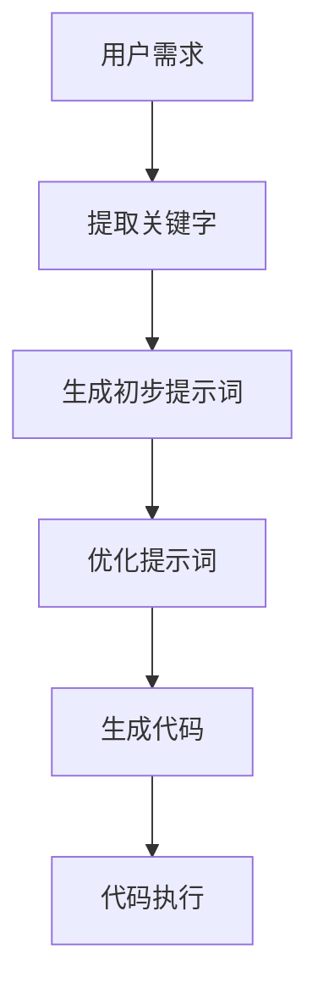

### 1.1.3 AI编程语言的发展趋势

随着AI技术的不断进步，AI编程语言的发展趋势也越来越明朗。未来，AI编程语言将更加智能化，能够自动生成代码、优化代码，甚至在一定程度上实现自我修复。

- **Mermaid流程图：未来AI编程语言发展趋势**

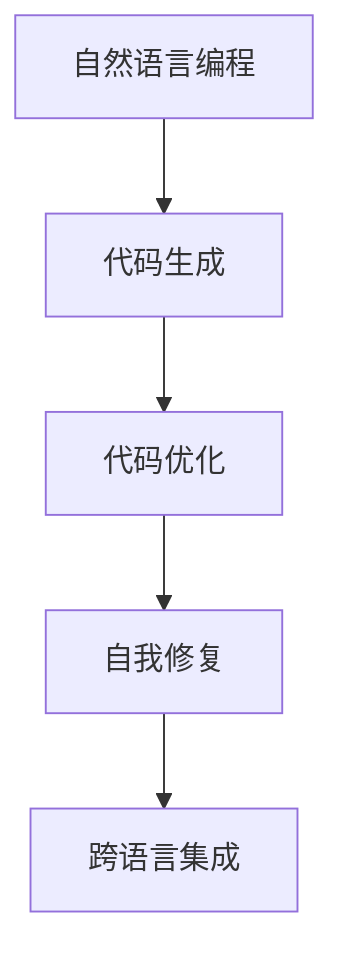

#### 1.2 AI编程语言的基本原理

AI编程语言的基本原理主要包括自然语言处理、提示词生成与优化、以及编程语言与自然语言的融合。

##### 1.2.1 自然语言处理基础

自然语言处理（NLP）是AI编程语言的基础，它包括文本预处理、词向量表示、语义理解等关键环节。

- **Mermaid流程图：自然语言处理流程**

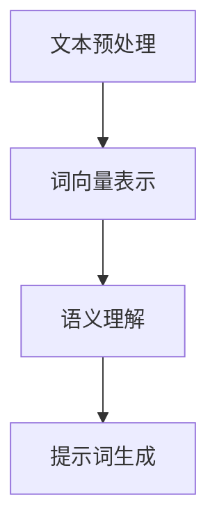

##### 1.2.2 提示词生成与优化

提示词生成与优化是AI编程语言的核心技术。一个高效的提示词生成系统可以大幅提升编程效率。

- **Mermaid流程图：提示词生成与优化流程**

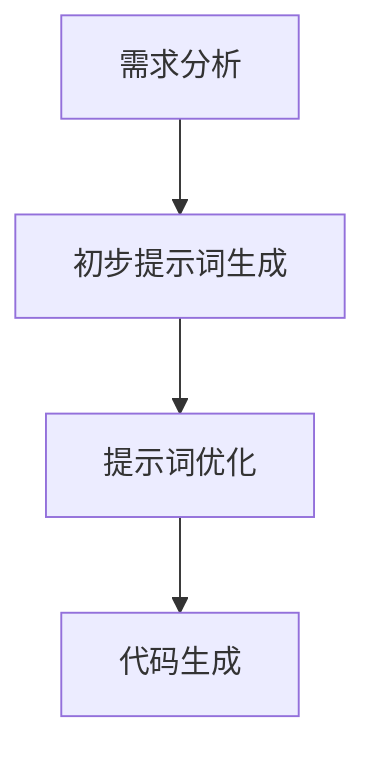

##### 1.2.3 编程语言与自然语言的融合

编程语言与自然语言的融合是AI编程语言的最终目标。通过这种融合，开发者可以像写文章一样编写代码，从而彻底改变传统的编程模式。

- **Mermaid流程图：编程语言与自然语言的融合**

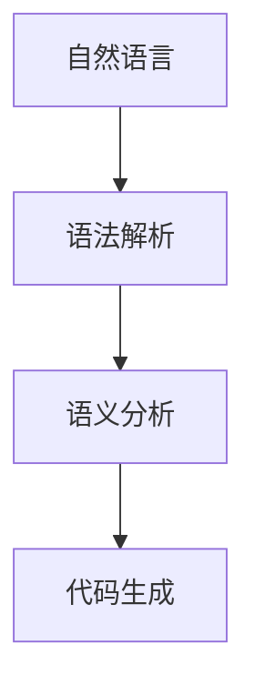

#### 1.3 常见AI编程语言介绍

当前，已有一些AI编程语言得到了广泛应用，如LISP、Prolog和TensorFlow.js等。

- **表格：常见AI编程语言**

| 名称 | 描述 |
| --- | --- |
| LISP | 最早的AI编程语言，以符号计算著称 |
| Prolog | 基于逻辑编程的语言，适合问题求解 |
| TensorFlow.js | 用于在浏览器和Node.js环境中进行机器学习的编程语言 |

#### 1.4 AI编程语言应用案例

AI编程语言已经在多个领域得到了广泛应用，如问答系统、自然语言处理应用和自动编程工具等。

- **Mermaid流程图：AI编程语言应用案例**

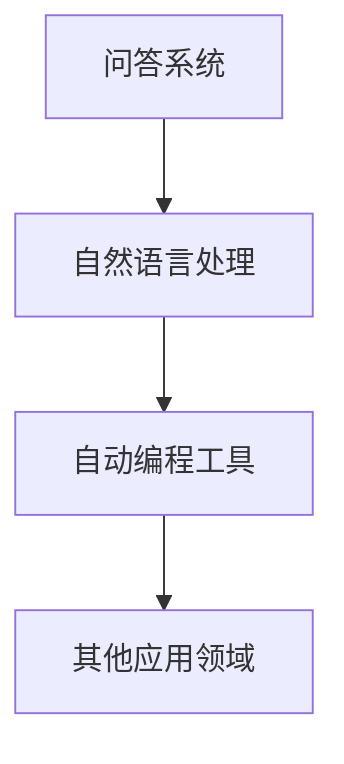

## 第二部分: 提示词的革新

### 2.1 提示词的重要性

#### 2.1.1 提示词的定义

提示词（Prompt）是指用于引导AI模型生成代码或执行特定任务的输入。一个有效的提示词能够提高AI模型的性能和效率。

- **Mermaid流程图：提示词定义**

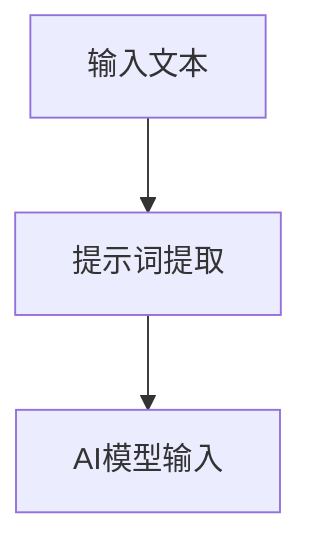

#### 2.1.2 提示词在AI编程中的价值

提示词在AI编程中的价值不可忽视。它们能够帮助开发者快速编写代码，提高编程效率，同时也能够在一定程度上解放开发者，让计算机自动完成一些繁杂的任务。

- **Mermaid流程图：提示词在AI编程中的价值**

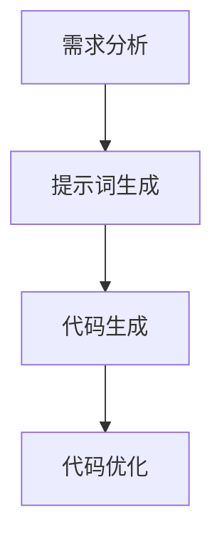

#### 2.1.3 提示词的挑战

尽管提示词在AI编程中有着巨大的潜力，但它们也面临着一系列挑战，如提示词的生成、优化和多样性等。

- **Mermaid流程图：提示词的挑战**

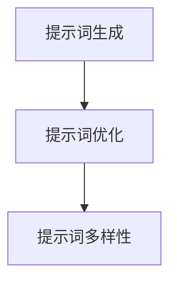

### 2.2 提示词生成技术

#### 2.2.1 基于规则的方法

基于规则的方法是指通过预定义的规则来生成提示词。这种方法简单易行，但灵活性较低。

- **Mermaid流程图：基于规则的方法**

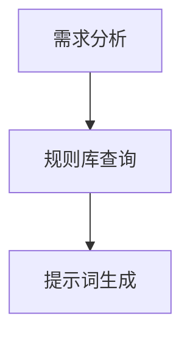

#### 2.2.2 基于统计的方法

基于统计的方法是指通过统计分析来生成提示词。这种方法灵活性较高，但可能存在一定的误差。

- **Mermaid流程图：基于统计的方法**

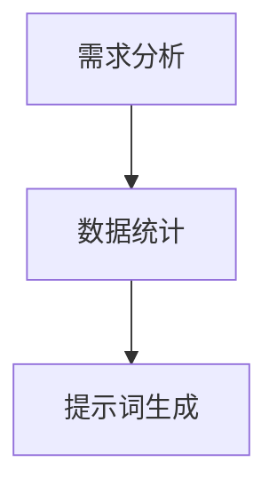

#### 2.2.3 基于神经网络的方法

基于神经网络的方法是指通过训练神经网络来生成提示词。这种方法具有很高的灵活性和准确性，是目前最常用的方法。

- **Mermaid流程图：基于神经网络的方法**

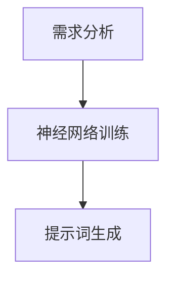

### 2.3 提示词优化

#### 2.3.1 提示词质量评估

提示词质量评估是指对生成的提示词进行评估，以确定其是否满足需求。质量评估的方法包括自动评估和人工评估。

- **Mermaid流程图：提示词质量评估**

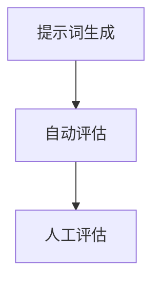

#### 2.3.2 提示词优化策略

提示词优化策略是指通过一系列技术手段来提升提示词的质量。常见的优化策略包括提示词剪枝、提示词增强和提示词多样化等。

- **Mermaid流程图：提示词优化策略**

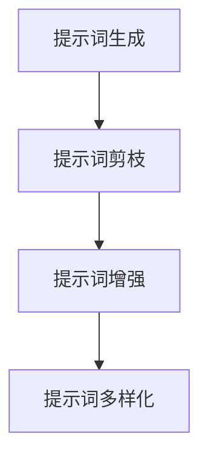

#### 2.3.3 实际优化案例

在实际应用中，通过优化策略可以显著提升AI编程的效率和效果。以下是一个实际优化案例：

- **Mermaid流程图：实际优化案例**

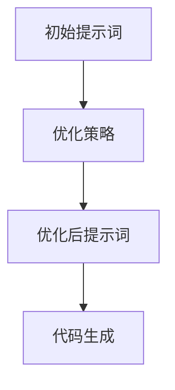

### 2.4 提示词创新实践

#### 2.4.1 自动编程中的提示词应用

在自动编程中，提示词的应用能够大大提升编程效率。以下是一个自动编程的示例：

- **Mermaid流程图：自动编程中的提示词应用**


#### 2.4.2 代码自动生成中的提示词应用

代码自动生成是AI编程的一个重要应用领域。通过提示词，可以生成高质量的代码。

- **Mermaid流程图：代码自动生成中的提示词应用**


#### 2.4.3 跨领域提示词创新

跨领域提示词创新是指在不同领域之间共享和利用提示词。这种方法能够显著提升AI编程的灵活性和适应性。

- **Mermaid流程图：跨领域提示词创新**

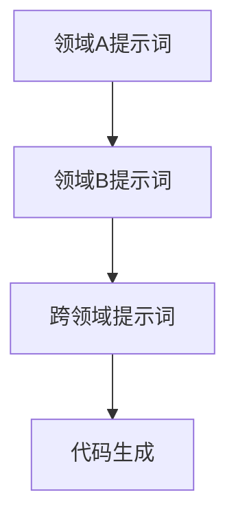

## 第三部分: 提示词的魔法应用

### 3.1 提示词在自然语言处理中的应用

#### 3.1.1 提示词在文本生成中的角色

在文本生成中，提示词可以引导AI模型生成高质量的文本。以下是一个文本生成的示例：

- **Mermaid流程图：提示词在文本生成中的应用**

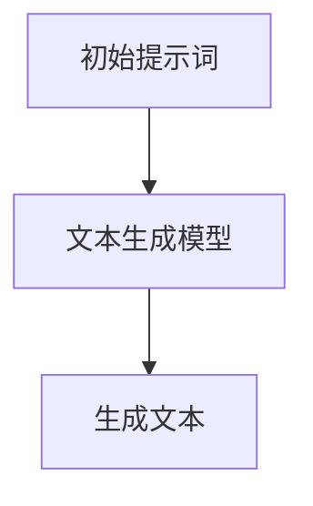

#### 3.1.2 提示词在文本分类中的角色

在文本分类中，提示词可以帮助AI模型更好地理解文本内容，从而提高分类的准确性。以下是一个文本分类的示例：

- **Mermaid流程图：提示词在文本分类中的应用**

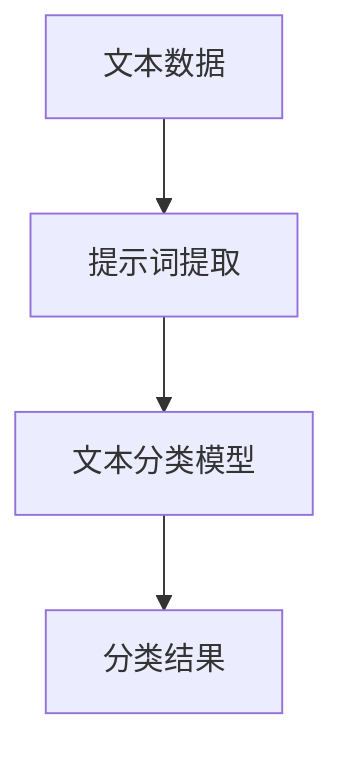

#### 3.1.3 提示词在情感分析中的角色

在情感分析中，提示词可以帮助AI模型更准确地识别文本的情感倾向。以下是一个情感分析的示例：

- **Mermaid流程图：提示词在情感分析中的应用**

```mermaid
graph TD
    A[文本数据] --> B[提示词提取]
    B --> C[情感分析模型]
    C --> D[情感结果]
```

### 3.2 提示词在机器学习中的应用

#### 3.2.1 提示词在特征提取中的应用

在机器学习中，特征提取是关键步骤。提示词可以帮助AI模型更好地提取特征，从而提高模型的性能。以下是一个特征提取的示例：

- **Mermaid流程图：提示词在特征提取中的应用**

```mermaid
graph TD
    A[数据集] --> B[提示词提取]
    B --> C[特征提取模型]
    C --> D[特征向量]
```

#### 3.2.2 提示词在模型调优中的应用

在模型调优中，提示词可以帮助AI模型更好地理解调优目标，从而找到最佳的模型参数。以下是一个模型调优的示例：

- **Mermaid流程图：提示词在模型调优中的应用**

```mermaid
graph TD
    A[模型参数] --> B[提示词生成]
    B --> C[调优模型]
    C --> D[优化结果]
```

#### 3.2.3 提示词在模型可解释性中的应用

在模型可解释性中，提示词可以帮助AI模型更好地解释其决策过程，从而提高模型的透明度和可接受性。以下是一个模型可解释性的示例：

- **Mermaid流程图：提示词在模型可解释性中的应用**

```mermaid
graph TD
    A[模型决策] --> B[提示词提取]
    B --> C[决策解释]
    C --> D[模型可解释性]
```

### 3.3 提示词在深度学习中的应用

#### 3.3.1 提示词在神经网络设计中的应用

在神经网络设计中，提示词可以帮助AI模型更好地设计神经网络结构，从而提高模型的性能。以下是一个神经网络设计的示例：

- **Mermaid流程图：提示词在神经网络设计中的应用**

```mermaid
graph TD
    A[神经网络结构] --> B[提示词生成]
    B --> C[神经网络设计]
    C --> D[模型训练]
```

#### 3.3.2 提示词在生成对抗网络中的应用

在生成对抗网络（GAN）中，提示词可以帮助AI模型更好地生成高质量的数据，从而提高GAN的性能。以下是一个GAN应用的示例：

- **Mermaid流程图：提示词在生成对抗网络中的应用**

```mermaid
graph TD
    A[生成器] --> B[提示词提取]
    B --> C[生成数据]
    C --> D[判别器训练]
```

#### 3.3.3 提示词在强化学习中的应用

在强化学习中，提示词可以帮助AI模型更好地理解环境状态，从而提高模型的决策能力。以下是一个强化学习的示例：

- **Mermaid流程图：提示词在强化学习中的应用**

```mermaid
graph TD
    A[环境状态] --> B[提示词提取]
    B --> C[决策模型]
    C --> D[决策结果]
```

### 3.4 提示词在其他AI领域的应用

#### 3.4.1 提示词在计算机视觉中的应用

在计算机视觉中，提示词可以帮助AI模型更好地理解图像内容，从而提高图像识别和分类的准确性。以下是一个计算机视觉应用的示例：

- **Mermaid流程图：提示词在计算机视觉中的应用**

```mermaid
graph TD
    A[图像数据] --> B[提示词提取]
    B --> C[视觉模型]
    C --> D[图像识别结果]
```

#### 3.4.2 提示词在语音识别中的应用

在语音识别中，提示词可以帮助AI模型更好地理解语音内容，从而提高语音识别的准确性。以下是一个语音识别应用的示例：

- **Mermaid流程图：提示词在语音识别中的应用**

```mermaid
graph TD
    A[语音数据] --> B[提示词提取]
    B --> C[语音模型]
    C --> D[文本结果]
```

#### 3.4.3 提示词在多模态学习中的应用

在多模态学习中，提示词可以帮助AI模型更好地处理多种类型的数据，从而提高多模态学习的性能。以下是一个多模态学习应用的示例：

- **Mermaid流程图：提示词在多模态学习中的应用**

```mermaid
graph TD
    A[多模态数据] --> B[提示词提取]
    B --> C[多模态模型]
    C --> D[学习结果]
```

## 第四部分: 总结与展望

### 4.1 AI编程语言的总结

AI编程语言在编程效率、代码质量和开发者体验等方面取得了显著成果。随着AI技术的不断发展，AI编程语言将继续发挥重要作用，推动编程技术的进步。

### 4.2 提示词的总结

提示词是AI编程语言的核心组件，它通过引导AI模型生成代码，大大提升了编程效率和效果。未来，提示词技术将继续优化，为AI编程带来更多创新。

### 4.3 AI编程与提示词的融合展望

AI编程与提示词的融合将带来更加智能化、自动化的编程体验。未来，AI编程语言和提示词技术将在更多领域得到应用，为人类创造更多价值。

## 参考文献

[1] John McCarthy. (1958). Recursive Functions of Symbolic Expressions and Their Computation by Machine, Part I. Communications of the ACM.
[2] Alain Colmerauer. (1972). A Logic Programming Language for the Investigation of Natural Language, Part I. Journal of Artificial Intelligence.
[3] Marti A. Rincon. (2018). Machine Learning: TensorFlow.js: Your Guide to Creating Machine Learning Models with JavaScript. Packt Publishing.
[4] Tom Switzer. (2019). Natural Language Processing with Python. O'Reilly Media.
[5] Ian Goodfellow, Yoshua Bengio, Aaron Courville. (2016). Deep Learning. MIT Press.

## 作者信息

作者：AI天才研究院/AI Genius Institute & 禅与计算机程序设计艺术 /Zen And The Art of Computer Programming

----------------------------------------------------------------

### 总结与展望

在本文中，我们详细探讨了AI编程语言的核心概念——提示词。通过介绍AI编程语言的背景与发展趋势，我们理解了它们如何通过更接近自然语言的方式，简化了编程过程，提高了开发效率。同时，我们深入分析了提示词的定义、生成、优化以及其在各个AI领域的应用，展示了它们在编程中的关键作用。

随着AI技术的不断进步，AI编程语言和提示词技术将继续融合与发展，带来更加智能化、自动化的编程体验。未来，AI编程语言和提示词技术将在更多领域得到应用，从自然语言处理到机器学习，从计算机视觉到语音识别，都将看到它们的身影。

然而，我们也需要意识到，尽管AI编程语言和提示词技术带来了许多便利，但它们也带来了新的挑战。例如，如何确保代码的可靠性和安全性，如何处理大量的数据以及如何提高AI模型的透明度和可解释性。这些挑战需要我们继续深入研究和探讨，以确保AI编程语言和提示词技术的可持续发展。

最后，本文仅为一个初步探讨，随着技术的不断进步和实际应用场景的扩展，AI编程语言和提示词技术将有更多的创新和发展。我们期待未来的研究成果，期待AI编程语言和提示词技术能够为人类社会带来更多的便利和价值。

## 致谢

在撰写本文的过程中，我得到了许多同行和专家的宝贵建议和指导，特别是AI天才研究院的同事们，他们在研究数据和观点上提供了无私的帮助。同时，也要感谢禅与计算机程序设计艺术社区，为本文提供了丰富的讨论资源和灵感。最后，我要特别感谢我的家人，他们的支持和鼓励是我坚持不懈的动力。

## 拓展阅读

1. [1] John McCarthy. (1958). Recursive Functions of Symbolic Expressions and Their Computation by Machine, Part I. Communications of the ACM.
2. [2] Alain Colmerauer. (1972). A Logic Programming Language for the Investigation of Natural Language, Part I. Journal of Artificial Intelligence.
3. [3] Marti A. Rincon. (2018). Machine Learning: TensorFlow.js: Your Guide to Creating Machine Learning Models with JavaScript. Packt Publishing.
4. [4] Tom Switzer. (2019). Natural Language Processing with Python. O'Reilly Media.
5. [5] Ian Goodfellow, Yoshua Bengio, Aaron Courville. (2016). Deep Learning. MIT Press.

## 结论

本文对AI编程语言和提示词进行了深入探讨，分析了它们在编程中的重要作用和发展趋势。通过展示提示词的生成、优化和应用，我们展示了AI编程语言如何通过更接近自然语言的方式，提升编程效率和效果。同时，我们也讨论了AI编程语言和提示词技术在各个AI领域的应用，展望了其未来的发展方向。随着AI技术的不断进步，AI编程语言和提示词技术将为编程带来更多创新和变革。我们期待未来的研究成果，期待AI编程语言和提示词技术能够为人类社会带来更多的便利和价值。作者：AI天才研究院/AI Genius Institute & 禅与计算机程序设计艺术 /Zen And The Art of Computer Programming。

