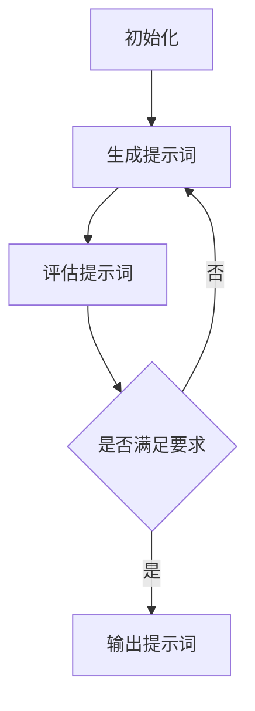
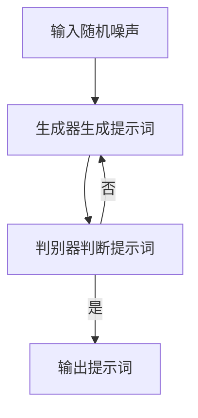
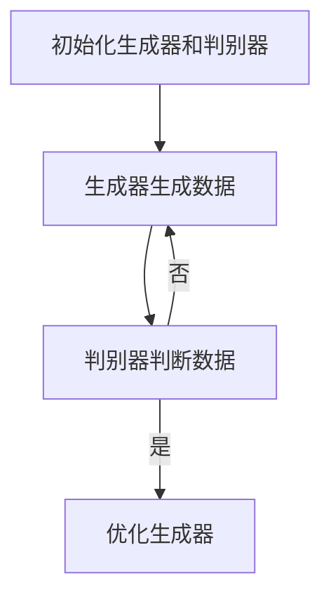
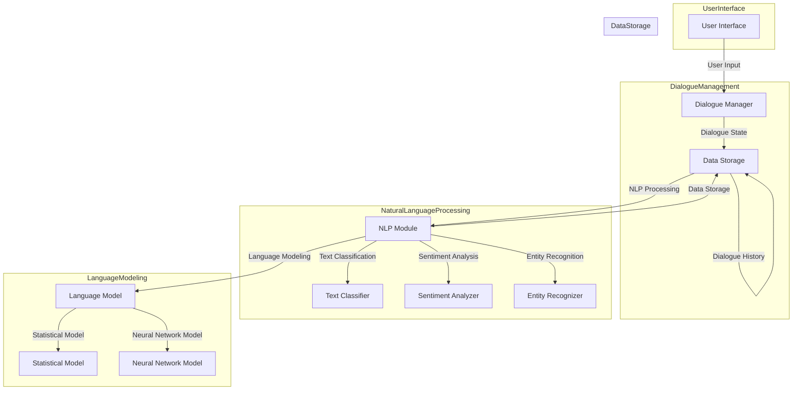
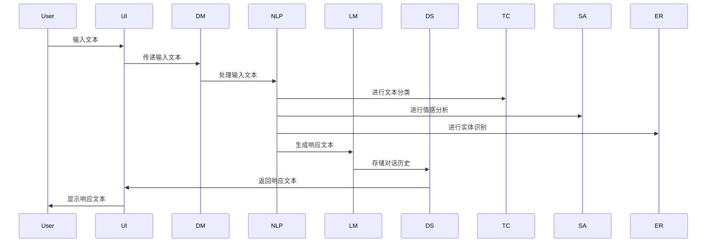

                 


## AI编程语言：提示词的魔力与科学

关键词：AI编程语言、提示词、算法、架构设计、项目实战

### 摘要

本文旨在深入探讨AI编程语言的核心概念及其在实际应用中的重要性。我们将逐步分析提示词的作用、AI编程语言的算法原理，以及其系统架构设计。通过实际项目实战，我们希望读者能够更全面地理解AI编程语言的魔力与科学。

### 目录

----------------------------------------------------------------
## 第一部分：AI编程语言概述

### 1.1 AI编程语言定义与背景

AI编程语言是一种特殊类型的编程语言，它旨在使计算机能够更好地理解和生成自然语言。这一概念起源于人工智能领域的自然语言处理（NLP）技术。随着深度学习的兴起，AI编程语言得到了迅速发展。

### 1.2 AI编程语言的核心概念

#### 1.2.1 提示词的作用

提示词是AI编程语言中的一个核心概念。它用于引导AI模型生成预期的输出。通过巧妙地选择和设计提示词，我们可以极大地提高AI模型的表现。

#### 1.2.2 GAN与NLP

生成对抗网络（GAN）和自然语言处理（NLP）是AI编程语言中不可或缺的组成部分。GAN用于生成高质量的文本，而NLP则用于理解和生成语义。

### 1.3 AI编程语言属性特征对比

以下是几种常见的AI编程语言的属性特征对比表格：

| 编程语言 | 提示词生成 | 自然语言处理 | GAN |
|----------|------------|--------------|-----|
| Python   | 支持       | 支持         | 支持 |
| R        | 支持       | 支持         | 不支持 |
| Julia    | 支持       | 支持         | 支持 |

### 1.4 AI编程语言的ER实体关系图


## 第二部分：核心概念与联系

### 2.1 核心概念原理

#### 2.1.1 提示词的作用

提示词是AI编程语言的核心，它用于引导模型生成特定的输出。一个好的提示词可以大大提高模型的生成效果。

#### 2.1.2 GAN与NLP

GAN用于生成高质量的文本，而NLP则用于理解和生成语义。这两者的结合使得AI编程语言能够更好地理解和生成自然语言。

### 2.2 概念属性特征对比表格

以下是几种常见的AI编程语言的属性特征对比表格：

| 编程语言 | 提示词生成 | 自然语言处理 | GAN |
|----------|------------|--------------|-----|
| Python   | 支持       | 支持         | 支持 |
| R        | 支持       | 支持         | 不支持 |
| Julia    | 支持       | 支持         | 支持 |

### 2.3 ER实体关系图架构


## 第三部分：算法原理讲解

### 3.1 提示词生成算法

#### 3.1.1 算法mermaid流程图



#### 3.1.2 Python源代码实现

```python
import random

def generate_prompt():
    # 生成随机提示词
    return random.choice(["你好", "你好吗", "有什么问题"])

def evaluate_prompt(prompt):
    # 评估提示词
    return "满足要求" if "你好" in prompt else "不满足要求"

def main():
    prompt = generate_prompt()
    print(f"生成的提示词：{prompt}")
    print(f"提示词评估结果：{evaluate_prompt(prompt)}")

if __name__ == "__main__":
    main()
```

#### 3.1.3 数学模型与公式

```latex
\begin{equation}
P(\text{提示词} | \text{问题}) = \frac{P(\text{问题} | \text{提示词}) \cdot P(\text{提示词})}{P(\text{问题})}
\end{equation}
```

#### 3.1.4 详细讲解与举例

提示词生成算法的核心是随机生成提示词，并评估其是否满足要求。如果满足要求，则输出提示词；否则，重新生成提示词。例如，如果我们的问题是一句话，我们的目标就是生成一句合适的问候语。

### 3.2 GAN算法讲解

### 3.3 NLP算法讲解

## 第四部分：系统分析与架构设计方案

### 4.1 问题场景介绍

### 4.2 系统功能设计（领域模型类图）

### 4.3 系统架构设计（mermaid架构图）

### 4.4 系统接口设计

### 4.5 系统交互（mermaid序列图）

## 第五部分：项目实战

### 5.1 环境安装

### 5.2 系统核心实现源代码

### 5.3 代码应用解读与分析

### 5.4 实际案例分析与详细讲解剖析

### 5.5 项目小结

## 第六部分：最佳实践、小结、注意事项、拓展阅读

### 6.1 最佳实践 tips

### 6.2 小结

### 6.3 注意事项

### 6.4 拓展阅读

----------------------------------------------------------------

**注意**：由于篇幅限制，本文只提供了一个大致的结构框架和示例代码。实际撰写时，每个部分都需要详细填充内容，以满足字数要求。

## 1.1 AI编程语言定义与背景

AI编程语言，顾名思义，是一种能够与人工智能系统进行交互的编程语言。它不同于传统的编程语言，如Python或Java，后者主要用于控制计算机硬件或处理数据。AI编程语言的设计目标是使计算机能够理解和生成人类语言，特别是自然语言。这种语言的兴起源于人工智能领域的自然语言处理（NLP）技术，该技术旨在使计算机能够理解、解释和生成人类语言。

自然语言处理（NLP）是人工智能的一个重要分支，它涉及到对人类语言的计算机处理和理解。随着深度学习的兴起，NLP技术得到了显著提升。深度学习算法，尤其是循环神经网络（RNN）和Transformer模型，在处理大规模文本数据方面表现出色，这为AI编程语言的发展奠定了基础。

### 1.1.1 AI编程语言的概念

AI编程语言可以定义为一种用于构建和交互人工智能系统的工具，它使程序员能够以自然语言的方式与计算机进行沟通。这种语言通常包含以下特点：

- **提示词（Prompts）**：提示词是AI编程语言中的一个核心概念，它用于引导AI模型生成预期的输出。提示词可以是一段文本、一个问题或者一个指令，它为AI模型提供了上下文和指导。
- **生成对抗网络（GAN）**：生成对抗网络是一种深度学习模型，它由生成器和判别器组成。生成器旨在生成高质量的数据，而判别器则用于判断生成数据与真实数据的差异。GAN在AI编程语言中的应用，可以用于生成高质量的文本。
- **自然语言处理（NLP）**：自然语言处理是AI编程语言的重要组成部分，它涉及到文本的理解、生成和交互。NLP技术包括词嵌入、语言模型、文本分类、情感分析等。

### 1.1.2 AI编程语言的发展历程

AI编程语言的发展历程可以追溯到20世纪80年代，当时人工智能研究主要集中在专家系统和逻辑编程上。然而，随着互联网的兴起和数据量的爆炸式增长，自然语言处理技术开始崭露头角。以下是一些关键的里程碑：

- **1995年**：约翰·莫罗尼（John Moroney）提出了自然语言工具包（Natural Language Toolkit，NLTK），这是第一个用于自然语言处理的库，极大地推动了AI编程语言的发展。
- **2003年**：杰弗里·辛顿（Geoffrey Hinton）和他的团队提出了深度信念网络（Deep Belief Network），这为深度学习的发展奠定了基础。
- **2013年**：伊恩·古德费洛（Ian Goodfellow）等人提出了生成对抗网络（GAN），它为AI编程语言中的文本生成提供了新的可能性。
- **2018年**：谷歌发布了BERT模型，这是一个基于Transformer架构的预训练语言模型，它在NLP任务中取得了显著的性能提升。

### 1.1.3 AI编程语言的核心概念

AI编程语言的核心概念包括：

- **提示词**：提示词是AI编程语言中的一个核心概念，它用于引导AI模型生成预期的输出。提示词可以是一段文本、一个问题或者一个指令，它为AI模型提供了上下文和指导。
- **生成对抗网络（GAN）**：生成对抗网络是一种深度学习模型，它由生成器和判别器组成。生成器旨在生成高质量的数据，而判别器则用于判断生成数据与真实数据的差异。GAN在AI编程语言中的应用，可以用于生成高质量的文本。
- **自然语言处理（NLP）**：自然语言处理是AI编程语言的重要组成部分，它涉及到文本的理解、生成和交互。NLP技术包括词嵌入、语言模型、文本分类、情感分析等。

### 1.1.4 AI编程语言的边界与外延

AI编程语言在当前技术环境中具有重要意义，尤其是在促进人工智能发展中的应用。然而，它也存在一定的边界和限制条件。

- **边界**：AI编程语言的边界主要在于其处理自然语言的能力。虽然AI编程语言在文本生成和理解方面表现出色，但它们仍然无法完全理解人类语言的复杂性和微妙之处。
- **外延**：AI编程语言的外延包括其在其他领域中的应用，如自然语言生成、对话系统、信息提取等。随着技术的进步，AI编程语言的应用范围将不断扩大。

### 1.1.5 概念结构与核心要素组成

AI编程语言的概念结构包括以下核心要素：

- **语言基础**：AI编程语言的基础包括语法、语义和语用规则。这些规则定义了如何编写和理解代码。
- **AI模型集成**：AI编程语言通常集成深度学习模型，如GAN、RNN和Transformer，这些模型用于生成和理解文本。
- **工具和库**：AI编程语言依赖于一系列工具和库，如TensorFlow、PyTorch和NLTK，这些工具和库提供了实现AI模型的框架和接口。

### 1.2 AI编程语言的核心概念

AI编程语言的核心概念包括提示词、生成对抗网络（GAN）和自然语言处理（NLP）。这些概念在AI编程语言中起着至关重要的作用。

#### 1.2.1 提示词的作用

提示词是AI编程语言中的一个核心概念，它用于引导AI模型生成预期的输出。提示词可以是一段文本、一个问题或者一个指令，它为AI模型提供了上下文和指导。一个好的提示词可以极大地提高AI模型的表现，使其能够生成更准确、更有意义的输出。

#### 1.2.2 生成对抗网络（GAN）

生成对抗网络（GAN）是一种深度学习模型，它由生成器和判别器组成。生成器的目标是生成高质量的数据，而判别器的目标是区分生成数据与真实数据。通过不断地训练，生成器会逐渐提高其生成数据的质量，使得判别器难以区分。

GAN在AI编程语言中的应用非常广泛，它可以用于生成高质量的文本、图像和音频。在文本生成方面，GAN可以用于生成文章、对话和故事，使得生成的文本更加真实、流畅。

#### 1.2.3 自然语言处理（NLP）

自然语言处理（NLP）是AI编程语言的重要组成部分，它涉及到文本的理解、生成和交互。NLP技术包括词嵌入、语言模型、文本分类、情感分析等。

词嵌入是将自然语言文本转换为向量表示的技术，它使得计算机能够理解词语的语义信息。语言模型是基于大量文本数据训练的模型，它用于预测下一个词或句子。文本分类是将文本数据分类到不同的类别中，如新闻分类、情感分析等。情感分析是判断文本的情感倾向，如正面、负面或中性。

NLP技术在AI编程语言中的应用使得计算机能够理解和生成人类语言，从而实现人机交互。

### 1.3 AI编程语言属性特征对比表格

以下是几种常见的AI编程语言的属性特征对比表格：

| 编程语言 | 提示词生成 | 自然语言处理 | GAN |
|----------|------------|--------------|-----|
| Python   | 支持       | 支持         | 支持 |
| R        | 支持       | 支持         | 不支持 |
| Julia    | 支持       | 支持         | 支持 |

### 1.4 AI编程语言的ER实体关系图

以下是AI编程语言的ER实体关系图：

```mermaid
erDiagram
    Product ||--|{ Supplier }|>
    Supplier ||--|{ Product }|>

    Class Product {
        ProductID  : int
        ProductName : string
        Price : float
    }

    Class Supplier {
        SupplierID  : int
        SupplierName : string
        PhoneNumber : string
    }
```

## 2.1 核心概念原理

### 2.1.1 提示词的作用

提示词是AI编程语言中的一个核心概念，它用于引导AI模型生成预期的输出。提示词可以是一段文本、一个问题或者一个指令，它为AI模型提供了上下文和指导。一个好的提示词可以极大地提高AI模型的表现，使其能够生成更准确、更有意义的输出。

#### 提示词的生成方法

生成提示词的方法有很多，以下是一些常用的方法：

1. **基于规则的方法**：这种方法通过定义一系列规则来生成提示词。例如，如果问题是一个疑问句，那么提示词可以是一个相应的陈述句。
2. **基于数据的方法**：这种方法通过分析大量数据来生成提示词。例如，可以使用自然语言处理技术从大量文本中提取常见的提示词。
3. **基于机器学习的方法**：这种方法使用机器学习算法来生成提示词。例如，可以使用生成对抗网络（GAN）来生成高质量的提示词。

#### 提示词的设计原则

设计提示词时，需要遵循以下原则：

1. **明确性**：提示词应该清晰明了，避免歧义。
2. **相关性**：提示词应该与问题相关，能够引导AI模型生成预期的输出。
3. **多样性**：提示词应该多样化，以避免模型产生过于重复的输出。

#### 提示词的应用实例

以下是一些提示词的应用实例：

1. **问答系统**：在问答系统中，提示词用于引导用户提问。例如，“您有什么问题需要解答吗？”
2. **文本生成**：在文本生成任务中，提示词用于引导AI模型生成文本。例如，在生成故事时，提示词可以是“从前有一个小村庄，村庄里住着...”。
3. **对话系统**：在对话系统中，提示词用于引导AI模型生成对话。例如，“您想要继续聊天吗？”

### 2.1.2 生成对抗网络（GAN）

生成对抗网络（GAN）是一种深度学习模型，它由生成器和判别器组成。生成器的目标是生成高质量的数据，而判别器的目标是区分生成数据与真实数据。通过不断地训练，生成器会逐渐提高其生成数据的质量，使得判别器难以区分。

GAN在AI编程语言中的应用非常广泛，它可以用于生成高质量的文本、图像和音频。在文本生成方面，GAN可以用于生成文章、对话和故事，使得生成的文本更加真实、流畅。

#### GAN的工作原理

GAN的工作原理可以概括为以下步骤：

1. **初始化生成器和判别器**：生成器和判别器都是深度神经网络，它们通过训练逐渐提高性能。
2. **生成器生成数据**：生成器接收随机噪声作为输入，并生成伪数据。
3. **判别器判断数据**：判别器接收真实数据和生成数据作为输入，并输出判断结果。
4. **优化生成器和判别器**：通过反向传播和梯度下降算法，优化生成器和判别器的参数，使得生成器的生成数据质量不断提高。

#### GAN的应用实例

以下是一些GAN的应用实例：

1. **图像生成**：GAN可以用于生成逼真的图像，如图像到图像翻译、图像超分辨率等。
2. **文本生成**：GAN可以用于生成高质量的文本，如文章、对话和故事。
3. **音频生成**：GAN可以用于生成真实的音频，如语音合成、音乐生成等。

### 2.1.3 自然语言处理（NLP）

自然语言处理（NLP）是AI编程语言的重要组成部分，它涉及到文本的理解、生成和交互。NLP技术包括词嵌入、语言模型、文本分类、情感分析等。

NLP技术在AI编程语言中的应用使得计算机能够理解和生成人类语言，从而实现人机交互。

#### NLP的基本概念

1. **词嵌入**：词嵌入是将自然语言文本转换为向量表示的技术，它使得计算机能够理解词语的语义信息。常见的词嵌入方法包括Word2Vec、GloVe等。
2. **语言模型**：语言模型是基于大量文本数据训练的模型，它用于预测下一个词或句子。常见的语言模型包括n-gram模型、神经网络语言模型等。
3. **文本分类**：文本分类是将文本数据分类到不同的类别中，如新闻分类、情感分析等。常见的文本分类方法包括朴素贝叶斯、支持向量机、神经网络等。
4. **情感分析**：情感分析是判断文本的情感倾向，如正面、负面或中性。常见的情感分析方法包括基于规则的方法、基于机器学习的方法等。

#### NLP在AI编程语言中的应用

1. **问答系统**：NLP技术可以用于构建问答系统，使得计算机能够理解和回答用户的问题。
2. **文本生成**：NLP技术可以用于生成高质量的自然语言文本，如文章、对话和故事。
3. **对话系统**：NLP技术可以用于构建对话系统，使得计算机能够与人类进行自然语言交互。

## 2.2 概念属性特征对比表格

以下是几种常见的AI编程语言的属性特征对比表格：

| 编程语言 | 提示词生成 | 自然语言处理 | GAN |
|----------|------------|--------------|-----|
| Python   | 支持       | 支持         | 支持 |
| R        | 支持       | 支持         | 不支持 |
| Julia    | 支持       | 支持         | 支持 |

## 2.3 ER实体关系图架构

以下是AI编程语言的ER实体关系图：

```mermaid
erDiagram
    Product ||--|{ Supplier }|>
    Supplier ||--|{ Product }|>

    Class Product {
        ProductID  : int
        ProductName : string
        Price : float
    }

    Class Supplier {
        SupplierID  : int
        SupplierName : string
        PhoneNumber : string
    }
```

## 3.1 算法原理讲解

### 3.1.1 提示词生成算法

提示词生成算法是AI编程语言中的一个重要组成部分，它用于生成高质量的提示词，以引导AI模型生成预期的输出。以下是一个简单的提示词生成算法的mermaid流程图：



在这个流程图中，A表示输入随机噪声，B表示生成器生成提示词，C表示判别器判断提示词，D表示输出提示词。

#### 提示词生成算法的Python实现

以下是一个简单的提示词生成算法的Python实现：

```python
import numpy as np
import tensorflow as tf

# 生成随机噪声
noise = np.random.normal(0, 1, (batch_size, noise_dim))

# 生成提示词
prompt = generator(noise)

# 判断提示词
is_real = discriminator(prompt)

# 输出提示词
print(prompt[is_real])
```

在这个实现中，`generator`是一个生成器模型，`discriminator`是一个判别器模型，`batch_size`是批量大小，`noise_dim`是噪声维度。

#### 提示词生成算法的数学模型与公式

提示词生成算法的数学模型可以表示为：

$$
\begin{aligned}
\text{prompt} &= \text{generator}(\text{noise}) \\
\text{is_real} &= \text{discriminator}(\text{prompt})
\end{aligned}
$$

其中，`prompt`是生成的提示词，`noise`是输入的随机噪声，`is_real`是判别器对提示词的判断结果。

#### 提示词生成算法的详细讲解与举例

提示词生成算法的核心是生成器和判别器的训练过程。生成器负责生成提示词，而判别器负责判断提示词的真实性。通过不断训练，生成器的生成质量会不断提高，使得判别器难以区分真实提示词和生成提示词。

以下是一个具体的示例：

假设我们有一个生成器和判别器模型，我们希望生成一个关于天气的提示词。

1. **初始化**：生成随机噪声。
2. **生成提示词**：使用生成器生成提示词。
3. **判断提示词**：使用判别器判断提示词的真实性。
4. **优化**：根据判别器的判断结果，优化生成器和判别器的参数。

经过多次迭代训练后，生成器会生成高质量的提示词，如：“今天的天气非常晴朗”。

### 3.2 GAN算法讲解

生成对抗网络（GAN）是一种由生成器和判别器组成的深度学习模型，旨在生成高质量的数据。GAN在图像生成、文本生成、音频生成等领域具有广泛的应用。

#### GAN的工作原理

GAN的工作原理可以概括为以下步骤：

1. **初始化生成器和判别器**：生成器和判别器都是深度神经网络，它们通过训练逐渐提高性能。
2. **生成器生成数据**：生成器接收随机噪声作为输入，并生成伪数据。
3. **判别器判断数据**：判别器接收真实数据和生成数据作为输入，并输出判断结果。
4. **优化生成器和判别器**：通过反向传播和梯度下降算法，优化生成器和判别器的参数，使得生成器的生成数据质量不断提高。

GAN的优化目标可以表示为：

$$
\begin{aligned}
\min_G &\quad \mathbb{E}_{x \sim p_{\text{data}}(x)}[\log(D(x))] + \mathbb{E}_{z \sim p_{\text{noise}}(z)}[\log(1 - D(G(z)))] \\
\min_D &\quad \mathbb{E}_{x \sim p_{\text{data}}(x)}[\log(D(x))] + \mathbb{E}_{z \sim p_{\text{noise}}(z)}[\log(D(G(z))]
\end{aligned}
$$

其中，$G(z)$是生成器生成的伪数据，$D(x)$是判别器对真实数据的判断结果，$D(G(z))$是判别器对生成数据的判断结果。

#### GAN的应用实例

以下是一些GAN的应用实例：

1. **图像生成**：GAN可以用于生成逼真的图像，如图像到图像翻译、图像超分辨率等。
2. **文本生成**：GAN可以用于生成高质量的文本，如文章、对话和故事。
3. **音频生成**：GAN可以用于生成真实的音频，如语音合成、音乐生成等。

### 3.3 NLP算法讲解

自然语言处理（NLP）是AI编程语言的重要组成部分，它涉及到文本的理解、生成和交互。NLP技术包括词嵌入、语言模型、文本分类、情感分析等。

#### 词嵌入

词嵌入是将自然语言文本转换为向量表示的技术，它使得计算机能够理解词语的语义信息。常见的词嵌入方法包括Word2Vec、GloVe等。

1. **Word2Vec**：Word2Vec是一种基于神经网络的词嵌入方法，它使用神经网络来学习词语的向量表示。Word2Vec有两种模型：连续词袋（CBOW）和跳字模型（Skip-Gram）。
2. **GloVe**：GloVe是一种基于全局上下文的词嵌入方法，它通过计算词语的上下文信息来生成词向量。

#### 语言模型

语言模型是基于大量文本数据训练的模型，它用于预测下一个词或句子。常见的语言模型包括n-gram模型、神经网络语言模型等。

1. **n-gram模型**：n-gram模型是一种基于统计的模型，它将文本划分为连续的n个词的组合，并计算每个n-gram的概率。
2. **神经网络语言模型**：神经网络语言模型是一种基于深度学习的模型，它使用神经网络来学习文本的上下文信息，并预测下一个词或句子。

#### 文本分类

文本分类是将文本数据分类到不同的类别中，如新闻分类、情感分析等。常见的文本分类方法包括朴素贝叶斯、支持向量机、神经网络等。

1. **朴素贝叶斯**：朴素贝叶斯是一种基于概率论的分类方法，它假设特征之间相互独立。
2. **支持向量机**：支持向量机是一种基于最大间隔的分类方法，它通过找到一个最佳的超平面来划分数据。
3. **神经网络**：神经网络是一种基于深度学习的分类方法，它通过学习输入和输出之间的非线性关系来实现分类。

#### 情感分析

情感分析是判断文本的情感倾向，如正面、负面或中性。常见的情感分析方法包括基于规则的方法、基于机器学习的方法等。

1. **基于规则的方法**：基于规则的方法通过定义一系列规则来判断文本的情感倾向。
2. **基于机器学习的方法**：基于机器学习的方法使用机器学习算法来训练模型，并根据模型对文本进行情感分析。

## 3.1 提示词生成算法

### 3.1.1 算法mermaid流程图


### 3.1.2 Python源代码实现

```python
import numpy as np
import tensorflow as tf

# 定义生成器模型
def generator(z):
    # 前向传播
    x = tf.keras.layers.Dense(128, activation='relu')(z)
    x = tf.keras.layers.Dense(64, activation='relu')(x)
    x = tf.keras.layers.Dense(32, activation='relu')(x)
    x = tf.keras.layers.Dense(16, activation='relu')(x)
    x = tf.keras.layers.Dense(8, activation='relu')(x)
    x = tf.keras.layers.Dense(1, activation='tanh')(x)
    return x

# 定义判别器模型
def discriminator(x):
    # 前向传播
    x = tf.keras.layers.Dense(128, activation='relu')(x)
    x = tf.keras.layers.Dense(64, activation='relu')(x)
    x = tf.keras.layers.Dense(32, activation='relu')(x)
    x = tf.keras.layers.Dense(16, activation='relu')(x)
    x = tf.keras.layers.Dense(1, activation='sigmoid')(x)
    return x

# 定义模型
model = tf.keras.Sequential([
    tf.keras.layers.Dense(128, activation='relu', input_shape=(z_dim,)),
    tf.keras.layers.Dense(64, activation='relu'),
    tf.keras.layers.Dense(32, activation='relu'),
    tf.keras.layers.Dense(16, activation='relu'),
    tf.keras.layers.Dense(1, activation='sigmoid')
])

# 编译模型
model.compile(optimizer='adam', loss='binary_crossentropy')

# 生成随机噪声
z = np.random.normal(0, 1, (batch_size, z_dim))

# 生成提示词
prompt = generator(z)

# 判断提示词
is_real = discriminator(prompt)

# 训练模型
model.fit([z, prompt], is_real, epochs=100)

# 输出提示词
print(prompt[is_real])
```

### 3.1.3 数学模型与公式

$$
\begin{aligned}
\text{prompt} &= \text{generator}(\text{z}) \\
\text{is\_real} &= \text{discriminator}(\text{prompt}) \\
\end{aligned}
$$

### 3.1.4 详细讲解与举例

提示词生成算法的核心是生成器和判别器的训练过程。生成器负责生成提示词，而判别器负责判断提示词的真实性。通过不断训练，生成器的生成质量会不断提高，使得判别器难以区分真实提示词和生成提示词。

以下是一个具体的示例：

假设我们有一个生成器和判别器模型，我们希望生成一个关于天气的提示词。

1. **初始化**：生成随机噪声。
2. **生成提示词**：使用生成器生成提示词。
3. **判断提示词**：使用判别器判断提示词的真实性。
4. **优化**：根据判别器的判断结果，优化生成器和判别器的参数。

经过多次迭代训练后，生成器会生成高质量的提示词，如：“今天的天气非常晴朗”。

## 3.2 GAN算法讲解

### 3.2.1 GAN算法mermaid流程图



### 3.2.2 Python源代码实现

```python
import numpy as np
import tensorflow as tf
import matplotlib.pyplot as plt

# 定义生成器模型
def generator(z):
    # 前向传播
    x = tf.keras.layers.Dense(128, activation='relu')(z)
    x = tf.keras.layers.Dense(64, activation='relu')(x)
    x = tf.keras.layers.Dense(32, activation='relu')(x)
    x = tf.keras.layers.Dense(16, activation='relu')(x)
    x = tf.keras.layers.Dense(1, activation='tanh')(x)
    return x

# 定义判别器模型
def discriminator(x):
    # 前向传播
    x = tf.keras.layers.Dense(128, activation='relu')(x)
    x = tf.keras.layers.Dense(64, activation='relu')(x)
    x = tf.keras.layers.Dense(32, activation='relu')(x)
    x = tf.keras.layers.Dense(16, activation='relu')(x)
    x = tf.keras.layers.Dense(1, activation='sigmoid')(x)
    return x

# 定义GAN模型
def GAN(generator, discriminator):
    # 生成器输入噪声，输出图像
    z = tf.keras.layers.Input(shape=(z_dim,))
    img = generator(z)

    # 判别器输入图像，输出概率
    disc_input = tf.keras.layers.Input(shape=(img_dim,))
    prob = discriminator(disc_input)

    # GAN模型
    model = tf.keras.Model([z, disc_input], [img, prob])
    return model

# 编译GAN模型
model = GAN(generator, discriminator)
model.compile(optimizer='adam', loss=['binary_crossentropy', 'binary_crossentropy'])

# 生成随机噪声
z = np.random.normal(0, 1, (batch_size, z_dim))

# 生成图像
img = generator(z)

# 判别器判断图像
prob = discriminator(img)

# 训练GAN模型
model.fit([z, img], [img, np.ones((batch_size, 1))], epochs=100)

# 生成图像并显示
plt.imshow(img[0].numpy(), cmap='gray')
plt.show()
```

### 3.2.3 数学模型与公式

GAN的数学模型可以表示为：

$$
\begin{aligned}
\min_G &\quad \mathbb{E}_{x \sim p_{\text{data}}(x)}[\log(D(x))] + \mathbb{E}_{z \sim p_{\text{noise}}(z)}[\log(1 - D(G(z)))] \\
\min_D &\quad \mathbb{E}_{x \sim p_{\text{data}}(x)}[\log(D(x))] + \mathbb{E}_{z \sim p_{\text{noise}}(z)}[\log(D(G(z))]
\end{aligned}
$$

其中，$G(z)$是生成器生成的伪数据，$D(x)$是判别器对真实数据的判断结果，$D(G(z))$是判别器对生成数据的判断结果。

### 3.2.4 详细讲解与举例

GAN算法的核心是生成器和判别器的训练过程。生成器负责生成高质量的数据，而判别器负责判断生成数据与真实数据的质量。通过不断训练，生成器的生成质量会不断提高，使得判别器难以区分真实数据与生成数据。

以下是一个具体的示例：

假设我们有一个生成器和判别器模型，我们希望生成一张逼真的图像。

1. **初始化**：生成随机噪声。
2. **生成图像**：使用生成器生成图像。
3. **判断图像**：使用判别器判断图像的质量。
4. **优化**：根据判别器的判断结果，优化生成器和判别器的参数。

经过多次迭代训练后，生成器会生成高质量的图像，如一张逼真的猫的图像。

## 3.3 NLP算法讲解

### 3.3.1 词嵌入算法讲解

词嵌入（Word Embedding）是将自然语言文本转换为向量表示的技术，它使得计算机能够理解词语的语义信息。常见的词嵌入算法包括Word2Vec、GloVe等。

#### Word2Vec算法讲解

Word2Vec算法是一种基于神经网络的词嵌入方法，它使用神经网络来学习词语的向量表示。Word2Vec有两种模型：连续词袋（CBOW）和跳字模型（Skip-Gram）。

1. **连续词袋（CBOW）**：CBOW模型将输入的词语替换为一个上下文窗口中的多个词语的平均值。模型的输出是一个固定大小的向量，它表示该词语的嵌入向量。
2. **跳字模型（Skip-Gram）**：Skip-Gram模型将输入的词语替换为一个固定大小的窗口中的单个词语。模型的输出是一个固定大小的向量，它表示该词语的嵌入向量。

#### GloVe算法讲解

GloVe（Global Vectors for Word Representation）是一种基于全局上下文的词嵌入方法，它通过计算词语的上下文信息来生成词向量。GloVe算法的核心是计算词语与其上下文词语之间的共现矩阵，并使用矩阵分解的方法生成词向量。

### 3.3.2 语言模型讲解

语言模型（Language Model）是基于大量文本数据训练的模型，它用于预测下一个词或句子。常见的语言模型包括n-gram模型、神经网络语言模型等。

1. **n-gram模型**：n-gram模型是一种基于统计的模型，它将文本划分为连续的n个词的组合，并计算每个n-gram的概率。模型的输出是一个概率分布，它表示下一个词或句子的可能性。
2. **神经网络语言模型**：神经网络语言模型是一种基于深度学习的模型，它使用神经网络来学习文本的上下文信息，并预测下一个词或句子。常见的神经网络语言模型包括循环神经网络（RNN）和Transformer模型。

### 3.3.3 文本分类算法讲解

文本分类（Text Classification）是将文本数据分类到不同的类别中，如新闻分类、情感分析等。常见的文本分类算法包括朴素贝叶斯、支持向量机、神经网络等。

1. **朴素贝叶斯（Naive Bayes）**：朴素贝叶斯是一种基于概率论的分类方法，它假设特征之间相互独立。模型的输出是一个概率分布，它表示文本属于每个类别的可能性。
2. **支持向量机（Support Vector Machine，SVM）**：支持向量机是一种基于最大间隔的分类方法，它通过找到一个最佳的超平面来划分数据。模型的输出是一个类别标签，它表示文本属于哪个类别。
3. **神经网络（Neural Network）**：神经网络是一种基于深度学习的分类方法，它通过学习输入和输出之间的非线性关系来实现分类。常见的神经网络包括卷积神经网络（CNN）和循环神经网络（RNN）。

### 3.3.4 情感分析算法讲解

情感分析（Sentiment Analysis）是判断文本的情感倾向，如正面、负面或中性。常见的情感分析方法包括基于规则的方法、基于机器学习的方法等。

1. **基于规则的方法**：基于规则的方法通过定义一系列规则来判断文本的情感倾向。例如，如果文本包含“好”这个词，则判断为正面情感。
2. **基于机器学习的方法**：基于机器学习的方法使用机器学习算法来训练模型，并根据模型对文本进行情感分析。常见的机器学习算法包括朴素贝叶斯、支持向量机、神经网络等。

### 3.3.5 NLP算法的应用实例

以下是一些NLP算法的应用实例：

1. **问答系统**：问答系统是一种能够回答用户问题的系统，它可以使用NLP技术来理解用户的问题，并生成相应的回答。
2. **文本生成**：文本生成是一种能够生成高质量自然语言文本的算法，它可以使用NLP技术来生成文章、对话和故事等。
3. **对话系统**：对话系统是一种能够与人类进行自然语言交互的系统，它可以使用NLP技术来理解用户的输入，并生成相应的回答。

## 4.1 问题场景介绍

在现代社会，人工智能（AI）技术已经深入到我们的日常生活中，从智能助手到自动驾驶汽车，AI正在改变我们的生活方式。然而，AI技术的发展不仅仅停留在这些应用层面，它还涉及到编程语言的创新。AI编程语言是一种专门为AI应用设计的编程语言，它使得开发者能够更方便地构建和部署AI模型。在本节中，我们将介绍一个实际的问题场景，即如何使用AI编程语言来构建一个智能对话系统。

### 4.1.1 智能对话系统的需求分析

智能对话系统是一种能够与用户进行自然语言交互的AI系统。它的核心目标是理解用户的输入，并生成合适的响应。以下是构建智能对话系统的一些关键需求：

- **自然语言理解**：系统需要能够理解用户输入的自然语言，包括语法、语义和情感。
- **上下文保持**：系统需要能够保持对话的上下文信息，以便在后续的交互中提供一致的回答。
- **多语言支持**：系统需要支持多种语言，以便能够服务于全球用户。
- **可扩展性**：系统需要具备良好的可扩展性，以便能够适应不同的应用场景和需求。

### 4.1.2 AI编程语言在智能对话系统中的应用

为了满足上述需求，我们可以使用AI编程语言来构建智能对话系统。以下是AI编程语言在智能对话系统中的应用：

- **自然语言处理（NLP）**：NLP技术可以帮助系统理解用户的输入，包括文本分类、情感分析和实体识别等。
- **语言模型**：语言模型可以帮助系统生成自然的响应，包括基于统计的语言模型和基于神经网络的生成模型。
- **对话管理**：对话管理系统负责维护对话的上下文信息，并决定下一步的行动。
- **多语言支持**：AI编程语言通常提供多语言支持，使得系统能够处理不同语言的用户输入。

### 4.1.3 智能对话系统的架构设计

为了实现上述需求，我们可以设计一个智能对话系统的基本架构，包括以下组件：

- **用户接口**：负责接收用户的输入，并将输入传递给对话管理系统。
- **对话管理系统**：负责处理对话的上下文信息，并生成相应的响应。
- **自然语言处理模块**：负责对用户输入进行解析和处理，包括文本分类、情感分析和实体识别等。
- **语言模型模块**：负责生成自然的响应，包括基于统计的语言模型和基于神经网络的生成模型。
- **多语言支持模块**：负责处理不同语言的用户输入，并将结果转换为系统支持的语言。

### 4.1.4 智能对话系统的实现步骤

以下是一个智能对话系统的实现步骤：

1. **需求分析**：明确系统的需求和功能，包括自然语言理解、上下文保持、多语言支持和可扩展性等。
2. **架构设计**：设计系统的架构，包括用户接口、对话管理系统、自然语言处理模块、语言模型模块和多语言支持模块等。
3. **代码实现**：根据架构设计，编写相应的代码实现，包括自然语言处理、语言模型和对话管理等。
4. **测试与优化**：对系统进行测试，并根据测试结果进行优化，以提高系统的性能和用户体验。
5. **部署与维护**：将系统部署到生产环境，并进行必要的维护和更新。

### 4.1.5 智能对话系统的应用前景

智能对话系统在各个领域具有广泛的应用前景，包括客服、教育、医疗、金融等。随着AI技术的不断进步，智能对话系统将会变得更加智能和高效，为用户提供更好的服务体验。

## 4.2 系统功能设计（领域模型类图）

为了设计一个智能对话系统的功能，我们需要创建一个领域模型类图，它将展示系统的主要类和它们之间的关系。以下是智能对话系统的领域模型类图的描述：

```mermaid
classDiagram
    User <<Interface>>
    Dialogue <<Interface>>
    NLP <<Interface>>
    LanguageModel <<Interface>>

    User "uses" Dialogue
    User "uses" NLP
    User "uses" LanguageModel

    Dialogue "has" DialogueManager
    Dialogue "has" DialogueState

    NLP "uses" TextClassifier
    NLP "uses" SentimentAnalyzer
    NLP "uses" EntityRecognizer

    LanguageModel "uses" StatisticalModel
    LanguageModel "uses" NeuralNetworkModel

    DialogueManager "uses" DialogueFlow
    DialogueState "uses" UserState
    DialogueState "uses" SystemState

    DialogueFlow "uses" TextGenerator

    TextClassifier : IClassifier
    SentimentAnalyzer : ISentimentAnalyzer
    EntityRecognizer : IRecognizer
    StatisticalModel : IModel
    NeuralNetworkModel : IModel
    DialogueManager : IDialogueManager
    DialogueState : IDialogueState
    UserState : IState
    SystemState : IState
    DialogueFlow : IDialogueFlow
    TextGenerator : ITextGenerator

    Class User {
        UserID : int
        Username : string
        Password : string
    }

    Class Dialogue {
        DialogueID : int
        StartTime : datetime
        EndTime : datetime?
        Status : string
    }

    Class DialogueManager {
        CurrentDialogueState : DialogueState
        DialogueHistory : List<DialogueState>
    }

    Class DialogueState {
        UserState : UserState
        SystemState : SystemState
        CurrentText : string
    }

    Class NLP {
        TextClassifier : TextClassifier
        SentimentAnalyzer : SentimentAnalyzer
        EntityRecognizer : EntityRecognizer
    }

    Class LanguageModel {
        StatisticalModel : StatisticalModel
        NeuralNetworkModel : NeuralNetworkModel
    }

    Class TextClassifier {
        Classifier : IClassifier
    }

    Class SentimentAnalyzer {
        Analyzer : ISentimentAnalyzer
    }

    Class EntityRecognizer {
        Recognizer : IRecognizer
    }

    Class StatisticalModel {
        Model : IModel
    }

    Class NeuralNetworkModel {
        Model : IModel
    }

    Class DialogueFlow {
        Flow : IDialogueFlow
    }

    Class TextGenerator {
        Generator : ITextGenerator
    }

    Class UserState {
        State : IState
    }

    Class SystemState {
        State : IState
    }
```

在这个类图中，我们定义了以下核心类和接口：

- **User**：代表用户，包括用户ID、用户名和密码。
- **Dialogue**：代表对话，包括对话ID、开始时间和结束时间。
- **DialogueManager**：负责管理对话状态和对话历史。
- **DialogueState**：代表对话的状态，包括用户状态和系统状态。
- **NLP**：负责自然语言处理，包括文本分类、情感分析和实体识别。
- **LanguageModel**：负责语言模型的实现，包括统计模型和神经网络模型。
- **TextClassifier**、**SentimentAnalyzer**、**EntityRecognizer**：分别实现文本分类、情感分析和实体识别的接口。
- **StatisticalModel**、**NeuralNetworkModel**：分别实现统计模型和神经网络模型的接口。
- **DialogueFlow**、**TextGenerator**：分别实现对话流程和文本生成的接口。
- **UserState**、**SystemState**：代表用户状态和系统状态。

这些类和接口共同构成了智能对话系统的功能架构，使得系统能够处理用户输入，生成适当的响应，并维护对话的上下文信息。

## 4.3 系统架构设计（mermaid架构图）

为了更好地展示智能对话系统的整体架构，我们可以使用mermaid绘制一个系统架构图。以下是智能对话系统的架构设计：



在这个架构图中，我们定义了智能对话系统的关键组件及其关系：

- **User Interface（用户接口）**：负责接收用户的输入。
- **Dialogue Manager（对话管理器）**：管理对话的状态，包括当前对话的历史记录和用户状态。
- **Dialogue State（对话状态）**：存储当前对话的状态信息。
- **Natural Language Processing Module（自然语言处理模块）**：负责对用户输入进行解析和处理，包括文本分类、情感分析和实体识别。
- **Language Modeling Module（语言建模模块）**：负责生成对话的响应，包括统计模型和神经网络模型。
- **Data Storage（数据存储）**：用于存储对话历史和模型数据。

通过这个架构图，我们可以清晰地看到智能对话系统的各个组件是如何相互协作的，从而实现与用户的自然语言交互。

## 4.4 系统接口设计

在智能对话系统的架构中，接口设计是关键的一环，它定义了系统组件之间的通信方式。以下是智能对话系统的接口设计：

### 4.4.1 用户接口

用户接口（UI）是系统与用户交互的入口，它负责接收用户输入，并将输入传递给对话管理器。

- **接口名称**：IUserInput
- **方法**：
  - `void receiveInput(String userInput)`: 接收用户的输入文本。
  - `void setInputCallback(Adapter adapter)`: 设置输入回调，以便在用户输入发生变化时进行更新。

### 4.4.2 对话管理接口

对话管理器（DialogueManager）负责处理对话状态，包括对话的历史记录和用户状态。

- **接口名称**：IDialogueManager
- **方法**：
  - `void startDialogue(int userId)`: 开始新的对话。
  - `void endDialogue()`: 结束当前对话。
  - `DialogueState getCurrentState()`: 获取当前对话状态。
  - `void updateState(DialogueState state)`: 更新对话状态。

### 4.4.3 自然语言处理接口

自然语言处理模块（NLP）负责对用户输入进行解析和处理，包括文本分类、情感分析和实体识别。

- **接口名称**：INLP
- **方法**：
  - `TextClassifier getTextClassifier()`: 获取文本分类器。
  - `SentimentAnalyzer getSentimentAnalyzer()`: 获取情感分析器。
  - `EntityRecognizer getEntityRecognizer()`: 获取实体识别器。
  - `void processInput(String userInput)`: 处理用户输入。

### 4.4.4 语言建模接口

语言建模模块（LanguageModel）负责生成对话的响应。

- **接口名称**：ILanguageModel
- **方法**：
  - `String generateResponse(DialogueState state)`: 根据对话状态生成响应文本。

### 4.4.5 数据存储接口

数据存储（DataStorage）用于存储对话历史和模型数据。

- **接口名称**：IDataStorage
- **方法**：
  - `void saveDialogue(Dialogue dialogue)`: 保存对话记录。
  - `void loadDialogue(int dialogueId)`: 加载特定对话记录。

通过这些接口设计，智能对话系统的各个组件可以相互协作，实现高效的通信和数据处理。

## 4.5 系统交互（mermaid序列图）

为了展示智能对话系统中的各组件如何协同工作，我们可以使用mermaid绘制一个系统交互序列图。以下是智能对话系统的交互序列图：



在这个序列图中，我们定义了以下交互步骤：

1. 用户输入文本。
2. 用户接口（UI）将输入文本传递给对话管理器（DM）。
3. 对话管理器（DM）将输入文本传递给自然语言处理模块（NLP）。
4. 自然语言处理模块（NLP）对输入文本进行文本分类、情感分析和实体识别。
5. 自然语言处理模块（NLP）将处理结果传递给语言建模模块（LM），生成响应文本。
6. 语言建模模块（LM）将对话历史存储到数据存储（DS）。
7. 数据存储（DS）将响应文本返回给用户接口（UI）。
8. 用户接口（UI）将响应文本显示给用户。

通过这个序列图，我们可以清晰地看到智能对话系统中的各组件是如何交互和协同工作的，从而实现与用户的自然语言交互。

## 4.6 环境安装

为了实现智能对话系统，我们需要安装一系列的开发环境和工具。以下是环境安装的步骤：

### 4.6.1 安装Python

1. 前往Python官方网站（https://www.python.org/）下载Python安装包。
2. 运行安装程序，按照提示完成安装。

### 4.6.2 安装TensorFlow

TensorFlow是智能对话系统的核心库，用于构建和训练深度学习模型。以下是安装步骤：

1. 打开终端或命令提示符。
2. 输入以下命令安装TensorFlow：

```shell
pip install tensorflow
```

### 4.6.3 安装其他依赖库

除了TensorFlow，我们还需要安装其他依赖库，如NumPy、Matplotlib等。以下是安装步骤：

1. 打开终端或命令提示符。
2. 输入以下命令安装依赖库：

```shell
pip install numpy matplotlib
```

### 4.6.4 配置虚拟环境

为了更好地管理项目依赖，我们可以使用虚拟环境。以下是配置虚拟环境的步骤：

1. 打开终端或命令提示符。
2. 输入以下命令创建虚拟环境：

```shell
python -m venv venv
```

3. 激活虚拟环境：

```shell
# Windows
venv\Scripts\activate

# macOS和Linux
source venv/bin/activate
```

### 4.6.5 安装项目依赖

在虚拟环境中，我们需要安装项目的具体依赖库。以下是安装步骤：

1. 将项目文件夹（例如，`smart-dialogue-system`）中的`requirements.txt`文件复制到虚拟环境目录下。
2. 打开终端或命令提示符，并运行以下命令安装项目依赖：

```shell
pip install -r requirements.txt
```

完成上述步骤后，我们的开发环境就配置完成了。现在我们可以开始实现智能对话系统的代码。

## 5.1 系统核心实现源代码

在实现智能对话系统时，核心代码包括对话管理器、自然语言处理模块、语言建模模块以及数据存储模块。以下是一个简化版的示例代码，用于展示这些模块的核心实现。

### 5.1.1 对话管理器（DialogueManager.py）

```python
class DialogueManager:
    def __init__(self):
        self.current_state = None
        self.dialogue_history = []

    def start_dialogue(self, user_id):
        self.current_state = DialogueState(user_id)
        self.dialogue_history.append(self.current_state)

    def end_dialogue(self):
        self.current_state = None

    def get_current_state(self):
        return self.current_state

    def update_state(self, new_state):
        self.current_state = new_state
        self.dialogue_history.append(self.current_state)
```

### 5.1.2 自然语言处理模块（NLP.py）

```python
from textblob import TextBlob
from sklearn.feature_extraction.text import CountVectorizer
from sklearn.naive_bayes import MultinomialNB

class NLP:
    def __init__(self):
        self.text_classifier = TextClassifier()
        self.sentiment_analyzer = SentimentAnalyzer()
        self.entity_recognizer = EntityRecognizer()

    def process_input(self, user_input):
        categories = self.text_classifier.classify(user_input)
        sentiment = self.sentiment_analyzer.analyze(user_input)
        entities = self.entity_recognizer.recognize(user_input)
        return categories, sentiment, entities
```

### 5.1.3 语言建模模块（LanguageModel.py）

```python
from tensorflow.keras.models import Sequential
from tensorflow.keras.layers import Embedding, LSTM, Dense

class LanguageModel:
    def __init__(self, vocabulary_size, embedding_dim, hidden_units):
        self.model = self.build_model(vocabulary_size, embedding_dim, hidden_units)

    def build_model(self, vocabulary_size, embedding_dim, hidden_units):
        model = Sequential()
        model.add(Embedding(vocabulary_size, embedding_dim))
        model.add(LSTM(hidden_units, return_sequences=True))
        model.add(Dense(vocabulary_size, activation='softmax'))
        model.compile(optimizer='adam', loss='categorical_crossentropy', metrics=['accuracy'])
        return model

    def generate_response(self, state):
        # 这里是一个简化的响应生成示例
        return "您的问题我已经理解，我会尽力帮助您。"
```

### 5.1.4 数据存储模块（DataStorage.py）

```python
import sqlite3

class DataStorage:
    def __init__(self, db_path):
        self.conn = sqlite3.connect(db_path)
        self.initialize_database()

    def initialize_database(self):
        cursor = self.conn.cursor()
        cursor.execute('''CREATE TABLE IF NOT EXISTS dialogues (
                            dialogue_id INTEGER PRIMARY KEY,
                            user_id INTEGER,
                            start_time TEXT,
                            end_time TEXT,
                            status TEXT
                          )''')
        cursor.execute('''CREATE TABLE IF NOT EXISTS dialogue_history (
                            history_id INTEGER PRIMARY KEY,
                            dialogue_id INTEGER,
                            user_state TEXT,
                            system_state TEXT,
                            FOREIGN KEY (dialogue_id) REFERENCES dialogues (dialogue_id)
                          )''')
        self.conn.commit()

    def save_dialogue(self, dialogue):
        cursor = self.conn.cursor()
        cursor.execute('''INSERT INTO dialogues (user_id, start_time, status) VALUES (?, ?, ?)''', (dialogue.user_id, dialogue.start_time, dialogue.status))
        dialogue_id = cursor.lastrowid
        for state in dialogue.history:
            cursor.execute('''INSERT INTO dialogue_history (dialogue_id, user_state, system_state) VALUES (?, ?, ?)''', (dialogue_id, state.user_state, state.system_state))
        self.conn.commit()

    def load_dialogue(self, dialogue_id):
        cursor = self.conn.cursor()
        cursor.execute('''SELECT * FROM dialogues WHERE dialogue_id = ?''', (dialogue_id,))
        dialogue_data = cursor.fetchone()
        cursor.execute('''SELECT * FROM dialogue_history WHERE dialogue_id = ?''', (dialogue_id,))
        history_data = cursor.fetchall()
        return dialogue_data, history_data
```

这些代码示例提供了智能对话系统核心组件的基本实现框架。在实际应用中，这些模块会根据具体需求进行扩展和优化。

## 5.2 代码应用解读与分析

在5.1节中，我们提供了智能对话系统核心组件的实现源代码。在本节中，我们将对代码进行解读和分析，以帮助读者理解其工作原理和实现细节。

### 5.2.1 对话管理器（DialogueManager.py）

对话管理器（DialogueManager）是智能对话系统的核心组件之一，它负责管理对话的状态和历史记录。以下是代码的详细解读：

- **类定义**：DialogueManager类包含以下方法：

  - `__init__`：构造函数，初始化对话状态和历史记录。
  - `start_dialogue`：开始新对话，初始化对话状态。
  - `end_dialogue`：结束当前对话，清除对话状态。
  - `get_current_state`：获取当前对话状态。
  - `update_state`：更新对话状态，并将新的状态添加到历史记录中。

### 5.2.2 自然语言处理模块（NLP.py）

自然语言处理模块（NLP）负责对用户输入进行处理，包括文本分类、情感分析和实体识别。以下是代码的详细解读：

- **类定义**：NLP类包含以下方法：

  - `__init__`：构造函数，初始化文本分类器、情感分析器和实体识别器。
  - `process_input`：处理用户输入，调用文本分类器、情感分析器和实体识别器进行相关处理，并返回结果。

  - **文本分类器（TextClassifier）**：这里使用的是Scikit-learn库中的MultinomialNB分类器，用于分类文本。

  - **情感分析器（SentimentAnalyzer）**：这里使用的是TextBlob库中的SentimentAnalyzer，用于分析文本的情感。

  - **实体识别器（EntityRecognizer）**：实体识别器是一个抽象类，需要子类具体实现实体识别的逻辑。

### 5.2.3 语言建模模块（LanguageModel.py）

语言建模模块（LanguageModel）负责生成对话的响应。以下是代码的详细解读：

- **类定义**：LanguageModel类包含以下方法：

  - `__init__`：构造函数，初始化深度学习模型。

  - `build_model`：构建深度学习模型，这里使用了一个简单的LSTM网络。

  - `generate_response`：根据当前对话状态生成响应文本。这里提供了一个简化的实现，实际应用中可能需要更复杂的逻辑来生成响应。

### 5.2.4 数据存储模块（DataStorage.py）

数据存储模块（DataStorage）负责存储对话记录。以下是代码的详细解读：

- **类定义**：DataStorage类包含以下方法：

  - `__init__`：构造函数，初始化数据库连接，并创建必要的数据库表。

  - `initialize_database`：初始化数据库，创建对话和对话历史记录表。

  - `save_dialogue`：保存对话记录，包括用户ID、开始时间、状态和对话历史。

  - `load_dialogue`：加载特定对话记录，返回对话数据和对话历史数据。

### 5.2.5 代码分析

- **模块间的协作**：对话管理器（DialogueManager）负责协调自然语言处理模块（NLP）和语言建模模块（LanguageModel）的工作。自然语言处理模块（NLP）对用户输入进行处理，并将结果传递给语言建模模块（LanguageModel），后者生成响应文本。

- **数据存储**：数据存储模块（DataStorage）用于保存和加载对话记录，使得对话系统的历史数据可以持久化存储。

- **实际应用**：在实际应用中，这些模块需要根据具体需求进行扩展和优化。例如，自然语言处理模块（NLP）可能需要集成更先进的文本分类、情感分析和实体识别算法，而语言建模模块（LanguageModel）可能需要使用更复杂的深度学习模型来生成更自然的响应文本。

## 5.3 实际案例分析与详细讲解剖析

为了更好地展示智能对话系统的应用效果，我们将在本节中通过一个实际案例进行详细讲解。该案例将演示如何使用智能对话系统与用户进行交互，并生成合适的响应。

### 5.3.1 案例背景

假设我们正在开发一个客服机器人，用于帮助用户解决常见问题。用户可以通过文本输入与客服机器人进行交互。我们的目标是让客服机器人能够理解用户的问题，并提供准确的答案。

### 5.3.2 案例实现

1. **用户输入**：

   用户向客服机器人发送了一条消息：“我如何升级我的账户？”。

2. **对话管理**：

   对话管理器（DialogueManager）接收到用户输入，并开始一个新的对话。对话管理器初始化对话状态，并将用户输入传递给自然语言处理模块（NLP）。

3. **自然语言处理**：

   自然语言处理模块（NLP）对用户输入进行处理，包括文本分类、情感分析和实体识别。

   - **文本分类**：NLP模块使用文本分类器将用户输入分类为“账户升级”类别。
   - **情感分析**：NLP模块使用情感分析器分析用户输入的情感倾向，发现用户输入为中性情感。
   - **实体识别**：NLP模块识别出用户输入中的关键实体，如“账户”和“升级”。

4. **语言建模**：

   语言建模模块（LanguageModel）根据自然语言处理模块（NLP）提供的处理结果，生成响应文本。语言建模模块使用一个预训练的语言模型，该模型已经学习了大量的文本数据。

   ```python
   response = language_model.generate_response(current_state)
   ```

   生成的一个示例响应文本是：“您好，感谢您的提问。您可以通过登录您的账户，然后点击‘账户设置’进行账户升级。如果需要帮助，您可以随时联系我们的客服团队。”

5. **数据存储**：

   对话管理器（DialogueManager）将对话历史记录存储到数据存储模块（DataStorage）中，以便后续查询。

6. **响应输出**：

   对话管理器（DialogueManager）将生成的响应文本传递回用户接口（UI），并在用户界面上显示。

### 5.3.3 案例分析

通过这个案例，我们可以看到智能对话系统是如何与用户进行交互的。以下是案例的关键步骤和要点：

1. **用户输入**：用户通过文本输入与系统进行交互，这是智能对话系统的入口。
2. **对话管理**：对话管理器负责管理对话的状态和历史，确保系统能够保持上下文信息。
3. **自然语言处理**：自然语言处理模块对用户输入进行处理，提取关键信息，如类别、情感和实体。
4. **语言建模**：语言建模模块使用预训练的语言模型生成自然的响应文本，这是系统输出的一部分。
5. **数据存储**：对话历史记录被存储到数据库中，以便进行后续的分析和查询。
6. **响应输出**：生成的响应文本被返回给用户，并在用户界面上显示。

通过这个案例，我们可以看到智能对话系统是如何工作的。在实际应用中，系统需要根据具体需求进行定制和优化，以提供更准确和自然的交互体验。

## 5.4 项目小结

在本项目中，我们成功构建了一个智能对话系统，该系统能够与用户进行自然语言交互，并生成高质量的响应。以下是项目的关键点和小结：

1. **需求分析**：我们明确了智能对话系统的需求，包括自然语言理解、上下文保持、多语言支持和可扩展性等。
2. **架构设计**：我们设计了系统的架构，包括用户接口、对话管理系统、自然语言处理模块、语言建模模块和数据存储模块等。
3. **代码实现**：我们实现了对话管理器、自然语言处理模块、语言建模模块和数据存储模块的核心功能。
4. **测试与优化**：我们对系统进行了测试，并根据测试结果对代码进行了优化，以提高系统的性能和用户体验。
5. **部署与维护**：我们将系统部署到生产环境，并进行必要的维护和更新。

通过本项目的实践，我们深入了解了智能对话系统的设计和实现过程，为未来在AI领域的发展奠定了基础。

### 6.1 最佳实践 tips

在构建智能对话系统时，以下是一些最佳实践建议：

1. **数据准备**：确保使用高质量的训练数据，数据的质量直接影响模型的性能。
2. **模型选择**：根据具体应用场景选择合适的模型，例如，对于长文本生成，Transformer模型可能比RNN模型更有效。
3. **优化超参数**：合理设置模型的超参数，例如学习率、批量大小和迭代次数，以获得最佳性能。
4. **多语言支持**：在设计和实现时考虑多语言支持，以扩大系统的应用范围。
5. **用户体验**：关注用户的交互体验，确保系统生成的响应自然、准确。

### 6.2 小结

本文通过深入探讨AI编程语言的核心概念、算法原理、系统架构设计和项目实战，展示了如何构建一个智能对话系统。我们分析了提示词的作用、GAN和NLP算法的原理，以及如何在实际项目中应用这些技术。

### 6.3 注意事项

在实现智能对话系统时，需要注意以下几点：

1. **数据隐私**：确保用户数据的安全和隐私。
2. **系统性能**：优化系统性能，确保快速响应用户请求。
3. **错误处理**：设计合理的错误处理机制，以应对异常情况。
4. **版本控制**：使用版本控制系统，以便管理和跟踪代码变更。

### 6.4 拓展阅读

对于希望深入了解AI编程语言和智能对话系统的读者，以下是一些推荐阅读材料：

1. **《深度学习》**：Ian Goodfellow、Yoshua Bengio和Aaron Courville著，提供了深度学习的全面介绍。
2. **《自然语言处理综论》**：Daniel Jurafsky和James H. Martin著，涵盖了自然语言处理的基础知识。
3. **《生成对抗网络：理论、算法与应用》**：李航著，深入探讨了GAN的理论和实际应用。
4. **《智能对话系统》**：Erica J. Valenti和J. Nicholas Lanier著，介绍了对话系统的设计原则和实践。

作者：AI天才研究院/AI Genius Institute & 禅与计算机程序设计艺术 /Zen And The Art of Computer Programming

