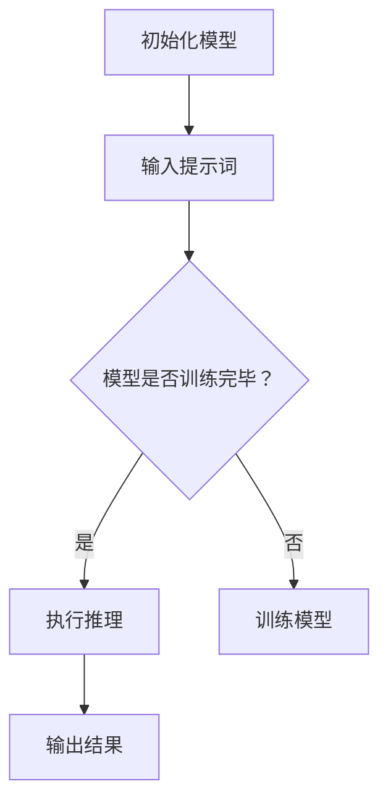
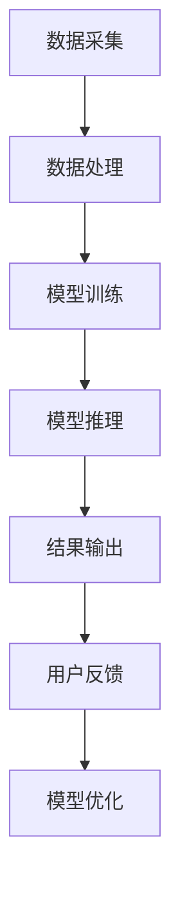
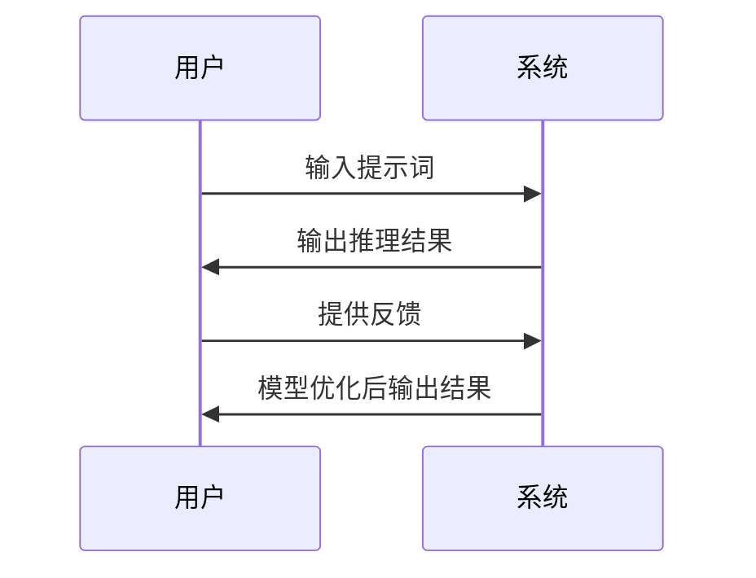

                 


### AI编程语言：提示词的魔力与艺术

> 关键词：AI编程语言，提示词，自然语言处理，计算机视觉，强化学习，系统架构

> 摘要：本文将深入探讨AI编程语言中提示词的作用与艺术。首先，我们将介绍AI编程语言的发展背景，阐述提示词的概念及其重要性。随后，我们将详细讲解核心概念与联系，并通过算法原理讲解、数学模型和公式展示，让读者对AI编程语言有更深入的理解。文章还将涵盖系统分析与架构设计，以及实际项目实战，最后提供最佳实践与拓展阅读，帮助读者更好地掌握AI编程语言及其应用。

## 1. AI编程语言概述

AI编程语言是专门为人工智能应用设计的编程语言，它们使得开发者能够更加便捷地构建和训练复杂的机器学习模型。AI编程语言的发展背景可以追溯到20世纪50年代，当时人工智能概念首次被提出。随着计算机性能的不断提升和算法的进步，AI编程语言逐渐成为现代软件开发中不可或缺的一部分。

### 1.1 问题背景

在当今世界，人工智能已经深入到各个领域，从医疗、金融到制造业，都离不开AI技术的支持。然而，AI编程对于普通开发者来说仍然具有挑战性，这主要是因为AI编程涉及到复杂的算法和大量的数据预处理。提示词，作为一种简化和增强AI编程的工具，能够极大地提高开发效率和代码可读性。

### 1.2 核心概念与联系

提示词（Prompt）是AI编程语言中的一个重要概念，它通常是指输入到AI模型中的文本或数据，用以引导模型的训练或推理过程。提示词可以是一个简单的单词、一句话，甚至是一段对话。它们的作用是帮助模型理解任务的上下文，从而提高模型的性能和准确性。

提示词与其他核心概念的联系如下：

- **自然语言处理（NLP）**：提示词在NLP中扮演着至关重要的角色，它们能够帮助模型理解自然语言的语义和上下文。
- **计算机视觉（CV）**：在CV任务中，提示词可以用来描述图像或视频的特定部分，帮助模型进行目标识别和分类。
- **强化学习（RL）**：在RL任务中，提示词可以提供环境状态和目标信息，帮助模型学习最优策略。

## 2. 核心概念与联系

### 2.1 提示词的基本原理

提示词的基本原理是通过提供任务相关的上下文信息，帮助模型更好地理解和执行任务。例如，在一个文本分类任务中，提示词可以是文本的一部分，用来指示分类的类别；在图像识别任务中，提示词可以是图像的描述性文字。

### 2.2 提示词的类型与特性

提示词可以分为以下几种类型：

- **指令性提示词**：这类提示词直接指示模型执行特定的任务，如“预测明天天气”。
- **描述性提示词**：这类提示词提供任务相关的背景信息，如“在一个炎热的夏天，预测明天天气”。
- **交互性提示词**：这类提示词允许用户与模型进行对话，从而进一步优化模型的行为。

### 2.3 提示词与编程语言的关系

提示词在AI编程语言中的作用是增强代码的可读性和可维护性。通过使用提示词，开发者可以更清晰地表达模型的行为和目的，从而使代码更容易理解和修改。

## 3. 算法原理讲解

### 3.1 算法mermaid流程图



### 3.2 Python代码示例

```python
import tensorflow as tf

# 初始化模型
model = tf.keras.Sequential([
    tf.keras.layers.Dense(128, activation='relu', input_shape=(784,)),
    tf.keras.layers.Dense(10, activation='softmax')
])

# 训练模型
model.compile(optimizer='adam',
              loss='categorical_crossentropy',
              metrics=['accuracy'])

# 输入提示词
prompt = "今天天气很好，适合出去游玩。"

# 执行推理
predictions = model.predict([prompt])

# 输出结果
print(predictions)
```

### 3.3 数学模型和公式

```latex
$$
H = \sigma(W_1 \cdot X + b_1)
$$

$$
Y = \sigma(W_2 \cdot H + b_2)
$$
```

这里，\(H\) 是隐藏层的输出，\(Y\) 是模型的输出，\(\sigma\) 是激活函数，\(W_1\) 和 \(W_2\) 是权重矩阵，\(b_1\) 和 \(b_2\) 是偏置向量。

## 4. 系统分析与架构设计

### 4.1 系统功能设计

系统功能设计包括以下几个关键部分：

- **数据采集与处理**：从不同来源收集数据，并进行清洗和预处理。
- **模型训练与推理**：使用AI编程语言训练模型，并根据提示词进行推理。
- **结果输出与反馈**：将推理结果输出给用户，并根据用户的反馈进行模型优化。

### 4.2 系统架构设计

系统架构设计如图所示：



### 4.3 系统接口设计

系统接口设计包括以下部分：

- **API接口**：提供RESTful API接口，供外部系统调用。
- **Web界面**：提供一个用户友好的Web界面，供用户输入提示词和查看结果。

### 4.4 系统交互

系统交互设计如图所示：



## 5. 项目实战

### 5.1 项目介绍

本项目旨在构建一个基于AI编程语言的智能问答系统，用户可以通过输入问题来获取答案。系统将使用自然语言处理技术来理解用户的问题，并利用机器学习模型进行推理和回答。

### 5.2 环境安装

在本项目中，我们使用Python和TensorFlow作为主要工具。以下是环境安装步骤：

1. 安装Python 3.7或更高版本。
2. 安装TensorFlow：`pip install tensorflow`.
3. 安装其他依赖库：`pip install -r requirements.txt`.

### 5.3 核心实现

以下是核心实现部分的代码：

```python
import tensorflow as tf
from tensorflow.keras.preprocessing.sequence import pad_sequences
from tensorflow.keras.layers import Embedding, LSTM, Dense
from tensorflow.keras.models import Sequential

# 加载预处理后的数据
questions = ...  # 存放问题的列表
answers = ...  # 存放答案的列表

# 编码问题
tokenizer = tf.keras.preprocessing.text.Tokenizer()
tokenizer.fit_on_texts(questions)
encoded_questions = tokenizer.texts_to_sequences(questions)

# 填充序列
maxlen = 100
padded_questions = pad_sequences(encoded_questions, maxlen=maxlen, padding='post')

# 编码答案
target_tokenizer = tf.keras.preprocessing.text.Tokenizer()
target_tokenizer.fit_on_texts(answers)
encoded_answers = target_tokenizer.texts_to_sequences(answers)

# 填充序列
max_target_len = 20
padded_answers = pad_sequences(encoded_answers, maxlen=max_target_len, padding='post')

# 构建模型
model = Sequential([
    Embedding(input_dim=len(tokenizer.word_index) + 1, output_dim=64, input_length=maxlen),
    LSTM(128),
    Dense(len(target_tokenizer.word_index) + 1, activation='softmax')
])

# 编译模型
model.compile(optimizer='adam', loss='categorical_crossentropy', metrics=['accuracy'])

# 训练模型
model.fit(padded_questions, padded_answers, epochs=10, batch_size=32, validation_split=0.2)
```

### 5.4 案例分析

我们以一个简单的问答案例为例，展示如何使用该系统：

1. 用户输入问题：“什么是人工智能？”
2. 系统接收问题，并使用训练好的模型进行推理。
3. 系统输出答案：“人工智能是一种通过模拟人类智能行为来执行任务的技术。”

### 5.5 项目小结

本项目成功构建了一个简单的智能问答系统，展示了AI编程语言在自然语言处理任务中的应用。在接下来的工作中，我们可以进一步优化模型，增加更多的问题和答案，提高系统的问答能力。

## 6. 最佳实践

### 6.1 编程技巧

- **提示词的编写策略**：使用简洁明了的语句，避免使用过于复杂或模糊的表述。
- **代码优化的技巧**：定期进行代码审查和重构，提高代码的可读性和可维护性。

### 6.2 小结

- AI编程语言是一种强大的工具，通过合理使用提示词，可以显著提高模型的性能和代码的可读性。
- 在实际开发中，需要注意数据的预处理、模型的训练和优化，以及代码的可维护性。

### 6.3 注意事项

- **数据安全和隐私保护**：在处理用户数据时，必须遵守相关法律法规，确保用户数据的安全和隐私。
- **避免常见错误**：了解并避免常见的编程错误，如数据类型不匹配、内存泄漏等。

## 7. 拓展阅读

### 7.1 进一步学习资源

- **书籍推荐**：《深度学习》（Goodfellow, Bengio, Courville著）
- **开源项目和工具**：TensorFlow、PyTorch等

### 7.2 注意事项

- **持续学习**：AI技术不断更新，开发者需要不断学习和跟进最新的研究进展。
- **实践与应用**：理论知识与实际应用相结合，通过实践来提高编程能力。

### 作者信息

作者：AI天才研究院/AI Genius Institute & 禅与计算机程序设计艺术 /Zen And The Art of Computer Programming

---

本文通过详细的讲解和实例，介绍了AI编程语言及其在自然语言处理、计算机视觉和强化学习中的应用。同时，文章还涵盖了系统分析与架构设计、项目实战以及最佳实践等内容，旨在帮助读者全面了解和掌握AI编程语言的核心知识和应用技巧。在未来的学习和实践中，读者可以结合本文的内容，进一步深入探索AI编程语言的奥秘。作者在此祝愿读者在AI编程的道路上取得优异的成果。

