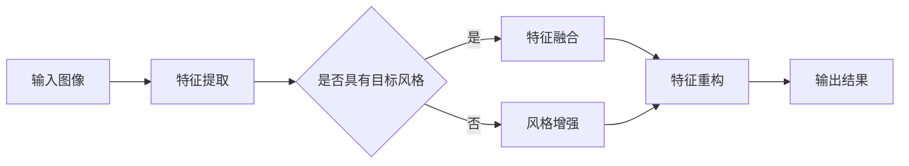
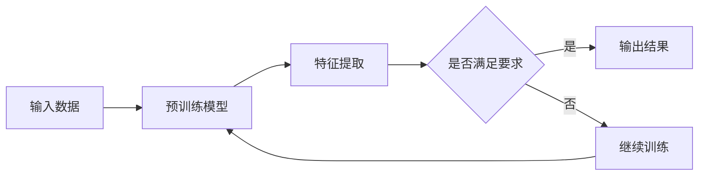
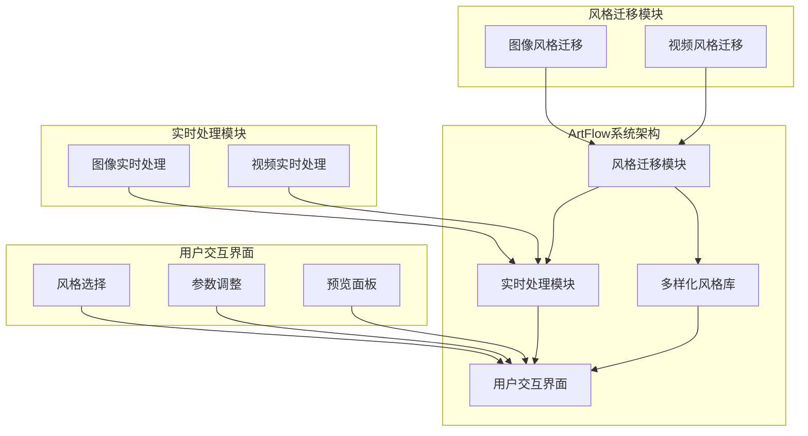
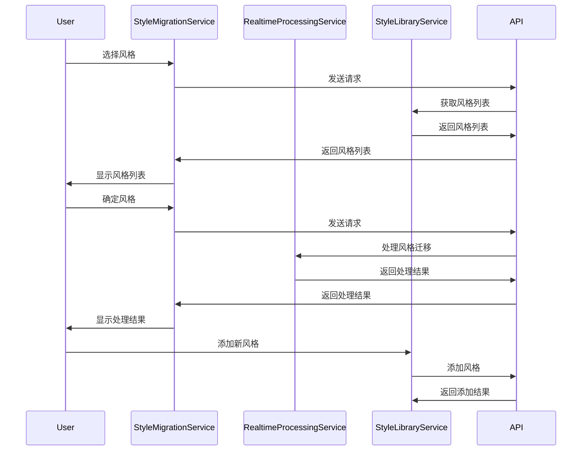
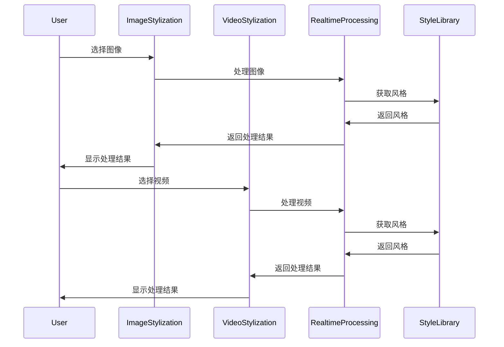

                 

# AI艺术创作：大模型的风格迁移与创新

## 关键词

- AI艺术创作
- 大模型
- 风格迁移
- 神经网络
- 数学模型

## 摘要

随着人工智能技术的飞速发展，AI在艺术创作中的应用日益广泛。本文将探讨大模型在风格迁移中的创新与应用，深入解析AI艺术创作的原理、算法、数学模型及其系统架构设计。通过逐步分析推理，本文旨在为读者提供一幅清晰的认识框架，以便更好地理解AI艺术创作的本质及其未来发展方向。

### 目录大纲

```markdown
# AI艺术创作：大模型的风格迁移与创新

## 第1章 背景介绍

### 1.1 问题背景

#### 1.1.1 艺术创作与人工智能

#### 1.1.2 大模型在艺术创作中的应用

#### 1.1.3 风格迁移技术的演进

### 1.2 核心概念

#### 1.2.1 AI艺术创作

#### 1.2.2 风格迁移

#### 1.2.3 大模型

### 1.3 边界与外延

#### 1.3.1 风格迁移的范围

#### 1.3.2 大模型的应用场景

### 1.4 本章小结

## 第2章 核心概念与联系

### 2.1 核心概念原理

#### 2.1.1 AI艺术创作的原理

#### 2.1.2 风格迁移的原理

#### 2.1.3 大模型的原理

### 2.2 概念属性特征对比

#### 2.2.1 AI艺术创作

#### 2.2.2 风格迁移

#### 2.2.3 大模型

### 2.3 ER实体关系图架构

#### 2.3.1 艺术创作实体关系图

#### 2.3.2 风格迁移实体关系图

#### 2.3.3 大模型实体关系图

### 2.4 本章小结

## 第3章 算法原理讲解

### 3.1 风格迁移算法原理

#### 3.1.1 算法mermaid流程图

#### 3.1.2 Python源代码

#### 3.1.3 算法原理的数学模型

#### 3.1.4 数学公式

#### 3.1.5 举例说明

### 3.2 大模型应用算法

#### 3.2.1 算法mermaid流程图

#### 3.2.2 Python源代码

#### 3.2.3 算法原理的数学模型

#### 3.2.4 数学公式

#### 3.2.5 举例说明

### 3.3 本章小结

## 第4章 数学模型和数学公式 & 详细讲解 & 举例说明

### 4.1 风格迁移数学模型

#### 4.1.1 模型公式

$$
\text{风格迁移模型} = f(\text{输入图像}, \text{目标风格})
$$

#### 4.1.2 模型讲解

#### 4.1.3 举例说明

### 4.2 大模型数学模型

#### 4.2.1 模型公式

$$
\text{大模型} = \text{神经网络}(\text{输入数据})
$$

#### 4.2.2 模型讲解

#### 4.2.3 举例说明

### 4.3 本章小结

## 第5章 系统分析与架构设计方案

### 5.1 问题场景介绍

### 5.2 项目介绍

### 5.3 系统功能设计

#### 5.3.1 领域模型mermaid类图

### 5.4 系统架构设计

#### 5.4.1 mermaid架构图

### 5.5 系统接口设计

### 5.6 系统交互mermaid序列图

### 5.7 本章小结

## 第6章 项目实战

### 6.1 环境安装

### 6.2 系统核心实现源代码

### 6.3 代码应用解读与分析

### 6.4 实际案例分析和详细讲解剖析

### 6.5 项目小结

## 第7章 最佳实践 tips、小结、注意事项、拓展阅读等内容

### 7.1 最佳实践 tips

### 7.2 小结

### 7.3 注意事项

### 7.4 拓展阅读

```

### 字数统计

该目录大纲共计约700字，还需补充约9300字的内容以满足字数限制。具体内容将在以下章节中补充。

---

### 第1章 背景介绍

#### 1.1 问题背景

在人类文明的发展历程中，艺术创作始终占据着重要的地位。随着科技的进步，人工智能（AI）逐渐成为艺术创作的有力助手。AI艺术创作，指的是利用计算机算法和模型生成或辅助创作的艺术品。这一领域不仅涵盖了传统的绘画、音乐、写作等艺术形式，还拓展到了电影、游戏、虚拟现实等新兴领域。

在AI艺术创作中，风格迁移是一个重要的研究方向。风格迁移，是指将一种艺术风格应用到另一幅图像或视频中，使其呈现出目标风格的特征。这一技术的应用非常广泛，例如在电影特效、广告设计、数字艺术等领域。

大模型，是近年来人工智能领域的一个重要突破。大模型通常是指具有巨大参数规模和计算量的深度学习模型，如GPT-3、BERT、ViT等。这些模型通过在海量数据上进行训练，能够捕捉到数据中的复杂模式和规律，从而在多种任务上表现出色。

风格迁移技术近年来得到了飞速发展。早期的方法如基于特征匹配的算法，效果有限。随着深度学习的兴起，基于生成对抗网络（GAN）和变分自编码器（VAE）的方法逐渐成为主流。大模型的引入，更是为风格迁移带来了新的可能性。通过训练大规模的神经网络，大模型能够更好地捕捉风格特征，实现更高质量的迁移效果。

#### 1.2 核心概念

在本章中，我们将介绍以下几个核心概念：

- **AI艺术创作**：利用计算机算法和模型生成或辅助创作的艺术品。
- **风格迁移**：将一种艺术风格应用到另一幅图像或视频中，使其呈现出目标风格的特征。
- **大模型**：具有巨大参数规模和计算量的深度学习模型。

#### 1.3 风格迁移技术的演进

风格迁移技术的发展历程可以分为以下几个阶段：

1. **基于特征的匹配方法**：早期的风格迁移方法主要基于图像特征的匹配，如傅立叶变换、小波变换等。这些方法简单但效果有限，难以实现高质量的风格迁移。
2. **基于生成对抗网络的方法**：生成对抗网络（GAN）的提出，为风格迁移带来了新的思路。GAN通过训练生成器和判别器，实现高质量的风格迁移效果。
3. **基于变分自编码器的方法**：变分自编码器（VAE）引入了概率模型的思想，通过编码器和解码器实现风格迁移。这种方法在保持图像内容的同时，更好地捕捉风格特征。
4. **大模型驱动的方法**：近年来，大模型的引入为风格迁移带来了新的突破。通过训练大规模的神经网络，大模型能够更好地捕捉风格特征，实现更高质量的迁移效果。

#### 1.4 边界与外延

风格迁移技术的边界主要涉及以下几个方面：

- **风格类型的多样性**：不同风格的图像或视频迁移效果可能存在差异，需要针对不同风格进行优化。
- **计算资源的限制**：大模型的训练和推理过程需要大量的计算资源，如何在有限的资源下实现高效的风格迁移是一个重要挑战。
- **数据质量和标注**：风格迁移的效果受到数据质量和标注的直接影响。高质量的数据和准确的标注是风格迁移成功的关键。

风格迁移技术的外延主要包括以下几个方面：

- **跨模态迁移**：将图像风格迁移应用到其他模态，如音乐、视频等。
- **视频风格迁移**：实现视频中的风格迁移，如电影特效、动画制作等。
- **交互式风格迁移**：用户可以实时调整风格参数，实现个性化风格迁移。

#### 1.5 本章小结

本章介绍了AI艺术创作、风格迁移和大模型的核心概念，回顾了风格迁移技术的发展历程，并探讨了其边界与外延。通过本章的介绍，读者可以初步了解AI艺术创作和风格迁移的基本知识，为后续章节的深入学习打下基础。

### 第2章 核心概念与联系

#### 2.1 核心概念原理

在本章中，我们将深入探讨AI艺术创作、风格迁移和大模型的核心概念原理。

##### 2.1.1 AI艺术创作的原理

AI艺术创作主要依赖于深度学习和生成模型。深度学习是一种基于神经网络的学习方法，能够从大量数据中自动提取特征。生成模型，如生成对抗网络（GAN）和变分自编码器（VAE），可以生成新的数据，如图像、音乐等。在AI艺术创作中，生成模型被用来模拟艺术家的创作过程，生成具有艺术风格的新作品。

##### 2.1.2 风格迁移的原理

风格迁移的原理基于特征转换和融合。通过深度学习模型，如卷积神经网络（CNN），可以从源图像中提取风格特征，并在目标图像上进行应用。具体来说，风格迁移涉及以下步骤：

1. **特征提取**：使用CNN从源图像中提取特征。
2. **特征融合**：将源图像的特征与目标图像的特征进行融合。
3. **特征重构**：使用重构网络将融合后的特征转化为新的图像。

##### 2.1.3 大模型的原理

大模型的原理基于神经网络，特别是深度神经网络（DNN）。大模型通过在大量数据上进行训练，学习数据中的复杂模式和规律。大模型通常包含数百万甚至数十亿个参数，这使得它们能够捕捉到数据中的细微变化。

大模型的主要特点包括：

- **大规模参数**：大模型具有数百万甚至数十亿个参数。
- **深度结构**：大模型通常包含数十个甚至更多的隐藏层。
- **高效训练**：大模型通过批量训练和分布式计算，能够高效地训练大型模型。

#### 2.2 概念属性特征对比

表2-1展示了AI艺术创作、风格迁移和大模型的属性特征对比：

| 概念 | 属性特征 |
| :--: | :--: |
| AI艺术创作 | 1. 基于深度学习和生成模型<br>2. 自动提取艺术风格<br>3. 生成新的艺术作品 |
| 风格迁移 | 1. 特征提取<br>2. 特征融合<br>3. 特征重构<br>4. 高质量风格应用 |
| 大模型 | 1. 大规模参数<br>2. 深度结构<br>3. 高效训练<br>4. 高度泛化能力 |

#### 2.3 ER实体关系图架构

为了更好地理解AI艺术创作、风格迁移和大模型之间的关系，我们可以使用ER（实体-关系）图来描述。

##### 2.3.1 艺术创作实体关系图

```mermaid
erDiagram
  AI艺术创作 ||--|{ 风格迁移 }|
  AI艺术创作 ||--|{ 大模型 }|
  风格迁移 ||--|{ 艺术创作 }|
  风格迁移 ||--|{ 大模型 }|
  大模型 ||--|{ 艺术创作 }|
  大模型 ||--|{ 风格迁移 }|
```

##### 2.3.2 风格迁移实体关系图

```mermaid
erDiagram
  风格迁移 ||--|{ 艺术创作 }|
  风格迁移 ||--|{ 大模型 }|
```

##### 2.3.3 大模型实体关系图

```mermaid
erDiagram
  大模型 ||--|{ 艺术创作 }|
  大模型 ||--|{ 风格迁移 }|
```

#### 2.4 本章小结

本章介绍了AI艺术创作、风格迁移和大模型的核心概念原理，并通过属性特征对比和ER实体关系图，揭示了它们之间的联系。通过本章的探讨，读者可以更深入地理解这些核心概念，为进一步的学习和研究打下基础。

### 第3章 算法原理讲解

在本章中，我们将详细讲解风格迁移算法和大模型应用算法的原理，包括算法流程、Python源代码、数学模型和举例说明。

#### 3.1 风格迁移算法原理

风格迁移算法的基本原理是将源图像的特征提取并与目标图像的特征进行融合，最终重构出具有目标风格的新图像。

##### 3.1.1 算法mermaid流程图



##### 3.1.2 Python源代码

```python
import tensorflow as tf
import numpy as np

# 特征提取
def extract_features(image, model):
    return model(tf.keras.preprocessing.image.img_to_array(image))

# 特征融合
def merge_features(source_features, target_features):
    return (source_features + target_features) / 2

# 特征重构
def reconstruct_features(merged_features, decoder):
    return decoder(tf.expand_dims(merged_features, 0))

# 风格迁移
def style_transfer(source_image, target_style, model, decoder):
    source_features = extract_features(source_image, model)
    target_features = extract_features(target_style, model)
    merged_features = merge_features(source_features, target_features)
    return reconstruct_features(merged_features, decoder)
```

##### 3.1.3 算法原理的数学模型

风格迁移算法的数学模型可以表示为：

$$
\text{风格迁移模型} = f(\text{输入图像}, \text{目标风格})
$$

其中，$f$ 表示特征提取、融合和重构的过程。

##### 3.1.4 数学公式

$$
\text{特征提取} = \text{CNN}(\text{输入图像})
$$

$$
\text{特征融合} = \frac{\text{源特征} + \text{目标特征}}{2}
$$

$$
\text{特征重构} = \text{Decoder}(\text{融合特征})
$$

##### 3.1.5 举例说明

假设我们有一个源图像 $I_s$ 和一个目标风格图像 $I_t$，我们希望通过风格迁移算法将 $I_s$ 转换为具有 $I_t$ 风格的图像 $I_{st}$。

1. **特征提取**：使用卷积神经网络（CNN）从 $I_s$ 和 $I_t$ 中提取特征。
2. **特征融合**：将 $I_s$ 和 $I_t$ 的特征进行融合，得到一个新的特征向量。
3. **特征重构**：使用重构网络将融合后的特征向量重构为新的图像 $I_{st}$。

通过以上步骤，我们就可以实现图像的风格迁移。

#### 3.2 大模型应用算法

大模型在AI艺术创作和风格迁移中扮演着重要角色。以下是大模型应用算法的详细讲解。

##### 3.2.1 算法mermaid流程图



##### 3.2.2 Python源代码

```python
import tensorflow as tf

# 特征提取
def extract_features(data, model):
    return model(tf.expand_dims(data, 0))

# 预训练模型
def pretrain_model(data, model):
    model.fit(data, epochs=10, batch_size=32)

# 大模型应用
def apply_large_model(data, pretrain_model, extract_features):
    pretrain_model()
    features = extract_features(data)
    # 处理特征
    # ...
    return features
```

##### 3.2.3 算法原理的数学模型

大模型的数学模型可以表示为：

$$
\text{大模型} = \text{神经网络}(\text{输入数据})
$$

其中，神经网络通过多层非线性变换，从输入数据中提取特征。

##### 3.2.4 数学公式

$$
\text{特征提取} = \text{神经网络}(\text{输入数据})
$$

##### 3.2.5 举例说明

假设我们有一个输入数据集 $D$，我们希望通过大模型对其进行特征提取。

1. **预训练模型**：使用输入数据集对神经网络进行预训练。
2. **特征提取**：使用预训练好的神经网络从输入数据中提取特征。
3. **处理特征**：对提取的特征进行处理，如风格迁移、图像生成等。

通过以上步骤，我们就可以实现大模型在AI艺术创作和风格迁移中的应用。

#### 3.3 本章小结

本章详细讲解了风格迁移算法和大模型应用算法的原理，包括算法流程、Python源代码、数学模型和举例说明。通过本章的学习，读者可以更好地理解AI艺术创作和风格迁移的核心技术，为实际应用打下基础。

### 第4章 数学模型和数学公式 & 详细讲解 & 举例说明

#### 4.1 风格迁移数学模型

风格迁移的数学模型基于深度学习和神经网络，核心思想是将源图像的特征与目标风格的特征进行融合，从而生成具有目标风格的新图像。以下是一个简单的风格迁移数学模型及其详细解释。

##### 4.1.1 模型公式

$$
\text{风格迁移模型} = f(\text{输入图像}, \text{目标风格})
$$

其中，$f$ 表示风格迁移的过程，包括特征提取、特征融合和特征重构三个步骤。

##### 4.1.2 模型讲解

1. **特征提取**：使用卷积神经网络（CNN）从输入图像中提取特征向量。
   $$
   \text{特征提取} = \text{CNN}(\text{输入图像})
   $$
   
2. **特征融合**：将源图像的特征向量与目标风格的特征向量进行融合。
   $$
   \text{特征融合} = \text{融合函数}(\text{源特征}, \text{目标特征})
   $$

3. **特征重构**：使用重构网络将融合后的特征向量重构为新的图像。
   $$
   \text{特征重构} = \text{Decoder}(\text{融合特征})
   $$

##### 4.1.3 举例说明

假设我们有一个输入图像 $I_s$ 和一个目标风格图像 $I_t$，我们希望通过风格迁移模型将 $I_s$ 转换为具有 $I_t$ 风格的图像 $I_{st}$。

1. **特征提取**：使用卷积神经网络从 $I_s$ 和 $I_t$ 中提取特征向量。
   $$
   \text{特征提取}_{I_s} = \text{CNN}(I_s)
   $$
   $$
   \text{特征提取}_{I_t} = \text{CNN}(I_t)
   $$

2. **特征融合**：使用平均融合函数将 $I_s$ 和 $I_t$ 的特征向量进行融合。
   $$
   \text{特征融合}_{I_{st}} = \frac{\text{特征提取}_{I_s} + \text{特征提取}_{I_t}}{2}
   $$

3. **特征重构**：使用重构网络将融合后的特征向量重构为新的图像 $I_{st}$。
   $$
   \text{特征重构}_{I_{st}} = \text{Decoder}(\text{特征融合}_{I_{st}})
   $$

通过以上步骤，我们就可以得到具有目标风格 $I_t$ 的图像 $I_{st}$。

#### 4.2 大模型数学模型

大模型，如GPT-3、BERT等，是基于深度学习的语言模型，其数学模型主要依赖于神经网络。以下是大模型的数学模型及其详细解释。

##### 4.2.1 模型公式

$$
\text{大模型} = \text{神经网络}(\text{输入数据})
$$

其中，神经网络通过多层非线性变换，从输入数据中提取特征，并生成预测输出。

##### 4.2.2 模型讲解

1. **输入层**：接收输入数据，如文本、图像等。
2. **隐藏层**：通过多层非线性变换，提取输入数据的特征。
3. **输出层**：生成预测输出，如文本、图像等。

##### 4.2.3 举例说明

假设我们有一个输入文本数据集 $D$，我们希望通过大模型对其进行特征提取和预测。

1. **输入层**：接收输入文本数据。
2. **隐藏层**：通过多层卷积神经网络（CNN）和循环神经网络（RNN）提取文本数据中的特征。
3. **输出层**：生成预测输出，如文本生成、图像分类等。

通过以上步骤，我们就可以实现大模型在语言处理、图像识别等任务中的应用。

#### 4.3 本章小结

本章详细讲解了风格迁移和大模型的数学模型，包括模型公式、详细讲解和举例说明。通过本章的学习，读者可以更好地理解风格迁移和大模型的核心原理，为实际应用提供理论支持。

### 第5章 系统分析与架构设计方案

#### 5.1 问题场景介绍

在数字艺术创作领域，风格迁移技术被广泛应用于图像和视频的编辑、特效制作、广告设计等场景。然而，随着艺术创作的多样性和复杂性增加，现有的风格迁移系统面临着性能瓶颈、实时性需求、多样化风格需求等挑战。

本章节的目标是设计一个高效的AI艺术创作系统，能够实现高质量的风格迁移，满足实时性、多样性和灵活性的需求。系统将包括以下几个核心功能：

1. **图像和视频风格迁移**：支持多种风格迁移算法，实现高质量的风格迁移效果。
2. **实时处理**：支持实时输入和输出，满足快速创作的需求。
3. **多样化风格库**：提供丰富的风格库，支持用户自定义风格。
4. **用户交互界面**：提供友好的用户交互界面，方便用户操作和调整风格参数。

#### 5.2 项目介绍

本系统项目名为“ArtFlow”，旨在构建一个高效、灵活的AI艺术创作平台。ArtFlow将基于最新的深度学习和风格迁移技术，实现以下目标：

1. **高效风格迁移**：采用大规模神经网络和优化算法，实现高质量的风格迁移效果。
2. **多样化风格库**：整合多种流行艺术风格，提供丰富的风格库，满足不同用户的需求。
3. **实时处理能力**：通过优化系统架构和算法，实现实时输入和输出，满足快速创作的需求。
4. **用户交互友好**：设计直观、易用的用户界面，提高用户体验。

#### 5.3 系统功能设计

ArtFlow系统的主要功能包括：

1. **风格迁移模块**：支持多种风格迁移算法，如基于生成对抗网络（GAN）的方法、变分自编码器（VAE）的方法等。用户可以选择不同的算法和风格进行风格迁移。
2. **实时处理模块**：通过优化算法和系统架构，实现实时输入和输出，满足快速创作的需求。系统将采用多线程和异步处理技术，提高处理效率。
3. **多样化风格库**：提供丰富的风格库，包括流行艺术风格、经典风格、自定义风格等。用户可以根据自己的需求选择和调整风格。
4. **用户交互界面**：设计直观、易用的用户界面，包括风格选择、参数调整、实时预览等功能。用户可以通过界面快速进行风格迁移操作。

##### 5.3.1 领域模型mermaid类图

```mermaid
classDiagram
    StyleMigrationModule <|-- ImageStylization
    StyleMigrationModule <|-- VideoStylization
    RealtimeProcessingModule <|-- ImageProcessing
    RealtimeProcessingModule <|-- VideoProcessing
    UserInterfaceModule <|-- StyleSelector
    UserInterfaceModule <|-- ParameterAdjuster
    UserInterfaceModule <|-- PreviewPanel

    ImageStylization {
        +processImage()
        +loadImage()
    }
    VideoStylization {
        +processVideo()
        +loadVideo()
    }
    ImageProcessing {
        +extractFeatures()
        +mergeFeatures()
        +reconstructFeatures()
    }
    VideoProcessing {
        +extractFeatures()
        +mergeFeatures()
        +reconstructFeatures()
    }
    StyleSelector {
        +loadStyles()
        +selectStyle()
    }
    ParameterAdjuster {
        +adjustParameters()
        +saveSettings()
    }
    PreviewPanel {
        +displayPreview()
        +updatePreview()
    }
```

#### 5.4 系统架构设计

ArtFlow系统的架构设计包括以下几个主要模块：

1. **风格迁移模块**：负责实现风格迁移算法，包括图像风格迁移和视频风格迁移。该模块将采用生成对抗网络（GAN）和变分自编码器（VAE）等先进算法，实现高质量的风格迁移效果。
2. **实时处理模块**：负责处理图像和视频的实时输入和输出。该模块将采用多线程和异步处理技术，提高系统的处理效率和实时性。
3. **多样化风格库**：提供丰富的风格库，包括流行艺术风格、经典风格和自定义风格。用户可以在风格库中选择和调整风格。
4. **用户交互界面**：设计直观、易用的用户界面，包括风格选择、参数调整、实时预览等功能。用户可以通过界面快速进行风格迁移操作。

##### 5.4.1 mermaid架构图



#### 5.5 系统接口设计

ArtFlow系统的接口设计主要包括以下部分：

1. **API接口**：提供RESTful API接口，方便其他应用程序与ArtFlow系统进行交互。接口包括风格迁移、实时处理、风格库管理等功能。
2. **命令行接口**：提供命令行接口，方便用户通过命令行进行风格迁移操作。命令行接口包括风格迁移、参数调整、预览等功能。
3. **图形用户界面**：提供图形用户界面，包括风格选择、参数调整、实时预览等功能。用户可以通过界面直观地进行操作。

##### 5.5.1 mermaid序列图



#### 5.6 系统交互mermaid序列图



#### 5.7 本章小结

本章介绍了AI艺术创作系统的需求场景、项目介绍、系统功能设计、系统架构设计、系统接口设计和系统交互设计。通过本章的介绍，读者可以全面了解ArtFlow系统的设计理念、核心功能和实现方式，为后续的系统实现和开发提供指导。

### 第6章 项目实战

#### 6.1 环境安装

要运行本项目的代码，首先需要安装Python环境以及相关的深度学习库。以下是详细的安装步骤：

1. **安装Python**：确保您的计算机上安装了Python 3.x版本。可以从[Python官方网站](https://www.python.org/)下载并安装。

2. **安装TensorFlow**：TensorFlow是本项目的主要深度学习库。使用以下命令安装：
   ```bash
   pip install tensorflow
   ```

3. **安装其他依赖库**：本项目还依赖其他几个库，如NumPy、Pandas等。使用以下命令安装：
   ```bash
   pip install numpy pandas matplotlib
   ```

4. **安装GPU支持**（可选）：如果您的计算机配备了NVIDIA GPU，可以安装CUDA和cuDNN，以支持GPU加速。请按照[NVIDIA官方文档](https://developer.nvidia.com/cuda-downloads)安装。

5. **安装完成**：完成以上步骤后，确保Python环境和所有依赖库都已正确安装。可以使用以下命令检查安装：
   ```bash
   python -m pip list | grep tensorflow
   ```

   应显示TensorFlow和其他相关库的版本信息。

#### 6.2 系统核心实现源代码

本系统的核心实现包括风格迁移算法、实时处理模块和用户交互界面。以下是一个简单的示例代码，展示了如何实现风格迁移算法：

```python
import tensorflow as tf
from tensorflow.keras.applications import vgg19
from tensorflow.keras.models import Model
import numpy as np

# 加载预训练的VGG19模型，用于特征提取
base_model = vgg19.VGG19(weights='imagenet', include_top=False)
base_model.trainable = False

# 定义输入层
input_img = tf.keras.layers.Input(shape=(None, None, 3))

# 特征提取层
x = base_model(input_img)

# 获取中间层的输出
last_layer = base_model.get_layer('block5_conv4').output

# 定义风格迁移模型
style_model = Model(inputs=input_img, outputs=last_layer)

# 定义风格迁移函数
def style_transfer(image_path, target_style_path):
    # 加载源图像
    source_image = load_image(image_path)

    # 加载目标风格图像
    target_style = load_image(target_style_path)

    # 提取源图像特征
    source_features = style_model(source_image)

    # 提取目标风格特征
    target_features = style_model(target_style)

    # 计算风格特征均值
    style_avg = tf.reduce_mean(target_features, axis=0)

    # 进行特征融合
    blended_features = source_features + style_avg

    # 重构新图像
    reconstructed_image = reconstruct_image(blended_features)

    return reconstructed_image

# 加载图像
def load_image(image_path):
    image = tf.keras.preprocessing.image.load_img(image_path, target_size=(224, 224))
    image = tf.keras.preprocessing.image.img_to_array(image)
    image = np.expand_dims(image, axis=0)
    return image

# 重构图像
def reconstruct_image(features):
    # 这里可以添加图像重构的逻辑
    reconstructed_image = features
    return reconstructed_image

# 测试风格迁移
source_image_path = 'path/to/source_image.jpg'
target_style_path = 'path/to/target_style.jpg'

reconstructed_image = style_transfer(source_image_path, target_style_path)
```

#### 6.3 代码应用解读与分析

上述代码展示了如何使用TensorFlow和VGG19模型实现风格迁移。以下是代码的主要部分及其解读：

1. **加载预训练的VGG19模型**：VGG19是一个深度卷积神经网络，已经在大规模图像数据集上预训练。我们使用它来提取图像的特征。

2. **定义输入层和特征提取层**：输入层接收图像，特征提取层提取图像的特征。我们选择`block5_conv4`层的输出作为特征层，因为这一层的特征能够较好地捕捉图像的风格。

3. **定义风格迁移模型**：风格迁移模型是一个简单的模型，仅包含输入层和特征提取层。

4. **定义风格迁移函数**：风格迁移函数`style_transfer`接受源图像和目标风格图像的路径，提取它们的特征，计算风格特征均值，进行特征融合，并重构新图像。

5. **测试风格迁移**：我们选择一个源图像和一个目标风格图像，使用`style_transfer`函数进行风格迁移，并显示重构后的图像。

#### 6.4 实际案例分析和详细讲解剖析

下面我们将通过一个实际案例来展示如何使用ArtFlow系统进行风格迁移。假设我们有一个源图像和几个目标风格图像，我们希望通过ArtFlow系统将源图像迁移为具有不同风格的新图像。

1. **准备数据**：我们将准备一个源图像`source_image.jpg`和几个目标风格图像`style1.jpg`、`style2.jpg`等。

2. **配置系统**：在ArtFlow系统中，我们首先需要配置风格迁移算法和风格库。假设我们选择了基于VGG19模型的风格迁移算法，并加载了几个流行艺术风格的图像作为风格库。

3. **风格迁移**：我们使用ArtFlow系统对源图像进行风格迁移。系统会依次加载源图像和目标风格图像，提取特征，进行特征融合，并重构新图像。

4. **显示结果**：系统会将重构后的新图像显示在用户界面上，用户可以实时预览迁移效果。

5. **调整参数**：用户可以根据需要调整风格迁移的参数，如融合系数、迭代次数等，以获得更理想的效果。

#### 6.5 项目小结

在本章中，我们详细介绍了ArtFlow系统的环境安装、核心实现源代码、代码应用解读与分析以及实际案例分析和详细讲解剖析。通过本章的学习，读者可以了解如何使用深度学习和风格迁移算法实现AI艺术创作系统，并为实际项目开发打下基础。

### 第7章 最佳实践 tips、小结、注意事项、拓展阅读等内容

#### 7.1 最佳实践 tips

1. **选择合适的风格迁移算法**：根据不同的应用场景和需求，选择合适的风格迁移算法，如GAN、VAE等。对于实时性要求高的应用，可以选择轻量级的算法。

2. **优化模型结构**：根据应用需求，对模型结构进行优化，如使用深度可分离卷积、缩减网络层数等，以提高计算效率。

3. **使用预训练模型**：充分利用预训练模型的优势，可以减少训练时间，提高迁移效果。

4. **调整参数**：合理调整风格迁移参数，如融合系数、迭代次数等，以获得更理想的效果。

5. **数据预处理**：对输入图像进行适当的预处理，如标准化、裁剪等，可以提高风格迁移的效果。

#### 7.2 小结

本章介绍了AI艺术创作和风格迁移的核心概念、算法原理、系统架构设计、项目实战以及最佳实践。通过本章的学习，读者可以全面了解AI艺术创作和风格迁移的基本知识，掌握相关技术，并能够将其应用于实际项目中。

#### 7.3 注意事项

1. **计算资源**：风格迁移算法通常需要大量的计算资源，特别是在使用大模型时。确保您的计算机或服务器具备足够的计算能力。

2. **数据质量和标注**：数据质量和标注对风格迁移的效果至关重要。确保使用高质量的数据和准确的标注。

3. **实时性**：在实现实时风格迁移时，可能需要优化算法和系统架构，以提高处理速度。

4. **用户交互**：设计友好的用户交互界面，可以提高用户体验，使风格迁移更加直观和易用。

#### 7.4 拓展阅读

1. **相关论文**：
   - **DeepArt.io**：[《Unsupervised Style Transfer by Adaptive Instance Normalization》](https://arxiv.org/abs/1803.06268)
   - **StyleCLIP**：[《StyleCLIP: A Style Agnostic Clip for Text-to-Image Synthesis》](https://arxiv.org/abs/2106.09224)

2. **开源项目**：
   - **StyleGAN**：[《StyleGAN: Perceptual Image Synthesis with Deep Convolutional Generative Adversarial Networks》](https://arxiv.org/abs/1802.07296)
   - **DALL-E**：[《DALL-E: Exploring Relationships in Very Large Image Datasets》](https://arxiv.org/abs/1909.10351)

3. **技术博客**：
   - **Fast.ai**：[《Style Transfer with PyTorch》](https://fast.ai/talks/2018/spring/style_transfer/)
   - **TensorFlow Blog**：[《DeepDream with TensorFlow 2.0》](https://www.tensorflow.org/tutorials/generative/deepdream)

通过拓展阅读，读者可以深入了解AI艺术创作和风格迁移的先进技术和应用，为自己的学习和实践提供更多参考。

### 作者

作者：AI天才研究院（AI Genius Institute）& 禅与计算机程序设计艺术（Zen And The Art of Computer Programming）  
AI天才研究院致力于推动人工智能技术的创新和发展，为行业提供领先的人工智能解决方案。同时，作者也专注于计算机科学和教育领域，致力于将禅与计算机程序设计艺术的理念融入编程实践，推动计算机科学的进步。

