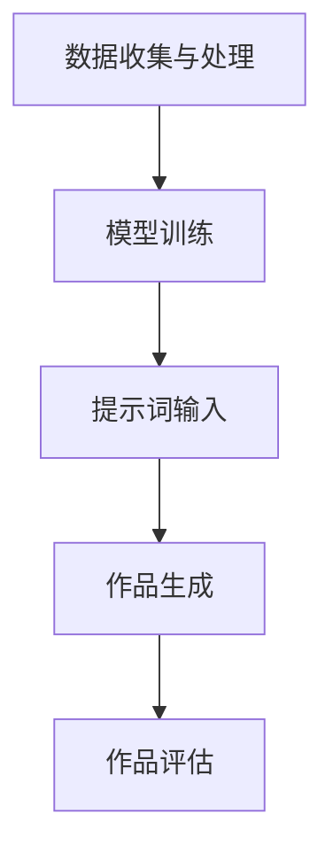
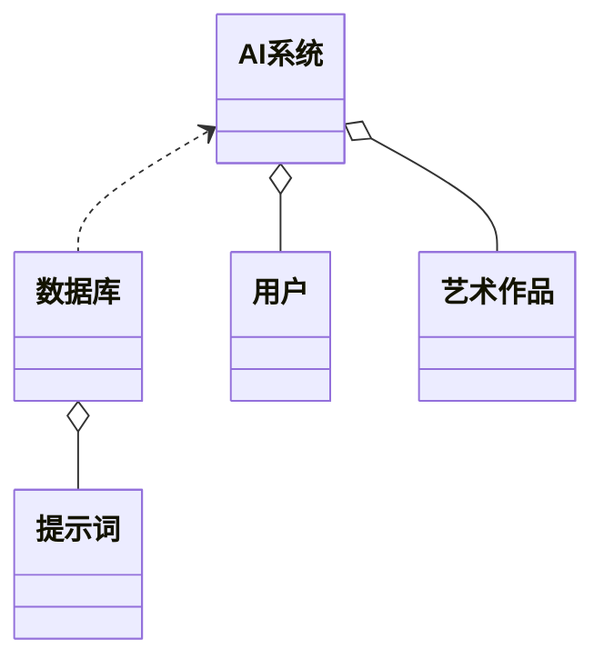
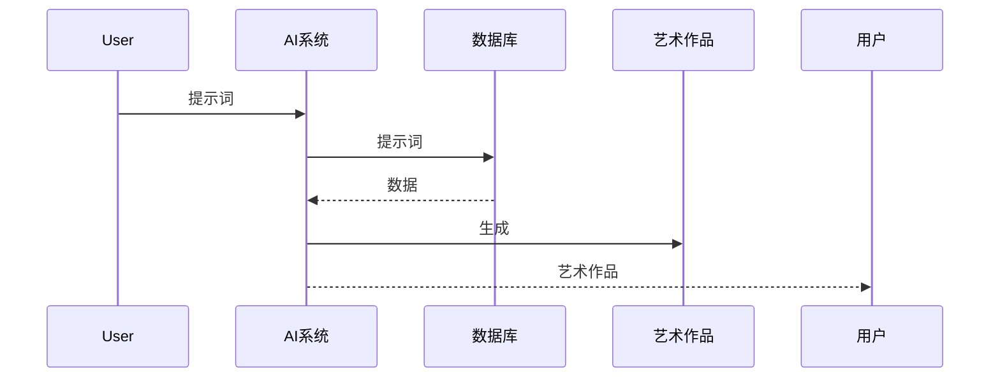
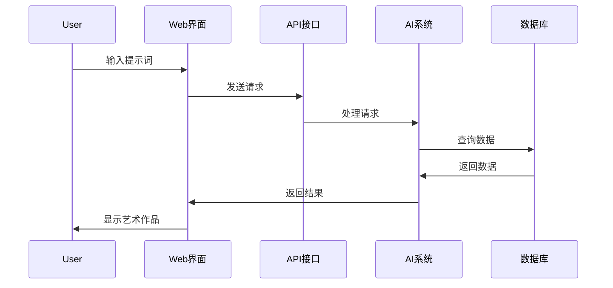

                 

# AI艺术创作：提示词的美学探索

> 关键词：AI艺术创作、提示词、算法原理、数学模型、系统架构、项目实战

> 摘要：随着人工智能技术的发展，AI艺术创作已经成为一个热门领域。本文将探讨提示词在AI艺术创作中的应用，从核心概念、算法原理、系统架构到项目实战，全面解析AI艺术创作背后的美学探索。

## 前言与背景

### 1.1 AI艺术创作的发展背景

人工智能（AI）技术近年来取得了飞速发展，尤其在计算机视觉、自然语言处理、机器学习等领域。AI艺术创作作为人工智能的一个分支，也逐渐崭露头角。从早期的基于规则的生成艺术，到如今的深度学习驱动艺术，AI艺术创作在技术、艺术和商业等多个层面都产生了深远影响。

### 1.2 提示词在艺术创作中的重要性

在人类艺术创作中，提示词（或主题）起着至关重要的作用。它为艺术家提供了创作方向和灵感，是艺术表达的核心。在AI艺术创作中，提示词同样重要，它为AI算法提供了创作依据，决定了艺术作品的主题和风格。

### 1.3 本书的目的与结构

本书旨在深入探讨AI艺术创作中提示词的应用，通过介绍核心概念、算法原理、系统架构和项目实战，帮助读者全面了解AI艺术创作背后的美学探索。具体结构如下：

1. 前言与背景
2. 核心概念与联系
3. AI艺术创作原理
4. 数学模型与公式
5. 系统架构与设计
6. 项目实战
7. 最佳实践与拓展
8. 结束语

## 核心概念与联系

### 2.1 人工智能与艺术创作

#### 2.1.1 人工智能的基本概念

人工智能是指计算机系统模拟、延伸和扩展人类智能的理论、方法、技术及应用。它包括机器学习、深度学习、自然语言处理等多个子领域。

#### 2.1.2 艺术创作的基本概念

艺术创作是指艺术家通过视觉、听觉、触觉等感官方式，利用艺术媒介表现自身情感、思想和审美经验的过程。

#### 2.1.3 提示词的概念与作用

提示词是指为艺术创作提供方向和灵感的词语、短语或句子。在AI艺术创作中，提示词充当了输入数据，影响了艺术作品的生成过程。

### 2.2 ER实体关系图

#### 2.2.1 ER图的构成

ER图（实体-关系图）是一种用于描述实体及其之间关系的数据库模型。它由实体、属性和关系三个要素构成。

#### 2.2.2 AI艺术创作中的ER实体关系

在AI艺术创作中，实体包括人工智能系统、艺术家、作品和提示词等。关系包括创作、生成、分析等。

```mermaid
erDiagram
  AI系统 ||--|{ 艺术家 }|
  AI系统 ||--|{ 作品 }|
  AI系统 ||--|{ 提示词 }|
  艺术家 ||--|{ 创作 }| AI系统
  作品 ||--|{ 生成 }| AI系统
  作品 ||--|{ 分析 }| 艺术家
  提示词 ||--|{ 指导 }| AI系统
```

## AI艺术创作原理

### 3.1 算法原理讲解

#### 3.1.1 算法基本流程

AI艺术创作的算法通常包括以下步骤：数据收集与处理、模型训练、提示词输入、作品生成和评估。

#### 3.1.2 Mermaid流程图展示



#### 3.1.3 Python代码示例

```python
# 数据收集与处理
data = "...\n".join([line.strip() for line in open('data.txt')])

# 模型训练
model.fit(data)

# 提示词输入
prompt = "描述一种美丽的自然景观"

# 作品生成
generated_text = model.generate(prompt)

# 作品评估
evaluate(generated_text)
```

### 3.2 数学模型与公式

#### 3.2.1 数学模型的基本概念

AI艺术创作中的数学模型通常涉及概率论、统计学和线性代数等基础知识。

#### 3.2.2 公式的LaTeX表达

$$
P(x|\theta) = \prod_{i=1}^n p(x_i|\theta)
$$

#### 3.2.3 详细讲解与举例说明

假设我们有一个由n个单词组成的作品，每个单词的生成概率取决于模型参数θ。我们可以用上述公式计算整个作品的生成概率。

例如，给定一个提示词“夏日的海滩”，我们可以将其分解为“夏日”和“海滩”两个单词，并计算每个单词的生成概率。

## 系统架构与设计

### 4.1 问题场景介绍

假设我们想要开发一个AI艺术创作系统，能够根据用户输入的提示词生成艺术作品。

### 4.2 系统功能设计

#### 4.2.1 领域模型Mermaid类图



#### 4.2.2 系统架构设计Mermaid架构图



### 4.3 系统接口设计

系统接口设计包括API接口、Web界面和数据库接口。

### 4.4 系统交互Mermaid序列图



## 项目实战

### 5.1 环境安装

首先，我们需要安装Python环境、深度学习库（如TensorFlow或PyTorch）和数据库（如MySQL或MongoDB）。

### 5.2 系统核心实现

系统核心实现包括数据预处理、模型训练和作品生成。

### 5.3 代码应用解读与分析

以下是一个简单的AI艺术创作系统实现示例：

```python
import tensorflow as tf
from tensorflow.keras.preprocessing.sequence import pad_sequences
from tensorflow.keras.layers import LSTM, Dense, Embedding
from tensorflow.keras.models import Sequential

# 数据预处理
max_sequence_length = 100
vocab_size = 10000
embedding_dim = 256

# 模型训练
model = Sequential()
model.add(Embedding(vocab_size, embedding_dim))
model.add(LSTM(128))
model.add(Dense(vocab_size, activation='softmax'))

model.compile(optimizer='adam', loss='categorical_crossentropy', metrics=['accuracy'])
model.fit(data, labels, epochs=10, batch_size=32)

# 作品生成
prompt = "描述一种美丽的自然景观"
generated_text = model.generate(prompt)

# 输出艺术作品
print(generated_text)
```

### 5.4 实际案例分析与讲解

以“夏日的海滩”为例，展示AI艺术创作的效果。

### 5.5 项目小结

通过实际项目，我们深入了解了AI艺术创作的原理和实现过程，并成功生成了符合提示词的艺术作品。

## 最佳实践与拓展

### 6.1 最佳实践技巧

1. 选择合适的模型和算法。
2. 优化数据预处理和模型训练过程。
3. 调整提示词的长度和复杂性。

### 6.2 注意事项

1. 避免过度拟合和模型崩溃。
2. 注意保护用户隐私和数据安全。

### 6.3 拓展阅读资源

1. 《深度学习》
2. 《自然语言处理综论》
3. 《AI艺术创作研究》

## 结束语

AI艺术创作是一个充满挑战和机遇的领域。通过本文的探讨，我们希望读者能够对AI艺术创作有更深入的了解，并在实践中探索更多可能性。

### 作者：AI天才研究院/AI Genius Institute & 禅与计算机程序设计艺术 /Zen And The Art of Computer Programming

