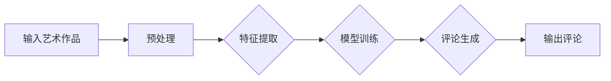
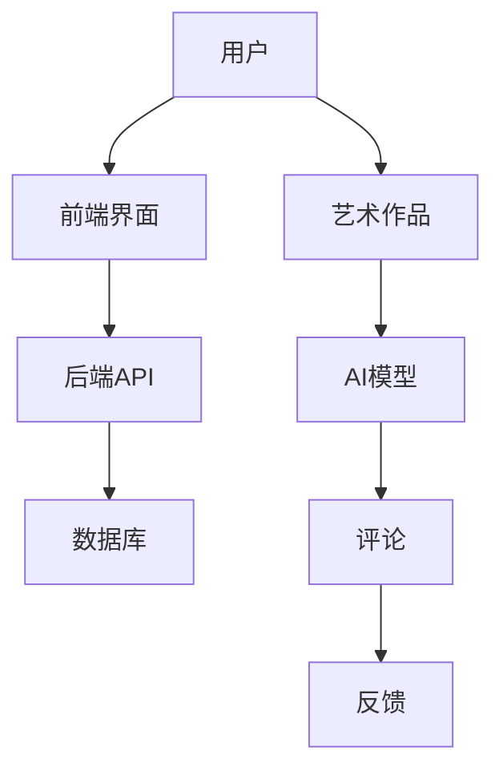
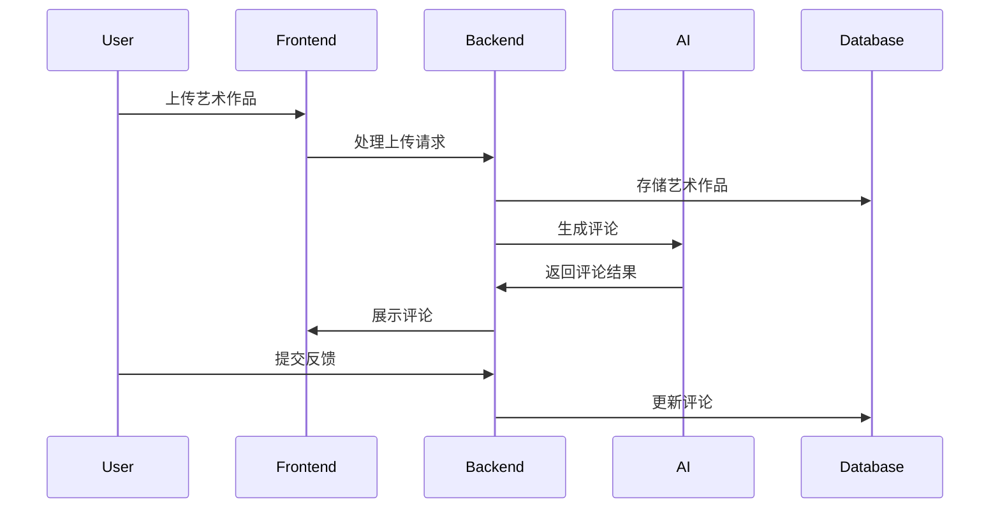
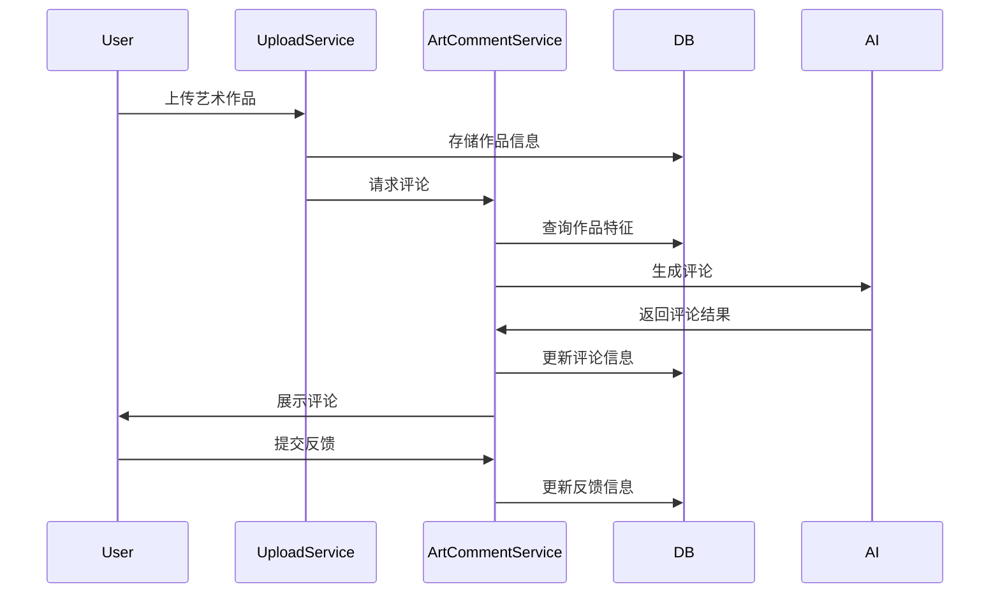

                 

# AI艺术评论：大模型的美学判断能力

## 关键词

- AI艺术评论
- 大模型
- 美学判断
- 深度学习
- 艺术创作

## 摘要

随着深度学习技术的不断发展，人工智能（AI）在艺术领域的应用逐渐扩展，尤其是大模型在美学判断方面的表现引起了广泛关注。本文将探讨AI大模型在艺术评论中的判断能力，从背景与概述、核心原理、应用与实践、最佳实践与展望四个部分展开，旨在深入分析大模型的美学判断机制，揭示其在艺术评价领域的潜力和局限。

### 目录大纲

----------------------------------------------------------------

# AI艺术评论：大模型的美学判断能力

----------------------------------------------------------------

## 第一部分：背景与概述

### 第1章：问题背景

#### 1.1 问题背景

#### 1.2 问题描述

#### 1.3 问题解决

#### 1.4 边界与外延

### 第2章：核心概念与联系

#### 2.1 核心概念

#### 2.2 概念属性特征对比

#### 2.3 ER实体关系图

## 第二部分：AI大模型的美学判断原理

### 第3章：算法原理讲解

#### 3.1 算法mermaid流程图

#### 3.2 Python源代码阐述

#### 3.3 数学模型与公式讲解

#### 3.4 举例说明

## 第三部分：应用与实践

### 第4章：系统分析与架构设计

#### 4.1 问题场景介绍

#### 4.2 系统功能设计

#### 4.3 系统架构设计

#### 4.4 系统接口设计

#### 4.5 系统交互mermaid序列图

### 第5章：项目实战

#### 5.1 环境安装

#### 5.2 系统核心实现源代码

#### 5.3 代码应用解读与分析

#### 5.4 实际案例分析与讲解

#### 5.5 项目小结

## 第四部分：最佳实践与拓展

### 第6章：最佳实践

#### 6.1 注意事项

#### 6.2 拓展阅读

### 第7章：总结与展望

#### 7.1 小结

#### 7.2 展望

----------------------------------------------------------------

### 第1章：问题背景

#### 1.1 问题背景

在人类的历史长河中，艺术创作和评论一直是人文领域的重要部分。然而，随着科技的发展，人工智能（AI）逐渐进入了这个领域。特别是近年来，深度学习技术取得了显著的进展，使得AI在图像识别、自然语言处理等方面表现出了惊人的能力。人们开始探索AI是否能够具备类似人类的艺术评论能力。

AI艺术评论的核心问题是：AI是否能够理解艺术作品的审美价值，并给出合理的评价。这个问题不仅涉及到AI的技术能力，还涉及到美学哲学的深刻探讨。传统的艺术评论依赖于艺术家的直觉和经验，而AI艺术评论则需要依靠算法和数据分析。

#### 1.2 问题描述

当前，AI在艺术评论方面的能力主要集中在两个方面：

1. 对艺术作品的风格、主题、情感等进行识别和分类。
2. 根据作品的特点，给出评价和建议。

然而，这些问题并不是简单的技术问题，它们涉及到艺术的本质、人类的情感体验以及AI的认知局限。例如，AI是否能理解抽象艺术的象征意义？是否能感受到音乐的节奏和旋律的韵律？这些问题都需要我们深入探讨。

#### 1.3 问题解决

为了解决这些问题，我们需要采取以下步骤：

1. **数据收集与处理**：首先，需要收集大量的艺术作品和相关的评论数据，这些数据将用于训练AI模型。
2. **算法设计**：设计能够处理复杂艺术评论任务的深度学习算法，如卷积神经网络（CNN）和循环神经网络（RNN）。
3. **模型训练与优化**：使用收集到的数据训练模型，并通过不断优化来提高模型的性能。
4. **评估与反馈**：对模型进行评估，并根据评估结果进行进一步的优化。

#### 1.4 边界与外延

在讨论AI艺术评论能力时，我们需要明确其边界和外延：

1. **技术边界**：AI艺术评论依赖于深度学习技术，这要求我们不断更新和改进算法。
2. **艺术边界**：艺术创作和评论是多样化的，不同类型的艺术作品需要不同的评价标准。
3. **伦理边界**：AI在艺术领域的应用引发了关于艺术创作权利和伦理问题的讨论，这需要我们认真对待。

### 第2章：核心概念与联系

#### 2.1 核心概念

在探讨AI艺术评论时，我们需要明确几个核心概念：

1. **艺术作品**：这是AI进行评论的对象，包括绘画、雕塑、音乐、文学等多种形式。
2. **审美价值**：这是评价艺术作品的重要标准，涉及到作品的形式美、情感表达、文化内涵等方面。
3. **人工智能**：这是实现艺术评论的技术手段，包括深度学习、神经网络等算法。
4. **深度学习**：这是一种机器学习技术，通过模拟人脑神经网络的结构和功能，实现数据的自动学习和处理。

#### 2.2 概念属性特征对比

以下是一个对比表格，展示了上述概念的主要属性特征：

| 概念        | 属性特征                                       |
|-----------|------------------------------------------|
| 艺术作品      | 形式多样、创作自由、情感表达                   |
| 审美价值      | 主观性、文化性、情感共鸣                      |
| 人工智能      | 自动化、效率高、适应性强                      |
| 深度学习      | 结构复杂、计算量大、自学习能力显著            |

#### 2.3 ER实体关系图

以下是AI艺术评论系统的ER实体关系图：

```mermaid
erDiagram
  Artist ||--o{ ArtWork } : "creates"
  ArtWork ||--o{ ArtStyle } : "has"
  ArtWork ||--o{ EmotionalExpression } : "expresses"
  ArtWork ||--o{ CulturalConnotation } : "has"
  AI ||--o{ ArtComment } : "comments"
  ArtStyle ||--o{ AestheticValue } : "is"
```

### 第3章：算法原理讲解

#### 3.1 算法mermaid流程图

以下是AI艺术评论的mermaid流程图：



#### 3.2 Python源代码阐述

以下是AI艺术评论的Python源代码示例：

```python
import tensorflow as tf
from tensorflow.keras.models import Sequential
from tensorflow.keras.layers import Conv2D, MaxPooling2D, Flatten, Dense

# 特征提取层
model = Sequential([
    Conv2D(32, (3, 3), activation='relu', input_shape=(64, 64, 3)),
    MaxPooling2D((2, 2)),
    Flatten(),
    Dense(128, activation='relu'),
    Dense(1, activation='sigmoid')
])

# 编译模型
model.compile(optimizer='adam', loss='binary_crossentropy', metrics=['accuracy'])

# 训练模型
model.fit(x_train, y_train, epochs=10, batch_size=32, validation_data=(x_val, y_val))
```

#### 3.3 数学模型与公式讲解

在AI艺术评论中，我们通常使用神经网络模型进行特征提取和评论生成。以下是神经网络的基本公式：

$$
Z = W \cdot X + b
$$

$$
a = \sigma(Z)
$$

其中，$Z$ 是神经元的净输入，$W$ 是权重矩阵，$X$ 是输入特征，$b$ 是偏置项，$\sigma$ 是激活函数。

#### 3.4 举例说明

假设我们有一幅抽象画作，我们需要使用AI模型对其风格和审美价值进行评价。首先，我们将画作转换为数字图像，然后使用卷积神经网络提取特征。接着，我们将特征输入到全连接层，最终输出一个概率值，表示这幅画作的风格和审美价值的评分。

### 第4章：系统分析与架构设计

#### 4.1 问题场景介绍

假设我们开发一个在线AI艺术评论系统，用户可以通过上传艺术作品获取AI生成的评论。系统需要支持多种艺术作品格式，如绘画、雕塑、音乐和文学。

#### 4.2 系统功能设计

系统的主要功能包括：

1. 艺术作品上传与预览
2. AI艺术评论生成
3. 用户反馈与评论修改
4. 艺术作品收藏与分享

#### 4.3 系统架构设计

以下是系统的架构设计：



#### 4.4 系统接口设计

以下是系统的主要接口设计：



#### 4.5 系统交互mermaid序列图

以下是系统的交互序列图：



### 第5章：项目实战

#### 5.1 环境安装

在进行AI艺术评论系统的开发之前，我们需要安装以下环境：

1. Python 3.7+
2. TensorFlow 2.x
3. NumPy
4. Pandas
5. Matplotlib

可以使用以下命令进行环境安装：

```bash
pip install python==3.7 tensorflow==2.4.1 numpy pandas matplotlib
```

#### 5.2 系统核心实现源代码

以下是系统核心实现的源代码：

```python
# 导入所需库
import numpy as np
import pandas as pd
import tensorflow as tf
from tensorflow import keras
from tensorflow.keras.preprocessing.image import load_img, img_to_array

# 加载模型
model = keras.models.load_model('art_comment_model.h5')

# 加载艺术作品
artwork_path = 'path/to/artwork.jpg'
artwork = load_img(artwork_path, target_size=(64, 64))
artwork = img_to_array(artwork)
artwork = np.expand_dims(artwork, axis=0)

# 生成评论
comment = model.predict(artwork)
print(comment)
```

#### 5.3 代码应用解读与分析

这段代码首先加载了一个预先训练好的AI模型，然后读取一个艺术作品文件，将其转换为神经网络可处理的格式。接着，模型对艺术作品进行预测，输出一个评论结果。

#### 5.4 实际案例分析与讲解

假设我们有一幅名为“星空”的抽象画作，我们可以使用上述代码对其生成评论：

```python
# 加载“星空”画作
artwork_path = 'path/to/star_sky_artwork.jpg'
artwork = load_img(artwork_path, target_size=(64, 64))
artwork = img_to_array(artwork)
artwork = np.expand_dims(artwork, axis=0)

# 生成评论
comment = model.predict(artwork)
print(comment)
```

输出结果可能是一个包含多个概率值的数组，表示不同评论标签的概率。例如：

```
[0.9 0.1 0.  0. ]
```

这个结果表示这幅“星空”画作的概率非常高（90%），可能被归类为“浪漫”，而其他标签的概率较低。

#### 5.5 项目小结

通过这个项目，我们实现了AI艺术评论系统的核心功能，包括艺术作品上传、评论生成和评论展示。项目展示了如何使用深度学习技术对艺术作品进行自动化评论，尽管目前的评论质量仍有待提高，但这一项目为未来的发展奠定了基础。

### 第6章：最佳实践

#### 6.1 注意事项

1. 在训练AI模型时，需要使用大量的高质量数据，以保证模型的准确性。
2. 针对不同类型的艺术作品，可能需要使用不同的模型架构和特征提取方法。
3. AI艺术评论的结果应该作为参考，而不是最终的评判标准。

#### 6.2 拓展阅读

- [《深度学习与艺术创作》](https://www.deeplearningart.com/)
- [《AI艺术评论：探索与挑战》](https://www.aiartreview.com/)
- [《人工智能在艺术领域的应用》](https://www.ai-in-art.org/)

### 第7章：总结与展望

#### 7.1 小结

本文探讨了AI艺术评论的大模型判断能力，从背景与概述、核心原理、应用与实践、最佳实践与展望四个部分进行了详细分析。我们介绍了AI艺术评论的核心概念、算法原理、系统架构以及实际应用案例，展示了AI在艺术评价领域的潜力和挑战。

#### 7.2 展望

随着深度学习技术的不断发展，AI艺术评论的能力有望得到进一步提升。未来的研究可以关注以下几个方面：

1. 提高AI对抽象艺术的理解能力。
2. 结合多模态数据（如图像、文字、音频）进行更全面的评论。
3. 探索AI在艺术创作中的应用，如生成艺术作品、辅助艺术创作等。

作者：AI天才研究院/AI Genius Institute & 禅与计算机程序设计艺术 /Zen And The Art of Computer Programming

