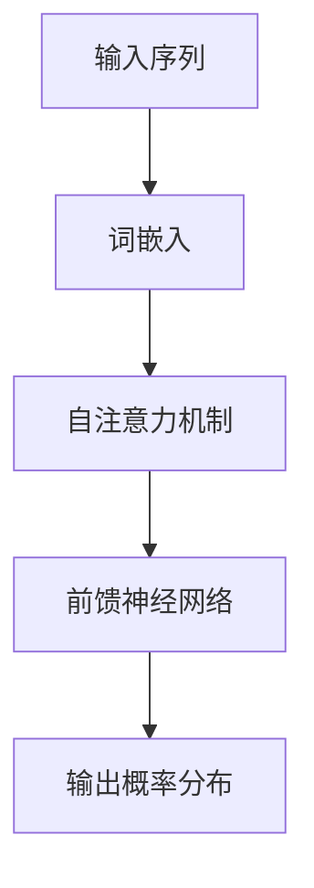
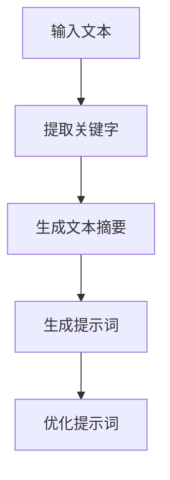
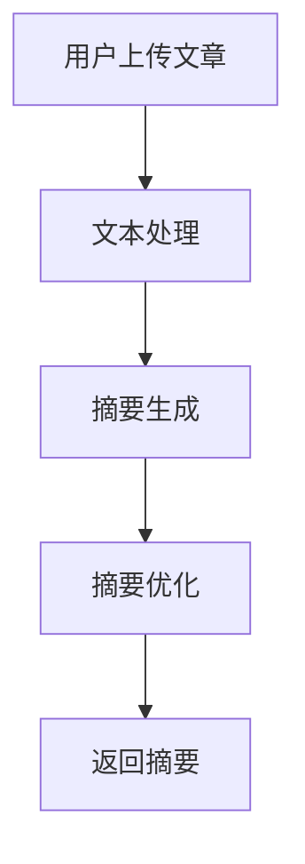
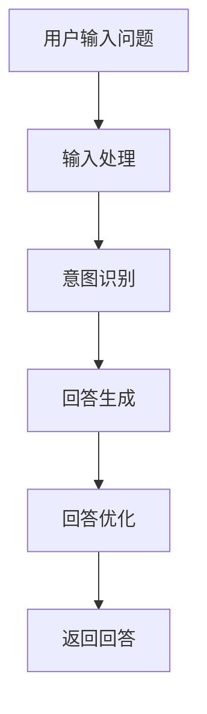
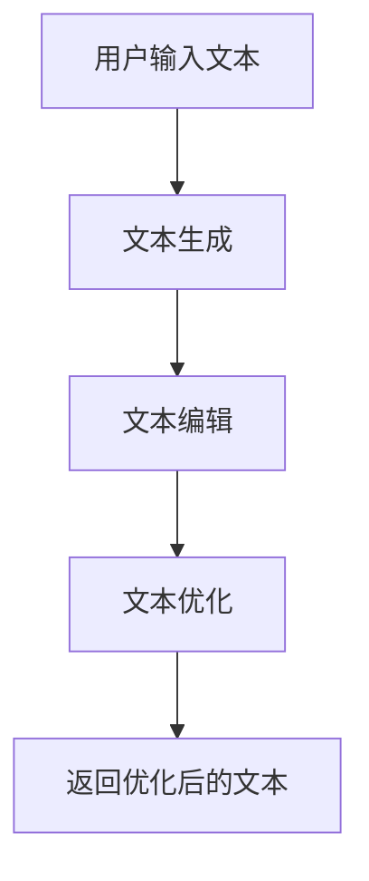

                 

### 第一部分: AI语言模型基础理论

#### 第1章: 人工智能与自然语言处理

**1.1 人工智能简史**

**1.1.1 人工智能的起源与发展**

人工智能（Artificial Intelligence, AI）的概念起源于20世纪50年代。最初，它被定义为“制造智能机器的科学与工程”。人工智能的研究始于计算机科学、数学、神经科学和心理学等多个领域的交叉领域。

- **创始人及早期贡献**：艾伦·图灵（Alan Turing）被认为是人工智能的奠基人之一，他提出了著名的图灵测试，用于评估机器是否具备智能。此外，约翰·麦卡锡（John McCarthy）等科学家也对此领域做出了重要贡献。
  
- **重要事件与里程碑**：1956年达特茅斯会议被认为是人工智能诞生的标志，会议上提出了人工智能的研究目标和路径。此后，人工智能经历了多个起伏阶段，包括20世纪80年代的专家系统热潮，以及21世纪初的深度学习革命。

**1.1.2 自然语言处理的挑战**

自然语言处理（Natural Language Processing, NLP）是人工智能的一个重要分支，专注于让计算机理解和处理人类语言。NLP面临的挑战主要包括：

- **语言的多义性**：自然语言中的词汇常常具有多种含义，这给理解和解析语言带来了困难。例如，单词“bank”在金融领域指银行，而在地理领域指河岸。

- **语言理解的复杂性**：人类能够通过语境和背景知识轻松理解复杂的语言表达，而计算机需要从大量的数据中学习和推断出语言的规律。

- **语境的重要性**：语言的理解高度依赖上下文，同样的词汇在不同的语境中可能具有完全不同的含义。

**1.1.3 上下文感知与提示词生成的概念**

- **上下文感知**：上下文感知是指模型能够根据输入的上下文信息来理解语言的含义。这对于语言生成、翻译和理解等任务至关重要。

- **提示词生成**：提示词生成是指根据给定的上下文生成一个或多个提示词，这些词可以帮助模型更好地理解和生成相关的内容。提示词通常用于提高语言模型的生成质量和效率。

### 第2章: 语言模型的核心概念

#### 2.1 语言模型的基本原理

**2.1.1 语言模型的基本原理**

- **语言模型的定义**：语言模型是一种概率模型，用于预测自然语言中下一个词的概率。它可以用来生成文本、进行文本分类、机器翻译等。

- **语言模型的应用场景**：语言模型在自然语言处理中有广泛的应用，包括文本生成、情感分析、机器翻译、对话系统等。

- **语言模型类型与比较**

  - **N-gram模型**：基于历史N个单词的频率来预测下一个单词。优点是简单高效，缺点是难以捕捉长距离依赖。

  - **神经网络语言模型**：使用神经网络来学习语言的模式，能够捕捉长距离依赖。优点是性能优异，缺点是计算复杂度较高。

  - **基于注意力机制的模型**：如Transformer模型，通过注意力机制来捕捉全局依赖。优点是性能优异，缺点是计算复杂度更高。

#### 2.2 语言模型的应用场景

**2.2.1 语言模型的应用场景**

- **文本生成**：生成文章、对话、代码等。
  
- **文本分类**：将文本分类到预定义的类别中，如垃圾邮件检测、情感分类等。

- **情感分析**：分析文本中的情感倾向，如正面、负面等。

**2.2.2 语言模型类型与比较**

- **N-gram模型**：通过统计N个连续单词的频率来预测下一个单词。

- **神经网络语言模型**：如循环神经网络（RNN）和长短期记忆网络（LSTM），能够捕捉序列中的长期依赖关系。

- **Transformer模型**：基于注意力机制的模型，能够捕捉全局依赖。

### 第3章: 上下文感知的数学模型

#### 3.1 上下文感知的重要性

- **上下文感知**：上下文感知是指模型能够根据输入的上下文信息来理解语言的含义。这对于语言生成、翻译和理解等任务至关重要。

**3.1.2 上下文感知的数学基础**

- **词嵌入**：词嵌入是将词汇映射到高维向量空间，使得语义相似的词汇在空间中距离较近。

- **注意力机制**：注意力机制是一种计算方法，模型通过它来关注输入序列中的关键部分，从而提高对上下文的感知能力。

**3.1.3 Mermaid流程图展示上下文感知算法**



以上流程图展示了上下文感知算法的基本步骤：输入序列经过词嵌入，然后通过自注意力机制和前馈神经网络处理，最终输出概率分布。

## 第4章: 提示词生成的技术细节

### 4.1 提示词生成的挑战

**4.1.1 提示词生成的难点**

- **多义性处理**：如何处理具有多种含义的词汇。
  
- **上下文匹配**：如何使生成的提示词与上下文信息紧密匹配。

**4.1.2 提示词生成的算法**

- **提取关键字**：通过算法从文本中提取出关键信息作为提示词。

- **文本摘要**：将长文本压缩成摘要，提取关键信息作为提示词。

- **生成式模型**：使用生成式模型如变分自编码器（VAE）或生成对抗网络（GAN）生成提示词。

**4.1.3 Mermaid流程图与Python代码示例**



以下是一个简单的Python代码示例，用于生成提示词：

```python
import nltk

# 提取关键字
def extract_keywords(text):
    # 使用nltk包中的算法提取关键字
    # ...
    return keywords

# 生成文本摘要
def generate_summary(text):
    # 使用nltk包中的算法生成文本摘要
    # ...
    return summary

# 生成提示词
def generate_hint(text):
    keywords = extract_keywords(text)
    summary = generate_summary(text)
    # 将关键字和摘要合并生成提示词
    hint = f"文本主要讨论了{keywords}和{summary}"
    return hint

# 测试
text = "..."
hint = generate_hint(text)
print(hint)
```

## 第5章: 语言模型在NLP中的应用

### 5.1 文本分类

**5.1.1 文本分类的定义**

文本分类（Text Classification）是一种将文本分类到预定义的类别中的任务。它广泛应用于垃圾邮件检测、情感分析、主题分类等领域。

**5.1.2 语言模型在文本分类中的应用**

- **基于统计的语言模型**：使用统计方法，如朴素贝叶斯、支持向量机（SVM）等，结合语言模型对文本进行分类。

- **基于神经网络的语言模型**：使用神经网络模型，如卷积神经网络（CNN）、循环神经网络（RNN）等，结合语言模型进行文本分类。

### 5.2 情感分析

**5.2.1 情感分析的定义**

情感分析（Sentiment Analysis）是一种评估文本中情感倾向的任务，通常用于分析消费者的反馈、社交媒体评论等。

**5.2.2 语言模型在情感分析中的应用**

- **基于规则的方法**：使用简单的规则和统计方法进行情感分析。

- **基于机器学习的方法**：使用机器学习模型，如支持向量机（SVM）、朴素贝叶斯等，结合语言模型进行情感分析。

- **基于深度学习的方法**：使用深度学习模型，如卷积神经网络（CNN）、循环神经网络（RNN）等，结合语言模型进行情感分析。

### 5.3 问答系统

**5.3.1 问答系统的定义**

问答系统（Question Answering System）是一种能够回答用户问题的系统，它广泛应用于搜索引擎、虚拟助手等领域。

**5.3.2 语言模型在问答系统中的应用**

- **基于规则的方法**：使用预定义的规则和模板来回答问题。

- **基于机器学习的方法**：使用机器学习模型，如朴素贝叶斯、支持向量机（SVM）等，结合语言模型进行问答。

- **基于深度学习的方法**：使用深度学习模型，如卷积神经网络（CNN）、循环神经网络（RNN）等，结合语言模型进行问答。

## 第6章: 实际案例剖析

### 6.1 案例一：新闻摘要生成

**6.1.1 案例背景**

新闻摘要生成是一种将长篇文章压缩成简短摘要的任务，它有助于用户快速了解文章的主要内容和重点。

**6.1.2 系统功能设计**

- **输入处理**：对输入的新闻文章进行预处理，如分词、去除停用词等。

- **文本摘要生成**：使用语言模型和提示词生成算法生成新闻摘要。

- **摘要优化**：对生成的摘要进行优化，确保摘要的准确性和可读性。

**6.1.3 系统架构设计**

- **前端**：提供用户界面，允许用户上传新闻文章并查看摘要。

- **后端**：包括文本处理模块、摘要生成模块和摘要优化模块。

**6.1.4 系统接口设计**

- **文本处理接口**：用于处理输入的文本，包括分词、去除停用词等。

- **摘要生成接口**：用于生成新闻摘要。

- **摘要优化接口**：用于优化生成的摘要。

**6.1.5 系统交互**



### 6.2 案例二：对话系统设计

**6.2.1 案例背景**

对话系统设计是一种构建与用户进行自然语言交互的系统，它广泛应用于客服、虚拟助手等领域。

**6.2.2 系统功能设计**

- **输入处理**：对用户的输入进行预处理，如分词、去除停用词等。

- **意图识别**：使用语言模型识别用户的意图。

- **回答生成**：根据用户的意图生成合适的回答。

- **回答优化**：对生成的回答进行优化，确保回答的自然性和准确性。

**6.2.3 系统架构设计**

- **前端**：提供用户界面，允许用户输入问题和查看回答。

- **后端**：包括输入处理模块、意图识别模块、回答生成模块和回答优化模块。

**6.2.4 系统接口设计**

- **输入处理接口**：用于处理用户的输入。

- **意图识别接口**：用于识别用户的意图。

- **回答生成接口**：用于生成回答。

- **回答优化接口**：用于优化生成的回答。

**6.2.5 系统交互**



### 6.3 案例三：文本生成与编辑

**6.3.1 案例背景**

文本生成与编辑是一种利用语言模型生成文本并进行编辑的任务，它广泛应用于自动写作、文本润色等领域。

**6.3.2 系统功能设计**

- **文本生成**：使用语言模型生成文本。

- **文本编辑**：对生成的文本进行编辑，包括修正语法错误、改进表达等。

**6.3.3 系统架构设计**

- **前端**：提供用户界面，允许用户输入文本并查看生成和编辑后的文本。

- **后端**：包括文本生成模块、文本编辑模块和文本优化模块。

**6.3.4 系统接口设计**

- **文本生成接口**：用于生成文本。

- **文本编辑接口**：用于编辑文本。

- **文本优化接口**：用于优化文本。

**6.3.5 系统交互**



## 第7章: 总结与未来展望

### 7.1 语言模型的发展趋势

- **模型规模的扩大**：随着计算能力的提升，语言模型的规模不断增大，例如GPT-3拥有1750亿个参数。

- **预训练技术的进步**：越来越多的模型采用预训练技术，通过在大规模数据集上预训练，模型可以更好地理解语言和上下文。

- **多模态学习**：未来的语言模型将能够处理多种数据类型，如图像、声音等，实现更丰富的交互。

### 7.2 提示词生成的未来方向

- **更精细的上下文感知**：未来的提示词生成技术将更加注重上下文的精细感知，提高生成的准确性和自然性。

- **自适应提示词生成**：根据不同的应用场景和用户需求，动态生成合适的提示词。

### 7.3 开发者应关注的要点

- **数据质量**：高质量的数据是训练优秀语言模型的基础。

- **模型优化**：通过技术手段优化模型性能，提高生成质量。

- **用户体验**：关注用户体验，确保生成的文本和交互符合用户期望。

### 作者信息

- **作者：AI天才研究院/AI Genius Institute & 禅与计算机程序设计艺术 /Zen And The Art of Computer Programming**

