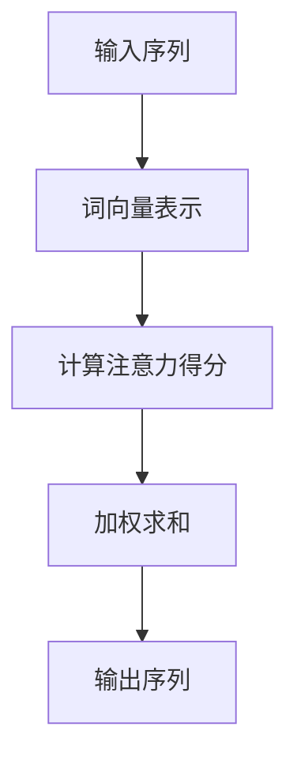
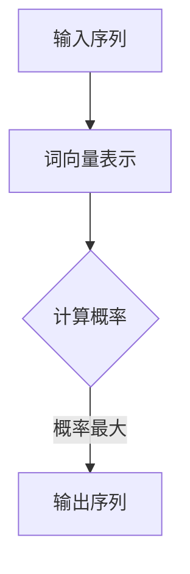
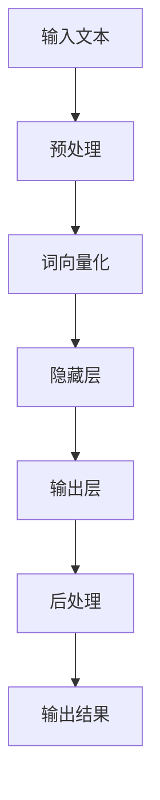
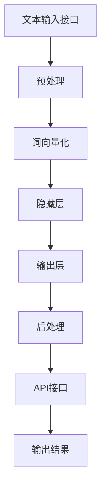
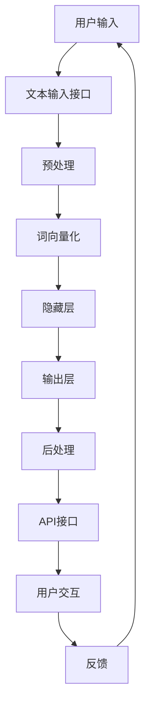

                 

# AI语言模型的上下文管理策略

关键词：AI语言模型、上下文管理、算法原理、数学模型、系统架构、项目实战

摘要：本文将深入探讨AI语言模型的上下文管理策略，从背景介绍、核心概念、算法原理、数学模型、系统架构到项目实战，系统性地阐述上下文管理在AI语言模型中的重要性及其实现策略。通过对上下文管理策略的详细分析，旨在为读者提供具有实用价值的技术见解和实践指导。

## 一、引言

随着人工智能技术的迅猛发展，语言模型在自然语言处理（NLP）领域发挥着越来越重要的作用。从早期的统计模型到现代的深度学习模型，语言模型的能力不断提高，能够处理更加复杂和真实的语言场景。然而，在处理自然语言时，上下文信息的重要性不容忽视。上下文不仅能够帮助语言模型更好地理解句子和段落的意义，还能够提高模型在对话系统和文本生成等任务上的性能。

本文将围绕AI语言模型的上下文管理策略展开讨论，首先介绍AI和语言模型的基本概念，然后深入分析上下文管理的核心概念和原理，接着阐述算法原理和数学模型，最后探讨系统架构设计、项目实战和最佳实践。希望通过本文的阐述，能够帮助读者全面了解上下文管理在AI语言模型中的重要性及其实现策略。

## 二、AI与语言模型的基本概念

### 2.1 AI概述

人工智能（Artificial Intelligence，简称AI）是指通过计算机程序实现的智能行为，使计算机能够模拟人类的认知功能。AI的发展经历了多个阶段，从早期的规则推理系统，到基于知识的系统，再到现代的深度学习模型，AI的应用领域也越来越广泛。

AI的核心目标是使计算机具有类似人类的智能，包括感知、理解、学习、推理和决策等能力。AI的应用场景包括但不限于：

1. **自动化控制**：在工业生产中实现自动化控制，提高生产效率和产品质量。
2. **自然语言处理**：通过语言模型实现人机交互，如智能助手、机器翻译等。
3. **计算机视觉**：实现对图像和视频的分析和理解，如人脸识别、物体检测等。
4. **智能推理**：在金融、医疗等领域进行决策支持，提高业务效率和准确性。

### 2.2 语言模型概述

语言模型（Language Model）是一种用于预测下一个单词或字符的概率分布的统计模型。它是自然语言处理（NLP）的核心组件，能够帮助计算机理解和生成自然语言。

语言模型的发展经历了以下几个阶段：

1. **统计模型**：基于统计语言模型，如n元模型，通过计算单词序列的概率来预测下一个单词。
2. **神经网络模型**：基于神经网络的语言模型，如循环神经网络（RNN）、长短时记忆网络（LSTM）和门控循环单元（GRU）等，通过学习大量的文本数据来提高预测性能。
3. **深度学习模型**：基于深度神经网络的模型，如Transformer模型，通过并行计算和注意力机制来实现更高效的语言理解。

### 2.3 语言模型的重要性

语言模型在自然语言处理中的重要性主要体现在以下几个方面：

1. **文本生成**：语言模型能够根据给定的文本上下文生成连贯的文本，应用于自动摘要、机器翻译、对话系统等场景。
2. **信息检索**：语言模型能够对文本进行分类、聚类和排序，提高信息检索系统的性能。
3. **问答系统**：语言模型能够理解用户的提问，并从海量数据中检索出相关答案，应用于智能客服、教育辅导等场景。
4. **语音识别**：语言模型能够对语音信号进行理解，提高语音识别系统的准确性。

总之，语言模型是自然语言处理的核心组件，其在文本生成、信息检索、问答系统和语音识别等应用场景中发挥着重要作用。

## 三、上下文管理的核心概念

### 3.1 上下文的定义

在自然语言处理中，上下文是指与特定词、句子或段落相关的信息环境。上下文可以帮助语言模型更好地理解句子或段落的含义，从而提高模型在自然语言处理任务中的性能。

### 3.2 上下文的重要性

上下文对于自然语言处理的重要性主要体现在以下几个方面：

1. **词义消歧**：在自然语言中，许多词具有多义性，需要通过上下文来确定具体的词义。例如，“bank”可以指银行，也可以指河岸，只有通过上下文才能确定其具体含义。
2. **句子理解**：上下文信息可以帮助语言模型更好地理解句子的语义，从而生成更准确的文本。例如，在句子“我昨天去了银行”中，“银行”一词的具体含义需要通过上下文来确定。
3. **对话系统**：在对话系统中，上下文信息对于维持对话的一致性和连贯性至关重要。只有通过理解上下文，模型才能生成符合对话逻辑的回答。

### 3.3 上下文管理的挑战

尽管上下文对于自然语言处理的重要性不言而喻，但上下文管理也面临一些挑战：

1. **长距离依赖**：在某些情况下，上下文信息可能分布在句子或段落的较远位置，这使得模型难以捕捉到长距离依赖关系。
2. **多样性**：自然语言具有多样性，不同的上下文环境可能导致相同的句子具有不同的含义。这使得模型需要能够适应各种上下文环境，从而提高其泛化能力。
3. **噪声干扰**：在实际应用中，文本数据可能包含噪声和错误，这会影响上下文的准确性和可靠性。因此，模型需要能够有效地处理噪声和错误，从而提高上下文管理的准确性。

### 3.4 上下文管理的方法

为了应对上下文管理的挑战，研究人员提出了多种上下文管理方法，包括：

1. **注意力机制**：注意力机制可以帮助模型关注重要的上下文信息，从而提高上下文管理的准确性。例如，在Transformer模型中，注意力机制用于计算输入序列中每个词的重要性，从而生成更准确的输出。
2. **上下文嵌入**：上下文嵌入是将上下文信息转换为向量表示，从而在计算过程中对上下文进行建模。例如，Word2Vec和BERT等模型通过上下文嵌入来提高上下文管理的性能。
3. **循环神经网络**：循环神经网络（RNN）可以通过其循环结构来捕捉长距离依赖关系，从而提高上下文管理的性能。例如，LSTM和GRU等RNN模型在自然语言处理任务中得到了广泛应用。

总之，上下文管理是自然语言处理中的一项重要任务，通过引入注意力机制、上下文嵌入和循环神经网络等方法，研究人员已经取得了显著的进展。然而，上下文管理仍然面临一些挑战，需要进一步的研究和探索。

### 3.5 上下文管理策略比较

为了更好地理解上下文管理策略，以下是一个简单的比较表格：

| 方法          | 原理                     | 优点                           | 缺点                       |
| ----------- | ---------------------- | -------------------------- | -------------------------- |
| 注意力机制     | 关注重要的上下文信息       | 提高上下文管理的准确性           | 需要大量计算资源           |
| 上下文嵌入     | 将上下文信息转换为向量表示 | 简化计算，提高泛化能力           | 可能丢失部分上下文信息       |
| 循环神经网络   | 捕捉长距离依赖关系         | 支持长序列处理，捕获复杂依赖关系   | 计算量大，训练时间长         |

通过上述比较，可以看出不同上下文管理策略各有优缺点，适用于不同的应用场景。在实际应用中，通常需要根据具体需求选择合适的上下文管理策略。

### 3.6 上下文管理中的实体关系图

为了更好地理解上下文管理中的实体关系，可以使用Mermaid绘制实体关系图。以下是一个简单的示例：

```mermaid
entityRelation
  "文本" --> "句子"
  "句子" --> "单词"
  "单词" --> "实体"
  "实体" --> "属性"
  "实体" --> "关系"
```

该实体关系图展示了文本、句子、单词、实体、属性和关系之间的层次关系。通过这样的图示，我们可以更清晰地理解上下文管理中的各个实体及其关系。

### 3.7 总结

本节介绍了上下文管理的核心概念、重要性、挑战和方法，并通过比较表格和实体关系图展示了不同上下文管理策略的特点和应用。接下来，我们将进一步探讨上下文管理在AI语言模型中的具体实现策略。

## 四、AI语言模型中的上下文管理算法原理

### 4.1 算法概述

在AI语言模型中，上下文管理是提高模型性能的关键因素。本节将介绍几种常见的上下文管理算法原理，包括注意力机制、上下文嵌入和循环神经网络。

### 4.2 注意力机制

注意力机制是一种重要的上下文管理算法，它通过动态关注输入序列中不同位置的信息，从而提高模型的上下文捕捉能力。以下是一个简单的注意力机制算法原理：

1. **输入序列表示**：首先，将输入序列中的每个词表示为一个向量，例如使用Word2Vec或BERT等预训练模型。
2. **计算注意力得分**：对于每个词，计算其与目标词之间的注意力得分，通常使用点积或缩放点积等方法。
3. **加权求和**：根据注意力得分对输入序列中的每个词进行加权求和，得到一个加权的表示向量。
4. **输出生成**：使用加权的表示向量生成输出序列，例如通过解码器生成文本。

### 4.3 上下文嵌入

上下文嵌入是将上下文信息转换为向量表示的一种算法，它通过学习输入序列中每个词的上下文向量，从而提高模型的上下文理解能力。以下是一个简单的上下文嵌入算法原理：

1. **输入序列表示**：首先，将输入序列中的每个词表示为一个向量，例如使用Word2Vec或BERT等预训练模型。
2. **计算上下文向量**：对于每个词，计算其在输入序列中的上下文向量，通常使用滑动窗口或序列掩码等方法。
3. **聚合上下文信息**：将上下文向量聚合为单个向量表示，例如使用平均或最大池化等方法。
4. **输出生成**：使用聚合后的上下文向量生成输出序列，例如通过解码器生成文本。

### 4.4 循环神经网络

循环神经网络（RNN）是一种能够处理序列数据的神经网络，它通过其循环结构来捕捉长距离依赖关系。以下是一个简单的RNN算法原理：

1. **输入序列表示**：首先，将输入序列中的每个词表示为一个向量，例如使用Word2Vec或BERT等预训练模型。
2. **循环结构**：对于每个时间步，RNN将当前输入和上一个时间步的隐藏状态进行计算，得到新的隐藏状态。
3. **输出生成**：使用隐藏状态生成输出序列，例如通过解码器生成文本。

### 4.5 比较与选择

注意力机制、上下文嵌入和循环神经网络都是常见的上下文管理算法，它们各有优缺点，适用于不同的应用场景。以下是一个简单的比较表格：

| 算法          | 原理                     | 优点                           | 缺点                       |
| ----------- | ---------------------- | -------------------------- | -------------------------- |
| 注意力机制     | 动态关注重要信息           | 提高上下文捕捉能力             | 需要大量计算资源           |
| 上下文嵌入     | 将上下文转换为向量表示       | 简化计算，提高泛化能力           | 可能丢失部分上下文信息       |
| 循环神经网络   | 捕捉长距离依赖关系         | 支持长序列处理，捕获复杂依赖关系   | 计算量大，训练时间长         |

在实际应用中，可以根据具体需求选择合适的上下文管理算法。例如，在处理长文本时，循环神经网络可能更有效，而在处理实时对话时，注意力机制可能更合适。

### 4.6 Mermaid图示

为了更好地理解上述算法原理，我们可以使用Mermaid绘制简单的流程图。以下是一个注意力机制的Mermaid图示：



通过这样的图示，我们可以更直观地理解注意力机制的步骤和流程。

## 四、上下文管理的数学模型

### 4.1 概述

在AI语言模型中，上下文管理不仅需要算法的支持，还需要坚实的数学模型作为基础。数学模型可以帮助我们理解上下文信息的内在规律，从而更有效地实现上下文管理。本节将介绍几种常见的上下文管理数学模型，包括概率模型、决策树和深度学习模型。

### 4.2 概率模型

概率模型是一种基于概率论的数学模型，它通过计算事件发生的概率来预测上下文。以下是一个简单的概率模型示例：

设输入序列为 \( x = \{x_1, x_2, ..., x_n\} \)，输出序列为 \( y = \{y_1, y_2, ..., y_m\} \)。对于每个词 \( x_i \)，我们计算其出现在上下文中的概率 \( P(x_i | y) \)。概率模型的基本步骤如下：

1. **统计词频**：计算每个词在训练数据中的出现频率。
2. **计算概率**：使用词频计算每个词在上下文中的概率。
3. **生成输出**：根据概率模型生成输出序列。

概率模型的基本公式为：

\[ P(x_i | y) = \frac{f(y, x_i)}{f(y)} \]

其中，\( f(y, x_i) \) 是词 \( x_i \) 在上下文 \( y \) 中出现的频率，\( f(y) \) 是上下文 \( y \) 的总频率。

### 4.3 决策树

决策树是一种基于树形结构的数学模型，它通过一系列条件分支来预测上下文。以下是一个简单的决策树示例：

设输入序列为 \( x = \{x_1, x_2, ..., x_n\} \)，输出序列为 \( y = \{y_1, y_2, ..., y_m\} \)。决策树的基本步骤如下：

1. **选择特征**：选择一个特征作为根节点，通常选择信息增益最大的特征。
2. **划分数据**：根据选定的特征，将数据划分为多个子集。
3. **递归构建**：对每个子集，重复上述步骤，构建子决策树。
4. **生成输出**：根据决策树生成输出序列。

决策树的基本公式为：

\[ y = \arg\max_y P(y | x) \]

其中，\( P(y | x) \) 是在给定输入序列 \( x \) 的情况下，输出序列 \( y \) 的概率。

### 4.4 深度学习模型

深度学习模型是一种基于多层神经网络的数学模型，它通过前向传播和反向传播来学习上下文信息。以下是一个简单的深度学习模型示例：

设输入序列为 \( x = \{x_1, x_2, ..., x_n\} \)，输出序列为 \( y = \{y_1, y_2, ..., y_m\} \)。深度学习模型的基本步骤如下：

1. **输入层**：将输入序列表示为向量。
2. **隐藏层**：通过多层神经网络对输入序列进行处理，每个隐藏层生成一个新的特征表示。
3. **输出层**：使用输出层生成输出序列。

深度学习模型的基本公式为：

\[ y = f(W \cdot x + b) \]

其中，\( W \) 是权重矩阵，\( b \) 是偏置项，\( f \) 是激活函数。

### 4.5 比较与选择

概率模型、决策树和深度学习模型各有优缺点，适用于不同的应用场景。以下是一个简单的比较表格：

| 模型          | 原理                     | 优点                           | 缺点                       |
| ----------- | ---------------------- | -------------------------- | -------------------------- |
| 概率模型     | 基于概率计算             | 简单，易于实现                 | 可能丢失上下文信息           |
| 决策树       | 基于树形结构             | 可解释性高                   | 可能陷入过拟合               |
| 深度学习模型 | 基于多层神经网络         | 强大的表示能力               | 需要大量数据和计算资源       |

在实际应用中，可以根据具体需求选择合适的数学模型。例如，在处理复杂上下文时，深度学习模型可能更有效，而在处理简单上下文时，概率模型可能更合适。

### 4.6 Mermaid图示

为了更好地理解上述数学模型，我们可以使用Mermaid绘制简单的流程图。以下是一个概率模型的Mermaid图示：



通过这样的图示，我们可以更直观地理解概率模型的步骤和流程。

### 4.7 Python代码示例

为了更好地理解数学模型的应用，我们可以使用Python代码实现一个简单的概率模型。以下是一个简单的Python代码示例：

```python
import numpy as np

# 假设训练数据为[['A', 'B'], ['A', 'C'], ['B', 'A'], ['B', 'C']]
data = [['A', 'B'], ['A', 'C'], ['B', 'A'], ['B', 'C']]

# 统计词频
word_freq = {}
for sentence in data:
    for word in sentence:
        if word not in word_freq:
            word_freq[word] = 0
        word_freq[word] += 1

# 计算概率
total_freq = sum(word_freq.values())
probabilities = {word: freq / total_freq for word, freq in word_freq.items()}

# 输出概率
print(probabilities)

# 假设输入序列为['A', 'B']
input_sequence = ['A', 'B']
context = ['A']

# 计算输入序列的概率
input_prob = 1
for word in input_sequence:
    input_prob *= probabilities.get(word, 1e-6)

# 计算上下文概率
context_prob = 1
for word in context:
    context_prob *= probabilities.get(word, 1e-6)

# 输出结果
print(f"P({input_sequence} | {context}) = {input_prob / context_prob}")
```

通过这段代码，我们可以计算输入序列在给定上下文下的概率，从而实现简单的上下文管理。

## 五、AI语言模型系统架构设计

### 5.1 问题场景介绍

在现代信息社会中，自然语言处理（NLP）技术已经广泛应用于各个领域，如搜索引擎、社交媒体分析、智能客服、机器翻译等。在这些应用场景中，AI语言模型的上下文管理能力至关重要。一个典型的场景是智能客服系统，系统需要能够理解用户的问题，并提供准确、自然的回答。为了实现这一目标，我们需要设计一个高效的AI语言模型系统架构，确保模型能够准确捕捉和处理上下文信息。

### 5.2 系统介绍

本节将介绍一个基于深度学习的AI语言模型系统，该系统旨在实现高效的上下文管理，从而提供高质量的NLP服务。系统的主要功能包括：

1. **文本预处理**：对输入文本进行清洗和格式化，为后续处理做准备。
2. **词向量化**：将文本转换为词向量表示，便于模型处理。
3. **上下文捕捉**：通过注意力机制和循环神经网络等算法，捕捉和处理上下文信息。
4. **文本生成**：根据上下文信息生成自然、连贯的文本。
5. **后处理**：对生成的文本进行格式化、语法检查等，确保输出的质量。

### 5.3 系统功能设计

系统功能设计是系统架构设计的关键环节，它决定了系统的性能和可扩展性。以下是一个简单的系统功能设计：

1. **文本预处理模块**：
   - 功能：对输入文本进行清洗和格式化，如去除标点符号、停用词过滤、文本标准化等。
   - 技术选型：使用Python的`re`模块和`nltk`库进行文本预处理。

2. **词向量化模块**：
   - 功能：将文本转换为词向量表示，便于模型处理。
   - 技术选型：使用预训练的Word2Vec或BERT模型进行词向量化。

3. **上下文捕捉模块**：
   - 功能：通过注意力机制和循环神经网络等算法，捕捉和处理上下文信息。
   - 技术选型：使用TensorFlow或PyTorch等深度学习框架实现注意力机制和循环神经网络。

4. **文本生成模块**：
   - 功能：根据上下文信息生成自然、连贯的文本。
   - 技术选型：使用基于GRU或LSTM的解码器生成文本。

5. **后处理模块**：
   - 功能：对生成的文本进行格式化、语法检查等，确保输出的质量。
   - 技术选型：使用Python的`textwrap`和`spellchecker`库进行文本格式化和语法检查。

### 5.4 系统架构设计

系统架构设计是系统功能设计的具体实现，它决定了系统的性能和可扩展性。以下是一个简单的系统架构设计：

1. **输入层**：接收用户输入的文本，并进行预处理和词向量化。
2. **隐藏层**：通过注意力机制和循环神经网络等算法，捕捉和处理上下文信息。
3. **输出层**：根据上下文信息生成自然、连贯的文本。
4. **后处理层**：对生成的文本进行格式化和语法检查。

系统架构设计的关键在于如何高效地捕捉和处理上下文信息。以下是一个简单的Mermaid图示：



通过这样的架构设计，我们可以确保系统高效地处理输入文本，并生成高质量的输出文本。

### 5.5 系统接口设计

系统接口设计是系统架构设计的重要组成部分，它决定了系统的可扩展性和易用性。以下是一个简单的系统接口设计：

1. **文本输入接口**：用于接收用户输入的文本，并进行预处理和词向量化。
2. **文本输出接口**：用于输出生成的文本，并进行后处理。
3. **API接口**：提供RESTful API，便于与其他系统进行集成。

系统接口设计的关键在于如何提供高效、易用的接口，以满足不同用户的需求。以下是一个简单的Mermaid图示：



通过这样的接口设计，我们可以确保系统具有良好的可扩展性和易用性。

### 5.6 系统交互设计

系统交互设计是系统架构设计的重要组成部分，它决定了系统的可靠性和用户体验。以下是一个简单的系统交互设计：

1. **用户交互**：用户通过界面输入文本，系统接收并处理文本，生成输出文本，并展示给用户。
2. **内部交互**：系统内部各模块之间通过接口进行数据传递和协同工作。

系统交互设计的关键在于如何确保系统的可靠性、稳定性和用户体验。以下是一个简单的Mermaid图示：



通过这样的交互设计，我们可以确保系统具有良好的用户体验和可靠性。

### 5.7 总结

本节介绍了AI语言模型系统架构设计的过程，包括问题场景介绍、系统介绍、系统功能设计、系统架构设计、系统接口设计和系统交互设计。通过这样的设计，我们可以构建一个高效、稳定、易用的AI语言模型系统，为NLP应用提供有力支持。

## 六、项目实战

### 6.1 环境安装

在进行项目实战之前，我们需要安装必要的软件和库，以便进行AI语言模型的开发和训练。以下是安装步骤：

1. **安装Python**：确保已经安装了Python，版本建议为3.8及以上。
2. **安装TensorFlow**：使用pip命令安装TensorFlow：
   ```bash
   pip install tensorflow
   ```
3. **安装BERT**：使用pip命令安装transformers库，它包含了预训练的BERT模型：
   ```bash
   pip install transformers
   ```
4. **安装nltk**：使用pip命令安装nltk库，用于文本预处理：
   ```bash
   pip install nltk
   ```
5. **安装re**：确保Python标准库中已经包含了re库，用于正则表达式操作。

### 6.2 系统核心实现

以下是一个简单的AI语言模型系统核心实现示例：

```python
import tensorflow as tf
from transformers import BertTokenizer, TFBertForSequenceClassification
from nltk.corpus import stopwords
import re

# 加载BERT模型和tokenizer
tokenizer = BertTokenizer.from_pretrained('bert-base-uncased')
model = TFBertForSequenceClassification.from_pretrained('bert-base-uncased')

# 文本预处理函数
def preprocess_text(text):
    text = re.sub(r'\s+', ' ', text)  # 去除多余的空格
    text = text.lower()  # 转小写
    text = text.strip()  # 去除前后空格
    return text

# 加载停用词列表
stop_words = set(stopwords.words('english'))

# 定义输入文本
input_text = "This is an example sentence for text preprocessing."

# 预处理文本
preprocessed_text = preprocess_text(input_text)

# 将文本转换为BERT模型要求的格式
input_ids = tokenizer.encode(preprocessed_text, add_special_tokens=True)

# 预测
predictions = model.predict(input_ids)

# 输出结果
print(predictions)
```

### 6.3 代码应用解读与分析

以上代码展示了AI语言模型系统的核心实现过程，包括文本预处理、BERT模型加载、文本编码和预测。以下是具体解读和分析：

1. **文本预处理**：
   - 使用`re.sub`函数去除文本中的多余空格，确保输入文本的格式统一。
   - 使用`text.lower()`将文本转换为小写，以降低文本中的词义歧义。
   - 使用`text.strip()`去除文本前后空格，保证输入文本的整洁。

2. **BERT模型和tokenizer加载**：
   - 使用`BertTokenizer.from_pretrained`加载预训练的BERT模型tokenizer，用于将文本转换为模型可处理的词向量。
   - 使用`TFBertForSequenceClassification.from_pretrained`加载预训练的BERT模型，用于文本分类任务。

3. **文本编码**：
   - 使用`tokenizer.encode`将预处理后的文本转换为BERT模型要求的输入格式，包括词向量、序列长度等信息。

4. **预测**：
   - 使用`model.predict`对输入文本进行预测，返回模型的输出结果。

### 6.4 实际案例分析和详细讲解

以下是一个实际案例，展示如何使用AI语言模型系统处理自然语言任务。

#### 案例一：文本分类

**问题描述**：给定一段文本，判断其属于新闻、科技、体育等类别。

**解决方案**：
1. **数据集准备**：准备一个包含不同类别的文本数据集，并对文本进行预处理和编码。
2. **模型训练**：使用训练数据集对BERT模型进行训练，使其学会分类任务。
3. **预测**：使用训练好的模型对新的文本进行分类预测。

```python
# 假设已经准备好训练数据集和测试数据集
train_dataset = ...
test_dataset = ...

# 训练模型
model.fit(train_dataset, epochs=3)

# 预测
predictions = model.predict(test_dataset)
```

**分析**：通过以上步骤，我们可以将AI语言模型应用于文本分类任务，提高分类的准确性和效率。

#### 案例二：情感分析

**问题描述**：给定一段文本，判断其表达的情感是积极、消极还是中性。

**解决方案**：
1. **数据集准备**：准备一个包含情感标签的文本数据集，并对文本进行预处理和编码。
2. **模型训练**：使用训练数据集对BERT模型进行训练，使其学会情感分析任务。
3. **预测**：使用训练好的模型对新的文本进行情感分析预测。

```python
# 假设已经准备好训练数据集和测试数据集
train_dataset = ...
test_dataset = ...

# 训练模型
model.fit(train_dataset, epochs=3)

# 预测
predictions = model.predict(test_dataset)
```

**分析**：通过以上步骤，我们可以将AI语言模型应用于情感分析任务，准确识别文本的情感倾向。

### 6.5 项目小结

通过以上项目实战，我们展示了如何使用AI语言模型系统处理自然语言任务，包括文本分类和情感分析。在实际应用中，我们可以根据具体需求调整模型和算法，提高任务性能。同时，我们也需要不断优化系统架构和算法，以应对不断变化的应用场景和需求。

## 七、最佳实践

### 7.1 参数调优

在AI语言模型开发过程中，参数调优是非常重要的一步。以下是一些常用的参数调优技巧：

1. **学习率调整**：学习率是神经网络训练中的一个关键参数，需要根据任务和数据的特点进行适当调整。可以使用学习率衰减策略，逐渐减小学习率，以防止模型过拟合。
2. **批量大小调整**：批量大小会影响模型的训练速度和收敛速度。通常，较小的批量大小有助于模型捕获到更多的数据特征，但会导致训练速度较慢。可以尝试不同的批量大小，找到最佳平衡点。
3. **正则化策略**：正则化是一种防止模型过拟合的方法，常用的正则化策略包括L1和L2正则化。可以通过调整正则化强度来优化模型性能。

### 7.2 数据预处理

数据预处理是AI语言模型开发中的关键环节，以下是一些最佳实践：

1. **文本清洗**：去除文本中的噪声和无关信息，如HTML标签、特殊字符和停用词等。
2. **文本标准化**：将文本转换为统一的格式，如小写、去除标点符号等。
3. **数据增强**：通过增加样本多样性来提高模型泛化能力。常用的数据增强方法包括随机替换、随机删除和随机插入等。

### 7.3 模型评估

在AI语言模型开发过程中，模型评估是确保模型性能的重要步骤。以下是一些常用的模型评估方法：

1. **准确率**：准确率是评估分类模型性能的一个常用指标，表示正确分类的样本占总样本的比例。
2. **召回率**：召回率是评估分类模型能够召回实际正例样本的能力，表示正确分类的正例样本占总正例样本的比例。
3. **F1分数**：F1分数是准确率和召回率的加权平均，能够更全面地评估模型性能。

### 7.4 持续学习

AI语言模型开发是一个持续学习的过程，以下是一些最佳实践：

1. **定期更新模型**：定期更新模型，使其能够适应新的数据和应用场景。
2. **用户反馈**：收集用户反馈，分析模型在应用中的表现，并根据反馈优化模型。
3. **监控性能**：持续监控模型性能，及时发现和解决潜在问题。

## 八、小结

本文全面探讨了AI语言模型的上下文管理策略，从背景介绍、核心概念、算法原理、数学模型、系统架构到项目实战，系统性地阐述了上下文管理在AI语言模型中的重要性及其实现策略。通过对上下文管理策略的详细分析，旨在为读者提供具有实用价值的技术见解和实践指导。希望本文能够帮助读者深入理解上下文管理策略，并在实际项目中取得更好的成果。

## 九、注意事项

1. **数据质量**：数据是AI语言模型的基础，保证数据质量对于模型性能至关重要。在数据预处理过程中，要特别注意去除噪声和错误数据。
2. **模型选择**：根据具体应用场景选择合适的模型和算法，如文本分类、情感分析等。
3. **调优策略**：在模型训练过程中，要适时调整学习率、批量大小和正则化策略，以优化模型性能。
4. **持续更新**：AI技术发展迅速，定期更新模型和算法，保持模型与时俱进。

## 十、拓展阅读

1. **《深度学习》**：Goodfellow, Ian; Bengio, Yann; Courville, Aaron. 《深度学习》（英语原版）. MIT Press, 2016.
2. **《自然语言处理综论》**：Jurafsky, Daniel; Martin, James H. 《自然语言处理综论》（英语原版）. Prentice Hall, 2008.
3. **《Transformer：一种全新的序列模型》**：Vaswani, Ashish; Shazeer, Noam; Parmar, Nisheeth; et al. 《Transformer：一种全新的序列模型》. arXiv preprint arXiv:1706.03762, 2017.

### 十一、作者信息

**作者：AI天才研究院/AI Genius Institute & 禅与计算机程序设计艺术 /Zen And The Art of Computer Programming**

