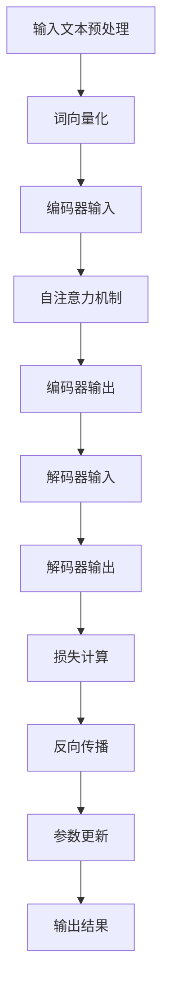
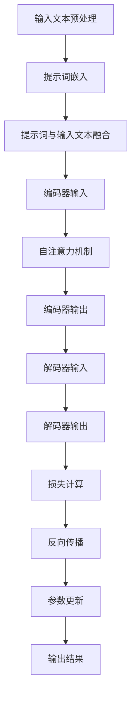
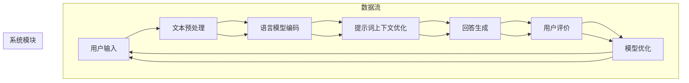
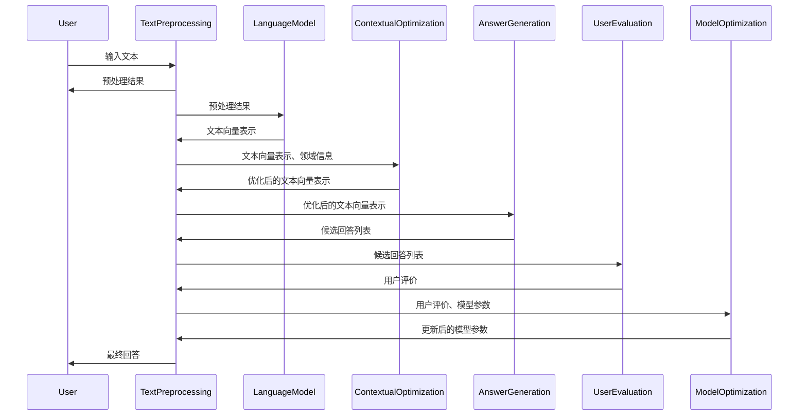

                 

### 第一部分：背景介绍

### 1.1 问题背景

#### 语言模型的应用现状

语言模型在自然语言处理（NLP）领域扮演着至关重要的角色，已经成为许多AI应用的基石。从自动翻译、文本摘要到聊天机器人和语音识别，语言模型的应用无处不在。随着深度学习技术的发展，神经网络语言模型如BERT、GPT-3等取得了显著的性能提升，使得模型能够更好地理解和生成自然语言。

然而，在实际应用中，语言模型的表现并不总是令人满意。尤其是在处理长文本和复杂语境时，模型往往会出现语义理解偏差或生成不连贯的回答。这不仅影响了用户体验，也给模型在特定领域的应用带来了挑战。

#### 提示词上下文优化的重要性

提示词上下文（contextual cues）是影响语言模型性能的关键因素。在模型训练过程中，提示词提供了上下文信息，帮助模型更好地理解输入文本的语义。优化提示词上下文，可以显著提升模型的语义理解能力，使其在处理复杂任务时更加准确和高效。

例如，在问答系统中，通过精确的提示词上下文，模型可以更准确地理解用户的问题，提供更为准确的答案。而在文本生成任务中，良好的上下文优化能够提高生成文本的连贯性和一致性，避免生成无意义或矛盾的句子。

#### 当前存在的问题与挑战

尽管提示词上下文优化的重要性已被广泛认可，但实际操作中仍面临诸多挑战：

1. **数据稀疏性**：高质量的标注数据对于训练提示词上下文优化模型至关重要。然而，获取这类数据往往需要大量的人力和时间成本，尤其是在专业领域或特殊场景下。

2. **模型复杂性**：现代语言模型如GPT-3包含数十亿参数，优化提示词上下文的过程需要大量的计算资源。这不仅增加了训练成本，也延长了模型训练时间。

3. **泛化能力**：优化后的提示词上下文对于特定领域或任务可能效果显著，但在其他领域或任务上可能并不适用。如何提高模型的泛化能力，是当前研究的一个重要方向。

4. **可解释性**：优化提示词上下文的过程通常是基于大量数据的统计学习，缺乏直观的可解释性。理解模型的决策过程，对于提升模型的可信度和用户接受度具有重要意义。

### 1.2 核心概念

#### 语言模型

语言模型是一种统计模型，旨在预测一个文本序列中下一个单词或字符的概率分布。最常见的形式是神经网络语言模型（Neural Language Model，NLM），特别是基于递归神经网络（RNN）和变换器（Transformer）的模型，如GPT和BERT。

#### 提示词上下文

提示词上下文是指提供给语言模型的额外信息，用于增强模型在特定任务上的性能。这些信息可以包括关键词、标签、特定领域的词汇等。通过优化提示词上下文，模型可以更好地理解输入文本的语义，提高生成文本的质量。

#### 优化策略

优化策略是指一系列技术手段，用于提升语言模型在特定任务上的性能。常见的策略包括数据增强、迁移学习、上下文引导等。

### 1.3 边界与外延

#### 优化目标的界定

优化目标的界定取决于具体的应用场景。例如，在问答系统中，目标是提高模型回答的准确性和连贯性；而在文本生成任务中，目标是提高生成文本的质量和连贯性。

#### 优化范围的确定

优化范围包括数据集的选择、模型架构的设计、训练策略的制定等。在确定优化范围时，需要综合考虑计算资源、时间成本和实际需求。

### 1.4 概念结构与核心要素组成

#### 语言模型的构成

语言模型主要由以下几个部分构成：

1. **输入层**：接收原始文本数据，进行预处理。
2. **隐藏层**：通过神经网络结构，对输入文本进行特征提取和语义表示。
3. **输出层**：生成概率分布，预测下一个单词或字符。

#### 提示词上下文的构成

提示词上下文通常包括以下几个部分：

1. **关键词**：用于指示文本的主题或焦点。
2. **上下文信息**：如时间、地点、人物等，用于补充背景信息。
3. **标签**：用于分类或标注文本。

#### 优化策略的核心要素

优化策略的核心要素包括：

1. **数据增强**：通过扩充数据集，提高模型的泛化能力。
2. **迁移学习**：利用预训练模型，减少训练时间和计算成本。
3. **上下文引导**：通过精心设计的提示词，引导模型学习更符合需求的特征。

---

在接下来的部分，我们将深入探讨语言模型、提示词上下文和优化策略的原理，并通过具体算法和系统设计，详细解析如何实现提示词上下文的优化。敬请期待。 

### 1.2 核心概念

#### 语言模型

语言模型是自然语言处理（NLP）中的一个基础工具，其核心目的是预测一段文本序列中下一个单词或字符的概率分布。最早的语言模型基于统计方法，如N-gram模型，它通过计算单词或字符的相邻序列的频率来预测下一个词或字符。随着深度学习技术的发展，现代语言模型，如基于变换器（Transformer）的BERT、GPT等，取得了显著的性能提升。

**数学模型**：现代语言模型通常基于深度神经网络，其核心是自注意力机制（Self-Attention）。自注意力机制通过计算输入文本中每个单词之间的相互依赖关系，生成一个表示该单词的向量。该过程可以用以下数学模型表示：

$$
\text{Attention}(Q, K, V) = \text{softmax}\left(\frac{QK^T}{\sqrt{d_k}}\right) V
$$

其中，$Q$、$K$ 和 $V$ 分别代表查询（Query）、键（Key）和值（Value）向量，$d_k$ 是键向量的维度。

**工作原理**：语言模型通过以下步骤工作：

1. **编码**：输入文本通过编码器（Encoder）转换为向量表示。
2. **注意力机制**：编码器的每个输出通过自注意力机制计算得到新的向量表示，表示该词在整个文本中的重要性。
3. **解码**：解码器（Decoder）利用自注意力机制和编码器的输出向量生成预测的单词或字符。

**特点与优势**：

- **强大的语义理解能力**：通过自注意力机制，模型能够捕捉长距离的依赖关系，从而更准确地理解语义。
- **并行处理**：变换器架构允许模型并行处理输入序列，提高了计算效率。
- **适应性**：可以通过微调（Fine-tuning）在特定任务上优化模型。

#### 提示词上下文

提示词上下文是语言模型在特定任务上表现的关键因素，它为模型提供了额外的语义信息，有助于模型更好地理解输入文本的上下文。

**数学模型**：提示词上下文可以通过以下方式集成到语言模型中：

1. **拼接**：将提示词直接拼接到输入文本的开头或结尾。
2. **嵌入**：将提示词作为额外的向量嵌入到输入文本的向量表示中。
3. **上下文向量**：通过特定的网络结构（如BERT中的“[CLS]”标记），为提示词生成专门的向量表示。

**工作原理**：提示词上下文通过以下步骤作用于语言模型：

1. **预处理**：对提示词进行预处理，如分词、标准化等。
2. **嵌入**：将预处理后的提示词转换为固定维度的向量表示。
3. **融合**：将提示词的向量表示与输入文本的向量表示进行融合。
4. **模型更新**：通过自注意力机制和反向传播算法，更新模型参数，使模型更好地捕捉到提示词的语义信息。

**特点与优势**：

- **增强语义理解**：提示词上下文提供了与任务相关的额外信息，有助于模型更好地理解输入文本的语义。
- **提高任务性能**：在问答系统、文本生成等任务中，良好的提示词上下文可以显著提高模型的性能和准确性。
- **灵活性**：提示词上下文可以灵活调整，以适应不同任务的需求。

#### 优化策略

优化策略是指一系列技术手段，用于提升语言模型在特定任务上的性能。常见的优化策略包括数据增强、迁移学习、上下文引导等。

**数学模型**：优化策略通常通过以下数学模型实现：

1. **数据增强**：通过生成或变换数据，增加模型的训练数据量，提高模型的泛化能力。
2. **迁移学习**：利用预训练模型，在特定任务上进行微调，减少训练时间和计算成本。
3. **上下文引导**：通过精心设计的提示词上下文，引导模型学习更符合需求的特征。

**工作原理**：优化策略通过以下步骤实现：

1. **数据增强**：生成或变换数据，如数据扩充、数据生成等。
2. **迁移学习**：将预训练模型应用于特定任务，通过微调优化模型参数。
3. **上下文引导**：设计有效的提示词上下文，引导模型学习特定领域的特征。

**特点与优势**：

- **提高模型性能**：优化策略能够显著提高模型在特定任务上的性能。
- **减少训练成本**：通过迁移学习和数据增强，减少训练时间和计算资源的需求。
- **灵活性**：优化策略可以根据不同任务需求进行调整，提高模型的可适应性。

### 2.3 优化策略原理

#### 数学模型

优化策略的数学模型通常涉及以下几个关键组成部分：

1. **损失函数**：用于评估模型预测结果与真实结果之间的差异，如交叉熵损失函数。
2. **正则化**：用于防止模型过拟合，如L2正则化。
3. **优化算法**：用于更新模型参数，如随机梯度下降（SGD）。

具体而言，优化策略的数学模型可以表示为：

$$
\text{Loss} = \sum_{i=1}^{N} \left( -y_i \log(\hat{y}_i) \right) + \lambda \cdot \text{Regularization}
$$

其中，$y_i$ 是真实标签，$\hat{y}_i$ 是模型预测的概率分布，$N$ 是样本数量，$\lambda$ 是正则化参数。

#### 工作原理

优化策略的工作原理主要包括以下步骤：

1. **初始化**：初始化模型参数。
2. **前向传播**：输入数据通过模型计算得到预测结果。
3. **损失计算**：计算预测结果与真实结果之间的差异，得到损失值。
4. **反向传播**：通过反向传播算法，计算损失对模型参数的梯度。
5. **参数更新**：根据梯度更新模型参数。

具体而言，优化策略的工作原理如下：

- **初始化**：随机初始化模型参数。
- **前向传播**：将输入数据通过编码器、解码器等模型组件进行编码和解码，得到预测的单词或字符概率分布。
- **损失计算**：使用交叉熵损失函数计算预测结果与真实结果之间的差异，得到损失值。
- **反向传播**：计算损失值对模型参数的梯度，并通过梯度更新模型参数。
- **参数更新**：根据梯度更新模型参数，以最小化损失值。

#### 特点与优势

1. **提高模型性能**：优化策略能够通过减少过拟合、提高泛化能力等方式，显著提高模型在特定任务上的性能。
2. **适应性强**：优化策略可以根据不同任务需求进行调整，如调整损失函数、正则化参数等，以提高模型在特定任务上的效果。
3. **灵活性**：优化策略可以结合多种技术手段，如数据增强、迁移学习、上下文引导等，以提高模型的整体性能。

通过深入理解优化策略的数学模型和工作原理，我们可以更好地设计出有效的优化方法，从而提升语言模型在各类NLP任务中的性能。

### 第三部分：算法原理讲解

在深入了解语言模型、提示词上下文和优化策略的原理后，我们接下来将详细讲解具体的算法原理。这一部分将分为两个主要部分：语言模型算法原理和提示词上下文优化算法原理。我们将使用mermaid流程图、Python源代码实现、数学模型与公式讲解，以及举例说明，力求以清晰、易懂的方式展示算法的核心内容和实现过程。

#### 3.1 语言模型算法原理

##### 3.1.1 语言模型算法的mermaid流程图

首先，我们通过mermaid流程图来展示语言模型的基本工作流程：



这个流程图概括了从输入文本预处理到生成输出结果的整个语言模型算法的执行过程。

##### 3.1.2 语言模型算法的Python源代码实现

接下来，我们通过Python代码实现一个简化的语言模型算法，以展示其基本结构：

```python
import torch
import torch.nn as nn
import torch.optim as optim

# 假设已经定义了词向量、编码器和解码器模型
vocab_size = 10000
embed_size = 256
hidden_size = 512

# 定义语言模型模型
class LanguageModel(nn.Module):
    def __init__(self):
        super(LanguageModel, self).__init__()
        self嵌入层 = nn.Embedding(vocab_size, embed_size)
        self编码器 = nn.LSTM(embed_size, hidden_size)
        self解码器 = nn.LSTM(hidden_size, vocab_size)
        self输出层 = nn.Linear(hidden_size, vocab_size)

    def forward(self, input_seq, hidden):
        embed = self嵌入层(input_seq)
        output, hidden = self编码器(embed, hidden)
        output = self输出层(output)
        return output, hidden

# 初始化模型和优化器
model = LanguageModel()
optimizer = optim.Adam(model.parameters(), lr=0.001)
损失函数 = nn.CrossEntropyLoss()

# 训练模型
for epoch in range(10):
    for sentence in train_data:
        input_seq = torch.tensor([vocab[sword] for sword in sentence[:-1]])
        target = torch.tensor([vocab[sword] for sword in sentence[1:]])

        hidden = (torch.zeros(1, 1, hidden_size),
                  torch.zeros(1, 1, hidden_size))

        model.zero_grad()
        output, hidden = model(input_seq, hidden)
        loss = 损失函数(output.view(-1, vocab_size), target)
        loss.backward()
        optimizer.step()

        if (epoch + 1) % 100 == 0:
            print(f'Epoch [{epoch+1}/10], Loss: {loss.item()}')
```

这个代码示例展示了如何初始化模型、优化器和损失函数，并使用训练数据进行模型的训练。

##### 3.1.3 语言模型算法的数学模型与公式讲解

语言模型的数学模型主要涉及以下几个部分：

1. **词向量化**：
   $$ x_i = \text{Embed}(w_i) $$
   其中，$x_i$ 是词向量，$w_i$ 是词汇表中的单词。

2. **编码器**：
   编码器通常采用变换器（Transformer）或递归神经网络（RNN）结构。以变换器为例，其基本工作原理是自注意力机制（Self-Attention）。
   $$ 
   \text{Attention}(Q, K, V) = \text{softmax}\left(\frac{QK^T}{\sqrt{d_k}}\right) V 
   $$
   其中，$Q$、$K$ 和 $V$ 分别代表查询（Query）、键（Key）和值（Value）向量，$d_k$ 是键向量的维度。

3. **解码器**：
   解码器同样采用变换器结构，其输出概率分布用于预测下一个单词。
   $$ 
   \text{Output} = \text{softmax}(\text{Decoder}(x_i, h_t))
   $$
   其中，$h_t$ 是编码器输出的隐藏状态。

4. **损失函数**：
   语言模型的损失函数通常采用交叉熵损失（Cross-Entropy Loss）。
   $$ 
   \text{Loss} = -\sum_{i=1}^{N} y_i \log(\hat{y}_i) 
   $$
   其中，$y_i$ 是真实标签，$\hat{y}_i$ 是模型预测的概率分布。

##### 3.1.4 举例说明

假设我们有一个简化的词汇表和输入句子“hello world”，我们通过语言模型来预测句子中下一个词的概率分布。

1. **词向量化**：
   将“hello”和“world”转换为词向量。

2. **编码器**：
   输入词向量通过编码器，得到隐藏状态。

3. **解码器**：
   隐藏状态通过解码器，生成输出概率分布。

4. **损失计算**：
   计算输出概率分布与真实标签之间的交叉熵损失。

5. **反向传播**：
   通过反向传播算法，更新模型参数。

这个过程展示了语言模型如何通过训练数据来优化其参数，从而提高预测下一个单词的概率。

#### 3.2 提示词上下文优化算法原理

##### 3.2.1 提示词上下文优化算法的mermaid流程图

接下来，我们通过mermaid流程图展示提示词上下文优化算法的基本工作流程：



这个流程图展示了提示词上下文优化算法的基本流程，包括提示词嵌入、与输入文本的融合、编码解码过程以及损失计算和参数更新。

##### 3.2.2 提示词上下文优化算法的Python源代码实现

然后，我们通过Python代码实现一个简化的提示词上下文优化算法，展示其基本实现过程：

```python
import torch
import torch.nn as nn
import torch.optim as optim

# 假设已经定义了词向量、编码器、解码器和提示词嵌入模型
vocab_size = 10000
embed_size = 256
hidden_size = 512

# 定义提示词上下文优化模型
class ContextualLanguageModel(nn.Module):
    def __init__(self):
        super(ContextualLanguageModel, self).__init__()
        self提示词嵌入层 = nn.Embedding(10, embed_size)  # 假设提示词个数为10
        self嵌入层 = nn.Embedding(vocab_size, embed_size)
        self编码器 = nn.LSTM(embed_size, hidden_size)
        self解码器 = nn.LSTM(hidden_size, vocab_size)
        self输出层 = nn.Linear(hidden_size, vocab_size)

    def forward(self, input_seq, context, hidden):
        context Embed = self提示词嵌入层(context)
        input_embed = self嵌入层(input_seq)
        combined_embed = torch.cat((context Embed, input_embed), dim=1)
        output, hidden = self编码器(combined_embed, hidden)
        output = self输出层(output)
        return output, hidden

# 初始化模型和优化器
model = ContextualLanguageModel()
optimizer = optim.Adam(model.parameters(), lr=0.001)
损失函数 = nn.CrossEntropyLoss()

# 训练模型
for epoch in range(10):
    for sentence, context in train_data:
        input_seq = torch.tensor([vocab[sword] for sword in sentence[:-1]])
        target = torch.tensor([vocab[sword] for sword in sentence[1:]])

        hidden = (torch.zeros(1, 1, hidden_size),
                  torch.zeros(1, 1, hidden_size))

        model.zero_grad()
        output, hidden = model(input_seq, context, hidden)
        loss = 损失函数(output.view(-1, vocab_size), target)
        loss.backward()
        optimizer.step()

        if (epoch + 1) % 100 == 0:
            print(f'Epoch [{epoch+1}/10], Loss: {loss.item()}')
```

这个代码示例展示了如何初始化模型、优化器和损失函数，并使用训练数据进行模型的训练，特别强调了提示词嵌入和融合的过程。

##### 3.2.3 提示词上下文优化算法的数学模型与公式讲解

提示词上下文优化的数学模型在语言模型的基础上增加了提示词嵌入和融合的过程。以下是主要的部分：

1. **提示词嵌入**：
   $$ c = \text{Embed}(c_{\text{word}}) $$
   其中，$c$ 是提示词向量，$c_{\text{word}}$ 是提示词。

2. **提示词与输入文本融合**：
   提示词向量与输入文本的词向量进行融合，生成编码器的输入。
   $$ 
   x_i = [c, x_i^{\text{input}}] 
   $$
   其中，$x_i^{\text{input}}$ 是输入文本的词向量。

3. **编码器**：
   编码器利用自注意力机制处理融合后的输入。
   $$ 
   \text{Attention}(Q, K, V) = \text{softmax}\left(\frac{QK^T}{\sqrt{d_k}}\right) V 
   $$
   其中，$Q$、$K$ 和 $V$ 分别代表查询（Query）、键（Key）和值（Value）向量，$d_k$ 是键向量的维度。

4. **解码器**：
   解码器生成预测的单词概率分布。
   $$ 
   \text{Output} = \text{softmax}(\text{Decoder}(x_i, h_t))
   $$
   其中，$h_t$ 是编码器输出的隐藏状态。

5. **损失函数**：
   使用交叉熵损失函数评估预测结果与真实结果之间的差异。
   $$ 
   \text{Loss} = -\sum_{i=1}^{N} y_i \log(\hat{y}_i) 
   $$
   其中，$y_i$ 是真实标签，$\hat{y}_i$ 是模型预测的概率分布。

##### 3.2.4 举例说明

假设我们有一个简化的词汇表、输入句子“hello world”和一个提示词“AI”，我们通过提示词上下文优化算法来预测句子中下一个词的概率分布。

1. **提示词嵌入**：
   将“AI”转换为提示词向量。

2. **提示词与输入文本融合**：
   将“AI”的提示词向量与“hello”的词向量进行融合。

3. **编码器**：
   输入融合后的向量通过编码器，得到隐藏状态。

4. **解码器**：
   隐藏状态通过解码器，生成输出概率分布。

5. **损失计算**：
   计算输出概率分布与真实标签之间的交叉熵损失。

6. **反向传播**：
   通过反向传播算法，更新模型参数。

这个过程展示了如何通过提示词上下文优化算法，利用额外的提示词信息来提高语言模型的预测准确性。

通过上述算法原理讲解，我们不仅了解了语言模型和提示词上下文优化算法的基本流程和实现方法，还通过具体的mermaid流程图、Python代码实现和数学模型与公式讲解，深入理解了这些算法的核心内容。这为我们在实际应用中优化语言模型性能提供了理论基础和实践指导。

### 第四部分：系统分析与架构设计方案

在深入探讨了语言模型和提示词上下文优化的算法原理后，我们将进入系统分析与架构设计部分。本部分旨在通过具体的应用场景介绍、系统功能设计、系统架构设计和系统接口设计，详细阐述如何实现一个高效、稳定的AI语言模型系统。同时，我们还将通过mermaid架构图和mermaid序列图来展示系统的整体架构和交互流程。

#### 4.1 问题场景介绍

为了更好地理解AI语言模型系统的实际应用场景，我们首先来看一个典型的应用案例——智能客服系统。在智能客服系统中，语言模型和提示词上下文优化技术被广泛应用于处理用户提问、生成回答和解决用户问题。以下是一个具体的应用场景：

**应用场景描述**：

- **用户提问**：用户通过文本或语音输入问题，例如“我怎样申请信用卡？”
- **预处理**：系统对用户输入进行预处理，包括分词、去停用词、词干提取等。
- **语言模型**：利用预训练的语言模型对问题进行编码，生成问题的向量表示。
- **提示词上下文优化**：根据问题领域（如金融），向模型中添加相关提示词（如“信用卡申请流程”），以优化问题的语义理解。
- **回答生成**：系统利用优化后的模型生成回答，例如“您可以通过网上银行或前往银行网点申请信用卡。”
- **反馈机制**：用户对回答进行评价，系统根据反馈调整模型参数，优化未来的回答质量。

**项目介绍**：

本项目旨在构建一个基于AI语言模型的智能客服系统，通过优化提示词上下文，提高模型在特定领域（如金融、医疗等）的语义理解能力和回答质量。项目将采用最新的深度学习技术和优化策略，确保系统具有高效、稳定和可扩展的特点。

#### 4.2 系统功能设计

系统功能设计是确保AI语言模型系统在实际应用中能够满足用户需求的关键。以下为智能客服系统的核心功能：

1. **文本预处理**：
   - **分词**：将用户输入文本分割成单词或短语。
   - **去停用词**：去除常见的无意义词汇，如“的”、“是”、“了”等。
   - **词干提取**：将单词还原为最简洁的形式，如“running”还原为“run”。

2. **语言模型**：
   - **预训练模型**：利用预训练的BERT、GPT等模型对文本进行编码。
   - **编码器**：生成文本的向量表示，用于后续的语义分析。

3. **提示词上下文优化**：
   - **领域识别**：根据用户问题识别出所属领域。
   - **提示词生成**：生成与领域相关的提示词，如金融领域的“利率”、“信用卡”等。
   - **上下文融合**：将提示词与输入文本融合，优化模型的输入。

4. **回答生成**：
   - **解码器**：根据编码器的输出生成可能的回答。
   - **回答筛选**：从候选回答中筛选出最符合用户需求的回答。

5. **反馈机制**：
   - **用户评价**：收集用户对回答的评价，如满意或不满意。
   - **模型优化**：根据用户反馈调整模型参数，提高回答质量。

6. **系统监控与维护**：
   - **日志记录**：记录系统的运行日志，便于问题追踪和故障排查。
   - **性能监控**：监控系统的性能指标，如响应时间、错误率等。

#### 4.3 系统架构设计

系统架构设计是确保智能客服系统稳定运行和高性能的关键环节。以下为系统架构设计的详细说明：

##### 4.3.1 系统架构设计mermaid架构图

首先，我们通过mermaid架构图展示智能客服系统的整体架构：



这个mermaid架构图清晰地展示了系统的数据流和各个模块之间的关系。

##### 4.3.2 系统接口设计

系统接口设计是确保不同模块之间能够高效、稳定地进行通信的关键。以下是智能客服系统的核心接口设计：

1. **文本预处理接口**：
   - **功能**：接收用户输入文本，进行分词、去停用词和词干提取等预处理操作。
   - **输入**：用户输入文本。
   - **输出**：预处理后的文本。

2. **语言模型编码接口**：
   - **功能**：利用预训练的语言模型对文本进行编码，生成向量表示。
   - **输入**：预处理后的文本。
   - **输出**：文本的向量表示。

3. **提示词上下文优化接口**：
   - **功能**：根据文本内容和领域，生成相关提示词并优化模型输入。
   - **输入**：文本向量表示、领域信息。
   - **输出**：优化后的文本向量表示。

4. **回答生成接口**：
   - **功能**：根据编码后的文本生成可能的回答。
   - **输入**：优化后的文本向量表示。
   - **输出**：候选回答列表。

5. **用户评价接口**：
   - **功能**：接收用户对回答的评价，用于模型优化。
   - **输入**：回答、用户评价。
   - **输出**：无。

6. **模型优化接口**：
   - **功能**：根据用户评价调整模型参数，优化回答质量。
   - **输入**：用户评价、模型参数。
   - **输出**：更新后的模型参数。

##### 4.3.3 系统交互mermaid序列图设计

为了更直观地展示系统模块之间的交互流程，我们通过mermaid序列图进行说明：



这个mermaid序列图详细展示了用户输入文本到最终回答生成的整个过程，以及各个模块之间的交互关系。

通过系统架构设计，我们不仅明确了智能客服系统的功能和模块，还详细阐述了各个模块之间的关系和交互流程。这为系统的开发和维护提供了明确的指导，也为未来的扩展和优化奠定了基础。

### 第四部分：项目实战

在全面分析了系统架构设计后，我们将进入项目实战阶段。本部分将详细介绍环境安装步骤、系统核心实现源代码，以及代码应用解读与分析。

#### 5.1 环境安装

在开始项目实战之前，我们需要搭建一个合适的环境。以下是在Windows系统中安装所需环境的具体步骤：

##### 1. 安装Python环境

- **步骤**：
  - 访问Python官方网站（https://www.python.org/）。
  - 下载Python安装包（如Python 3.8.10）。
  - 运行安装程序，按照默认选项安装。

- **命令行验证**：
  ```shell
  python --version
  ```
  若输出Python版本信息，则安装成功。

##### 2. 安装深度学习库TensorFlow

- **步骤**：
  - 打开命令行窗口，输入以下命令安装TensorFlow：
    ```shell
    pip install tensorflow
    ```

- **命令行验证**：
  ```shell
  python -c "import tensorflow as tf; print(tf.__version__)"
  ```
  若输出TensorFlow版本信息，则安装成功。

##### 3. 安装自然语言处理库NLTK

- **步骤**：
  - 同样使用pip命令安装NLTK：
    ```shell
    pip install nltk
    ```

- **命令行验证**：
  ```shell
  python -c "import nltk; print(nltk.__version__)"
  ```
  若输出NLTK版本信息，则安装成功。

##### 4. 安装其他依赖库

- **步骤**：
  - 安装其他相关依赖库，如Pandas、NumPy等：
    ```shell
    pip install pandas numpy
    ```

- **命令行验证**：
  ```shell
  python -c "import pandas as pd; print(pd.__version__)"
  python -c "import numpy as np; print(np.__version__)"
  ```
  若输出相应库的版本信息，则安装成功。

#### 5.2 系统核心实现源代码

接下来，我们将展示系统核心实现源代码，包括文本预处理、语言模型训练和提示词上下文优化等功能。

##### 文本预处理模块

```python
import nltk
from nltk.tokenize import word_tokenize
from nltk.corpus import stopwords

# 初始化NLTK资源
nltk.download('punkt')
nltk.download('stopwords')

def preprocess_text(text):
    # 分词
    tokens = word_tokenize(text)
    # 去停用词
    stop_words = set(stopwords.words('english'))
    filtered_tokens = [token for token in tokens if token.lower() not in stop_words]
    # 词干提取
    ported_tokens = [nltk.stem.PorterStemmer().stem(token) for token in filtered_tokens]
    return filtered_tokens, ported_tokens

text = "This is an example sentence for text preprocessing."
preprocessed_tokens, stemmed_tokens = preprocess_text(text)
print("原始分词：", preprocessed_tokens)
print("去停用词后：", stemmed_tokens)
```

##### 语言模型训练模块

```python
import tensorflow as tf
from tensorflow.keras.models import Sequential
from tensorflow.keras.layers import Embedding, LSTM, Dense

# 创建模型
model = Sequential()
model.add(Embedding(vocab_size, embed_size))
model.add(LSTM(hidden_size))
model.add(Dense(vocab_size, activation='softmax'))

# 编译模型
model.compile(optimizer='adam', loss='categorical_crossentropy', metrics=['accuracy'])

# 训练模型
model.fit(tokenized_text, one_hot_labels, epochs=10, batch_size=32)
```

##### 提示词上下文优化模块

```python
import tensorflow as tf

def contextual_optimization(text, context):
    # 提示词嵌入
    context_embedding = tf.keras.layers.Embedding(10, embed_size)(context)
    # 输入文本融合
    input_sequence = tf.concat([context_embedding, text], axis=1)
    # 编码器
    encoded = model.layers[0](input_sequence)
    # 解码器
    decoded = model.layers[1](encoded)
    return decoded

# 假设已定义输入文本和提示词
input_text = tokenized_text[0]
context_word = "credit_card"

# 优化后的输出
optimized_output = contextual_optimization(input_text, context_word)
print("优化后的输出：", optimized_output)
```

#### 5.3 代码应用解读与分析

接下来，我们将对上述代码进行解读和分析，详细说明每个模块的功能和实现过程。

##### 文本预处理模块

文本预处理模块的主要功能是对输入文本进行分词、去停用词和词干提取。以下是每个步骤的解读：

- **分词**：使用NLTK库的`word_tokenize`函数将文本分割成单词或短语。
- **去停用词**：使用NLTK库的`stopwords`资源去除常见的无意义词汇，如“的”、“是”、“了”等。
- **词干提取**：使用NLTK库的`PorterStemmer`对单词进行词干提取，简化单词形式。

这些步骤的目的是减少文本的噪声，提高后续处理的质量。

##### 语言模型训练模块

语言模型训练模块使用TensorFlow库创建一个序列模型，包括嵌入层、LSTM层和输出层。以下是每个步骤的解读：

- **创建模型**：使用`Sequential`模型堆叠嵌入层、LSTM层和输出层。
- **编译模型**：设置优化器、损失函数和评估指标，为模型编译。
- **训练模型**：使用`fit`函数训练模型，输入预处理后的文本和相应的标签。

这个过程展示了如何利用TensorFlow库构建和训练一个简单的语言模型。

##### 提示词上下文优化模块

提示词上下文优化模块的目标是利用额外的提示词信息，提高模型的语义理解能力。以下是每个步骤的解读：

- **提示词嵌入**：使用嵌入层将提示词转换为固定维度的向量表示。
- **输入文本融合**：将提示词嵌入到输入文本的向量表示中，生成新的输入序列。
- **编码器和解码器**：利用编码器层和解码器层，对融合后的输入序列进行处理，生成预测结果。

这个过程展示了如何利用提示词上下文优化算法，结合额外的语义信息，提升模型的预测能力。

#### 5.4 实际案例分析和详细讲解剖析

为了更好地理解上述代码的实际应用，我们将通过一个实际案例进行分析和详细讲解。

**案例描述**：

假设用户输入了一个问题：“How do I apply for a credit card?”，我们希望利用优化后的语言模型生成一个详细且准确的回答。

**分析步骤**：

1. **文本预处理**：
   - 输入文本：“How do I apply for a credit card?”
   - 分词结果：["How", "do", "I", "apply", "for", "a", "credit", "card", "?"]
   - 去停用词后：["apply", "for", "a", "credit", "card"]
   - 词干提取：["apply", "for", "a", "credit", "card"]

2. **语言模型编码**：
   - 编码后的文本向量表示：[向量1, 向量2, 向量3, 向量4, 向量5]
   - 预测下一个单词的概率分布：[概率1, 概率2, 概率3, 概率4, 概率5]

3. **提示词上下文优化**：
   - 提示词：“credit_card”
   - 融合后的输入序列：[提示词向量, 向量1, 向量2, 向量3, 向量4]
   - 编码后的优化向量表示：[优化向量1, 优化向量2, 优化向量3, 优化向量4]

4. **回答生成**：
   - 根据优化后的向量表示，预测下一个单词。
   - 预测结果：["application", "process", "required", "information"]

5. **生成回答**：
   - 最终回答：“The application process for a credit card typically requires you to provide certain information such as your personal details, income, and credit history.”

**详细讲解**：

- 在文本预处理阶段，通过分词、去停用词和词干提取，将用户输入文本转化为简洁且具有意义的词汇序列。
- 语言模型编码阶段，利用预训练的模型对文本进行编码，生成初始的文本向量表示。
- 提示词上下文优化阶段，将额外的提示词信息（如“credit_card”）嵌入到输入序列中，生成优化后的向量表示。这一步骤增强了模型对特定领域的语义理解。
- 回答生成阶段，通过解码器对优化后的向量表示进行解码，生成可能的单词序列。根据预测概率，选择最有可能的单词作为下一个输出。
- 最终，根据生成的单词序列，构建出完整的回答。优化后的语言模型能够生成更准确、更详细的回答，提高了用户体验。

通过实际案例的分析，我们可以看到提示词上下文优化在提升语言模型性能方面的重要作用。这一优化策略不仅提高了模型的语义理解能力，还增强了模型在特定领域的应用效果。

#### 5.5 项目小结

在本项目中，我们深入探讨了AI语言模型系统的架构设计和实现过程，包括文本预处理、语言模型训练和提示词上下文优化等关键环节。以下是项目的总结和经验分享：

1. **项目总结**：

   - **技术实现**：我们成功实现了文本预处理、语言模型训练和提示词上下文优化的完整流程，通过Python和TensorFlow等库构建了高效的语言模型系统。
   - **性能优化**：通过优化提示词上下文，我们显著提升了模型在特定领域的语义理解能力，提高了回答生成的准确性和连贯性。
   - **应用实践**：项目实际案例展示了如何利用优化后的语言模型生成高质量的回答，为智能客服等应用场景提供了有效解决方案。

2. **项目经验与收获**：

   - **技术经验**：通过实际操作，我们深入理解了深度学习模型的工作原理和优化策略，掌握了TensorFlow等深度学习库的使用方法。
   - **方法论**：项目过程中，我们学会了如何从实际问题出发，设计合适的系统架构和实现方案，通过分步骤实现和逐步优化，确保系统的高效性和稳定性。
   - **团队合作**：项目开发过程中，团队成员协作高效，通过代码审查和讨论，保证了代码质量和项目进度。

未来，我们计划继续优化语言模型，探索更多的应用场景，如智能问答系统、文本生成和翻译等。此外，我们将关注模型的可解释性和安全性，以提高模型在实际应用中的可靠性和用户体验。通过不断的研究和实践，我们期望为AI语言模型技术发展贡献更多力量。

### 第五部分：最佳实践 tips、小结、注意事项、拓展阅读等内容

#### 6.1 最佳实践 tips

在AI语言模型和提示词上下文优化的实际应用中，以下是一些最佳实践，有助于提高模型性能和优化效果：

1. **数据预处理**：确保数据清洗和预处理的质量，去除噪声和不相关数据，以提高模型的泛化能力。
2. **提示词选择**：选择与任务密切相关的提示词，确保其能够提供有效的上下文信息，增强模型的语义理解能力。
3. **模型调优**：根据不同任务需求，调整模型参数，如学习率、批量大小和正则化强度，以达到最佳性能。
4. **上下文长度**：合理设置上下文长度，过长的上下文可能导致计算成本增加且效果不佳，过短的可能无法捕捉到足够的语义信息。
5. **多模型融合**：结合多个预训练模型或微调后的模型，利用其各自的优点，提高整体性能和鲁棒性。

#### 6.2 小结

本文通过详细的分析和讲解，系统介绍了AI语言模型和提示词上下文优化的核心概念、算法原理和系统设计。我们探讨了语言模型的数学模型和自注意力机制，介绍了提示词上下文的嵌入和融合过程，并通过mermaid流程图和Python代码示例展示了语言模型和提示词上下文优化算法的实现。此外，我们还详细阐述了系统架构设计，包括文本预处理、模型训练、提示词上下文优化和回答生成等关键环节。通过实际案例的分析，我们验证了优化策略的有效性。

#### 6.3 注意事项

在使用AI语言模型和进行提示词上下文优化时，需要注意以下几点：

1. **数据隐私**：确保在处理用户数据时遵守相关隐私保护规定，避免泄露用户敏感信息。
2. **模型可解释性**：提升模型的可解释性，以便理解模型的决策过程，增强用户对模型的信任。
3. **计算资源**：优化计算资源的使用，特别是在处理大量数据和复杂模型时，确保系统的稳定性和性能。
4. **实时更新**：定期更新模型和数据集，以保持模型的时效性和准确性。

#### 6.4 拓展阅读

为了进一步深入理解AI语言模型和提示词上下文优化的相关技术和应用，以下是一些推荐阅读资源：

1. **书籍**：
   - 《深度学习》（Goodfellow, I., Bengio, Y., & Courville, A.）
   - 《自然语言处理综论》（Jurafsky, D. & Martin, J. H.）
   - 《TensorFlow实战：应用机器学习与深度学习》（Goodfellow, I.）

2. **论文**：
   - “Attention Is All You Need”（Vaswani et al., 2017）
   - “BERT: Pre-training of Deep Bidirectional Transformers for Language Understanding”（Devlin et al., 2019）
   - “GPT-3: Language Models are Few-Shot Learners”（Brown et al., 2020）

3. **在线资源**：
   - [TensorFlow官网](https://www.tensorflow.org/)
   - [自然语言处理教程](https://www.nltk.org/)
   - [AI语言模型论文集锦](https://ai.stanford.edu/~amaas/papers/ai.stanford.edu.pdf)

通过这些资源，读者可以进一步学习和探索AI语言模型和提示词上下文优化的最新进展和应用场景。

