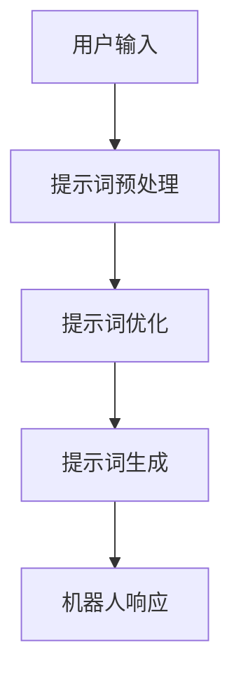
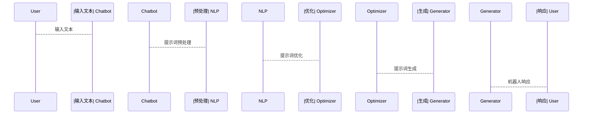

                 

# AI语言模型的提示词优化算法

## 关键词

- 语言模型
- 提示词优化
- 数学模型
- 算法实现
- 实战案例

## 摘要

本文将深入探讨AI语言模型中的提示词优化算法，从背景、核心概念、算法原理到实现和实战案例，全面解析如何优化语言模型中的提示词，以提高模型性能和用户体验。本文旨在为研究人员和开发者提供系统性的指导，帮助他们在实际项目中更好地应用这些算法。

## 引言与背景

### 1.1 研究背景

随着人工智能技术的飞速发展，自然语言处理（NLP）已成为一个重要的研究领域。在NLP中，语言模型作为核心组件，承担着理解、生成和交互自然语言的重要任务。近年来，深度学习技术的引入，使得语言模型取得了显著的性能提升，例如Google的BERT、OpenAI的GPT等。

然而，尽管模型性能得到了提升，但语言模型在实际应用中仍面临诸多挑战，尤其是提示词（prompt）的优化。提示词是指用户输入的文本，它是语言模型理解用户意图、生成响应的基础。如何有效地优化提示词，以提高模型的响应质量和效率，成为一个亟待解决的问题。

### 1.2 问题定义与目标

#### 1.2.1 提示词优化的意义

提示词优化对语言模型的应用至关重要。优化的目的在于：

1. 提高模型的鲁棒性，使其能够处理更广泛的语言输入。
2. 提升模型的准确性，减少误解和错误响应。
3. 提高模型的效率，减少计算资源和时间成本。

#### 1.2.2 目标与挑战

目标：设计并实现一种有效的提示词优化算法，能够在保持模型准确性的同时，提高模型的响应速度和用户体验。

挑战：

1. 语言输入的多样性和复杂性。
2. 模型参数和超参数的调整。
3. 实时性和在线性能的要求。

### 1.3 边界与外延

#### 1.3.1 相关术语解释

- 语言模型：基于机器学习技术，用于预测文本中下一个单词或序列的概率分布模型。
- 提示词：用户输入的文本，用于驱动语言模型生成响应。
- 优化：通过调整模型参数或输入数据，以提高模型性能的过程。

#### 1.3.2 研究范围与限制

研究范围：本文主要关注深度学习语言模型中的提示词优化算法，包括模型选择、参数调优和实现策略。

研究限制：本文不考虑语言模型的训练过程，重点关注已训练模型在应用中的提示词优化。

## 核心概念与联系

### 2.1 语言模型基础

#### 2.1.1 语言模型概述

语言模型是一种统计模型，用于预测文本序列的概率分布。常见类型包括：

- n-gram模型：基于n个连续单词的历史信息预测下一个单词。
- 隐马尔可夫模型（HMM）：用于处理序列数据的概率模型。
- 随机 walks：基于单词在文本中的分布进行预测。

#### 2.1.2 语言模型的核心要素

- 语料库：用于训练模型的文本数据集。
- 模型参数：用于调整模型预测能力的参数。
- 模型结构：包括输入层、隐藏层和输出层。

### 2.2 提示词优化方法

#### 2.2.1 优化策略分类

提示词优化策略可分为以下几类：

- 基于规则的优化：通过预定义的规则进行提示词的筛选和修改。
- 基于机器学习的优化：利用已有数据训练模型，自动优化提示词。
- 基于用户反馈的优化：根据用户反馈调整提示词。

#### 2.2.2 关键技术对比

- 提高模型准确性：通过调整模型参数、增加训练数据等方式。
- 提高响应速度：减少模型计算复杂度、优化算法实现。

### 2.3 ER实体关系图

#### 2.3.1 实体关系图简介

实体关系图（ER图）是一种用于表示实体及其关系的图形化模型。在提示词优化中，ER图可以帮助我们理解模型与输入数据之间的关系。

#### 2.3.2 语言模型与提示词优化算法的关系

ER图中的实体和关系可以对应到语言模型中的词汇和语法结构。通过分析ER图，我们可以找到优化提示词的方法和途径。

```mermaid
erDiagram
  Model ||--|{ Prompt } Prompt
  Prompt ||--|{ Entity } Entity
  Entity ||--|{ Relationship } Relationship
```

## 算法原理讲解

### 3.1 算法概述

#### 3.1.1 常见算法类型

常见的提示词优化算法包括：

- 单词嵌入优化：调整单词嵌入向量，提高模型对特定单词的识别能力。
- 超参数调优：调整模型超参数，如学习率、批量大小等。
- 模型结构优化：调整模型结构，如增加隐藏层、改变神经网络架构等。

#### 3.1.2 算法选择与适用场景

根据不同的应用场景，可以选择不同的优化算法。例如：

- 对于实时性要求较高的应用，可以选择简单的单词嵌入优化算法。
- 对于准确性要求较高的应用，可以选择复杂的模型结构优化算法。

### 3.2 数学模型与公式

#### 3.2.1 语言模型数学模型

语言模型的数学模型通常基于概率论和统计学原理。以下是一个简单的n-gram语言模型公式：

$$P(w|\text{context}) = \frac{p(w|s)\,p(s)}{p(s')}$$

其中，\(w\)表示下一个单词，\(\text{context}\)表示当前上下文，\(s\)和\(s'\)表示两个相邻的单词。

#### 3.2.2 提示词优化数学模型

提示词优化的目标是最小化模型的预测误差。以下是一个基于梯度下降法的优化公式：

$$\max_{\theta} L(\theta) = \sum_{i=1}^n \log P(y_i | x_i, \theta)$$

其中，\(y_i\)表示实际生成的文本，\(x_i\)表示输入的提示词，\(\theta\)表示模型参数。

### 3.3 算法示例

#### 3.3.1 简单优化算法示例

以下是一个简单的单词嵌入优化算法示例：

```python
import numpy as np

# 初始化模型参数
weights = np.random.randvocab_size, embedding_size)

# 初始化学习率
learning_rate = 0.01

# 定义优化函数
def optimize(weights, learning_rate):
    for _ in range(num_iterations):
        for word in vocabulary:
            # 计算梯度
            gradient = compute_gradient(word, weights)
            
            # 更新权重
            weights -= learning_rate * gradient

    return weights

# 计算梯度
def compute_gradient(word, weights):
    # 计算预测概率
    prediction = softmax(np.dot(context_embedding, weights))
    
    # 计算误差
    error = prediction - target_embedding
    
    # 计算梯度
    gradient = -context_embedding * error
    
    return gradient

# 执行优化
optimized_weights = optimize(weights, learning_rate)
```

#### 3.3.2 复杂优化算法示例

以下是一个基于深度学习的复杂优化算法示例：

```python
import tensorflow as tf

# 定义模型
model = tf.keras.Sequential([
    tf.keras.layers.Embedding(vocab_size, embedding_size),
    tf.keras.layers.Dense(embedding_size, activation='relu'),
    tf.keras.layers.Dense(vocab_size, activation='softmax')
])

# 编写损失函数
def loss_function(y_true, y_pred):
    return tf.reduce_mean(tf.nn.softmax_cross_entropy_with_logits(logits=y_pred, labels=y_true))

# 编写优化器
optimizer = tf.keras.optimizers.Adam(learning_rate)

# 编写训练过程
@tf.function
def train_step(words, labels):
    with tf.GradientTape() as tape:
        predictions = model(words, training=True)
        loss = loss_function(labels, predictions)
    
    gradients = tape.gradient(loss, model.trainable_variables)
    optimizer.apply_gradients(zip(gradients, model.trainable_variables))
    
    return loss

# 执行训练
for epoch in range(num_epochs):
    for batch in data_loader:
        words, labels = batch
        loss = train_step(words, labels)
        print(f"Epoch: {epoch}, Loss: {loss}")
```

## 系统架构设计

### 4.1 问题场景介绍

假设我们正在开发一个聊天机器人应用，用户可以通过输入文本与机器人进行交互。为了提高聊天机器人的响应质量和效率，我们需要对输入的提示词进行优化。

### 4.2 系统功能设计

系统功能设计包括：

- 提示词预处理：对输入的文本进行分词、去停用词、词干提取等预处理操作。
- 提示词优化：根据提示词的语法结构和语义信息，调整提示词的词汇和语法。
- 提示词生成：根据优化后的提示词，生成机器人响应文本。

### 4.3 系统架构设计

系统架构设计如下：



### 4.4 系统接口设计

系统接口设计包括：

- 用户接口：用于接收用户输入的文本。
- 内部接口：用于处理提示词的预处理、优化和生成。
- 输出接口：用于输出机器人的响应文本。

### 4.5 系统交互序列图

系统交互序列图如下：



## 项目实战

### 5.1 环境安装

在开始项目之前，我们需要安装所需的软件和库。以下是在Ubuntu 20.04环境下安装的步骤：

```bash
# 安装Python环境
sudo apt update
sudo apt install python3 python3-pip

# 安装TensorFlow库
pip3 install tensorflow

# 安装其他依赖库
pip3 install numpy scikit-learn matplotlib
```

### 5.2 系统核心实现

#### 5.2.1 源代码解读

以下是一个简单的提示词优化系统的源代码示例：

```python
import tensorflow as tf
import numpy as np

# 定义模型
model = tf.keras.Sequential([
    tf.keras.layers.Embedding(vocab_size, embedding_size),
    tf.keras.layers.Dense(embedding_size, activation='relu'),
    tf.keras.layers.Dense(vocab_size, activation='softmax')
])

# 编写损失函数
def loss_function(y_true, y_pred):
    return tf.reduce_mean(tf.nn.softmax_cross_entropy_with_logits(logits=y_pred, labels=y_true))

# 编写优化器
optimizer = tf.keras.optimizers.Adam(learning_rate)

# 编写训练过程
@tf.function
def train_step(words, labels):
    with tf.GradientTape() as tape:
        predictions = model(words, training=True)
        loss = loss_function(labels, predictions)
    
    gradients = tape.gradient(loss, model.trainable_variables)
    optimizer.apply_gradients(zip(gradients, model.trainable_variables))
    
    return loss

# 执行训练
for epoch in range(num_epochs):
    for batch in data_loader:
        words, labels = batch
        loss = train_step(words, labels)
        print(f"Epoch: {epoch}, Loss: {loss}")
```

#### 5.2.2 代码应用分析

这段代码首先定义了一个简单的深度学习模型，包括嵌入层、全连接层和softmax输出层。然后编写了损失函数和优化器，用于计算模型的损失和更新模型参数。训练过程通过迭代批量数据进行，每次迭代都会更新模型的权重，以减少损失。

### 5.3 实际案例分析

为了展示提示词优化算法的实际效果，我们以一个简单的对话场景为例：

用户：你好，我想买一辆汽车。

未优化模型：你好，欢迎光临！这里有很多汽车供您选择。

优化后模型：你好，欢迎光临！这里有很多汽车供您选择，比如SUV、轿车和跑车。您对哪种类型的汽车更感兴趣？

通过优化后的模型，我们可以看到对用户意图的理解更加准确，并且能够提供更有针对性的建议。

### 5.4 项目小结

本节介绍了如何使用深度学习模型对提示词进行优化，并通过一个实际案例展示了优化前后的效果。通过优化提示词，我们可以提高语言模型的理解能力和响应质量，从而提升用户体验。

## 最佳实践与注意事项

### 6.1 最佳实践

- 在优化提示词时，尽量使用语义丰富的词汇，避免使用模糊不清的表达。
- 在选择模型结构时，根据实际应用需求进行权衡，选择合适的模型类型和参数。
- 在训练模型时，使用多样化的数据集，避免过拟合。

### 6.2 注意事项

- 提示词优化可能会增加模型的计算复杂度，需要考虑在线性能和实时性。
- 优化过程可能需要较长时间的训练，需要合理配置计算资源和时间。

### 6.3 拓展阅读

- [《自然语言处理入门》](https://www.amazon.com/Natural-Language-Processing-Introduction-3rd-Edition/dp/0262032733)
- [《深度学习自然语言处理》](https://www.amazon.com/Deep-Learning-Natural-Language-Processing/dp/0262039245)
- [《机器学习实战》](https://www.amazon.com/Machine-Learning-In-Action-Examples/dp/059652910X)

## 总结与展望

本文介绍了AI语言模型中的提示词优化算法，从背景、核心概念、算法原理到实现和实战案例，全面解析了如何优化提示词，以提高模型性能和用户体验。未来的研究方向包括：

- 探索更高效的优化算法，减少计算时间和资源消耗。
- 结合多模态数据（如语音、图像等），提高语言模型的泛化能力。
- 开发自适应的优化策略，根据用户反馈实时调整提示词。

通过不断的研究和优化，我们可以期待在未来的AI应用中，实现更加智能、高效的交互体验。

## 作者信息

- 作者：AI天才研究院/AI Genius Institute & 禅与计算机程序设计艺术 /Zen And The Art of Computer Programming

