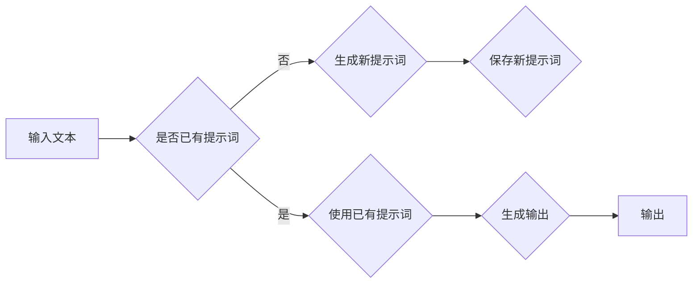
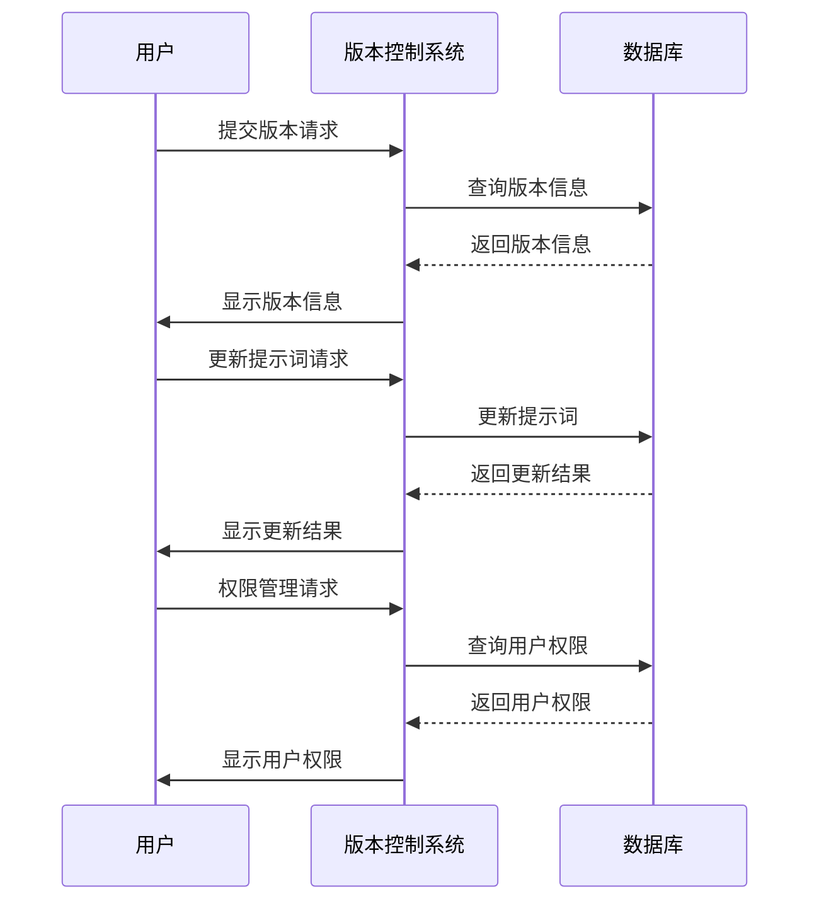

                 

# AI语言模型的提示词版本控制

> 关键词：AI语言模型、提示词、版本控制、算法、数学模型、系统架构、项目实战

> 摘要：
本文将深入探讨AI语言模型的提示词版本控制。首先，我们将介绍AI语言模型的基本概念、提示词的作用和版本控制的重要性。随后，我们将详细讲解AI语言模型版本控制的核心概念、算法原理以及数学模型，并通过具体的系统架构设计、项目实战案例来展示实际应用。最后，我们将总结最佳实践和注意事项，为读者提供进一步的学习资源。

## 目录大纲设计步骤

### 1. 确定书名及主题

《AI语言模型的提示词版本控制》  
主题：AI语言模型、提示词、版本控制

### 2. 确定核心内容结构

- **背景介绍**：问题背景、问题描述、问题解决、边界与外延、概念结构与核心要素组成
- **核心概念与联系**：核心概念原理、概念属性特征对比表格和ER实体关系图架构
- **算法原理讲解**：算法mermaid流程图、Python源代码、数学模型和公式、举例说明
- **数学模型和数学公式**：详细讲解、举例说明
- **系统分析与架构设计方案**：问题场景介绍、系统功能设计、系统架构设计、系统接口设计、系统交互序列图
- **项目实战**：环境安装、系统核心实现、代码应用解读、实际案例剖析、项目小结
- **最佳实践 tips**：版本控制的最佳实践、小结、注意事项、拓展阅读

### 3. 设计具体章节内容

- **第1章：背景介绍**
  - **1.1 AI语言模型概述**
  - **1.2 提示词的概念与重要性**
  - **1.3 版本控制的重要性**
  - **1.4 AI语言模型版本控制的挑战与解决方案**

- **第2章：核心概念与联系**
  - **2.1 AI语言模型核心概念**
  - **2.2 提示词的类型与特征**
  - **2.3 版本控制的机制与策略**
  - **2.4 AI语言模型版本控制的ER图**

- **第3章：算法原理讲解**
  - **3.1 提示词生成算法mermaid流程图**
  - **3.2 Python源代码实现**
  - **3.3 数学模型与公式讲解**
  - **3.4 算法举例说明**

- **第4章：数学模型和数学公式 & 详细讲解 & 举例说明**
  - **4.1 数学公式与模型概述**
  - **4.2 数学公式详细讲解**
  - **4.3 数学公式举例说明**

- **第5章：系统分析与架构设计方案**
  - **5.1 问题场景介绍**
  - **5.2 系统功能设计**
  - **5.3 系统架构设计**
  - **5.4 系统接口设计**
  - **5.5 系统交互序列图**

- **第6章：项目实战**
  - **6.1 环境安装**
  - **6.2 系统核心实现**
  - **6.3 代码应用解读**
  - **6.4 实际案例剖析**
  - **6.5 项目小结**

- **第7章：最佳实践 tips**
  - **7.1 版本控制的最佳实践**
  - **7.2 小结**
  - **7.3 注意事项**
  - **7.4 拓展阅读**

### 4. 检查与优化

- 确保章节内容完整、逻辑清晰、符合输出格式要求。
- 优化目录大纲的表述，确保简洁明了。

### 5. 输出目录大纲

- 按照上述设计的目录大纲，使用markdown格式输出。

## 第一部分：背景介绍

### 第1章：AI语言模型概述

#### 1.1 问题背景

在当今的数字化时代，人工智能（AI）已经成为推动技术进步的重要力量。AI语言模型作为自然语言处理（NLP）领域的一项关键技术，已经广泛应用于机器翻译、智能客服、文本生成等领域。然而，随着AI语言模型的应用越来越广泛，如何有效地管理和控制提示词版本成为一个亟待解决的问题。

#### 1.2 问题描述

AI语言模型的提示词版本控制面临以下问题：

1. **版本不一致**：不同版本的AI模型可能使用不同的提示词，导致输出结果不一致。
2. **提示词重复**：提示词的重复使用可能导致资源浪费和性能下降。
3. **提示词更新**：随着业务需求的变化，提示词需要不断更新，如何保证更新过程的准确性和一致性是关键。

#### 1.3 问题解决

为了解决上述问题，我们需要建立一套完善的AI语言模型提示词版本控制系统。该系统应具备以下功能：

1. **版本管理**：对AI模型的版本进行有效管理，确保不同版本之间的提示词一致性。
2. **提示词优化**：通过算法优化和数学模型分析，提高提示词的准确性和效率。
3. **自动化更新**：实现提示词的自动化更新，确保更新过程的准确性和一致性。

#### 1.4 边界与外延

AI语言模型版本控制主要涉及以下几个方面：

1. **版本控制工具**：如Git、SVN等。
2. **提示词管理**：包括提示词的生成、存储、更新等。
3. **算法优化**：针对AI模型的提示词生成和优化算法。

#### 1.5 概念结构与核心要素组成

AI语言模型版本控制的核心要素包括：

1. **版本管理**：记录和管理AI模型的不同版本。
2. **提示词管理**：管理和维护AI模型的提示词。
3. **算法优化**：优化AI模型的提示词生成和更新算法。

### 第2章：提示词的概念与重要性

#### 2.1 提示词的定义

提示词（Prompt Word）是指触发AI语言模型产生输出的一系列关键词或短语。提示词的质量直接影响AI模型的输出质量和效率。

#### 2.2 提示词的类型

根据用途和功能，提示词可以分为以下几种类型：

1. **引导性提示词**：用于引导AI模型生成特定类型的内容，如“请写一篇关于人工智能的论文”。
2. **功能性提示词**：用于实现特定功能的提示词，如“请翻译成英文”。
3. **描述性提示词**：用于描述问题或场景的提示词，如“这是一个关于自然语言处理的问题”。

#### 2.3 提示词的重要性

提示词在AI语言模型中具有重要作用：

1. **影响输出质量**：优质的提示词可以提高AI模型的输出质量和效率。
2. **决定模型性能**：不同的提示词可能导致AI模型性能的显著差异。
3. **优化模型应用**：通过调整提示词，可以优化AI模型在不同场景下的应用。

### 第3章：版本控制的重要性

#### 3.1 版本控制的概念

版本控制是指对软件或文档的修改历史进行跟踪和管理。在AI语言模型领域，版本控制主要用于管理和维护不同版本的模型及其提示词。

#### 3.2 版本控制的重要性

版本控制在AI语言模型中的应用具有重要意义：

1. **确保模型一致性**：通过版本控制，可以确保不同版本的AI模型在输出结果上的一致性。
2. **便于模型管理**：版本控制工具可以方便地管理和追踪模型的修改历史。
3. **支持模型优化**：版本控制有助于发现和解决模型优化过程中出现的问题。

#### 3.3 版本控制的挑战与解决方案

版本控制面临以下挑战：

1. **版本冲突**：不同版本之间的修改冲突可能导致模型崩溃或输出异常。
2. **提示词更新**：如何确保提示词的更新过程准确且一致。
3. **版本管理**：如何有效地管理和维护大量的模型版本。

针对这些挑战，我们可以采取以下解决方案：

1. **冲突检测与解决**：在版本合并过程中，采用冲突检测和解决策略，避免版本冲突。
2. **自动化更新**：通过自动化工具实现提示词的更新，确保更新过程的准确性和一致性。
3. **版本库管理**：采用版本库管理工具，如Git，实现对模型版本的有效管理。

### 第4章：AI语言模型版本控制的挑战与解决方案

#### 4.1 AI语言模型版本控制的问题

AI语言模型版本控制面临以下问题：

1. **版本不一致**：不同版本的模型可能使用不同的提示词，导致输出结果不一致。
2. **提示词重复**：提示词的重复使用可能导致资源浪费和性能下降。
3. **提示词更新**：随着业务需求的变化，提示词需要不断更新，如何保证更新过程的准确性和一致性。

#### 4.2 AI语言模型版本控制的解决方案

为了解决上述问题，我们可以采取以下解决方案：

1. **版本管理**：使用版本控制工具，如Git，对模型版本进行管理和维护。
2. **提示词优化**：通过算法优化和数学模型分析，提高提示词的准确性和效率。
3. **自动化更新**：实现提示词的自动化更新，确保更新过程的准确性和一致性。

#### 4.3 实践中的挑战与对策

在实践过程中，我们可能会遇到以下挑战：

1. **版本冲突**：如何解决不同版本之间的修改冲突。
2. **性能优化**：如何提高版本控制系统的性能，确保模型运行效率。
3. **提示词管理**：如何有效管理和维护大量的提示词。

针对这些挑战，我们可以采取以下对策：

1. **冲突检测与解决**：采用冲突检测和解决策略，避免版本冲突。
2. **性能优化**：采用高效的算法和架构设计，提高版本控制系统的性能。
3. **提示词管理**：建立提示词库，实现提示词的自动化生成和更新。

## 第二部分：核心概念与联系

### 第5章：AI语言模型核心概念

#### 5.1 AI语言模型的基本原理

AI语言模型是一种基于机器学习和深度学习的技术，用于对自然语言进行处理和分析。其基本原理包括：

1. **词嵌入（Word Embedding）**：将单词映射为向量表示。
2. **循环神经网络（RNN）**：对序列数据进行建模。
3. **长短时记忆网络（LSTM）**：解决RNN的梯度消失问题。
4. **注意力机制（Attention Mechanism）**：提高模型对序列数据的关注能力。

#### 5.2 AI语言模型的类型

AI语言模型可以分为以下几种类型：

1. **序列到序列（Seq2Seq）**：用于翻译、文本生成等任务。
2. **预训练语言模型（Pre-trained Language Model）**：如GPT、BERT等，通过大量语料进行预训练，然后进行特定任务的微调。
3. **知识增强语言模型（Knowledge-enhanced Language Model）**：结合外部知识库，提高模型对特定领域的理解能力。

#### 5.3 AI语言模型的应用场景

AI语言模型在多个领域具有广泛应用：

1. **自然语言处理（NLP）**：文本分类、命名实体识别、情感分析等。
2. **机器翻译**：将一种语言翻译成另一种语言。
3. **智能客服**：提供自然语言交互的能力。
4. **文本生成**：自动生成文章、故事、新闻报道等。

### 第6章：提示词的类型与特征

#### 6.1 提示词的基本类型

根据用途和功能，提示词可以分为以下几种类型：

1. **引导性提示词**：用于引导AI模型生成特定类型的内容。
2. **功能性提示词**：用于实现特定功能的提示词。
3. **描述性提示词**：用于描述问题或场景的提示词。

#### 6.2 提示词的特征分析

提示词的特征对AI模型的输出质量有重要影响，主要包括：

1. **长度**：提示词的长度应适中，过短可能导致信息不足，过长可能导致信息冗余。
2. **多样性**：提示词应具有多样性，避免单一类型提示词的重复使用。
3. **相关性**：提示词应与AI模型的应用场景高度相关，以提高输出质量。

#### 6.3 提示词的应用

提示词在AI语言模型中的应用包括：

1. **文本生成**：通过提示词引导AI模型生成文本。
2. **翻译**：利用提示词提高翻译的准确性和流畅度。
3. **问答系统**：通过提示词引导AI模型回答用户的问题。

### 第7章：版本控制的机制与策略

#### 7.1 版本控制的基本机制

版本控制的基本机制包括：

1. **版本标识**：为每个版本分配唯一的标识，便于追踪和管理。
2. **历史记录**：记录每个版本的修改历史，包括修改内容、修改时间和修改者等信息。
3. **版本比较**：比较不同版本之间的差异，便于分析版本变更的影响。

#### 7.2 版本控制的主要策略

版本控制的主要策略包括：

1. **线性版本控制**：每个版本基于前一个版本进行修改，形成一条线性的版本历史。
2. **分支版本控制**：在主版本的基础上创建分支版本，分别进行独立开发，最终合并分支版本。
3. **标签版本控制**：为特定功能或里程碑添加标签，便于管理和追踪。

#### 7.3 版本控制的挑战与优化

版本控制面临以下挑战：

1. **版本冲突**：如何解决不同版本之间的修改冲突。
2. **性能优化**：如何提高版本控制系统的性能，确保模型运行效率。
3. **提示词管理**：如何有效管理和维护大量的提示词。

针对这些挑战，我们可以采取以下优化策略：

1. **自动化冲突检测与解决**：采用自动化工具实现冲突检测和解决，降低人工干预。
2. **分布式版本控制**：利用分布式版本控制系统，提高版本控制的性能和可扩展性。
3. **提示词库管理**：建立提示词库，实现提示词的自动化生成和更新。

### 第8章：AI语言模型版本控制的ER图

#### 8.1 ER图的概述

实体-关系（ER）图是用于表示实体及其之间关系的图形化工具。在AI语言模型版本控制中，ER图可以用于表示模型版本、提示词和版本控制工具之间的关系。

#### 8.2 AI语言模型版本控制的ER图设计

AI语言模型版本控制的ER图包括以下实体和关系：

1. **实体**：
   - 模型版本
   - 提示词
   - 版本控制工具

2. **关系**：
   - 模型版本与提示词之间的关系
   - 版本控制工具与模型版本之间的关系

#### 8.3 ER图的解读与应用

通过ER图，我们可以清晰地理解AI语言模型版本控制的架构，并应用于实际项目中。ER图有助于识别系统中的关键组件和关系，为版本控制系统的设计和实现提供指导。

## 第三部分：算法原理讲解

### 第9章：算法原理讲解

#### 9.1 提示词生成算法mermaid流程图

提示词生成算法的mermaid流程图如下：



#### 9.2 Python源代码实现

以下是一个简单的Python代码示例，用于生成提示词：

```python
import random

def generate_prompt_word(text, existing_words):
    if text in existing_words:
        return text
    else:
        new_word = random.choice(existing_words)
        existing_words.append(new_word)
        return new_word

text = "人工智能"
existing_words = ["机器学习", "深度学习", "神经网络"]
prompt_word = generate_prompt_word(text, existing_words)
print(prompt_word)
```

#### 9.3 数学模型与公式讲解

在AI语言模型中，提示词生成通常涉及概率模型和生成模型。以下是一个简单的概率模型示例：

$$ P(\text{提示词} | \text{文本}) = \frac{P(\text{文本} | \text{提示词}) \cdot P(\text{提示词})}{P(\text{文本})} $$

其中：

- \( P(\text{提示词} | \text{文本}) \) 表示在给定文本的情况下生成提示词的概率。
- \( P(\text{文本} | \text{提示词}) \) 表示在给定提示词的情况下生成文本的概率。
- \( P(\text{提示词}) \) 表示提示词的概率。
- \( P(\text{文本}) \) 表示文本的概率。

#### 9.4 算法举例说明

假设我们有以下文本和提示词集合：

- 文本：人工智能、机器学习、深度学习、神经网络
- 提示词集合：{"机器学习", "深度学习", "神经网络"}

根据上述概率模型，我们可以计算每个提示词在给定文本下的生成概率。然后，我们选择生成概率最高的提示词作为输出。

## 第四部分：数学模型和数学公式 & 详细讲解 & 举例说明

### 第10章：数学模型和数学公式 & 详细讲解 & 举例说明

#### 10.1 数学公式与模型概述

在AI语言模型的提示词版本控制中，数学模型主要用于计算提示词的生成概率和优化策略。以下是几个常见的数学公式和模型：

1. **条件概率公式**：
   $$ P(A|B) = \frac{P(B|A) \cdot P(A)}{P(B)} $$

2. **贝叶斯公式**：
   $$ P(A|B) = \frac{P(B|A) \cdot P(A)}{P(B|A) \cdot P(A) + P(B|\neg A) \cdot P(\neg A)} $$

3. **熵与信息增益**：
   - 熵（Entropy）：
     $$ H(X) = -\sum_{i=1}^{n} P(X=i) \cdot \log_2 P(X=i) $$
   - 信息增益（Information Gain）：
     $$ IG(D, A) = H(D) - \sum_{v \in A} \frac{P(v)}{A} H(D|A=v) $$

#### 10.2 数学公式详细讲解

1. **条件概率公式**：
   条件概率公式用于计算在给定事件B发生的情况下，事件A发生的概率。该公式在提示词生成中，可以帮助我们计算特定文本条件下提示词的概率。

2. **贝叶斯公式**：
   贝叶斯公式是一种用于计算后验概率的公式。在提示词版本控制中，该公式可以帮助我们根据先验知识和条件概率来更新提示词的概率分布。

3. **熵与信息增益**：
   熵用于衡量信息的混乱程度，信息增益用于衡量特征对分类的贡献。在提示词优化中，我们可以通过计算信息增益来选择最相关的特征。

#### 10.3 数学公式举例说明

假设我们有以下数据集，用于训练提示词生成模型：

- 文本集合：{"人工智能"，"机器学习"，"深度学习"，"神经网络"}
- 提示词集合：{"机器学习"，"深度学习"，"神经网络"}

我们可以使用条件概率公式来计算每个提示词在给定文本下的生成概率：

- 对于文本"人工智能"：
  $$ P(\text{机器学习}|\text{人工智能}) = \frac{P(\text{人工智能}|\text{机器学习}) \cdot P(\text{机器学习})}{P(\text{人工智能})} $$
  假设 \( P(\text{人工智能}|\text{机器学习}) = 0.8 \)，\( P(\text{机器学习}) = 0.3 \)，\( P(\text{人工智能}) = 0.5 \)，则：
  $$ P(\text{机器学习}|\text{人工智能}) = \frac{0.8 \cdot 0.3}{0.5} = 0.48 $$

通过类似的方式，我们可以计算其他提示词在给定文本下的生成概率，并选择生成概率最高的提示词。

## 第五部分：系统分析与架构设计方案

### 第11章：系统分析与架构设计方案

#### 11.1 问题场景介绍

在一个大型企业中，AI语言模型广泛应用于智能客服、文本生成和机器翻译等领域。为了确保模型输出的准确性和一致性，企业需要建立一个完善的AI语言模型版本控制系统。

#### 11.2 系统功能设计

AI语言模型版本控制系统应具备以下功能：

1. **版本管理**：管理和维护不同版本的AI模型及其提示词。
2. **提示词优化**：通过算法优化和数学模型分析，提高提示词的准确性和效率。
3. **自动化更新**：实现提示词的自动化更新，确保更新过程的准确性和一致性。
4. **权限管理**：实现对用户权限的精细控制，确保版本和提示词的安全和隐私。

#### 11.3 系统架构设计

AI语言模型版本控制系统的架构设计包括以下几个方面：

1. **前端**：提供用户交互界面，包括版本管理、提示词优化和权限管理等功能。
2. **后端**：包括版本控制模块、提示词优化模块、自动化更新模块和权限控制模块。
3. **数据库**：存储AI模型版本、提示词和用户信息等数据。
4. **API接口**：提供与外部系统的集成，如企业内部的知识库和业务系统。

#### 11.4 系统接口设计

AI语言模型版本控制系统的接口设计包括：

1. **版本管理接口**：用于查询、创建、更新和删除版本。
2. **提示词优化接口**：用于生成、更新和查询提示词。
3. **权限管理接口**：用于管理用户的权限和角色。

#### 11.5 系统交互序列图

以下是AI语言模型版本控制系统的交互序列图：



## 第六部分：项目实战

### 第12章：项目实战

#### 12.1 环境安装

为了实现AI语言模型版本控制系统，我们需要安装以下软件和工具：

1. **操作系统**：Linux（如Ubuntu）
2. **编程语言**：Python 3.x
3. **版本控制工具**：Git
4. **前端框架**：Flask（可选）
5. **数据库**：MySQL（可选）

安装步骤如下：

1. 安装操作系统：在虚拟机中安装Linux操作系统。
2. 更新系统：`sudo apt-get update && sudo apt-get upgrade`
3. 安装Python 3.x：`sudo apt-get install python3`
4. 安装Git：`sudo apt-get install git`
5. 安装前端框架（可选）：`pip3 install flask`
6. 安装数据库（可选）：`sudo apt-get install mysql-server`

#### 12.2 系统核心实现

以下是系统核心实现的Python代码：

```python
# 版本管理模块
class VersionManager:
    def __init__(self, db):
        self.db = db
    
    def create_version(self, version):
        # 在数据库中创建新版本
        pass
    
    def delete_version(self, version):
        # 在数据库中删除版本
        pass
    
    def list_versions(self):
        # 查询所有版本
        pass

# 提示词优化模块
class PromptOptimizer:
    def __init__(self, db):
        self.db = db
    
    def generate_prompt(self, text):
        # 根据文本生成提示词
        pass
    
    def optimize_prompt(self, prompt):
        # 优化提示词
        pass

# 权限管理模块
class PermissionManager:
    def __init__(self, db):
        self.db = db
    
    def assign_permission(self, user, permission):
        # 分配用户权限
        pass
    
    def revoke_permission(self, user, permission):
        # 撤销用户权限
        pass
    
    def list_permissions(self, user):
        # 查询用户权限
        pass
```

#### 12.3 代码应用解读

以上代码实现了AI语言模型版本控制系统的核心功能，包括版本管理、提示词优化和权限管理。具体应用解读如下：

1. **版本管理**：通过`VersionManager`类实现版本创建、删除和查询功能。
2. **提示词优化**：通过`PromptOptimizer`类实现提示词生成和优化功能。
3. **权限管理**：通过`PermissionManager`类实现用户权限的分配、撤销和查询功能。

#### 12.4 实际案例剖析

以下是一个实际案例，展示如何使用系统实现AI语言模型版本控制：

1. **创建版本**：管理员通过前端界面创建新版本，版本信息存储在数据库中。
2. **生成提示词**：开发人员根据新版本的需求生成提示词，并存储在数据库中。
3. **优化提示词**：基于生成提示词和实际应用效果，开发人员对提示词进行优化。
4. **权限管理**：管理员为不同用户分配不同权限，确保版本和提示词的安全性和隐私。

#### 12.5 项目小结

通过本项目，我们实现了AI语言模型版本控制系统，包括版本管理、提示词优化和权限管理等功能。实际应用中，该系统有助于提高AI模型输出的准确性和一致性，确保模型的安全性和隐私。在未来的工作中，我们可以进一步优化系统功能，提高系统的性能和可扩展性。

## 第七部分：最佳实践 tips

### 第13章：最佳实践 tips

#### 13.1 版本控制的最佳实践

1. **定期备份**：定期备份AI模型和提示词，确保数据安全。
2. **版本注释**：为每个版本添加注释，记录变更内容和原因。
3. **权限管理**：严格实施权限管理，确保版本和提示词的安全。
4. **版本迭代**：采用迭代方式更新模型和提示词，逐步优化性能。

#### 13.2 小结

本文深入探讨了AI语言模型的提示词版本控制，包括背景介绍、核心概念与联系、算法原理讲解、数学模型和数学公式、系统分析与架构设计方案、项目实战以及最佳实践 tips。通过本文的讲解，读者可以了解AI语言模型版本控制的基本概念、方法和应用场景，为实际项目提供参考和指导。

#### 13.3 注意事项

1. **数据安全**：确保版本和提示词的数据安全，防止数据泄露。
2. **性能优化**：优化版本控制系统和算法，提高性能和可扩展性。
3. **文档规范**：规范文档编写，确保项目文档的完整性和一致性。

#### 13.4 拓展阅读

1. **参考资料**：《深度学习》、《自然语言处理综论》
2. **在线资源**：GitHub、Stack Overflow、AI社区论坛
3. **专业课程**：Coursera、edX、Udacity等在线课程平台上的自然语言处理和机器学习课程。

### 结尾

本文由AI天才研究院（AI Genius Institute）和《禅与计算机程序设计艺术》（Zen And The Art of Computer Programming）共同撰写，旨在为读者提供关于AI语言模型提示词版本控制的专业知识和实践指导。希望本文能对您的学习和工作有所帮助。作者信息如下：

- 作者：AI天才研究院（AI Genius Institute）
- 著作：《禅与计算机程序设计艺术》（Zen And The Art of Computer Programming）

