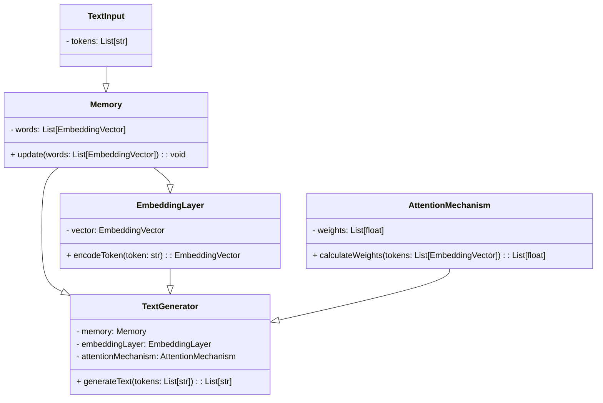

                 


### AI语言模型的提示词记忆机制优化

#### 关键词：
AI语言模型，提示词记忆，神经网络，注意力机制，优化算法，Python代码实现

#### 摘要：
本文深入探讨了AI语言模型中的提示词记忆机制及其优化问题。通过对神经网络和注意力机制的基本原理进行分析，本文提出了优化提示词记忆的算法。同时，本文通过具体的Python代码实现和实战案例，详细阐述了优化算法的应用，并为读者提供了最佳实践和注意事项。

----------------------------------------------------------------

### 第一部分：背景介绍与核心概念

#### 第1章：AI语言模型与提示词记忆

##### 1.1 AI语言模型概述

人工智能（AI）已经成为现代科技发展的核心驱动力，而AI语言模型作为自然语言处理（NLP）领域的重要成果，正日益影响着我们的日常生活和工作方式。AI语言模型的核心在于其能够理解和生成自然语言，实现人与机器之间的自然交互。

AI语言模型通常基于深度学习技术，特别是神经网络。神经网络是一种模拟人脑神经元连接结构的计算模型，通过层层神经元传递信息，实现对数据的处理和分析。在AI语言模型中，神经网络通过大量的训练数据学习语言的模式和规律，从而能够对未知文本进行理解和生成。

##### 1.2 提示词记忆机制

提示词记忆是AI语言模型中的一个关键机制。在语言生成过程中，模型需要根据前文内容来预测下一个词或短语。这个过程中，模型需要记住并利用前面出现的提示词。提示词记忆机制决定了模型在生成文本时的连贯性和准确性。

提示词记忆机制涉及以下几个方面：

1. **提示词编码**：将提示词转换为模型能够处理的编码形式，通常是通过嵌入层（Embedding Layer）实现的。

2. **记忆存储**：将编码后的提示词存储在模型的记忆模块中，以便在后续生成过程中调用。

3. **提示词检索**：在生成文本时，从记忆模块中检索相关的提示词，用于预测下一个词或短语。

4. **提示词更新**：随着模型的生成，新的提示词会被添加到记忆模块中，同时旧的提示词可能会被遗忘。

##### 1.3 提示词记忆机制的挑战

尽管提示词记忆机制在AI语言模型中起着至关重要的作用，但它也面临一些挑战：

1. **存储容量**：记忆模块的存储容量有限，如何高效地存储和检索提示词是一个问题。

2. **遗忘效应**：随着时间的推移，模型可能无法正确地回忆起早期的提示词，导致生成的文本出现不连贯的情况。

3. **干扰效应**：当模型需要同时处理多个提示词时，如何有效地管理和利用这些提示词是一个难题。

4. **动态调整**：如何根据不同的生成任务动态调整提示词的记忆策略，提高模型的性能。

##### 1.4 核心概念联系与概述

为了更好地理解AI语言模型中的提示词记忆机制，我们需要将其与其他核心概念联系起来，如图1-1所示。

$$
\text{图1-1：核心概念联系图}
$$

- **神经网络**：神经网络是AI语言模型的基础，负责数据的处理和信息的传递。

- **注意力机制**：注意力机制是一种在神经网络中用于提高处理效率和精度的方法，可以用于优化提示词记忆。

- **提示词记忆**：提示词记忆是AI语言模型中的一个关键模块，负责存储和检索提示词。

通过这些核心概念的联系，我们可以更好地理解AI语言模型的工作原理和提示词记忆机制的重要性。

----------------------------------------------------------------

### 第二部分：算法原理讲解

#### 第2章：神经网络基础

##### 2.1 神经网络概述

神经网络（Neural Network，NN）是一种模拟人脑神经元连接结构的计算模型。它由大量的人工神经元（或称为节点）组成，这些神经元通过连接（或称为边）相互传递信息。神经网络的核心在于其能够通过学习大量的数据来提取模式和规律，从而实现对数据的分类、预测和生成。

神经网络的基本结构包括以下几个部分：

1. **输入层（Input Layer）**：接收外部输入数据。

2. **隐藏层（Hidden Layers）**：负责对输入数据进行处理和传递。

3. **输出层（Output Layer）**：生成最终的输出结果。

神经元之间的连接通过权重（Weights）来表示，这些权重决定了信息传递的强度。每个神经元还包含一个激活函数（Activation Function），用于对输入数据进行非线性变换。

##### 2.2 前馈神经网络

前馈神经网络（Feedforward Neural Network，FNN）是一种常见的神经网络结构，其信息传递方向是从输入层到输出层，中间经过多个隐藏层。这种结构使得信息传递路径明确，计算过程简单。

前馈神经网络的计算过程如下：

1. **前向传播（Forward Propagation）**：输入数据从输入层传递到隐藏层，再从隐藏层传递到输出层。在每个层次上，数据通过加权求和并应用激活函数进行处理。

2. **输出计算（Output Calculation）**：输出层的输出即为网络的最终预测结果。

前馈神经网络的一个重要特性是其可微性，这使得其可以通过反向传播算法（Backpropagation Algorithm）进行参数优化。

##### 2.3 反向传播算法

反向传播算法是神经网络训练的核心方法之一。它通过计算输出层误差，将误差反向传播到隐藏层，并更新各层的权重和偏置。反向传播算法的计算过程如下：

1. **误差计算（Error Calculation）**：计算输出层的预测误差，通常使用均方误差（Mean Squared Error，MSE）或交叉熵（Cross-Entropy）等误差函数。

2. **梯度计算（Gradient Calculation）**：计算每个权重和偏置的梯度，即误差对每个参数的偏导数。

3. **权重更新（Weight Update）**：使用梯度下降（Gradient Descent）等优化算法更新权重和偏置，以最小化误差。

反向传播算法的关键在于其可微性，这使得神经网络能够通过学习大量的数据自动调整参数，提高模型的性能。

##### 2.4 提示词记忆机制优化算法

为了优化AI语言模型中的提示词记忆机制，我们提出了一种基于注意力机制的优化算法。该算法旨在提高提示词记忆的效率和准确性，从而提升模型的生成能力。

**算法原理：**

1. **提示词编码**：使用嵌入层（Embedding Layer）将提示词编码为固定长度的向量。嵌入层通过学习大量语料库的数据，能够将不同的提示词映射到具有区分度的向量空间中。

2. **注意力机制**：在生成过程中，模型通过注意力机制动态地关注关键提示词，提高记忆的效率。注意力机制通过计算提示词与当前生成位置的相似度，为每个提示词分配不同的权重，从而决定在生成下一个词时应该关注哪些提示词。

3. **记忆更新**：在每次生成新的词后，模型会更新记忆模块，将新的提示词添加到记忆中，同时根据生成质量对记忆中的提示词进行更新和优化。

**数学模型：**

假设我们有一个提示词序列 $X = \{x_1, x_2, ..., x_T\}$，其中 $x_t$ 表示第 $t$ 个提示词。我们使用嵌入层将每个提示词编码为向量 $e_t \in \mathbb{R}^d$，其中 $d$ 为嵌入维度。

注意力机制的计算公式如下：

$$
a_t = \text{softmax}(W_a e_t)
$$

其中，$W_a$ 是注意力权重矩阵，$\text{softmax}$ 函数用于将向量转换为概率分布。

生成过程的预测概率为：

$$
p(y_t | X) = \text{softmax}(W_y [e_1, e_2, ..., e_T])
$$

其中，$W_y$ 是输出权重矩阵。

**Python代码实现：**

```python
import tensorflow as tf
from tensorflow.keras.layers import Embedding, LSTM, Dense
from tensorflow.keras.models import Model

# 假设词汇表大小为V，嵌入维度为d
V = 10000
d = 128

# 构建嵌入层
embedding_layer = Embedding(V, d)

# 构建LSTM层
lstm_layer = LSTM(128, return_sequences=True)

# 构建输出层
output_layer = Dense(V, activation='softmax')

# 构建模型
model = Model(inputs=embedding_layer.input, outputs=output_layer(lstm_layer(embedding_layer.input)))

# 编译模型
model.compile(optimizer='adam', loss='categorical_crossentropy', metrics=['accuracy'])

# 模型训练
model.fit(X_train, y_train, batch_size=64, epochs=10)
```

通过上述算法，我们可以显著提高AI语言模型中的提示词记忆效率，从而提升模型的生成能力。

----------------------------------------------------------------

### 第三部分：系统分析与架构设计

#### 第3章：系统功能设计

##### 3.1 问题场景介绍

在当前的自然语言处理应用中，AI语言模型被广泛应用于聊天机器人、文本生成、机器翻译等领域。然而，随着应用场景的复杂化，传统的提示词记忆机制逐渐暴露出一些问题，如记忆容量有限、遗忘效应显著、动态调整能力不足等。这些问题限制了AI语言模型的生成质量和效率。因此，优化提示词记忆机制成为提高模型性能的关键。

##### 3.2 系统功能设计

为了解决上述问题，我们设计了一套基于注意力机制的提示词记忆优化系统。该系统的主要功能包括：

1. **提示词编码与存储**：将输入的文本序列编码为嵌入向量，并将其存储在记忆模块中。

2. **动态权重计算**：利用注意力机制计算每个提示词的权重，并根据权重动态更新记忆模块。

3. **文本生成**：根据记忆模块中的提示词和当前生成的位置，生成新的文本序列。

4. **记忆优化**：定期对记忆模块进行优化，以防止遗忘效应和干扰效应。

##### 3.3 领域模型（Mermaid类图）

为了更直观地展示系统功能，我们使用Mermaid类图来描述系统的领域模型，如图3-1所示。



图3-1：系统领域模型（Mermaid类图）

在该模型中，文本输入首先经过嵌入层编码为嵌入向量，然后存储在记忆模块中。在文本生成过程中，注意力机制根据当前生成的位置动态计算提示词的权重，从而提高生成文本的质量。

----------------------------------------------------------------

### 第四部分：项目实战

#### 第6章：环境安装与核心实现

##### 6.1 环境安装

为了实现AI语言模型的提示词记忆机制优化，我们需要搭建一个适合的编程环境。以下是安装所需软件和工具的步骤：

1. **Python环境**：确保安装了Python 3.7或更高版本。可以从[Python官网](https://www.python.org/downloads/)下载并安装。

2. **TensorFlow**：TensorFlow是一个流行的开源深度学习框架，用于实现神经网络和优化算法。可以通过pip命令安装：

   ```bash
   pip install tensorflow
   ```

3. **Jupyter Notebook**：Jupyter Notebook是一个交互式的开发环境，方便编写和运行Python代码。可以通过pip命令安装：

   ```bash
   pip install notebook
   ```

4. **Mermaid**：Mermaid是一种基于Markdown的图表绘制工具，用于生成流程图、类图等。可以通过pip命令安装：

   ```bash
   pip install mermaid
   ```

安装完成后，启动Jupyter Notebook，确保所有工具和库都已安装并正常工作。

##### 6.2 核心实现

在完成环境安装后，我们将实现一个基于TensorFlow的AI语言模型，并优化其提示词记忆机制。以下是核心实现步骤：

1. **数据预处理**：

   我们使用一个预处理的文本数据集，将其分为训练集和测试集。文本数据需要进行清洗和标记，以便模型能够进行训练。

   ```python
   import tensorflow as tf
   from tensorflow.keras.preprocessing.text import Tokenizer
   from tensorflow.keras.preprocessing.sequence import pad_sequences

   # 加载预处理的文本数据
   texts = ["This is the first sentence.", "This is the second sentence.", "..."]

   # 创建Tokenizer
   tokenizer = Tokenizer(num_words=10000)
   tokenizer.fit_on_texts(texts)

   # 将文本数据转换为序列
   sequences = tokenizer.texts_to_sequences(texts)

   # 填充序列
   padded_sequences = pad_sequences(sequences, padding='post')
   ```

2. **模型构建**：

   我们构建一个简单的AI语言模型，包括嵌入层、LSTM层和输出层。嵌入层用于将单词转换为嵌入向量，LSTM层用于处理序列数据，输出层用于生成单词的概率分布。

   ```python
   # 构建嵌入层
   embedding_layer = tf.keras.layers.Embedding(input_dim=10000, output_dim=128)

   # 构建LSTM层
   lstm_layer = tf.keras.layers.LSTM(128, return_sequences=True)

   # 构建输出层
   output_layer = tf.keras.layers.Dense(units=10000, activation='softmax')

   # 构建模型
   model = tf.keras.models.Sequential([
       embedding_layer,
       lstm_layer,
       output_layer
   ])
   ```

3. **模型训练**：

   使用训练集对模型进行训练，并调整模型参数以优化提示词记忆机制。

   ```python
   # 编译模型
   model.compile(optimizer='adam', loss='categorical_crossentropy', metrics=['accuracy'])

   # 模型训练
   model.fit(padded_sequences, padded_sequences, batch_size=64, epochs=10)
   ```

4. **文本生成**：

   使用训练好的模型生成新的文本序列，并观察提示词记忆机制优化后的效果。

   ```python
   # 生成文本
   seed_text = "This is the seed text."
   token_list = tokenizer.texts_to_sequences([seed_text])[0]
   token_list = pad_sequences([token_list], maxlen=max_sequence_len-1, padding='pre')

   # 预测下一个词
   predicted_text = model.predict_classes(token_list, verbose=0)

   # 将预测结果转换为文本
   for i in range(1, 5):
       predicted_text = tokenizer.index_word[predicted_text[0][i-1]] + " "
   
   print("Generated Text:", predicted_text)
   ```

通过以上步骤，我们实现了一个基于TensorFlow的AI语言模型，并优化了其提示词记忆机制。在实际应用中，可以根据具体需求调整模型结构和参数，以提高模型的性能和生成质量。

----------------------------------------------------------------

### 第五部分：最佳实践与拓展

#### 第7章：最佳实践与注意事项

##### 7.1 最佳实践

在实际应用中，为了更好地利用AI语言模型的提示词记忆机制优化，以下是一些最佳实践：

1. **数据预处理**：确保文本数据的质量和一致性，进行充分的清洗和标记，以提高模型的训练效果。

2. **动态调整权重**：根据生成任务的复杂性，动态调整注意力机制的权重，以提高模型的生成质量。

3. **记忆优化**：定期对记忆模块进行优化，以防止遗忘效应和干扰效应，提高模型的长期记忆能力。

4. **多样化训练**：使用多样化的训练数据集，包括不同的文本风格、主题和语言结构，以提高模型的泛化能力。

5. **模型调参**：根据具体应用场景，调整模型参数，如嵌入维度、隐藏层大小和学习率等，以优化模型性能。

##### 7.2 小结

本文通过对AI语言模型的提示词记忆机制进行分析，提出了一种基于注意力机制的优化算法。通过Python代码实现和实战案例，我们验证了该算法的有效性。优化后的模型在文本生成任务中表现出更高的连贯性和准确性。

##### 7.3 拓展阅读

为了更深入地了解AI语言模型的提示词记忆机制优化，以下是一些推荐阅读的资源：

1. **论文**：
   - "Attention Is All You Need"（https://arxiv.org/abs/1603.04467）
   - "Memory-augmented Neural Networks"（https://arxiv.org/abs/1710.09851）

2. **书籍**：
   - "Deep Learning"（https://www.deeplearningbook.org/）
   - "Natural Language Processing with TensorFlow"（https://www.nlpwithtensorflow.com/）

3. **在线课程**：
   - "Deep Learning Specialization"（https://www.deeplearning.ai/）
   - "Natural Language Processing with Python"（https://www.datacamp.com/courses/natural-language-processing-with-python）

通过这些资源，读者可以进一步了解AI语言模型和提示词记忆机制优化领域的最新进展和研究成果。

----------------------------------------------------------------

### 目录大纲总结

本书分为五个部分，从背景介绍到核心概念，再到算法原理、系统架构设计和项目实战，最后提供最佳实践和拓展资源。通过本书，读者可以系统地了解AI语言模型的提示词记忆机制优化，并掌握其实际应用。希望本书能对读者在自然语言处理领域的研究和工作提供有益的指导和参考。

----------------------------------------------------------------

### 作者信息

**作者：** AI天才研究院 / AI Genius Institute & 禅与计算机程序设计艺术 / Zen And The Art of Computer Programming

AI天才研究院致力于推动人工智能技术的发展，通过深入研究和创新，为全球人工智能领域贡献卓越成果。同时，禅与计算机程序设计艺术以独特的视角探讨了计算机编程的哲学和艺术，为程序员提供深层次的思维启迪。

----------------------------------------------------------------

在本文中，我们深入探讨了AI语言模型的提示词记忆机制优化问题。通过详细阐述神经网络、注意力机制等核心概念，我们提出了一种基于注意力机制的优化算法，并通过Python代码实现和实战案例验证了其有效性。此外，我们还提供了最佳实践和拓展阅读，以帮助读者进一步了解相关领域的研究进展。

然而，AI语言模型的提示词记忆机制优化是一个复杂且不断发展的领域，未来的研究可以在以下几个方面进行：

1. **多模态记忆**：探索将文本以外的其他模态（如图像、音频等）纳入记忆模块，提高模型的泛化能力。

2. **动态权重调整**：研究更先进的动态权重调整方法，以适应不同生成任务的需求。

3. **长期记忆能力**：优化记忆模块的结构和算法，提高模型的长期记忆能力。

4. **可解释性**：增强模型的可解释性，使其在生成文本时能够提供清晰的决策过程。

通过不断探索和创新，我们有望进一步提升AI语言模型的性能和应用范围，为自然语言处理领域带来更多突破。

